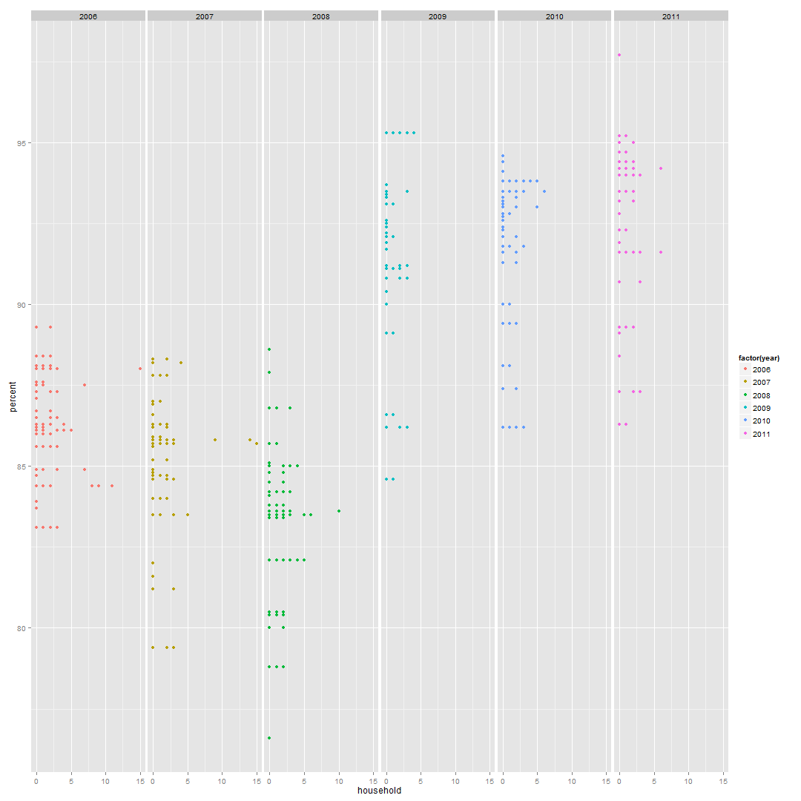
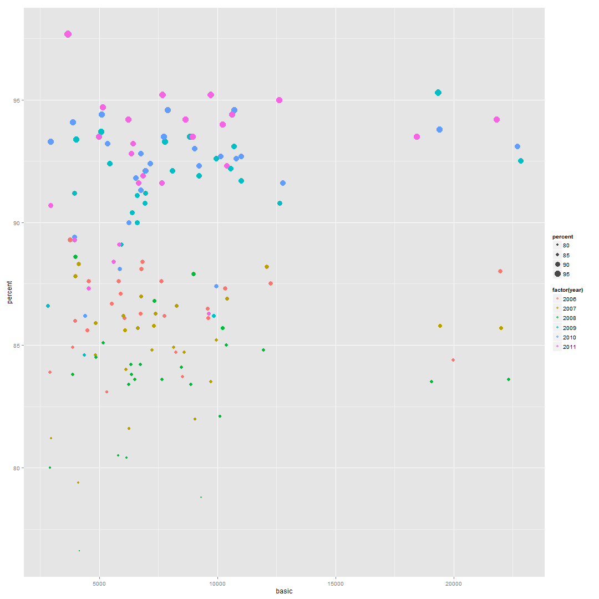
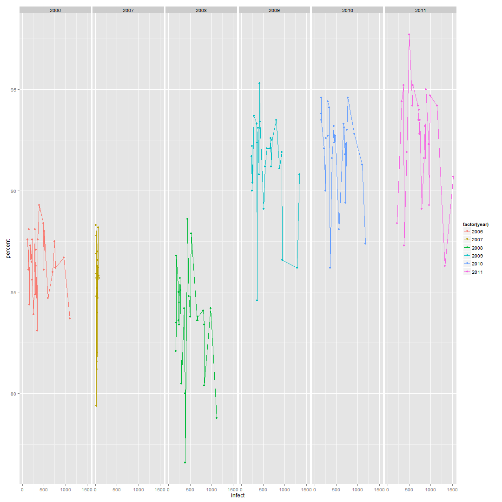
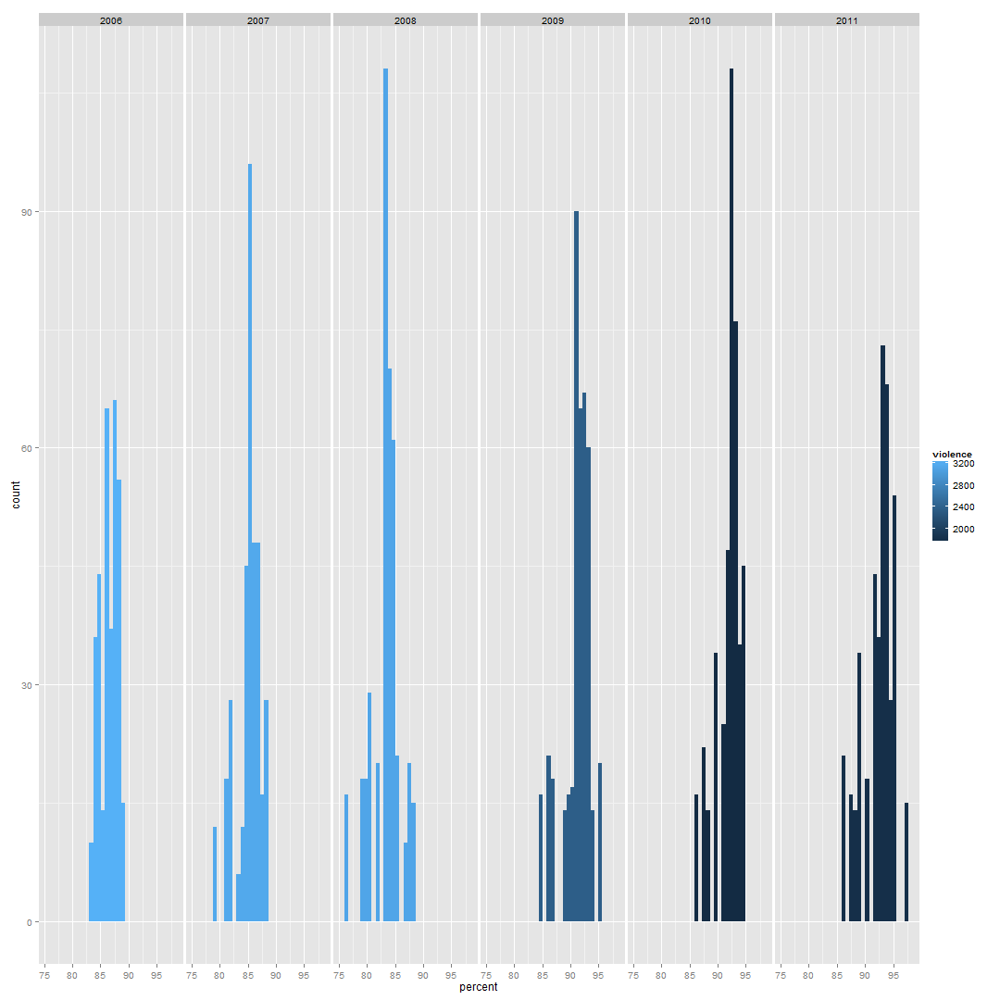
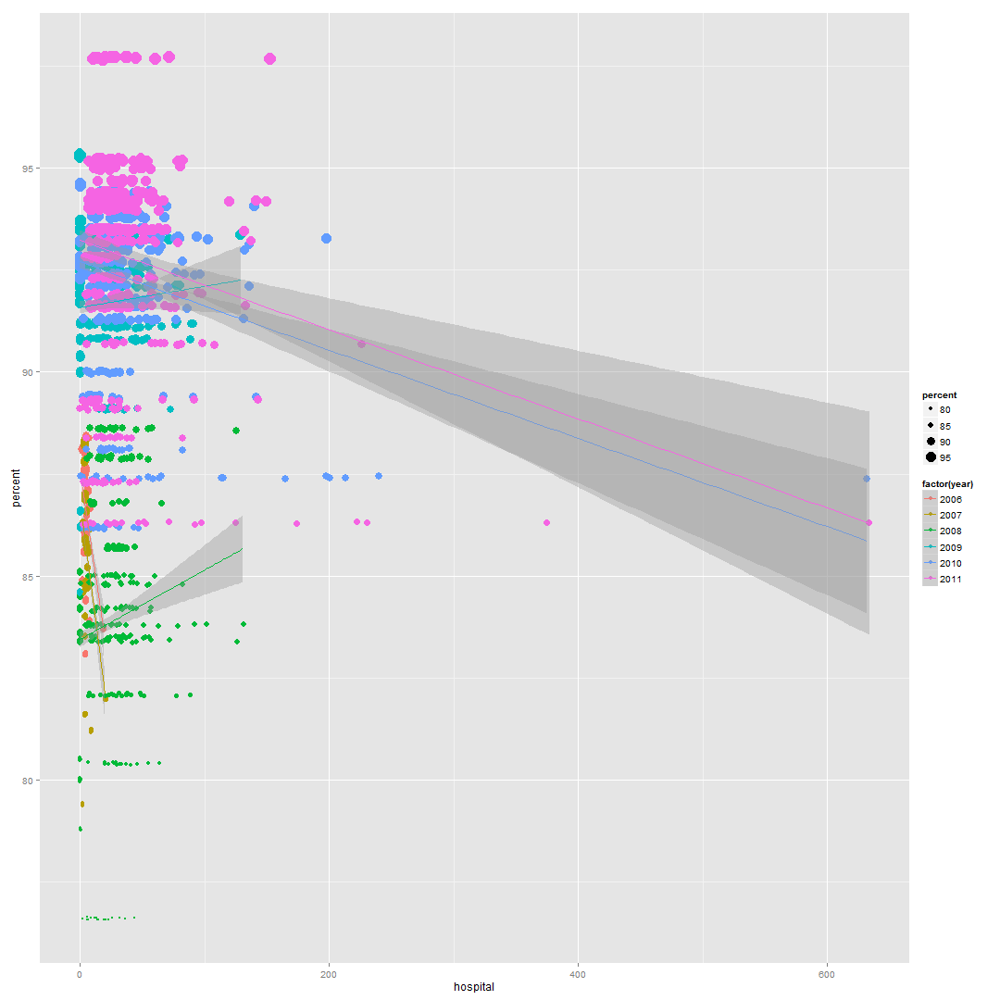
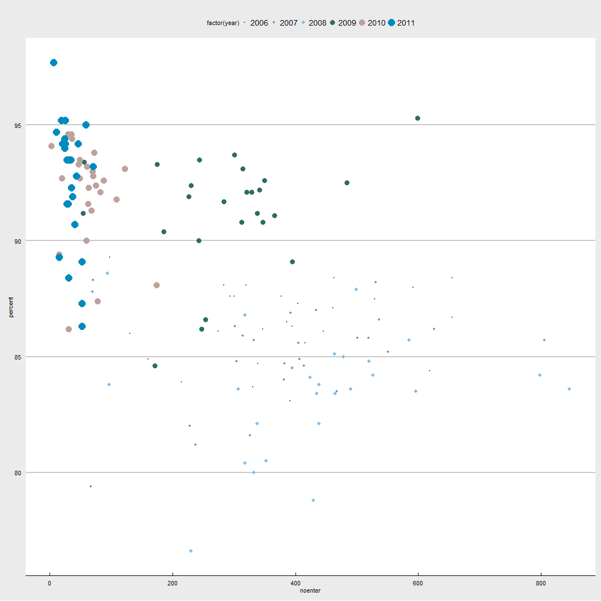
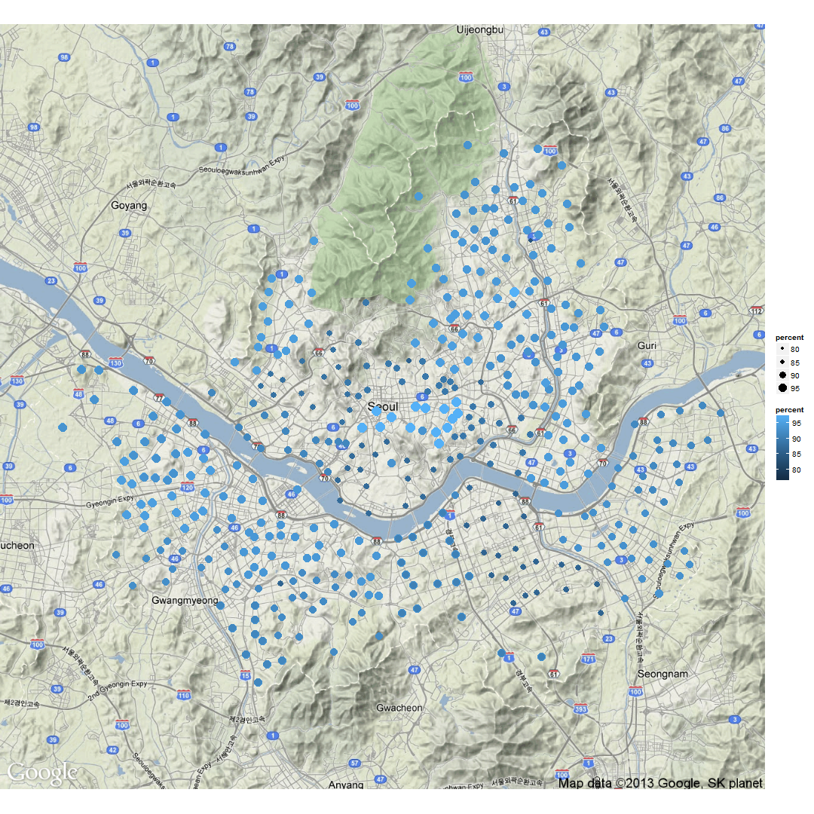
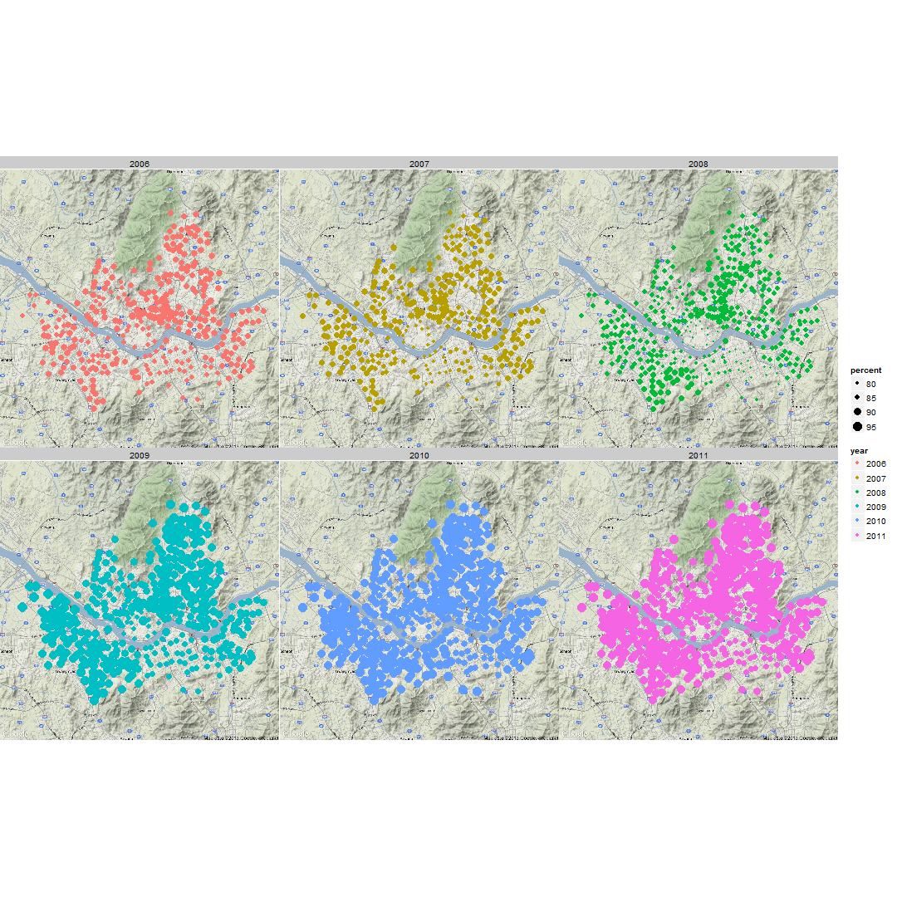
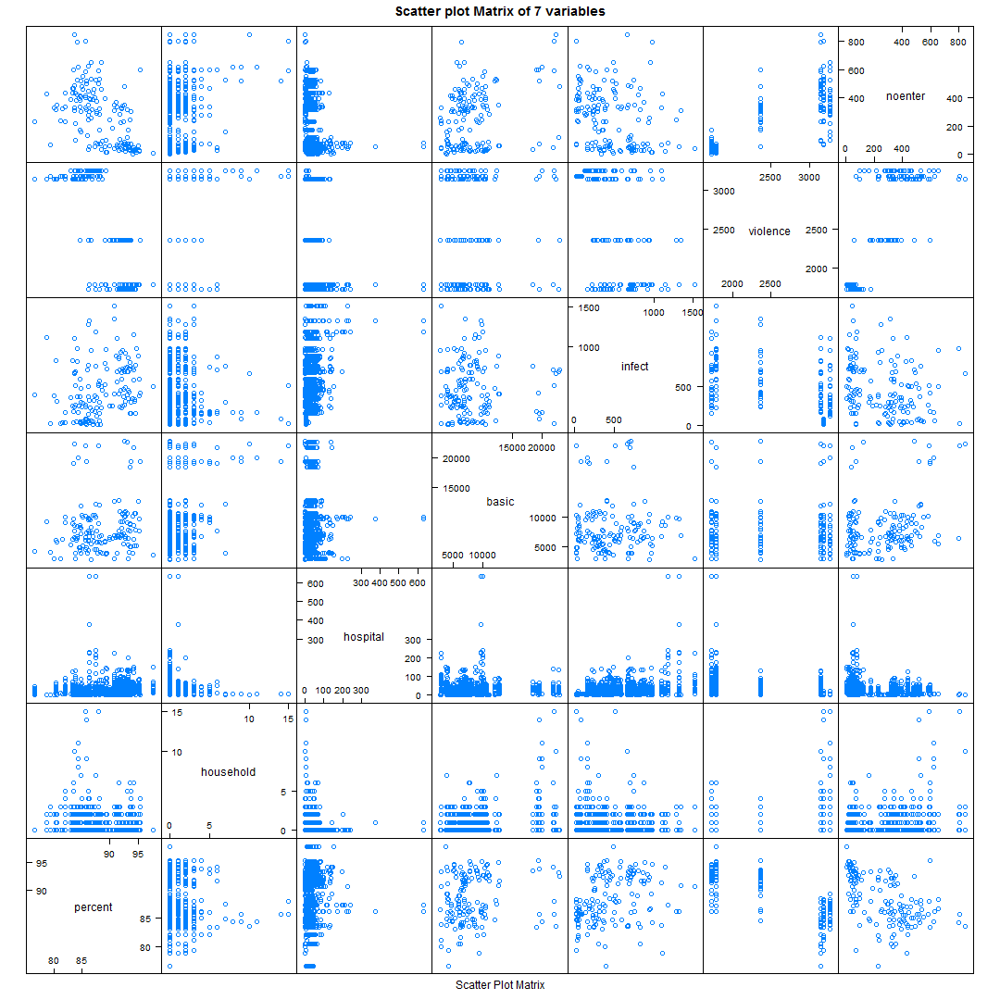

Data Mining Final Project
========================================================
Statmania
-------------------------
200903877 황 성 윤
-------------------------
201103594 최 재 혁
-------------------------

기말과제와 관련하여 분석결과에 대한 Visualization 실시
-------------------------------------------------------

```r
library(UsingR)
```

```
## Loading required package: MASS
```

```r
library(knitr)
library(lattice)
library(ggplot2)
```

```
## 
## Attaching package: 'ggplot2'
## 
## The following object is masked from 'package:UsingR':
## 
##     movies
```

```r
library(ggmap)
```

```
## 
## Attaching package: 'ggmap'
## 
## The following object is masked from 'package:UsingR':
## 
##     crime
```

```r
final <- read.csv("D:/수업자료/대학/(3)Junior/3-2/데이터마이닝실습(1전공)/Final project/Data for analysis/Data for analysis(final).csv", 
    sep = ",", header = T)
final$year <- as.factor(final$year)
attach(final)
```


### 연도에 따른 초등학교 취학률과 설명변수 사이의 관계
#### 취학률 vs 소년, 소녀 가장의 수

```r
ggplot(final, aes(household, percent)) + geom_point(width = 1, aes(colour = factor(year))) + 
    facet_grid(. ~ year)
```

 

#### 취학률 vs 기초생활수급자의 수

```r
ggplot(final, aes(basic, percent)) + geom_point(aes(colour = factor(year), size = percent), 
    alpha = I(0.7))
```

 

#### 취학률 vs 법정감염병 환자의 수

```r
ggplot(final, aes(infect, percent, colour = factor(year))) + geom_line() + geom_point() + 
    facet_grid(. ~ year)
```

 

#### 취학률 vs 가정폭력발생수

```r
qplot(percent, data = final, geom = "histogram", fill = violence, position = "stack") + 
    facet_grid(. ~ year)
```

```
## stat_bin: binwidth defaulted to range/30. Use 'binwidth = x' to adjust this.
## stat_bin: binwidth defaulted to range/30. Use 'binwidth = x' to adjust this.
## stat_bin: binwidth defaulted to range/30. Use 'binwidth = x' to adjust this.
## stat_bin: binwidth defaulted to range/30. Use 'binwidth = x' to adjust this.
## stat_bin: binwidth defaulted to range/30. Use 'binwidth = x' to adjust this.
## stat_bin: binwidth defaulted to range/30. Use 'binwidth = x' to adjust this.
```

```
## Warning: position_stack requires constant width: output may be incorrect
## Warning: position_stack requires constant width: output may be incorrect
## Warning: position_stack requires constant width: output may be incorrect
## Warning: position_stack requires constant width: output may be incorrect
## Warning: position_stack requires constant width: output may be incorrect
## Warning: position_stack requires constant width: output may be incorrect
```

 

#### 취학률 vs 병원수

```r
ggplot(final, aes(hospital, percent)) + geom_point(aes(colour = factor(year), 
    size = percent), position = "jitter") + geom_smooth(aes(colour = factor(year)), 
    method = rlm)
```

 

#### 취학률 vs 미취학아동수

```r
library(ggthemes)
ggplot(final, aes(noenter, percent, colour = factor(year), size = factor(year))) + 
    geom_point() + theme_economist_white() + scale_colour_economist(stata = TRUE)
```

 

#### Simple interpretation
전체적으로 봤을 때 소년, 소녀 가장수, 가정폭력발생수, 그리고 미취학아동수는 감소할 때, 기초생활수급자의 수, 법정감염병 환자수, 그리고 병원수는 증가할 때 초등학교 취학률이 증가하는 것으로 보임. 서울특별시 교육청에서 취학률을 산출 시 미취학아동수를 고려했고 기초생활수급자에 대해서는 국가차원에서 교육과 관련된 지원을 하기 때문에 이러한 결과가 나온 것으로 여겨짐.

### 지역에 따른 초등학교 취학률
#### 취학률 vs 지역(자치구)

```r
qmap("seoul", zoom = 11) + geom_point(aes(x = LNG, y = LAT, colour = percent, 
    size = percent), data = final)
```

```
## Map from URL : http://maps.googleapis.com/maps/api/staticmap?center=seoul&zoom=11&size=%20640x640&scale=%202&maptype=terrain&sensor=false
## Information from URL : http://maps.googleapis.com/maps/api/geocode/json?address=seoul&sensor=false
```

 

#### Simple interpretation
지역에 따른 초등학교 취학률의 격차는 존재한다고 할 수 있음.

### 연도에 따른 초등학교 취학률
#### 취학률 vs 연도(2006~2011)

```r
qmap("seoul", zoom = 11) + geom_point(aes(x = LNG, y = LAT, colour = year, size = percent), 
    data = final) + facet_wrap(~year)
```

```
## Using archived map...
```

 

#### Simple interpretation
연도에 따라 초등학교 취학률에 차이가 있다는 사실을 한눈에 파악이 가능.

### 변수들 사이의 상관관계를 보여주는 상관행렬도
#### Scatter plot matrix

```r
splom(final[, c(1, 7, 10, 13, 14, 17, 20)], main = "Scatter plot Matrix of 7 variables")
```

 

#### Simple interpretation
반응변수인 취학률(percent)를 제외한 나머지 설명변수들 사이에는 유의한 관계가 별로 없는 것으로 보인다. 그럼에도 불구하고 유의한 관계가 있는 것으로 보이는 2가지 설명변수를 찾아보라고 한다면 병원수(hospital)와 법정감염병 환자수(infect)를 선택하게 되지 않을까 싶다. 환자의 수가 증가하면 병원수도 증가하는 것으로 보인다.
