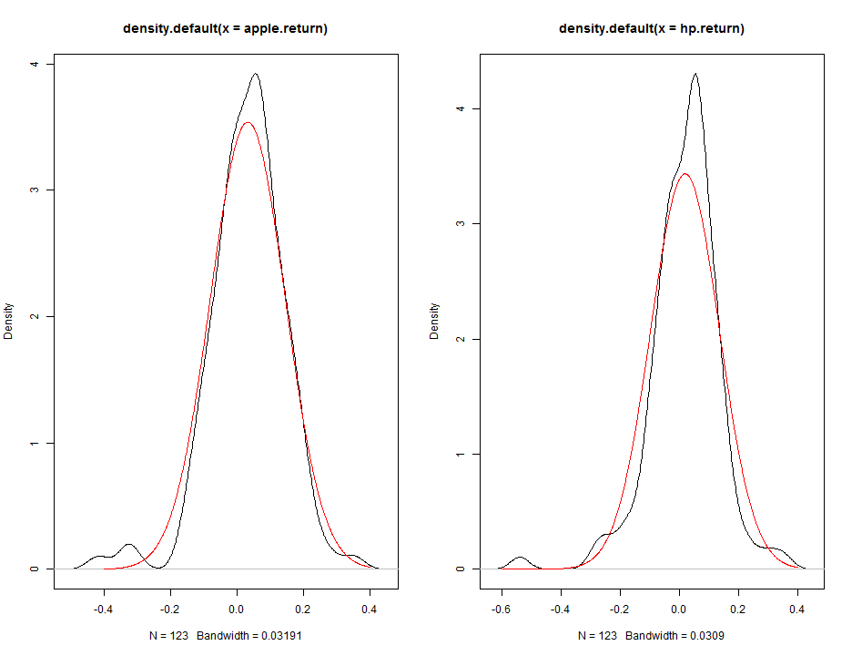
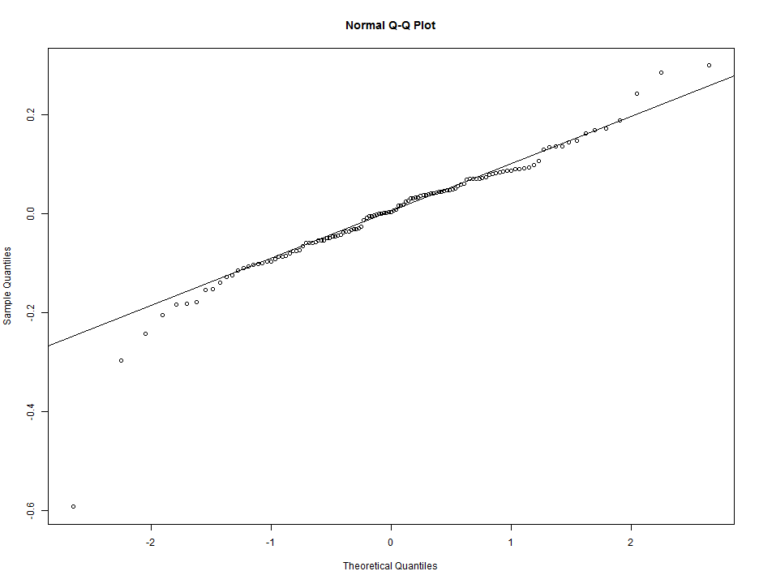

Assignment (Due to April. 30th)
========================================================
200903877 황 성 윤
-------------------------

## Analysis of returns in monthly data

### 2004년 1월부터 2014년 4월까지의 APPLE사와 HP사의 월별 수익률..

### 월별수익률 데이터는 정규분포를 사용해도
### 무리가 없다고 알려져 있음. (By Central Limit Theorem)

### 월별자료에서는 수익률을 Rt=(S(t)/S(t-1))-1 을 사용한다.
### Taylor에 의한 근사치가 정확하지 않음..

### 월별 수익률에 대한 분포점검

```r
par(mfrow = c(1, 2))

apple <- read.csv("C:/Users/student/Desktop/Sung-yoon.R/Final Exam/apple_month.csv", 
    sep = ",", header = T)
x <- apple$Close
n <- length(x)
apple.return <- x[2:n]/x[1:(n - 1)] - 1  # Rt=(St/S(t-1))-1
plot(density(apple.return))
x <- seq(-0.4, 0.4, by = 0.001)
lines(x, dnorm(x, mean(apple.return), sd(apple.return)), col = 2)

hp <- read.csv("C:/Users/student/Desktop/Sung-yoon.R/Final Exam/hp_month.csv", 
    sep = ",", header = T)
x <- hp$Close
n <- length(x)
hp.return <- x[2:n]/x[1:(n - 1)] - 1  # Rt=(St/S(t-1))-1
plot(density(hp.return))
x <- seq(-0.6, 0.4, by = 0.001)
lines(x, dnorm(x, mean(hp.return), sd(hp.return)), col = 2)
```

 


```r
mean(apple.return)  # Expected return(기대수익) 
```

```
## [1] 0.03327
```

```r
sd(apple.return)  # Volatility 
```

```
## [1] 0.1127
```


```r
mean(hp.return)  # Expected return(기대수익)
```

```
## [1] 0.01811
```

```r
sd(hp.return)  # Volatility
```

```
## [1] 0.1161
```


#### Interpretation
일별자료에서의 수익률은 정규분포와는 거리가 있었다.
하지만 월별자료에서 나온 수익률의 경우는 위의 두 그래프에서 알 수 있듯이 정규분포와 어느정도 맞는다는 것을 확인할 수 있다.
추가적으로 Apple사의 월별수익률의 기대수익은 약 3%, 변동성은 약 11%이며, HP사의 월별수익률의 기대수익은 약 2%, 변동성은 약 12%임을 알 수 있다.

### apple과 hp 사이의 상관관계

```r
par(mfrow = c(1, 1))
plot(apple.return, hp.return)
```

 

```r
qqnorm(lm(hp.return ~ apple.return)$res)
qqline(lm(hp.return ~ apple.return)$res)
```

 

```r
shapiro.test(lm(hp.return ~ apple.return)$res)
```

```
## 
## 	Shapiro-Wilk normality test
## 
## data:  lm(hp.return ~ apple.return)$res
## W = 0.9319, p-value = 9.971e-06
```

```r
cor(apple.return, hp.return, method = "spearman")
```

```
## [1] 0.2244
```

```r
cor.test(apple.return, hp.return, method = "spearman")
```

```
## 
## 	Spearman's rank correlation rho
## 
## data:  apple.return and hp.return
## S = 240524, p-value = 0.01272
## alternative hypothesis: true rho is not equal to 0
## sample estimates:
##    rho 
## 0.2244
```


#### Interpretation
Apple사와 Hp사의 월별수익률간의 상관관계를 분석해보았다. 이를 위해 먼저 산점도를 그린 결과 강하지는 않지만 양의 상관관계가 어느 정도 있는 것으로 보여진다. 그리고 상관분석을 하기 전 일반적인 Pearson의 방법을 사용할 수 있는지 판단하기 위해 회귀분석을 할 때 발생하는 잔차의 정규성을 살펴봤다. Q-Q Plot에서는 양 끝에서 직선과 동떨어지는 점들이 발생하며 검정결과에서도 유의확률이 0.05보다 매우 작게 산출되는 것으로 보아 일반적인 회귀분석의 가정을 만족하지 못하는 것으로 판단하고 순위를 이용하는 비모수적인 Spearman의 방법을 사용하였다. 그 결과 상관계수의 값은 0.2244264 이었으며, 검정결과 유의확률이 0.05보다 작으므로 상관관계가 있다고 말할 수 있겠다.

## Portfolio effect

### If X1, X2, X3, X4, X5, X6 ~ i.i.d N( mu , (sigma)^2 ) , then,
### Var(X1+X2+X3+X4+X5+X6) 
### = Var(X1)+Var(X2)+Var(X3)+Var(X4)+Var(X5)+Var(X6)
### = 6*(sigma)^2
### -> sd(X1+X2+X3+X4+X5+X6) = sqrt(6)*(sigma)
### 월별 누적 수익률의 Volatility는 월의 수의 제곱근에 비례하여 증가한다.
### (단, 월별 수익률의 분포가 모두 같고 서로 독립이라고 가정했을 때..)

### 포트폴리오 이론을 이용하면 risk를 최소화할 수 있다.

### 월별 수익률 : X (APPLE) ~ N( (3%) , (11%)^2 ) , Y (HP) ~ N( (2%) , (12%)^2 )
### 만약에 비중을 apple은 1/3, hp는 2/3 정도로 투자한다고 하자. 그러면,
### (1/3)*X + (2/3)*Y ~ 
### N( (1/3)*(3%) + (2/3)*(2%) ,
### (1/9)*(11%)^2 + (4/9)*(12%)^2 + 2*(1/3)*(2/3)*Cov(X,Y) )

```r
cov(apple.return, hp.return)
```

```
## [1] 0.00274
```

### = N( (2.3%) , (8.8%)^2 )

### R1 ~ N( mu1 , (sigma1)^2 ) , R2 ~ N( mu2 , (sigma2)^2 )
### 포트폴리오 수익률 : Rp = w*R1 + (1-w)*R2 ( 0 <= w <= 1 )
### Rp ~ N( w*(mu1) + (1-w)*(mu2) , 
### ( w^2 )*( (sigma1)^2 ) + ( (1-w)^2 )*( (sigma2)^2 ) + 2*w*(1-w)*(rho)*(sigma1)*(sigma2) )

### 그런데 상관계수 rho의 값은 -1과 1사이의 값이므로

### mu(p) = w*(mu1) + (1-w)*(mu2)
### sigma(p) = ( w^2 ) * ( (sigma1)^2 ) + ( (1-w)^2 ) * ( (sigma2)^2 ) + 2*w*(1-w)*(rho)*(sigma1)*(sigma2)
### <= ( w^2 ) * ( (sigma1)^2 ) + ( (1-w)^2 ) * ( (sigma2)^2 ) + 2*w*(1-w)*(sigma1)*(sigma2)
### = { w*(sigma1) + (1-w)*(sigma2) }^2 
### 개별 주식 risk의 합의 제곱보다는 작음 => 포트폴리오 효과
### sigma(p)를 w에 대하여 미분해서 값을 최소로 하는 w를 찾게 된다.
### 그 결과는 w* = ( (sigma2)^2 - (rho)*(sigma1)*(sigma2) )
### / ( (sigma1)^2 + (sigma2)^2 - 2*(rho)*(sigma1)*(sigma2) )
### => ( w* , 1-w* ) : minimun variance portfolio

### Portfolio effect

```r
min.var.portfolio <- function(r1, r2) {
    mu.1 <- mean(r1)
    mu.2 <- mean(r2)
    sigma.1 <- sd(r1)
    sigma.2 <- sd(r2)
    rho <- cor(r1, r2)
    w <- (sigma.2^2 - rho * sigma.1 * sigma.2)/(sigma.1^2 + sigma.2^2 - 2 * 
        rho * sigma.1 * sigma.2)
    mu.p <- w * mu.1 + (1 - w) * mu.2
    sigma.p <- sqrt(w^2 * sigma.1^2 + (1 - w)^2 * sigma.2^2 + 2 * w * (1 - w) * 
        rho * sigma.1 * sigma.2)
    return(list(w = w, mu.p = mu.p, sigma.p = sigma.p, mu.1 = mu.1, mu.2 = mu.2, 
        sigma.1 = sigma.1, sigma.2 = sigma.2, rho = rho))
}

min.var.portfolio(apple.return, hp.return)
```

```
## $w
## [1] 0.5191
## 
## $mu.p
## [1] 0.02598
## 
## $sigma.p
## [1] 0.08894
## 
## $mu.1
## [1] 0.03327
## 
## $mu.2
## [1] 0.01811
## 
## $sigma.1
## [1] 0.1127
## 
## $sigma.2
## [1] 0.1161
## 
## $rho
## [1] 0.2093
```


#### Interpretation
위의 함수에서 산출된 결과에 따르면 Apple사의 주식에 약 52%를 투자하는 것이 포트폴리오의 분산을 최소화시키는 방법임을 확인할 수 있다. 포트폴리오 효과에 의하여 각각의 주식의 수익률의 변동성보다 포트폴리오의 분산이 더 작음을 추가적으로 확인할 수 있다. 하지만 포트폴리오의 분산만 최소화시키는 것이 이상적인 것은 아니다. 투자자들 중에는 포트폴리오의 기대수익도 고려하는 경우도 있으므로 이에 대한 생각도 해야할 필요성이 있다.
