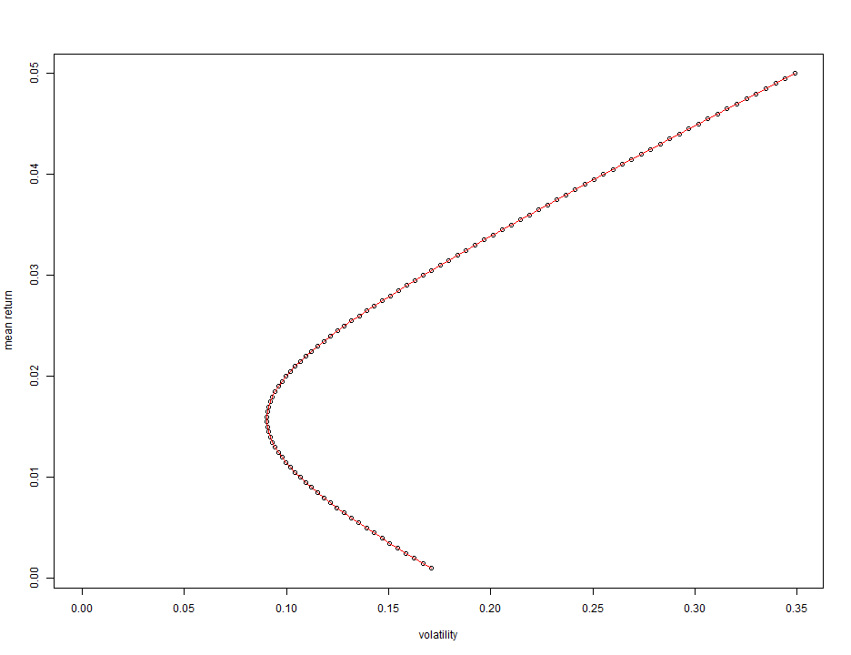
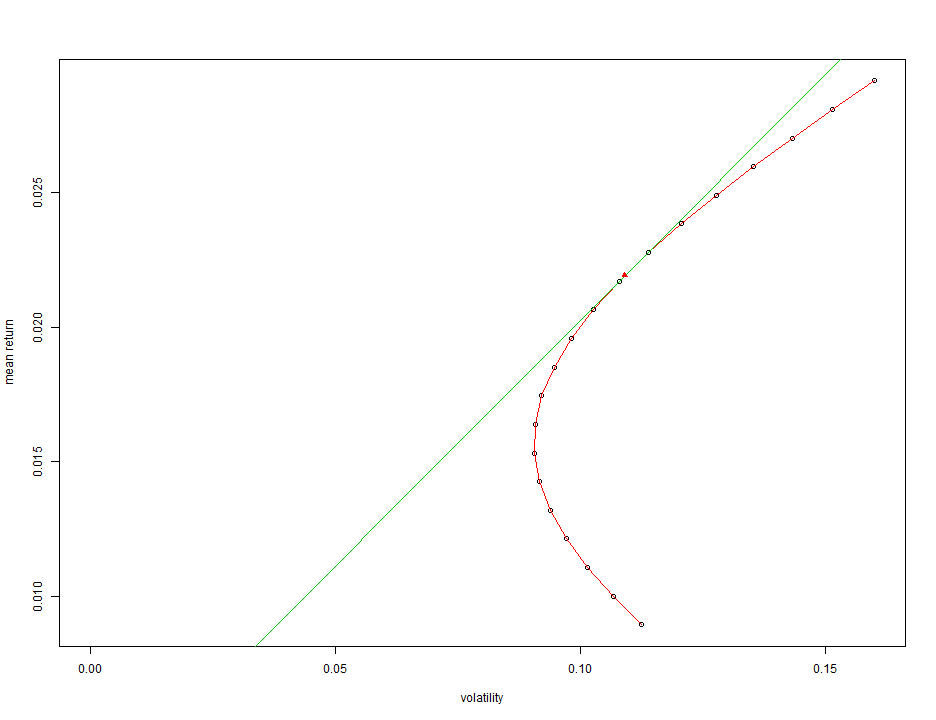
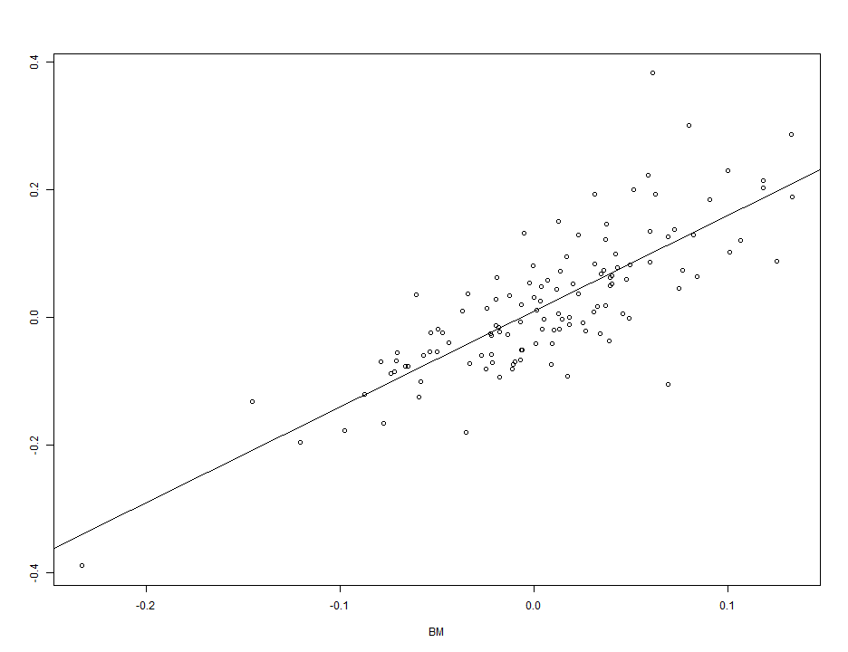
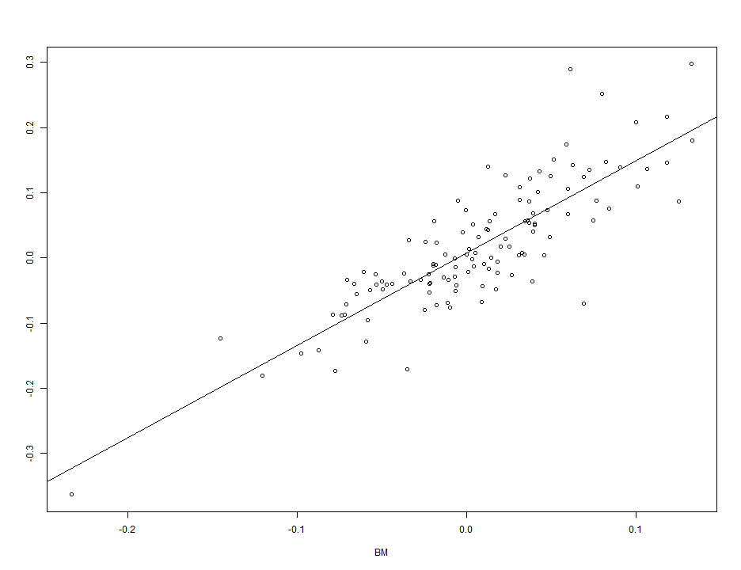
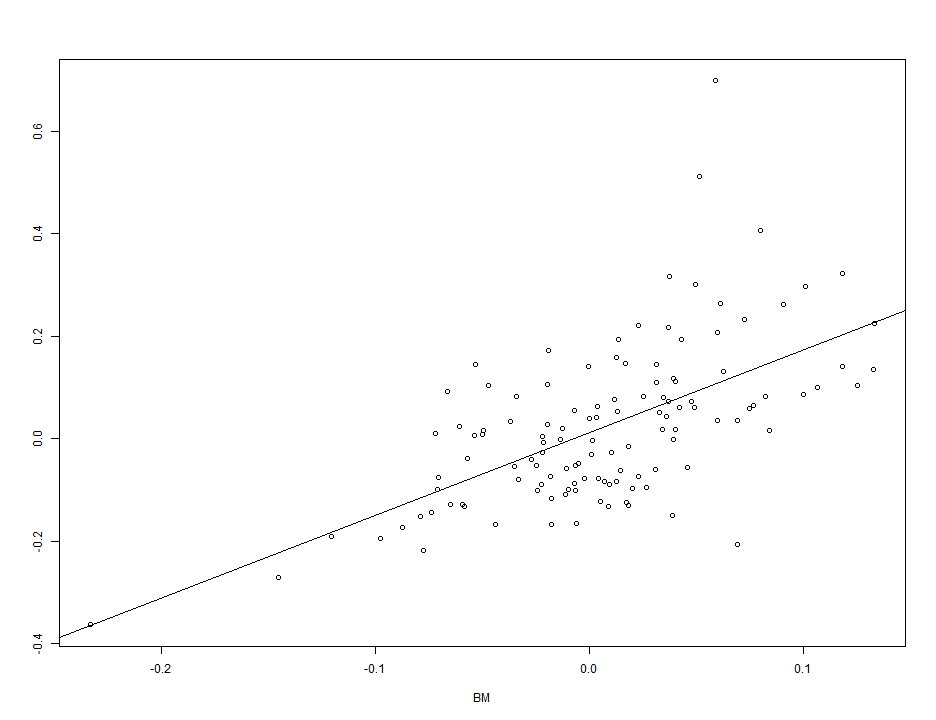
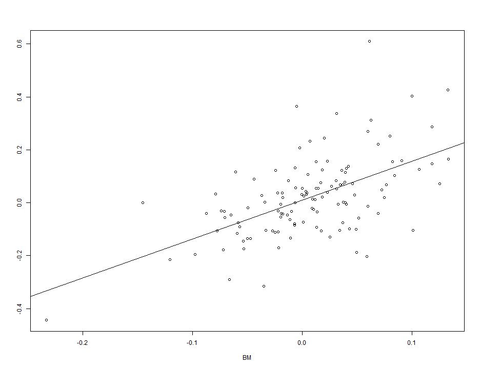
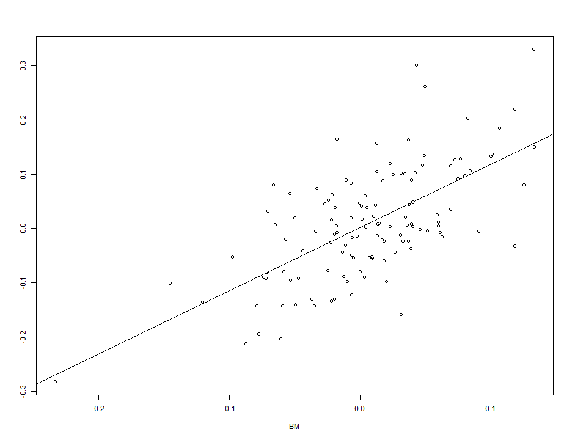

Assignment (Due to May.19th)
========================================================
200903877 황 성 윤
-------------------------

## 다수의 월별주식에서 나오는 수익률을 이용한 최적의 포트폴리오 찾기.
## 기간 : 2004년 1월 ~ 2014년 4월
## (우리나라의 3개 기업 : Doosan, Hynix, POSCO)

### 해당 데이터 불러들이기 & 월별 수익률 산출 
### (KOSPI에서 나오는 수익률은 벤치마킹을 하는데 쓰일 것이다.)

```r
kospi <- read.csv("C:/Users/user/Desktop/Sung-yoon.R/Final Exam/Assignment (Due to 5.19)/kospi_month.csv", 
    sep = ",", header = T)
x <- kospi$Close
n <- length(x)
kospi.return <- x[2:n]/x[1:(n - 1)] - 1  # Rt=(St/S(t-1))-1

doosan <- read.csv("C:/Users/user/Desktop/Sung-yoon.R/Final Exam/Assignment (Due to 5.19)/doosan_month.csv", 
    sep = ",", header = T)
x <- doosan$Close
n <- length(x)
doosan.return <- x[2:n]/x[1:(n - 1)] - 1  # Rt=(St/S(t-1))-1

hynix <- read.csv("C:/Users/user/Desktop/Sung-yoon.R/Final Exam/Assignment (Due to 5.19)/hynix_month.csv", 
    sep = ",", header = T)
x <- hynix$Close
n <- length(x)
hynix.return <- x[2:n]/x[1:(n - 1)] - 1  # Rt=(St/S(t-1))-1

posco <- read.csv("C:/Users/user/Desktop/Sung-yoon.R/Final Exam/Assignment (Due to 5.19)/posco_month.csv", 
    sep = ",", header = T)
x <- posco$Close
n <- length(x)
posco.return <- x[2:n]/x[1:(n - 1)] - 1  # Rt=(St/S(t-1))-1
```


### Make return matrix (평균 수익률과 공분산행렬 산출)

```r
Returns <- cbind(doosan.return, hynix.return, posco.return)
summary(Returns)
```

```
##  doosan.return      hynix.return      posco.return    
##  Min.   :-0.3613   Min.   :-0.4419   Min.   :-0.2804  
##  1st Qu.:-0.0834   1st Qu.:-0.0727   1st Qu.:-0.0509  
##  Median : 0.0173   Median : 0.0151   Median : 0.0066  
##  Mean   : 0.0243   Mean   : 0.0225   Mean   : 0.0112  
##  3rd Qu.: 0.1035   3rd Qu.: 0.0892   3rd Qu.: 0.0826  
##  Max.   : 0.7011   Max.   : 0.6119   Max.   : 0.3321
```

```r
apply(Returns, 2, mean)
```

```
## doosan.return  hynix.return  posco.return 
##       0.02429       0.02245       0.01120
```

```r
cov(Returns)
```

```
##               doosan.return hynix.return posco.return
## doosan.return      0.023963     0.004373     0.006598
## hynix.return       0.004373     0.022675     0.002924
## posco.return       0.006598     0.002924     0.010736
```

#### Interpretation
3개의 기업에 대한 월별 수익률에 대한 평균이 각각 0.02428735, 0.02245463, 0.01119676 으로서 0에 근접해 있다는 것을 알 수 있다. 추가적으로 기업들끼리의 연관성을 알아보기 위한 공분산행렬도 표시해봤다.

### 다수의 주식으로 구성한 포트폴리오 (w1,w2,...,wn)
### w1 + w2 + ... + wn = 1
### R1, R2, R3, ... , Rn
### Rp = R1 + R2 + ... + Rn = t(w) % * % ( R )
### mu(p) = E(Rp) = t(w) % * % E ( R ) = t(w) % * % (MU)
### sigma(p)^2 = Var(Rp) = t(w) % * % Var ( R ) % * % (w)
### = t(w) % * % (SIGMA) % * % (w)
### MU : 평균벡터 , SIGMA : 공분산행렬
### 포트폴리오 수익률의 분포를 예측.

### MU와 SIGMA는 통제할 수 없으므로
### 벡터 (w)를 잘 결정해야 함.

### sigma(p)를 최소화하는 (w)를 찾는다. (라그랑주의 승수법)
### (단, t(w) % * % (MU) = mu(p) , t(w) % * % (1) = 1)

### (w)의 원소의 값이 음수인 경우는
### 주식을 빌려와서 팔아야 함. (Short selling : 공매)
### 주식들은 대부분 한 시장에서 거래되기 때문에
### correlation이 양수인 경우가 많다.

## 특정한 수익률을 정했을 경우 최적의 포트폴리오 찾는 방법

### 특정한 수익률을 정했다면 이에 해당하는 포트폴리오 중
### 변동성(volatility)이 가장 작은 것을 선택하는 것이
### 타당하다. (즉, mu(p)가 정해져 있을 때 벡터 w를 적절하게 선택.)

### t(w) % * % (MU)=mu(p), t(w) % * % (1)=1 이라는 조건이 있을 때,
### t(w) % * % (SIGMA) % * % (w) 를 최소화하는 벡터 w를 찾을 것임. (Optimizing)
### MU : 평균벡터 , SIGMA : 공분산행렬

### 함수 Minimum.variance.portfolio 작성

```r
Minimum.variance.portfolio <- function(Returns, mu.p, plot = F, prt = F) {
    n.p <- length(mu.p)
    mu <- apply(Returns, 2, mean)
    Sigma <- cov(Returns)
    Sigma.inv <- solve(Sigma)
    ones <- rep(1, dim(Returns)[2])
    
    Av <- (t(ones) %*% Sigma.inv %*% mu)[1, 1]
    Bv <- (t(mu) %*% Sigma.inv %*% mu)[1, 1]
    Cv <- (t(ones) %*% Sigma.inv %*% ones)[1, 1]
    Dv <- Bv * Cv - Av * Av
    
    g <- (Bv * Sigma.inv %*% ones - Av * Sigma.inv %*% mu)/Dv
    h <- (Cv * Sigma.inv %*% mu - Av * Sigma.inv %*% ones)/Dv
    
    w.p <- sigma.p <- NULL
    for (j in 1:n.p) {
        w <- g + h * mu.p[j]
        w.p <- cbind(w.p, w)
        sigma.p <- c(sigma.p, sqrt((t(w) %*% Sigma %*% w)[1, 1]))
    }
    
    if (plot) {
        plot(sigma.p, mu.p, xlim = c(0, max(sigma.p)), xlab = "volatility", 
            ylab = "mean return")
        lines(sigma.p, mu.p, col = 2)
    }
    if (prt) 
        print(cbind(mu.p, sigma.p, t(w.p)))
    
    return(list(mu.p = mu.p, sigma.p = sigma.p, w.p = w.p))
}
```


### 각각의 수익률에 대한 최적의 포트폴리오 산출.

```r
mu.p <- seq(from = 0.001, to = 0.05, by = 5e-04)
mvp <- Minimum.variance.portfolio(Returns, mu.p, plot = T, prt = T)
```

 

```
##          mu.p sigma.p doosan.return hynix.return posco.return
##   [1,] 0.0010 0.17098      -0.63162    -0.171302     1.802921
##   [2,] 0.0015 0.16683      -0.60594    -0.156743     1.762687
##   [3,] 0.0020 0.16272      -0.58027    -0.142183     1.722453
##   [4,] 0.0025 0.15866      -0.55460    -0.127624     1.682220
##   [5,] 0.0030 0.15465      -0.52892    -0.113064     1.641986
##   [6,] 0.0035 0.15069      -0.50325    -0.098505     1.601752
##   [7,] 0.0040 0.14678      -0.47757    -0.083945     1.561518
##   [8,] 0.0045 0.14295      -0.45190    -0.069386     1.521285
##   [9,] 0.0050 0.13918      -0.42622    -0.054827     1.481051
##  [10,] 0.0055 0.13548      -0.40055    -0.040267     1.440817
##  [11,] 0.0060 0.13186      -0.37488    -0.025708     1.400583
##  [12,] 0.0065 0.12833      -0.34920    -0.011148     1.360350
##  [13,] 0.0070 0.12489      -0.32353     0.003411     1.320116
##  [14,] 0.0075 0.12156      -0.29785     0.017971     1.279882
##  [15,] 0.0080 0.11833      -0.27218     0.032530     1.239649
##  [16,] 0.0085 0.11523      -0.24650     0.047089     1.199415
##  [17,] 0.0090 0.11225      -0.22083     0.061649     1.159181
##  [18,] 0.0095 0.10942      -0.19516     0.076208     1.118947
##  [19,] 0.0100 0.10674      -0.16948     0.090768     1.078714
##  [20,] 0.0105 0.10422      -0.14381     0.105327     1.038480
##  [21,] 0.0110 0.10187      -0.11813     0.119887     0.998246
##  [22,] 0.0115 0.09972      -0.09246     0.134446     0.958012
##  [23,] 0.0120 0.09776      -0.06678     0.149005     0.917779
##  [24,] 0.0125 0.09602      -0.04111     0.163565     0.877545
##  [25,] 0.0130 0.09449      -0.01544     0.178124     0.837311
##  [26,] 0.0135 0.09321       0.01024     0.192684     0.797078
##  [27,] 0.0140 0.09217       0.03591     0.207243     0.756844
##  [28,] 0.0145 0.09138       0.06159     0.221803     0.716610
##  [29,] 0.0150 0.09086       0.08726     0.236362     0.676376
##  [30,] 0.0155 0.09059       0.11294     0.250921     0.636143
##  [31,] 0.0160 0.09060       0.13861     0.265481     0.595909
##  [32,] 0.0165 0.09087       0.16428     0.280040     0.555675
##  [33,] 0.0170 0.09140       0.18996     0.294600     0.515441
##  [34,] 0.0175 0.09220       0.21563     0.309159     0.475208
##  [35,] 0.0180 0.09324       0.24131     0.323718     0.434974
##  [36,] 0.0185 0.09454       0.26698     0.338278     0.394740
##  [37,] 0.0190 0.09606       0.29266     0.352837     0.354506
##  [38,] 0.0195 0.09781       0.31833     0.367397     0.314273
##  [39,] 0.0200 0.09978       0.34400     0.381956     0.274039
##  [40,] 0.0205 0.10194       0.36968     0.396516     0.233805
##  [41,] 0.0210 0.10429       0.39535     0.411075     0.193572
##  [42,] 0.0215 0.10681       0.42103     0.425634     0.153338
##  [43,] 0.0220 0.10950       0.44670     0.440194     0.113104
##  [44,] 0.0225 0.11234       0.47238     0.454753     0.072870
##  [45,] 0.0230 0.11532       0.49805     0.469313     0.032637
##  [46,] 0.0235 0.11843       0.52372     0.483872    -0.007597
##  [47,] 0.0240 0.12165       0.54940     0.498432    -0.047831
##  [48,] 0.0245 0.12499       0.57507     0.512991    -0.088065
##  [49,] 0.0250 0.12843       0.60075     0.527550    -0.128298
##  [50,] 0.0255 0.13196       0.62642     0.542110    -0.168532
##  [51,] 0.0260 0.13558       0.65210     0.556669    -0.208766
##  [52,] 0.0265 0.13928       0.67777     0.571229    -0.249000
##  [53,] 0.0270 0.14306       0.70345     0.585788    -0.289233
##  [54,] 0.0275 0.14690       0.72912     0.600348    -0.329467
##  [55,] 0.0280 0.15080       0.75479     0.614907    -0.369701
##  [56,] 0.0285 0.15476       0.78047     0.629466    -0.409934
##  [57,] 0.0290 0.15878       0.80614     0.644026    -0.450168
##  [58,] 0.0295 0.16284       0.83182     0.658585    -0.490402
##  [59,] 0.0300 0.16695       0.85749     0.673145    -0.530636
##  [60,] 0.0305 0.17110       0.88317     0.687704    -0.570869
##  [61,] 0.0310 0.17530       0.90884     0.702264    -0.611103
##  [62,] 0.0315 0.17953       0.93451     0.716823    -0.651337
##  [63,] 0.0320 0.18379       0.96019     0.731382    -0.691571
##  [64,] 0.0325 0.18808       0.98586     0.745942    -0.731804
##  [65,] 0.0330 0.19241       1.01154     0.760501    -0.772038
##  [66,] 0.0335 0.19676       1.03721     0.775061    -0.812272
##  [67,] 0.0340 0.20114       1.06289     0.789620    -0.852505
##  [68,] 0.0345 0.20555       1.08856     0.804180    -0.892739
##  [69,] 0.0350 0.20997       1.11423     0.818739    -0.932973
##  [70,] 0.0355 0.21442       1.13991     0.833298    -0.973207
##  [71,] 0.0360 0.21889       1.16558     0.847858    -1.013440
##  [72,] 0.0365 0.22338       1.19126     0.862417    -1.053674
##  [73,] 0.0370 0.22788       1.21693     0.876977    -1.093908
##  [74,] 0.0375 0.23240       1.24261     0.891536    -1.134142
##  [75,] 0.0380 0.23694       1.26828     0.906095    -1.174375
##  [76,] 0.0385 0.24149       1.29395     0.920655    -1.214609
##  [77,] 0.0390 0.24606       1.31963     0.935214    -1.254843
##  [78,] 0.0395 0.25064       1.34530     0.949774    -1.295077
##  [79,] 0.0400 0.25523       1.37098     0.964333    -1.335310
##  [80,] 0.0405 0.25984       1.39665     0.978893    -1.375544
##  [81,] 0.0410 0.26445       1.42233     0.993452    -1.415778
##  [82,] 0.0415 0.26908       1.44800     1.008011    -1.456011
##  [83,] 0.0420 0.27372       1.47367     1.022571    -1.496245
##  [84,] 0.0425 0.27836       1.49935     1.037130    -1.536479
##  [85,] 0.0430 0.28302       1.52502     1.051690    -1.576713
##  [86,] 0.0435 0.28768       1.55070     1.066249    -1.616946
##  [87,] 0.0440 0.29236       1.57637     1.080809    -1.657180
##  [88,] 0.0445 0.29704       1.60205     1.095368    -1.697414
##  [89,] 0.0450 0.30173       1.62772     1.109927    -1.737648
##  [90,] 0.0455 0.30642       1.65339     1.124487    -1.777881
##  [91,] 0.0460 0.31112       1.67907     1.139046    -1.818115
##  [92,] 0.0465 0.31583       1.70474     1.153606    -1.858349
##  [93,] 0.0470 0.32055       1.73042     1.168165    -1.898582
##  [94,] 0.0475 0.32527       1.75609     1.182725    -1.938816
##  [95,] 0.0480 0.33000       1.78177     1.197284    -1.979050
##  [96,] 0.0485 0.33473       1.80744     1.211843    -2.019284
##  [97,] 0.0490 0.33947       1.83311     1.226403    -2.059517
##  [98,] 0.0495 0.34421       1.85879     1.240962    -2.099751
##  [99,] 0.0500 0.34896       1.88446     1.255522    -2.139985
```

#### Interpretation
위에 있는 결과물과 그래프는 특정한 수익률을 정했을 때의 최적의 포트폴리오를 산출한 결과에 대한 내용을 담고 있다. 특별히 수익률의 값을 0.0155로 정했을 때 변동성(volatility)이 가장 작게 산출됨을 알 수 있다. 하지만 이러한 방법은 특정한 기대수익률을 정해야만 된다는 제약이 있다. 그러므로 변동성이 0인 무위험자산(risk-free asset)을 이용하여 최적의 포트폴리오를 찾는 방법을 이용하여 분석을 실시해보겠다.

## Tangency portfolio
### (Optimal portfolio with a risk-free asset)
### Sharpe ratio 를 최대화하는 포트폴리오를 선택함. (risk-adjusted excess return)
### Sharpe ratio = (mu-Rf)/(sigma) , Rf = risk-free asset
### 기하학적으로 볼 때 변동성을 적용하여 보정한 척도인 Sharpe ratio는
### 해당하는 점에서 그래프 위의 임의의 점까지 그은 직선의
### 기울기에 해당한다.
### 따라서 접선의 기울기가 가장 최대가 된다. 그 점을 선택~~!!

### 함수 Tangency.portfolio 작성

```r
Tangency.portfolio <- function(Returns, r.f, plot = F) {
    mu <- apply(Returns, 2, mean)
    Sigma <- cov(Returns)
    Sigma.inv <- solve(Sigma)
    ones <- rep(1, dim(Returns)[2])
    tmp <- mu - r.f * ones
    w.bar <- Sigma.inv %*% tmp
    
    lb <- 0.8 * min(mu)
    ub <- 1.2 * max(mu)
    mvp <- Minimum.variance.portfolio(Returns, mu.p = seq(from = lb, to = ub, 
        len = 20), plot = plot, prt = F)
    w.q <- w.bar/sum(w.bar)
    mu.q <- crossprod(w.q, mu)
    sigma.q <- sqrt((t(w.q) %*% Sigma %*% w.q)[1, 1])
    if (plot) {
        slope <- (mu.q - r.f)/sigma.q
        abline(r.f, slope, col = 3)
        points(sigma.q, mu.q, pch = 17, col = 2)
    }
    
    return(list(mu.q = mu.q, sigma.q = sigma.q, w.q = w.q))
}
```


### 결과에 대한 그래프와 결과물 (무위험자산의 값은 0.002로 정함.)

```r
tp <- Tangency.portfolio(Returns, r.f = 0.002, plot = T)
```

 

```r
tp
```

```
## $mu.q
##         [,1]
## [1,] 0.02191
## 
## $sigma.q
## [1] 0.109
## 
## $w.q
##                 [,1]
## doosan.return 0.4420
## hynix.return  0.4376
## posco.return  0.1204
```

#### Interpretation
그래프에서 직선의 기울기가 곡선의 접선에 해당하는 값과 일치할 때의 수익률은 0.02190939 이고 이에 해당하는 변동성의 값은 0.1090012 이다. 이를 만족시키기 위해서는 Doosan, Hynix, 그리고 POSCO 의 자산에 각각 44.2%, 43.8%, 그리고 12% 를 투자해야 함을 확인할 수 있겠다. 이제 이러한 방식으로 투자하는 방법과 아무런 정보없이 3개이 기업에 대해 동일한 비중으로 투자하는 방법 중 어느 것이 더 효율적인지 대표적인 척도들 중 Sharpe ratio, Jensen's alpha, Beta coefficient, 그리고 Treynor index 를 이용하여 알아보도록 하겠다. (3가지 기업 모두 우리나라의 기업들이므로 KOSPI의 월별 수익률을 벤치마킹시켰다.)

## Capital Asset Pricing Model
### Sharpe ratio = (mu-Rf)/(sigma) , Rf = risk-free asset
### Jensen's alpha와 Beta coefficient : 벤치마킹하는 주식과
### 평가하는 주식에서 각각 무위험자산을 뺀 다음 단순선형 회귀분석을
### 실시하여 얻은 intercept와 slope의 값이다.
### Treynor index = (mu-Rf)/(beta)

## 평가하는 방법
### Sharpe ratio와 Treynor index는 값이 클 수록 바람직함.
### Jensen's alpha는 양수로서 커야함.
### beta coefficient는 1보다 약간 큰 정도가 바람직함.

### 함수 capm.measure 작성

```r
capm.measure <- function(port.return, bm.return, r.f, plot = F) {
    x <- bm.return - r.f
    y <- port.return - r.f
    plot(x, y, xlab = "BM", ylab = "")
    res <- lm(y ~ x)
    summary(res)
    abline(res$coef, ylab = "")
    
    mu <- mean(y)
    sigma <- sd(y)
    sharpe <- (mu - r.f)/sigma
    alpha <- res$coef[1]
    beta <- res$coef[2]
    treynor <- (mu - r.f)/beta
    
    return(list(mu = mu, sigma = sigma, sharpe = sharpe, alpha = alpha, beta = beta, 
        treynor = treynor))
}
```


### Tangency portfolio 의 방법론을 적용한 경우

```r
tangency1 <- Returns %*% tp$w.q
capm.measure(tangency1, kospi.return, r.f = 0.002, plot = T)
```

 

```
## $mu
## [1] 0.01991
## 
## $sigma
## [1] 0.109
## 
## $sharpe
## [1] 0.1643
## 
## $alpha
## (Intercept) 
##    0.009961 
## 
## $beta
##     x 
## 1.495 
## 
## $treynor
##       x 
## 0.01198
```

### 동일가중평균을 적용한 경우

```r
tangency2 <- Returns %*% rep(1/3, 3)
capm.measure(tangency2, kospi.return, r.f = 0.002, plot = T)
```

 

```
## $mu
## [1] 0.01731
## 
## $sigma
## [1] 0.09728
## 
## $sharpe
## [1] 0.1574
## 
## $alpha
## (Intercept) 
##    0.007901 
## 
## $beta
##     x 
## 1.415 
## 
## $treynor
##       x 
## 0.01082
```

#### Interpretation
Sharpe ratio와 Treynor index 모두 Tangency portfolio 의 방법론을 적용한 경우가 큰 값을 산출하고 있으며 Jensen's alpha의 값도 Tangency portfolio 의 경우가 양수로서 큼을 알 수 있다. 그리고 Beta coefficient의 경우는 동일가중평균을 적용했을 경우가 1보다 큰 값으로서 1에 더 가까운 값을 나타내고 있다. 그러므로 전체적으로 봤을 때 Tangency portfolio 의 방법론을 적용한 경우가 더 바람직한 결과를 제시하고 있다고 판단할 수 있겠다. 추가적으로 3개의 기업 각각에 대해서도 척도의 값을 산출해서 어느 기업에 투자하면 좋을 지 알아보도록 하겠다. risk-free asset의 값은 동일하게 0.002로 가정하겠다.

### Doosan

```r
capm.measure(doosan.return, kospi.return, r.f = 0.002, plot = T)
```

 

```
## $mu
## [1] 0.02229
## 
## $sigma
## [1] 0.1548
## 
## $sharpe
## [1] 0.1311
## 
## $alpha
## (Intercept) 
##     0.01156 
## 
## $beta
##     x 
## 1.613 
## 
## $treynor
##       x 
## 0.01258
```

### Hynix

```r
capm.measure(hynix.return, kospi.return, r.f = 0.002, plot = T)
```

 

```
## $mu
## [1] 0.02045
## 
## $sigma
## [1] 0.1506
## 
## $sharpe
## [1] 0.1226
## 
## $alpha
## (Intercept) 
##     0.01069 
## 
## $beta
##     x 
## 1.468 
## 
## $treynor
##       x 
## 0.01257
```

### POSCO

```r
capm.measure(posco.return, kospi.return, r.f = 0.002, plot = T)
```

 

```
## $mu
## [1] 0.009197
## 
## $sigma
## [1] 0.1036
## 
## $sharpe
## [1] 0.06946
## 
## $alpha
## (Intercept) 
##    0.001457 
## 
## $beta
##     x 
## 1.163 
## 
## $treynor
##        x 
## 0.006186
```

#### Interpretation
Sharpe ratio와 Treynor index, 그리고 Jensen's alpha의 경우는 모두 Doosan이 양수로서 가장 큰 값을 나타냈고, Beta coefficient는 POSCO가 1보다 큰 값으로서 1에 가장 가까운 수치를 보였다. 그러므로 전체적으로 봤을 때는 이 3가지 기업들 중에서 하나를 선택해서 투자를 해야 한다면 Doosan에 하는 것이 가장 바람직하다고 할 수 있겠다.   
