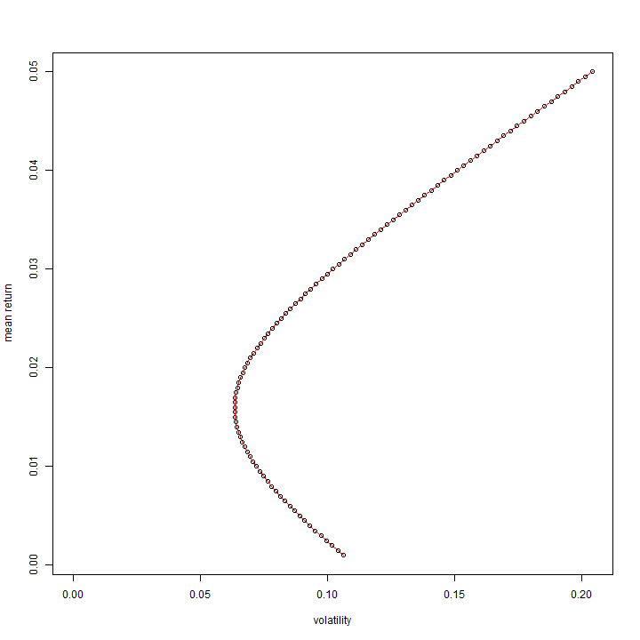
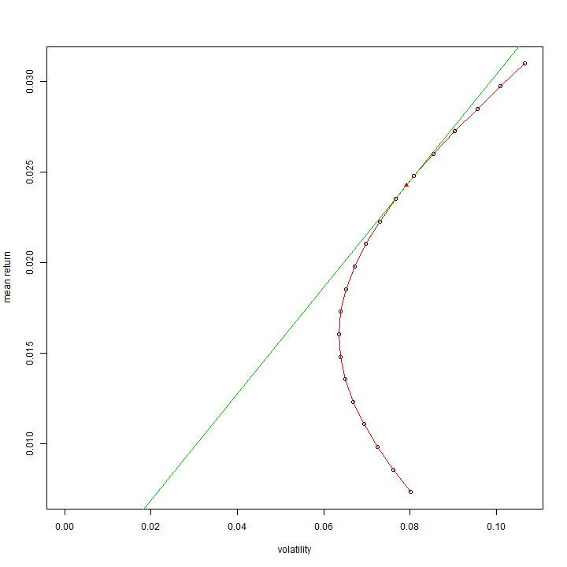
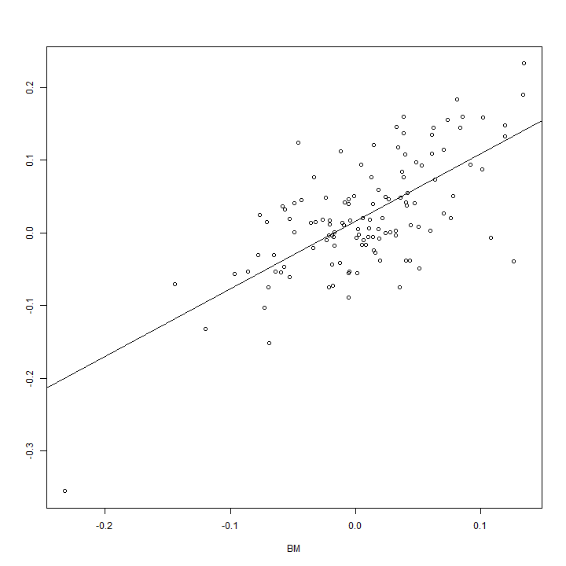
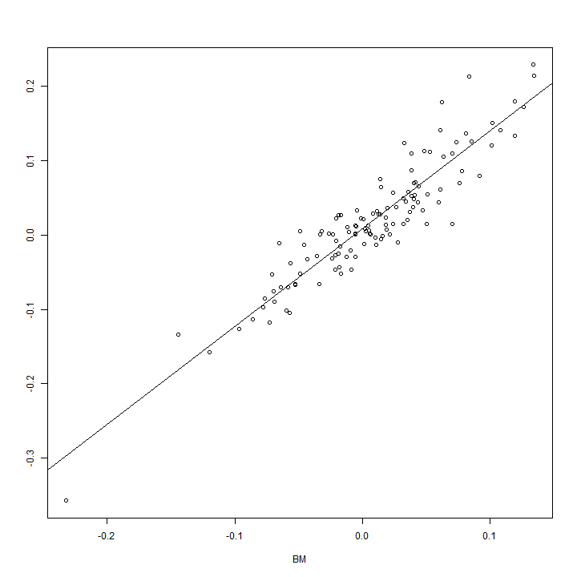

Final Assignment 1 (금융자료분석 및 실습)
========================================================
200903877 황 성 윤
-------------------------

# 다수의 월별주식에서 나오는 수익률을 이용한 최적의 포트폴리오 찾기.
## 기간 : 2004년 1월 ~ 2014년 4월
## (우리나라의 10개 기업 : Doosan, Hanwha, Hynix, Hyosung, Hyundai, Kia, Kyobo, Lotte, Posco, S-oil)

### KOSPI 에서 나오는 월별 수익률은 Benchmarking 하는데 쓰일 것이다.

### 데이터 읽어들이기 & 월별 수익률 계산

```r
kospi <- read.csv("C:/Users/user/Desktop/Sung-yoon.R/Final Exam/Final Assignment 1/kospi_month.csv", 
    sep = ",", header = T)
x <- kospi$Close
n <- length(x)
kospi.return <- x[2:n]/x[1:(n - 1)] - 1
doosan <- read.csv("C:/Users/user/Desktop/Sung-yoon.R/Final Exam/Final Assignment 1/doosan_month.csv", 
    sep = ",", header = T)
x <- doosan$Close
n <- length(x)
doosan.return <- x[2:n]/x[1:(n - 1)] - 1
hanwha <- read.csv("C:/Users/user/Desktop/Sung-yoon.R/Final Exam/Final Assignment 1/hanwha_month.csv", 
    sep = ",", header = T)
x <- hanwha$Close
n <- length(x)
hanwha.return <- x[2:n]/x[1:(n - 1)] - 1
hynix <- read.csv("C:/Users/user/Desktop/Sung-yoon.R/Final Exam/Final Assignment 1/hynix_month.csv", 
    sep = ",", header = T)
x <- hynix$Close
n <- length(x)
hynix.return <- x[2:n]/x[1:(n - 1)] - 1
hyosung <- read.csv("C:/Users/user/Desktop/Sung-yoon.R/Final Exam/Final Assignment 1/hyosung_month.csv", 
    sep = ",", header = T)
x <- hyosung$Close
n <- length(x)
hyosung.return <- x[2:n]/x[1:(n - 1)] - 1
hyundai <- read.csv("C:/Users/user/Desktop/Sung-yoon.R/Final Exam/Final Assignment 1/hyundai_month.csv", 
    sep = ",", header = T)
x <- hyundai$Close
n <- length(x)
hyundai.return <- x[2:n]/x[1:(n - 1)] - 1
kia <- read.csv("C:/Users/user/Desktop/Sung-yoon.R/Final Exam/Final Assignment 1/kia_month.csv", 
    sep = ",", header = T)
x <- kia$Close
n <- length(x)
kia.return <- x[2:n]/x[1:(n - 1)] - 1
kyobo <- read.csv("C:/Users/user/Desktop/Sung-yoon.R/Final Exam/Final Assignment 1/kyobo_month.csv", 
    sep = ",", header = T)
x <- kyobo$Close
n <- length(x)
kyobo.return <- x[2:n]/x[1:(n - 1)] - 1
lotte <- read.csv("C:/Users/user/Desktop/Sung-yoon.R/Final Exam/Final Assignment 1/lotte_month.csv", 
    sep = ",", header = T)
x <- lotte$Close
n <- length(x)
lotte.return <- x[2:n]/x[1:(n - 1)] - 1
posco <- read.csv("C:/Users/user/Desktop/Sung-yoon.R/Final Exam/Final Assignment 1/posco_month.csv", 
    sep = ",", header = T)
x <- posco$Close
n <- length(x)
posco.return <- x[2:n]/x[1:(n - 1)] - 1
soil <- read.csv("C:/Users/user/Desktop/Sung-yoon.R/Final Exam/Final Assignment 1/s-oil_month.csv", 
    sep = ",", header = T)
x <- soil$Close
n <- length(x)
soil.return <- x[2:n]/x[1:(n - 1)] - 1
```


### 수익률 행렬 및 평균 수익률, 공분산행렬 산출

```r
Returns <- cbind(doosan.return, hanwha.return, hynix.return, hyosung.return, 
    hyundai.return, kia.return, kyobo.return, lotte.return, posco.return, soil.return)
summary(Returns)
```

```
##  doosan.return     hanwha.return      hynix.return     hyosung.return   
##  Min.   :-0.3613   Min.   :-0.5517   Min.   :-0.4419   Min.   :-0.5185  
##  1st Qu.:-0.0834   1st Qu.:-0.0696   1st Qu.:-0.0727   1st Qu.:-0.0705  
##  Median : 0.0173   Median : 0.0160   Median : 0.0151   Median : 0.0102  
##  Mean   : 0.0243   Mean   : 0.0258   Mean   : 0.0225   Mean   : 0.0254  
##  3rd Qu.: 0.1035   3rd Qu.: 0.1058   3rd Qu.: 0.0892   3rd Qu.: 0.1258  
##  Max.   : 0.7011   Max.   : 0.5039   Max.   : 0.6119   Max.   : 0.4282  
##  hyundai.return      kia.return       kyobo.return      lotte.return    
##  Min.   :-0.3239   Min.   :-0.3458   Min.   :-0.4220   Min.   :-0.3370  
##  1st Qu.:-0.0537   1st Qu.:-0.0499   1st Qu.:-0.0834   1st Qu.:-0.0402  
##  Median : 0.0079   Median : 0.0056   Median :-0.0119   Median : 0.0152  
##  Mean   : 0.0171   Mean   : 0.0200   Mean   : 0.0183   Mean   : 0.0217  
##  3rd Qu.: 0.0843   3rd Qu.: 0.0823   3rd Qu.: 0.0823   3rd Qu.: 0.0835  
##  Max.   : 0.2734   Max.   : 0.3189   Max.   : 0.7438   Max.   : 0.2802  
##   posco.return      soil.return     
##  Min.   :-0.2804   Min.   :-0.1812  
##  1st Qu.:-0.0509   1st Qu.:-0.0521  
##  Median : 0.0066   Median :-0.0051  
##  Mean   : 0.0112   Mean   : 0.0092  
##  3rd Qu.: 0.0826   3rd Qu.: 0.0593  
##  Max.   : 0.3321   Max.   : 0.4140
```

```r
apply(Returns, 2, mean)
```

```
##  doosan.return  hanwha.return   hynix.return hyosung.return hyundai.return 
##       0.024287       0.025818       0.022455       0.025366       0.017117 
##     kia.return   kyobo.return   lotte.return   posco.return    soil.return 
##       0.020010       0.018320       0.021667       0.011197       0.009197
```

```r
cov(Returns)
```

```
##                doosan.return hanwha.return hynix.return hyosung.return
## doosan.return       0.023963      0.013356     0.004373       0.008097
## hanwha.return       0.013356      0.021613     0.009634       0.011450
## hynix.return        0.004373      0.009634     0.022675       0.005320
## hyosung.return      0.008097      0.011450     0.005320       0.020125
## hyundai.return      0.005277      0.006807     0.004513       0.005018
## kia.return          0.003177      0.006015     0.009325       0.003138
## kyobo.return        0.011549      0.012938     0.011322       0.010883
## lotte.return        0.002786      0.004251     0.002350       0.003853
## posco.return        0.006598      0.006049     0.002924       0.006790
## soil.return         0.004470      0.005701     0.002067       0.003139
##                hyundai.return kia.return kyobo.return lotte.return
## doosan.return        0.005277   0.003177     0.011549     0.002786
## hanwha.return        0.006807   0.006015     0.012938     0.004251
## hynix.return         0.004513   0.009325     0.011322     0.002350
## hyosung.return       0.005018   0.003138     0.010883     0.003853
## hyundai.return       0.010595   0.003908     0.006349     0.003103
## kia.return           0.003908   0.012475     0.007082     0.001149
## kyobo.return         0.006349   0.007082     0.027426     0.005206
## lotte.return         0.003103   0.001149     0.005206     0.011851
## posco.return         0.005180   0.002175     0.006504     0.003925
## soil.return          0.002591   0.002164     0.004158     0.002146
##                posco.return soil.return
## doosan.return      0.006598    0.004470
## hanwha.return      0.006049    0.005701
## hynix.return       0.002924    0.002067
## hyosung.return     0.006790    0.003139
## hyundai.return     0.005180    0.002591
## kia.return         0.002175    0.002164
## kyobo.return       0.006504    0.004158
## lotte.return       0.003925    0.002146
## posco.return       0.010736    0.004058
## soil.return        0.004058    0.008326
```

#### Interpretation
결과에 의하면 10개의 기업의 월별 수익률에 대한 평균값이 거의 0에 가까이 있다. 그리고 공분산행렬을 살펴봤을 때 대각원소를 제외한 값들 대부분이 절대값이 작기 때문에 서로 강한 상관관계가 있다고 보여지는 조합은 거의 없는 것으로 보여진다. 이제 다수의 주식에 대한 최적의 포트폴리오를 찾아보도록 하자.

## 다수의 주식에 대한 포트폴리오

#### Portfolio with multivariate stocks (w1,w2,...,wn)
#### w1 + w2 + ... + wn = 1
#### R1, R2, R3, ... , Rn
#### Rp = w1 * R1 + w2 * R2 + ... + wn * Rn = t(w) % * % ( R )
#### mu(p) = E(Rp) = t(w) % * % E ( R ) = t(w) % * % (MU)
#### sigma(p)^2 = Var(Rp) = t(w) % * % Var ( R ) % * % (w)
#### = t(w) % * % (SIGMA) % * % (w)
#### MU : mean vector , SIGMA : covariance matrix
#### We have to predict distribution of portfolio returns.

#### We can't control MU and SIGMA.
#### So we have to decide vector w carefully.

#### Find the vector w with minimizing sigma(p).
#### (The method of Lagrange multiplier)
#### ( t(w) % * % (MU) = mu(p) , w1 + w2 + ... + wn = 1 )

#### When element of vector w is less then 0,
#### we have to borrow stock and sell it. (Short selling)
#### Because stocks are traded in one markets, 
#### correlation coefficient is positive number in many cases.

### Method to find the optimal portfolio when specific return is decided.

#### When mu(p) is decided, find the wector w with minimizing volatility.
#### When t(w) % * % (MU)=mu(p), w1 + w2 + ... + wn = 1 ,
#### find the vector w with minimizing 
#### t(w) % * % (SIGMA) % * % (w) .  (Optimizing)
#### MU : mean vector , SIGMA : covariance matrix

### 함수 'Minimum.variance.portfolio' 작성

```r
Minimum.variance.portfolio <- function(Returns, mu.p, plot = F, prt = F) {
    n.p <- length(mu.p)
    mu <- apply(Returns, 2, mean)
    Sigma <- cov(Returns)
    Sigma.inv <- solve(Sigma)
    ones <- rep(1, dim(Returns)[2])
    
    Av <- (t(ones) %*% Sigma.inv %*% mu)[1, 1]
    Bv <- (t(mu) %*% Sigma.inv %*% mu)[1, 1]
    Cv <- (t(ones) %*% Sigma.inv %*% ones)[1, 1]
    Dv <- Bv * Cv - Av * Av
    
    g <- (Bv * Sigma.inv %*% ones - Av * Sigma.inv %*% mu)/Dv
    h <- (Cv * Sigma.inv %*% mu - Av * Sigma.inv %*% ones)/Dv
    
    w.p <- sigma.p <- NULL
    for (j in 1:n.p) {
        w <- g + h * mu.p[j]
        w.p <- cbind(w.p, w)
        sigma.p <- c(sigma.p, sqrt((t(w) %*% Sigma %*% w)[1, 1]))
    }
    
    if (plot) {
        plot(sigma.p, mu.p, xlim = c(0, max(sigma.p)), xlab = "volatility", 
            ylab = "mean return")
        lines(sigma.p, mu.p, col = 2)
    }
    if (prt) 
        print(cbind(mu.p, sigma.p, t(w.p)))
    
    return(list(mu.p = mu.p, sigma.p = sigma.p, w.p = w.p))
}
```


### 각각의 수익률에 대한 최적의 포트폴리오 산출

```r
mu.p <- seq(from = 0.001, to = 0.05, by = 5e-04)
mvp <- Minimum.variance.portfolio(Returns, mu.p, plot = T, prt = T)
```

 

```
##          mu.p sigma.p doosan.return hanwha.return hynix.return
##   [1,] 0.0010 0.10634    -0.1413201     -0.358641      0.01025
##   [2,] 0.0015 0.10407    -0.1339310     -0.351806      0.01207
##   [3,] 0.0020 0.10183    -0.1265419     -0.344971      0.01390
##   [4,] 0.0025 0.09962    -0.1191528     -0.338137      0.01572
##   [5,] 0.0030 0.09744    -0.1117638     -0.331302      0.01754
##   [6,] 0.0035 0.09529    -0.1043747     -0.324467      0.01936
##   [7,] 0.0040 0.09319    -0.0969856     -0.317633      0.02119
##   [8,] 0.0045 0.09112    -0.0895965     -0.310798      0.02301
##   [9,] 0.0050 0.08910    -0.0822074     -0.303963      0.02483
##  [10,] 0.0055 0.08713    -0.0748184     -0.297129      0.02665
##  [11,] 0.0060 0.08520    -0.0674293     -0.290294      0.02848
##  [12,] 0.0065 0.08333    -0.0600402     -0.283459      0.03030
##  [13,] 0.0070 0.08151    -0.0526511     -0.276625      0.03212
##  [14,] 0.0075 0.07976    -0.0452621     -0.269790      0.03394
##  [15,] 0.0080 0.07807    -0.0378730     -0.262955      0.03577
##  [16,] 0.0085 0.07644    -0.0304839     -0.256121      0.03759
##  [17,] 0.0090 0.07490    -0.0230948     -0.249286      0.03941
##  [18,] 0.0095 0.07343    -0.0157057     -0.242451      0.04123
##  [19,] 0.0100 0.07204    -0.0083167     -0.235616      0.04306
##  [20,] 0.0105 0.07074    -0.0009276     -0.228782      0.04488
##  [21,] 0.0110 0.06953     0.0064615     -0.221947      0.04670
##  [22,] 0.0115 0.06842     0.0138506     -0.215112      0.04852
##  [23,] 0.0120 0.06741     0.0212396     -0.208278      0.05035
##  [24,] 0.0125 0.06651     0.0286287     -0.201443      0.05217
##  [25,] 0.0130 0.06572     0.0360178     -0.194608      0.05399
##  [26,] 0.0135 0.06505     0.0434069     -0.187774      0.05581
##  [27,] 0.0140 0.06450     0.0507960     -0.180939      0.05764
##  [28,] 0.0145 0.06407     0.0581850     -0.174104      0.05946
##  [29,] 0.0150 0.06376     0.0655741     -0.167270      0.06128
##  [30,] 0.0155 0.06358     0.0729632     -0.160435      0.06310
##  [31,] 0.0160 0.06352     0.0803523     -0.153600      0.06493
##  [32,] 0.0165 0.06360     0.0877414     -0.146766      0.06675
##  [33,] 0.0170 0.06380     0.0951304     -0.139931      0.06857
##  [34,] 0.0175 0.06413     0.1025195     -0.133096      0.07039
##  [35,] 0.0180 0.06458     0.1099086     -0.126262      0.07222
##  [36,] 0.0185 0.06515     0.1172977     -0.119427      0.07404
##  [37,] 0.0190 0.06585     0.1246867     -0.112592      0.07586
##  [38,] 0.0195 0.06665     0.1320758     -0.105758      0.07768
##  [39,] 0.0200 0.06757     0.1394649     -0.098923      0.07951
##  [40,] 0.0205 0.06860     0.1468540     -0.092088      0.08133
##  [41,] 0.0210 0.06972     0.1542431     -0.085253      0.08315
##  [42,] 0.0215 0.07094     0.1616321     -0.078419      0.08498
##  [43,] 0.0220 0.07226     0.1690212     -0.071584      0.08680
##  [44,] 0.0225 0.07366     0.1764103     -0.064749      0.08862
##  [45,] 0.0230 0.07514     0.1837994     -0.057915      0.09044
##  [46,] 0.0235 0.07670     0.1911884     -0.051080      0.09227
##  [47,] 0.0240 0.07834     0.1985775     -0.044245      0.09409
##  [48,] 0.0245 0.08004     0.2059666     -0.037411      0.09591
##  [49,] 0.0250 0.08180     0.2133557     -0.030576      0.09773
##  [50,] 0.0255 0.08363     0.2207448     -0.023741      0.09956
##  [51,] 0.0260 0.08551     0.2281338     -0.016907      0.10138
##  [52,] 0.0265 0.08745     0.2355229     -0.010072      0.10320
##  [53,] 0.0270 0.08943     0.2429120     -0.003237      0.10502
##  [54,] 0.0275 0.09146     0.2503011      0.003597      0.10685
##  [55,] 0.0280 0.09353     0.2576902      0.010432      0.10867
##  [56,] 0.0285 0.09564     0.2650792      0.017267      0.11049
##  [57,] 0.0290 0.09779     0.2724683      0.024101      0.11231
##  [58,] 0.0295 0.09998     0.2798574      0.030936      0.11414
##  [59,] 0.0300 0.10219     0.2872465      0.037771      0.11596
##  [60,] 0.0305 0.10444     0.2946355      0.044606      0.11778
##  [61,] 0.0310 0.10672     0.3020246      0.051440      0.11960
##  [62,] 0.0315 0.10902     0.3094137      0.058275      0.12143
##  [63,] 0.0320 0.11135     0.3168028      0.065110      0.12325
##  [64,] 0.0325 0.11370     0.3241919      0.071944      0.12507
##  [65,] 0.0330 0.11608     0.3315809      0.078779      0.12689
##  [66,] 0.0335 0.11848     0.3389700      0.085614      0.12872
##  [67,] 0.0340 0.12089     0.3463591      0.092448      0.13054
##  [68,] 0.0345 0.12333     0.3537482      0.099283      0.13236
##  [69,] 0.0350 0.12578     0.3611372      0.106118      0.13418
##  [70,] 0.0355 0.12825     0.3685263      0.112952      0.13601
##  [71,] 0.0360 0.13073     0.3759154      0.119787      0.13783
##  [72,] 0.0365 0.13323     0.3833045      0.126622      0.13965
##  [73,] 0.0370 0.13574     0.3906936      0.133456      0.14147
##  [74,] 0.0375 0.13827     0.3980826      0.140291      0.14330
##  [75,] 0.0380 0.14081     0.4054717      0.147126      0.14512
##  [76,] 0.0385 0.14336     0.4128608      0.153960      0.14694
##  [77,] 0.0390 0.14592     0.4202499      0.160795      0.14876
##  [78,] 0.0395 0.14849     0.4276390      0.167630      0.15059
##  [79,] 0.0400 0.15107     0.4350280      0.174464      0.15241
##  [80,] 0.0405 0.15366     0.4424171      0.181299      0.15423
##  [81,] 0.0410 0.15626     0.4498062      0.188134      0.15605
##  [82,] 0.0415 0.15887     0.4571953      0.194969      0.15788
##  [83,] 0.0420 0.16149     0.4645843      0.201803      0.15970
##  [84,] 0.0425 0.16411     0.4719734      0.208638      0.16152
##  [85,] 0.0430 0.16674     0.4793625      0.215473      0.16334
##  [86,] 0.0435 0.16938     0.4867516      0.222307      0.16517
##  [87,] 0.0440 0.17203     0.4941407      0.229142      0.16699
##  [88,] 0.0445 0.17468     0.5015297      0.235977      0.16881
##  [89,] 0.0450 0.17734     0.5089188      0.242811      0.17063
##  [90,] 0.0455 0.18001     0.5163079      0.249646      0.17246
##  [91,] 0.0460 0.18268     0.5236970      0.256481      0.17428
##  [92,] 0.0465 0.18535     0.5310860      0.263315      0.17610
##  [93,] 0.0470 0.18803     0.5384751      0.270150      0.17792
##  [94,] 0.0475 0.19072     0.5458642      0.276985      0.17975
##  [95,] 0.0480 0.19341     0.5532533      0.283819      0.18157
##  [96,] 0.0485 0.19610     0.5606424      0.290654      0.18339
##  [97,] 0.0490 0.19880     0.5680314      0.297489      0.18521
##  [98,] 0.0495 0.20150     0.5754205      0.304323      0.18704
##  [99,] 0.0500 0.20421     0.5828096      0.311158      0.18886
##        hyosung.return hyundai.return kia.return kyobo.return lotte.return
##   [1,]      -0.174890         0.1777    0.05759    0.1012725   -0.1133882
##   [2,]      -0.165927         0.1771    0.06263    0.0953514   -0.1020629
##   [3,]      -0.156963         0.1766    0.06766    0.0894303   -0.0907376
##   [4,]      -0.148000         0.1761    0.07270    0.0835092   -0.0794123
##   [5,]      -0.139037         0.1756    0.07774    0.0775881   -0.0680870
##   [6,]      -0.130073         0.1751    0.08278    0.0716670   -0.0567617
##   [7,]      -0.121110         0.1745    0.08782    0.0657459   -0.0454364
##   [8,]      -0.112147         0.1740    0.09286    0.0598248   -0.0341111
##   [9,]      -0.103183         0.1735    0.09789    0.0539038   -0.0227858
##  [10,]      -0.094220         0.1730    0.10293    0.0479827   -0.0114605
##  [11,]      -0.085256         0.1725    0.10797    0.0420616   -0.0001352
##  [12,]      -0.076293         0.1720    0.11301    0.0361405    0.0111901
##  [13,]      -0.067330         0.1714    0.11805    0.0302194    0.0225154
##  [14,]      -0.058366         0.1709    0.12309    0.0242983    0.0338407
##  [15,]      -0.049403         0.1704    0.12812    0.0183772    0.0451660
##  [16,]      -0.040440         0.1699    0.13316    0.0124561    0.0564913
##  [17,]      -0.031476         0.1694    0.13820    0.0065350    0.0678166
##  [18,]      -0.022513         0.1689    0.14324    0.0006139    0.0791419
##  [19,]      -0.013549         0.1683    0.14828   -0.0053072    0.0904672
##  [20,]      -0.004586         0.1678    0.15332   -0.0112283    0.1017925
##  [21,]       0.004377         0.1673    0.15836   -0.0171494    0.1131178
##  [22,]       0.013341         0.1668    0.16339   -0.0230705    0.1244431
##  [23,]       0.022304         0.1663    0.16843   -0.0289916    0.1357684
##  [24,]       0.031268         0.1658    0.17347   -0.0349127    0.1470937
##  [25,]       0.040231         0.1652    0.17851   -0.0408338    0.1584191
##  [26,]       0.049194         0.1647    0.18355   -0.0467549    0.1697444
##  [27,]       0.058158         0.1642    0.18859   -0.0526760    0.1810697
##  [28,]       0.067121         0.1637    0.19362   -0.0585971    0.1923950
##  [29,]       0.076084         0.1632    0.19866   -0.0645182    0.2037203
##  [30,]       0.085048         0.1626    0.20370   -0.0704393    0.2150456
##  [31,]       0.094011         0.1621    0.20874   -0.0763604    0.2263709
##  [32,]       0.102975         0.1616    0.21378   -0.0822815    0.2376962
##  [33,]       0.111938         0.1611    0.21882   -0.0882026    0.2490215
##  [34,]       0.120901         0.1606    0.22386   -0.0941237    0.2603468
##  [35,]       0.129865         0.1601    0.22889   -0.1000448    0.2716721
##  [36,]       0.138828         0.1595    0.23393   -0.1059659    0.2829974
##  [37,]       0.147791         0.1590    0.23897   -0.1118870    0.2943227
##  [38,]       0.156755         0.1585    0.24401   -0.1178081    0.3056480
##  [39,]       0.165718         0.1580    0.24905   -0.1237292    0.3169733
##  [40,]       0.174682         0.1575    0.25409   -0.1296503    0.3282986
##  [41,]       0.183645         0.1570    0.25912   -0.1355714    0.3396239
##  [42,]       0.192608         0.1564    0.26416   -0.1414925    0.3509492
##  [43,]       0.201572         0.1559    0.26920   -0.1474136    0.3622745
##  [44,]       0.210535         0.1554    0.27424   -0.1533347    0.3735998
##  [45,]       0.219498         0.1549    0.27928   -0.1592558    0.3849251
##  [46,]       0.228462         0.1544    0.28432   -0.1651769    0.3962504
##  [47,]       0.237425         0.1539    0.28935   -0.1710980    0.4075757
##  [48,]       0.246389         0.1533    0.29439   -0.1770191    0.4189010
##  [49,]       0.255352         0.1528    0.29943   -0.1829401    0.4302263
##  [50,]       0.264315         0.1523    0.30447   -0.1888612    0.4415516
##  [51,]       0.273279         0.1518    0.30951   -0.1947823    0.4528769
##  [52,]       0.282242         0.1513    0.31455   -0.2007034    0.4642022
##  [53,]       0.291205         0.1507    0.31959   -0.2066245    0.4755275
##  [54,]       0.300169         0.1502    0.32462   -0.2125456    0.4868528
##  [55,]       0.309132         0.1497    0.32966   -0.2184667    0.4981781
##  [56,]       0.318096         0.1492    0.33470   -0.2243878    0.5095034
##  [57,]       0.327059         0.1487    0.33974   -0.2303089    0.5208287
##  [58,]       0.336022         0.1482    0.34478   -0.2362300    0.5321540
##  [59,]       0.344986         0.1476    0.34982   -0.2421511    0.5434793
##  [60,]       0.353949         0.1471    0.35485   -0.2480722    0.5548046
##  [61,]       0.362913         0.1466    0.35989   -0.2539933    0.5661299
##  [62,]       0.371876         0.1461    0.36493   -0.2599144    0.5774552
##  [63,]       0.380839         0.1456    0.36997   -0.2658355    0.5887805
##  [64,]       0.389803         0.1451    0.37501   -0.2717566    0.6001058
##  [65,]       0.398766         0.1445    0.38005   -0.2776777    0.6114311
##  [66,]       0.407729         0.1440    0.38509   -0.2835988    0.6227564
##  [67,]       0.416693         0.1435    0.39012   -0.2895199    0.6340817
##  [68,]       0.425656         0.1430    0.39516   -0.2954410    0.6454070
##  [69,]       0.434620         0.1425    0.40020   -0.3013621    0.6567323
##  [70,]       0.443583         0.1420    0.40524   -0.3072832    0.6680576
##  [71,]       0.452546         0.1414    0.41028   -0.3132043    0.6793829
##  [72,]       0.461510         0.1409    0.41532   -0.3191254    0.6907082
##  [73,]       0.470473         0.1404    0.42035   -0.3250465    0.7020335
##  [74,]       0.479436         0.1399    0.42539   -0.3309676    0.7133588
##  [75,]       0.488400         0.1394    0.43043   -0.3368887    0.7246841
##  [76,]       0.497363         0.1388    0.43547   -0.3428098    0.7360094
##  [77,]       0.506327         0.1383    0.44051   -0.3487309    0.7473348
##  [78,]       0.515290         0.1378    0.44555   -0.3546520    0.7586601
##  [79,]       0.524253         0.1373    0.45058   -0.3605731    0.7699854
##  [80,]       0.533217         0.1368    0.45562   -0.3664942    0.7813107
##  [81,]       0.542180         0.1363    0.46066   -0.3724153    0.7926360
##  [82,]       0.551143         0.1357    0.46570   -0.3783364    0.8039613
##  [83,]       0.560107         0.1352    0.47074   -0.3842575    0.8152866
##  [84,]       0.569070         0.1347    0.47578   -0.3901786    0.8266119
##  [85,]       0.578034         0.1342    0.48082   -0.3960997    0.8379372
##  [86,]       0.586997         0.1337    0.48585   -0.4020208    0.8492625
##  [87,]       0.595960         0.1332    0.49089   -0.4079419    0.8605878
##  [88,]       0.604924         0.1326    0.49593   -0.4138630    0.8719131
##  [89,]       0.613887         0.1321    0.50097   -0.4197841    0.8832384
##  [90,]       0.622850         0.1316    0.50601   -0.4257051    0.8945637
##  [91,]       0.631814         0.1311    0.51105   -0.4316262    0.9058890
##  [92,]       0.640777         0.1306    0.51608   -0.4375473    0.9172143
##  [93,]       0.649741         0.1301    0.52112   -0.4434684    0.9285396
##  [94,]       0.658704         0.1295    0.52616   -0.4493895    0.9398649
##  [95,]       0.667667         0.1290    0.53120   -0.4553106    0.9511902
##  [96,]       0.676631         0.1285    0.53624   -0.4612317    0.9625155
##  [97,]       0.685594         0.1280    0.54128   -0.4671528    0.9738408
##  [98,]       0.694558         0.1275    0.54632   -0.4730739    0.9851661
##  [99,]       0.703521         0.1269    0.55135   -0.4789950    0.9964914
##        posco.return soil.return
##   [1,]    0.5243044    0.917172
##   [2,]    0.5084107    0.898131
##   [3,]    0.4925170    0.879090
##   [4,]    0.4766233    0.860048
##   [5,]    0.4607295    0.841007
##   [6,]    0.4448358    0.821966
##   [7,]    0.4289421    0.802925
##   [8,]    0.4130484    0.783884
##   [9,]    0.3971547    0.764842
##  [10,]    0.3812610    0.745801
##  [11,]    0.3653673    0.726760
##  [12,]    0.3494736    0.707719
##  [13,]    0.3335798    0.688677
##  [14,]    0.3176861    0.669636
##  [15,]    0.3017924    0.650595
##  [16,]    0.2858987    0.631554
##  [17,]    0.2700050    0.612513
##  [18,]    0.2541113    0.593471
##  [19,]    0.2382176    0.574430
##  [20,]    0.2223239    0.555389
##  [21,]    0.2064301    0.536348
##  [22,]    0.1905364    0.517307
##  [23,]    0.1746427    0.498265
##  [24,]    0.1587490    0.479224
##  [25,]    0.1428553    0.460183
##  [26,]    0.1269616    0.441142
##  [27,]    0.1110679    0.422100
##  [28,]    0.0951742    0.403059
##  [29,]    0.0792804    0.384018
##  [30,]    0.0633867    0.364977
##  [31,]    0.0474930    0.345936
##  [32,]    0.0315993    0.326894
##  [33,]    0.0157056    0.307853
##  [34,]   -0.0001881    0.288812
##  [35,]   -0.0160818    0.269771
##  [36,]   -0.0319755    0.250730
##  [37,]   -0.0478693    0.231688
##  [38,]   -0.0637630    0.212647
##  [39,]   -0.0796567    0.193606
##  [40,]   -0.0955504    0.174565
##  [41,]   -0.1114441    0.155523
##  [42,]   -0.1273378    0.136482
##  [43,]   -0.1432315    0.117441
##  [44,]   -0.1591252    0.098400
##  [45,]   -0.1750190    0.079359
##  [46,]   -0.1909127    0.060317
##  [47,]   -0.2068064    0.041276
##  [48,]   -0.2227001    0.022235
##  [49,]   -0.2385938    0.003194
##  [50,]   -0.2544875   -0.015848
##  [51,]   -0.2703812   -0.034889
##  [52,]   -0.2862749   -0.053930
##  [53,]   -0.3021687   -0.072971
##  [54,]   -0.3180624   -0.092012
##  [55,]   -0.3339561   -0.111054
##  [56,]   -0.3498498   -0.130095
##  [57,]   -0.3657435   -0.149136
##  [58,]   -0.3816372   -0.168177
##  [59,]   -0.3975309   -0.187218
##  [60,]   -0.4134246   -0.206260
##  [61,]   -0.4293184   -0.225301
##  [62,]   -0.4452121   -0.244342
##  [63,]   -0.4611058   -0.263383
##  [64,]   -0.4769995   -0.282425
##  [65,]   -0.4928932   -0.301466
##  [66,]   -0.5087869   -0.320507
##  [67,]   -0.5246806   -0.339548
##  [68,]   -0.5405743   -0.358589
##  [69,]   -0.5564681   -0.377631
##  [70,]   -0.5723618   -0.396672
##  [71,]   -0.5882555   -0.415713
##  [72,]   -0.6041492   -0.434754
##  [73,]   -0.6200429   -0.453796
##  [74,]   -0.6359366   -0.472837
##  [75,]   -0.6518303   -0.491878
##  [76,]   -0.6677240   -0.510919
##  [77,]   -0.6836178   -0.529960
##  [78,]   -0.6995115   -0.549002
##  [79,]   -0.7154052   -0.568043
##  [80,]   -0.7312989   -0.587084
##  [81,]   -0.7471926   -0.606125
##  [82,]   -0.7630863   -0.625166
##  [83,]   -0.7789800   -0.644208
##  [84,]   -0.7948738   -0.663249
##  [85,]   -0.8107675   -0.682290
##  [86,]   -0.8266612   -0.701331
##  [87,]   -0.8425549   -0.720373
##  [88,]   -0.8584486   -0.739414
##  [89,]   -0.8743423   -0.758455
##  [90,]   -0.8902360   -0.777496
##  [91,]   -0.9061297   -0.796537
##  [92,]   -0.9220235   -0.815579
##  [93,]   -0.9379172   -0.834620
##  [94,]   -0.9538109   -0.853661
##  [95,]   -0.9697046   -0.872702
##  [96,]   -0.9855983   -0.891743
##  [97,]   -1.0014920   -0.910785
##  [98,]   -1.0173857   -0.929826
##  [99,]   -1.0332794   -0.948867
```

#### Interpretation
결과에 의하면 수익률을 0.0160 으로 정하고 포트폴리오를 만들었을 때 변동성의 값이 최소가 된다. 하지만 이러한 방법은 특정한 수익률을 미리 정해야만 한다는 제약이 따르게 된다. 그러므로 변동성의 값이 0인 무위험자산(risk-free asset)을 이용한 최적의 포트폴리오를 찾는 방법을 적용해 볼 필요가 있다.

## Tangency portfolio

#### (Optimal portfolio with a risk-free asset)
#### Find portfolio with maximizing Sharpe ratio. (risk-adjusted excess return)
#### Sharpe ratio = (mu-Rf)/(sigma) , Rf = risk-free asset
#### In geometrically, Sharpe ratio is a slope of the tangent
#### which is the line of connect any point in the graph and
#### risk-free asset point.
#### So, we have to find the tangent when slope has a maximum value.

### 함수 'Tangency.portfolio' 작성

```r
Tangency.portfolio <- function(Returns, r.f, plot = F) {
    mu <- apply(Returns, 2, mean)
    Sigma <- cov(Returns)
    Sigma.inv <- solve(Sigma)
    ones <- rep(1, dim(Returns)[2])
    tmp <- mu - r.f * ones
    w.bar <- Sigma.inv %*% tmp
    
    lb <- 0.8 * min(mu)
    ub <- 1.2 * max(mu)
    mvp <- Minimum.variance.portfolio(Returns, mu.p = seq(from = lb, to = ub, 
        len = 20), plot = plot, prt = F)
    w.q <- w.bar/sum(w.bar)
    mu.q <- crossprod(w.q, mu)
    sigma.q <- sqrt((t(w.q) %*% Sigma %*% w.q)[1, 1])
    if (plot) {
        slope <- (mu.q - r.f)/sigma.q
        abline(r.f, slope, col = 3)
        points(sigma.q, mu.q, pch = 17, col = 2)
    }
    
    return(list(mu.q = mu.q, sigma.q = sigma.q, w.q = w.q))
}
```


### 결과에 대한 그래프와 결과물 (무위험자산의 값은 0.001로 정함.)

```r
tp <- Tangency.portfolio(Returns, r.f = 0.001, plot = T)
```

 

```r
tp
```

```
## $mu.q
##         [,1]
## [1,] 0.02426
## 
## $sigma.q
## [1] 0.07921
## 
## $w.q
##                    [,1]
## doosan.return   0.20238
## hanwha.return  -0.04073
## hynix.return    0.09503
## hyosung.return  0.24204
## hyundai.return  0.15359
## kia.return      0.29195
## kyobo.return   -0.17415
## lotte.return    0.41341
## posco.return   -0.21499
## soil.return     0.03147
```

#### Interpretation
결과에 의하면 우리는 다음과 같은 비율로 투자를 해야 한다. (Doosan : 20.2%, Hynix : 9.5%, Hyosung : 24.2%, Hyundai : 15.4%, Kia : 29.2%, Lotte : 41.3%, and S-oil : 3.1%) 그러나 Hanwha, Kyobo 그리고 Posco의 경우는 주식을 빌려와서 파는 공매를 해야 한다.
이제 Tangency portfolio를 이용한 방법과 동일가중평균을 이용한 방법 중 어느 것이 더 현명한 방법인지 4가지의 척도(Sharpe ratio, Jensen's alpha, Beta coefficient and Treynor index)를 통하여 살펴보도록 하자.
(10개의 기업이 모두 우리나라에 속해있기 때문에 KOSPI에서 나온 월별 수익률을 Benchmarking 하는데 쓰도록 하겠다.)

## Capital Asset Pricing Model

#### Sharpe ratio = (mu-Rf)/(sigma) , Rf = risk-free asset
#### Jensen's alpha & Beta coefficient : 
#### They are slope and intercept from simple linear regression
#### with dependent variable (evaluation return - risk-free asset)
#### and independent variable (benchmarking return - risk-free asset).
#### Treynor index = (mu-Rf)/(beta)

### The method of evaluation
#### Sharpe ratio and Treynor index : The larger is better.
#### Jensen's alpha : The larger is better in positive case.
#### Beta coefficient : If the (Beta coefficient - 1) is
#### nearly to zero in positive case, it is better.

### 함수 'capm.measure' 작성

```r
capm.measure <- function(port.return, bm.return, r.f, plot = F) {
    x <- bm.return - r.f
    y <- port.return - r.f
    plot(x, y, xlab = "BM", ylab = "")
    res <- lm(y ~ x)
    summary(res)
    abline(res$coef, ylab = "")
    
    mu <- mean(y)
    sigma <- sd(y)
    sharpe <- (mu - r.f)/sigma
    alpha <- res$coef[1]
    beta <- res$coef[2]
    treynor <- (mu - r.f)/beta
    
    return(list(mu = mu, sigma = sigma, sharpe = sharpe, alpha = alpha, beta = beta, 
        treynor = treynor))
}
```


### Tangency portfolio 의 방법론을 적용한 경우

```r
tangency1 <- Returns %*% tp$w.q
capm.measure(tangency1, kospi.return, r.f = 0.001, plot = T)
```

 

```
## $mu
## [1] 0.02326
## 
## $sigma
## [1] 0.07921
## 
## $sharpe
## [1] 0.281
## 
## $alpha
## (Intercept) 
##     0.01614 
## 
## $beta
##      x 
## 0.9299 
## 
## $treynor
##       x 
## 0.02394
```

#### Interpretation
- mu = 0.02325741, sigma = 0.07920552
- Sharpe ratio = 0.2810083, Jensen's alpha = 0.01614131
- Beta coefficient = 0.9298652, Treynor index = 0.02393617

### 동일가중평균을 적용한 경우

```r
tangency2 <- Returns %*% rep(0.1, 10)
capm.measure(tangency2, kospi.return, r.f = 0.001, plot = T)
```

 

```
## $mu
## [1] 0.01854
## 
## $sigma
## [1] 0.08219
## 
## $sharpe
## [1] 0.2134
## 
## $alpha
## (Intercept) 
##    0.008475 
## 
## $beta
##     x 
## 1.316 
## 
## $treynor
##       x 
## 0.01333
```

#### Interpretation
- mu = 0.01854347, sigma = 0.08219025
- Sharpe ratio = 0.2134495, Jensen's alpha = 0.008475261
- Beta coefficient = 1.31562, Treynor index = 0.01333476

### Tangency portfolio v.s Same weighted average
결과에 의하면 Tangency portfolio 의 경우가 동일가중평균에 비해 Sharpe ratio, Treynor index 그리고 Jensen’s alpha의 값들이 양수로서 더 큰 값을 취하고 있다. 그러나 Beta coefficient의 값은 Tangency portfolio를 적용했을 때는 1보다 작으며 동일가중평균을 적용했을 때는 1보다 큰 값을 가진다. 그러므로 전체적으로 봤을 때 Tangency portfolio의 방법론을 적용하는 것이 더 현명한 방법이라고 할 수 있다.
