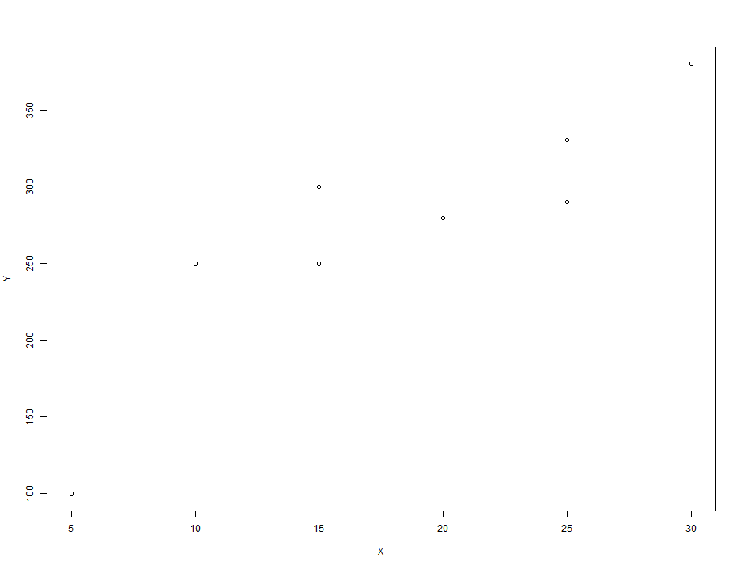
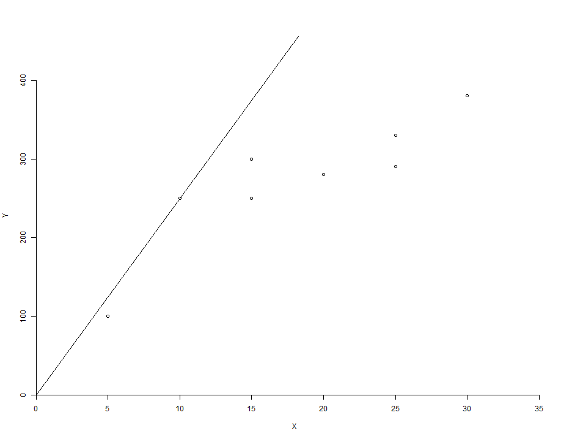
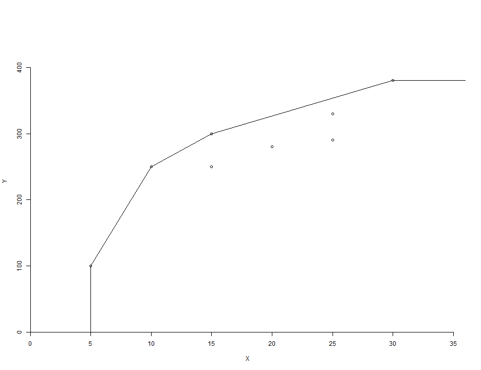
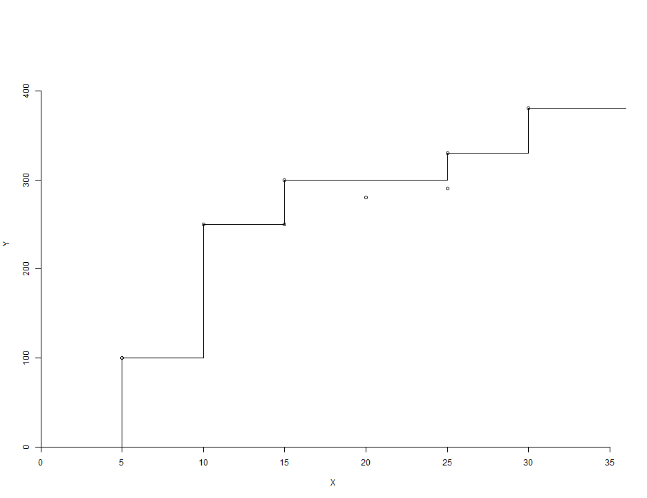
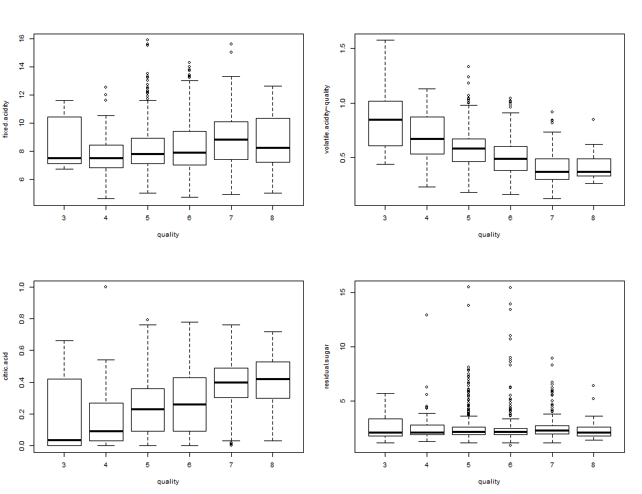
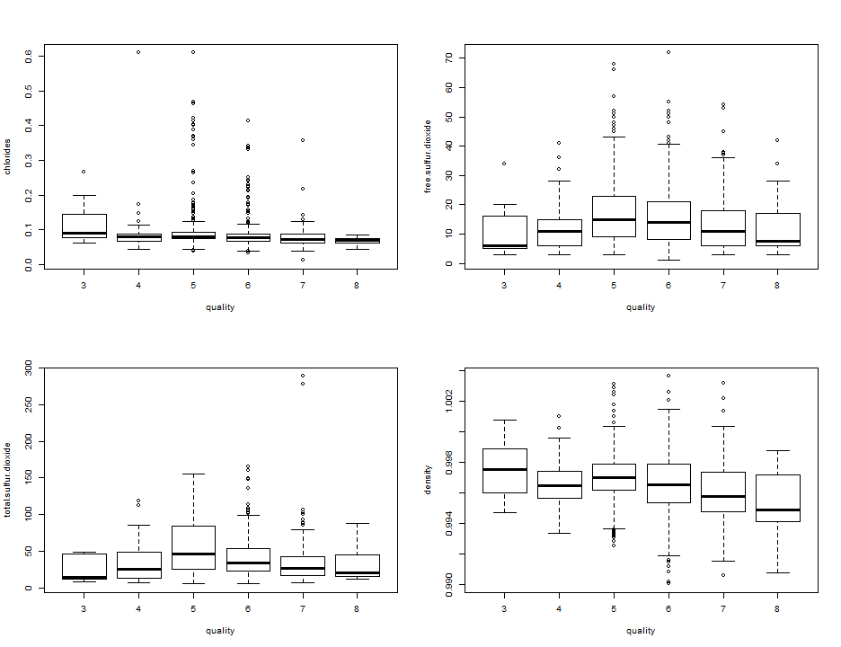
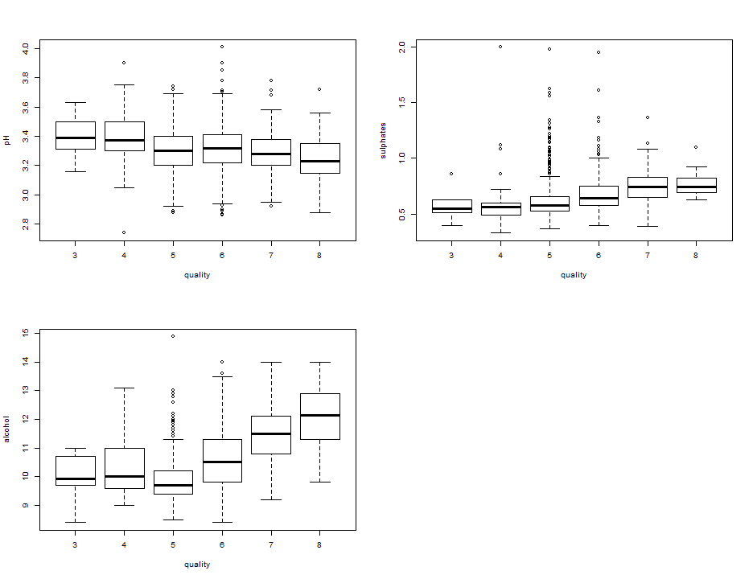

Assignment (Due to May.28th)
========================================================
200903877 황 성 윤
-------------------------

# DEA (Data Envelopment Analysis) 기법을 이용한 생산성 분석.
# Portuguese "Vinho Verde" red wine

### 데이터 불러들이기 및 필요한 패키지 설치

```r
wine <- read.csv("C:/Users/user/Desktop/Sung-yoon.R/Final Exam/Final Assignment 2/winequality.csv", 
    sep = ",", header = T)
install.packages("Benchmarking")
```

```
## Error: trying to use CRAN without setting a mirror
```

```r
library(Benchmarking)
```

```
## Loading required package: lpSolveAPI
## Loading required package: ucminf
```

#### output
quality : 와인의 질
#### input
fixed acidity : 고유산성, volatile acidity : 휘발성,
citric acid : 구연산, residual sugar : 잔여설탕, chlorides : 염화물,
free sulfur dioxide : 아황산가스, total sulfur dioxide : 총 아황산가스,
density : 밀도, pH : 산성도, sulphates : 황산염, alcohol : 알코올

## DEA (Data Envelopment Analysis)
### Estimate of frontier function
### frontier function (y=g(x)) -> Y=g(x)-u (u >= 0, inefficiency factor)

### 기업이나 제조상품의 질 등을 평가할 때 투입 대비 산출이 어느 정도인지가 중요. 
#### (example) 매출액/임대료 = 30 (임대료에 30배만큼 매출을 내고있다.)
#### --> 산출/투입 : 생산 효율성 (productivity or efficiency)
#### 산출(월매출, 위생점수, 불만점수, 방문객수 ..) ,
#### 투입(임대료, 직원수, 유지비, 재료비 ..)
#### 임대료 대비 매출액의 최대값에 관심..

### Data wine
#### Data wine에는 총 1599개의 red wine에 관한 정보가 담겨있다.
#### 이 data에는 와인의 질(quality)에 해당하는 output과 관련된 변수 1개와
#### 와인의 질에 영향을 미칠 수 있다고 여겨지는
#### 11가지의 input과 관련된 변수들이 있다.
#### 변수 quality는 0부터 10까지의 정수로 이루어져 있으며
#### 값이 클 수록 질이 좋은 와인이라고 생각하면 된다.
#### 이 사실을 알고 생산성 분석기법 중 하나인
#### DEA 분석을 이용하여 생산된 와인들에 대한 efficiency에 대하여
#### 분석해보고자 한다.

### DEA 에서 자주 쓰이는 방법
#### 1. CRS (Constant Returns-to-scale) : convex cone (convexity, free disposability를 가정)
input 대비 output을 가장 효율적으로 많이 생산한 경우에 해당하는 점과 원점을 연결하는 직선을 frontier function의 추정값으로 사용한다. 가장 단순한 방법이다.
#### 2. VRS (Variable Returns-to-scale) : convex hull (convexity, free disposability를 가정))
데이터에서 상대적으로 효율적이라고 여겨지는 경우에 해당하는 점들을 각각 선으로 연결하여 단조증가하고 위로 볼록하는 frontier function의 추정값을 만든다.
#### 3. FDH (Free Disposal Hull) : 이상점이 존재할 경우 (free disposability만 가정)
주어진 데이터로부터 실제적으로 구현이 가능한 영역들을 모두 모아놓은 영역에 의하여 만들어지는 함수의 값을 frontier function의 추정값으로 사용한다.

### DEA 분석에서의 2가지 가정
#### 1. free disposability : frontier function g(x) 는 단조증가함수이다.
#### 2. convexity : frontier function g(x) 는 위로 볼록한 함수이다. 이 가정은 데이터에 이상점이 존재하는 경우에는 무시할 수 있다.

### 분석하는 방법
#### case 1 : ORIENTATION="in"
일정한 output을 생산할 때의 최소 input의 값이 실제로 쓰인 input의 어느 정도인지를 나타내는 efficiency의 값을 가지고 평가한다. 이 값이 작을 수록 input의 양이 과다하게 쓰였다는 의미이므로 생산성이 좋지 못한 것으로 판단하면 된다. 그러므로  efficiency의 값이 1인 경우가 가장 효율적인 것이라고 할 수 있다.
#### case 2 : ORIENTATION="out"
일정한 input을 가지고 생산할 수 있는 최대 output의 값이 실제로 생산된 output의 몇 배인지를 나타내는 efficiency의 값을 가지고 평가한다. 이 값이 클 수록 output을 제대로 많이 생산하지 못했다는 의미이므로 생산성이 좋지 못한 것으로 판단하면 된다. 그러므로  efficiency의 값이 1인 경우가 가장 효율적인 것이라고 할 수 있다.

### 먼저 간단하게 공장에서 근무하는 직원들의 숫자와 생산되는 컵의 개수와 관련된 데이터를 가지고 분석해보도록 하겠다. 
### Make data

```r
X <- c(5, 10, 15, 20, 25, 30, 25, 15)  # Number of staffs (input)
Y <- c(100, 250, 300, 280, 330, 380, 290, 250)  # Number of cups (output)
par(mfrow = c(1, 1))
plot(X, Y)
```

 

### Using CRS

```r
res.in <- dea(X, Y, RTS = "crs", ORIENTATION = "in")
res.out <- dea(X, Y, RTS = "crs", ORIENTATION = "out")
cbind(X, Y, res.in$eff, res.out$eff)  # 보는 관점에 따라 순위가 달라짐.
```

```
##       X   Y             
## [1,]  5 100 0.8000 1.250
## [2,] 10 250 1.0000 1.000
## [3,] 15 300 0.8000 1.250
## [4,] 20 280 0.5600 1.786
## [5,] 25 330 0.5280 1.894
## [6,] 30 380 0.5067 1.974
## [7,] 25 290 0.4640 2.155
## [8,] 15 250 0.6667 1.500
```

```r
dea.plot.frontier(X, Y, RTS = "crs")  # 그림 그리기
```

 

### Using VRS

```r
res.in <- dea(X, Y, RTS = "vrs", ORIENTATION = "in")
res.out <- dea(X, Y, RTS = "vrs", ORIENTATION = "out")
cbind(X, Y, res.in$eff, res.out$eff)  # 보는 관점에 따라 순위가 달라짐.
```

```
##       X   Y             
## [1,]  5 100 1.0000 1.000
## [2,] 10 250 1.0000 1.000
## [3,] 15 300 1.0000 1.000
## [4,] 20 280 0.6500 1.167
## [5,] 25 330 0.8250 1.071
## [6,] 30 380 1.0000 1.000
## [7,] 25 290 0.5600 1.218
## [8,] 15 250 0.6667 1.200
```

```r
dea.plot.frontier(X, Y, RTS = "vrs")  # 그림 그리기
```

 

### Using FDH

```r
res.in <- dea(X, Y, RTS = "fdh", ORIENTATION = "in")
res.out <- dea(X, Y, RTS = "fdh", ORIENTATION = "out")
cbind(X, Y, res.in$eff, res.out$eff)  # 보는 관점에 따라 순위가 달라짐.
```

```
##       X   Y             
## [1,]  5 100 1.0000 1.000
## [2,] 10 250 1.0000 1.000
## [3,] 15 300 1.0000 1.000
## [4,] 20 280 0.7500 1.071
## [5,] 25 330 1.0000 1.000
## [6,] 30 380 1.0000 1.000
## [7,] 25 290 0.6000 1.138
## [8,] 15 250 0.6667 1.200
```

```r
dea.plot.frontier(X, Y, RTS = "fdh")  # 그림 그리기
```

 

#### Interpretation
X는 직원의 수이고 Y는 생산되는 컵의 개수이다. 3가지 방법론 모두 가장 비효율적인 경우가 (X,Y)=(25,290) 이라는 결과를 주고 있다. 하지만 효율적인 경우는 결과가 모두 다르다. CRS의 경우 가장 효율적인 경우가 (10,250) 의 한가지 뿐인 것에 반해 VRS는 (5,100), (10,250), (15,300), (30,380) 의 4가지, FDH는 (5,100), (10,250), (15,300), (25,330), (30,380) 의 5가지이다. 각 방법론, 그리고 기준이 input인지 output인지에 따라 결과가 다르게 나올 수 있으므로 분석하고자 하는 데이터에 부합하는 방법이 어떤 것인지 먼저 생각해보는 것도 좋을 것이다. 

## Data wine
#### 이제 본격적으로 wine 데이터에 대하여 분석을 실시해보도록 하자.

### Drawing boxplot

```r
attach(wine)
par(mfrow = c(2, 2))
boxplot(fixed.acidity ~ quality, xlab = "quality", ylab = "fixed.acidity")
boxplot(volatile.acidity ~ quality, xlab = "quality", ylab = "volatile.acidity~quality")
boxplot(citric.acid ~ quality, xlab = "quality", ylab = "citric.acid")
boxplot(residual.sugar ~ quality, xlab = "quality", ylab = "residual.sugar")
```

 

```r
boxplot(chlorides ~ quality, xlab = "quality", ylab = "chlorides")
boxplot(free.sulfur.dioxide ~ quality, xlab = "quality", ylab = "free.sulfur.dioxide")
boxplot(total.sulfur.dioxide ~ quality, xlab = "quality", ylab = "total.sulfur.dioxide")
boxplot(density ~ quality, xlab = "quality", ylab = "density")
```

 

```r
boxplot(pH ~ quality, xlab = "quality", ylab = "pH")
boxplot(sulphates ~ quality, xlab = "quality", ylab = "sulphates")
boxplot(alcohol ~ quality, xlab = "quality", ylab = "alcohol")
```

 

#### Interpretation
boxplot을 그려보니 이상점(outlier)이 많이 존재하는 것으로 보인다. 그렇기 때문에 이 데이터에 적합한 방법은 free disposability 만을 가정하는 FDH 분석이 아닐까 생각해본다. 

### Using CRS

```r
wine.input <- wine[, -1]
res.in <- dea(wine.input, quality, RTS = "crs", ORIENTATION = "in")
res.out <- dea(wine.input, quality, RTS = "crs", ORIENTATION = "out")
# inefficient
min(res.in$eff)
```

```
## [1] 0.3975
```

```r
max(res.out$eff)
```

```
## [1] 2.516
```

```r
which(res.in$eff == min(res.in$eff))
```

```
## [1] 833
```

```r
which(res.out$eff == max(res.out$eff))  # = 833
```

```
## [1] 833
```

```r
wine[which(res.in$eff == min(res.in$eff)), ]
```

```
##     quality fixed.acidity volatile.acidity citric.acid residual.sugar
## 833       3          10.4             0.44        0.42            1.5
##     chlorides free.sulfur.dioxide total.sulfur.dioxide density   pH
## 833     0.145                  34                   48  0.9983 3.38
##     sulphates alcohol
## 833      0.86     9.9
```

```r
# efficient
which(res.in$eff == max(res.in$eff))
```

```
##  [1]    8    9   36  129  143  145  199  201  231  244  245  266  279  391
## [15]  441  445  482  488  496  499  531  536  589  646  658  696  774  798
## [29]  803  807  822  827  829  837  838  874  904  905  908  910  915  916
## [43]  942  949  950  951  979  987  997  998  999 1000 1004 1006 1011 1015
## [57] 1018 1019 1025 1030 1031 1032 1046 1057 1060 1061 1062 1081 1087 1091
## [71] 1111 1121 1123 1126 1127 1131 1148 1178 1202 1203 1229 1235 1237 1238
## [85] 1270 1278 1280 1287 1288 1317 1322 1333 1404 1411 1433 1450 1460 1495
## [99] 1550
```

```r
which(res.out$eff == min(res.out$eff))
```

```
##  [1]    8    9   36  129  143  145  199  201  231  244  245  266  279  391
## [15]  441  445  482  488  496  499  531  536  589  646  658  696  774  798
## [29]  803  807  822  827  829  837  838  874  904  905  908  910  915  916
## [43]  942  949  950  951  979  987  997  998  999 1000 1004 1006 1011 1015
## [57] 1018 1019 1025 1030 1031 1032 1046 1057 1060 1061 1062 1081 1087 1091
## [71] 1111 1121 1123 1126 1127 1131 1148 1178 1202 1203 1229 1235 1237 1238
## [85] 1270 1278 1280 1287 1288 1317 1322 1333 1404 1411 1433 1450 1460 1495
## [99] 1550
```

```r
as.numeric(which(res.in$eff == max(res.in$eff)) == which(res.out$eff == min(res.out$eff)))
```

```
##  [1] 1 1 1 1 1 1 1 1 1 1 1 1 1 1 1 1 1 1 1 1 1 1 1 1 1 1 1 1 1 1 1 1 1 1 1
## [36] 1 1 1 1 1 1 1 1 1 1 1 1 1 1 1 1 1 1 1 1 1 1 1 1 1 1 1 1 1 1 1 1 1 1 1
## [71] 1 1 1 1 1 1 1 1 1 1 1 1 1 1 1 1 1 1 1 1 1 1 1 1 1 1 1 1 1
```

```r
length(which(res.in$eff == max(res.in$eff)))  # = 99
```

```
## [1] 99
```

#### Interpretation
CRS 방법의 결과 833번째 와인 가장 비효율적으로 생산된 것으로 나타났다. 그리고 총 99개의 와인이 benchmarking 할만한 가장 효율적으로 생산품이라는 결과를 주고 있다. 즉 기준이 input인 경우와 기준이 output인 경우가 같은 결과를 주고 있다. 그러나 이 방법은 가장 단순한 방법이기 때문에 왜곡된 결과를 줄 가능성이 있다. 그러므로 VRS 방법을 사용해 동일한 분석을 실시해보겠다. 
#### 833번째 와인에 대한 각각의 input 투입량
고유산성 : 10.4, 휘발성 : 0.44, 구연산 : 0.42, 잔여설탕 : 1.5, 염화물 : 0.145, 아황산가스 : 34, 총 아황산가스 : 48, 밀도 : 0.99832, 산성도 : 3.38, 황산염 : 0.86, 알코올 : 9.9

### Using VRS

```r
res.in <- dea(wine.input, quality, RTS = "vrs", ORIENTATION = "in")
res.out <- dea(wine.input, quality, RTS = "vrs", ORIENTATION = "out")
# inefficient
min(res.in$eff)
```

```
## [1] 0.989
```

```r
max(res.out$eff)
```

```
## [1] 2.483
```

```r
which(res.in$eff == min(res.in$eff))
```

```
## [1] 354
```

```r
which(res.out$eff == max(res.out$eff))  # input : 354, output : 833
```

```
## [1] 833
```

```r
wine[which(res.in$eff == min(res.in$eff)), ]
```

```
##     quality fixed.acidity volatile.acidity citric.acid residual.sugar
## 354       5          13.5             0.53        0.79            4.8
##     chlorides free.sulfur.dioxide total.sulfur.dioxide density   pH
## 354      0.12                  23                   77   1.002 3.18
##     sulphates alcohol
## 354      0.77      13
```

```r
wine[which(res.out$eff == max(res.out$eff)), ]
```

```
##     quality fixed.acidity volatile.acidity citric.acid residual.sugar
## 833       3          10.4             0.44        0.42            1.5
##     chlorides free.sulfur.dioxide total.sulfur.dioxide density   pH
## 833     0.145                  34                   48  0.9983 3.38
##     sulphates alcohol
## 833      0.86     9.9
```

```r
# efficient
which(res.in$eff == max(res.in$eff))
```

```
##   [1]    2    8    9   11   13   19   20   21   26   35   36   39   45   46
##  [15]   49   50   52   53   57   60   63   65   66   81   87   90   92   95
##  [29]   96   98  120  121  123  127  128  129  130  134  143  144  145  151
##  [43]  152  162  168  170  171  172  173  185  199  201  205  211  223  231
##  [57]  232  235  236  237  239  240  241  243  244  245  258  259  266  270
##  [71]  272  278  279  282  302  310  353  355  372  374  391  402  429  440
##  [85]  441  445  452  464  470  481  482  488  496  499  518  529  531  536
##  [99]  545  551  554  567  568  583  584  589  590  592  597  603  605  611
## [113]  612  615  636  646  651  655  657  658  659  661  664  668  670  681
## [127]  689  693  696  703  713  716  724  728  729  743  747  755  757  758
## [141]  759  763  774  781  798  803  806  807  808  809  814  819  822  827
## [155]  829  837  838  859  862  874  877  904  905  908  910  915  916  917
## [169]  942  949  950  951  954  967  979  980  985  987  989  991  993  995
## [183]  997  998  999 1000 1004 1006 1011 1015 1018 1019 1025 1030 1031 1032
## [197] 1046 1052 1055 1056 1057 1060 1061 1062 1068 1069 1077 1080 1081 1082
## [211] 1086 1087 1088 1089 1090 1091 1095 1097 1099 1107 1111 1113 1114 1115
## [225] 1119 1120 1121 1123 1125 1126 1127 1131 1132 1139 1143 1144 1148 1158
## [239] 1163 1166 1169 1178 1179 1186 1188 1195 1198 1199 1201 1202 1203 1215
## [253] 1220 1227 1229 1231 1234 1235 1236 1237 1238 1241 1245 1254 1257 1270
## [267] 1271 1274 1278 1280 1287 1288 1294 1296 1297 1299 1301 1305 1310 1317
## [281] 1320 1322 1323 1333 1337 1338 1339 1348 1349 1352 1356 1357 1360 1363
## [295] 1370 1375 1377 1382 1390 1393 1395 1396 1404 1408 1410 1411 1416 1419
## [309] 1421 1425 1426 1430 1433 1434 1437 1439 1442 1450 1453 1457 1460 1462
## [323] 1471 1476 1478 1481 1483 1484 1489 1490 1491 1492 1493 1495 1496 1501
## [337] 1510 1511 1514 1522 1533 1538 1550 1567 1572 1575 1592
```

```r
which(res.out$eff == min(res.out$eff))
```

```
##   [1]    2    8    9   11   13   19   20   21   26   35   36   39   45   46
##  [15]   49   50   52   53   57   60   63   65   66   81   87   90   92   95
##  [29]   96   98  120  121  123  129  130  134  143  144  145  151  152  162
##  [43]  168  170  171  172  173  185  199  201  205  211  223  231  232  235
##  [57]  236  237  239  240  241  243  244  245  259  266  268  270  272  278
##  [71]  279  282  302  310  353  355  372  374  391  402  429  440  441  445
##  [85]  452  456  464  470  481  482  488  496  499  518  529  531  536  545
##  [99]  551  567  568  583  584  589  590  592  597  603  605  611  612  615
## [113]  636  646  651  655  657  658  659  661  664  668  670  681  689  693
## [127]  696  713  716  724  728  729  743  747  755  757  758  759  763  774
## [141]  781  798  803  806  807  808  809  814  819  822  827  829  837  838
## [155]  859  862  874  877  904  905  908  910  915  916  917  942  949  950
## [169]  951  954  967  979  980  985  987  989  991  993  995  997  998  999
## [183] 1000 1004 1006 1011 1015 1018 1019 1025 1030 1031 1032 1046 1052 1055
## [197] 1056 1057 1060 1061 1062 1068 1069 1080 1081 1082 1086 1087 1088 1089
## [211] 1090 1091 1095 1097 1099 1107 1111 1113 1114 1115 1119 1120 1121 1123
## [225] 1126 1127 1131 1132 1139 1143 1144 1148 1158 1163 1166 1169 1178 1179
## [239] 1186 1188 1195 1198 1199 1201 1202 1203 1215 1220 1227 1229 1231 1234
## [253] 1235 1236 1237 1238 1241 1245 1254 1257 1270 1271 1274 1278 1280 1287
## [267] 1288 1294 1296 1297 1299 1301 1305 1310 1317 1320 1322 1333 1337 1338
## [281] 1339 1348 1349 1352 1356 1357 1360 1363 1370 1375 1382 1390 1393 1395
## [295] 1396 1404 1408 1410 1411 1416 1419 1421 1425 1426 1430 1433 1434 1437
## [309] 1439 1442 1450 1453 1457 1460 1462 1471 1481 1483 1484 1489 1490 1491
## [323] 1492 1493 1495 1496 1510 1511 1514 1522 1533 1538 1550 1567 1572 1575
## [337] 1592
```

```r
length(which(res.in$eff == max(res.in$eff)))  # = 347
```

```
## [1] 347
```

```r
length(which(res.out$eff == min(res.out$eff)))  # = 337
```

```
## [1] 337
```

#### Interpretation
CRS의 경우와는 다르게 VRS 방법론에서는 input 기준에서는 354번째 와인이, output 기준에서는 833번째 와인이 비효율적이라는 결과를 주고 있다. 마찬가지로 benchmarking을 고려해볼 수 있는 효율적인 생산품의 경우에서도 input 기준에서는 347개의 와인이, output 기준에서는 337개의 와인이 각각 효율적이라는 결과를 주고 있다. 어느 기준을 선택하는가에 따라서도 상반된 결과가 나올 수 있으므로 유의해야하겠다.
#### 833번째 와인에 대한 각각의 input 투입량
고유산성 : 13.5, 휘발성 : 0.53, 구연산 : 0.79, 잔여설탕 : 4.8, 염화물 : 0.12, 아황산가스 : 23, 총 아황산가스 : 77, 밀도 : 1.0018, 산성도 : 3.18, 황산염 : 0.77, 알코올 : 13
#### 833번째 와인에 대한 각각의 input 투입량
고유산성 : 10.4, 휘발성 : 0.44, 구연산 : 0.42, 잔여설탕 : 1.5, 염화물 : 0.145, 아황산가스 : 34, 총 아황산가스 : 48, 밀도 : 0.99832, 산성도 : 3.38, 황산염 : 0.86, 알코올 : 9.9

### Using FDH

```r
res.in <- dea(wine.input, quality, RTS = "fdh", ORIENTATION = "in")
res.out <- dea(wine.input, quality, RTS = "fdh", ORIENTATION = "out")
# inefficient
min(res.in$eff)
```

```
## [1] 0.9919
```

```r
max(res.out$eff)
```

```
## [1] 2
```

```r
which(res.in$eff == min(res.in$eff))
```

```
## [1] 652
```

```r
which(res.out$eff == max(res.out$eff))  # input : 652 , output : 833 
```

```
## [1] 833
```

```r
wine[which(res.in$eff == min(res.in$eff)), ]
```

```
##     quality fixed.acidity volatile.acidity citric.acid residual.sugar
## 652       5           9.8             0.88        0.25            2.5
##     chlorides free.sulfur.dioxide total.sulfur.dioxide density   pH
## 652     0.104                  35                  155   1.001 3.41
##     sulphates alcohol
## 652      0.67    11.2
```

```r
wine[which(res.out$eff == max(res.out$eff)), ]
```

```
##     quality fixed.acidity volatile.acidity citric.acid residual.sugar
## 833       3          10.4             0.44        0.42            1.5
##     chlorides free.sulfur.dioxide total.sulfur.dioxide density   pH
## 833     0.145                  34                   48  0.9983 3.38
##     sulphates alcohol
## 833      0.86     9.9
```

```r
# efficient
which(res.in$eff == max(res.in$eff))
```

```
##    [1]    1    2    3    4    5    6    7    8    9   11   13   14   17
##   [14]   18   19   20   21   23   24   25   26   27   28   29   30   31
##   [27]   32   33   34   35   36   37   38   39   40   41   42   43   44
##   [40]   45   46   47   48   49   50   51   52   53   54   55   56   57
##   [53]   58   60   61   62   63   64   65   66   67   68   69   70   71
##   [66]   72   73   74   78   79   80   81   82   83   85   87   88   89
##   [79]   90   91   92   93   94   95   96   97   98   99  100  102  103
##   [92]  104  105  106  107  108  109  110  111  112  113  115  116  118
##  [105]  119  120  121  122  123  124  125  126  127  128  129  130  132
##  [118]  133  134  135  136  137  138  139  140  141  142  143  144  145
##  [131]  147  148  149  151  152  153  154  159  160  161  162  163  167
##  [144]  168  169  170  171  172  173  174  175  176  177  178  179  180
##  [157]  181  182  183  184  185  186  187  189  190  191  192  193  194
##  [170]  195  196  198  199  200  201  202  203  204  205  206  207  208
##  [183]  209  210  211  213  214  215  216  218  219  220  221  222  223
##  [196]  226  227  229  230  231  232  233  234  235  236  237  238  239
##  [209]  240  241  243  244  245  246  247  248  249  250  251  252  253
##  [222]  254  255  256  257  258  259  260  261  262  263  264  265  266
##  [235]  268  269  270  272  273  274  277  278  279  280  281  282  283
##  [248]  284  287  288  289  290  291  292  294  295  296  299  302  304
##  [261]  305  306  307  308  309  310  311  312  314  316  323  325  326
##  [274]  327  330  333  334  335  337  338  340  341  342  345  347  348
##  [287]  350  352  353  355  359  363  364  365  367  368  369  370  372
##  [300]  373  374  376  378  381  383  384  385  387  388  389  390  391
##  [313]  393  394  395  400  402  405  406  407  408  409  410  413  422
##  [326]  423  424  425  426  427  429  431  432  433  434  436  437  438
##  [339]  440  441  442  443  445  446  448  450  451  452  454  455  458
##  [352]  459  460  462  463  464  465  469  470  471  474  475  476  478
##  [365]  479  480  481  482  483  484  485  486  487  488  490  495  496
##  [378]  497  498  499  501  504  505  507  508  511  513  514  515  518
##  [391]  519  522  524  525  528  529  530  531  534  536  537  542  543
##  [404]  544  545  546  547  549  550  551  554  555  556  557  558  559
##  [417]  561  562  563  564  566  567  568  570  572  573  574  577  578
##  [430]  580  581  582  583  584  587  588  589  590  592  594  597  598
##  [443]  599  600  602  603  604  605  606  610  611  612  613  614  615
##  [456]  618  620  621  622  623  627  628  629  630  631  632  633  635
##  [469]  636  638  639  640  646  647  648  649  650  651  653  654  655
##  [482]  656  657  658  659  661  662  663  664  665  666  667  668  669
##  [495]  670  671  672  673  674  675  676  677  680  681  682  684  686
##  [508]  687  689  690  693  695  696  697  698  700  701  702  703  704
##  [521]  705  707  708  709  710  711  713  714  716  717  718  719  720
##  [534]  721  722  723  724  726  728  729  730  733  735  736  737  738
##  [547]  739  740  742  743  745  746  747  748  749  750  751  752  754
##  [560]  755  756  757  758  759  760  761  762  763  764  765  766  767
##  [573]  769  770  771  773  774  775  776  777  778  781  786  787  790
##  [586]  791  792  794  795  796  797  798  799  800  801  802  803  804
##  [599]  805  806  807  808  809  810  811  812  814  818  819  820  821
##  [612]  822  825  826  827  828  829  830  831  832  835  836  837  838
##  [625]  839  840  845  848  850  851  852  853  856  858  859  860  861
##  [638]  862  863  865  867  868  869  871  873  874  875  876  877  878
##  [651]  880  881  883  884  889  891  893  896  897  898  899  901  902
##  [664]  903  904  905  906  908  909  910  911  912  913  914  915  916
##  [677]  917  918  921  924  925  926  927  928  929  930  931  932  933
##  [690]  934  935  936  937  938  939  940  942  943  944  945  946  948
##  [703]  949  950  951  952  953  954  955  956  957  958  959  961  962
##  [716]  963  964  965  967  968  971  972  974  975  976  977  978  979
##  [729]  980  981  983  984  985  986  987  988  989  990  991  992  993
##  [742]  994  995  996  997  998  999 1000 1001 1002 1003 1004 1005 1006
##  [755] 1007 1008 1009 1011 1012 1013 1014 1015 1016 1017 1018 1019 1021
##  [768] 1022 1023 1024 1025 1026 1027 1028 1029 1030 1031 1032 1033 1034
##  [781] 1035 1036 1037 1038 1042 1045 1046 1047 1049 1052 1053 1054 1055
##  [794] 1056 1057 1058 1060 1061 1062 1063 1064 1065 1066 1067 1068 1069
##  [807] 1071 1072 1073 1075 1076 1077 1078 1079 1080 1081 1082 1083 1085
##  [820] 1086 1087 1088 1089 1090 1091 1092 1093 1095 1096 1097 1098 1099
##  [833] 1100 1101 1102 1103 1104 1105 1106 1107 1108 1109 1111 1112 1113
##  [846] 1114 1115 1116 1117 1118 1119 1120 1121 1122 1123 1125 1126 1127
##  [859] 1128 1131 1132 1133 1134 1135 1136 1139 1140 1141 1142 1143 1144
##  [872] 1145 1146 1147 1148 1150 1151 1152 1153 1155 1156 1157 1158 1159
##  [885] 1161 1162 1163 1166 1167 1168 1169 1170 1171 1172 1173 1174 1175
##  [898] 1176 1178 1179 1180 1181 1182 1184 1185 1186 1187 1188 1189 1190
##  [911] 1192 1193 1194 1195 1196 1197 1198 1199 1200 1201 1202 1203 1205
##  [924] 1206 1207 1209 1210 1211 1212 1213 1214 1215 1216 1217 1218 1219
##  [937] 1220 1223 1226 1227 1229 1231 1234 1235 1236 1237 1238 1239 1240
##  [950] 1241 1242 1243 1245 1247 1249 1250 1251 1252 1253 1254 1256 1257
##  [963] 1258 1259 1260 1261 1262 1264 1265 1266 1267 1268 1269 1270 1271
##  [976] 1272 1273 1274 1275 1276 1277 1278 1279 1280 1281 1282 1283 1285
##  [989] 1286 1287 1288 1289 1290 1291 1292 1293 1294 1295 1296 1297 1298
## [1002] 1299 1301 1303 1304 1305 1306 1308 1310 1311 1312 1314 1315 1316
## [1015] 1317 1319 1320 1322 1323 1324 1325 1326 1327 1328 1329 1330 1331
## [1028] 1332 1333 1334 1335 1336 1337 1338 1339 1340 1341 1342 1343 1344
## [1041] 1345 1346 1347 1348 1349 1351 1352 1353 1354 1355 1356 1357 1358
## [1054] 1359 1360 1363 1364 1365 1366 1367 1368 1369 1370 1371 1372 1373
## [1067] 1374 1375 1376 1377 1378 1379 1380 1381 1382 1385 1386 1387 1388
## [1080] 1390 1391 1393 1394 1395 1396 1397 1398 1399 1400 1403 1404 1406
## [1093] 1407 1408 1409 1410 1411 1412 1413 1414 1415 1416 1417 1418 1419
## [1106] 1420 1421 1422 1423 1425 1426 1427 1428 1429 1430 1431 1432 1433
## [1119] 1434 1435 1436 1437 1438 1439 1440 1441 1442 1444 1445 1446 1450
## [1132] 1451 1452 1453 1454 1456 1457 1458 1459 1460 1461 1462 1463 1464
## [1145] 1467 1469 1470 1471 1472 1473 1474 1475 1476 1477 1478 1479 1480
## [1158] 1481 1482 1483 1484 1485 1486 1487 1488 1489 1490 1491 1492 1493
## [1171] 1494 1495 1496 1497 1498 1499 1500 1501 1502 1503 1504 1505 1506
## [1184] 1507 1508 1509 1510 1511 1513 1514 1515 1516 1517 1518 1519 1520
## [1197] 1521 1522 1523 1524 1525 1526 1527 1528 1529 1531 1532 1533 1534
## [1210] 1535 1536 1537 1538 1540 1541 1542 1543 1544 1545 1546 1547 1548
## [1223] 1550 1551 1552 1553 1554 1555 1556 1557 1558 1559 1560 1561 1562
## [1236] 1566 1567 1569 1570 1571 1572 1573 1574 1575 1576 1577 1578 1579
## [1249] 1580 1581 1582 1583 1584 1585 1586 1587 1588 1589 1590 1591 1592
## [1262] 1593 1594 1596 1597 1598 1599
```

```r
which(res.out$eff == min(res.out$eff))
```

```
##    [1]    1    2    4    5    6    7    8    9   11   13   14   15   17
##   [14]   18   19   20   21   22   23   24   25   26   27   28   29   30
##   [27]   31   32   33   34   35   36   37   38   39   40   41   42   43
##   [40]   45   46   47   48   49   50   51   52   53   54   55   56   57
##   [53]   58   60   61   62   63   64   65   66   67   68   69   70   71
##   [66]   72   73   74   78   79   80   81   82   83   84   85   87   88
##   [79]   90   91   92   93   94   95   96   97   98   99  100  102  103
##   [92]  104  105  106  107  108  109  110  111  112  114  115  116  117
##  [105]  118  119  120  121  122  123  124  125  126  127  128  129  130
##  [118]  131  132  133  134  135  136  137  138  139  140  141  142  143
##  [131]  144  145  146  147  148  149  150  151  152  153  154  159  160
##  [144]  161  162  163  166  167  168  169  170  171  172  173  174  175
##  [157]  176  177  178  179  180  181  182  183  184  185  186  187  188
##  [170]  189  190  191  192  193  194  195  196  198  199  200  201  202
##  [183]  203  204  205  206  207  208  209  210  211  212  213  214  215
##  [196]  216  218  219  220  221  222  223  224  226  227  229  230  231
##  [209]  232  233  234  235  236  237  238  239  240  241  242  243  244
##  [222]  245  246  247  248  249  250  251  252  253  254  255  256  257
##  [235]  258  259  260  261  262  263  264  266  268  269  270  271  272
##  [248]  276  277  278  279  280  281  282  283  284  287  288  289  291
##  [261]  292  293  294  295  296  298  299  301  302  304  305  306  307
##  [274]  308  309  310  311  312  313  314  315  316  318  320  323  324
##  [287]  325  326  327  329  330  333  334  335  337  338  340  341  342
##  [300]  343  344  346  347  349  350  351  352  353  355  356  358  359
##  [313]  360  361  363  364  365  367  368  369  370  372  373  374  375
##  [326]  376  378  380  381  383  384  385  386  387  388  389  390  391
##  [339]  393  394  395  396  397  400  401  402  403  404  405  406  407
##  [352]  408  409  410  411  413  414  415  418  419  420  422  423  424
##  [365]  425  426  427  428  429  430  431  432  433  434  435  436  437
##  [378]  438  439  440  441  442  443  444  445  446  448  449  450  451
##  [391]  452  453  454  455  456  458  459  460  462  464  465  469  470
##  [404]  471  474  475  476  478  479  480  481  482  483  484  485  486
##  [417]  487  488  489  490  491  492  493  495  496  497  498  499  501
##  [430]  502  503  504  505  506  507  508  509  510  511  512  513  514
##  [443]  515  518  519  521  522  524  528  529  530  531  534  535  536
##  [456]  537  538  539  542  543  544  545  546  547  548  550  551  552
##  [469]  553  554  555  556  557  558  559  561  562  563  564  566  567
##  [482]  568  569  570  572  574  575  576  577  580  581  582  583  584
##  [495]  585  586  587  588  589  590  592  594  596  597  598  599  600
##  [508]  602  603  604  605  606  607  608  610  611  612  613  614  615
##  [521]  618  620  622  623  625  626  627  628  629  630  631  633  635
##  [534]  636  637  638  639  640  641  643  645  646  647  648  649  650
##  [547]  651  654  655  656  657  658  659  661  662  663  664  667  668
##  [560]  669  670  671  672  674  675  676  677  680  681  682  684  685
##  [573]  686  687  689  690  693  696  697  698  700  701  702  703  704
##  [586]  705  706  707  708  709  710  711  713  714  716  717  718  719
##  [599]  720  721  722  723  724  726  728  729  730  732  733  734  735
##  [612]  736  737  738  739  740  741  742  743  745  746  747  748  749
##  [625]  750  751  752  753  754  755  756  757  758  759  760  762  763
##  [638]  764  765  766  767  769  770  771  774  775  776  777  778  781
##  [651]  782  784  786  787  788  789  790  791  792  793  794  795  796
##  [664]  797  798  799  800  801  802  803  804  805  806  807  808  809
##  [677]  810  811  812  814  817  818  819  820  821  822  823  824  825
##  [690]  826  827  828  829  830  831  832  835  836  837  838  839  840
##  [703]  841  842  844  845  846  847  848  849  850  851  852  853  856
##  [716]  858  859  860  861  862  863  864  865  866  867  868  869  870
##  [729]  871  872  873  874  875  876  877  878  879  880  881  883  884
##  [742]  885  887  888  889  891  893  895  896  897  898  899  902  903
##  [755]  904  905  906  908  909  910  911  912  913  914  915  916  917
##  [768]  918  919  920  921  922  923  924  925  926  927  928  929  930
##  [781]  931  932  933  934  935  938  939  940  941  942  943  944  945
##  [794]  946  948  949  950  951  952  953  954  955  956  959  961  962
##  [807]  963  964  965  966  967  968  970  971  972  973  974  975  978
##  [820]  979  980  981  983  984  985  986  987  988  989  990  991  992
##  [833]  993  994  995  996  997  998  999 1000 1001 1002 1003 1004 1005
##  [846] 1006 1007 1008 1009 1011 1012 1013 1014 1015 1016 1017 1018 1019
##  [859] 1020 1021 1022 1023 1024 1025 1026 1027 1028 1029 1030 1031 1032
##  [872] 1033 1034 1035 1036 1037 1038 1040 1042 1043 1044 1045 1046 1047
##  [885] 1048 1049 1050 1051 1052 1053 1054 1055 1056 1057 1058 1059 1060
##  [898] 1061 1062 1064 1065 1066 1067 1068 1069 1071 1072 1073 1074 1075
##  [911] 1076 1077 1078 1079 1080 1081 1082 1083 1085 1086 1087 1088 1089
##  [924] 1090 1091 1093 1094 1095 1096 1097 1098 1099 1100 1101 1102 1103
##  [937] 1104 1105 1106 1107 1108 1109 1110 1111 1112 1113 1114 1115 1116
##  [950] 1117 1118 1119 1120 1121 1122 1123 1124 1125 1126 1127 1128 1130
##  [963] 1131 1132 1133 1134 1135 1136 1139 1140 1141 1142 1143 1144 1145
##  [976] 1146 1147 1148 1149 1150 1151 1152 1153 1154 1155 1156 1157 1158
##  [989] 1161 1162 1163 1166 1167 1168 1169 1170 1171 1172 1174 1175 1176
## [1002] 1178 1179 1180 1181 1182 1184 1185 1186 1187 1188 1189 1190 1192
## [1015] 1193 1194 1195 1196 1197 1198 1199 1200 1201 1202 1203 1204 1205
## [1028] 1206 1207 1209 1210 1211 1212 1213 1214 1215 1216 1217 1218 1219
## [1041] 1220 1223 1225 1226 1227 1229 1230 1231 1233 1234 1235 1236 1237
## [1054] 1238 1239 1240 1241 1245 1247 1249 1250 1251 1252 1253 1254 1256
## [1067] 1257 1258 1259 1260 1261 1262 1264 1265 1266 1267 1268 1269 1270
## [1080] 1271 1272 1273 1274 1275 1276 1277 1278 1279 1280 1281 1282 1283
## [1093] 1284 1285 1286 1287 1288 1291 1292 1293 1294 1295 1296 1297 1298
## [1106] 1299 1301 1302 1303 1305 1306 1310 1311 1312 1313 1314 1315 1316
## [1119] 1317 1319 1320 1322 1323 1324 1325 1326 1327 1328 1329 1330 1331
## [1132] 1332 1333 1334 1335 1336 1337 1338 1339 1340 1341 1342 1343 1344
## [1145] 1345 1346 1347 1348 1349 1350 1352 1353 1354 1355 1356 1357 1358
## [1158] 1359 1360 1363 1365 1366 1367 1368 1369 1370 1371 1372 1373 1374
## [1171] 1375 1376 1377 1378 1379 1380 1381 1382 1383 1384 1385 1386 1387
## [1184] 1388 1389 1390 1391 1393 1394 1395 1396 1397 1398 1399 1400 1401
## [1197] 1402 1403 1404 1405 1406 1407 1408 1409 1410 1411 1412 1413 1414
## [1210] 1416 1418 1419 1420 1421 1422 1423 1425 1426 1427 1428 1429 1430
## [1223] 1431 1432 1433 1434 1435 1436 1437 1438 1439 1440 1441 1442 1444
## [1236] 1445 1446 1448 1449 1450 1451 1452 1453 1454 1455 1456 1457 1458
## [1249] 1459 1460 1461 1462 1463 1464 1465 1466 1467 1469 1470 1471 1472
## [1262] 1473 1474 1475 1476 1477 1478 1479 1480 1481 1482 1483 1484 1485
## [1275] 1486 1487 1488 1489 1490 1491 1492 1493 1494 1495 1496 1497 1498
## [1288] 1499 1500 1501 1502 1503 1504 1505 1506 1507 1508 1509 1510 1511
## [1301] 1513 1514 1515 1516 1517 1518 1519 1520 1521 1522 1523 1524 1525
## [1314] 1526 1527 1528 1529 1530 1531 1532 1533 1534 1535 1536 1537 1538
## [1327] 1539 1540 1541 1542 1543 1544 1545 1546 1547 1548 1550 1551 1552
## [1340] 1553 1554 1555 1556 1557 1558 1559 1560 1561 1562 1563 1564 1565
## [1353] 1566 1567 1568 1569 1570 1571 1572 1573 1574 1575 1576 1577 1578
## [1366] 1579 1580 1581 1582 1583 1584 1585 1587 1588 1589 1590 1591 1592
## [1379] 1593 1594 1595 1596 1597 1599
```

```r
length(which(res.in$eff == max(res.in$eff)))  # = 1267
```

```
## [1] 1267
```

```r
length(which(res.out$eff == min(res.out$eff)))  # = 1384
```

```
## [1] 1384
```

#### Interpretation
VRS의 경우와 마찬가지로 FDH 방법론의 경우에도 기준설정에 따라 상반된 결과를 주고 있다. input 기준의 경우는 652번째 와인이, output 기준의 경우는 833번째 와인이 가장 비효율적이라는 결과이다. 또한 input 기준의 경우는 1267개의 와인이, output 기준의 경우는 1384개의 와인이 가장 효율적으로 생산되었으므로 benchmarking을 고려해볼 만한 생산품이라는 결과를 주고 있다.
#### 652번째 와인에 대한 각각의 input 투입량
고유산성 : 9.8, 휘발성 : 0.88, 구연산 : 0.25, 잔여설탕 : 2.5, 염화물 : 0.104, 아황산가스 : 35, 총 아황산가스 : 155, 밀도 : 1.001, 산성도 : 3.41, 황산염 : 0.67, 알코올 : 11.2
#### 833번째 와인에 대한 각각의 input 투입량
고유산성 : 10.4, 휘발성 : 0.44, 구연산 : 0.42, 잔여설탕 : 1.5, 염화물 : 0.145, 아황산가스 : 34, 총 아황산가스 : 48, 밀도 : 0.99832, 산성도 : 3.38, 황산염 : 0.86, 알코올 : 9.9
