Final Assignment 2 (금융자료분석 및 실습)
========================================================
200903877 황 성 윤
-------------------------
# 2000년부터 2009년까지의 미국의 5가지 제조업에 대한 효율성의 경향 분석
## 제조업 1 : 남성용 신발 제조업 (code : 316213 (row 104))
## 제조업 2 : 여성용 신발 제조업 (code : 316214 (row 105))
## 제조업 3 : 여행용 가방 제조업 (code : 316991 (row 107))
## 제조업 4 : 세탁용 기계 제조업 (code : 333312 (row 320))
## 제조업 5 : 사진제작 장비 제조업 (code : 333315 (row 323))

### 데이터 불러들이기 & 패키지 설치

```r
nber2000 <- read.csv("C:/Users/user/Desktop/Sung-yoon.R/Final Exam/Final Assignment 2,3/Final Assignment 2/nber2000.csv", 
    sep = ",", header = T)
nber2001 <- read.csv("C:/Users/user/Desktop/Sung-yoon.R/Final Exam/Final Assignment 2,3/Final Assignment 2/nber2001.csv", 
    sep = ",", header = T)
nber2002 <- read.csv("C:/Users/user/Desktop/Sung-yoon.R/Final Exam/Final Assignment 2,3/Final Assignment 2/nber2002.csv", 
    sep = ",", header = T)
nber2003 <- read.csv("C:/Users/user/Desktop/Sung-yoon.R/Final Exam/Final Assignment 2,3/Final Assignment 2/nber2003.csv", 
    sep = ",", header = T)
nber2004 <- read.csv("C:/Users/user/Desktop/Sung-yoon.R/Final Exam/Final Assignment 2,3/Final Assignment 2/nber2004.csv", 
    sep = ",", header = T)
nber2005 <- read.csv("C:/Users/user/Desktop/Sung-yoon.R/Final Exam/Final Assignment 2,3/Final Assignment 2/nber2005.csv", 
    sep = ",", header = T)
nber2006 <- read.csv("C:/Users/user/Desktop/Sung-yoon.R/Final Exam/Final Assignment 2,3/Final Assignment 2/nber2006.csv", 
    sep = ",", header = T)
nber2007 <- read.csv("C:/Users/user/Desktop/Sung-yoon.R/Final Exam/Final Assignment 2,3/Final Assignment 2/nber2007.csv", 
    sep = ",", header = T)
nber2008 <- read.csv("C:/Users/user/Desktop/Sung-yoon.R/Final Exam/Final Assignment 2,3/Final Assignment 2/nber2008.csv", 
    sep = ",", header = T)
nber2009 <- read.csv("C:/Users/user/Desktop/Sung-yoon.R/Final Exam/Final Assignment 2,3/Final Assignment 2/nber2009.csv", 
    sep = ",", header = T)
install.packages("Benchmarking")
```

```
## Error: trying to use CRAN without setting a mirror
```

```r
library(Benchmarking)
```

```
## Loading required package: lpSolveAPI
## Loading required package: ucminf
```


### 제조업의 효율성 분석을 위해 사용할 input, output 변수
#### output : vadd(Total value added in $1m : 총 부가가치(column 10))
#### input : emp(Total employment in 1000s : 총 고용자의 수(column 3)), invest(Total capital expenditure in $1m : 총 자본지출 비용(column 11)), cap(Total real capital stock in $1m : 회사의 총 자본금(column 14))

## DEA (Data Envelopment Analysis)
### Estimate of frontier function
### frontier function (y=g(x)) -> Y=g(x)-u (u >= 0, inefficiency factor)

### 기업이나 제조상품의 질 등을 평가할 때 투입 대비 산출이 어느 정도인지가 중요. 
#### (example) 매출액/임대료 = 30 (임대료에 30배만큼 매출을 내고있다.)
#### --> 산출/투입 : 생산 효율성 (productivity or efficiency)
#### 산출(월매출, 위생점수, 불만점수, 방문객수 ..) ,
#### 투입(임대료, 직원수, 유지비, 재료비 ..)
#### 임대료 대비 매출액의 최대값에 관심..

### DEA 에서 자주 쓰이는 방법
#### 1. CRS (Constant Returns-to-scale) : convex cone (convexity, free disposability를 가정)
input 대비 output을 가장 효율적으로 많이 생산한 경우에 해당하는 점과 원점을 연결하는 직선을 frontier function의 추정값으로 사용한다. 가장 단순한 방법이다.
#### 2. VRS (Variable Returns-to-scale) : convex hull (convexity, free disposability를 가정))
데이터에서 상대적으로 효율적이라고 여겨지는 경우에 해당하는 점들을 각각 선으로 연결하여 단조증가하고 위로 볼록하는 frontier function의 추정값을 만든다.
#### 3. FDH (Free Disposal Hull) : 이상점이 존재할 경우 (free disposability만 가정)
주어진 데이터로부터 실제적으로 구현이 가능한 영역들을 모두 모아놓은 영역에 의하여 만들어지는 함수의 값을 frontier function의 추정값으로 사용한다.

### DEA 분석에서의 2가지 가정
#### 1. free disposability : frontier function g(x) 는 단조증가함수이다.
#### 2. convexity : frontier function g(x) 는 위로 볼록한 함수이다. 이 가정은 데이터에 이상점이 존재하는 경우에는 무시할 수 있다.

### 분석하는 방법
#### case 1 : ORIENTATION="in"
일정한 output을 생산할 때의 최소 input의 값이 실제로 쓰인 input의 어느 정도인지를 나타내는 efficiency의 값을 가지고 평가한다. 이 값이 작을 수록 input의 양이 과다하게 쓰였다는 의미이므로 생산성이 좋지 못한 것으로 판단하면 된다. 그러므로  efficiency의 값이 1인 경우가 가장 효율적인 것이라고 할 수 있다.
#### case 2 : ORIENTATION="out"
일정한 input을 가지고 생산할 수 있는 최대 output의 값이 실제로 생산된 output의 몇 배인지를 나타내는 efficiency의 값을 가지고 평가한다. 이 값이 클 수록 output을 제대로 많이 생산하지 못했다는 의미이므로 생산성이 좋지 못한 것으로 판단하면 된다. 그러므로  efficiency의 값이 1인 경우가 가장 효율적인 것이라고 할 수 있다.

### 먼저 간단하게 공장에서 근무하는 직원들의 숫자와 생산되는 컵의 개수와 관련된 데이터를 가지고 분석해보도록 하겠다. 
### Make data

```r
par(mfrow = c(1, 1))
X <- c(5, 10, 15, 20, 25, 30, 25, 15)  # Number of staffs (input)
Y <- c(100, 250, 300, 280, 330, 380, 290, 250)  # Number of cups (output)
par(mfrow = c(1, 1))
plot(X, Y)
```

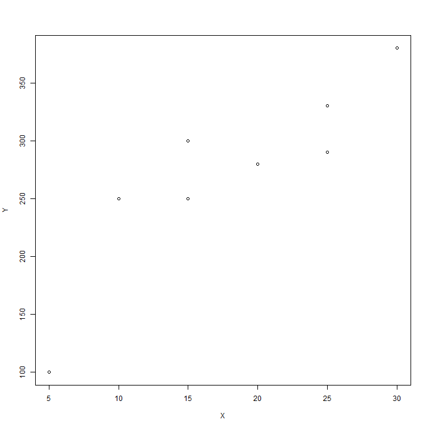 

### Using CRS

```r
par(mfrow = c(1, 1))
res.in <- dea(X, Y, RTS = "crs", ORIENTATION = "in")
res.out <- dea(X, Y, RTS = "crs", ORIENTATION = "out")
cbind(X, Y, res.in$eff, res.out$eff)  # 보는 관점에 따라 순위가 달라짐.
```

```
##       X   Y             
## [1,]  5 100 0.8000 1.250
## [2,] 10 250 1.0000 1.000
## [3,] 15 300 0.8000 1.250
## [4,] 20 280 0.5600 1.786
## [5,] 25 330 0.5280 1.894
## [6,] 30 380 0.5067 1.974
## [7,] 25 290 0.4640 2.155
## [8,] 15 250 0.6667 1.500
```

```r
dea.plot.frontier(X, Y, RTS = "crs")  # 그림 그리기
```

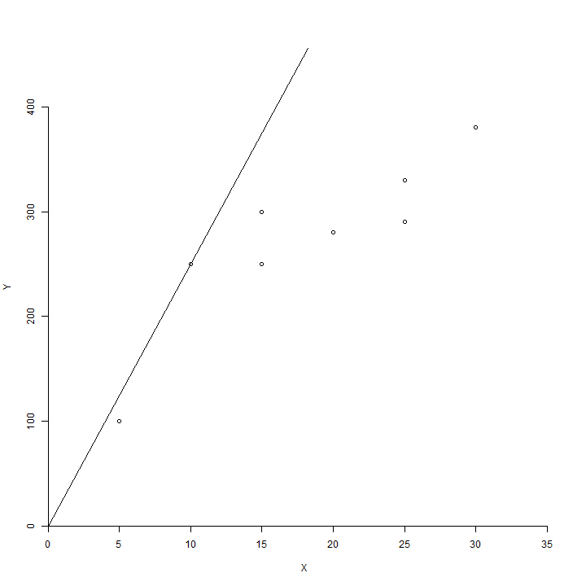 

### Using VRS

```r
par(mfrow = c(1, 1))
res.in <- dea(X, Y, RTS = "vrs", ORIENTATION = "in")
res.out <- dea(X, Y, RTS = "vrs", ORIENTATION = "out")
cbind(X, Y, res.in$eff, res.out$eff)  # 보는 관점에 따라 순위가 달라짐.
```

```
##       X   Y             
## [1,]  5 100 1.0000 1.000
## [2,] 10 250 1.0000 1.000
## [3,] 15 300 1.0000 1.000
## [4,] 20 280 0.6500 1.167
## [5,] 25 330 0.8250 1.071
## [6,] 30 380 1.0000 1.000
## [7,] 25 290 0.5600 1.218
## [8,] 15 250 0.6667 1.200
```

```r
dea.plot.frontier(X, Y, RTS = "vrs")  # 그림 그리기
```

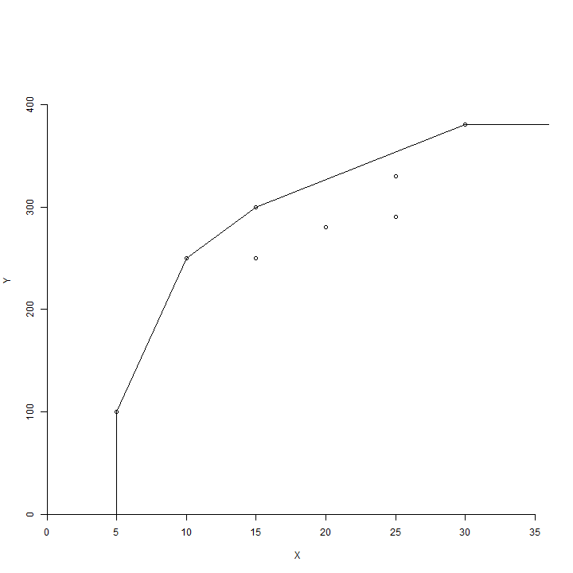 

### Using FDH

```r
par(mfrow = c(1, 1))
res.in <- dea(X, Y, RTS = "fdh", ORIENTATION = "in")
res.out <- dea(X, Y, RTS = "fdh", ORIENTATION = "out")
cbind(X, Y, res.in$eff, res.out$eff)  # 보는 관점에 따라 순위가 달라짐.
```

```
##       X   Y             
## [1,]  5 100 1.0000 1.000
## [2,] 10 250 1.0000 1.000
## [3,] 15 300 1.0000 1.000
## [4,] 20 280 0.7500 1.071
## [5,] 25 330 1.0000 1.000
## [6,] 30 380 1.0000 1.000
## [7,] 25 290 0.6000 1.138
## [8,] 15 250 0.6667 1.200
```

```r
dea.plot.frontier(X, Y, RTS = "fdh")  # 그림 그리기
```

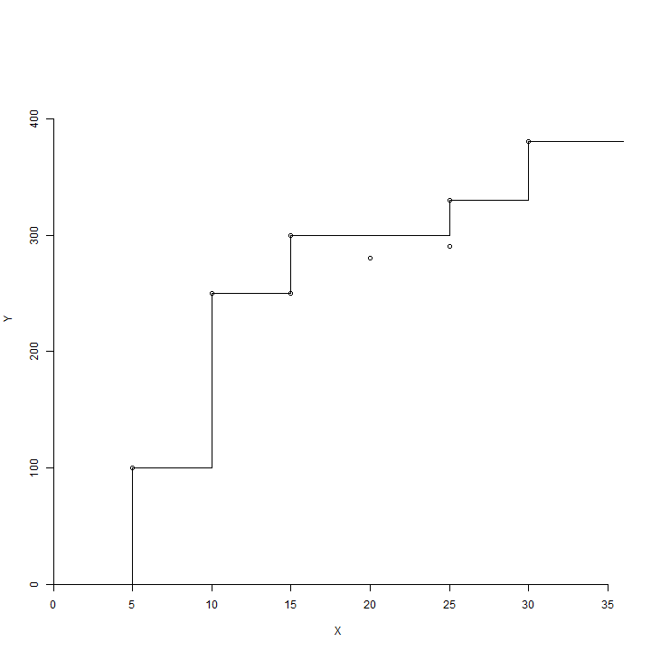 

#### Interpretation
X는 직원의 수이고 Y는 생산되는 컵의 개수이다. 3가지 방법론 모두 가장 비효율적인 경우가 (X,Y)=(25,290) 이라는 결과를 주고 있다. 하지만 효율적인 경우는 결과가 모두 다르다. CRS의 경우 가장 효율적인 경우가 (10,250) 의 한가지 뿐인 것에 반해 VRS는 (5,100), (10,250), (15,300), (30,380) 의 4가지, FDH는 (5,100), (10,250), (15,300), (25,330), (30,380) 의 5가지이다. 각 방법론, 그리고 기준이 input인지 output인지에 따라 결과가 다르게 나올 수 있으므로 분석하고자 하는 데이터에 부합하는 방법이 어떤 것인지 먼저 생각해보는 것도 좋을 것이다. 

# Input criterion
## 분석을 함에 있어 방법론은 input과 output의 관계를 나타내는 plot을 보고 선택할 것이다.

## 2000년
### Graph of 'output vs input'

```r
par(mfrow = c(2, 3))
X <- nber2000[, c(3, 11, 14)]  # input
Y <- nber2000[, c(10)]  # output
plot(X[, 1], Y, main = "emp vs vadd")
plot(X[, 2], Y, main = "invest vs vadd")
plot(X[, 3], Y, main = "cap vs vadd")
# log transformation
X.2000 <- log(nber2000[, c(3, 11, 14)])  # input
Y.2000 <- log(nber2000[, c(10)])  # output
plot(X.2000[, 1], Y.2000, main = "emp vs vadd")
plot(X.2000[, 2], Y.2000, main = "invest vs vadd")
plot(X.2000[, 3], Y.2000, main = "cap vs vadd")
```

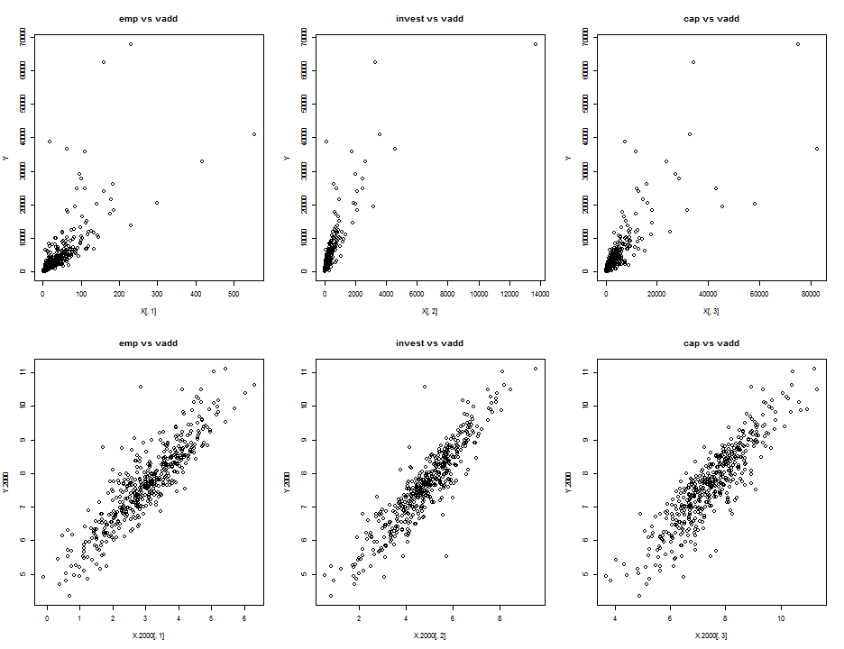 

#### Interpretation
그림을 보면 데이터에 이상점이 존재함을 알 수 있다. 따라서 input과 output에 각각 log 변환을 실시했으며 그 결과 이상점이 사라짐을 확인하였다. 변환 이후에 얻어진 그림을 통해 VRS 방법론을 사용하기로 결정하였다.

### Using VRS

```r
dea.res.2000 <- dea(X.2000, Y.2000, RTS = "vrs", ORIENTATION = "in")
res.2000 <- cbind(dea.res.2000$eff[104], dea.res.2000$eff[105], dea.res.2000$eff[107], 
    dea.res.2000$eff[320], dea.res.2000$eff[323])
rownames(res.2000) <- c("Year2000")
colnames(res.2000) <- c("316213", "316214", "316991", "333312", "333315")
res.2000
```

```
##          316213 316214 316991 333312 333315
## Year2000 0.7983 0.9377 0.8871 0.7615 0.7589
```


## 2001년
### Graph of 'output vs input'

```r
par(mfrow = c(2, 3))
X <- nber2001[, c(3, 11, 14)]  # input
Y <- nber2001[, c(10)]  # output
plot(X[, 1], Y, main = "emp vs vadd")
plot(X[, 2], Y, main = "invest vs vadd")
plot(X[, 3], Y, main = "cap vs vadd")
# log transformation
X.2001 <- log(nber2001[, c(3, 11, 14)])  # input
Y.2001 <- log(nber2001[, c(10)])  # output
plot(X.2001[, 1], Y.2001, main = "emp vs vadd")
plot(X.2001[, 2], Y.2001, main = "invest vs vadd")
plot(X.2001[, 3], Y.2001, main = "cap vs vadd")
```

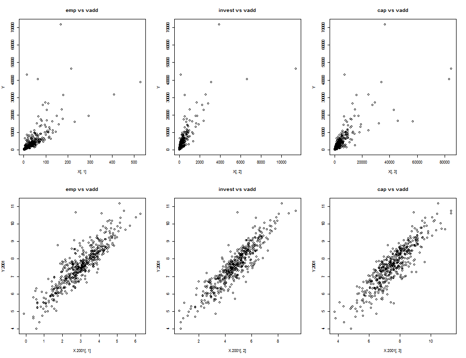 

#### Interpretation
그림을 보면 데이터에 이상점이 존재함을 알 수 있다. 따라서 input과 output에 각각 log 변환을 실시했으며 그 결과 이상점이 사라짐을 확인하였다. 변환 이후에 얻어진 그림을 통해 VRS 방법론을 사용하기로 결정하였다.

### Using VRS

```r
dea.res.2001 <- dea(X.2001, Y.2001, RTS = "vrs", ORIENTATION = "in")
res.2001 <- cbind(dea.res.2001$eff[104], dea.res.2001$eff[105], dea.res.2001$eff[107], 
    dea.res.2001$eff[320], dea.res.2001$eff[323])
rownames(res.2001) <- c("Year2001")
colnames(res.2001) <- c("316213", "316214", "316991", "333312", "333315")
res.2001
```

```
##          316213 316214 316991 333312 333315
## Year2001 0.8713      1 0.9737 0.7858  0.732
```


## 2002년
### Graph of 'output vs input'

```r
par(mfrow = c(2, 3))
X <- nber2002[, c(3, 11, 14)]  # input
Y <- nber2002[, c(10)]  # output
plot(X[, 1], Y, main = "emp vs vadd")
plot(X[, 2], Y, main = "invest vs vadd")
plot(X[, 3], Y, main = "cap vs vadd")
# log transformation
X.2002 <- log(nber2002[, c(3, 11, 14)])  # input
Y.2002 <- log(nber2002[, c(10)])  # output
plot(X.2002[, 1], Y.2002, main = "emp vs vadd")
plot(X.2002[, 2], Y.2002, main = "invest vs vadd")
plot(X.2002[, 3], Y.2002, main = "cap vs vadd")
```

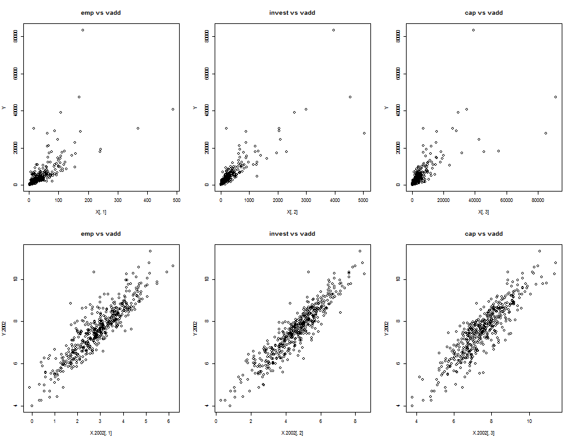 

#### Interpretation
그림을 보면 데이터에 이상점이 존재함을 알 수 있다. 따라서 input과 output에 각각 log 변환을 실시했으며 그 결과 이상점이 사라짐을 확인하였다. 변환 이후에 얻어진 그림을 통해 VRS 방법론을 사용하기로 결정하였다.

### Using VRS

```r
dea.res.2002 <- dea(X.2002, Y.2002, RTS = "vrs", ORIENTATION = "in")
res.2002 <- cbind(dea.res.2002$eff[104], dea.res.2002$eff[105], dea.res.2002$eff[107], 
    dea.res.2002$eff[320], dea.res.2002$eff[323])
rownames(res.2002) <- c("Year2002")
colnames(res.2002) <- c("316213", "316214", "316991", "333312", "333315")
res.2002
```

```
##          316213 316214 316991 333312 333315
## Year2002 0.8163 0.7875      1 0.7928 0.6651
```


## 2003년
### Graph of 'output vs input'

```r
par(mfrow = c(2, 3))
X <- nber2003[, c(3, 11, 14)]  # input
Y <- nber2003[, c(10)]  # output
plot(X[, 1], Y, main = "emp vs vadd")
plot(X[, 2], Y, main = "invest vs vadd")
plot(X[, 3], Y, main = "cap vs vadd")
# log transformation
X.2003 <- log(nber2003[, c(3, 11, 14)])  # input
Y.2003 <- log(nber2003[, c(10)])  # output
plot(X.2003[, 1], Y.2003, main = "emp vs vadd")
plot(X.2003[, 2], Y.2003, main = "invest vs vadd")
plot(X.2003[, 3], Y.2003, main = "cap vs vadd")
```

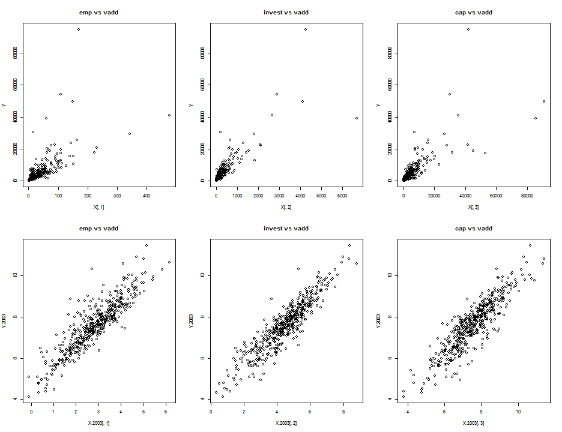 

#### Interpretation
그림을 보면 데이터에 이상점이 존재함을 알 수 있다. 따라서 input과 output에 각각 log 변환을 실시했으며 그 결과 이상점이 사라짐을 확인하였다. 변환 이후에 얻어진 그림을 통해 VRS 방법론을 사용하기로 결정하였다.

### Using VRS

```r
dea.res.2003 <- dea(X.2003, Y.2003, RTS = "vrs", ORIENTATION = "in")
res.2003 <- cbind(dea.res.2003$eff[104], dea.res.2003$eff[105], dea.res.2003$eff[107], 
    dea.res.2003$eff[320], dea.res.2003$eff[323])
rownames(res.2003) <- c("Year2003")
colnames(res.2003) <- c("316213", "316214", "316991", "333312", "333315")
res.2003
```

```
##          316213 316214 316991 333312 333315
## Year2003 0.8223 0.7859 0.8458 0.7969 0.7875
```


## 2004년
### Graph of 'output vs input'

```r
par(mfrow = c(2, 3))
X <- nber2004[, c(3, 11, 14)]  # input
Y <- nber2004[, c(10)]  # output
plot(X[, 1], Y, main = "emp vs vadd")
plot(X[, 2], Y, main = "invest vs vadd")
plot(X[, 3], Y, main = "cap vs vadd")
# log transformation
X.2004 <- log(nber2004[, c(3, 11, 14)])  # input
Y.2004 <- log(nber2004[, c(10)])  # output
plot(X.2004[, 1], Y.2004, main = "emp vs vadd")
plot(X.2004[, 2], Y.2004, main = "invest vs vadd")
plot(X.2004[, 3], Y.2004, main = "cap vs vadd")
```

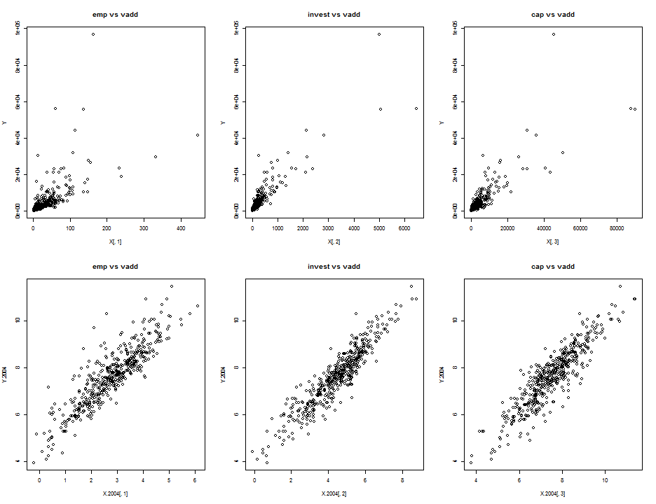 

#### Interpretation
그림을 보면 데이터에 이상점이 존재함을 알 수 있다. 따라서 input과 output에 각각 log 변환을 실시했으며 그 결과 이상점이 사라짐을 확인하였다. 변환 이후에 얻어진 그림을 통해 VRS 방법론을 사용하기로 결정하였다.

### Using VRS

```r
dea.res.2004 <- dea(X.2004, Y.2004, RTS = "vrs", ORIENTATION = "in")
res.2004 <- cbind(dea.res.2004$eff[104], dea.res.2004$eff[105], dea.res.2004$eff[107], 
    dea.res.2004$eff[320], dea.res.2004$eff[323])
rownames(res.2004) <- c("Year2004")
colnames(res.2004) <- c("316213", "316214", "316991", "333312", "333315")
res.2004
```

```
##          316213 316214 316991 333312 333315
## Year2004 0.7997  0.752 0.8613   0.81 0.6898
```


## 2005년
### Graph of 'output vs input'

```r
par(mfrow = c(2, 3))
X <- nber2005[, c(3, 11, 14)]  # input
Y <- nber2005[, c(10)]  # output
plot(X[, 1], Y, main = "emp vs vadd")
plot(X[, 2], Y, main = "invest vs vadd")
plot(X[, 3], Y, main = "cap vs vadd")
# log transformation
X.2005 <- log(nber2005[, c(3, 11, 14)])  # input
Y.2005 <- log(nber2005[, c(10)])  # output
plot(X.2005[, 1], Y.2005, main = "emp vs vadd")
plot(X.2005[, 2], Y.2005, main = "invest vs vadd")
plot(X.2005[, 3], Y.2005, main = "cap vs vadd")
```

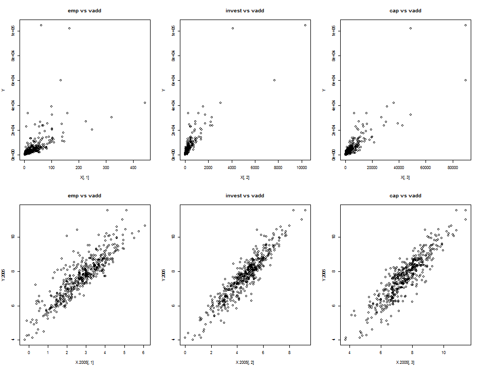 

#### Interpretation
그림을 보면 데이터에 이상점이 존재함을 알 수 있다. 따라서 input과 output에 각각 log 변환을 실시했으며 그 결과 이상점이 사라짐을 확인하였다. 변환 이후에 얻어진 그림을 통해 VRS 방법론을 사용하기로 결정하였다.

### Using VRS

```r
dea.res.2005 <- dea(X.2005, Y.2005, RTS = "vrs", ORIENTATION = "in")
res.2005 <- cbind(dea.res.2005$eff[104], dea.res.2005$eff[105], dea.res.2005$eff[107], 
    dea.res.2005$eff[320], dea.res.2005$eff[323])
rownames(res.2005) <- c("Year2005")
colnames(res.2005) <- c("316213", "316214", "316991", "333312", "333315")
res.2005
```

```
##          316213 316214 316991 333312 333315
## Year2005 0.8307 0.9282 0.8665 0.8588 0.7881
```


## 2006년
### Graph of 'output vs input'

```r
par(mfrow = c(2, 3))
X <- nber2006[, c(3, 11, 14)]  # input
Y <- nber2006[, c(10)]  # output
plot(X[, 1], Y, main = "emp vs vadd")
plot(X[, 2], Y, main = "invest vs vadd")
plot(X[, 3], Y, main = "cap vs vadd")
# log transformation
X.2006 <- log(nber2006[, c(3, 11, 14)])  # input
Y.2006 <- log(nber2006[, c(10)])  # output
plot(X.2006[, 1], Y.2006, main = "emp vs vadd")
plot(X.2006[, 2], Y.2006, main = "invest vs vadd")
plot(X.2006[, 3], Y.2006, main = "cap vs vadd")
```

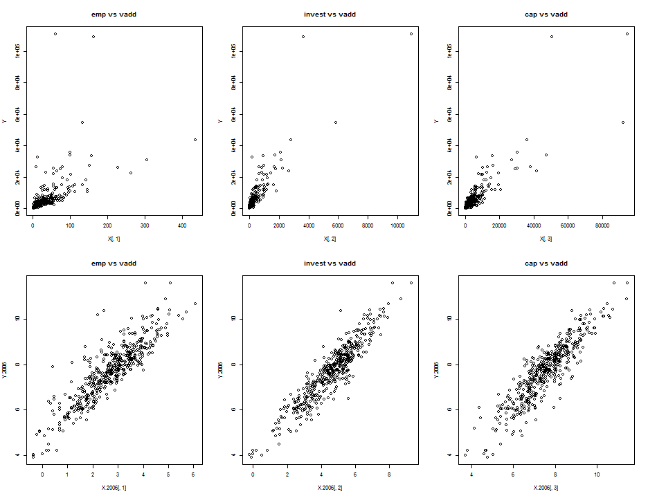 

#### Interpretation
그림을 보면 데이터에 이상점이 존재함을 알 수 있다. 따라서 input과 output에 각각 log 변환을 실시했으며 그 결과 이상점이 사라짐을 확인하였다. 변환 이후에 얻어진 그림을 통해 VRS 방법론을 사용하기로 결정하였다.

### Using VRS

```r
dea.res.2006 <- dea(X.2006, Y.2006, RTS = "vrs", ORIENTATION = "in")
res.2006 <- cbind(dea.res.2006$eff[104], dea.res.2006$eff[105], dea.res.2006$eff[107], 
    dea.res.2006$eff[320], dea.res.2006$eff[323])
rownames(res.2006) <- c("Year2006")
colnames(res.2006) <- c("316213", "316214", "316991", "333312", "333315")
res.2006
```

```
##          316213 316214 316991 333312 333315
## Year2006 0.7923 0.8632 0.8362 0.8599 0.7361
```


## 2007년
### Graph of 'output vs input'

```r
par(mfrow = c(2, 3))
X <- nber2007[, c(3, 11, 14)]  # input
Y <- nber2007[, c(10)]  # output
plot(X[, 1], Y, main = "emp vs vadd")
plot(X[, 2], Y, main = "invest vs vadd")
plot(X[, 3], Y, main = "cap vs vadd")
# log transformation
X.2007 <- log(nber2007[, c(3, 11, 14)])  # input
Y.2007 <- log(nber2007[, c(10)])  # output
plot(X.2007[, 1], Y.2007, main = "emp vs vadd")
plot(X.2007[, 2], Y.2007, main = "invest vs vadd")
plot(X.2007[, 3], Y.2007, main = "cap vs vadd")
```

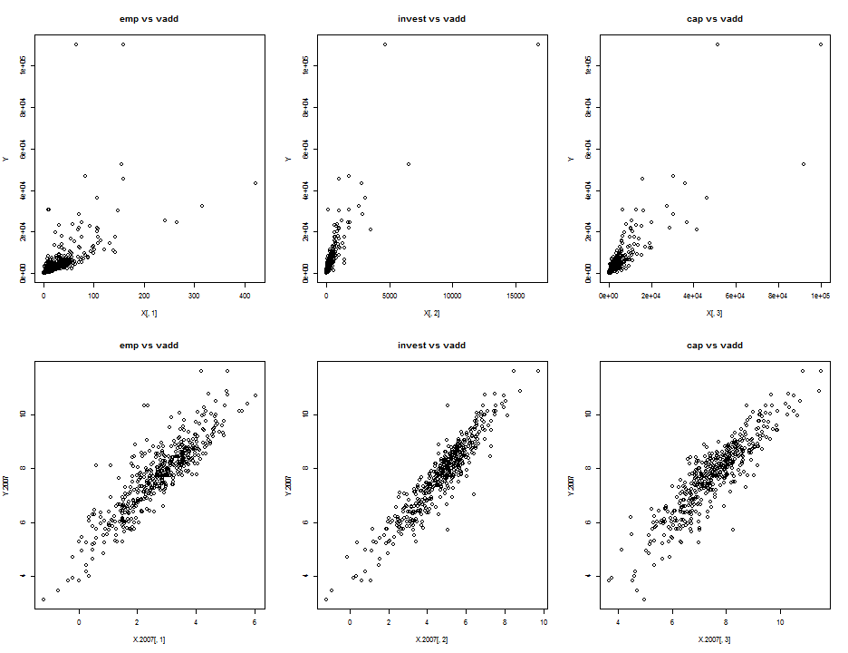 

#### Interpretation
그림을 보면 데이터에 이상점이 존재함을 알 수 있다. 따라서 input과 output에 각각 log 변환을 실시했으며 그 결과 이상점이 사라짐을 확인하였다. 변환 이후에 얻어진 그림을 통해 VRS 방법론을 사용하기로 결정하였다.

### Using VRS

```r
dea.res.2007 <- dea(X.2007, Y.2007, RTS = "vrs", ORIENTATION = "in")
res.2007 <- cbind(dea.res.2007$eff[104], dea.res.2007$eff[105], dea.res.2007$eff[107], 
    dea.res.2007$eff[320], dea.res.2007$eff[323])
rownames(res.2007) <- c("Year2007")
colnames(res.2007) <- c("316213", "316214", "316991", "333312", "333315")
res.2007
```

```
##          316213 316214 316991 333312 333315
## Year2007 0.7488  0.787 0.8107 0.8212 0.7447
```


## 2008년
### Graph of 'output vs input'

```r
par(mfrow = c(2, 3))
X <- nber2008[, c(3, 11, 14)]  # input
Y <- nber2008[, c(10)]  # output
plot(X[, 1], Y, main = "emp vs vadd")
plot(X[, 2], Y, main = "invest vs vadd")
plot(X[, 3], Y, main = "cap vs vadd")
# log transformation
X.2008 <- log(nber2008[, c(3, 11, 14)])  # input
Y.2008 <- log(nber2008[, c(10)])  # output
plot(X.2008[, 1], Y.2008, main = "emp vs vadd")
plot(X.2008[, 2], Y.2008, main = "invest vs vadd")
plot(X.2008[, 3], Y.2008, main = "cap vs vadd")
```

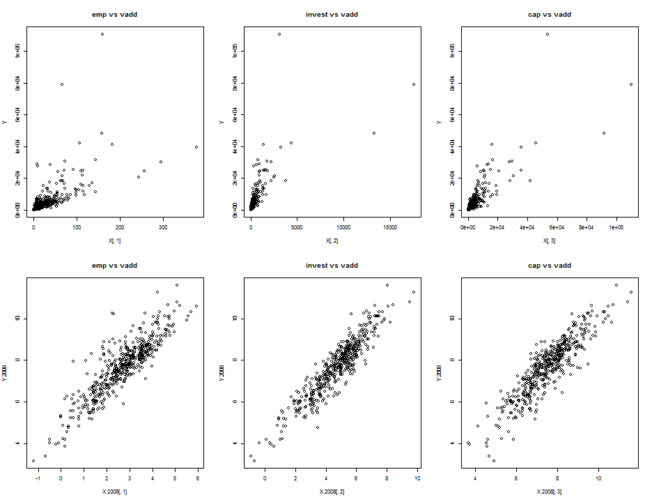 

#### Interpretation
그림을 보면 데이터에 이상점이 존재함을 알 수 있다. 따라서 input과 output에 각각 log 변환을 실시했으며 그 결과 이상점이 사라짐을 확인하였다. 변환 이후에 얻어진 그림을 통해 VRS 방법론을 사용하기로 결정하였다.

### Using VRS

```r
dea.res.2008 <- dea(X.2008, Y.2008, RTS = "vrs", ORIENTATION = "in")
res.2008 <- cbind(dea.res.2008$eff[104], dea.res.2008$eff[105], dea.res.2008$eff[107], 
    dea.res.2008$eff[320], dea.res.2008$eff[323])
rownames(res.2008) <- c("Year2008")
colnames(res.2008) <- c("316213", "316214", "316991", "333312", "333315")
res.2008
```

```
##          316213 316214 316991 333312 333315
## Year2008 0.8547 0.9832 0.8379 0.8478 0.8106
```


## 2009년
### Graph of 'output vs input'

```r
par(mfrow = c(2, 3))
X <- nber2009[, c(3, 11, 14)]  # input
Y <- nber2009[, c(10)]  # output
plot(X[, 1], Y, main = "emp vs vadd")
plot(X[, 2], Y, main = "invest vs vadd")
plot(X[, 3], Y, main = "cap vs vadd")
# log transformation
X.2009 <- log(nber2009[, c(3, 11, 14)])  # input
Y.2009 <- log(nber2009[, c(10)])  # output
plot(X.2009[, 1], Y.2009, main = "emp vs vadd")
plot(X.2009[, 2], Y.2009, main = "invest vs vadd")
plot(X.2009[, 3], Y.2009, main = "cap vs vadd")
```

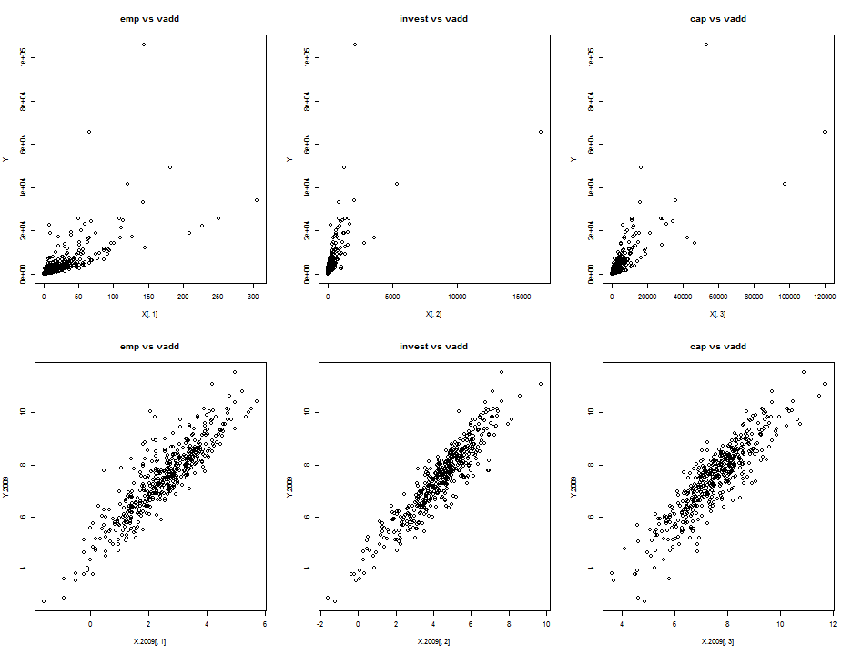 

#### Interpretation
그림을 보면 데이터에 이상점이 존재함을 알 수 있다. 따라서 input과 output에 각각 log 변환을 실시했으며 그 결과 이상점이 사라짐을 확인하였다. 변환 이후에 얻어진 그림을 통해 VRS 방법론을 사용하기로 결정하였다.

### Using VRS

```r
dea.res.2009 <- dea(X.2009, Y.2009, RTS = "vrs", ORIENTATION = "in")
res.2009 <- cbind(dea.res.2009$eff[104], dea.res.2009$eff[105], dea.res.2009$eff[107], 
    dea.res.2009$eff[320], dea.res.2009$eff[323])
rownames(res.2009) <- c("Year2009")
colnames(res.2009) <- c("316213", "316214", "316991", "333312", "333315")
res.2009
```

```
##          316213 316214 316991 333312 333315
## Year2009 0.8227 0.8539 0.8232 0.8671 0.7371
```


## Final Result of efficiency

```r
par(mfrow = c(1, 1))
res.fin <- rbind(res.2000, res.2001, res.2002, res.2003, res.2004, res.2005, 
    res.2006, res.2007, res.2008, res.2009)
print(res.fin)
```

```
##          316213 316214 316991 333312 333315
## Year2000 0.7983 0.9377 0.8871 0.7615 0.7589
## Year2001 0.8713 1.0000 0.9737 0.7858 0.7320
## Year2002 0.8163 0.7875 1.0000 0.7928 0.6651
## Year2003 0.8223 0.7859 0.8458 0.7969 0.7875
## Year2004 0.7997 0.7520 0.8613 0.8100 0.6898
## Year2005 0.8307 0.9282 0.8665 0.8588 0.7881
## Year2006 0.7923 0.8632 0.8362 0.8599 0.7361
## Year2007 0.7488 0.7870 0.8107 0.8212 0.7447
## Year2008 0.8547 0.9832 0.8379 0.8478 0.8106
## Year2009 0.8227 0.8539 0.8232 0.8671 0.7371
```

```r
plot(res.fin[, 1], type = "l", main = "Men's footwear manufacturing")
```

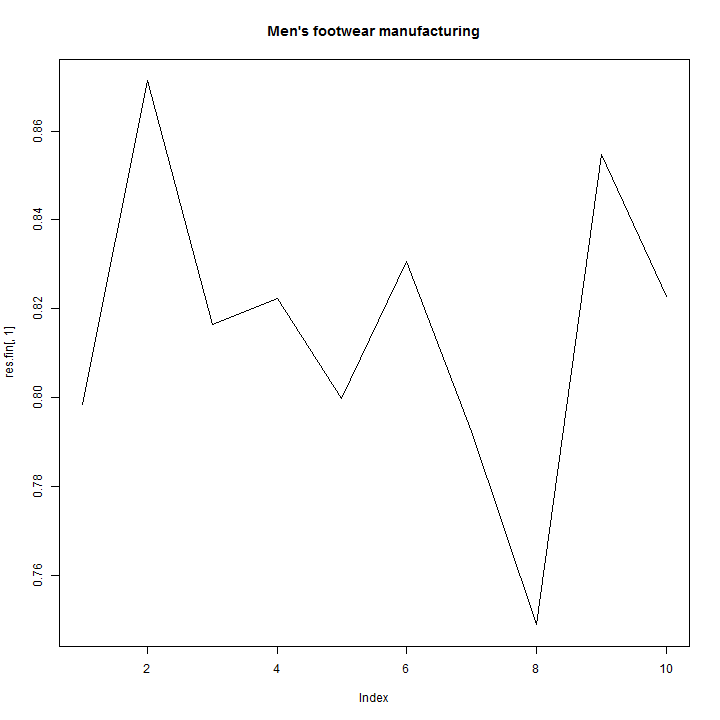 

```r
plot(res.fin[, 2], type = "l", main = "Women's footwear manufacturing")
```

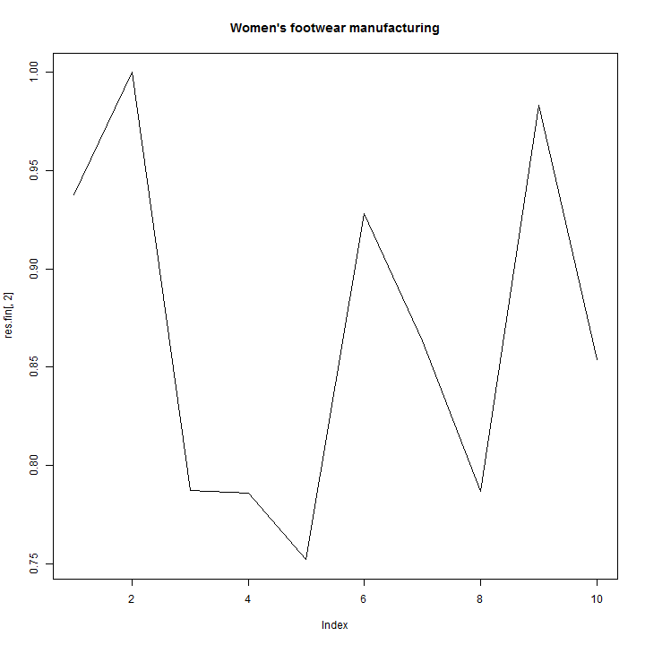 

```r
plot(res.fin[, 3], type = "l", main = "Luggage manufacturing")
```

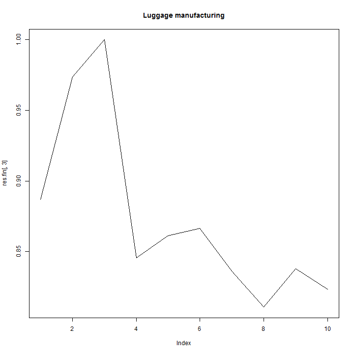 

```r
plot(res.fin[, 4], type = "l", main = "Commercial laundry, drycleaning, and pressing machine manufacturing")
```

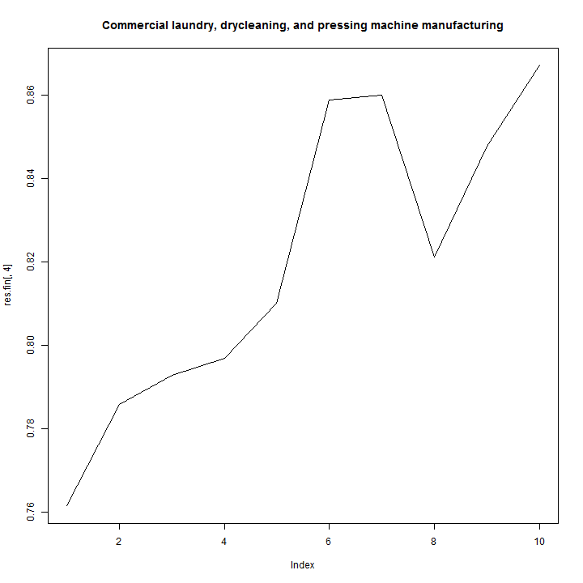 

```r
plot(res.fin[, 5], type = "l", main = "Photographic and photocopying equipment manufacturing")
```

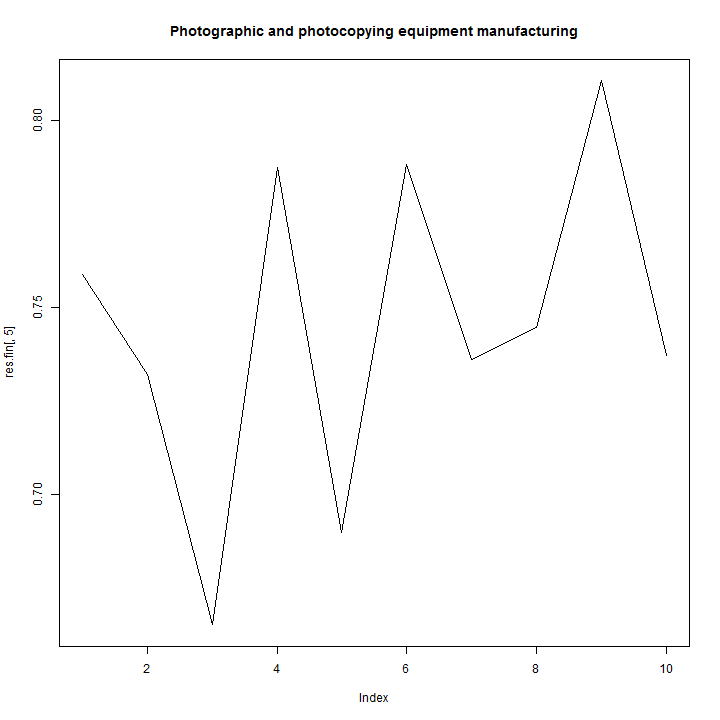 

#### Interpretation
2000년부터 2009년까지의 5가지 제조업에 대한 input 기준의 효율성을 최종적으로 나타내봤다. 효율성의 값이 작을 수록 투입된 input이 과다하다는 의미이므로 효율적이지 않은 것으로 판단하면 된다.
그래프에 따르면 남성용, 그리고 여성용 신발 제조업은 10년동안 추세가 없었던 것으로 보인다. 그러나 여행용 가방 제조업의 경우는 efficiency의 값이 감소하는 추세를 보였으며 반대로 세탁용 기계 제조업의 경우는 증가하는 추세를 보였다. 또한 사진제작 장비 제조업의 경우는 뚜렷하지는 않지만 전체적으로 봤을 때는 적게나마 efficiency의 값이 증가하는 추세를 보였음을 확인할 수 있다. 

# Output criterion
## 이제 output을 기준으로 하는 분석을 진행해보도록 하겠다. 방법론은 input 기준에서와 동일하게 VRS를 사용하도록 하겠다.

### Output 기준에서는 efficiency의 값이 클 수록 생산을 제대로 못했다는 의미이므로 효율성이 좋지 않은 것으로 판단하면 된다.

## 2000년
### Using VRS

```r
dea.res.2000.out <- dea(X.2000, Y.2000, RTS = "vrs", ORIENTATION = "out")
res.2000.out <- cbind(dea.res.2000.out$eff[104], dea.res.2000.out$eff[105], 
    dea.res.2000.out$eff[107], dea.res.2000.out$eff[320], dea.res.2000.out$eff[323])
rownames(res.2000.out) <- c("Year2000")
colnames(res.2000.out) <- c("316213", "316214", "316991", "333312", "333315")
res.2000.out
```

```
##          316213 316214 316991 333312 333315
## Year2000  1.146  1.012  1.091  1.259  1.191
```


## 2001년
### Using VRS

```r
dea.res.2001.out <- dea(X.2001, Y.2001, RTS = "vrs", ORIENTATION = "out")
res.2001.out <- cbind(dea.res.2001.out$eff[104], dea.res.2001.out$eff[105], 
    dea.res.2001.out$eff[107], dea.res.2001.out$eff[320], dea.res.2001.out$eff[323])
rownames(res.2001.out) <- c("Year2001")
colnames(res.2001.out) <- c("316213", "316214", "316991", "333312", "333315")
res.2001.out
```

```
##          316213 316214 316991 333312 333315
## Year2001  1.107      1  1.018  1.237  1.253
```


## 2002년
### Using VRS

```r
dea.res.2002.out <- dea(X.2002, Y.2002, RTS = "vrs", ORIENTATION = "out")
res.2002.out <- cbind(dea.res.2002.out$eff[104], dea.res.2002.out$eff[105], 
    dea.res.2002.out$eff[107], dea.res.2002.out$eff[320], dea.res.2002.out$eff[323])
rownames(res.2002.out) <- c("Year2002")
colnames(res.2002.out) <- c("316213", "316214", "316991", "333312", "333315")
res.2002.out
```

```
##          316213 316214 316991 333312 333315
## Year2002  1.168  1.088      1  1.207  1.324
```


## 2003년
### Using VRS

```r
dea.res.2003.out <- dea(X.2003, Y.2003, RTS = "vrs", ORIENTATION = "out")
res.2003.out <- cbind(dea.res.2003.out$eff[104], dea.res.2003.out$eff[105], 
    dea.res.2003.out$eff[107], dea.res.2003.out$eff[320], dea.res.2003.out$eff[323])
rownames(res.2003.out) <- c("Year2003")
colnames(res.2003.out) <- c("316213", "316214", "316991", "333312", "333315")
res.2003.out
```

```
##          316213 316214 316991 333312 333315
## Year2003  1.181  1.091  1.091  1.224  1.112
```


## 2004년
### Using VRS

```r
dea.res.2004.out <- dea(X.2004, Y.2004, RTS = "vrs", ORIENTATION = "out")
res.2004.out <- cbind(dea.res.2004.out$eff[104], dea.res.2004.out$eff[105], 
    dea.res.2004.out$eff[107], dea.res.2004.out$eff[320], dea.res.2004.out$eff[323])
rownames(res.2004.out) <- c("Year2004")
colnames(res.2004.out) <- c("316213", "316214", "316991", "333312", "333315")
res.2004.out
```

```
##          316213 316214 316991 333312 333315
## Year2004  1.203  1.165  1.112  1.177  1.183
```


## 2005년
### Using VRS

```r
dea.res.2005.out <- dea(X.2005, Y.2005, RTS = "vrs", ORIENTATION = "out")
res.2005.out <- cbind(dea.res.2005.out$eff[104], dea.res.2005.out$eff[105], 
    dea.res.2005.out$eff[107], dea.res.2005.out$eff[320], dea.res.2005.out$eff[323])
rownames(res.2005.out) <- c("Year2005")
colnames(res.2005.out) <- c("316213", "316214", "316991", "333312", "333315")
res.2005.out
```

```
##          316213 316214 316991 333312 333315
## Year2005  1.139  1.052  1.103  1.099  1.117
```


## 2006년
### Using VRS

```r
dea.res.2006.out <- dea(X.2006, Y.2006, RTS = "vrs", ORIENTATION = "out")
res.2006.out <- cbind(dea.res.2006.out$eff[104], dea.res.2006.out$eff[105], 
    dea.res.2006.out$eff[107], dea.res.2006.out$eff[320], dea.res.2006.out$eff[323])
rownames(res.2006.out) <- c("Year2006")
colnames(res.2006.out) <- c("316213", "316214", "316991", "333312", "333315")
res.2006.out
```

```
##          316213 316214 316991 333312 333315
## Year2006  1.179  1.068  1.145  1.113  1.184
```


## 2007년
### Using VRS

```r
dea.res.2007.out <- dea(X.2007, Y.2007, RTS = "vrs", ORIENTATION = "out")
res.2007.out <- cbind(dea.res.2007.out$eff[104], dea.res.2007.out$eff[105], 
    dea.res.2007.out$eff[107], dea.res.2007.out$eff[320], dea.res.2007.out$eff[323])
rownames(res.2007.out) <- c("Year2007")
colnames(res.2007.out) <- c("316213", "316214", "316991", "333312", "333315")
res.2007.out
```

```
##          316213 316214 316991 333312 333315
## Year2007   1.22  1.213  1.162  1.146  1.187
```


## 2008년
### Using VRS

```r
dea.res.2008.out <- dea(X.2008, Y.2008, RTS = "vrs", ORIENTATION = "out")
res.2008.out <- cbind(dea.res.2008.out$eff[104], dea.res.2008.out$eff[105], 
    dea.res.2008.out$eff[107], dea.res.2008.out$eff[320], dea.res.2008.out$eff[323])
rownames(res.2008.out) <- c("Year2008")
colnames(res.2008.out) <- c("316213", "316214", "316991", "333312", "333315")
res.2008.out
```

```
##          316213 316214 316991 333312 333315
## Year2008   1.11  1.011  1.125  1.111  1.096
```


## 2009년
### Using VRS

```r
dea.res.2009.out <- dea(X.2009, Y.2009, RTS = "vrs", ORIENTATION = "out")
res.2009.out <- cbind(dea.res.2009.out$eff[104], dea.res.2009.out$eff[105], 
    dea.res.2009.out$eff[107], dea.res.2009.out$eff[320], dea.res.2009.out$eff[323])
rownames(res.2009.out) <- c("Year2009")
colnames(res.2009.out) <- c("316213", "316214", "316991", "333312", "333315")
res.2009.out
```

```
##          316213 316214 316991 333312 333315
## Year2009  1.167  1.084  1.202  1.129  1.195
```


## Final Result of efficiency

```r
par(mfrow = c(1, 1))
res.fin.out <- rbind(res.2000.out, res.2001.out, res.2002.out, res.2003.out, 
    res.2004.out, res.2005.out, res.2006.out, res.2007.out, res.2008.out, res.2009.out)
print(res.fin.out)
```

```
##          316213 316214 316991 333312 333315
## Year2000  1.146  1.012  1.091  1.259  1.191
## Year2001  1.107  1.000  1.018  1.237  1.253
## Year2002  1.168  1.088  1.000  1.207  1.324
## Year2003  1.181  1.091  1.091  1.224  1.112
## Year2004  1.203  1.165  1.112  1.177  1.183
## Year2005  1.139  1.052  1.103  1.099  1.117
## Year2006  1.179  1.068  1.145  1.113  1.184
## Year2007  1.220  1.213  1.162  1.146  1.187
## Year2008  1.110  1.011  1.125  1.111  1.096
## Year2009  1.167  1.084  1.202  1.129  1.195
```

```r
plot(res.fin.out[, 1], type = "l", main = "Men's footwear manufacturing")
```

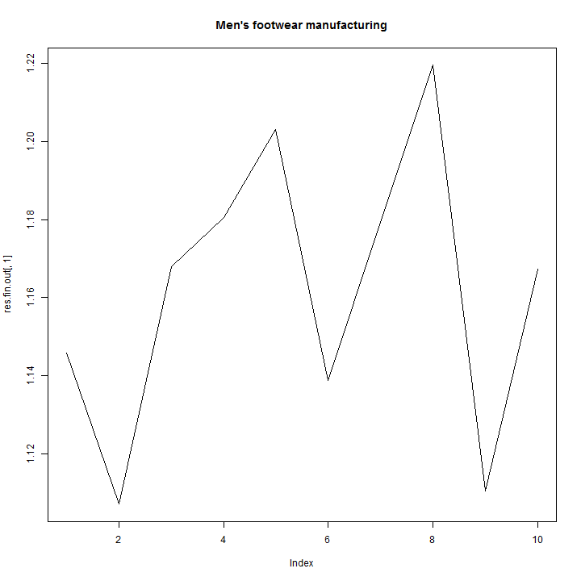 

```r
plot(res.fin.out[, 2], type = "l", main = "Women's footwear manufacturing")
```

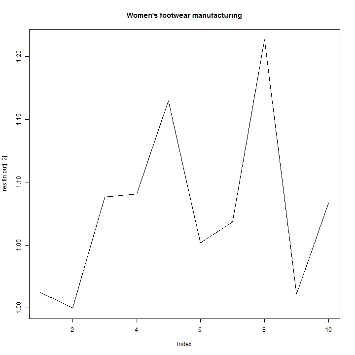 

```r
plot(res.fin.out[, 3], type = "l", main = "Luggage manufacturing")
```

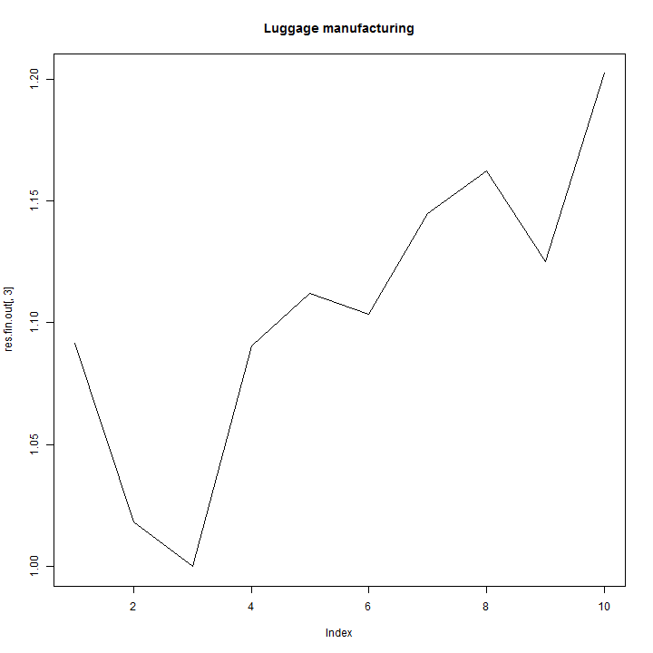 

```r
plot(res.fin.out[, 4], type = "l", main = "Commercial laundry, drycleaning, and pressing machine manufacturing")
```

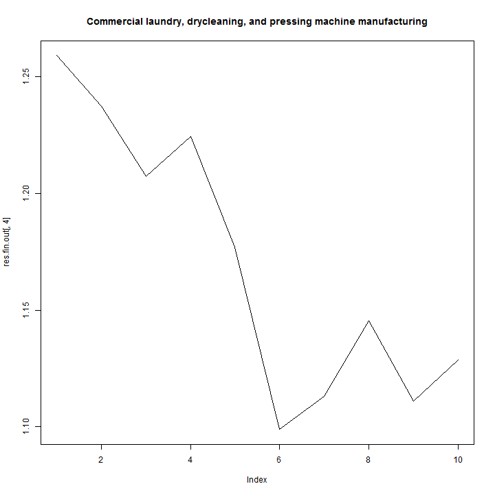 

```r
plot(res.fin.out[, 5], type = "l", main = "Photographic and photocopying equipment manufacturing")
```

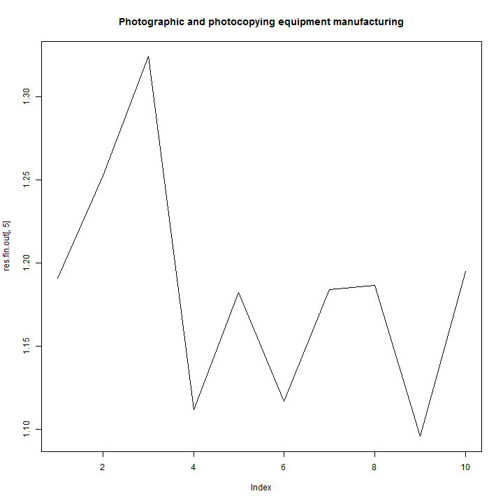 

#### Interpretation
그래프를 보면 output 기준에 의한 결과도 input의 경우와 비슷한 이야기를 하고 있음을 알 수 있다.
남성용, 그리고 여성용 신발 제조업은 10년동안 추세가 없었던 것으로 보이지만, 여행용 가방 제조업의 경우는 efficiency의 값이 증가하는 추세를 보였으며 반대로 세탁용 기계 제조업의 경우는 감소하는 추세를 보였다. 그리고 사진제작 장비 제조업의 경우는 뚜렷하지는 않지만 전체적으로 봤을 때는 적게나마 efficiency의 값이 감소하는 추세를 보였음을 확인할 수 있다. 
그러므로 여행용 가방 제조업에 대해서는 효율성이 떨어지는 원인을 규명하여 실무에 반영토록 조치가 취해져야 할 것이며 남성용, 여성용 신발 제조업에 대해서는 더 효율적으로 생산이 이루어질 수 있도록 지원을 해야 할 것이다. 


