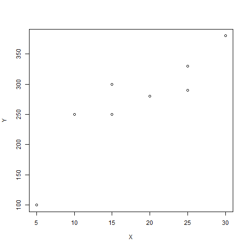

Final Assignment 2
========================================================
author: Sung-yoon Hwang (200903877) 
date: 2014.6.16
autosize: true
font-family: 'Helvetica'

Analysis of trend of efficiency by 5 manufacturing industries in America

5 manufacturing industries in America
========================================================

- Men's footwear manufacturing (code : 316213 (row 104))
- Women's footwear manufacturing (code : 316214 (row 105))
- Luggage manufacturing (code : 316991 (row 107))
- Commercial laundry, drycleaning, and pressing machine manufacturing (code : 333312 (row 320))
- Photographic and photocopying equipment manufacturing (code : 333315 (row 323))

Read data & Install packages
========================================================


```r
nber2000 <- read.csv("C:/Users/user/Desktop/Sung-yoon.R/Final Exam/Final Assignment 2,3/Final Assignment 2/nber2000.csv",sep=",",header=T)
nber2001 <- read.csv("C:/Users/user/Desktop/Sung-yoon.R/Final Exam/Final Assignment 2,3/Final Assignment 2/nber2001.csv",sep=",",header=T)
nber2002 <- read.csv("C:/Users/user/Desktop/Sung-yoon.R/Final Exam/Final Assignment 2,3/Final Assignment 2/nber2002.csv",sep=",",header=T)
```


Read data & Install packages
========================================================


```r
nber2003 <- read.csv("C:/Users/user/Desktop/Sung-yoon.R/Final Exam/Final Assignment 2,3/Final Assignment 2/nber2003.csv",sep=",",header=T)
nber2004 <- read.csv("C:/Users/user/Desktop/Sung-yoon.R/Final Exam/Final Assignment 2,3/Final Assignment 2/nber2004.csv",sep=",",header=T)
nber2005 <- read.csv("C:/Users/user/Desktop/Sung-yoon.R/Final Exam/Final Assignment 2,3/Final Assignment 2/nber2005.csv",sep=",",header=T)
```


Read data & Install packages
========================================================


```r
nber2006 <- read.csv("C:/Users/user/Desktop/Sung-yoon.R/Final Exam/Final Assignment 2,3/Final Assignment 2/nber2006.csv",sep=",",header=T)
nber2007 <- read.csv("C:/Users/user/Desktop/Sung-yoon.R/Final Exam/Final Assignment 2,3/Final Assignment 2/nber2007.csv",sep=",",header=T)
nber2008 <- read.csv("C:/Users/user/Desktop/Sung-yoon.R/Final Exam/Final Assignment 2,3/Final Assignment 2/nber2008.csv",sep=",",header=T)
```


Read data & Install packages
========================================================


```r
nber2009 <- read.csv("C:/Users/user/Desktop/Sung-yoon.R/Final Exam/Final Assignment 2,3/Final Assignment 2/nber2009.csv",sep=",",header=T)
install.packages("Benchmarking")
library(Benchmarking)
```


Select variables to analyze efficiency
========================================================

- output : vadd(Total value added in $1m (column 10))
- input : emp(Total employment in 1000s (column 3)), invest(Total capital expenditure in $1m (column 11)), cap(Total real capital stock in $1m :(column 14))

DEA (Data Envelopment Analysis)
========================================================

- Estimate of frontier function
- frontier function (y=g(x)) -> Y=g(x)-u (u >= 0, inefficiency factor)

#### Two assumptions for the analysis
- Frontier function g(x) is free disposability. 
- Frontier function g(x) is convexity. 

Method of DEA 
========================================================

- CRS (Constant Returns-to-scale) : convex cone (Assume convexity, free disposability)

- VRS (Variable Returns-to-scale) : convex hull (Assume convexity, free disposability))

- FDH (Free Disposal Hull) : Use when outlier is exist (Assume free disposability)

Criterion of analysis
========================================================

- case 1 : ORIENTATION="in"
Using efficiency of optimal input when output is constant. When efficiency is small number, this means the quantity of input is too much. 
- case 2 : ORIENTATION="out"
Using efficiency of optimal out when input is constant. When efficiency is big number, this means the quantity of output is too few.

- When efficiency is close to 1, it is good.

Example
========================================================
Before starting analysis, let's see the simple example of relation between number of working members and number of cups.

```r
X <- c(5,10,15,20,25,30,25,15) # Number of staffs (input)
Y <- c(100,250,300,280,330,380,290,250) # Number of cups (output)
par(mfrow=c(1,1))
plot(X,Y)
```


Example
========================================================



Example
========================================================
Using CRS

```r
res.in <- dea(X,Y,RTS="crs",ORIENTATION="in")
res.out <- dea(X,Y,RTS="crs",ORIENTATION="out")
cbind(X,Y,res.in$eff,res.out$eff) 
dea.plot.frontier(X,Y,RTS="crs") 
```


Example
========================================================
Using CRS


```
processing file: Final 2.Rpres
(if (out_format(c("latex", "sweave", "listings", "markdown"))) sanitize_fn else str_c)(path, 에서 다음과 같은 경고가 발생했습니다 :
  replaced special characters in figure filename "Final 2-figure/unnamed-chunk-6" -> "Final_2-figure/unnamed-chunk-6"
Quitting from lines 122-129 (Final 2.Rpres) 
다음에 오류가 있습니다contrib.url(repos, "source") : 
  trying to use CRAN without setting a mirror
```
