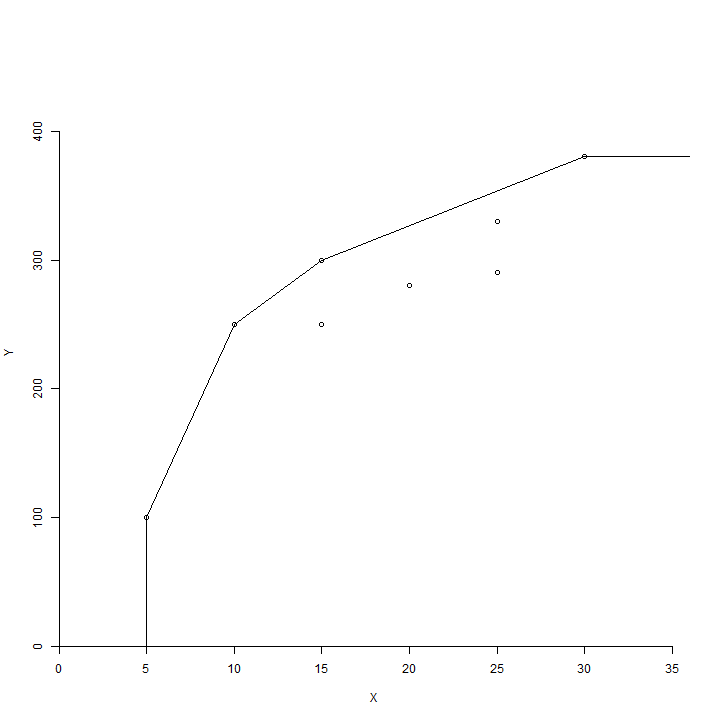
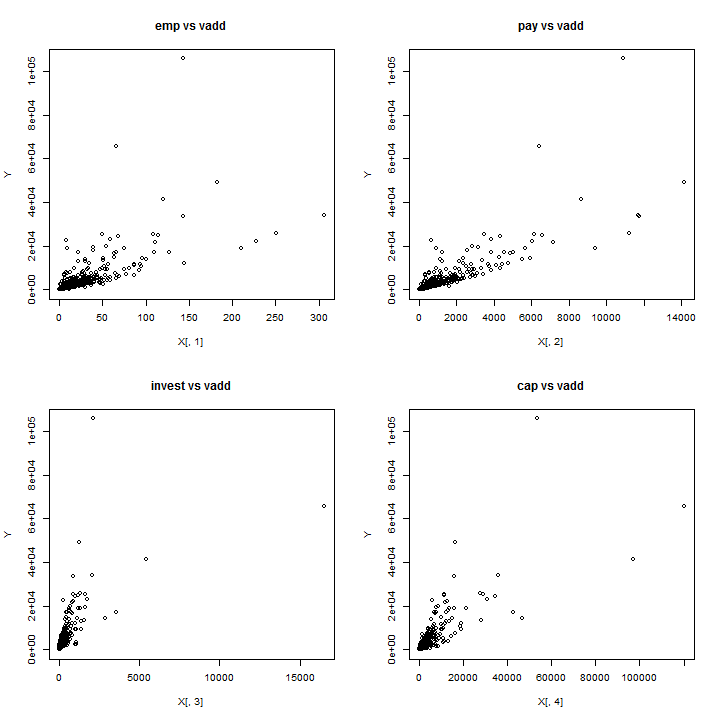
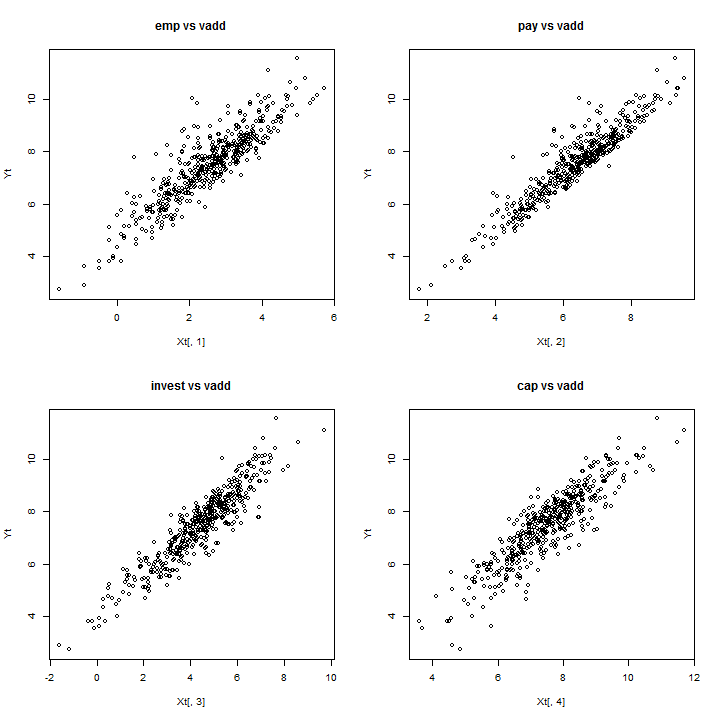

Final Assignment 3 (금융자료분석 및 실습)
========================================================
200903877 황 성 윤
-------------------------

# 2009년의 미국의 473가지 산업의 효율성에 대한 분석 실시.
## 사용할 방법론 : DEA(Data Envelopment Analysis)에서 자주 쓰이는 3가지 방법론(CRS, VRS, FDH)
## 데이터 출처 : The National Bureau of Economic Research (http://www.nber.org/data/nberces5809.html)

### 데이터 불러들이기 & 패키지 설치

```r
nber2009 <- read.csv("C:/Users/user/Desktop/Sung-yoon.R/Final Exam/Final Assignment 2,3/Final Assignment 3/nber2009.csv", 
    sep = ",", header = T)
install.packages("Benchmarking")
```

```
## Error: trying to use CRAN without setting a mirror
```

```r
library(Benchmarking)
```

```
## Loading required package: lpSolveAPI
## Loading required package: ucminf
```


### 제조업의 효율성 분석을 위해 사용할 input, output 변수
#### output : vadd(Total value added in $1m : 총 부가가치(column 10))
#### input : emp(Total employment in 1000s : 총 고용자의 수(column 3)), pay(Total payroll in $1m : 배부되는 총 급료(column 4)), invest(Total capital expenditure in $1m : 총 자본지출 비용(column 11)), cap(Total real capital stock in $1m : 회사의 총 자본금(column 14))

## DEA (Data Envelopment Analysis)
### Estimate of frontier function
### frontier function (y=g(x)) -> Y=g(x)-u (u >= 0, inefficiency factor)

### 기업이나 제조상품의 질 등을 평가할 때 투입 대비 산출이 어느 정도인지가 중요. 
#### (example) 매출액/임대료 = 30 (임대료에 30배만큼 매출을 내고있다.)
#### --> 산출/투입 : 생산 효율성 (productivity or efficiency)
#### 산출(월매출, 위생점수, 불만점수, 방문객수 ..) ,
#### 투입(임대료, 직원수, 유지비, 재료비 ..)
#### 임대료 대비 매출액의 최대값에 관심..

### DEA 에서 자주 쓰이는 방법
#### 1. CRS (Constant Returns-to-scale) : convex cone (convexity, free disposability를 가정)
input 대비 output을 가장 효율적으로 많이 생산한 경우에 해당하는 점과 원점을 연결하는 직선을 frontier function의 추정값으로 사용한다. 가장 단순한 방법이다.
#### 2. VRS (Variable Returns-to-scale) : convex hull (convexity, free disposability를 가정))
데이터에서 상대적으로 효율적이라고 여겨지는 경우에 해당하는 점들을 각각 선으로 연결하여 단조증가하고 위로 볼록하는 frontier function의 추정값을 만든다.
#### 3. FDH (Free Disposal Hull) : 이상점이 존재할 경우 (free disposability만 가정)
주어진 데이터로부터 실제적으로 구현이 가능한 영역들을 모두 모아놓은 영역에 의하여 만들어지는 함수의 값을 frontier function의 추정값으로 사용한다.

### DEA 분석에서의 2가지 가정
#### 1. free disposability : frontier function g(x) 는 단조증가함수이다.
#### 2. convexity : frontier function g(x) 는 위로 볼록한 함수이다. 이 가정은 데이터에 이상점이 존재하는 경우에는 무시할 수 있다.

### 분석하는 방법
#### case 1 : ORIENTATION="in"
일정한 output을 생산할 때의 최소 input의 값이 실제로 쓰인 input의 어느 정도인지를 나타내는 efficiency의 값을 가지고 평가한다. 이 값이 작을 수록 input의 양이 과다하게 쓰였다는 의미이므로 생산성이 좋지 못한 것으로 판단하면 된다. 그러므로  efficiency의 값이 1인 경우가 가장 효율적인 것이라고 할 수 있다.
#### case 2 : ORIENTATION="out"
일정한 input을 가지고 생산할 수 있는 최대 output의 값이 실제로 생산된 output의 몇 배인지를 나타내는 efficiency의 값을 가지고 평가한다. 이 값이 클 수록 output을 제대로 많이 생산하지 못했다는 의미이므로 생산성이 좋지 못한 것으로 판단하면 된다. 그러므로  efficiency의 값이 1인 경우가 가장 효율적인 것이라고 할 수 있다.

### 먼저 간단하게 공장에서 근무하는 직원들의 숫자와 생산되는 컵의 개수와 관련된 데이터를 가지고 분석해보도록 하겠다. 
### Make data

```r
par(mfrow = c(1, 1))
X <- c(5, 10, 15, 20, 25, 30, 25, 15)  # Number of staffs (input)
Y <- c(100, 250, 300, 280, 330, 380, 290, 250)  # Number of cups (output)
par(mfrow = c(1, 1))
plot(X, Y)
```

 

### Using CRS

```r
par(mfrow = c(1, 1))
res.in <- dea(X, Y, RTS = "crs", ORIENTATION = "in")
res.out <- dea(X, Y, RTS = "crs", ORIENTATION = "out")
cbind(X, Y, res.in$eff, res.out$eff)  # 보는 관점에 따라 순위가 달라짐.
```

```
##       X   Y             
## [1,]  5 100 0.8000 1.250
## [2,] 10 250 1.0000 1.000
## [3,] 15 300 0.8000 1.250
## [4,] 20 280 0.5600 1.786
## [5,] 25 330 0.5280 1.894
## [6,] 30 380 0.5067 1.974
## [7,] 25 290 0.4640 2.155
## [8,] 15 250 0.6667 1.500
```

```r
dea.plot.frontier(X, Y, RTS = "crs")  # 그림 그리기
```

 

### Using VRS

```r
par(mfrow = c(1, 1))
res.in <- dea(X, Y, RTS = "vrs", ORIENTATION = "in")
res.out <- dea(X, Y, RTS = "vrs", ORIENTATION = "out")
cbind(X, Y, res.in$eff, res.out$eff)  # 보는 관점에 따라 순위가 달라짐.
```

```
##       X   Y             
## [1,]  5 100 1.0000 1.000
## [2,] 10 250 1.0000 1.000
## [3,] 15 300 1.0000 1.000
## [4,] 20 280 0.6500 1.167
## [5,] 25 330 0.8250 1.071
## [6,] 30 380 1.0000 1.000
## [7,] 25 290 0.5600 1.218
## [8,] 15 250 0.6667 1.200
```

```r
dea.plot.frontier(X, Y, RTS = "vrs")  # 그림 그리기
```

 

### Using FDH

```r
par(mfrow = c(1, 1))
res.in <- dea(X, Y, RTS = "fdh", ORIENTATION = "in")
res.out <- dea(X, Y, RTS = "fdh", ORIENTATION = "out")
cbind(X, Y, res.in$eff, res.out$eff)  # 보는 관점에 따라 순위가 달라짐.
```

```
##       X   Y             
## [1,]  5 100 1.0000 1.000
## [2,] 10 250 1.0000 1.000
## [3,] 15 300 1.0000 1.000
## [4,] 20 280 0.7500 1.071
## [5,] 25 330 1.0000 1.000
## [6,] 30 380 1.0000 1.000
## [7,] 25 290 0.6000 1.138
## [8,] 15 250 0.6667 1.200
```

```r
dea.plot.frontier(X, Y, RTS = "fdh")  # 그림 그리기
```

 

#### Interpretation
X는 직원의 수이고 Y는 생산되는 컵의 개수이다. 3가지 방법론 모두 가장 비효율적인 경우가 (X,Y)=(25,290) 이라는 결과를 주고 있다. 하지만 효율적인 경우는 결과가 모두 다르다. CRS의 경우 가장 효율적인 경우가 (10,250) 의 한가지 뿐인 것에 반해 VRS는 (5,100), (10,250), (15,300), (30,380) 의 4가지, FDH는 (5,100), (10,250), (15,300), (25,330), (30,380) 의 5가지이다. 각 방법론, 그리고 기준이 input인지 output인지에 따라 결과가 다르게 나올 수 있으므로 분석하고자 하는 데이터에 부합하는 방법이 어떤 것인지 먼저 생각해보는 것도 좋을 것이다. 

## Analysis of NBER in 2009

### 투입 및 산출요소와 관련된 데이터 추출

```r
X <- nber2009[, c(3, 4, 11, 14)]  # input
Y <- nber2009[, c(10)]  # output
```


#### 앞에서 소개한 각각의 방법론의 input의 관점과 output에서의 관점에 따른  효율성을 각각 산출해 볼 것이다.

### Drawing scatter plot

```r
par(mfrow = c(2, 2))
plot(X[, 1], Y, main = "emp vs vadd")
plot(X[, 2], Y, main = "pay vs vadd")
plot(X[, 3], Y, main = "invest vs vadd")
plot(X[, 4], Y, main = "cap vs vadd")
```

 

#### Interpretation
산점도를 보면 데이터가 모여있는 것이 아니라 흩어져 있는 이상점들이 많이 존재한다는 것을 알 수 있다. 따라서 이 데이터에 log 변환을 실시하여 분석에 용이하게 하도록 하겠다.

### log transformation

```r
Xt <- log(nber2009[, c(3, 4, 11, 14)])  # input
Yt <- log(nber2009[, c(10)])  # output
par(mfrow = c(2, 2))
plot(Xt[, 1], Yt, main = "emp vs vadd")
plot(Xt[, 2], Yt, main = "pay vs vadd")
plot(Xt[, 3], Yt, main = "invest vs vadd")
plot(Xt[, 4], Yt, main = "cap vs vadd")
```

 

#### Interpretation
log 변환을 실시한 다음 산점도를 다시 그려봤다. 그 결과 흩어져 있던 데이터들을 어느정도 모이게 할 수 있었으며 예상해 본 결과 이 데이터에는 VRS 방법론이 가장 적합하지 않을까 생각해 본다. 이제 CRS, VRS, 그리고 FDH 이 3가지 방법론들을 적용하여 산업의 효율성을 분석해보도록 하겠다.

### Using CRS (input)

```r
res.crs.in <- dea(Xt, Yt, RTS = "crs", ORIENTATION = "in")
res.crs.in.1 <- cbind(Xt, Yt, res.crs.in$eff)
min(res.crs.in$eff)
```

```
## [1] 0.7065
```

```r
nber2009[which(res.crs.in$eff == min(res.crs.in$eff)), 1]
```

```
## [1] 334613
```

```r
res.crs.in.1[which(res.crs.in$eff == min(res.crs.in$eff)), ]
```

```
##       emp   pay invest   cap    Yt res.crs.in$eff
## 384 1.792 6.082  4.631 8.187 6.607         0.7065
```

```r
length(nber2009[which(res.crs.in$eff == max(res.crs.in$eff)), 1])
```

```
## [1] 9
```


### Using CRS (output)

```r
res.crs.out <- dea(Xt, Yt, RTS = "crs", ORIENTATION = "out")
res.crs.out.1 <- cbind(Xt, Yt, res.crs.out$eff)
max(res.crs.out$eff)
```

```
## [1] 1.415
```

```r
nber2009[which(res.crs.out$eff == max(res.crs.out$eff)), 1]
```

```
## [1] 334613
```

```r
res.crs.out.1[which(res.crs.out$eff == max(res.crs.out$eff)), ]
```

```
##       emp   pay invest   cap    Yt res.crs.out$eff
## 384 1.792 6.082  4.631 8.187 6.607           1.415
```

```r
length(nber2009[which(res.crs.out$eff == min(res.crs.out$eff)), 1])
```

```
## [1] 9
```

```r
as.numeric(nber2009[which(res.crs.in$eff == max(res.crs.in$eff)), 1] == nber2009[which(res.crs.out$eff == 
    min(res.crs.out$eff)), 1])
```

```
## [1] 1 1 1 1 1 1 1 1 1
```

#### Interpretation
CRS 방법론의 경우는 두가지 관점에 따른 분석의 결과가 같았다. 가장 효율적이지 못한 사업은 음반녹음과 관련된 제조업(Magnetic and Optical Recording Media Manufacturing : code 334613)이었다. 이 산업에 대하여 산출된 efficiency의 값을 보면 실제로 투입한 input의 양을 현재의 약 71% 정도로 줄일 수 있으며 output의 양을 지금보다 약 42% 정도 더 올릴 수 있다는 결과이다. 그리고 Benchmarking 할만한 최적의 산업은 총 9가지라는 결과를 주고 있다. 최적의 산업 또한 두가지 관점의 결과가 정확하게 일치했다. 하지만 이 방법론은 가장 단순하기 때문에 데이터와 맞지 않을 가능성이 높다. 이제 VRS 방법론을 적용해보기로 하자.

### Using VRS (input)

```r
res.vrs.in <- dea(Xt, Yt, RTS = "vrs", ORIENTATION = "in")
res.vrs.in.1 <- cbind(Xt, Yt, res.vrs.in$eff)
min(res.vrs.in$eff)
```

```
## [1] 0.7121
```

```r
nber2009[which(res.vrs.in$eff == min(res.vrs.in$eff)), 1]
```

```
## [1] 334613
```

```r
res.vrs.in.1[which(res.vrs.in$eff == min(res.vrs.in$eff)), ]
```

```
##       emp   pay invest   cap    Yt res.vrs.in$eff
## 384 1.792 6.082  4.631 8.187 6.607         0.7121
```

```r
length(nber2009[which(res.vrs.in$eff == max(res.vrs.in$eff)), 1])
```

```
## [1] 18
```


### Using VRS (output)

```r
res.vrs.out <- dea(Xt, Yt, RTS = "vrs", ORIENTATION = "out")
res.vrs.out.1 <- cbind(Xt, Yt, res.vrs.out$eff)
max(res.vrs.out$eff)
```

```
## [1] 1.403
```

```r
nber2009[which(res.vrs.out$eff == max(res.vrs.out$eff)), 1]
```

```
## [1] 334613
```

```r
res.vrs.out.1[which(res.vrs.out$eff == max(res.vrs.out$eff)), ]
```

```
##       emp   pay invest   cap    Yt res.vrs.out$eff
## 384 1.792 6.082  4.631 8.187 6.607           1.403
```

```r
length(nber2009[which(res.vrs.out$eff == min(res.vrs.out$eff)), 1])
```

```
## [1] 18
```

```r
as.numeric(nber2009[which(res.vrs.in$eff == max(res.vrs.in$eff)), 1] == nber2009[which(res.vrs.out$eff == 
    min(res.vrs.out$eff)), 1])
```

```
##  [1] 1 1 1 1 1 1 1 1 1 1 1 1 1 1 1 1 1 1
```

#### Interpretation
VRS 방법론의 경우도 CRS와 마찬가지로 두가지 관점에 따른 분석의 결과가 같았으며 가장 효율적이지 못한 사업은 음반녹음과 관련된 제조업(Magnetic and Optical Recording Media Manufacturing : code 334613)이었다. 이 산업에 대하여 산출된 efficiency의 값을 보면 실제로 투입한 input의 양을 현재의 약 71% 정도로 줄일 수 있으며 output의 양을 지금보다 약 40% 정도 더 올릴 수 있다는 결과이다. 그리고 CRS와는 다르게 VRS에서는 Benchmarking 할만한 최적의 산업이 총 18가지라는 결과를 주고 있다. 최적의 산업 또한 두가지 관점의 결과가 정확하게 일치했다. 마지막으로 FDH 방법론을 적용하여 분석해보기로 하자.

### Using FDH (input)

```r
res.fdh.in <- dea(Xt, Yt, RTS = "fdh", ORIENTATION = "in")
res.fdh.in.1 <- cbind(Xt, Yt, res.fdh.in$eff)
min(res.fdh.in$eff)
```

```
## [1] 0.7929
```

```r
nber2009[which(res.fdh.in$eff == min(res.fdh.in$eff)), 1]
```

```
## [1] 325411
```

```r
res.fdh.in.1[which(res.fdh.in$eff == min(res.fdh.in$eff)), ]
```

```
##       emp   pay invest   cap    Yt res.fdh.in$eff
## 181 3.281 7.573  6.529 9.149 8.835         0.7929
```

```r
length(nber2009[which(res.fdh.in$eff == max(res.fdh.in$eff)), 1])
```

```
## [1] 1
```

```r
nber2009[which(res.fdh.in$eff == max(res.fdh.in$eff)), 1]
```

```
## [1] 323110
```

#### Interpretation
CRS와 VRS와는 다르게 FDH 방법론에서는 두가지 관점에 따른 결과가 다르게 나타났다. input의 관점에서 볼 때 가장 비효율적인 산업은 의료와 식물과 관련된 제조업(Medicinal and Botanical Manufacturing : code 325411)이었다. 이 제조업에 대하여 산출된 efficiency의 값을 보면 실제로 투입한 input의 양을 현재의 약 79% 정도로 줄일 수 있다는 결과이다. 그리고 특이하게 Benchmarking 할 만한 최적의 산업은 석판인쇄물과 관련된 산업(Commercial Lithographic Printing : code 323110) 하나 뿐이라는 결과를 주고 있다.  

### Using FDH (output)

```r
res.fdh.out <- dea(Xt, Yt, RTS = "fdh", ORIENTATION = "out")
res.fdh.out.1 <- cbind(Xt, Yt, res.fdh.out$eff)
max(res.fdh.out$eff)
```

```
## [1] 1.308
```

```r
nber2009[which(res.fdh.out$eff == max(res.fdh.out$eff)), 1]
```

```
## [1] 335991
```

```r
res.fdh.out.1[which(res.fdh.out$eff == max(res.fdh.out$eff)), ]
```

```
##       emp   pay invest   cap    Yt res.fdh.out$eff
## 405 2.054 5.902  5.193 7.401 6.774           1.308
```

```r
length(nber2009[which(res.fdh.out$eff == min(res.fdh.out$eff)), 1])
```

```
## [1] 127
```

#### Interpretation
FDH 방법론에 따른 output 관점에서 볼 때 가장 비효율적인 산업은 탄소와 광물생산과 관련된 제조업(Carbon and Graphite Product Manufacturing : code 335991)이었다. 이 제조업에 대하여 산출된 efficiency의 값을 보면 output의 양을 지금보다 약 31% 정도 더 올릴 수 있다는 결과이다. 그리고 Benchmarking 할 만한 최적의 산업은 127가지라는 결과를 주고 있다.

### Final result
앞에서의 분석결과에서 알 수 있듯이 방법론에 따라 분석결과에 차이가 날 수 있다. 그러므로 분석을 실시하기 전에 먼저 데이터의 특성이 어떠한지 살펴보고 가장 적합한 방법론은 어느 것인지 고민해보는 자세가 필요하다고 생각한다.
