Assignment (Due to March. 26th. 2014)
========================================================
200903877 황 성 윤
-------------------------
5개의 기업의 2010년 1월 1일부터 2014년 3월 24일까지의 주식에 대한 고찰.
---------------------------------------------------------------------------

### 1. 데이터 불러들이기 및 수익률에 관한 그래프 그리기

#### 1. Samsung eletronics 

```r
dat.1 <- read.csv("C:/Users/user/Desktop/Sung-yoon.R/Mid-term Exam/Samsung eletronics/samsung_daily.csv", 
    sep = ",", header = T)
samsung <- dat.1$Close
par(mfrow = c(1, 2))
plot(samsung, type = "l", main = "Samsung eletronics", xlab = "t", ylab = "Samsung")
samsung.return <- diff(log(samsung))
plot(samsung.return, type = "l", main = "Samsung returns", xlab = "t", ylab = "returns")
```

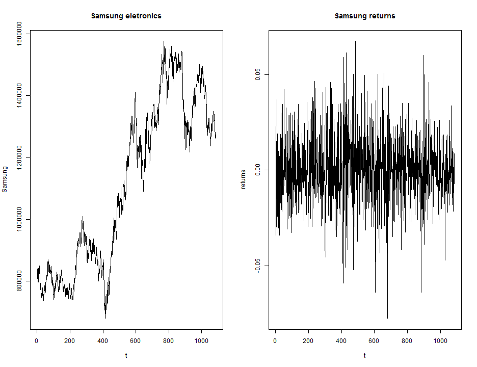 

#### Interpretation
삼성전자 주식에 관한 시계열 그래프에서 알 수 있듯이 
중반부에 주식이 급격하게 상승했음을 알 수 있고
비정상 시계열임을 알 수 있다.
그리고 주식의 수익률에 관한 그래프를 통하여
일반적인 주식의 특징이라고 할 수 있는
수익률의 변동성이 변화했을 때 그 변화에 대한
지속기간이 대체적으로 길게 나타나고 있음을 알 수 있다.
#### 2. KT corporation

```r
dat.2 <- read.csv("C:/Users/user/Desktop/Sung-yoon.R/Mid-term Exam/KT Corporation/kt_daily.csv", 
    sep = ",", header = T)
kt <- dat.2$Close
par(mfrow = c(1, 2))
plot(kt, type = "l", main = "KT corporation", xlab = "t", ylab = "KT")
kt.return <- diff(log(kt))
plot(kt.return, type = "l", main = "KT returns", xlab = "t", ylab = "returns")
```

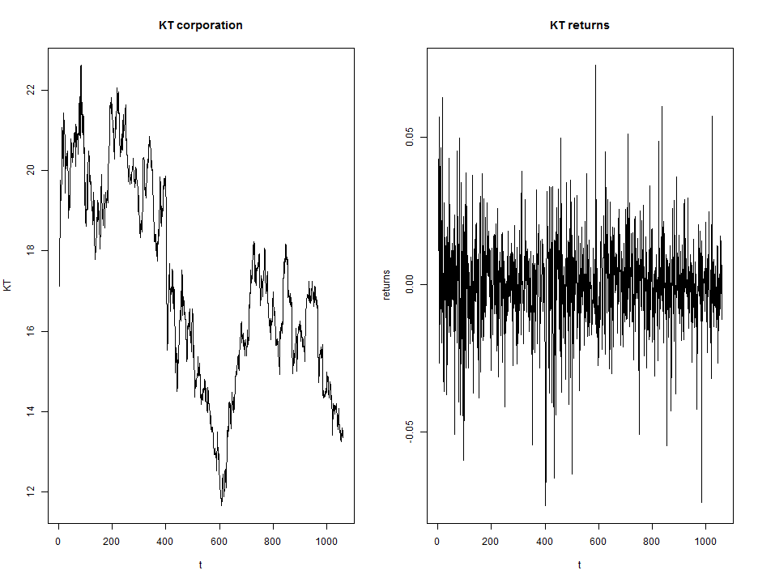 

#### Interpretation
KT corporation 의 주식에 관한 시계열 그래프에서 알 수 있듯이 
최근 5년동안 주식이 하락하는 추세를 보이고 있으며
비정상 시계열임을 알 수 있다.
그리고 중간에 주식이 큰 폭으로 떨어지는 부분이 있다는 것이 
특징이다.
또한 주식의 수익률에 관한 그래프를 통하여
일반적인 주식의 특징이라고 할 수 있는
수익률의 변동성이 변화했을 때 그 변화에 대한
지속기간이 대체적으로 길게 나타나고 있음을 알 수 있다.
#### 3. LG Display Co. Ltd 

```r
dat.3 <- read.csv("C:/Users/user/Desktop/Sung-yoon.R/Mid-term Exam/LG Display Co., Ltd/lg_daily.csv", 
    sep = ",", header = T)
lg <- dat.3$Close
par(mfrow = c(1, 2))
plot(lg, type = "l", main = "LG Display Co. Ltd", xlab = "t", ylab = "LG")
lg.return <- diff(log(lg))
plot(lg.return, type = "l", main = "LG returns", xlab = "t", ylab = "returns")
```

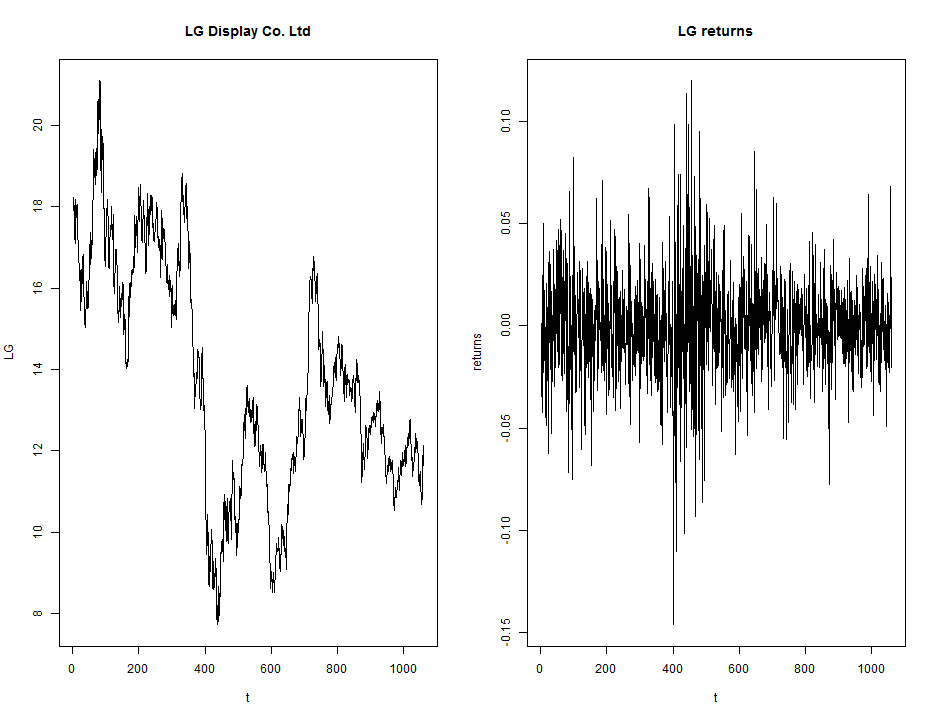 

#### Interpretation
LG Display 주식에 관한 시계열 그래프에서 알 수 있듯이 
중반부 시점에서 주가가 크게 하락하였고 
전반적으로 최근 5년 동안 주가가 하락하는
추세를 보였음을 알 수 있다.
그리고 주식의 수익률에 관한 그래프를 보면
수익률의 변동성에 대한 지속기간이
전반적으로 길게 나타나고 있는 것으로 판단된다.
#### 4. BMW 

```r
dat.4 <- read.csv("C:/Users/user/Desktop/Sung-yoon.R/Mid-term Exam/BMW/BMW_daily.csv", 
    sep = ",", header = T)
bmw <- dat.4$Close
par(mfrow = c(1, 2))
plot(bmw, type = "l", main = "BMW", xlab = "t", ylab = "BMW")
bmw.return <- diff(log(bmw))
plot(bmw.return, type = "l", main = "BMW returns", xlab = "t", ylab = "returns")
```

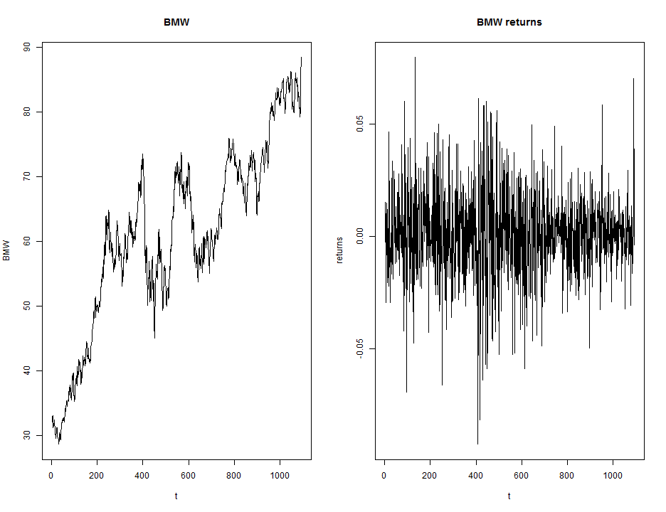 

#### Interpretation
BMW 주식에 관한 시계열 그래프에서 알 수 있듯이 
전반부 시점에서 주가가 크게 상승하였음을 알 수 있다. 
그리고 주식의 수익률에 관한 그래프를 보면
수익률의 변동성에 대한 지속기간이
전반적으로 길게 나타나고 있는 것으로 판단된다.
#### 5. Apple Inc 

```r
dat.5 <- read.csv("C:/Users/user/Desktop/Sung-yoon.R/Mid-term Exam/Apple Inc/apple_daily.csv", 
    sep = ",", header = T)
apple <- dat.5$Close
par(mfrow = c(1, 2))
plot(apple, type = "l", main = "Apple Inc", xlab = "t", ylab = "Apple")
apple.return <- diff(log(apple))
plot(apple.return, type = "l", main = "Apple returns", xlab = "t", ylab = "returns")
```

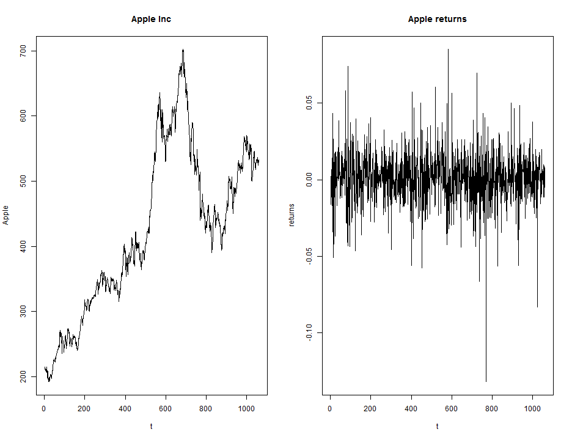 

#### Interpretation
Apple Inc 주식에 관한 시계열 그래프에서 알 수 있듯이 
전반적으로 주가가 상승하는 추세를 보였음을 알 수 있으며
중반부와 후반부 시점 중간에 큰 폭으로 상승했다는 것도 
확인할 수 있다.
그리고 주식의 수익률에 관한 그래프를 보면
일반적인 수익률의 경우와 마찬가지로
수익률의 변동성에 대한 지속기간이
전반적으로 길게 나타나고 있는 것으로 판단된다.

### 2. 수익률에 대한 평균, 표준편차, 왜도, 그리고 첨도

#### 1. Samsung eletronics 

```r
z <- scale(samsung.return)
skew.samsung <- mean(z^3)
kurt.samsung <- mean(z^4)
print(c(mean(samsung.return), sd(samsung.return), skew.samsung, kurt.samsung))
```

```
## [1] 0.0004178 0.0176938 0.0788364 4.0592690
```

#### Interpretation
평균 : 0.0004178181, 표준편차 : 0.0176937566,
왜도 : 0.0788363519 > 0 --> 양수인 것으로 보아 오른쪽으로 꼬리가 형성되는 것으로 보임,
첨도 : 4.0592690227 > 3 --> 일반적인 정규분포의 그래프보다 더 뾰족한 형태의 분포를 형성할 것이라고 예상할 수 있음.
#### 2. KT corporation

```r
z <- scale(kt.return)
skew.kt <- mean(z^3)
kurt.kt <- mean(z^4)
print(c(mean(kt.return), sd(kt.return), skew.kt, kurt.kt))
```

```
## [1] -0.0002274  0.0165461 -0.1646026  5.5892649
```

#### Interpretation
평균 : -0.000227397, 표준편차 : 0.016546067,
왜도 : -0.164602632 < 0 --> 음수인 것으로 보아 왼쪽으로 꼬리가 형성되는 것으로 보임,
첨도 : 5.589264940 > 3 --> 일반적인 정규분포의 그래프보다 더 뾰족한 형태의 분포를 형성할 것이라고 예상할 수 있음.
#### 3. LG Display Co. Ltd 

```r
z <- scale(lg.return)
skew.lg <- mean(z^3)
kurt.lg <- mean(z^4)
print(c(mean(lg.return), sd(lg.return), skew.lg, kurt.lg))
```

```
## [1] -0.000383  0.026411 -0.001076  5.560847
```

#### Interpretation
평균 : -0.0003830322, 표준편차 : 0.0264105771,
왜도 : -0.0010760994 , 0 --> 음수인 것으로 보아 왼쪽으로 꼬리가 형성되는 것으로 보임,
첨도 : 5.5608465389 > 3 --> 일반적인 정규분포의 첨도인 3보다 크기 때문에 뾰족한 모양의 분포를 형성하고 있는 것으로 보인다.
#### 4. BMW 

```r
z <- scale(bmw.return)
skew.bmw <- mean(z^3)
kurt.bmw <- mean(z^4)
print(c(mean(bmw.return), sd(bmw.return), skew.bmw, kurt.bmw))
```

```
## [1]  0.0009239  0.0193432 -0.1424242  4.8996305
```

#### Interpretation
평균 : 0.0009282477, 표준편차 : 0.0193515181,
왜도 : -0.1430340687 < 0 --> 음수인 것으로 보아 왼쪽으로 꼬리가 형성되는 것으로 보임,
첨도 : 4.8958161469 > 3 --> 일반적인 정규분포의 첨도인 3보다 크기 때문에 뾰족한 모양의 분포를 형성하고 있는 것으로 보인다.
#### 5. Apple Inc

```r
z <- scale(apple.return)
skew.apple <- mean(z^3)
kurt.apple <- mean(z^4)
print(c(mean(apple.return), sd(apple.return), skew.apple, kurt.apple))
```

```
## [1]  0.0008606  0.0174217 -0.3852795  7.9795077
```

#### Interpretation
평균 : 0.0008606177, 표준편차 : 0.0174216501,
왜도 : -0.3852795005 , 0 --> 음수인 것으로 보아 왼쪽으로 꼬리가 형성되는 것으로 보임,
첨도 : 7.9795077037 > 3 --> 일반적인 정규분포의 첨도인 3보다 크기 때문에 뾰족한 모양의 분포를 형성하고 있는 것으로 보인다.

### 3. 정규성에 대한 고찰

#### 1. Samsung eletronics

```r
par(mfrow = c(1, 1))
hist(samsung.return, prob = T, nclass = 50)
x <- seq(from = -0.05, to = 0.05, by = 1e-04)
lines(x, dnorm(x, mean = mean(samsung.return), sd(samsung.return)), col = 2)
```

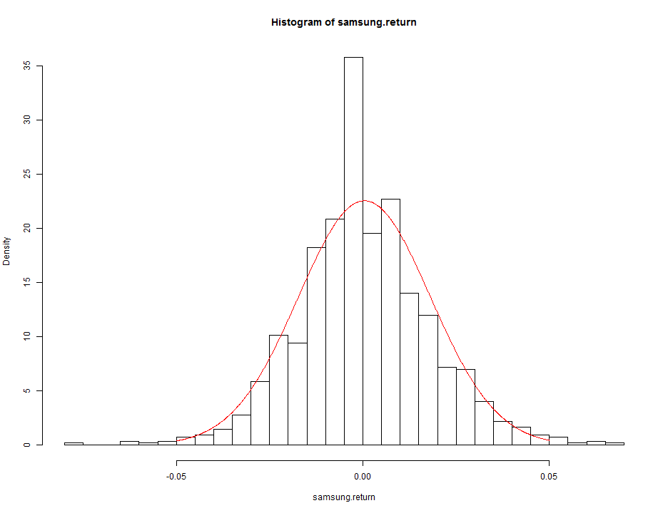 

#### Interpretation
히스토그램의 형태가 정규분포와 비교했을 때 더 뾰족하고 오른쪽에서 꼬리가 형성되고 있으며 더 두꺼움을 알 수 있다. 일반적으로 왼쪽에서 꼬리가 형성되는 경우가 많다는 사실과 비교했을 때 특이한 case라고 할 수 있겠다.
#### 2. KT corporation

```r
par(mfrow = c(1, 1))
hist(kt.return, prob = T, nclass = 50)
x <- seq(from = -0.05, to = 0.05, by = 1e-04)
lines(x, dnorm(x, mean = mean(kt.return), sd(kt.return)), col = 2)
```

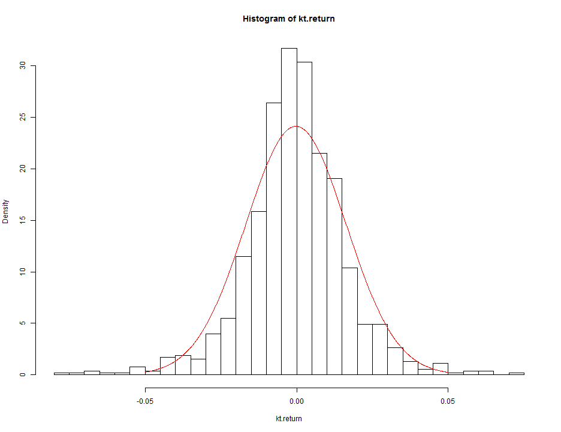 

#### Interpretation
히스토그램의 형태가 정규분포와 비교했을 때 더 뾰족하고 왼쪽에서 꼬리가 형성되고 있으며 더 두꺼움을 알 수 있다. 이는 수익률의 분포가 정규분포와는 거리가 멀다는 것을 뜻한다.
#### 3. LG Display Co. Ltd 

```r
par(mfrow = c(1, 1))
hist(lg.return, prob = T, nclass = 50)
x <- seq(from = -0.1, to = 0.15, by = 1e-04)
lines(x, dnorm(x, mean = mean(lg.return), sd(lg.return)), col = 2)
```

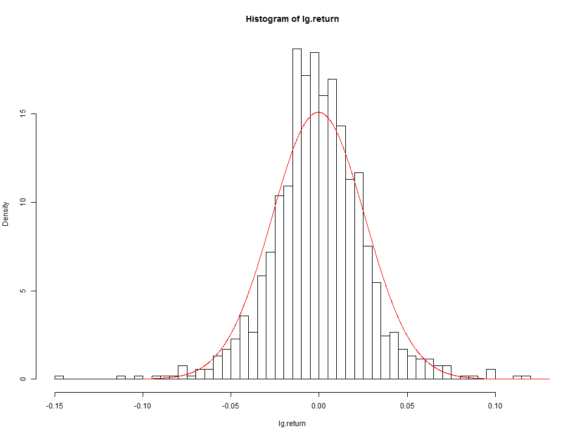 

#### Interpretation
히스토그램의 형태가 정규분포와 비교했을 때 뾰족하고 왼쪽에서 꼬리가 형성되고 있으며 더 두꺼움을 알 수 있다. 이 사실을 통해 정규성을 가정하는 것에 있어서는 조심해야 할 것으로 보인다.
#### 4. BMW 

```r
par(mfrow = c(1, 1))
hist(bmw.return, prob = T, nclass = 50)
x <- seq(from = -0.1, to = 0.05, by = 1e-04)
lines(x, dnorm(x, mean = mean(bmw.return), sd(bmw.return)), col = 2)
```

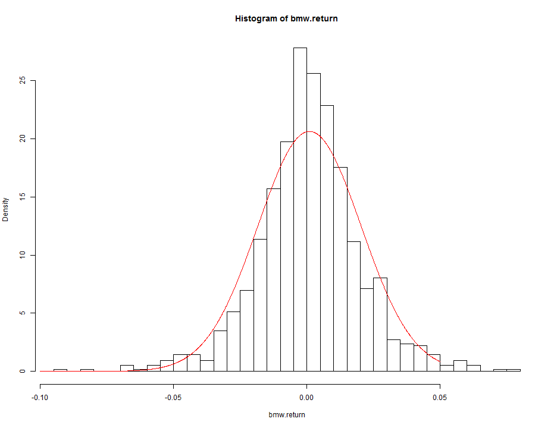 

#### Interpretation
히스토그램의 형태가 정규분포와 비교했을 때 뾰족하고 왼쪽에서 꼬리가 형성되고 있으며 더 두꺼움을 알 수 있다. 차이가 있는 것으로 보아 정규성을 가정하는 것에 있어서는 조심해야 할 것으로 보인다.
#### 5. Apple Inc 

```r
par(mfrow = c(1, 1))
hist(apple.return, prob = T, nclass = 50)
x <- seq(from = -0.1, to = 0.05, by = 1e-04)
lines(x, dnorm(x, mean = mean(apple.return), sd(apple.return)), col = 2)
```

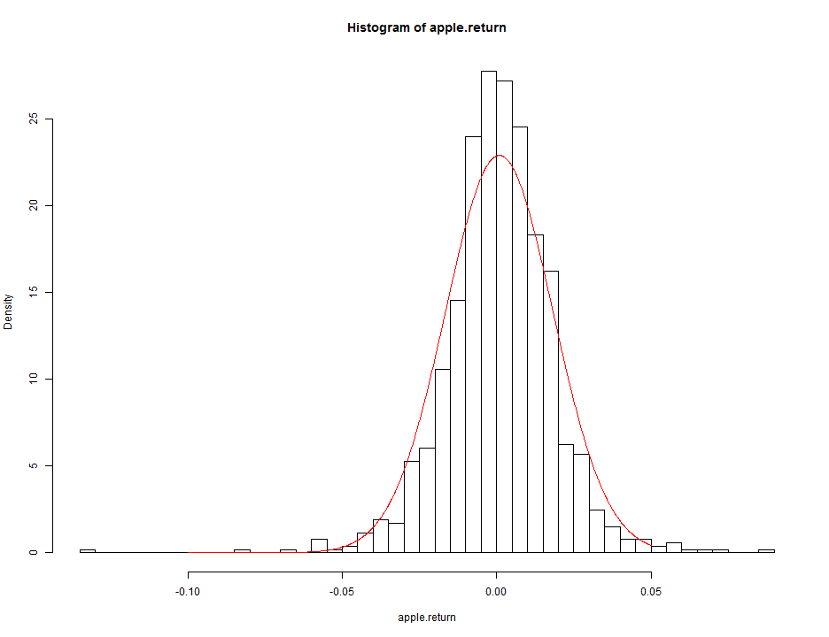 

#### Interpretation
히스토그램의 형태가 정규분포와 비교했을 때 뾰족하고 왼쪽에서 꼬리가 형성되고 있으며 더 두꺼움을 알 수 있다. 차이가 있는 것으로 보아 정규성을 가정하는 것에 있어서는 무리가 있을 것이라 여겨진다.

### 4. 정규성 검정(Shapiro-Wilk normality test)

#### 1. Samsung eletronics

```r
par(mfrow = c(1, 1))
qqnorm(samsung.return)
qqline(samsung.return)
```

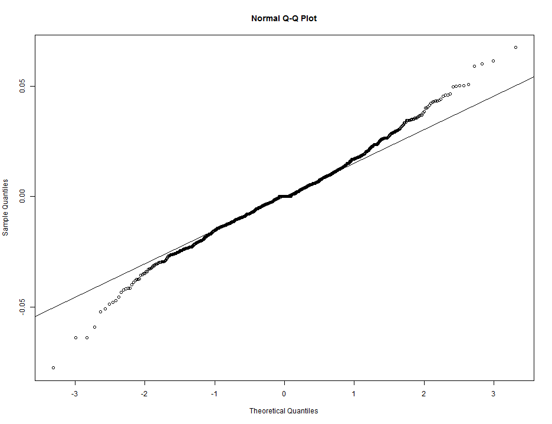 

```r
shapiro.test(samsung.return)
```

```
## 
## 	Shapiro-Wilk normality test
## 
## data:  samsung.return
## W = 0.9893, p-value = 3.95e-07
```

#### Interpretation
Q-Q plot을 통해서 알 수 있듯이 그래프가 직선과 동떨어지는 부분이 양끝에서 발생하고 있음을 알 수 있고, 검정결과 유의확률이 0.05보다 작은 것으로 보아 데이터가 정규분포를 따른다는 H0를 기각한다. 즉, 수익률이 정규성을 띄고 있다고 말할 수 없다.
#### 2. KT corporation

```r
par(mfrow = c(1, 1))
qqnorm(kt.return)
qqline(kt.return)
```

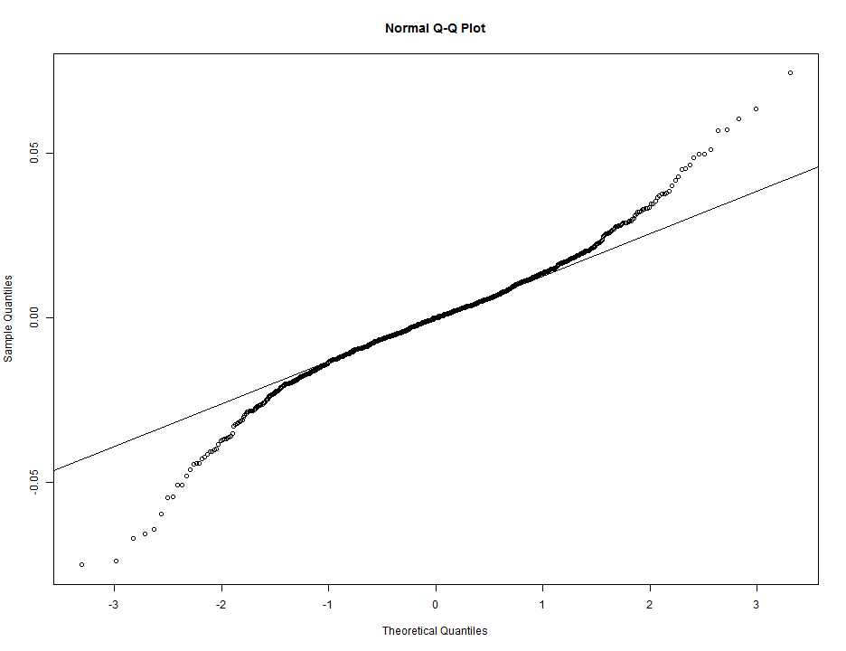 

```r
shapiro.test(kt.return)
```

```
## 
## 	Shapiro-Wilk normality test
## 
## data:  kt.return
## W = 0.9665, p-value = 6.377e-15
```

#### Interpretation
Q-Q plot을 통해서 알 수 있듯이 그래프가 직선과 동떨어지는 부분이 양끝에서 발생하고 있음을 알 수 있고, 검정결과 유의확률이 0.05보다 작은 것으로 보아 데이터가 정규분포를 따른다는 H0를 기각한다. 즉, 수익률이 정규성을 띄고 있다고 말할 수 없다.
#### 3. LG Display Co. Ltd 

```r
par(mfrow = c(1, 1))
qqnorm(lg.return)
qqline(lg.return)
```

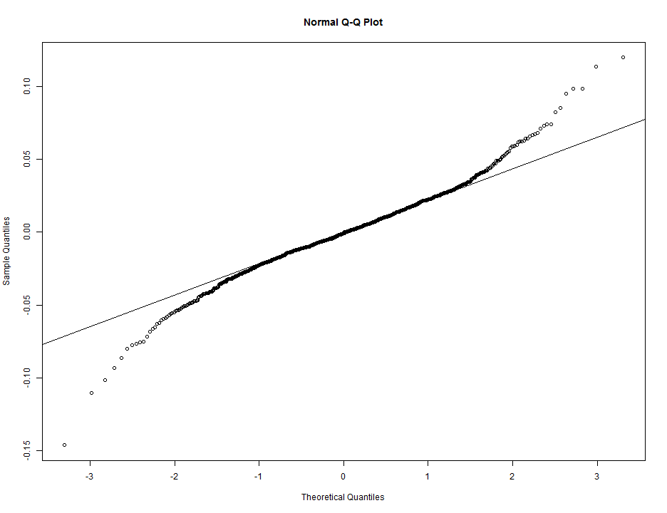 

```r
shapiro.test(lg.return)
```

```
## 
## 	Shapiro-Wilk normality test
## 
## data:  lg.return
## W = 0.9735, p-value = 5.379e-13
```

#### Interpretation
Q-Q plot을 통해서 알 수 있듯이 그래프가 직선과 동떨어지는 부분이 양끝에서 발생하고 있음을 알 수 있고, 검정결과 유의확률이 0.05보다 매우 작은 것으로 보아 데이터가 정규분포를 따른다는 H0를 기각한다. 즉, 수익률이 정규성을 띄고 있다고 말할 수 없다.
#### 4. BMW 

```r
par(mfrow = c(1, 1))
qqnorm(bmw.return)
qqline(bmw.return)
```

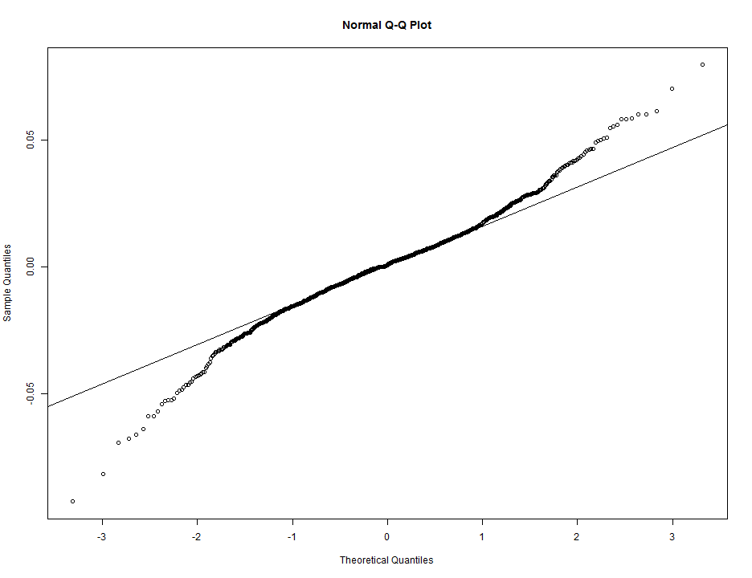 

```r
shapiro.test(bmw.return)
```

```
## 
## 	Shapiro-Wilk normality test
## 
## data:  bmw.return
## W = 0.9771, p-value = 4.016e-12
```

#### Interpretation
Q-Q plot을 통해서 알 수 있듯이 그래프가 직선과 동떨어지는 부분이 양끝에서 발생하고 있음을 알 수 있고, 검정결과 유의확률이 0.05보다 매우 작은 것으로 보아 데이터가 정규분포를 따른다는 H0를 기각한다. 즉, 수익률이 정규성을 띄고 있다고 말할 수 없다.
#### 5. Apple Inc 

```r
par(mfrow = c(1, 1))
qqnorm(apple.return)
qqline(apple.return)
```

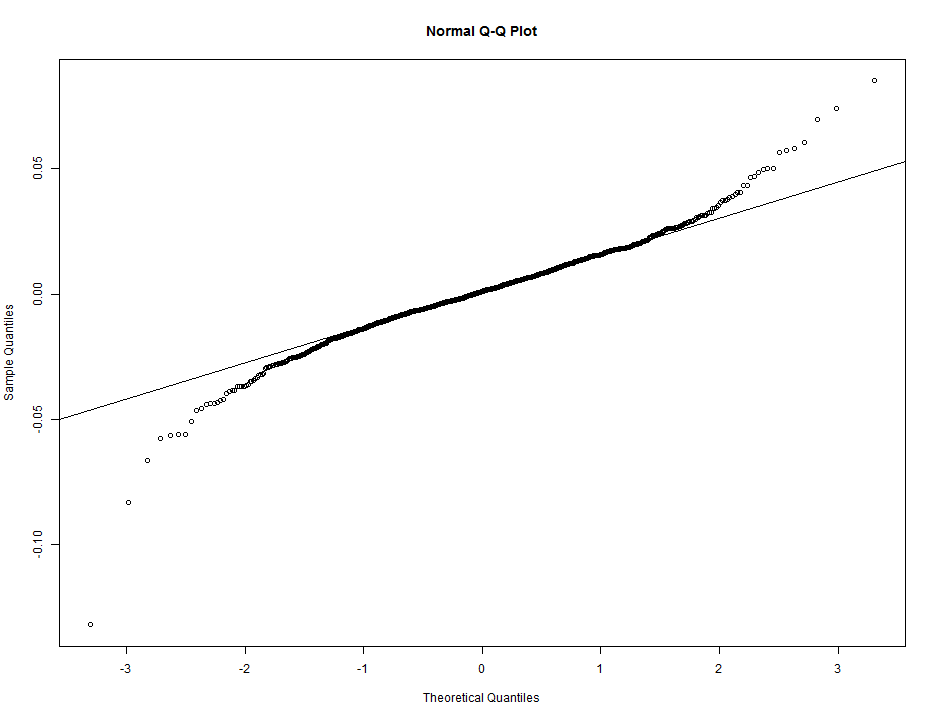 

```r
shapiro.test(apple.return)
```

```
## 
## 	Shapiro-Wilk normality test
## 
## data:  apple.return
## W = 0.9576, p-value < 2.2e-16
```

#### Interpretation
Q-Q plot을 통해서 알 수 있듯이 그래프가 직선과 동떨어지는 부분이 양끝에서 발생하고 있음을 알 수 있고, 검정결과 유의확률이 0.05보다 매우 작은 것으로 보아 데이터가 정규분포를 따른다는 H0를 기각한다. 즉, 수익률이 정규성을 띄고 있다고 말할 수 없다.

### 5. 자기상관함수 (Autocorrelation function)

#### 1. Samsung eletronics

```r
par(mfrow = c(2, 1))
acf(samsung.return)
acf(abs(samsung.return))
```

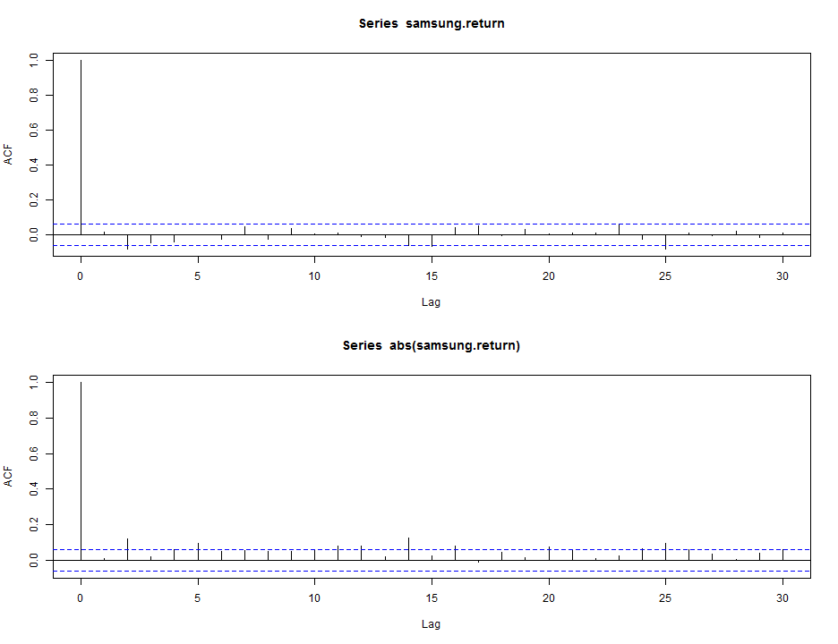 

#### Interpretation
수익률에 대한 ACF를 보면 대부분 신뢰구간을 벗어나지 않고 있으므로 이전날의 수익률이 현재의 수익률에 미치는 영향이 거의 없음을 알 수 있다. 하지만 수익률의 절대값에 관한 ACF를 보면 적기는 하지만 신뢰구간을 뚫고 나오는 경우가 종종 있음을 알 수 있다. 그러므로 크지는 않지만 이전날의 수익률의 변화가 현재의 수익률에 변화에 어느 정도 영향력을 행사하고 있음을 알 수 있다.
#### 2. KT corporation

```r
par(mfrow = c(2, 1))
acf(kt.return)
acf(abs(kt.return))
```

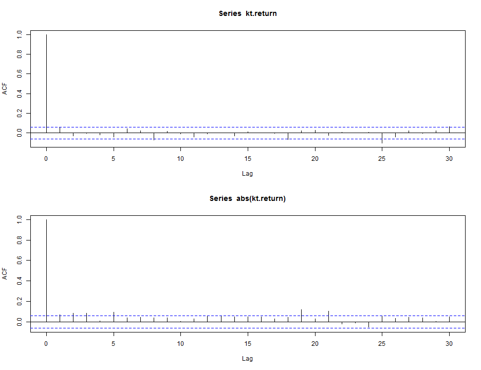 

#### Interpretation
수익률에 대한 ACF를 보면 대부분 신뢰구간을 벗어나지 않고 있으므로 이전날의 수익률이 현재의 수익률에 미치는 영향이 거의 없음을 알 수 있다. 수익률의 절대값에 대한 ACF 또한 일부 시차를 제외하면 동일한 결과를 보여주는 것으로 보아 이전날의 수익률의 변화 또한 현재의 수익률의 변화에 별다른 영향을 주지 못하고 있는 것으로 해석할 수 있겠다. 하지만 그 이후의 분석결과에 따라 내용이 달라질 수 있으니 유의를 해야 하겠다.
#### 3. LG Display Co. Ltd 

```r
par(mfrow = c(2, 1))
acf(lg.return)
acf(abs(lg.return))
```

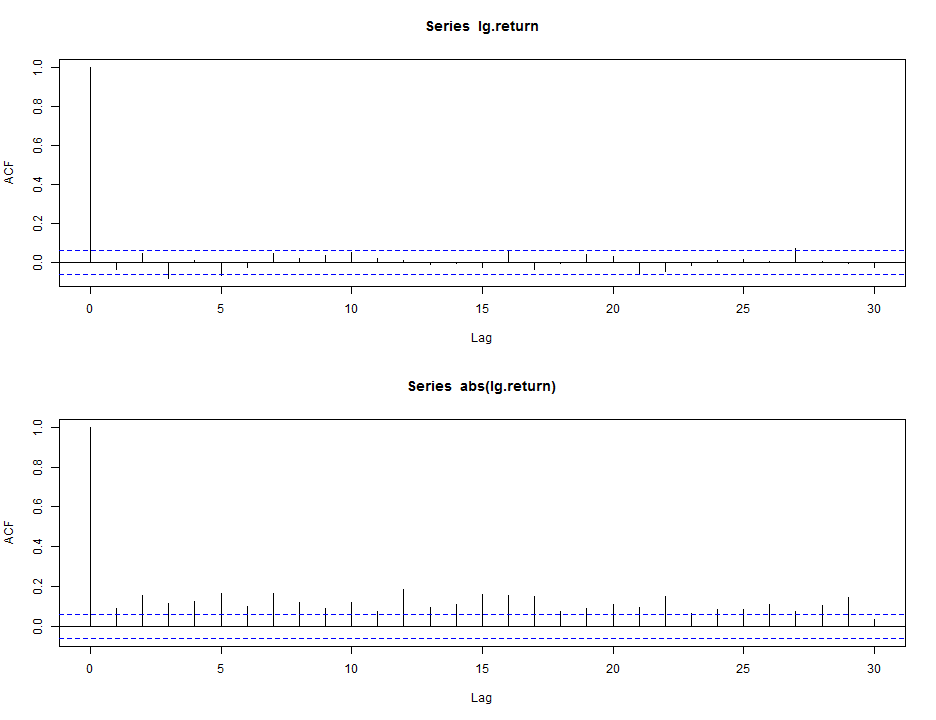 

#### Interpretation
수익률에 대한 ACF를 보면 대부분 신뢰구간을 벗어나지 않고 있으므로 이전날의 수익률이 현재의 수익률에 미치는 영향력이 크다고 할 수는 없겠다. 그러나 수익률의 절대값에 관한 ACF를 보면 신뢰구간을 뚫고 나오는 경우가 많이 존재하고 있다. 즉, 이전날의 수익률의 변화가 현재의 수익률의 변화에 많은 영향력을 행사하고 있음을 알 수 있다. 그러므로 수익률 자체를 분석하는 것보다 수익률의 변화에 대해서 연구해보는 것이 더 바람직할 것으로 여겨진다.
#### 4. BMW 

```r
par(mfrow = c(2, 1))
acf(bmw.return)
acf(abs(bmw.return))
```

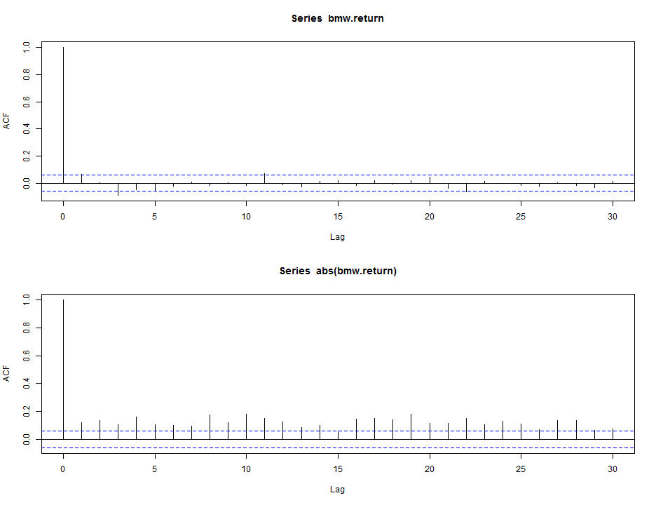 

#### Interpretation
수익률에 대한 ACF를 보면 대부분 신뢰구간을 벗어나지 않고 있으므로 이전날의 수익률이 현재의 수익률에 미치는 영향력이 크다고 할 수는 없겠다. 그러나 수익률의 절대값에 대한 ACF에서는 이전날의 수익률의 변화가 현재의 수익률의 변화에 영향을 미치는 것으로 나타나고 있다. 그러므로 수익률 자체를 분석하는 것보다 수익률의 변화에 대해서 연구해보는 것이 더 바람직할 것으로 여겨진다.
#### 5. Apple Inc 

```r
par(mfrow = c(2, 1))
acf(apple.return)
acf(abs(apple.return))
```

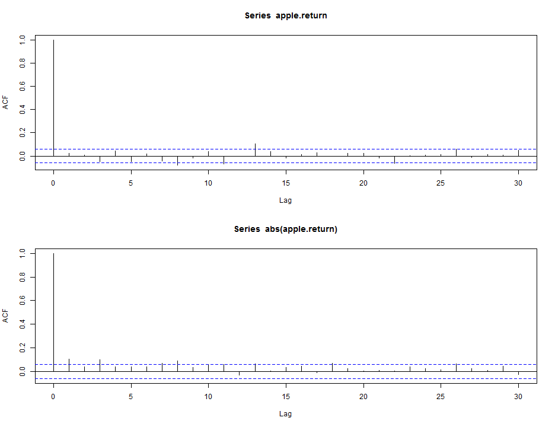 

#### Interpretation
수익률에 대한 ACF를 보면 대부분 신뢰구간을 벗어나지 않고 있으므로 이전날의 수익률이 현재의 수익률에 미치는 영향력이 크다고 할 수는 없겠다. 수익률의 절대값에 대한 ACF 또한 일부 시차를 제외하면 동일한 결과를 보여주는 것으로 보아 이전날의 수익률의 변화 또한 현재의 수익률의 변화에 별다른 영향을 주지 못하고 있는 것으로 해석할 수 있겠다. 하지만 그 이후의 분석결과에 따라 내용이 달라질 수 있으니 유의를 해야 하겠다.
