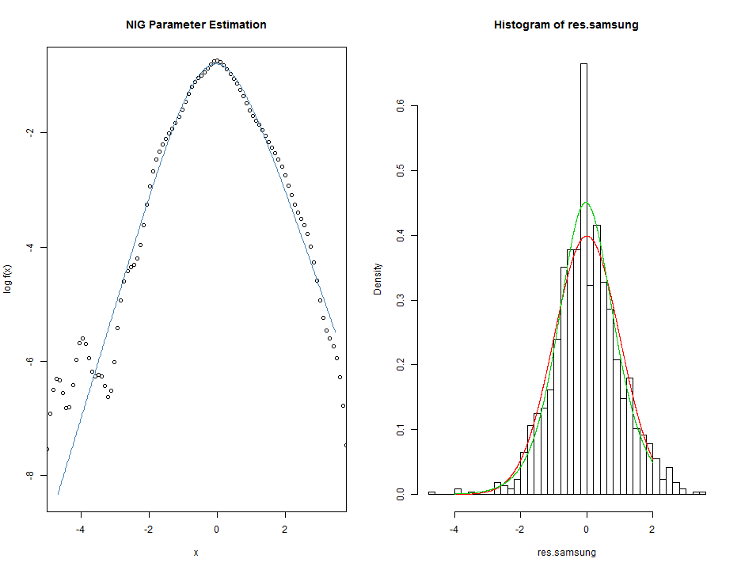
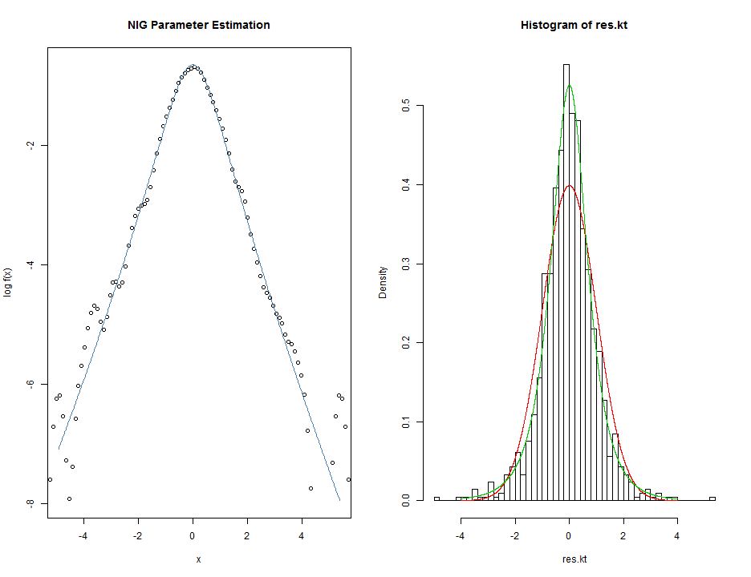
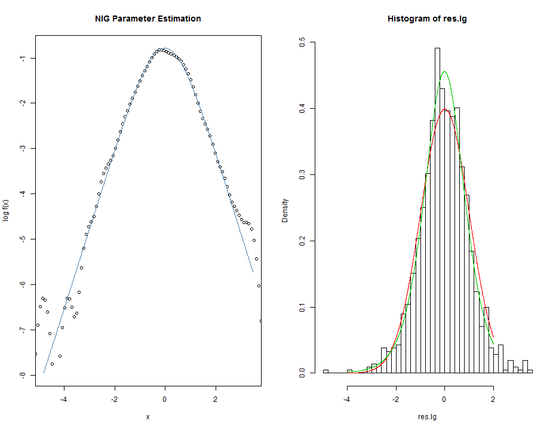
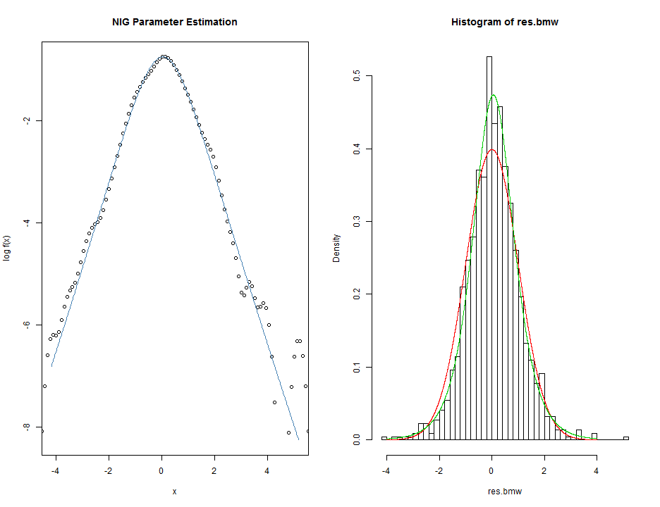
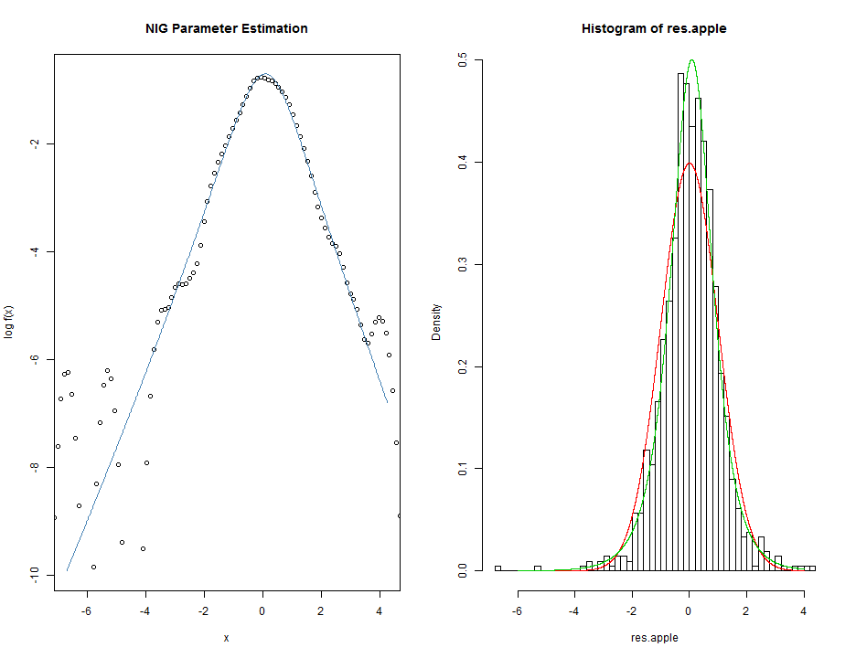
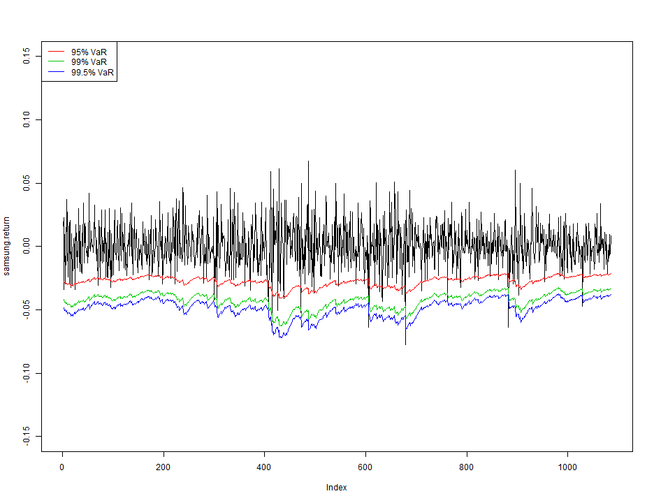
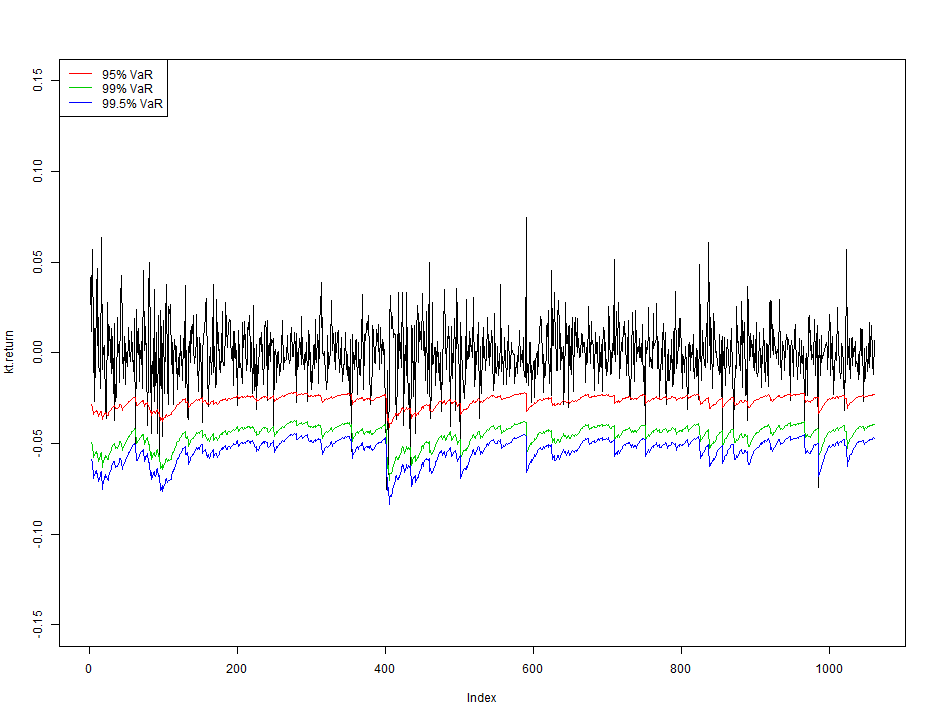
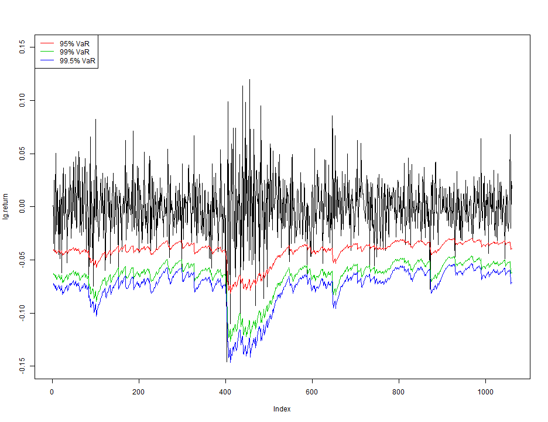
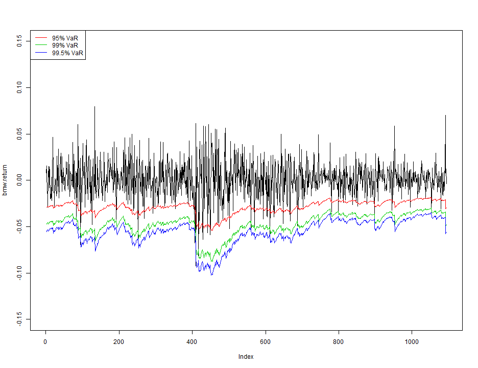
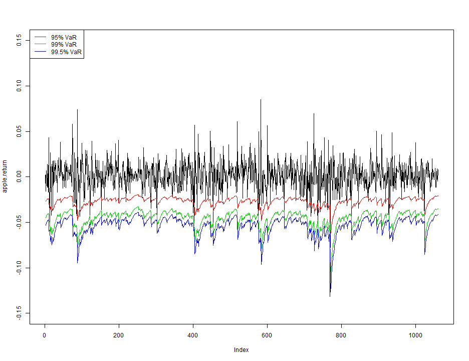

Assignment (Due to April. 14th. 2014)
========================================================
200903877 황 성 윤
-------------------------
수익률의 잔차에 대한 분포의 추정
---------------------------------------------------------------------------

### 5개 기업에 대한 수익률 생성 및 해당 패키지 설치


```r
dat.1 <- read.csv("C:/Users/user/Desktop/Sung-yoon.R/Mid-term Exam/Samsung eletronics/samsung_daily.csv", 
    sep = ",", header = T)
samsung <- dat.1$Close
samsung.return <- diff(log(samsung))
dat.2 <- read.csv("C:/Users/user/Desktop/Sung-yoon.R/Mid-term Exam/KT Corporation/kt_daily.csv", 
    sep = ",", header = T)
kt <- dat.2$Close
kt.return <- diff(log(kt))
dat.3 <- read.csv("C:/Users/user/Desktop/Sung-yoon.R/Mid-term Exam/LG Display Co., Ltd/lg_daily.csv", 
    sep = ",", header = T)
lg <- dat.3$Close
lg.return <- diff(log(lg))
dat.4 <- read.csv("C:/Users/user/Desktop/Sung-yoon.R/Mid-term Exam/BMW/BMW_daily.csv", 
    sep = ",", header = T)
bmw <- dat.4$Close
bmw.return <- diff(log(bmw))
dat.5 <- read.csv("C:/Users/user/Desktop/Sung-yoon.R/Mid-term Exam/Apple Inc/apple_daily.csv", 
    sep = ",", header = T)
apple <- dat.5$Close
apple.return <- diff(log(apple))
install.packages("fBasics")
```

```
## Error: trying to use CRAN without setting a mirror
```

```r
library(fBasics)
```

```
## Loading required package: MASS
## Loading required package: timeDate
## Loading required package: timeSeries
## 
## Attaching package: 'fBasics'
## 
## The following object is masked from 'package:base':
## 
##     norm
```

```r
install.packages("tseries")
```

```
## Error: trying to use CRAN without setting a mirror
```

```r
library(tseries)
```


#### If r ~ N( 0 , sigma^2 ) , it is not true..
#### r(t) = sigma(t)*e(t) , e(t) ~ WN(0,1) (e : epsilon)
#### e(t) is called random shocks..
#### GARCH(1,1) -> sigma(t)^2 = alpha(0) + alpha(1)*r(t-1)^2
#### + beta(1)*sigma(t-1)^2
#### Refer to Jarque Bera Test, e(t) is nonnormal~~!!
#### 잔차의 분포를 구할 필요성.
#### 잔차에 관해서 plot을 그리고 정규성 확인

### 잔차 epsilon에 대한 분포 점검

#### 1. Samsung eletronics

```r
par(mfrow = c(1, 2))
vol.samsung <- garch(samsung.return)
```

```
## 
##  ***** ESTIMATION WITH ANALYTICAL GRADIENT ***** 
## 
## 
##      I     INITIAL X(I)        D(I)
## 
##      1     2.817621e-04     1.000e+00
##      2     5.000000e-02     1.000e+00
##      3     5.000000e-02     1.000e+00
## 
##     IT   NF      F         RELDF    PRELDF    RELDX   STPPAR   D*STEP   NPRELDF
##      0    1 -3.832e+03
##      1    9 -3.832e+03  1.25e-06  2.60e-06  1.3e-05  6.1e+09  1.3e-06  7.95e+03
##      2   17 -3.832e+03  8.21e-05  1.44e-04  1.7e-01  2.0e+00  2.1e-02  9.13e-02
##      3   21 -3.836e+03  1.00e-03  6.34e-04  7.4e-01  1.2e+00  3.3e-01  7.79e-03
##      4   23 -3.837e+03  2.11e-04  2.15e-04  7.8e-02  2.0e+00  6.7e-02  2.38e-01
##      5   25 -3.839e+03  4.33e-04  4.23e-04  1.3e-01  6.8e-01  1.3e-01  1.98e-03
##      6   35 -3.839e+03  1.07e-05  2.68e-05  1.7e-06  4.0e+00  2.1e-06  2.14e-02
##      7   36 -3.839e+03  1.07e-06  8.27e-07  1.7e-06  2.0e+00  2.1e-06  1.71e-02
##      8   46 -3.840e+03  3.52e-04  4.13e-04  1.0e-01  1.8e+00  1.3e-01  1.73e-02
##      9   48 -3.841e+03  1.89e-04  1.84e-04  2.8e-02  1.4e+00  4.1e-02  7.74e-04
##     10   50 -3.843e+03  5.37e-04  6.18e-04  5.0e-02  7.2e-01  8.2e-02  1.89e-03
##     11   51 -3.846e+03  6.88e-04  1.02e-03  4.2e-02  6.1e-01  8.2e-02  1.31e-03
##     12   59 -3.847e+03  4.02e-04  6.04e-04  8.9e-07  4.3e+00  1.6e-06  3.92e-03
##     13   60 -3.847e+03  1.74e-06  1.95e-06  8.7e-07  2.0e+00  1.6e-06  8.07e-03
##     14   61 -3.847e+03  1.43e-07  1.70e-07  8.8e-07  2.0e+00  1.6e-06  8.25e-03
##     15   69 -3.850e+03  7.05e-04  1.16e-03  1.0e-02  1.6e+00  1.8e-02  8.24e-03
##     16   71 -3.852e+03  5.84e-04  6.02e-04  7.3e-03  9.9e-01  1.8e-02  5.95e-03
##     17   72 -3.855e+03  6.70e-04  8.50e-04  1.5e-02  9.3e-01  3.7e-02  1.90e-03
##     18   73 -3.855e+03  7.08e-05  1.64e-04  7.8e-03  0.0e+00  1.8e-02  1.64e-04
##     19   74 -3.855e+03  5.10e-05  6.72e-05  2.4e-03  0.0e+00  6.3e-03  6.72e-05
##     20   75 -3.855e+03  3.32e-06  2.76e-06  1.1e-03  0.0e+00  2.4e-03  2.76e-06
##     21   88 -3.855e+03  7.54e-08  2.07e-07  1.1e-08  2.6e+00  2.1e-08  3.11e-07
##     22   90 -3.855e+03  1.44e-08  6.87e-09  1.0e-08  2.0e+00  2.1e-08  3.08e-08
##     23   92 -3.855e+03  1.99e-11  4.59e-12  1.1e-08  2.0e+00  2.1e-08  2.36e-08
##     24   99 -3.855e+03 -6.37e-15  2.19e-17  2.1e-14  4.1e+03  5.5e-14  2.35e-08
## 
##  ***** FALSE CONVERGENCE *****
## 
##  FUNCTION    -3.855128e+03   RELDX        2.136e-14
##  FUNC. EVALS      99         GRAD. EVALS      24
##  PRELDF       2.191e-17      NPRELDF      2.355e-08
## 
##      I      FINAL X(I)        D(I)          G(I)
## 
##      1    4.656003e-06     1.000e+00    -7.209e-02
##      2    3.087981e-02     1.000e+00     1.030e+00
##      3    9.535844e-01     1.000e+00     1.149e+00
```

```r
res.samsung <- vol.samsung$residuals[-1]
nigFit(res.samsung)
```

```
## 
##  Objective Function Value:   -1533
##  Parameter Estimates:        1 0 1 0 
## 
##  Objective Function Value:   -1533
##  Parameter Estimates:        1 0 1 0 
## 
##  Objective Function Value:   -1533
##  Parameter Estimates:        1 1.49e-08 1 0 
## 
##  Objective Function Value:   -1533
##  Parameter Estimates:        1 0 1 0 
## 
##  Objective Function Value:   -1533
##  Parameter Estimates:        1 0 1 1.49e-08 
## 
##  Objective Function Value:   -1737
##  Parameter Estimates:        0.7388 0.287 1.917 -0.09035 
## 
##  Objective Function Value:   -1530
##  Parameter Estimates:        0.97 0.033 1.105 -0.01039 
## 
##  Objective Function Value:   -1530
##  Parameter Estimates:        0.97 0.033 1.105 -0.01039 
## 
##  Objective Function Value:   -1530
##  Parameter Estimates:        0.97 0.03296 1.105 -0.01039 
## 
##  Objective Function Value:   -1530
##  Parameter Estimates:        0.97 0.033 1.105 -0.01039 
## 
##  Objective Function Value:   -1530
##  Parameter Estimates:        0.97 0.033 1.105 -0.01035 
## 
##  Objective Function Value:   -1536
##  Parameter Estimates:        1.039 -0.005241 1.105 -0.0939 
## 
##  Objective Function Value:   -1530
##  Parameter Estimates:        0.9851 0.02463 1.105 -0.02867 
## 
##  Objective Function Value:   -1530
##  Parameter Estimates:        0.9851 0.02463 1.105 -0.02867 
## 
##  Objective Function Value:   -1530
##  Parameter Estimates:        0.9851 0.02463 1.105 -0.02867 
## 
##  Objective Function Value:   -1530
##  Parameter Estimates:        0.9851 0.02463 1.105 -0.02867 
## 
##  Objective Function Value:   -1530
##  Parameter Estimates:        0.9851 0.02463 1.105 -0.02867 
## 
##  Objective Function Value:   -1530
##  Parameter Estimates:        0.9851 0.02463 1.105 -0.02867 
## 
##  Objective Function Value:   -1529
##  Parameter Estimates:        1.002 0.04242 1.109 -0.02333 
## 
##  Objective Function Value:   -1529
##  Parameter Estimates:        1.002 0.04242 1.109 -0.02333 
## 
##  Objective Function Value:   -1529
##  Parameter Estimates:        1.002 0.04241 1.109 -0.02333 
## 
##  Objective Function Value:   -1529
##  Parameter Estimates:        1.002 0.04242 1.109 -0.02333 
## 
##  Objective Function Value:   -1529
##  Parameter Estimates:        1.002 0.04242 1.109 -0.02333 
## 
##  Objective Function Value:   -1529
##  Parameter Estimates:        1.041 0.04258 1.122 -0.05161 
## 
##  Objective Function Value:   -1529
##  Parameter Estimates:        1.041 0.04258 1.122 -0.05161 
## 
##  Objective Function Value:   -1529
##  Parameter Estimates:        1.041 0.04258 1.122 -0.05161 
## 
##  Objective Function Value:   -1529
##  Parameter Estimates:        1.041 0.04258 1.122 -0.05161 
## 
##  Objective Function Value:   -1529
##  Parameter Estimates:        1.041 0.04258 1.122 -0.05161 
## 
##  Objective Function Value:   -1528
##  Parameter Estimates:        1.07 0.06535 1.156 -0.04659 
## 
##  Objective Function Value:   -1528
##  Parameter Estimates:        1.07 0.06535 1.156 -0.04659 
## 
##  Objective Function Value:   -1528
##  Parameter Estimates:        1.07 0.06535 1.156 -0.04659 
## 
##  Objective Function Value:   -1528
##  Parameter Estimates:        1.07 0.06535 1.156 -0.04659 
## 
##  Objective Function Value:   -1528
##  Parameter Estimates:        1.07 0.06535 1.156 -0.04659 
## 
##  Objective Function Value:   -1527
##  Parameter Estimates:        1.136 0.05247 1.23 -0.06058 
## 
##  Objective Function Value:   -1527
##  Parameter Estimates:        1.136 0.05247 1.23 -0.06058 
## 
##  Objective Function Value:   -1527
##  Parameter Estimates:        1.136 0.05247 1.23 -0.06058 
## 
##  Objective Function Value:   -1527
##  Parameter Estimates:        1.136 0.05247 1.23 -0.06058 
## 
##  Objective Function Value:   -1527
##  Parameter Estimates:        1.136 0.05247 1.23 -0.06058 
## 
##  Objective Function Value:   -1527
##  Parameter Estimates:        1.234 0.06221 1.241 -0.04429 
## 
##  Objective Function Value:   -1527
##  Parameter Estimates:        1.234 0.06221 1.241 -0.04429 
## 
##  Objective Function Value:   -1527
##  Parameter Estimates:        1.234 0.06221 1.241 -0.04429 
## 
##  Objective Function Value:   -1527
##  Parameter Estimates:        1.234 0.06221 1.241 -0.04429 
## 
##  Objective Function Value:   -1527
##  Parameter Estimates:        1.234 0.06221 1.241 -0.04429 
## 
##  Objective Function Value:   -1526
##  Parameter Estimates:        1.239 0.1239 1.282 -0.1122 
## 
##  Objective Function Value:   -1526
##  Parameter Estimates:        1.239 0.1239 1.282 -0.1122 
## 
##  Objective Function Value:   -1526
##  Parameter Estimates:        1.239 0.1239 1.282 -0.1122 
## 
##  Objective Function Value:   -1526
##  Parameter Estimates:        1.239 0.1239 1.282 -0.1122 
## 
##  Objective Function Value:   -1526
##  Parameter Estimates:        1.239 0.1239 1.282 -0.1122 
## 
##  Objective Function Value:   -1526
##  Parameter Estimates:        1.311 0.1162 1.333 -0.06404 
## 
##  Objective Function Value:   -1526
##  Parameter Estimates:        1.264 0.1212 1.3 -0.09526 
## 
##  Objective Function Value:   -1526
##  Parameter Estimates:        1.264 0.1212 1.3 -0.09526 
## 
##  Objective Function Value:   -1526
##  Parameter Estimates:        1.264 0.1212 1.3 -0.09526 
## 
##  Objective Function Value:   -1526
##  Parameter Estimates:        1.264 0.1212 1.3 -0.09526 
## 
##  Objective Function Value:   -1526
##  Parameter Estimates:        1.264 0.1212 1.3 -0.09526 
## 
##  Objective Function Value:   -1526
##  Parameter Estimates:        1.287 0.1021 1.319 -0.096 
## 
##  Objective Function Value:   -1526
##  Parameter Estimates:        1.287 0.1021 1.319 -0.096 
## 
##  Objective Function Value:   -1526
##  Parameter Estimates:        1.287 0.1021 1.319 -0.096 
## 
##  Objective Function Value:   -1526
##  Parameter Estimates:        1.287 0.1021 1.319 -0.096 
## 
##  Objective Function Value:   -1526
##  Parameter Estimates:        1.287 0.1021 1.319 -0.09599 
## 
##  Objective Function Value:   -1526
##  Parameter Estimates:        1.311 0.0984 1.341 -0.08219 
## 
##  Objective Function Value:   -1526
##  Parameter Estimates:        1.311 0.0984 1.341 -0.08219 
## 
##  Objective Function Value:   -1526
##  Parameter Estimates:        1.311 0.0984 1.341 -0.08219 
## 
##  Objective Function Value:   -1526
##  Parameter Estimates:        1.311 0.0984 1.341 -0.08219 
## 
##  Objective Function Value:   -1526
##  Parameter Estimates:        1.311 0.0984 1.341 -0.08219 
## 
##  Objective Function Value:   -1525
##  Parameter Estimates:        1.341 0.09587 1.358 -0.08617 
## 
##  Objective Function Value:   -1525
##  Parameter Estimates:        1.341 0.09587 1.358 -0.08617 
## 
##  Objective Function Value:   -1525
##  Parameter Estimates:        1.341 0.09587 1.358 -0.08617 
## 
##  Objective Function Value:   -1525
##  Parameter Estimates:        1.341 0.09587 1.358 -0.08617 
## 
##  Objective Function Value:   -1525
##  Parameter Estimates:        1.341 0.09587 1.358 -0.08617 
## 
##  Objective Function Value:   -1525
##  Parameter Estimates:        1.354 0.09081 1.39 -0.08114 
## 
##  Objective Function Value:   -1525
##  Parameter Estimates:        1.354 0.09081 1.39 -0.08114 
## 
##  Objective Function Value:   -1525
##  Parameter Estimates:        1.354 0.09081 1.39 -0.08114 
## 
##  Objective Function Value:   -1525
##  Parameter Estimates:        1.354 0.09081 1.39 -0.08114 
## 
##  Objective Function Value:   -1525
##  Parameter Estimates:        1.354 0.09081 1.39 -0.08114 
## 
##  Objective Function Value:   -1526
##  Parameter Estimates:        1.379 0.1135 1.398 -0.07479 
## 
##  Objective Function Value:   -1525
##  Parameter Estimates:        1.359 0.09638 1.391 -0.07881 
## 
##  Objective Function Value:   -1525
##  Parameter Estimates:        1.359 0.09638 1.391 -0.07881 
## 
##  Objective Function Value:   -1525
##  Parameter Estimates:        1.359 0.09637 1.391 -0.07881 
## 
##  Objective Function Value:   -1525
##  Parameter Estimates:        1.359 0.09638 1.391 -0.07881 
## 
##  Objective Function Value:   -1525
##  Parameter Estimates:        1.359 0.09638 1.391 -0.07881 
## 
##  Objective Function Value:   -1525
##  Parameter Estimates:        1.365 0.09546 1.394 -0.08385 
## 
##  Objective Function Value:   -1525
##  Parameter Estimates:        1.365 0.09546 1.394 -0.08385 
## 
##  Objective Function Value:   -1525
##  Parameter Estimates:        1.365 0.09546 1.394 -0.08385 
## 
##  Objective Function Value:   -1525
##  Parameter Estimates:        1.365 0.09546 1.394 -0.08385 
## 
##  Objective Function Value:   -1525
##  Parameter Estimates:        1.365 0.09546 1.394 -0.08385 
## 
##  Objective Function Value:   -1525
##  Parameter Estimates:        1.377 0.103 1.402 -0.08513 
## 
##  Objective Function Value:   -1525
##  Parameter Estimates:        1.377 0.103 1.402 -0.08513 
## 
##  Objective Function Value:   -1525
##  Parameter Estimates:        1.377 0.103 1.402 -0.08513 
## 
##  Objective Function Value:   -1525
##  Parameter Estimates:        1.377 0.103 1.402 -0.08513 
## 
##  Objective Function Value:   -1525
##  Parameter Estimates:        1.377 0.103 1.402 -0.08513 
## 
##  Objective Function Value:   -1525
##  Parameter Estimates:        1.377 0.103 1.402 -0.08514 
## 
##  Objective Function Value:   -1525
##  Parameter Estimates:        1.401 0.1085 1.421 -0.09502 
## 
##  Objective Function Value:   -1525
##  Parameter Estimates:        1.444 0.1239 1.458 -0.1079 
## 
##  Objective Function Value:   -1525
##  Parameter Estimates:        1.513 0.1453 1.516 -0.1313 
## 
##  Objective Function Value:   -1525
##  Parameter Estimates:        1.513 0.1453 1.516 -0.1313 
## 
##  Objective Function Value:   -1525
##  Parameter Estimates:        1.513 0.1453 1.516 -0.1313 
## 
##  Objective Function Value:   -1525
##  Parameter Estimates:        1.513 0.1453 1.516 -0.1313 
## 
##  Objective Function Value:   -1525
##  Parameter Estimates:        1.513 0.1453 1.516 -0.1313 
## 
##  Objective Function Value:   -1525
##  Parameter Estimates:        1.646 0.0989 1.621 -0.08274 
## 
##  Objective Function Value:   -1525
##  Parameter Estimates:        1.578 0.1226 1.567 -0.1075 
## 
##  Objective Function Value:   -1525
##  Parameter Estimates:        1.578 0.1226 1.567 -0.1075 
## 
##  Objective Function Value:   -1525
##  Parameter Estimates:        1.578 0.1226 1.567 -0.1075 
## 
##  Objective Function Value:   -1525
##  Parameter Estimates:        1.578 0.1226 1.567 -0.1075 
## 
##  Objective Function Value:   -1525
##  Parameter Estimates:        1.578 0.1226 1.567 -0.1075 
## 
##  Objective Function Value:   -1525
##  Parameter Estimates:        1.578 0.1226 1.567 -0.1075 
## 
##  Objective Function Value:   -1525
##  Parameter Estimates:        1.595 0.1306 1.585 -0.1141 
## 
##  Objective Function Value:   -1525
##  Parameter Estimates:        1.595 0.1306 1.585 -0.1141 
## 
##  Objective Function Value:   -1525
##  Parameter Estimates:        1.595 0.1306 1.585 -0.1141 
## 
##  Objective Function Value:   -1525
##  Parameter Estimates:        1.595 0.1306 1.585 -0.1141 
## 
##  Objective Function Value:   -1525
##  Parameter Estimates:        1.595 0.1306 1.585 -0.1141 
## 
##  Objective Function Value:   -1525
##  Parameter Estimates:        1.602 0.1325 1.593 -0.1161 
## 
##  Objective Function Value:   -1525
##  Parameter Estimates:        1.602 0.1325 1.593 -0.1161 
## 
##  Objective Function Value:   -1525
##  Parameter Estimates:        1.602 0.1325 1.593 -0.1161 
## 
##  Objective Function Value:   -1525
##  Parameter Estimates:        1.602 0.1325 1.593 -0.1161 
## 
##  Objective Function Value:   -1525
##  Parameter Estimates:        1.602 0.1325 1.593 -0.1161 
## 
##  Objective Function Value:   -1525
##  Parameter Estimates:        1.602 0.1325 1.593 -0.1161 
## 
##  Objective Function Value:   -1525
##  Parameter Estimates:        1.602 0.1325 1.593 -0.1161 
## 
##  Objective Function Value:   -1525
##  Parameter Estimates:        1.602 0.1325 1.593 -0.1161 
## 
##  Objective Function Value:   -1525
##  Parameter Estimates:        1.603 0.1325 1.593 -0.1161 
## 
##  Objective Function Value:   -1525
##  Parameter Estimates:        1.603 0.1325 1.593 -0.1161 
## 
##  Objective Function Value:   -1525
##  Parameter Estimates:        1.603 0.1325 1.593 -0.1161 
## 
##  Objective Function Value:   -1525
##  Parameter Estimates:        1.603 0.1325 1.593 -0.1161 
## 
##  Objective Function Value:   -1525
##  Parameter Estimates:        1.603 0.1325 1.593 -0.1161 
## 
##  Objective Function Value:   -1525
##  Parameter Estimates:        1.603 0.1325 1.593 -0.1161 
## 
##  Objective Function Value:   -1525
##  Parameter Estimates:        1.603 0.1325 1.593 -0.1161 
## 
##  Objective Function Value:   -1525
##  Parameter Estimates:        1.603 0.1325 1.593 -0.1161 
## 
##  Objective Function Value:   -1525
##  Parameter Estimates:        1.603 0.1325 1.593 -0.1161 
## 
##  Objective Function Value:   -1525
##  Parameter Estimates:        1.603 0.1325 1.593 -0.116 
## 
##  Objective Function Value:   -1525
##  Parameter Estimates:        1.603 0.1325 1.593 -0.116 
## 
##  Objective Function Value:   -1525
##  Parameter Estimates:        1.603 0.1325 1.593 -0.116 
## 
##  Objective Function Value:   -1525
##  Parameter Estimates:        1.603 0.1325 1.593 -0.116 
## 
##  Objective Function Value:   -1525
##  Parameter Estimates:        1.603 0.1324 1.593 -0.116 
## 
##  Objective Function Value:   -1525
##  Parameter Estimates:        1.603 0.1325 1.593 -0.116 
## 
##  Objective Function Value:   -1525
##  Parameter Estimates:        1.603 0.1325 1.593 -0.116 
## 
##  Objective Function Value:   -1525
##  Parameter Estimates:        1.603 0.1325 1.593 -0.116 
## 
##  Objective Function Value:   -1525
##  Parameter Estimates:        1.603 0.1325 1.593 -0.1161 
## 
##  Objective Function Value:   -1525
##  Parameter Estimates:        1.603 0.1325 1.593 -0.116 
## 
##  Objective Function Value:   -1528
##  Parameter Estimates:        1.598 0.1321 1.598 -0.1164
```

```
## 
## Title:
##  Normal Inverse Gaussian Parameter Estimation 
## 
## Call:
##  .nigFit.mle(x = x, alpha = alpha, beta = beta, delta = delta, 
##     mu = mu, scale = scale, doplot = doplot, span = span, trace = trace, 
##     title = title, description = description)
## 
## Model:
##  Normal Inverse Gaussian Distribution
## 
## Estimated Parameter(s):
##   alpha    beta   delta      mu 
##  1.5982  0.1321  1.5979 -0.1164 
## 
## Description:
##  Mon Apr 14 16:28:29 2014 by user: user
```

```r
hist(res.samsung, prob = T, nclass = 50)
x <- seq(-4, 2, by = 0.001)
lines(x, dnorm(x), col = 2)
lines(x, dnig(x, 1.598189, 0.1320987, 1.5978737, -0.1163623), col = 3)
```

 

#### 2. KT corporation

```r
par(mfrow = c(1, 2))
vol.kt <- garch(kt.return)
```

```
## 
##  ***** ESTIMATION WITH ANALYTICAL GRADIENT ***** 
## 
## 
##      I     INITIAL X(I)        D(I)
## 
##      1     2.463951e-04     1.000e+00
##      2     5.000000e-02     1.000e+00
##      3     5.000000e-02     1.000e+00
## 
##     IT   NF      F         RELDF    PRELDF    RELDX   STPPAR   D*STEP   NPRELDF
##      0    1 -3.824e+03
##      1    8 -3.824e+03  1.07e-05  2.07e-05  3.1e-05  8.2e+09  3.1e-06  8.44e+04
##      2   17 -3.826e+03  5.09e-04  9.13e-04  4.2e-01  2.0e+00  7.6e-02  2.78e-01
##      3   19 -3.830e+03  8.94e-04  1.95e-03  6.8e-01  2.0e+00  3.0e-01  1.10e-01
##      4   28 -3.830e+03  1.65e-04  7.77e-04  2.4e-05  3.0e+00  1.7e-05  1.26e-03
##      5   29 -3.831e+03  1.22e-04  1.04e-04  1.9e-05  2.0e+00  1.7e-05  3.33e-04
##      6   30 -3.831e+03  2.42e-06  2.55e-06  2.3e-05  2.0e+00  1.7e-05  2.19e-04
##      7   37 -3.832e+03  3.15e-04  2.17e-04  6.4e-02  0.0e+00  4.7e-02  2.17e-04
##      8   39 -3.834e+03  5.06e-04  5.09e-04  2.0e-01  4.1e-01  1.9e-01  5.70e-04
##      9   40 -3.836e+03  3.69e-04  3.57e-04  1.5e-01  3.3e-01  1.9e-01  3.74e-04
##     10   42 -3.836e+03  2.39e-05  3.77e-05  5.2e-03  9.1e-01  1.1e-02  6.70e-05
##     11   43 -3.836e+03  1.21e-05  1.52e-05  6.6e-03  1.5e+00  1.1e-02  3.35e-05
##     12   45 -3.836e+03  2.00e-05  6.29e-06  2.4e-02  0.0e+00  3.7e-02  6.29e-06
##     13   46 -3.836e+03  3.40e-05  4.34e-06  2.9e-02  0.0e+00  4.9e-02  4.34e-06
##     14   48 -3.836e+03  2.23e-05  9.16e-06  1.1e-02  2.0e+00  2.0e-02  1.00e-03
##     15   50 -3.836e+03  7.27e-05  3.10e-05  2.2e-02  2.0e+00  3.9e-02  1.97e-01
##     16   52 -3.836e+03  1.93e-05  1.31e-05  4.3e-03  2.0e+00  7.8e-03  4.27e+01
##     17   54 -3.836e+03  3.97e-05  2.79e-05  8.4e-03  2.0e+00  1.6e-02  4.74e+03
##     18   63 -3.836e+03  1.06e-07  3.73e-07  1.8e-08  1.2e+01  3.2e-08  2.34e-03
##     19   76 -3.836e+03 -2.94e-14  5.37e-14  1.1e-14  7.1e-01  2.0e-14 -1.41e-03
## 
##  ***** FALSE CONVERGENCE *****
## 
##  FUNCTION    -3.836443e+03   RELDX        1.119e-14
##  FUNC. EVALS      76         GRAD. EVALS      19
##  PRELDF       5.374e-14      NPRELDF     -1.411e-03
## 
##      I      FINAL X(I)        D(I)          G(I)
## 
##      1    1.317191e-05     1.000e+00    -1.008e+04
##      2    3.712906e-02     1.000e+00     5.946e+01
##      3    9.136524e-01     1.000e+00     5.094e+00
```

```r
res.kt <- vol.kt$residuals[-1]
nigFit(res.kt)
```

```
## 
##  Objective Function Value:   -1447
##  Parameter Estimates:        1 0 1 0 
## 
##  Objective Function Value:   -1447
##  Parameter Estimates:        1 0 1 0 
## 
##  Objective Function Value:   -1447
##  Parameter Estimates:        1 1.49e-08 1 0 
## 
##  Objective Function Value:   -1447
##  Parameter Estimates:        1 0 1 0 
## 
##  Objective Function Value:   -1447
##  Parameter Estimates:        1 0 1 1.49e-08 
## 
##  Objective Function Value:   -2511
##  Parameter Estimates:        1.055 -0.7706 0.8004 -0.6028 
## 
##  Objective Function Value:   -1456
##  Parameter Estimates:        1.005 -0.07706 0.98 -0.06028 
## 
##  Objective Function Value:   -1447
##  Parameter Estimates:        1.001 -0.009223 0.9976 -0.007214 
## 
##  Objective Function Value:   -1447
##  Parameter Estimates:        1.001 -0.009223 0.9976 -0.007214 
## 
##  Objective Function Value:   -1447
##  Parameter Estimates:        1.001 -0.009187 0.9976 -0.007214 
## 
##  Objective Function Value:   -1447
##  Parameter Estimates:        1.001 -0.009223 0.9976 -0.007214 
## 
##  Objective Function Value:   -1447
##  Parameter Estimates:        1.001 -0.009223 0.9976 -0.007178 
## 
##  Objective Function Value:   -1447
##  Parameter Estimates:        1.002 -0.01364 0.9902 0.00102 
## 
##  Objective Function Value:   -1447
##  Parameter Estimates:        1.002 -0.01364 0.9902 0.00102 
## 
##  Objective Function Value:   -1447
##  Parameter Estimates:        1.002 -0.01364 0.9902 0.00102 
## 
##  Objective Function Value:   -1447
##  Parameter Estimates:        1.002 -0.01364 0.9903 0.00102 
## 
##  Objective Function Value:   -1447
##  Parameter Estimates:        1.002 -0.01364 0.9902 0.001019 
## 
##  Objective Function Value:   -1447
##  Parameter Estimates:        0.9987 -0.02467 0.9896 -0.002284 
## 
##  Objective Function Value:   -1447
##  Parameter Estimates:        1.001 -0.01784 0.99 -0.0006454 
## 
##  Objective Function Value:   -1447
##  Parameter Estimates:        1.001 -0.01784 0.99 -0.0006454 
## 
##  Objective Function Value:   -1447
##  Parameter Estimates:        1.001 -0.01784 0.99 -0.0006454 
## 
##  Objective Function Value:   -1447
##  Parameter Estimates:        1.001 -0.01784 0.99 -0.0006454 
## 
##  Objective Function Value:   -1447
##  Parameter Estimates:        1.001 -0.01784 0.99 -0.000644 
## 
##  Objective Function Value:   -1447
##  Parameter Estimates:        0.9995 -0.01824 0.9893 0.003706 
## 
##  Objective Function Value:   -1447
##  Parameter Estimates:        0.9995 -0.01824 0.9893 0.003706 
## 
##  Objective Function Value:   -1447
##  Parameter Estimates:        0.9995 -0.01824 0.9893 0.003706 
## 
##  Objective Function Value:   -1447
##  Parameter Estimates:        0.9995 -0.01824 0.9893 0.003706 
## 
##  Objective Function Value:   -1447
##  Parameter Estimates:        0.9995 -0.01824 0.9893 0.003706 
## 
##  Objective Function Value:   -1447
##  Parameter Estimates:        0.9995 -0.01824 0.9893 0.003705 
## 
##  Objective Function Value:   -1447
##  Parameter Estimates:        0.9942 -0.02571 0.9893 0.005339 
## 
##  Objective Function Value:   -1447
##  Parameter Estimates:        0.9942 -0.02571 0.9893 0.005339 
## 
##  Objective Function Value:   -1447
##  Parameter Estimates:        0.9942 -0.02571 0.9893 0.005339 
## 
##  Objective Function Value:   -1447
##  Parameter Estimates:        0.9942 -0.02571 0.9893 0.005339 
## 
##  Objective Function Value:   -1447
##  Parameter Estimates:        0.9942 -0.02571 0.9893 0.00534 
## 
##  Objective Function Value:   -1447
##  Parameter Estimates:        0.9882 -0.02507 0.9835 0.009482 
## 
##  Objective Function Value:   -1447
##  Parameter Estimates:        0.9882 -0.02507 0.9835 0.009482 
## 
##  Objective Function Value:   -1447
##  Parameter Estimates:        0.9882 -0.02507 0.9835 0.009482 
## 
##  Objective Function Value:   -1447
##  Parameter Estimates:        0.9882 -0.02507 0.9835 0.009482 
## 
##  Objective Function Value:   -1447
##  Parameter Estimates:        0.9882 -0.02507 0.9835 0.009482 
## 
##  Objective Function Value:   -1447
##  Parameter Estimates:        0.9882 -0.02507 0.9835 0.009481 
## 
##  Objective Function Value:   -1447
##  Parameter Estimates:        0.9834 -0.02608 0.9763 0.006346 
## 
##  Objective Function Value:   -1447
##  Parameter Estimates:        0.9834 -0.02608 0.9763 0.006346 
## 
##  Objective Function Value:   -1447
##  Parameter Estimates:        0.9834 -0.02608 0.9763 0.006346 
## 
##  Objective Function Value:   -1447
##  Parameter Estimates:        0.9834 -0.02608 0.9763 0.006346 
## 
##  Objective Function Value:   -1447
##  Parameter Estimates:        0.9834 -0.02608 0.9763 0.006347 
## 
##  Objective Function Value:   -1447
##  Parameter Estimates:        0.975 -0.02836 0.9753 0.009627 
## 
##  Objective Function Value:   -1447
##  Parameter Estimates:        0.975 -0.02836 0.9753 0.009627 
## 
##  Objective Function Value:   -1447
##  Parameter Estimates:        0.975 -0.02836 0.9753 0.009627 
## 
##  Objective Function Value:   -1447
##  Parameter Estimates:        0.975 -0.02836 0.9753 0.009627 
## 
##  Objective Function Value:   -1447
##  Parameter Estimates:        0.975 -0.02836 0.9753 0.009626 
## 
##  Objective Function Value:   -1447
##  Parameter Estimates:        0.9792 -0.02784 0.968 0.0135 
## 
##  Objective Function Value:   -1447
##  Parameter Estimates:        0.9759 -0.02825 0.9738 0.01044 
## 
##  Objective Function Value:   -1447
##  Parameter Estimates:        0.9759 -0.02825 0.9738 0.01044 
## 
##  Objective Function Value:   -1447
##  Parameter Estimates:        0.9759 -0.02824 0.9738 0.01044 
## 
##  Objective Function Value:   -1447
##  Parameter Estimates:        0.9759 -0.02825 0.9738 0.01044 
## 
##  Objective Function Value:   -1447
##  Parameter Estimates:        0.9759 -0.02825 0.9738 0.01044 
## 
##  Objective Function Value:   -1447
##  Parameter Estimates:        0.9759 -0.02825 0.9738 0.01044 
## 
##  Objective Function Value:   -1447
##  Parameter Estimates:        0.9761 -0.0298 0.9732 0.009424 
## 
##  Objective Function Value:   -1447
##  Parameter Estimates:        0.976 -0.02873 0.9736 0.01012 
## 
##  Objective Function Value:   -1447
##  Parameter Estimates:        0.976 -0.02873 0.9736 0.01012 
## 
##  Objective Function Value:   -1447
##  Parameter Estimates:        0.976 -0.02873 0.9736 0.01012 
## 
##  Objective Function Value:   -1447
##  Parameter Estimates:        0.976 -0.02873 0.9736 0.01012 
## 
##  Objective Function Value:   -1447
##  Parameter Estimates:        0.976 -0.02873 0.9736 0.01012 
## 
##  Objective Function Value:   -1447
##  Parameter Estimates:        0.976 -0.02873 0.9736 0.01012 
## 
##  Objective Function Value:   -1447
##  Parameter Estimates:        0.976 -0.02889 0.9732 0.01057 
## 
##  Objective Function Value:   -1447
##  Parameter Estimates:        0.976 -0.02889 0.9732 0.01057 
## 
##  Objective Function Value:   -1447
##  Parameter Estimates:        0.976 -0.02889 0.9732 0.01057 
## 
##  Objective Function Value:   -1447
##  Parameter Estimates:        0.976 -0.02888 0.9732 0.01057 
## 
##  Objective Function Value:   -1447
##  Parameter Estimates:        0.976 -0.02889 0.9732 0.01057 
## 
##  Objective Function Value:   -1447
##  Parameter Estimates:        0.976 -0.02889 0.9732 0.01057 
## 
##  Objective Function Value:   -1447
##  Parameter Estimates:        0.976 -0.02889 0.9732 0.01057 
## 
##  Objective Function Value:   -1447
##  Parameter Estimates:        0.976 -0.02889 0.9732 0.01057 
## 
##  Objective Function Value:   -1447
##  Parameter Estimates:        0.9764 -0.02991 0.9735 0.01101 
## 
##  Objective Function Value:   -1447
##  Parameter Estimates:        0.9764 -0.02991 0.9735 0.01101 
## 
##  Objective Function Value:   -1447
##  Parameter Estimates:        0.9764 -0.02991 0.9735 0.01101 
## 
##  Objective Function Value:   -1447
##  Parameter Estimates:        0.9764 -0.02991 0.9735 0.01101 
## 
##  Objective Function Value:   -1447
##  Parameter Estimates:        0.9764 -0.02991 0.9735 0.01101 
## 
##  Objective Function Value:   -1447
##  Parameter Estimates:        0.9764 -0.02991 0.9735 0.01101 
## 
##  Objective Function Value:   -1447
##  Parameter Estimates:        0.9764 -0.02991 0.9735 0.01101 
## 
##  Objective Function Value:   -1447
##  Parameter Estimates:        0.9764 -0.02991 0.9735 0.01102 
## 
##  Objective Function Value:   -1447
##  Parameter Estimates:        0.9764 -0.02991 0.9735 0.01101 
## 
##  Objective Function Value:   -1447
##  Parameter Estimates:        0.9755 -0.02972 0.9728 0.01106 
## 
##  Objective Function Value:   -1447
##  Parameter Estimates:        0.9755 -0.02972 0.9728 0.01106 
## 
##  Objective Function Value:   -1447
##  Parameter Estimates:        0.9754 -0.02972 0.9728 0.01106 
## 
##  Objective Function Value:   -1447
##  Parameter Estimates:        0.9755 -0.02972 0.9728 0.01106 
## 
##  Objective Function Value:   -1447
##  Parameter Estimates:        0.9755 -0.02972 0.9728 0.01106 
## 
##  Objective Function Value:   -1447
##  Parameter Estimates:        0.9755 -0.02972 0.9728 0.01106 
## 
##  Objective Function Value:   -1447
##  Parameter Estimates:        0.9755 -0.02972 0.9728 0.01106 
## 
##  Objective Function Value:   -1447
##  Parameter Estimates:        0.9755 -0.02972 0.9728 0.01106 
## 
##  Objective Function Value:   -1447
##  Parameter Estimates:        0.9755 -0.02972 0.9728 0.01106 
## 
##  Objective Function Value:   -1447
##  Parameter Estimates:        0.9745 -0.02988 0.9721 0.01091 
## 
##  Objective Function Value:   -1447
##  Parameter Estimates:        0.9752 -0.03002 0.9725 0.01112 
## 
##  Objective Function Value:   -1447
##  Parameter Estimates:        0.9752 -0.03002 0.9725 0.01112 
## 
##  Objective Function Value:   -1447
##  Parameter Estimates:        0.9752 -0.03002 0.9725 0.01112 
## 
##  Objective Function Value:   -1447
##  Parameter Estimates:        0.9752 -0.03001 0.9725 0.01112 
## 
##  Objective Function Value:   -1447
##  Parameter Estimates:        0.9752 -0.03002 0.9725 0.01112 
## 
##  Objective Function Value:   -1447
##  Parameter Estimates:        0.9752 -0.03002 0.9725 0.01112 
## 
##  Objective Function Value:   -1447
##  Parameter Estimates:        0.9752 -0.03002 0.9725 0.01112 
## 
##  Objective Function Value:   -1447
##  Parameter Estimates:        0.9752 -0.03002 0.9725 0.01113 
## 
##  Objective Function Value:   -1447
##  Parameter Estimates:        0.9752 -0.03002 0.9725 0.01111 
## 
##  Objective Function Value:   -1447
##  Parameter Estimates:        0.9748 -0.03006 0.9723 0.01128 
## 
##  Objective Function Value:   -1447
##  Parameter Estimates:        0.9748 -0.03006 0.9723 0.01128 
## 
##  Objective Function Value:   -1447
##  Parameter Estimates:        0.9748 -0.03006 0.9723 0.01128 
## 
##  Objective Function Value:   -1447
##  Parameter Estimates:        0.9748 -0.03006 0.9723 0.01128 
## 
##  Objective Function Value:   -1447
##  Parameter Estimates:        0.9748 -0.03006 0.9723 0.01128 
## 
##  Objective Function Value:   -1447
##  Parameter Estimates:        0.9748 -0.03006 0.9723 0.01128 
## 
##  Objective Function Value:   -1447
##  Parameter Estimates:        0.9748 -0.03006 0.9723 0.01128 
## 
##  Objective Function Value:   -1447
##  Parameter Estimates:        0.9748 -0.03006 0.9723 0.01128 
## 
##  Objective Function Value:   -1447
##  Parameter Estimates:        0.9748 -0.03006 0.9723 0.01128 
## 
##  Objective Function Value:   -1447
##  Parameter Estimates:        0.9744 -0.02986 0.972 0.01116 
## 
##  Objective Function Value:   -1447
##  Parameter Estimates:        0.9746 -0.02995 0.9722 0.01124 
## 
##  Objective Function Value:   -1447
##  Parameter Estimates:        0.9746 -0.02995 0.9722 0.01124 
## 
##  Objective Function Value:   -1447
##  Parameter Estimates:        0.9746 -0.02995 0.9722 0.01124 
## 
##  Objective Function Value:   -1447
##  Parameter Estimates:        0.9746 -0.02995 0.9722 0.01124 
## 
##  Objective Function Value:   -1447
##  Parameter Estimates:        0.9746 -0.02996 0.9722 0.01124 
## 
##  Objective Function Value:   -1447
##  Parameter Estimates:        0.9746 -0.02995 0.9722 0.01124 
## 
##  Objective Function Value:   -1447
##  Parameter Estimates:        0.9746 -0.02995 0.9722 0.01124 
## 
##  Objective Function Value:   -1447
##  Parameter Estimates:        0.9746 -0.02995 0.9722 0.01125 
## 
##  Objective Function Value:   -1447
##  Parameter Estimates:        0.9746 -0.02995 0.9722 0.01124 
## 
##  Objective Function Value:   -1447
##  Parameter Estimates:        0.9748 -0.03006 0.9722 0.01137 
## 
##  Objective Function Value:   -1447
##  Parameter Estimates:        0.9746 -0.02999 0.9722 0.01127 
## 
##  Objective Function Value:   -1447
##  Parameter Estimates:        0.9747 -0.02999 0.9722 0.01127 
## 
##  Objective Function Value:   -1447
##  Parameter Estimates:        0.9746 -0.02999 0.9722 0.01127 
## 
##  Objective Function Value:   -1447
##  Parameter Estimates:        0.9746 -0.02998 0.9722 0.01127 
## 
##  Objective Function Value:   -1447
##  Parameter Estimates:        0.9746 -0.03001 0.9722 0.01127 
## 
##  Objective Function Value:   -1447
##  Parameter Estimates:        0.9746 -0.02999 0.9722 0.01127 
## 
##  Objective Function Value:   -1447
##  Parameter Estimates:        0.9746 -0.02999 0.9721 0.01127 
## 
##  Objective Function Value:   -1447
##  Parameter Estimates:        0.9746 -0.02999 0.9722 0.01129 
## 
##  Objective Function Value:   -1447
##  Parameter Estimates:        0.9746 -0.02999 0.9722 0.01125 
## 
##  Objective Function Value:   -1447
##  Parameter Estimates:        0.9746 -0.03002 0.9722 0.0113 
## 
##  Objective Function Value:   -1447
##  Parameter Estimates:        0.9746 -0.03002 0.9722 0.0113 
## 
##  Objective Function Value:   -1447
##  Parameter Estimates:        0.9746 -0.03002 0.9722 0.0113 
## 
##  Objective Function Value:   -1447
##  Parameter Estimates:        0.9746 -0.02999 0.9722 0.0113 
## 
##  Objective Function Value:   -1447
##  Parameter Estimates:        0.9746 -0.03005 0.9722 0.0113 
## 
##  Objective Function Value:   -1447
##  Parameter Estimates:        0.9746 -0.03002 0.9722 0.0113 
## 
##  Objective Function Value:   -1447
##  Parameter Estimates:        0.9746 -0.03002 0.9721 0.0113 
## 
##  Objective Function Value:   -1447
##  Parameter Estimates:        0.9746 -0.03002 0.9722 0.01133 
## 
##  Objective Function Value:   -1447
##  Parameter Estimates:        0.9746 -0.03002 0.9722 0.01127 
## 
##  Objective Function Value:   -1447
##  Parameter Estimates:        0.9746 -0.03002 0.9721 0.01129 
## 
##  Objective Function Value:   -1447
##  Parameter Estimates:        0.9746 -0.03002 0.9722 0.0113 
## 
##  Objective Function Value:   -1450
##  Parameter Estimates:        0.9723 -0.02995 0.9745 0.01133
```

```
## 
## Title:
##  Normal Inverse Gaussian Parameter Estimation 
## 
## Call:
##  .nigFit.mle(x = x, alpha = alpha, beta = beta, delta = delta, 
##     mu = mu, scale = scale, doplot = doplot, span = span, trace = trace, 
##     title = title, description = description)
## 
## Model:
##  Normal Inverse Gaussian Distribution
## 
## Estimated Parameter(s):
##    alpha     beta    delta       mu 
##  0.97231 -0.02995  0.97445  0.01133 
## 
## Description:
##  Mon Apr 14 16:28:29 2014 by user: user
```

```r
hist(res.kt, prob = T, nclass = 50)
x <- seq(-4, 4, by = 0.001)
lines(x, dnorm(x), col = 2)
lines(x, dnig(x, 0.97230521, -0.02994705, 0.97445152, 0.01132703), col = 3)
```

 

#### 3. LG Display Co. Ltd

```r
par(mfrow = c(1, 2))
vol.lg <- garch(lg.return)
```

```
## 
##  ***** ESTIMATION WITH ANALYTICAL GRADIENT ***** 
## 
## 
##      I     INITIAL X(I)        D(I)
## 
##      1     6.277667e-04     1.000e+00
##      2     5.000000e-02     1.000e+00
##      3     5.000000e-02     1.000e+00
## 
##     IT   NF      F         RELDF    PRELDF    RELDX   STPPAR   D*STEP   NPRELDF
##      0    1 -3.327e+03
##      1    7 -3.327e+03  3.15e-05  5.35e-05  1.1e-04  1.5e+09  1.1e-05  3.89e+04
##      2    8 -3.327e+03  1.22e-06  1.28e-06  1.1e-04  2.0e+00  1.1e-05  1.58e+00
##      3   15 -3.330e+03  1.01e-03  1.40e-03  3.1e-01  2.0e+00  4.5e-02  1.58e+00
##      4   18 -3.339e+03  2.48e-03  2.30e-03  6.0e-01  1.9e+00  1.8e-01  3.24e-01
##      5   19 -3.348e+03  2.95e-03  5.16e-03  4.3e-01  2.0e+00  3.6e-01  1.69e+01
##      6   29 -3.349e+03  2.30e-04  7.58e-03  7.3e-05  2.1e+00  8.6e-05  2.59e-02
##      7   30 -3.356e+03  2.05e-03  1.37e-03  2.6e-05  2.0e+00  4.3e-05  1.77e-03
##      8   31 -3.357e+03  2.44e-04  5.00e-04  2.9e-05  2.0e+00  4.3e-05  4.01e-02
##      9   32 -3.357e+03  1.02e-04  1.25e-04  3.5e-05  2.0e+00  4.3e-05  1.59e-02
##     10   33 -3.357e+03  3.06e-06  2.82e-06  3.6e-05  2.0e+00  4.3e-05  1.85e-02
##     11   40 -3.359e+03  5.28e-04  5.99e-04  3.5e-02  1.7e+00  4.4e-02  1.87e-02
##     12   42 -3.362e+03  7.47e-04  7.29e-04  3.3e-02  5.0e-01  4.4e-02  2.63e-03
##     13   44 -3.367e+03  1.56e-03  1.65e-03  5.8e-02  5.2e-01  8.8e-02  6.08e-03
##     14   46 -3.372e+03  1.61e-03  1.71e-03  4.8e-02  4.3e-01  8.8e-02  4.43e-03
##     15   48 -3.379e+03  2.02e-03  2.27e-03  3.9e-02  7.1e-01  8.8e-02  5.61e-03
##     16   50 -3.379e+03  5.16e-05  3.67e-04  3.5e-03  2.0e+00  8.8e-03  1.93e-02
##     17   51 -3.381e+03  5.07e-04  5.44e-04  3.5e-03  2.0e+00  8.8e-03  1.27e-02
##     18   54 -3.384e+03  9.99e-04  1.08e-03  1.4e-02  1.1e+00  3.5e-02  1.26e-02
##     19   56 -3.386e+03  5.53e-04  7.14e-04  5.0e-03  1.7e+00  9.8e-03  5.45e-03
##     20   57 -3.387e+03  1.38e-04  2.19e-04  4.6e-03  5.6e-01  9.8e-03  2.59e-04
##     21   58 -3.387e+03  1.28e-05  4.16e-05  4.3e-03  4.1e-01  9.8e-03  4.67e-05
##     22   59 -3.387e+03  8.25e-06  8.35e-06  8.8e-04  0.0e+00  2.2e-03  8.35e-06
##     23   60 -3.387e+03  4.26e-07  3.92e-07  3.3e-04  0.0e+00  7.3e-04  3.92e-07
##     24   61 -3.387e+03  4.65e-10  6.78e-10  1.1e-05  0.0e+00  2.9e-05  6.78e-10
##     25   62 -3.387e+03  2.56e-10  2.85e-12  9.2e-07  0.0e+00  1.9e-06  2.85e-12
##     26   63 -3.387e+03 -1.04e-11  1.75e-14  2.8e-08  0.0e+00  6.3e-08  1.75e-14
## 
##  ***** RELATIVE FUNCTION CONVERGENCE *****
## 
##  FUNCTION    -3.386776e+03   RELDX        2.809e-08
##  FUNC. EVALS      63         GRAD. EVALS      26
##  PRELDF       1.753e-14      NPRELDF      1.753e-14
## 
##      I      FINAL X(I)        D(I)          G(I)
## 
##      1    1.130989e-05     1.000e+00    -7.194e+00
##      2    4.383819e-02     1.000e+00    -3.257e-03
##      3    9.386032e-01     1.000e+00    -3.667e-03
```

```r
res.lg <- vol.lg$residuals[-1]
nigFit(res.lg)
```

```
## 
##  Objective Function Value:   -1494
##  Parameter Estimates:        1 0 1 0 
## 
##  Objective Function Value:   -1494
##  Parameter Estimates:        1 0 1 0 
## 
##  Objective Function Value:   -1494
##  Parameter Estimates:        1 1.49e-08 1 0 
## 
##  Objective Function Value:   -1494
##  Parameter Estimates:        1 0 1 0 
## 
##  Objective Function Value:   -1494
##  Parameter Estimates:        1 0 1 1.49e-08 
## 
##  Objective Function Value:   -1907
##  Parameter Estimates:        0.7965 -0.3404 1.83 -0.3912 
## 
##  Objective Function Value:   -1492
##  Parameter Estimates:        0.9796 -0.03404 1.083 -0.03912 
## 
##  Objective Function Value:   -1492
##  Parameter Estimates:        0.9797 -0.03404 1.083 -0.03912 
## 
##  Objective Function Value:   -1492
##  Parameter Estimates:        0.9796 -0.03401 1.083 -0.03912 
## 
##  Objective Function Value:   -1492
##  Parameter Estimates:        0.9796 -0.03404 1.083 -0.03912 
## 
##  Objective Function Value:   -1492
##  Parameter Estimates:        0.9796 -0.03404 1.083 -0.03908 
## 
##  Objective Function Value:   -1493
##  Parameter Estimates:        0.9893 0.02598 1.137 0.01936 
## 
##  Objective Function Value:   -1491
##  Parameter Estimates:        0.9877 -0.002273 1.089 -0.006985 
## 
##  Objective Function Value:   -1491
##  Parameter Estimates:        0.9877 -0.002273 1.089 -0.006985 
## 
##  Objective Function Value:   -1491
##  Parameter Estimates:        0.9877 -0.002274 1.089 -0.006985 
## 
##  Objective Function Value:   -1491
##  Parameter Estimates:        0.9877 -0.002273 1.089 -0.006985 
## 
##  Objective Function Value:   -1491
##  Parameter Estimates:        0.9877 -0.002273 1.089 -0.006986 
## 
##  Objective Function Value:   -1490
##  Parameter Estimates:        1.02 -0.01291 1.118 -0.01902 
## 
##  Objective Function Value:   -1490
##  Parameter Estimates:        1.02 -0.01291 1.118 -0.01902 
## 
##  Objective Function Value:   -1490
##  Parameter Estimates:        1.02 -0.01291 1.118 -0.01902 
## 
##  Objective Function Value:   -1490
##  Parameter Estimates:        1.02 -0.01291 1.118 -0.01902 
## 
##  Objective Function Value:   -1490
##  Parameter Estimates:        1.02 -0.01291 1.118 -0.01902 
## 
##  Objective Function Value:   -1489
##  Parameter Estimates:        1.099 0.001667 1.161 -0.004148 
## 
##  Objective Function Value:   -1489
##  Parameter Estimates:        1.099 0.001667 1.161 -0.004148 
## 
##  Objective Function Value:   -1489
##  Parameter Estimates:        1.099 0.001666 1.161 -0.004148 
## 
##  Objective Function Value:   -1489
##  Parameter Estimates:        1.099 0.001667 1.161 -0.004148 
## 
##  Objective Function Value:   -1489
##  Parameter Estimates:        1.099 0.001667 1.161 -0.004149 
## 
##  Objective Function Value:   -1489
##  Parameter Estimates:        1.115 -0.009502 1.251 -0.01578 
## 
##  Objective Function Value:   -1489
##  Parameter Estimates:        1.115 -0.009502 1.251 -0.01578 
## 
##  Objective Function Value:   -1489
##  Parameter Estimates:        1.115 -0.009501 1.251 -0.01578 
## 
##  Objective Function Value:   -1489
##  Parameter Estimates:        1.115 -0.009502 1.251 -0.01578 
## 
##  Objective Function Value:   -1489
##  Parameter Estimates:        1.115 -0.009502 1.251 -0.01577 
## 
##  Objective Function Value:   -1488
##  Parameter Estimates:        1.205 -0.01341 1.229 -0.02026 
## 
##  Objective Function Value:   -1488
##  Parameter Estimates:        1.205 -0.01341 1.229 -0.02026 
## 
##  Objective Function Value:   -1488
##  Parameter Estimates:        1.205 -0.01341 1.229 -0.02026 
## 
##  Objective Function Value:   -1488
##  Parameter Estimates:        1.205 -0.01341 1.229 -0.02026 
## 
##  Objective Function Value:   -1488
##  Parameter Estimates:        1.205 -0.01341 1.229 -0.02026 
## 
##  Objective Function Value:   -1492
##  Parameter Estimates:        1.203 0.03804 1.282 0.03614 
## 
##  Objective Function Value:   -1487
##  Parameter Estimates:        1.205 -0.005268 1.238 -0.01133 
## 
##  Objective Function Value:   -1487
##  Parameter Estimates:        1.205 -0.005268 1.238 -0.01133 
## 
##  Objective Function Value:   -1487
##  Parameter Estimates:        1.205 -0.005274 1.238 -0.01133 
## 
##  Objective Function Value:   -1487
##  Parameter Estimates:        1.205 -0.005268 1.238 -0.01133 
## 
##  Objective Function Value:   -1487
##  Parameter Estimates:        1.205 -0.005268 1.238 -0.01134 
## 
##  Objective Function Value:   -1487
##  Parameter Estimates:        1.206 -0.01114 1.25 -0.01716 
## 
##  Objective Function Value:   -1487
##  Parameter Estimates:        1.206 -0.01114 1.25 -0.01716 
## 
##  Objective Function Value:   -1487
##  Parameter Estimates:        1.206 -0.01114 1.25 -0.01716 
## 
##  Objective Function Value:   -1487
##  Parameter Estimates:        1.206 -0.01114 1.25 -0.01716 
## 
##  Objective Function Value:   -1487
##  Parameter Estimates:        1.206 -0.01114 1.25 -0.01716 
## 
##  Objective Function Value:   -1487
##  Parameter Estimates:        1.223 -0.00598 1.271 -0.006608 
## 
##  Objective Function Value:   -1487
##  Parameter Estimates:        1.223 -0.00598 1.271 -0.006608 
## 
##  Objective Function Value:   -1487
##  Parameter Estimates:        1.223 -0.005981 1.271 -0.006608 
## 
##  Objective Function Value:   -1487
##  Parameter Estimates:        1.223 -0.00598 1.271 -0.006608 
## 
##  Objective Function Value:   -1487
##  Parameter Estimates:        1.223 -0.00598 1.271 -0.006609 
## 
##  Objective Function Value:   -1487
##  Parameter Estimates:        1.245 -0.01383 1.288 -0.01062 
## 
##  Objective Function Value:   -1487
##  Parameter Estimates:        1.245 -0.01383 1.288 -0.01062 
## 
##  Objective Function Value:   -1487
##  Parameter Estimates:        1.245 -0.01383 1.288 -0.01062 
## 
##  Objective Function Value:   -1487
##  Parameter Estimates:        1.245 -0.01383 1.288 -0.01062 
## 
##  Objective Function Value:   -1487
##  Parameter Estimates:        1.245 -0.01383 1.288 -0.01061 
## 
##  Objective Function Value:   -1487
##  Parameter Estimates:        1.282 0.01545 1.315 -0.03108 
## 
##  Objective Function Value:   -1487
##  Parameter Estimates:        1.282 0.01545 1.315 -0.03108 
## 
##  Objective Function Value:   -1487
##  Parameter Estimates:        1.282 0.01545 1.315 -0.03108 
## 
##  Objective Function Value:   -1487
##  Parameter Estimates:        1.282 0.01545 1.315 -0.03108 
## 
##  Objective Function Value:   -1487
##  Parameter Estimates:        1.282 0.01545 1.315 -0.03108 
## 
##  Objective Function Value:   -1487
##  Parameter Estimates:        1.355 -0.03822 1.365 0.0249 
## 
##  Objective Function Value:   -1487
##  Parameter Estimates:        1.355 -0.03822 1.365 0.0249 
## 
##  Objective Function Value:   -1487
##  Parameter Estimates:        1.355 -0.03822 1.365 0.0249 
## 
##  Objective Function Value:   -1487
##  Parameter Estimates:        1.355 -0.03822 1.365 0.0249 
## 
##  Objective Function Value:   -1487
##  Parameter Estimates:        1.355 -0.03822 1.365 0.02491 
## 
##  Objective Function Value:   -1487
##  Parameter Estimates:        1.419 -0.06416 1.458 0.005046 
## 
##  Objective Function Value:   -1487
##  Parameter Estimates:        1.354 -0.05839 1.379 -0.006994 
## 
##  Objective Function Value:   -1486
##  Parameter Estimates:        1.354 -0.04264 1.368 0.01791 
## 
##  Objective Function Value:   -1486
##  Parameter Estimates:        1.354 -0.04264 1.368 0.01791 
## 
##  Objective Function Value:   -1486
##  Parameter Estimates:        1.354 -0.04264 1.368 0.01791 
## 
##  Objective Function Value:   -1486
##  Parameter Estimates:        1.354 -0.04264 1.368 0.01791 
## 
##  Objective Function Value:   -1486
##  Parameter Estimates:        1.354 -0.04264 1.368 0.01792 
## 
##  Objective Function Value:   -1486
##  Parameter Estimates:        1.355 -0.03716 1.375 0.01735 
## 
##  Objective Function Value:   -1486
##  Parameter Estimates:        1.355 -0.03716 1.375 0.01735 
## 
##  Objective Function Value:   -1486
##  Parameter Estimates:        1.355 -0.03716 1.375 0.01735 
## 
##  Objective Function Value:   -1486
##  Parameter Estimates:        1.355 -0.03716 1.375 0.01735 
## 
##  Objective Function Value:   -1486
##  Parameter Estimates:        1.355 -0.03716 1.375 0.01735 
## 
##  Objective Function Value:   -1486
##  Parameter Estimates:        1.355 -0.03716 1.375 0.01735 
## 
##  Objective Function Value:   -1486
##  Parameter Estimates:        1.367 -0.03776 1.387 0.01259 
## 
##  Objective Function Value:   -1486
##  Parameter Estimates:        1.381 -0.03658 1.4 0.01367 
## 
##  Objective Function Value:   -1486
##  Parameter Estimates:        1.452 -0.03319 1.465 0.01007 
## 
##  Objective Function Value:   -1486
##  Parameter Estimates:        1.452 -0.03319 1.465 0.01007 
## 
##  Objective Function Value:   -1486
##  Parameter Estimates:        1.452 -0.03318 1.465 0.01007 
## 
##  Objective Function Value:   -1486
##  Parameter Estimates:        1.452 -0.03319 1.465 0.01007 
## 
##  Objective Function Value:   -1486
##  Parameter Estimates:        1.452 -0.03319 1.465 0.01007 
## 
##  Objective Function Value:   -1486
##  Parameter Estimates:        1.549 0.005426 1.513 -0.01963 
## 
##  Objective Function Value:   -1486
##  Parameter Estimates:        1.491 -0.01783 1.484 -0.001746 
## 
##  Objective Function Value:   -1486
##  Parameter Estimates:        1.491 -0.01783 1.484 -0.001746 
## 
##  Objective Function Value:   -1486
##  Parameter Estimates:        1.491 -0.01783 1.484 -0.001746 
## 
##  Objective Function Value:   -1486
##  Parameter Estimates:        1.491 -0.01783 1.484 -0.001746 
## 
##  Objective Function Value:   -1486
##  Parameter Estimates:        1.491 -0.01783 1.484 -0.001746 
## 
##  Objective Function Value:   -1486
##  Parameter Estimates:        1.491 -0.01783 1.484 -0.001744 
## 
##  Objective Function Value:   -1486
##  Parameter Estimates:        1.52 -0.01204 1.52 -0.009632 
## 
##  Objective Function Value:   -1486
##  Parameter Estimates:        1.52 -0.01204 1.52 -0.009632 
## 
##  Objective Function Value:   -1486
##  Parameter Estimates:        1.52 -0.01204 1.52 -0.009632 
## 
##  Objective Function Value:   -1486
##  Parameter Estimates:        1.52 -0.01204 1.52 -0.009632 
## 
##  Objective Function Value:   -1486
##  Parameter Estimates:        1.52 -0.01204 1.52 -0.009631 
## 
##  Objective Function Value:   -1486
##  Parameter Estimates:        1.527 -0.01262 1.527 -0.00908 
## 
##  Objective Function Value:   -1486
##  Parameter Estimates:        1.527 -0.01262 1.527 -0.00908 
## 
##  Objective Function Value:   -1486
##  Parameter Estimates:        1.527 -0.01262 1.527 -0.00908 
## 
##  Objective Function Value:   -1486
##  Parameter Estimates:        1.527 -0.0126 1.527 -0.00908 
## 
##  Objective Function Value:   -1486
##  Parameter Estimates:        1.527 -0.01264 1.527 -0.00908 
## 
##  Objective Function Value:   -1486
##  Parameter Estimates:        1.527 -0.01262 1.527 -0.00908 
## 
##  Objective Function Value:   -1486
##  Parameter Estimates:        1.527 -0.01262 1.527 -0.009075 
## 
##  Objective Function Value:   -1486
##  Parameter Estimates:        1.527 -0.01262 1.527 -0.009086 
## 
##  Objective Function Value:   -1486
##  Parameter Estimates:        1.528 -0.01266 1.528 -0.009019 
## 
##  Objective Function Value:   -1486
##  Parameter Estimates:        1.528 -0.01266 1.528 -0.009019 
## 
##  Objective Function Value:   -1486
##  Parameter Estimates:        1.528 -0.01266 1.528 -0.009019 
## 
##  Objective Function Value:   -1486
##  Parameter Estimates:        1.528 -0.01265 1.528 -0.009019 
## 
##  Objective Function Value:   -1486
##  Parameter Estimates:        1.528 -0.01268 1.528 -0.009019 
## 
##  Objective Function Value:   -1486
##  Parameter Estimates:        1.528 -0.01266 1.528 -0.009019 
## 
##  Objective Function Value:   -1486
##  Parameter Estimates:        1.528 -0.01266 1.528 -0.009019 
## 
##  Objective Function Value:   -1486
##  Parameter Estimates:        1.528 -0.01266 1.528 -0.009008 
## 
##  Objective Function Value:   -1486
##  Parameter Estimates:        1.528 -0.01266 1.528 -0.009029 
## 
##  Objective Function Value:   -1486
##  Parameter Estimates:        1.528 -0.01266 1.528 -0.00902 
## 
##  Objective Function Value:   -1486
##  Parameter Estimates:        1.528 -0.01266 1.528 -0.00902 
## 
##  Objective Function Value:   -1486
##  Parameter Estimates:        1.528 -0.01266 1.528 -0.00902 
## 
##  Objective Function Value:   -1486
##  Parameter Estimates:        1.528 -0.01264 1.528 -0.00902 
## 
##  Objective Function Value:   -1486
##  Parameter Estimates:        1.528 -0.01269 1.528 -0.00902 
## 
##  Objective Function Value:   -1486
##  Parameter Estimates:        1.528 -0.01266 1.528 -0.00902 
## 
##  Objective Function Value:   -1486
##  Parameter Estimates:        1.528 -0.01266 1.528 -0.00902 
## 
##  Objective Function Value:   -1486
##  Parameter Estimates:        1.528 -0.01266 1.528 -0.008997 
## 
##  Objective Function Value:   -1486
##  Parameter Estimates:        1.528 -0.01266 1.528 -0.009042 
## 
##  Objective Function Value:   -1486
##  Parameter Estimates:        1.528 -0.01266 1.528 -0.00902 
## 
##  Objective Function Value:   -1488
##  Parameter Estimates:        1.526 -0.01264 1.531 -0.009035
```

```
## Warning: NaN이 생성되었습니다
```

```
## 
## Title:
##  Normal Inverse Gaussian Parameter Estimation 
## 
## Call:
##  .nigFit.mle(x = x, alpha = alpha, beta = beta, delta = delta, 
##     mu = mu, scale = scale, doplot = doplot, span = span, trace = trace, 
##     title = title, description = description)
## 
## Model:
##  Normal Inverse Gaussian Distribution
## 
## Estimated Parameter(s):
##     alpha      beta     delta        mu 
##  1.525804 -0.012642  1.530869 -0.009035 
## 
## Description:
##  Mon Apr 14 16:28:30 2014 by user: user
```

```r
hist(res.lg, prob = T, nclass = 50)
x <- seq(-4, 2, by = 0.001)
lines(x, dnorm(x), col = 2)
lines(x, dnig(x, 1.5258037, -0.01264153, 1.53086941, -0.00903504), col = 3)
```

 

#### 4. BMW 

```r
par(mfrow = c(1, 2))
vol.bmw <- garch(bmw.return)
```

```
## 
##  ***** ESTIMATION WITH ANALYTICAL GRADIENT ***** 
## 
## 
##      I     INITIAL X(I)        D(I)
## 
##      1     3.367436e-04     1.000e+00
##      2     5.000000e-02     1.000e+00
##      3     5.000000e-02     1.000e+00
## 
##     IT   NF      F         RELDF    PRELDF    RELDX   STPPAR   D*STEP   NPRELDF
##      0    1 -3.772e+03
##      1    8 -3.772e+03  1.16e-05  2.28e-05  4.4e-05  4.4e+09  4.4e-06  5.06e+04
##      2   16 -3.773e+03  4.54e-04  8.05e-04  3.0e-01  2.0e+00  4.5e-02  6.03e-01
##      3   19 -3.778e+03  1.31e-03  1.26e-03  6.0e-01  1.9e+00  1.8e-01  1.10e-01
##      4   21 -3.792e+03  3.74e-03  2.68e-03  4.3e-01  2.0e+00  3.6e-01  3.66e+00
##      5   23 -3.797e+03  1.15e-03  1.13e-03  5.6e-02  2.0e+00  7.2e-02  1.02e+03
##      6   36 -3.799e+03  4.46e-04  1.29e-03  1.1e-05  2.4e+00  1.4e-05  6.98e+02
##      7   37 -3.799e+03  1.50e-04  1.23e-04  9.9e-06  2.0e+00  1.4e-05  2.42e+02
##      8   38 -3.799e+03  5.93e-06  6.89e-06  1.0e-05  2.0e+00  1.4e-05  3.22e+02
##      9   46 -3.802e+03  7.42e-04  9.08e-04  3.6e-02  2.0e+00  5.0e-02  3.13e+02
##     10   52 -3.802e+03  6.54e-06  1.36e-05  6.0e-07  3.1e+01  8.6e-07  8.23e-03
##     11   53 -3.802e+03  3.69e-08  5.06e-08  6.0e-07  2.0e+00  8.6e-07  4.53e-03
##     12   62 -3.804e+03  5.62e-04  8.88e-04  3.8e-02  1.5e+00  5.6e-02  4.53e-03
##     13   64 -3.810e+03  1.68e-03  1.48e-03  2.7e-02  7.7e-02  5.6e-02  3.58e-03
##     14   66 -3.821e+03  2.77e-03  3.55e-03  4.9e-02  1.9e+00  1.1e-01  2.47e-01
##     15   67 -3.823e+03  4.64e-04  4.97e-03  4.4e-02  1.4e+00  1.1e-01  9.93e-03
##     16   69 -3.831e+03  2.02e-03  3.90e-03  9.7e-03  1.4e+00  2.6e-02  1.13e-02
##     17   75 -3.831e+03  1.63e-04  2.47e-04  2.4e-07  2.4e+01  4.5e-07  9.84e-03
##     18   76 -3.831e+03  1.10e-05  1.27e-05  2.1e-07  2.0e+00  4.5e-07  1.13e-03
##     19   77 -3.831e+03  2.37e-07  2.22e-07  2.3e-07  2.0e+00  4.5e-07  1.37e-03
##     20   85 -3.832e+03  6.16e-05  1.14e-04  2.3e-03  1.8e+00  4.5e-03  1.36e-03
##     21   87 -3.832e+03  9.93e-05  6.67e-05  2.0e-03  0.0e+00  5.2e-03  6.67e-05
##     22   88 -3.832e+03  4.13e-05  3.47e-05  2.0e-03  7.8e-03  5.2e-03  3.47e-05
##     23   89 -3.832e+03  2.70e-06  2.31e-06  5.5e-04  0.0e+00  1.5e-03  2.31e-06
##     24   90 -3.832e+03  1.15e-07  9.45e-08  1.0e-04  0.0e+00  2.6e-04  9.45e-08
##     25   91 -3.832e+03  6.83e-09  4.24e-09  5.7e-06  0.0e+00  1.2e-05  4.24e-09
##     26   92 -3.832e+03  8.76e-10  4.24e-10  3.5e-06  0.0e+00  8.8e-06  4.24e-10
##     27   93 -3.832e+03  6.69e-11  6.53e-12  8.2e-07  0.0e+00  1.9e-06  6.53e-12
##     28   94 -3.832e+03  2.66e-11  1.41e-13  5.9e-08  0.0e+00  1.2e-07  1.41e-13
##     29   95 -3.832e+03  9.85e-12  7.32e-15  3.5e-08  0.0e+00  7.1e-08  7.32e-15
##     30   96 -3.832e+03  1.65e-12  2.44e-16  8.3e-09  0.0e+00  1.9e-08  2.44e-16
##     31   97 -3.832e+03  3.84e-14  1.45e-18  4.4e-10  0.0e+00  1.1e-09  1.45e-18
##     32   98 -3.832e+03 -2.61e-15  3.33e-21  9.4e-12  0.0e+00  1.8e-11  3.33e-21
## 
##  ***** X- AND RELATIVE FUNCTION CONVERGENCE *****
## 
##  FUNCTION    -3.832060e+03   RELDX        9.434e-12
##  FUNC. EVALS      98         GRAD. EVALS      32
##  PRELDF       3.332e-21      NPRELDF      3.332e-21
## 
##      I      FINAL X(I)        D(I)          G(I)
## 
##      1    4.538729e-06     1.000e+00    -3.135e-03
##      2    4.218134e-02     1.000e+00    -1.705e-06
##      3    9.454616e-01     1.000e+00    -1.565e-06
```

```r
res.bmw <- vol.bmw$residuals[-1]
nigFit(res.bmw)
```

```
## 
##  Objective Function Value:   -1530
##  Parameter Estimates:        1 0 1 0 
## 
##  Objective Function Value:   -1530
##  Parameter Estimates:        1 0 1 0 
## 
##  Objective Function Value:   -1530
##  Parameter Estimates:        1 1.49e-08 1 0 
## 
##  Objective Function Value:   -1530
##  Parameter Estimates:        1 0 1 0 
## 
##  Objective Function Value:   -1530
##  Parameter Estimates:        1 0 1 1.49e-08 
## 
##  Objective Function Value:   -2468
##  Parameter Estimates:        0.8989 0.562 1.402 0.7159 
## 
##  Objective Function Value:   -1530
##  Parameter Estimates:        0.9899 0.0562 1.04 0.07159 
## 
##  Objective Function Value:   -1530
##  Parameter Estimates:        0.9899 0.0562 1.04 0.07159 
## 
##  Objective Function Value:   -1530
##  Parameter Estimates:        0.9899 0.05616 1.04 0.07159 
## 
##  Objective Function Value:   -1530
##  Parameter Estimates:        0.9899 0.0562 1.04 0.07159 
## 
##  Objective Function Value:   -1530
##  Parameter Estimates:        0.9899 0.0562 1.04 0.07155 
## 
##  Objective Function Value:   -1527
##  Parameter Estimates:        0.9924 0.02132 1.047 0.03651 
## 
##  Objective Function Value:   -1527
##  Parameter Estimates:        0.9924 0.02132 1.047 0.03651 
## 
##  Objective Function Value:   -1527
##  Parameter Estimates:        0.9924 0.02132 1.047 0.03651 
## 
##  Objective Function Value:   -1527
##  Parameter Estimates:        0.9924 0.02132 1.047 0.03651 
## 
##  Objective Function Value:   -1527
##  Parameter Estimates:        0.9924 0.02132 1.047 0.03651 
## 
##  Objective Function Value:   -1527
##  Parameter Estimates:        1.009 0.006531 1.092 0.03826 
## 
##  Objective Function Value:   -1527
##  Parameter Estimates:        1.008 0.006531 1.092 0.03826 
## 
##  Objective Function Value:   -1527
##  Parameter Estimates:        1.009 0.006532 1.092 0.03826 
## 
##  Objective Function Value:   -1527
##  Parameter Estimates:        1.009 0.006531 1.092 0.03826 
## 
##  Objective Function Value:   -1527
##  Parameter Estimates:        1.009 0.006531 1.092 0.03826 
## 
##  Objective Function Value:   -1527
##  Parameter Estimates:        1.009 0.006531 1.092 0.03826 
## 
##  Objective Function Value:   -1527
##  Parameter Estimates:        1.047 0.02227 1.1 0.06503 
## 
##  Objective Function Value:   -1526
##  Parameter Estimates:        1.023 0.01666 1.094 0.05239 
## 
##  Objective Function Value:   -1526
##  Parameter Estimates:        1.023 0.01666 1.094 0.05239 
## 
##  Objective Function Value:   -1526
##  Parameter Estimates:        1.023 0.01665 1.094 0.05239 
## 
##  Objective Function Value:   -1526
##  Parameter Estimates:        1.023 0.01666 1.094 0.05239 
## 
##  Objective Function Value:   -1526
##  Parameter Estimates:        1.023 0.01666 1.094 0.05239 
## 
##  Objective Function Value:   -1526
##  Parameter Estimates:        1.039 0.004626 1.1 0.04406 
## 
##  Objective Function Value:   -1526
##  Parameter Estimates:        1.039 0.004626 1.1 0.04406 
## 
##  Objective Function Value:   -1526
##  Parameter Estimates:        1.039 0.004628 1.1 0.04406 
## 
##  Objective Function Value:   -1526
##  Parameter Estimates:        1.039 0.004626 1.1 0.04406 
## 
##  Objective Function Value:   -1526
##  Parameter Estimates:        1.039 0.004626 1.1 0.04407 
## 
##  Objective Function Value:   -1526
##  Parameter Estimates:        1.078 0.008663 1.118 0.05626 
## 
##  Objective Function Value:   -1526
##  Parameter Estimates:        1.078 0.008663 1.118 0.05626 
## 
##  Objective Function Value:   -1526
##  Parameter Estimates:        1.078 0.008662 1.118 0.05626 
## 
##  Objective Function Value:   -1526
##  Parameter Estimates:        1.078 0.008663 1.118 0.05626 
## 
##  Objective Function Value:   -1526
##  Parameter Estimates:        1.078 0.008663 1.118 0.05626 
## 
##  Objective Function Value:   -1525
##  Parameter Estimates:        1.15 0.01491 1.162 0.02526 
## 
##  Objective Function Value:   -1525
##  Parameter Estimates:        1.15 0.01491 1.162 0.02526 
## 
##  Objective Function Value:   -1525
##  Parameter Estimates:        1.15 0.01492 1.162 0.02526 
## 
##  Objective Function Value:   -1525
##  Parameter Estimates:        1.15 0.01491 1.162 0.02526 
## 
##  Objective Function Value:   -1525
##  Parameter Estimates:        1.15 0.01491 1.162 0.02526 
## 
##  Objective Function Value:   -1525
##  Parameter Estimates:        1.187 0.03716 1.24 0.02541 
## 
##  Objective Function Value:   -1525
##  Parameter Estimates:        1.187 0.03716 1.24 0.02541 
## 
##  Objective Function Value:   -1525
##  Parameter Estimates:        1.187 0.03716 1.24 0.02541 
## 
##  Objective Function Value:   -1525
##  Parameter Estimates:        1.187 0.03716 1.24 0.02541 
## 
##  Objective Function Value:   -1525
##  Parameter Estimates:        1.187 0.03716 1.24 0.02541 
## 
##  Objective Function Value:   -1525
##  Parameter Estimates:        1.221 -0.02799 1.252 0.07588 
## 
##  Objective Function Value:   -1525
##  Parameter Estimates:        1.221 -0.02799 1.252 0.07588 
## 
##  Objective Function Value:   -1525
##  Parameter Estimates:        1.221 -0.02799 1.252 0.07588 
## 
##  Objective Function Value:   -1525
##  Parameter Estimates:        1.221 -0.02799 1.252 0.07588 
## 
##  Objective Function Value:   -1525
##  Parameter Estimates:        1.221 -0.02799 1.252 0.07588 
## 
##  Objective Function Value:   -1525
##  Parameter Estimates:        1.301 0.01266 1.258 0.067 
## 
##  Objective Function Value:   -1525
##  Parameter Estimates:        1.236 -0.005865 1.247 0.08358 
## 
##  Objective Function Value:   -1525
##  Parameter Estimates:        1.225 -0.02244 1.251 0.07781 
## 
##  Objective Function Value:   -1525
##  Parameter Estimates:        1.225 -0.02244 1.251 0.07781 
## 
##  Objective Function Value:   -1525
##  Parameter Estimates:        1.225 -0.02244 1.251 0.07781 
## 
##  Objective Function Value:   -1525
##  Parameter Estimates:        1.225 -0.02244 1.251 0.07781 
## 
##  Objective Function Value:   -1525
##  Parameter Estimates:        1.225 -0.02244 1.251 0.07781 
## 
##  Objective Function Value:   -1525
##  Parameter Estimates:        1.229 -0.02312 1.251 0.07202 
## 
##  Objective Function Value:   -1525
##  Parameter Estimates:        1.229 -0.02312 1.251 0.07202 
## 
##  Objective Function Value:   -1525
##  Parameter Estimates:        1.229 -0.02312 1.251 0.07202 
## 
##  Objective Function Value:   -1525
##  Parameter Estimates:        1.229 -0.02312 1.251 0.07202 
## 
##  Objective Function Value:   -1525
##  Parameter Estimates:        1.229 -0.02312 1.251 0.07202 
## 
##  Objective Function Value:   -1525
##  Parameter Estimates:        1.239 -0.01409 1.253 0.07048 
## 
##  Objective Function Value:   -1525
##  Parameter Estimates:        1.239 -0.01409 1.253 0.07048 
## 
##  Objective Function Value:   -1525
##  Parameter Estimates:        1.239 -0.01409 1.253 0.07048 
## 
##  Objective Function Value:   -1525
##  Parameter Estimates:        1.239 -0.01409 1.253 0.07048 
## 
##  Objective Function Value:   -1525
##  Parameter Estimates:        1.239 -0.01409 1.253 0.07048 
## 
##  Objective Function Value:   -1525
##  Parameter Estimates:        1.25 -0.01278 1.259 0.06362 
## 
##  Objective Function Value:   -1525
##  Parameter Estimates:        1.25 -0.01278 1.259 0.06362 
## 
##  Objective Function Value:   -1525
##  Parameter Estimates:        1.25 -0.01278 1.259 0.06362 
## 
##  Objective Function Value:   -1525
##  Parameter Estimates:        1.25 -0.01278 1.259 0.06362 
## 
##  Objective Function Value:   -1525
##  Parameter Estimates:        1.25 -0.01278 1.259 0.06362 
## 
##  Objective Function Value:   -1525
##  Parameter Estimates:        1.259 -0.009737 1.269 0.06365 
## 
##  Objective Function Value:   -1524
##  Parameter Estimates:        1.277 -0.009488 1.286 0.06135 
## 
##  Objective Function Value:   -1524
##  Parameter Estimates:        1.317 -0.004732 1.326 0.05805 
## 
##  Objective Function Value:   -1524
##  Parameter Estimates:        1.317 -0.004732 1.326 0.05805 
## 
##  Objective Function Value:   -1524
##  Parameter Estimates:        1.317 -0.004733 1.326 0.05805 
## 
##  Objective Function Value:   -1524
##  Parameter Estimates:        1.317 -0.004732 1.326 0.05805 
## 
##  Objective Function Value:   -1524
##  Parameter Estimates:        1.317 -0.004732 1.326 0.05805 
## 
##  Objective Function Value:   -1524
##  Parameter Estimates:        1.365 0.01704 1.334 0.04123 
## 
##  Objective Function Value:   -1524
##  Parameter Estimates:        1.329 0.001882 1.315 0.05634 
## 
##  Objective Function Value:   -1524
##  Parameter Estimates:        1.322 -0.002302 1.322 0.05742 
## 
##  Objective Function Value:   -1524
##  Parameter Estimates:        1.322 -0.002302 1.322 0.05742 
## 
##  Objective Function Value:   -1524
##  Parameter Estimates:        1.322 -0.002303 1.322 0.05742 
## 
##  Objective Function Value:   -1524
##  Parameter Estimates:        1.322 -0.002302 1.322 0.05742 
## 
##  Objective Function Value:   -1524
##  Parameter Estimates:        1.322 -0.002302 1.322 0.05742 
## 
##  Objective Function Value:   -1524
##  Parameter Estimates:        1.322 -0.002302 1.322 0.05742 
## 
##  Objective Function Value:   -1524
##  Parameter Estimates:        1.325 0.0008707 1.324 0.05383 
## 
##  Objective Function Value:   -1524
##  Parameter Estimates:        1.329 0.005263 1.328 0.04959 
## 
##  Objective Function Value:   -1524
##  Parameter Estimates:        1.329 0.005263 1.328 0.04959 
## 
##  Objective Function Value:   -1524
##  Parameter Estimates:        1.329 0.005265 1.328 0.04959 
## 
##  Objective Function Value:   -1524
##  Parameter Estimates:        1.329 0.005263 1.328 0.04959 
## 
##  Objective Function Value:   -1524
##  Parameter Estimates:        1.329 0.005263 1.328 0.04959 
## 
##  Objective Function Value:   -1524
##  Parameter Estimates:        1.329 0.005263 1.328 0.04959 
## 
##  Objective Function Value:   -1524
##  Parameter Estimates:        1.34 0.00286 1.336 0.05091 
## 
##  Objective Function Value:   -1524
##  Parameter Estimates:        1.34 0.00286 1.336 0.05091 
## 
##  Objective Function Value:   -1524
##  Parameter Estimates:        1.34 0.002861 1.336 0.05091 
## 
##  Objective Function Value:   -1524
##  Parameter Estimates:        1.34 0.00286 1.336 0.05091 
## 
##  Objective Function Value:   -1524
##  Parameter Estimates:        1.34 0.00286 1.336 0.05091 
## 
##  Objective Function Value:   -1524
##  Parameter Estimates:        1.34 0.00286 1.336 0.05091 
## 
##  Objective Function Value:   -1524
##  Parameter Estimates:        1.34 0.00286 1.336 0.05091 
## 
##  Objective Function Value:   -1524
##  Parameter Estimates:        1.337 0.004117 1.334 0.05014 
## 
##  Objective Function Value:   -1524
##  Parameter Estimates:        1.337 0.004117 1.334 0.05014 
## 
##  Objective Function Value:   -1524
##  Parameter Estimates:        1.337 0.004117 1.334 0.05014 
## 
##  Objective Function Value:   -1524
##  Parameter Estimates:        1.337 0.004118 1.334 0.05014 
## 
##  Objective Function Value:   -1524
##  Parameter Estimates:        1.337 0.004117 1.334 0.05014 
## 
##  Objective Function Value:   -1524
##  Parameter Estimates:        1.337 0.004117 1.334 0.05014 
## 
##  Objective Function Value:   -1524
##  Parameter Estimates:        1.337 0.004117 1.334 0.05014 
## 
##  Objective Function Value:   -1524
##  Parameter Estimates:        1.337 0.004117 1.334 0.05014 
## 
##  Objective Function Value:   -1524
##  Parameter Estimates:        1.337 0.004117 1.334 0.05014 
## 
##  Objective Function Value:   -1524
##  Parameter Estimates:        1.337 0.004143 1.334 0.05013 
## 
##  Objective Function Value:   -1524
##  Parameter Estimates:        1.337 0.004143 1.334 0.05013 
## 
##  Objective Function Value:   -1524
##  Parameter Estimates:        1.337 0.004143 1.334 0.05013 
## 
##  Objective Function Value:   -1524
##  Parameter Estimates:        1.337 0.00416 1.334 0.05013 
## 
##  Objective Function Value:   -1524
##  Parameter Estimates:        1.337 0.004126 1.334 0.05013 
## 
##  Objective Function Value:   -1524
##  Parameter Estimates:        1.337 0.004143 1.334 0.05013 
## 
##  Objective Function Value:   -1524
##  Parameter Estimates:        1.337 0.004143 1.334 0.05013 
## 
##  Objective Function Value:   -1524
##  Parameter Estimates:        1.337 0.004143 1.334 0.05014 
## 
##  Objective Function Value:   -1524
##  Parameter Estimates:        1.337 0.004143 1.334 0.05011 
## 
##  Objective Function Value:   -1524
##  Parameter Estimates:        1.337 0.004143 1.334 0.05013 
## 
##  Objective Function Value:   -1522
##  Parameter Estimates:        1.34 0.004151 1.332 0.05003
```

```
## 
## Title:
##  Normal Inverse Gaussian Parameter Estimation 
## 
## Call:
##  .nigFit.mle(x = x, alpha = alpha, beta = beta, delta = delta, 
##     mu = mu, scale = scale, doplot = doplot, span = span, trace = trace, 
##     title = title, description = description)
## 
## Model:
##  Normal Inverse Gaussian Distribution
## 
## Estimated Parameter(s):
##    alpha     beta    delta       mu 
## 1.339793 0.004151 1.331762 0.050033 
## 
## Description:
##  Mon Apr 14 16:28:30 2014 by user: user
```

```r
hist(res.bmw, prob = T, nclass = 50)
x <- seq(-4, 4, by = 0.001)
lines(x, dnorm(x), col = 2)
lines(x, dnig(x, 1.33979343, 0.00415084, 1.33176238, 0.05003278), col = 3)
```

 

#### 5. Apple Inc

```r
par(mfrow = c(1, 2))
vol.apple <- garch(apple.return)
```

```
## 
##  ***** ESTIMATION WITH ANALYTICAL GRADIENT ***** 
## 
## 
##      I     INITIAL X(I)        D(I)
## 
##      1     2.731625e-04     1.000e+00
##      2     5.000000e-02     1.000e+00
##      3     5.000000e-02     1.000e+00
## 
##     IT   NF      F         RELDF    PRELDF    RELDX   STPPAR   D*STEP   NPRELDF
##      0    1 -3.764e+03
##      1    8 -3.764e+03  8.74e-06  1.69e-05  3.1e-05  6.6e+09  3.1e-06  5.58e+04
##      2   16 -3.767e+03  7.33e-04  1.06e-03  3.4e-01  2.0e+00  5.1e-02  8.17e-01
##      3   19 -3.768e+03  1.96e-04  1.72e-04  6.7e-01  8.8e-01  2.0e-01  1.16e-03
##      4   21 -3.774e+03  1.69e-03  4.54e-04  4.4e-01  1.9e+00  4.1e-01  7.62e-02
##      5   23 -3.777e+03  8.66e-04  8.41e-04  5.8e-02  2.0e+00  8.2e-02  5.51e+02
##      6   25 -3.778e+03  7.93e-05  1.66e-04  1.1e-02  2.0e+00  1.6e-02  6.45e-01
##      7   26 -3.778e+03  1.77e-04  2.45e-04  1.1e-02  2.0e+00  1.6e-02  2.17e-01
##      8   27 -3.779e+03  9.33e-05  1.33e-04  1.0e-02  2.0e+00  1.6e-02  6.30e-02
##      9   29 -3.779e+03  7.41e-06  3.56e-05  3.9e-03  2.0e+00  6.3e-03  7.18e-03
##     10   30 -3.779e+03  1.69e-05  3.29e-05  3.9e-03  2.0e+00  6.3e-03  9.77e-04
##     11   33 -3.780e+03  2.34e-04  1.60e-04  2.5e-02  0.0e+00  5.0e-02  1.60e-04
##     12   35 -3.780e+03  1.42e-05  5.76e-05  3.1e-03  1.9e+00  6.2e-03  1.42e-03
##     13   36 -3.780e+03  5.07e-06  2.51e-05  2.7e-03  1.5e+00  6.2e-03  4.69e-05
##     14   37 -3.780e+03  1.80e-05  2.00e-05  3.6e-03  1.5e+00  6.2e-03  5.53e-05
##     15   38 -3.780e+03  2.61e-06  6.65e-06  6.1e-03  0.0e+00  1.1e-02  6.65e-06
##     16   39 -3.780e+03  1.63e-06  3.58e-06  2.1e-03  0.0e+00  3.7e-03  3.58e-06
##     17   40 -3.780e+03  6.24e-07  8.74e-07  7.6e-04  0.0e+00  1.6e-03  8.74e-07
##     18   41 -3.780e+03  1.45e-07  1.10e-07  6.7e-04  0.0e+00  1.3e-03  1.10e-07
##     19   54 -3.780e+03  1.95e-11  1.80e-10  3.7e-10  6.6e+00  6.4e-10  2.00e-09
##     20   67 -3.780e+03  3.61e-16  4.85e-14  1.1e-13  1.3e+04  2.0e-13  1.62e-09
##     21   70 -3.780e+03 -2.05e-15  5.88e-15  1.4e-14  1.0e+05  2.4e-14  1.62e-09
## 
##  ***** FALSE CONVERGENCE *****
## 
##  FUNCTION    -3.779829e+03   RELDX        1.388e-14
##  FUNC. EVALS      70         GRAD. EVALS      21
##  PRELDF       5.883e-15      NPRELDF      1.618e-09
## 
##      I      FINAL X(I)        D(I)          G(I)
## 
##      1    2.015615e-05     1.000e+00    -9.300e+02
##      2    7.558968e-02     1.000e+00    -2.250e-01
##      3    8.610646e-01     1.000e+00    -1.935e-01
```

```r
res.apple <- vol.apple$residuals[-1]
nigFit(res.apple)
```

```
## 
##  Objective Function Value:   -1457
##  Parameter Estimates:        1 0 1 0 
## 
##  Objective Function Value:   -1457
##  Parameter Estimates:        1 0 1 0 
## 
##  Objective Function Value:   -1457
##  Parameter Estimates:        1 1.49e-08 1 0 
## 
##  Objective Function Value:   -1457
##  Parameter Estimates:        1 0 1 0 
## 
##  Objective Function Value:   -1457
##  Parameter Estimates:        1 0 1 1.49e-08 
## 
##  Objective Function Value:   -2422
##  Parameter Estimates:        0.9918 0.5292 1.167 0.8319 
## 
##  Objective Function Value:   -1457
##  Parameter Estimates:        0.9992 0.05292 1.017 0.08319 
## 
##  Objective Function Value:   -1454
##  Parameter Estimates:        0.9996 0.0252 1.008 0.03961 
## 
##  Objective Function Value:   -1454
##  Parameter Estimates:        0.9996 0.0252 1.008 0.03961 
## 
##  Objective Function Value:   -1454
##  Parameter Estimates:        0.9996 0.02516 1.008 0.03961 
## 
##  Objective Function Value:   -1454
##  Parameter Estimates:        0.9996 0.0252 1.008 0.03961 
## 
##  Objective Function Value:   -1454
##  Parameter Estimates:        0.9996 0.0252 1.008 0.03957 
## 
##  Objective Function Value:   -1454
##  Parameter Estimates:        1.007 -0.008872 1.036 0.05549 
## 
##  Objective Function Value:   -1454
##  Parameter Estimates:        1.007 -0.008872 1.036 0.05549 
## 
##  Objective Function Value:   -1454
##  Parameter Estimates:        1.007 -0.008871 1.036 0.05549 
## 
##  Objective Function Value:   -1454
##  Parameter Estimates:        1.007 -0.008872 1.036 0.05549 
## 
##  Objective Function Value:   -1454
##  Parameter Estimates:        1.007 -0.008872 1.036 0.05549 
## 
##  Objective Function Value:   -1454
##  Parameter Estimates:        1.031 -0.005373 1.036 0.09598 
## 
##  Objective Function Value:   -1454
##  Parameter Estimates:        1.014 -0.003599 1.037 0.07222 
## 
##  Objective Function Value:   -1454
##  Parameter Estimates:        1.014 -0.003599 1.037 0.07222 
## 
##  Objective Function Value:   -1454
##  Parameter Estimates:        1.014 -0.0036 1.037 0.07222 
## 
##  Objective Function Value:   -1454
##  Parameter Estimates:        1.014 -0.003599 1.037 0.07222 
## 
##  Objective Function Value:   -1454
##  Parameter Estimates:        1.014 -0.003599 1.037 0.07222 
## 
##  Objective Function Value:   -1454
##  Parameter Estimates:        1.024 -0.01901 1.037 0.07033 
## 
##  Objective Function Value:   -1454
##  Parameter Estimates:        1.024 -0.01901 1.037 0.07033 
## 
##  Objective Function Value:   -1454
##  Parameter Estimates:        1.024 -0.01901 1.037 0.07033 
## 
##  Objective Function Value:   -1454
##  Parameter Estimates:        1.024 -0.01901 1.037 0.07033 
## 
##  Objective Function Value:   -1454
##  Parameter Estimates:        1.024 -0.01901 1.037 0.07033 
## 
##  Objective Function Value:   -1453
##  Parameter Estimates:        1.053 -0.02676 1.043 0.09312 
## 
##  Objective Function Value:   -1453
##  Parameter Estimates:        1.053 -0.02676 1.043 0.09312 
## 
##  Objective Function Value:   -1453
##  Parameter Estimates:        1.053 -0.02676 1.043 0.09312 
## 
##  Objective Function Value:   -1453
##  Parameter Estimates:        1.053 -0.02676 1.043 0.09312 
## 
##  Objective Function Value:   -1453
##  Parameter Estimates:        1.053 -0.02676 1.043 0.09312 
## 
##  Objective Function Value:   -1453
##  Parameter Estimates:        1.077 -0.03161 1.069 0.08043 
## 
##  Objective Function Value:   -1453
##  Parameter Estimates:        1.077 -0.03161 1.069 0.08043 
## 
##  Objective Function Value:   -1453
##  Parameter Estimates:        1.077 -0.0316 1.069 0.08043 
## 
##  Objective Function Value:   -1453
##  Parameter Estimates:        1.077 -0.03161 1.069 0.08043 
## 
##  Objective Function Value:   -1453
##  Parameter Estimates:        1.077 -0.03161 1.069 0.08043 
## 
##  Objective Function Value:   -1453
##  Parameter Estimates:        1.099 -0.0191 1.097 0.08437 
## 
##  Objective Function Value:   -1453
##  Parameter Estimates:        1.099 -0.0191 1.097 0.08437 
## 
##  Objective Function Value:   -1453
##  Parameter Estimates:        1.099 -0.0191 1.097 0.08437 
## 
##  Objective Function Value:   -1453
##  Parameter Estimates:        1.099 -0.0191 1.097 0.08437 
## 
##  Objective Function Value:   -1453
##  Parameter Estimates:        1.099 -0.0191 1.097 0.08437 
## 
##  Objective Function Value:   -1453
##  Parameter Estimates:        1.128 -0.0407 1.1 0.09486 
## 
##  Objective Function Value:   -1453
##  Parameter Estimates:        1.128 -0.0407 1.1 0.09486 
## 
##  Objective Function Value:   -1453
##  Parameter Estimates:        1.128 -0.0407 1.1 0.09486 
## 
##  Objective Function Value:   -1453
##  Parameter Estimates:        1.128 -0.0407 1.1 0.09486 
## 
##  Objective Function Value:   -1453
##  Parameter Estimates:        1.128 -0.0407 1.1 0.09486 
## 
##  Objective Function Value:   -1453
##  Parameter Estimates:        1.119 -0.05891 1.131 0.09904 
## 
##  Objective Function Value:   -1453
##  Parameter Estimates:        1.125 -0.04598 1.109 0.09607 
## 
##  Objective Function Value:   -1453
##  Parameter Estimates:        1.125 -0.04598 1.109 0.09607 
## 
##  Objective Function Value:   -1453
##  Parameter Estimates:        1.125 -0.04598 1.109 0.09607 
## 
##  Objective Function Value:   -1453
##  Parameter Estimates:        1.125 -0.04598 1.109 0.09607 
## 
##  Objective Function Value:   -1453
##  Parameter Estimates:        1.125 -0.04598 1.109 0.09607 
## 
##  Objective Function Value:   -1453
##  Parameter Estimates:        1.13 -0.04693 1.113 0.1053 
## 
##  Objective Function Value:   -1453
##  Parameter Estimates:        1.13 -0.04693 1.113 0.1053 
## 
##  Objective Function Value:   -1453
##  Parameter Estimates:        1.13 -0.04693 1.113 0.1053 
## 
##  Objective Function Value:   -1453
##  Parameter Estimates:        1.13 -0.04693 1.113 0.1053 
## 
##  Objective Function Value:   -1453
##  Parameter Estimates:        1.13 -0.04693 1.113 0.1053 
## 
##  Objective Function Value:   -1453
##  Parameter Estimates:        1.138 -0.04828 1.119 0.1009 
## 
##  Objective Function Value:   -1453
##  Parameter Estimates:        1.138 -0.04828 1.119 0.1009 
## 
##  Objective Function Value:   -1453
##  Parameter Estimates:        1.138 -0.04828 1.119 0.1009 
## 
##  Objective Function Value:   -1453
##  Parameter Estimates:        1.138 -0.04828 1.119 0.1009 
## 
##  Objective Function Value:   -1453
##  Parameter Estimates:        1.138 -0.04828 1.119 0.1009 
## 
##  Objective Function Value:   -1453
##  Parameter Estimates:        1.152 -0.06132 1.122 0.1115 
## 
##  Objective Function Value:   -1453
##  Parameter Estimates:        1.152 -0.06132 1.122 0.1115 
## 
##  Objective Function Value:   -1453
##  Parameter Estimates:        1.152 -0.06132 1.122 0.1115 
## 
##  Objective Function Value:   -1453
##  Parameter Estimates:        1.152 -0.06132 1.122 0.1115 
## 
##  Objective Function Value:   -1453
##  Parameter Estimates:        1.152 -0.06132 1.122 0.1115 
## 
##  Objective Function Value:   -1453
##  Parameter Estimates:        1.152 -0.06132 1.122 0.1115 
## 
##  Objective Function Value:   -1453
##  Parameter Estimates:        1.167 -0.05609 1.136 0.1096 
## 
##  Objective Function Value:   -1453
##  Parameter Estimates:        1.167 -0.05609 1.136 0.1096 
## 
##  Objective Function Value:   -1453
##  Parameter Estimates:        1.167 -0.05609 1.136 0.1096 
## 
##  Objective Function Value:   -1453
##  Parameter Estimates:        1.167 -0.05609 1.136 0.1096 
## 
##  Objective Function Value:   -1453
##  Parameter Estimates:        1.167 -0.05609 1.136 0.1096 
## 
##  Objective Function Value:   -1453
##  Parameter Estimates:        1.167 -0.05609 1.136 0.1096 
## 
##  Objective Function Value:   -1453
##  Parameter Estimates:        1.162 -0.06299 1.141 0.1144 
## 
##  Objective Function Value:   -1453
##  Parameter Estimates:        1.165 -0.05908 1.138 0.1105 
## 
##  Objective Function Value:   -1453
##  Parameter Estimates:        1.165 -0.05908 1.138 0.1105 
## 
##  Objective Function Value:   -1453
##  Parameter Estimates:        1.165 -0.05908 1.138 0.1105 
## 
##  Objective Function Value:   -1453
##  Parameter Estimates:        1.165 -0.05908 1.138 0.1105 
## 
##  Objective Function Value:   -1453
##  Parameter Estimates:        1.165 -0.05908 1.138 0.1105 
## 
##  Objective Function Value:   -1453
##  Parameter Estimates:        1.169 -0.05939 1.139 0.1096 
## 
##  Objective Function Value:   -1453
##  Parameter Estimates:        1.167 -0.05957 1.138 0.1097 
## 
##  Objective Function Value:   -1453
##  Parameter Estimates:        1.166 -0.05957 1.138 0.11 
## 
##  Objective Function Value:   -1453
##  Parameter Estimates:        1.166 -0.05932 1.138 0.1102 
## 
##  Objective Function Value:   -1453
##  Parameter Estimates:        1.166 -0.05932 1.138 0.1102 
## 
##  Objective Function Value:   -1453
##  Parameter Estimates:        1.166 -0.05932 1.138 0.1102 
## 
##  Objective Function Value:   -1453
##  Parameter Estimates:        1.166 -0.05932 1.138 0.1102 
## 
##  Objective Function Value:   -1453
##  Parameter Estimates:        1.166 -0.05932 1.138 0.1102 
## 
##  Objective Function Value:   -1453
##  Parameter Estimates:        1.166 -0.05932 1.138 0.1102 
## 
##  Objective Function Value:   -1453
##  Parameter Estimates:        1.166 -0.05932 1.138 0.1102 
## 
##  Objective Function Value:   -1453
##  Parameter Estimates:        1.166 -0.05932 1.138 0.1102 
## 
##  Objective Function Value:   -1453
##  Parameter Estimates:        1.166 -0.05916 1.138 0.1104 
## 
##  Objective Function Value:   -1453
##  Parameter Estimates:        1.166 -0.05916 1.138 0.1104 
## 
##  Objective Function Value:   -1453
##  Parameter Estimates:        1.166 -0.05916 1.138 0.1104 
## 
##  Objective Function Value:   -1453
##  Parameter Estimates:        1.166 -0.05916 1.138 0.1104 
## 
##  Objective Function Value:   -1453
##  Parameter Estimates:        1.166 -0.05916 1.138 0.1104 
## 
##  Objective Function Value:   -1453
##  Parameter Estimates:        1.166 -0.05916 1.138 0.1104 
## 
##  Objective Function Value:   -1453
##  Parameter Estimates:        1.166 -0.05916 1.138 0.1104 
## 
##  Objective Function Value:   -1453
##  Parameter Estimates:        1.166 -0.05916 1.138 0.1104 
## 
##  Objective Function Value:   -1453
##  Parameter Estimates:        1.167 -0.05926 1.138 0.1103 
## 
##  Objective Function Value:   -1453
##  Parameter Estimates:        1.167 -0.05926 1.138 0.1103 
## 
##  Objective Function Value:   -1453
##  Parameter Estimates:        1.167 -0.05926 1.138 0.1103 
## 
##  Objective Function Value:   -1453
##  Parameter Estimates:        1.167 -0.05926 1.138 0.1103 
## 
##  Objective Function Value:   -1453
##  Parameter Estimates:        1.167 -0.05926 1.138 0.1103 
## 
##  Objective Function Value:   -1453
##  Parameter Estimates:        1.167 -0.05926 1.138 0.1103 
## 
##  Objective Function Value:   -1453
##  Parameter Estimates:        1.167 -0.05926 1.138 0.1103 
## 
##  Objective Function Value:   -1453
##  Parameter Estimates:        1.167 -0.05926 1.138 0.1103 
## 
##  Objective Function Value:   -1453
##  Parameter Estimates:        1.167 -0.05926 1.138 0.1103 
## 
##  Objective Function Value:   -1453
##  Parameter Estimates:        1.168 -0.05937 1.138 0.1104 
## 
##  Objective Function Value:   -1453
##  Parameter Estimates:        1.168 -0.05937 1.138 0.1104 
## 
##  Objective Function Value:   -1453
##  Parameter Estimates:        1.168 -0.05937 1.138 0.1104 
## 
##  Objective Function Value:   -1453
##  Parameter Estimates:        1.168 -0.05936 1.138 0.1104 
## 
##  Objective Function Value:   -1453
##  Parameter Estimates:        1.168 -0.05939 1.138 0.1104 
## 
##  Objective Function Value:   -1453
##  Parameter Estimates:        1.168 -0.05937 1.138 0.1104 
## 
##  Objective Function Value:   -1453
##  Parameter Estimates:        1.168 -0.05937 1.138 0.1104 
## 
##  Objective Function Value:   -1453
##  Parameter Estimates:        1.168 -0.05937 1.138 0.1104 
## 
##  Objective Function Value:   -1453
##  Parameter Estimates:        1.168 -0.05937 1.138 0.1104 
## 
##  Objective Function Value:   -1453
##  Parameter Estimates:        1.169 -0.05952 1.139 0.1105 
## 
##  Objective Function Value:   -1453
##  Parameter Estimates:        1.169 -0.05952 1.139 0.1105 
## 
##  Objective Function Value:   -1453
##  Parameter Estimates:        1.169 -0.05952 1.139 0.1105 
## 
##  Objective Function Value:   -1453
##  Parameter Estimates:        1.169 -0.05952 1.139 0.1105 
## 
##  Objective Function Value:   -1453
##  Parameter Estimates:        1.169 -0.05953 1.139 0.1105 
## 
##  Objective Function Value:   -1453
##  Parameter Estimates:        1.169 -0.05952 1.139 0.1105 
## 
##  Objective Function Value:   -1453
##  Parameter Estimates:        1.169 -0.05952 1.139 0.1105 
## 
##  Objective Function Value:   -1453
##  Parameter Estimates:        1.169 -0.05952 1.139 0.1105 
## 
##  Objective Function Value:   -1453
##  Parameter Estimates:        1.169 -0.05952 1.139 0.1105 
## 
##  Objective Function Value:   -1453
##  Parameter Estimates:        1.169 -0.05962 1.14 0.1106 
## 
##  Objective Function Value:   -1453
##  Parameter Estimates:        1.169 -0.05962 1.14 0.1106 
## 
##  Objective Function Value:   -1453
##  Parameter Estimates:        1.169 -0.05962 1.14 0.1106 
## 
##  Objective Function Value:   -1453
##  Parameter Estimates:        1.169 -0.05961 1.14 0.1106 
## 
##  Objective Function Value:   -1453
##  Parameter Estimates:        1.169 -0.05963 1.14 0.1106 
## 
##  Objective Function Value:   -1453
##  Parameter Estimates:        1.169 -0.05962 1.14 0.1106 
## 
##  Objective Function Value:   -1453
##  Parameter Estimates:        1.169 -0.05962 1.14 0.1106 
## 
##  Objective Function Value:   -1453
##  Parameter Estimates:        1.169 -0.05962 1.14 0.1106 
## 
##  Objective Function Value:   -1453
##  Parameter Estimates:        1.169 -0.05962 1.14 0.1106 
## 
##  Objective Function Value:   -1453
##  Parameter Estimates:        1.169 -0.0596 1.14 0.1106 
## 
##  Objective Function Value:   -1453
##  Parameter Estimates:        1.169 -0.0596 1.14 0.1106 
## 
##  Objective Function Value:   -1453
##  Parameter Estimates:        1.169 -0.0596 1.14 0.1106 
## 
##  Objective Function Value:   -1453
##  Parameter Estimates:        1.169 -0.05958 1.14 0.1106 
## 
##  Objective Function Value:   -1453
##  Parameter Estimates:        1.169 -0.05962 1.14 0.1106 
## 
##  Objective Function Value:   -1453
##  Parameter Estimates:        1.169 -0.0596 1.14 0.1106 
## 
##  Objective Function Value:   -1453
##  Parameter Estimates:        1.169 -0.0596 1.14 0.1106 
## 
##  Objective Function Value:   -1453
##  Parameter Estimates:        1.169 -0.0596 1.14 0.1106 
## 
##  Objective Function Value:   -1453
##  Parameter Estimates:        1.169 -0.0596 1.14 0.1106 
## 
##  Objective Function Value:   -1453
##  Parameter Estimates:        1.169 -0.0596 1.14 0.1106 
## 
##  Objective Function Value:   -1452
##  Parameter Estimates:        1.17 -0.05964 1.139 0.1105
```

```
## 
## Title:
##  Normal Inverse Gaussian Parameter Estimation 
## 
## Call:
##  .nigFit.mle(x = x, alpha = alpha, beta = beta, delta = delta, 
##     mu = mu, scale = scale, doplot = doplot, span = span, trace = trace, 
##     title = title, description = description)
## 
## Model:
##  Normal Inverse Gaussian Distribution
## 
## Estimated Parameter(s):
##    alpha     beta    delta       mu 
##  1.17007 -0.05964  1.13888  0.11049 
## 
## Description:
##  Mon Apr 14 16:28:31 2014 by user: user
```

```r
hist(res.apple, prob = T, nclass = 50)
x <- seq(-6, 4, by = 0.001)
lines(x, dnorm(x), col = 2)
lines(x, dnig(x, 1.17006981, -0.05964409, 1.13887513, 0.11048502), col = 3)
```

 

#### Summary interpretation
5개의 자료 모두 GARCH(1,1) 모형을 통해서 얻어진 잔차의 분포를 정규분포로 가정하기에는 무리가 있음을 알 수 있다. 대신 Normal Inverse Gaussian Distribution을 이용하여 적합시켰을 경우에는 적합도가 상당히 좋아지는 것을 히스토그램과 그래프를 통하여 알 수 있다.

## Time varying VaR (시간에 따라 변하는 Value-at-Risk)
#### P(r(t) <= x ) = 0.01 (Value-at-Risk)
#### P(sigma(t)*e(t) <= sigma(t)*y ) = 0.01 (Find y!!)
#### epsilon(t)의 분포는 고정되어있다고 가정하고 sigma(t)는 시간에 따라 변하고 있다고 가정하게 되면 epsilon(t)의 분포를 통해 얻어지는 VaR의 값에 GARCH 모형을 통해 적합된 변동성(volatility)의 값을 곱하여 시간에 따라 변하는 Value-at-Risk를 얻어낼 수 있다.

### Time varying VaR

#### 1. Samsung eletronics

```r
par(mfrow = c(1, 1))
q.05 <- qnig(0.05, 1.598189, 0.1320987, 1.5978737, -0.1163623)
q.01 <- qnig(0.01, 1.598189, 0.1320987, 1.5978737, -0.1163623)
q.005 <- qnig(0.005, 1.598189, 0.1320987, 1.5978737, -0.1163623)
sigma.t <- vol.samsung$fitted.values[-1, 1]
VaR.95 <- sigma.t * q.05
VaR.99 <- sigma.t * q.01
VaR.995 <- sigma.t * q.005
n <- length(samsung.return)
plot(samsung.return, type = "l", ylim = c(-0.15, 0.15))
lines(2:n, VaR.95, col = 2)
lines(2:n, VaR.99, col = 3)
lines(2:n, VaR.995, col = 4)
legend("topleft", c("95% VaR", "99% VaR", "99.5% VaR"), lty = rep(1, 3), col = c(2, 
    3, 4))
```

 

#### 2. KT corporation

```r
par(mfrow = c(1, 1))
q.05 <- qnig(0.05, 0.97230521, -0.02994705, 0.97445152, 0.01132703)
q.01 <- qnig(0.01, 0.97230521, -0.02994705, 0.97445152, 0.01132703)
q.005 <- qnig(0.005, 0.97230521, -0.02994705, 0.97445152, 0.01132703)
sigma.t <- vol.kt$fitted.values[-1, 1]
VaR.95 <- sigma.t * q.05
VaR.99 <- sigma.t * q.01
VaR.995 <- sigma.t * q.005
n <- length(kt.return)
plot(kt.return, type = "l", ylim = c(-0.15, 0.15))
lines(2:n, VaR.95, col = 2)
lines(2:n, VaR.99, col = 3)
lines(2:n, VaR.995, col = 4)
legend("topleft", c("95% VaR", "99% VaR", "99.5% VaR"), lty = rep(1, 3), col = c(2, 
    3, 4))
```

 

#### 3. LG Display Co. Ltd

```r
par(mfrow = c(1, 1))
q.05 <- qnig(0.05, 1.5258037, -0.01264153, 1.53086941, -0.00903504)
q.01 <- qnig(0.01, 1.5258037, -0.01264153, 1.53086941, -0.00903504)
q.005 <- qnig(0.005, 1.5258037, -0.01264153, 1.53086941, -0.00903504)
sigma.t <- vol.lg$fitted.values[-1, 1]
VaR.95 <- sigma.t * q.05
VaR.99 <- sigma.t * q.01
VaR.995 <- sigma.t * q.005
n <- length(lg.return)
plot(lg.return, type = "l", ylim = c(-0.15, 0.15))
lines(2:n, VaR.95, col = 2)
lines(2:n, VaR.99, col = 3)
lines(2:n, VaR.995, col = 4)
legend("topleft", c("95% VaR", "99% VaR", "99.5% VaR"), lty = rep(1, 3), col = c(2, 
    3, 4))
```

 

#### 4. BMW

```r
par(mfrow = c(1, 1))
q.05 <- qnig(0.05, 1.33979343, 0.00415084, 1.33176238, 0.05003278)
q.01 <- qnig(0.01, 1.33979343, 0.00415084, 1.33176238, 0.05003278)
q.005 <- qnig(0.005, 1.33979343, 0.00415084, 1.33176238, 0.05003278)
sigma.t <- vol.bmw$fitted.values[-1, 1]
VaR.95 <- sigma.t * q.05
VaR.99 <- sigma.t * q.01
VaR.995 <- sigma.t * q.005
n <- length(bmw.return)
plot(bmw.return, type = "l", ylim = c(-0.15, 0.15))
lines(2:n, VaR.95, col = 2)
lines(2:n, VaR.99, col = 3)
lines(2:n, VaR.995, col = 4)
legend("topleft", c("95% VaR", "99% VaR", "99.5% VaR"), lty = rep(1, 3), col = c(2, 
    3, 4))
```

 

#### 5. Apple Inc

```r
par(mfrow = c(1, 1))
q.05 <- qnig(0.05, 1.17006981, -0.05964409, 1.13887513, 0.11048502)
q.01 <- qnig(0.01, 1.17006981, -0.05964409, 1.13887513, 0.11048502)
q.005 <- qnig(0.005, 1.17006981, -0.05964409, 1.13887513, 0.11048502)
sigma.t <- vol.apple$fitted.values[-1, 1]
VaR.95 <- sigma.t * q.05
VaR.99 <- sigma.t * q.01
VaR.995 <- sigma.t * q.005
n <- length(apple.return)
plot(apple.return, type = "l", ylim = c(-0.15, 0.15))
lines(2:n, VaR.95, col = 2)
lines(2:n, VaR.99, col = 3)
lines(2:n, VaR.995, col = 4)
legend("topleft", c("95% VaR", "99% VaR", "99.5% VaR"), lty = rep(1, 3), col = c(2, 
    3, 4))
```

 

#### Summary interpretation
그래프에서 빨간색선은 95% VaR, 녹색선은 99% VaR, 그리고 파란색선은 99.5% VaR를 나타낸다. 이는 수익률에 해당하는 검정색 그래프가 빨간색선 아래쪽으로 1000번 중 50번, 녹색선 아래로 10번, 그리고 파란색선 아래로 5번 정도 내려간다는 것을 의미한다. 실제 위에 있는 5개의 그래프를 보면 평균적으로 이러한 형태를 보이고 있다.

### 정확도 확인

#### 1. Samsung eletronics

```r
q.05 <- qnig(0.05, 1.598189, 0.1320987, 1.5978737, -0.1163623)
q.01 <- qnig(0.01, 1.598189, 0.1320987, 1.5978737, -0.1163623)
q.005 <- qnig(0.005, 1.598189, 0.1320987, 1.5978737, -0.1163623)
sigma.t <- vol.samsung$fitted.values[-1, 1]
VaR.N95 <- sigma.t * qnorm(0.05)
VaR.N99 <- sigma.t * qnorm(0.01)
VaR.N995 <- sigma.t * qnorm(0.005)
VaR.95 <- sigma.t * q.05
VaR.99 <- sigma.t * q.01
VaR.995 <- sigma.t * q.005
print(c(abs(0.05 - mean(samsung.return[-1] < VaR.N95)), abs(0.05 - mean(samsung.return[-1] < 
    VaR.95))))
```

```
## [1] 0.003875 0.003506
```

```r
print(c(abs(0.01 - mean(samsung.return[-1] < VaR.N99)), abs(0.01 - mean(samsung.return[-1] < 
    VaR.99))))
```

```
## [1] 0.0001476 0.0001476
```

```r
print(c(abs(0.005 - mean(samsung.return[-1] < VaR.N995)), abs(0.005 - mean(samsung.return[-1] < 
    VaR.995))))
```

```
## [1] 0.00238 0.00131
```

#### 2. KT corporation

```r
q.05 <- qnig(0.05, 0.97230521, -0.02994705, 0.97445152, 0.01132703)
q.01 <- qnig(0.01, 0.97230521, -0.02994705, 0.97445152, 0.01132703)
q.005 <- qnig(0.005, 0.97230521, -0.02994705, 0.97445152, 0.01132703)
sigma.t <- vol.kt$fitted.values[-1, 1]
VaR.N95 <- sigma.t * qnorm(0.05)
VaR.N99 <- sigma.t * qnorm(0.01)
VaR.N995 <- sigma.t * qnorm(0.005)
VaR.95 <- sigma.t * q.05
VaR.99 <- sigma.t * q.01
VaR.995 <- sigma.t * q.005
print(c(abs(0.05 - mean(kt.return[-1] < VaR.N95)), abs(0.05 - mean(kt.return[-1] < 
    VaR.95))))
```

```
## [1] 0.0009434 0.0000000
```

```r
print(c(abs(0.01 - mean(kt.return[-1] < VaR.N99)), abs(0.01 - mean(kt.return[-1] < 
    VaR.99))))
```

```
## [1] 0.007925 0.003208
```

```r
print(c(abs(0.005 - mean(kt.return[-1] < VaR.N995)), abs(0.005 - mean(kt.return[-1] < 
    VaR.995))))
```

```
## [1] 0.010094 0.002547
```

#### 3. LG Display Co. Ltd

```r
q.05 <- qnig(0.05, 1.5258037, -0.01264153, 1.53086941, -0.00903504)
q.01 <- qnig(0.01, 1.5258037, -0.01264153, 1.53086941, -0.00903504)
q.005 <- qnig(0.005, 1.5258037, -0.01264153, 1.53086941, -0.00903504)
sigma.t <- vol.lg$fitted.values[-1, 1]
VaR.N95 <- sigma.t * qnorm(0.05)
VaR.N99 <- sigma.t * qnorm(0.01)
VaR.N995 <- sigma.t * qnorm(0.005)
VaR.95 <- sigma.t * q.05
VaR.99 <- sigma.t * q.01
VaR.995 <- sigma.t * q.005
print(c(abs(0.05 - mean(lg.return[-1] < VaR.N95)), abs(0.05 - mean(lg.return[-1] < 
    VaR.95))))
```

```
## [1] 0.00288 0.00288
```

```r
print(c(abs(0.01 - mean(lg.return[-1] < VaR.N99)), abs(0.01 - mean(lg.return[-1] < 
    VaR.99))))
```

```
## [1] 0.007941 0.002446
```

```r
print(c(abs(0.005 - mean(lg.return[-1] < VaR.N995)), abs(0.005 - mean(lg.return[-1] < 
    VaR.995))))
```

```
## [1] 0.002554 0.001223
```

#### 4. BMW

```r
q.05 <- qnig(0.05, 1.33979343, 0.00415084, 1.33176238, 0.05003278)
q.01 <- qnig(0.01, 1.33979343, 0.00415084, 1.33176238, 0.05003278)
q.005 <- qnig(0.005, 1.33979343, 0.00415084, 1.33176238, 0.05003278)
sigma.t <- vol.bmw$fitted.values[-1, 1]
VaR.N95 <- sigma.t * qnorm(0.05)
VaR.N99 <- sigma.t * qnorm(0.01)
VaR.N995 <- sigma.t * qnorm(0.005)
VaR.95 <- sigma.t * q.05
VaR.99 <- sigma.t * q.01
VaR.995 <- sigma.t * q.005
print(c(abs(0.05 - mean(bmw.return[-1] < VaR.N95)), abs(0.05 - mean(bmw.return[-1] < 
    VaR.95))))
```

```
## [1] 0.011574 0.004254
```

```r
print(c(abs(0.01 - mean(bmw.return[-1] < VaR.N99)), abs(0.01 - mean(bmw.return[-1] < 
    VaR.99))))
```

```
## [1] 0.005554 0.000979
```

```r
print(c(abs(0.005 - mean(bmw.return[-1] < VaR.N995)), abs(0.005 - mean(bmw.return[-1] < 
    VaR.995))))
```

```
## [1] 0.005979 0.001404
```

#### 5. Apple Inc

```r
q.05 <- qnig(0.05, 1.17006981, -0.05964409, 1.13887513, 0.11048502)
q.01 <- qnig(0.01, 1.17006981, -0.05964409, 1.13887513, 0.11048502)
q.005 <- qnig(0.005, 1.17006981, -0.05964409, 1.13887513, 0.11048502)
sigma.t <- vol.apple$fitted.values[-1, 1]
VaR.N95 <- sigma.t * qnorm(0.05)
VaR.N99 <- sigma.t * qnorm(0.01)
VaR.N995 <- sigma.t * qnorm(0.005)
VaR.95 <- sigma.t * q.05
VaR.99 <- sigma.t * q.01
VaR.995 <- sigma.t * q.005
print(c(abs(0.05 - mean(apple.return[-1] < VaR.N95)), abs(0.05 - mean(apple.return[-1] < 
    VaR.95))))
```

```
## [1] 0.012229 0.004674
```

```r
print(c(abs(0.01 - mean(apple.return[-1] < VaR.N99)), abs(0.01 - mean(apple.return[-1] < 
    VaR.99))))
```

```
## [1] 0.0041643 0.0003872
```

```r
print(c(abs(0.005 - mean(apple.return[-1] < VaR.N995)), abs(0.005 - mean(apple.return[-1] < 
    VaR.995))))
```

```
## [1] 0.0053872 0.0006657
```

#### Summary interpretation
위에 있는 내용은 분포를 가정해서 얻어진 위험성과 실제 우리가 얻고자 기대하는 위험성 간의 차이를 비교해본 것이다. 값이 더 클수록 위험성을 부정확하게 측정했다고 판단하면 된다. 결과를 보면 전반적으로 정규분포를 가정했을 때보다 Normal Inverse Gaussian Distribution을 가정했을 경우에 위험성이 더 정확하게 측정되고 있음을 알 수 있다. 일반적으로 정규분포는 수익률의 위험성을 과소평가하는 경향이 있다는 것도 참고적으로 남겨둔다.

## Backtest VaR (Value-at-Risk를 평가하는 방법)

### N : number of 100*(1-p)% VaR violations
### T : total number of observations
### H0 : N ~ B(T,p) vs H1 : not H0
### LRT statistic = - 2*log{((1-p)^(T-N))*((p)^(N))} + 2*log{((1-N/T)^(T-N))*((N/T)^(N))}
### -->d(Convergence in distribution) 
### Chi-square distribution with df=1 under H0
### (LRT statistic = -2*log(L0/L))
### p-value의 값이 유의수준 0.05보다 큰 값을 가지는 경우
### 수익률에 대한 분포의 가정이 올바르게 되었다고 판단.

### 가설검정을 위한 함수 작성

```r
backtest.VaR <- function(N.violations, N.total, p) {
    p.hat <- N.violations/N.total
    LR <- -2 * log((1 - p)^(N.total - N.violations) * p^N.violations) + 2 * 
        log((1 - p.hat)^(N.total - N.violations) * p.hat^N.violations)
    p.value <- 1 - pchisq(LR, 1)
    return(list(excess.prob = p.hat, LR = LR, p.value = p.value))
}
```


### NIG Assumption

#### 1. Samsung eletronics

```r
q.05 <- qnig(0.05, 1.598189, 0.1320987, 1.5978737, -0.1163623)
q.01 <- qnig(0.01, 1.598189, 0.1320987, 1.5978737, -0.1163623)
q.005 <- qnig(0.005, 1.598189, 0.1320987, 1.5978737, -0.1163623)
sigma.t <- vol.samsung$fitted.values[-1, 1]
VaR.95 <- sigma.t * q.05
VaR.99 <- sigma.t * q.01
VaR.995 <- sigma.t * q.005
backtest.VaR(sum(samsung.return[-1] < VaR.95), length(samsung.return[-1]), 0.05)
```

```
## $excess.prob
## [1] 0.05351
## 
## $LR
## [1] 0.2744
## 
## $p.value
## [1] 0.6004
```

```r
backtest.VaR(sum(samsung.return[-1] < VaR.99), length(samsung.return[-1]), 0.01)
```

```
## $excess.prob
## [1] 0.01015
## 
## $LR
## [1] 0.002374
## 
## $p.value
## [1] 0.9611
```

```r
backtest.VaR(sum(samsung.return[-1] < VaR.995), length(samsung.return[-1]), 
    0.005)
```

```
## $excess.prob
## [1] 0.00369
## 
## $LR
## [1] 0.4115
## 
## $p.value
## [1] 0.5212
```

#### 2. KT corporation

```r
q.05 <- qnig(0.05, 0.97230521, -0.02994705, 0.97445152, 0.01132703)
q.01 <- qnig(0.01, 0.97230521, -0.02994705, 0.97445152, 0.01132703)
q.005 <- qnig(0.005, 0.97230521, -0.02994705, 0.97445152, 0.01132703)
sigma.t <- vol.kt$fitted.values[-1, 1]
VaR.95 <- sigma.t * q.05
VaR.99 <- sigma.t * q.01
VaR.995 <- sigma.t * q.005
backtest.VaR(sum(kt.return[-1] < VaR.95), length(kt.return[-1]), 0.05)
```

```
## $excess.prob
## [1] 0.05
## 
## $LR
## [1] 0
## 
## $p.value
## [1] 1
```

```r
backtest.VaR(sum(kt.return[-1] < VaR.99), length(kt.return[-1]), 0.01)
```

```
## $excess.prob
## [1] 0.01321
## 
## $LR
## [1] 1.001
## 
## $p.value
## [1] 0.3171
```

```r
backtest.VaR(sum(kt.return[-1] < VaR.995), length(kt.return[-1]), 0.005)
```

```
## $excess.prob
## [1] 0.007547
## 
## $LR
## [1] 1.195
## 
## $p.value
## [1] 0.2744
```

#### 3. LG Display Co. Ltd 

```r
q.05 <- qnig(0.05, 1.5258037, -0.01264153, 1.53086941, -0.00903504)
q.01 <- qnig(0.01, 1.5258037, -0.01264153, 1.53086941, -0.00903504)
q.005 <- qnig(0.005, 1.5258037, -0.01264153, 1.53086941, -0.00903504)
sigma.t <- vol.lg$fitted.values[-1, 1]
VaR.95 <- sigma.t * q.05
VaR.99 <- sigma.t * q.01
VaR.995 <- sigma.t * q.005
backtest.VaR(sum(lg.return[-1] < VaR.95), length(lg.return[-1]), 0.05)
```

```
## $excess.prob
## [1] 0.05288
## 
## $LR
## [1] 0.1817
## 
## $p.value
## [1] 0.6699
```

```r
backtest.VaR(sum(lg.return[-1] < VaR.99), length(lg.return[-1]), 0.01)
```

```
## $excess.prob
## [1] 0.007554
## 
## $LR
## [1] 0.6989
## 
## $p.value
## [1] 0.4032
```

```r
backtest.VaR(sum(lg.return[-1] < VaR.995), length(lg.return[-1]), 0.005)
```

```
## $excess.prob
## [1] 0.003777
## 
## $LR
## [1] 0.3478
## 
## $p.value
## [1] 0.5553
```

#### 4. BMW

```r
q.05 <- qnig(0.05, 1.33979343, 0.00415084, 1.33176238, 0.05003278)
q.01 <- qnig(0.01, 1.33979343, 0.00415084, 1.33176238, 0.05003278)
q.005 <- qnig(0.005, 1.33979343, 0.00415084, 1.33176238, 0.05003278)
sigma.t <- vol.bmw$fitted.values[-1, 1]
VaR.95 <- sigma.t * q.05
VaR.99 <- sigma.t * q.01
VaR.995 <- sigma.t * q.005
backtest.VaR(sum(bmw.return[-1] < VaR.95), length(bmw.return[-1]), 0.05)
```

```
## $excess.prob
## [1] 0.04575
## 
## $LR
## [1] 0.4282
## 
## $p.value
## [1] 0.5129
```

```r
backtest.VaR(sum(bmw.return[-1] < VaR.99), length(bmw.return[-1]), 0.01)
```

```
## $excess.prob
## [1] 0.01098
## 
## $LR
## [1] 0.1025
## 
## $p.value
## [1] 0.7488
```

```r
backtest.VaR(sum(bmw.return[-1] < VaR.995), length(bmw.return[-1]), 0.005)
```

```
## $excess.prob
## [1] 0.006404
## 
## $LR
## [1] 0.3978
## 
## $p.value
## [1] 0.5282
```

#### 5. Apple Inc 

```r
q.05 <- qnig(0.05, 1.17006981, -0.05964409, 1.13887513, 0.11048502)
q.01 <- qnig(0.01, 1.17006981, -0.05964409, 1.13887513, 0.11048502)
q.005 <- qnig(0.005, 1.17006981, -0.05964409, 1.13887513, 0.11048502)
sigma.t <- vol.apple$fitted.values[-1, 1]
VaR.95 <- sigma.t * q.05
VaR.99 <- sigma.t * q.01
VaR.995 <- sigma.t * q.005
backtest.VaR(sum(apple.return[-1] < VaR.95), length(apple.return[-1]), 0.05)
```

```
## $excess.prob
## [1] 0.04533
## 
## $LR
## [1] 0.5022
## 
## $p.value
## [1] 0.4785
```

```r
backtest.VaR(sum(apple.return[-1] < VaR.99), length(apple.return[-1]), 0.01)
```

```
## $excess.prob
## [1] 0.01039
## 
## $LR
## [1] 0.01583
## 
## $p.value
## [1] 0.8999
```

```r
backtest.VaR(sum(apple.return[-1] < VaR.995), length(apple.return[-1]), 0.005)
```

```
## $excess.prob
## [1] 0.005666
## 
## $LR
## [1] 0.09043
## 
## $p.value
## [1] 0.7636
```

#### Summary interpretation
95% VaR, 99% VaR, 그리고 99.5% VaR 모두 p-value의 값이 0.05보다 큰 값을 나타내고 있다. 따라서 분포의 가정이 올바르다는 귀무가설을 기각하지 못하게 된다. 그러므로 수익률을 분석할 때 Normal Inverse Gaussian Distribution을 가정하는 것이 타당하다고 말할 수 있겠다. 

### Normality Assumption

#### 1. Samsung eletronics

```r
sigma.t <- vol.samsung$fitted.values[-1, 1]
VaR.N95 <- sigma.t * qnorm(0.05)
VaR.N99 <- sigma.t * qnorm(0.01)
VaR.N995 <- sigma.t * qnorm(0.005)
backtest.VaR(sum(samsung.return[-1] < VaR.N95), length(samsung.return[-1]), 
    0.05)
```

```
## $excess.prob
## [1] 0.04613
## 
## $LR
## [1] 0.3513
## 
## $p.value
## [1] 0.5534
```

```r
backtest.VaR(sum(samsung.return[-1] < VaR.N99), length(samsung.return[-1]), 
    0.01)
```

```
## $excess.prob
## [1] 0.01015
## 
## $LR
## [1] 0.002374
## 
## $p.value
## [1] 0.9611
```

```r
backtest.VaR(sum(samsung.return[-1] < VaR.N995), length(samsung.return[-1]), 
    0.005)
```

```
## $excess.prob
## [1] 0.00738
## 
## $LR
## [1] 1.076
## 
## $p.value
## [1] 0.2997
```

#### 2. KT corporation

```r
sigma.t <- vol.kt$fitted.values[-1, 1]
VaR.N95 <- sigma.t * qnorm(0.05)
VaR.N99 <- sigma.t * qnorm(0.01)
VaR.N995 <- sigma.t * qnorm(0.005)
backtest.VaR(sum(kt.return[-1] < VaR.N95), length(kt.return[-1]), 0.05)
```

```
## $excess.prob
## [1] 0.04906
## 
## $LR
## [1] 0.01998
## 
## $p.value
## [1] 0.8876
```

```r
backtest.VaR(sum(kt.return[-1] < VaR.N99), length(kt.return[-1]), 0.01)
```

```
## $excess.prob
## [1] 0.01792
## 
## $LR
## [1] 5.444
## 
## $p.value
## [1] 0.01964
```

```r
backtest.VaR(sum(kt.return[-1] < VaR.N995), length(kt.return[-1]), 0.005)
```

```
## $excess.prob
## [1] 0.01509
## 
## $LR
## [1] 14.07
## 
## $p.value
## [1] 0.0001766
```

#### 3. LG Display Co. Ltd 

```r
sigma.t <- vol.lg$fitted.values[-1, 1]
VaR.N95 <- sigma.t * qnorm(0.05)
VaR.N99 <- sigma.t * qnorm(0.01)
VaR.N995 <- sigma.t * qnorm(0.005)
backtest.VaR(sum(lg.return[-1] < VaR.N95), length(lg.return[-1]), 0.05)
```

```
## $excess.prob
## [1] 0.05288
## 
## $LR
## [1] 0.1817
## 
## $p.value
## [1] 0.6699
```

```r
backtest.VaR(sum(lg.return[-1] < VaR.N99), length(lg.return[-1]), 0.01)
```

```
## $excess.prob
## [1] 0.01794
## 
## $LR
## [1] 5.46
## 
## $p.value
## [1] 0.01946
```

```r
backtest.VaR(sum(lg.return[-1] < VaR.N995), length(lg.return[-1]), 0.005)
```

```
## $excess.prob
## [1] 0.007554
## 
## $LR
## [1] 1.2
## 
## $p.value
## [1] 0.2734
```

#### 4. BMW

```r
sigma.t <- vol.bmw$fitted.values[-1, 1]
VaR.N95 <- sigma.t * qnorm(0.05)
VaR.N99 <- sigma.t * qnorm(0.01)
VaR.N995 <- sigma.t * qnorm(0.005)
backtest.VaR(sum(bmw.return[-1] < VaR.N95), length(bmw.return[-1]), 0.05)
```

```
## $excess.prob
## [1] 0.03843
## 
## $LR
## [1] 3.338
## 
## $p.value
## [1] 0.0677
```

```r
backtest.VaR(sum(bmw.return[-1] < VaR.N99), length(bmw.return[-1]), 0.01)
```

```
## $excess.prob
## [1] 0.01555
## 
## $LR
## [1] 2.912
## 
## $p.value
## [1] 0.08792
```

```r
backtest.VaR(sum(bmw.return[-1] < VaR.N995), length(bmw.return[-1]), 0.005)
```

```
## $excess.prob
## [1] 0.01098
## 
## $LR
## [1] 5.846
## 
## $p.value
## [1] 0.01561
```

#### 5. Apple Inc 

```r
sigma.t <- vol.apple$fitted.values[-1, 1]
VaR.N95 <- sigma.t * qnorm(0.05)
VaR.N99 <- sigma.t * qnorm(0.01)
VaR.N995 <- sigma.t * qnorm(0.005)
backtest.VaR(sum(apple.return[-1] < VaR.N95), length(apple.return[-1]), 0.05)
```

```
## $excess.prob
## [1] 0.03777
## 
## $LR
## [1] 3.628
## 
## $p.value
## [1] 0.0568
```

```r
backtest.VaR(sum(apple.return[-1] < VaR.N99), length(apple.return[-1]), 0.01)
```

```
## $excess.prob
## [1] 0.01416
## 
## $LR
## [1] 1.643
## 
## $p.value
## [1] 0.1999
```

```r
backtest.VaR(sum(apple.return[-1] < VaR.N995), length(apple.return[-1]), 0.005)
```

```
## $excess.prob
## [1] 0.01039
## 
## $LR
## [1] 4.706
## 
## $p.value
## [1] 0.03006
```

#### Summary interpretation
주어진 결과를 보면 p-value의 값이 0.05보다 큰 경우도 있지만 그렇지 않은 경우가 더 많다. 이 말은 수익률에 관해 정규분포를 가정할 경우 문제가 있을 수 있다는 이야기이다. 결국 수익률을 분석할 때 정규분포를 가정하는 것은 잘못된 방법이라고 할 수 있겠다.
