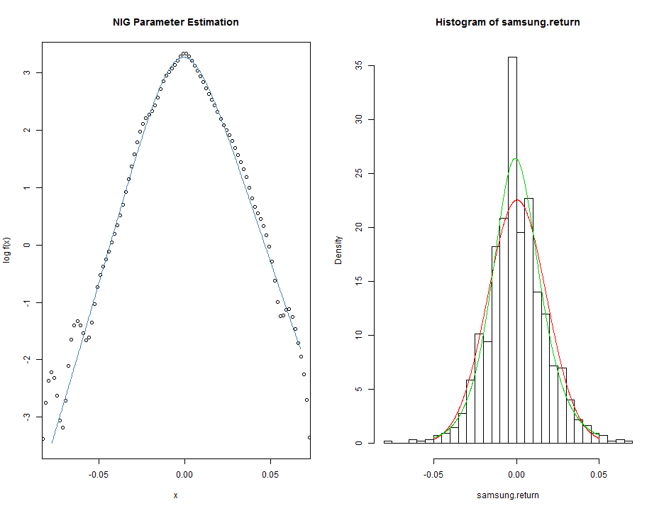
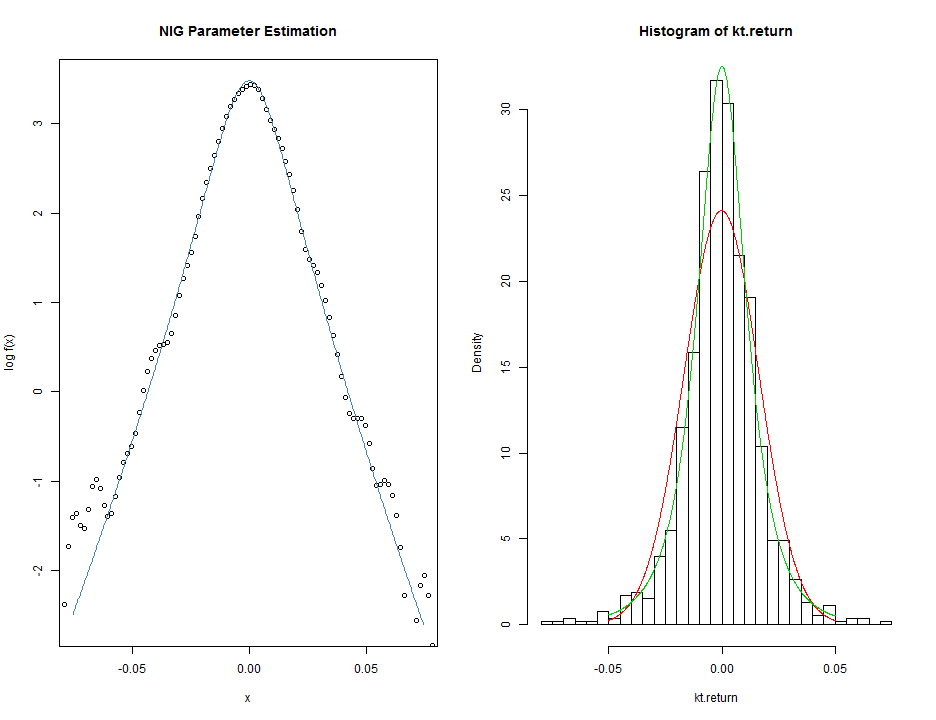
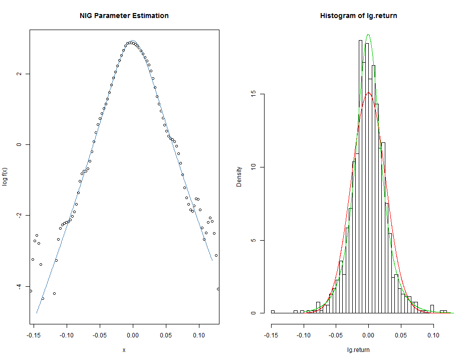
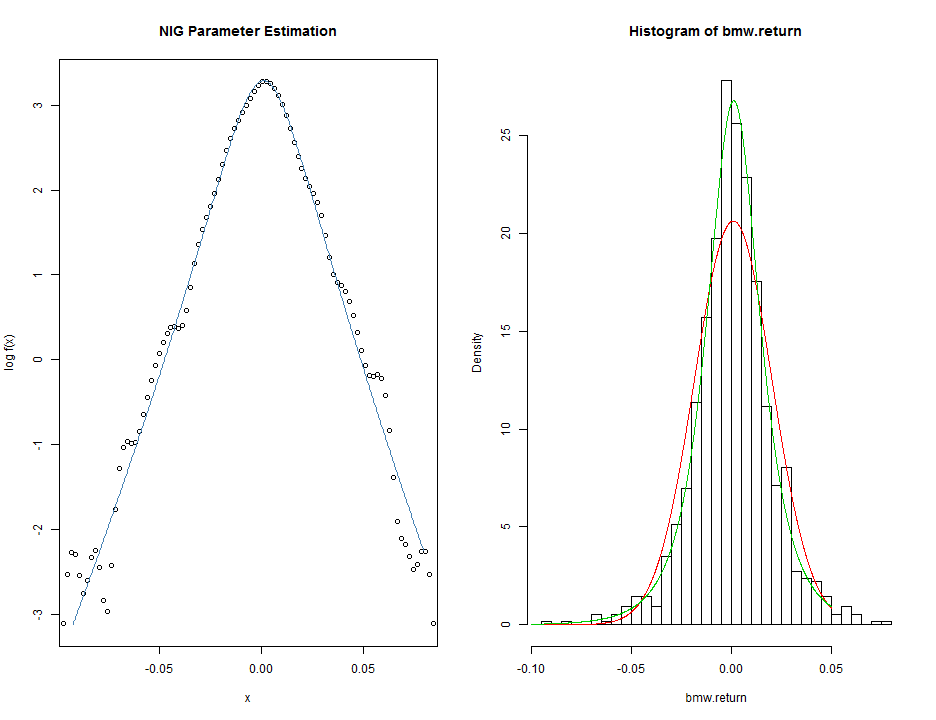
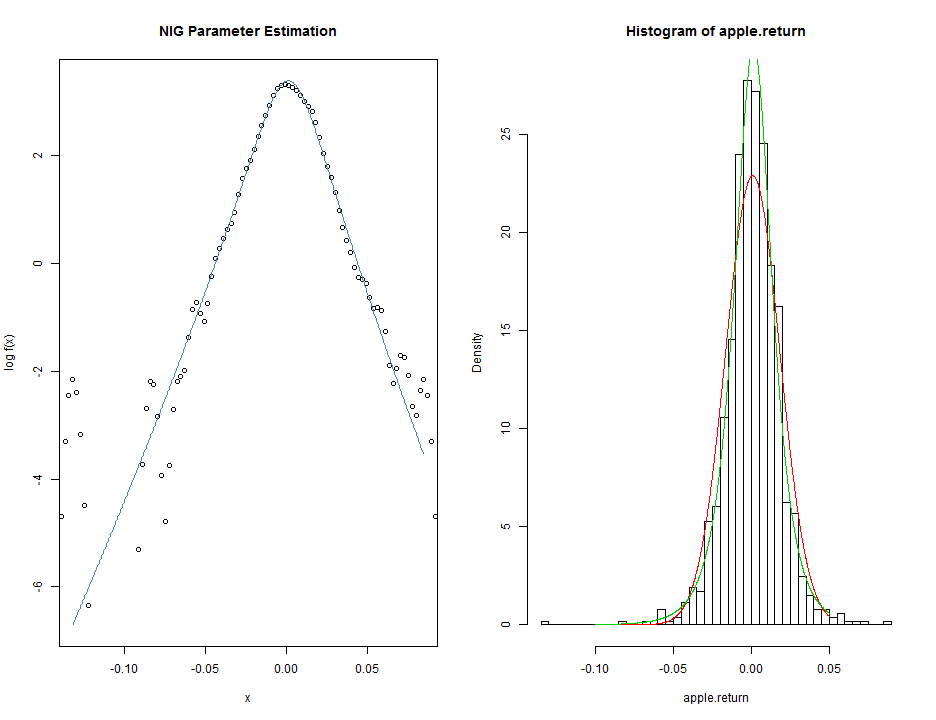

Assignment (Due to April. 2nd. 2014)
========================================================
200903877 황 성 윤
-------------------------
Genelarized Hyperbolic Distribution (Normal-Inverse Gaussian Distribution)
---------------------------------------------------------------------------

### 5개 기업에 대한 수익률 생성, 변동성 구하는 함수 작성 및 해당 패키지 설치


```r
dat.1 <- read.csv("C:/Users/user/Desktop/Sung-yoon.R/Mid-term Exam/Samsung eletronics/samsung_daily.csv", 
    sep = ",", header = T)
samsung <- dat.1$Close
samsung.return <- diff(log(samsung))
dat.2 <- read.csv("C:/Users/user/Desktop/Sung-yoon.R/Mid-term Exam/KT Corporation/kt_daily.csv", 
    sep = ",", header = T)
kt <- dat.2$Close
kt.return <- diff(log(kt))
dat.3 <- read.csv("C:/Users/user/Desktop/Sung-yoon.R/Mid-term Exam/LG Display Co., Ltd/lg_daily.csv", 
    sep = ",", header = T)
lg <- dat.3$Close
lg.return <- diff(log(lg))
dat.4 <- read.csv("C:/Users/user/Desktop/Sung-yoon.R/Mid-term Exam/BMW/BMW_daily.csv", 
    sep = ",", header = T)
bmw <- dat.4$Close
bmw.return <- diff(log(bmw))
dat.5 <- read.csv("C:/Users/user/Desktop/Sung-yoon.R/Mid-term Exam/Apple Inc/apple_daily.csv", 
    sep = ",", header = T)
apple <- dat.5$Close
apple.return <- diff(log(apple))
install.packages("fBasics")
```

```
## Error: trying to use CRAN without setting a mirror
```

```r
library(fBasics)
```

```
## Loading required package: MASS
## Loading required package: timeDate
## Loading required package: timeSeries
## 
## Attaching package: 'fBasics'
## 
## The following object is masked from 'package:base':
## 
##     norm
```

```r
nig.volatility <- function(alpha, beta, delta, mu) {
    gamma <- sqrt(alpha^2 - beta^2)
    ans <- sqrt(delta * alpha^2/gamma^3)
    return(ans)
}
```


### 5개의 자료에 대한 모수 추정 (Normal-Inverse Gaussian Distribution) 및 히스토그램과 그래프

#### 1. Samsung eletronics

```r
par(mfrow = c(1, 2))
nigFit(samsung.return)
```

```
## 
##  Objective Function Value:   -1526
##  Parameter Estimates:        1 0 1 0 
## 
##  Objective Function Value:   -1526
##  Parameter Estimates:        1 0 1 0 
## 
##  Objective Function Value:   -1526
##  Parameter Estimates:        1 1.49e-08 1 0 
## 
##  Objective Function Value:   -1526
##  Parameter Estimates:        1 0 1 0 
## 
##  Objective Function Value:   -1526
##  Parameter Estimates:        1 0 1 1.49e-08 
## 
##  Objective Function Value:   -2002
##  Parameter Estimates:        0.7437 0.4934 1.831 0.02262 
## 
##  Objective Function Value:   -1524
##  Parameter Estimates:        0.9744 0.04934 1.083 0.002262 
## 
##  Objective Function Value:   -1524
##  Parameter Estimates:        0.9744 0.04934 1.083 0.002262 
## 
##  Objective Function Value:   -1524
##  Parameter Estimates:        0.9744 0.0493 1.083 0.002262 
## 
##  Objective Function Value:   -1524
##  Parameter Estimates:        0.9744 0.04934 1.083 0.002262 
## 
##  Objective Function Value:   -1524
##  Parameter Estimates:        0.9744 0.04934 1.083 0.002225 
## 
##  Objective Function Value:   -1527
##  Parameter Estimates:        0.9917 0.01284 1.117 -0.08278 
## 
##  Objective Function Value:   -1523
##  Parameter Estimates:        0.9836 0.03053 1.082 -0.02552 
## 
##  Objective Function Value:   -1523
##  Parameter Estimates:        0.9836 0.03053 1.082 -0.02552 
## 
##  Objective Function Value:   -1523
##  Parameter Estimates:        0.9836 0.03053 1.082 -0.02552 
## 
##  Objective Function Value:   -1523
##  Parameter Estimates:        0.9836 0.03053 1.082 -0.02552 
## 
##  Objective Function Value:   -1523
##  Parameter Estimates:        0.9836 0.03053 1.082 -0.02552 
## 
##  Objective Function Value:   -1523
##  Parameter Estimates:        1.007 0.05591 1.085 -0.02506 
## 
##  Objective Function Value:   -1523
##  Parameter Estimates:        1.007 0.05591 1.085 -0.02506 
## 
##  Objective Function Value:   -1523
##  Parameter Estimates:        1.007 0.05591 1.085 -0.02506 
## 
##  Objective Function Value:   -1523
##  Parameter Estimates:        1.007 0.05591 1.085 -0.02506 
## 
##  Objective Function Value:   -1523
##  Parameter Estimates:        1.007 0.05591 1.085 -0.02506 
## 
##  Objective Function Value:   -1522
##  Parameter Estimates:        1.047 0.07103 1.12 -0.06811 
## 
##  Objective Function Value:   -1522
##  Parameter Estimates:        1.047 0.07103 1.12 -0.06811 
## 
##  Objective Function Value:   -1522
##  Parameter Estimates:        1.047 0.07103 1.12 -0.06811 
## 
##  Objective Function Value:   -1522
##  Parameter Estimates:        1.047 0.07103 1.12 -0.06811 
## 
##  Objective Function Value:   -1522
##  Parameter Estimates:        1.047 0.07103 1.12 -0.06811 
## 
##  Objective Function Value:   -1522
##  Parameter Estimates:        1.086 0.08902 1.173 -0.05904 
## 
##  Objective Function Value:   -1522
##  Parameter Estimates:        1.086 0.08902 1.173 -0.05904 
## 
##  Objective Function Value:   -1522
##  Parameter Estimates:        1.086 0.08902 1.173 -0.05904 
## 
##  Objective Function Value:   -1522
##  Parameter Estimates:        1.086 0.08902 1.173 -0.05904 
## 
##  Objective Function Value:   -1522
##  Parameter Estimates:        1.086 0.08902 1.173 -0.05904 
## 
##  Objective Function Value:   -1521
##  Parameter Estimates:        1.153 0.06937 1.174 -0.05137 
## 
##  Objective Function Value:   -1521
##  Parameter Estimates:        1.153 0.06937 1.174 -0.05137 
## 
##  Objective Function Value:   -1521
##  Parameter Estimates:        1.153 0.06937 1.174 -0.05137 
## 
##  Objective Function Value:   -1521
##  Parameter Estimates:        1.153 0.06937 1.174 -0.05137 
## 
##  Objective Function Value:   -1521
##  Parameter Estimates:        1.153 0.06937 1.174 -0.05137 
## 
##  Objective Function Value:   -1521
##  Parameter Estimates:        1.166 0.08209 1.237 -0.07433 
## 
##  Objective Function Value:   -1521
##  Parameter Estimates:        1.166 0.08209 1.237 -0.07433 
## 
##  Objective Function Value:   -1521
##  Parameter Estimates:        1.166 0.08209 1.237 -0.07433 
## 
##  Objective Function Value:   -1521
##  Parameter Estimates:        1.166 0.08209 1.237 -0.07433 
## 
##  Objective Function Value:   -1521
##  Parameter Estimates:        1.166 0.08209 1.237 -0.07433 
## 
##  Objective Function Value:   -1522
##  Parameter Estimates:        1.216 0.1268 1.25 -0.05985 
## 
##  Objective Function Value:   -1521
##  Parameter Estimates:        1.177 0.09389 1.231 -0.06496 
## 
##  Objective Function Value:   -1521
##  Parameter Estimates:        1.177 0.09389 1.231 -0.06496 
## 
##  Objective Function Value:   -1521
##  Parameter Estimates:        1.177 0.09388 1.231 -0.06496 
## 
##  Objective Function Value:   -1521
##  Parameter Estimates:        1.177 0.09389 1.231 -0.06496 
## 
##  Objective Function Value:   -1521
##  Parameter Estimates:        1.177 0.09389 1.231 -0.06496 
## 
##  Objective Function Value:   -1521
##  Parameter Estimates:        1.191 0.09054 1.232 -0.07864 
## 
##  Objective Function Value:   -1521
##  Parameter Estimates:        1.191 0.09054 1.232 -0.07864 
## 
##  Objective Function Value:   -1521
##  Parameter Estimates:        1.191 0.09054 1.232 -0.07864 
## 
##  Objective Function Value:   -1521
##  Parameter Estimates:        1.191 0.09054 1.232 -0.07864 
## 
##  Objective Function Value:   -1521
##  Parameter Estimates:        1.191 0.09054 1.232 -0.07863 
## 
##  Objective Function Value:   -1521
##  Parameter Estimates:        1.205 0.09692 1.244 -0.07556 
## 
##  Objective Function Value:   -1521
##  Parameter Estimates:        1.205 0.09692 1.244 -0.07556 
## 
##  Objective Function Value:   -1521
##  Parameter Estimates:        1.205 0.09691 1.244 -0.07556 
## 
##  Objective Function Value:   -1521
##  Parameter Estimates:        1.205 0.09692 1.244 -0.07556 
## 
##  Objective Function Value:   -1521
##  Parameter Estimates:        1.205 0.09692 1.244 -0.07556 
## 
##  Objective Function Value:   -1521
##  Parameter Estimates:        1.235 0.09549 1.269 -0.08155 
## 
##  Objective Function Value:   -1521
##  Parameter Estimates:        1.235 0.09549 1.269 -0.08155 
## 
##  Objective Function Value:   -1521
##  Parameter Estimates:        1.235 0.09549 1.269 -0.08155 
## 
##  Objective Function Value:   -1521
##  Parameter Estimates:        1.235 0.09549 1.269 -0.08155 
## 
##  Objective Function Value:   -1521
##  Parameter Estimates:        1.235 0.09549 1.269 -0.08155 
## 
##  Objective Function Value:   -1521
##  Parameter Estimates:        1.265 0.1501 1.284 -0.1281 
## 
##  Objective Function Value:   -1521
##  Parameter Estimates:        1.265 0.1501 1.284 -0.1281 
## 
##  Objective Function Value:   -1521
##  Parameter Estimates:        1.265 0.1501 1.284 -0.1281 
## 
##  Objective Function Value:   -1521
##  Parameter Estimates:        1.265 0.1501 1.284 -0.1281 
## 
##  Objective Function Value:   -1521
##  Parameter Estimates:        1.265 0.1501 1.284 -0.1281 
## 
##  Objective Function Value:   -1521
##  Parameter Estimates:        1.33 0.1367 1.306 -0.08973 
## 
##  Objective Function Value:   -1521
##  Parameter Estimates:        1.285 0.1414 1.281 -0.106 
## 
##  Objective Function Value:   -1521
##  Parameter Estimates:        1.285 0.1414 1.281 -0.106 
## 
##  Objective Function Value:   -1521
##  Parameter Estimates:        1.285 0.1414 1.281 -0.106 
## 
##  Objective Function Value:   -1521
##  Parameter Estimates:        1.285 0.1414 1.281 -0.106 
## 
##  Objective Function Value:   -1521
##  Parameter Estimates:        1.285 0.1414 1.281 -0.106 
## 
##  Objective Function Value:   -1520
##  Parameter Estimates:        1.304 0.1353 1.304 -0.1129 
## 
##  Objective Function Value:   -1520
##  Parameter Estimates:        1.304 0.1353 1.304 -0.1129 
## 
##  Objective Function Value:   -1520
##  Parameter Estimates:        1.304 0.1353 1.304 -0.1129 
## 
##  Objective Function Value:   -1520
##  Parameter Estimates:        1.304 0.1353 1.304 -0.1129 
## 
##  Objective Function Value:   -1520
##  Parameter Estimates:        1.304 0.1353 1.304 -0.1129 
## 
##  Objective Function Value:   -1520
##  Parameter Estimates:        1.321 0.1364 1.33 -0.1086 
## 
##  Objective Function Value:   -1520
##  Parameter Estimates:        1.321 0.1364 1.33 -0.1086 
## 
##  Objective Function Value:   -1520
##  Parameter Estimates:        1.321 0.1364 1.33 -0.1086 
## 
##  Objective Function Value:   -1520
##  Parameter Estimates:        1.321 0.1364 1.33 -0.1086 
## 
##  Objective Function Value:   -1520
##  Parameter Estimates:        1.321 0.1364 1.33 -0.1086 
## 
##  Objective Function Value:   -1520
##  Parameter Estimates:        1.321 0.1364 1.33 -0.1086 
## 
##  Objective Function Value:   -1520
##  Parameter Estimates:        1.346 0.1361 1.347 -0.113 
## 
##  Objective Function Value:   -1520
##  Parameter Estimates:        1.346 0.1361 1.347 -0.113 
## 
##  Objective Function Value:   -1520
##  Parameter Estimates:        1.346 0.1361 1.347 -0.113 
## 
##  Objective Function Value:   -1520
##  Parameter Estimates:        1.346 0.1361 1.347 -0.113 
## 
##  Objective Function Value:   -1520
##  Parameter Estimates:        1.346 0.1361 1.347 -0.113 
## 
##  Objective Function Value:   -1520
##  Parameter Estimates:        1.373 0.1376 1.363 -0.1119 
## 
##  Objective Function Value:   -1520
##  Parameter Estimates:        1.373 0.1376 1.363 -0.1119 
## 
##  Objective Function Value:   -1520
##  Parameter Estimates:        1.373 0.1376 1.363 -0.1119 
## 
##  Objective Function Value:   -1520
##  Parameter Estimates:        1.373 0.1376 1.363 -0.1119 
## 
##  Objective Function Value:   -1520
##  Parameter Estimates:        1.373 0.1376 1.363 -0.1119 
## 
##  Objective Function Value:   -1520
##  Parameter Estimates:        1.373 0.1376 1.363 -0.1119 
## 
##  Objective Function Value:   -1520
##  Parameter Estimates:        1.373 0.1376 1.363 -0.1119 
## 
##  Objective Function Value:   -1520
##  Parameter Estimates:        1.39 0.1283 1.386 -0.1053 
## 
##  Objective Function Value:   -1520
##  Parameter Estimates:        1.39 0.1283 1.386 -0.1053 
## 
##  Objective Function Value:   -1520
##  Parameter Estimates:        1.39 0.1283 1.386 -0.1053 
## 
##  Objective Function Value:   -1520
##  Parameter Estimates:        1.39 0.1283 1.386 -0.1053 
## 
##  Objective Function Value:   -1520
##  Parameter Estimates:        1.39 0.1283 1.386 -0.1053 
## 
##  Objective Function Value:   -1520
##  Parameter Estimates:        1.384 0.1287 1.378 -0.1052 
## 
##  Objective Function Value:   -1520
##  Parameter Estimates:        1.384 0.1287 1.378 -0.1052 
## 
##  Objective Function Value:   -1520
##  Parameter Estimates:        1.384 0.1287 1.378 -0.1052 
## 
##  Objective Function Value:   -1520
##  Parameter Estimates:        1.384 0.1287 1.378 -0.1052 
## 
##  Objective Function Value:   -1520
##  Parameter Estimates:        1.384 0.1287 1.378 -0.1052 
## 
##  Objective Function Value:   -1520
##  Parameter Estimates:        1.384 0.1287 1.378 -0.1052 
## 
##  Objective Function Value:   -1520
##  Parameter Estimates:        1.384 0.1287 1.378 -0.1052 
## 
##  Objective Function Value:   -1520
##  Parameter Estimates:        1.384 0.129 1.378 -0.1054 
## 
##  Objective Function Value:   -1520
##  Parameter Estimates:        1.384 0.129 1.378 -0.1054 
## 
##  Objective Function Value:   -1520
##  Parameter Estimates:        1.384 0.129 1.378 -0.1054 
## 
##  Objective Function Value:   -1520
##  Parameter Estimates:        1.384 0.129 1.378 -0.1054 
## 
##  Objective Function Value:   -1520
##  Parameter Estimates:        1.384 0.129 1.378 -0.1054 
## 
##  Objective Function Value:   -1520
##  Parameter Estimates:        1.384 0.129 1.378 -0.1054 
## 
##  Objective Function Value:   -1520
##  Parameter Estimates:        1.384 0.129 1.378 -0.1054 
## 
##  Objective Function Value:   -1520
##  Parameter Estimates:        1.384 0.129 1.378 -0.1054 
## 
##  Objective Function Value:   -1520
##  Parameter Estimates:        1.384 0.129 1.378 -0.1054 
## 
##  Objective Function Value:   -1520
##  Parameter Estimates:        1.384 0.129 1.378 -0.1054 
## 
##  Objective Function Value:   -1520
##  Parameter Estimates:        1.384 0.129 1.378 -0.1054 
## 
##  Objective Function Value:   -1520
##  Parameter Estimates:        1.384 0.129 1.378 -0.1054 
## 
##  Objective Function Value:   -1520
##  Parameter Estimates:        1.384 0.129 1.378 -0.1054 
## 
##  Objective Function Value:   -1520
##  Parameter Estimates:        1.384 0.1289 1.378 -0.1054 
## 
##  Objective Function Value:   -1520
##  Parameter Estimates:        1.384 0.129 1.378 -0.1054 
## 
##  Objective Function Value:   -1520
##  Parameter Estimates:        1.384 0.129 1.378 -0.1054 
## 
##  Objective Function Value:   -1520
##  Parameter Estimates:        1.384 0.129 1.378 -0.1053 
## 
##  Objective Function Value:   -1520
##  Parameter Estimates:        1.384 0.129 1.378 -0.1054 
## 
##  Objective Function Value:   -1520
##  Parameter Estimates:        1.384 0.129 1.378 -0.1054 
## 
##  Objective Function Value:   -1520
##  Parameter Estimates:        1.384 0.129 1.378 -0.1054 
## 
##  Objective Function Value:   -1520
##  Parameter Estimates:        1.384 0.129 1.378 -0.1054 
## 
##  Objective Function Value:   -1520
##  Parameter Estimates:        1.384 0.129 1.378 -0.1054 
## 
##  Objective Function Value:   -1520
##  Parameter Estimates:        1.384 0.1289 1.378 -0.1054 
## 
##  Objective Function Value:   -1520
##  Parameter Estimates:        1.384 0.129 1.378 -0.1054 
## 
##  Objective Function Value:   -1520
##  Parameter Estimates:        1.384 0.129 1.378 -0.1054 
## 
##  Objective Function Value:   -1520
##  Parameter Estimates:        1.384 0.129 1.378 -0.1053 
## 
##  Objective Function Value:   -1520
##  Parameter Estimates:        1.384 0.129 1.378 -0.1054 
## 
##  Objective Function Value:   -1520
##  Parameter Estimates:        1.384 0.129 1.378 -0.1054 
## 
##  Objective Function Value:   2857
##  Parameter Estimates:        78.24 7.288 0.02439 -0.001864
```

```
## Warning: NaN이 생성되었습니다
```

```
## 
## Title:
##  Normal Inverse Gaussian Parameter Estimation 
## 
## Call:
##  .nigFit.mle(x = x, alpha = alpha, beta = beta, delta = delta, 
##     mu = mu, scale = scale, doplot = doplot, span = span, trace = trace, 
##     title = title, description = description)
## 
## Model:
##  Normal Inverse Gaussian Distribution
## 
## Estimated Parameter(s):
##     alpha      beta     delta        mu 
## 78.239151  7.288384  0.024390 -0.001864 
## 
## Description:
##  Fri Apr 11 23:47:23 2014 by user: user
```

```r
hist(samsung.return, prob = T, nclass = 50)
x <- seq(from = -0.05, to = 0.05, by = 1e-04)
lines(x, dnorm(x, mean(samsung.return), sd(samsung.return)), col = 2)
lines(x, dnig(x, 78.239151023, 7.288384337, 0.024389717, -0.001864134), col = 3)
```

 

#### 2. KT corporation

```r
par(mfrow = c(1, 2))
nigFit(kt.return)
```

```
## 
##  Objective Function Value:   -1445
##  Parameter Estimates:        1 0 1 0 
## 
##  Objective Function Value:   -1445
##  Parameter Estimates:        1 0 1 0 
## 
##  Objective Function Value:   -1445
##  Parameter Estimates:        1 1.49e-08 1 0 
## 
##  Objective Function Value:   -1445
##  Parameter Estimates:        1 0 1 0 
## 
##  Objective Function Value:   -1445
##  Parameter Estimates:        1 0 1 1.49e-08 
## 
##  Objective Function Value:   -2352
##  Parameter Estimates:        1.097 -0.6549 0.4453 -0.504 
## 
##  Objective Function Value:   -1451
##  Parameter Estimates:        1.01 -0.06549 0.9445 -0.0504 
## 
##  Objective Function Value:   -1445
##  Parameter Estimates:        1.001 -0.008723 0.9926 -0.006713 
## 
##  Objective Function Value:   -1445
##  Parameter Estimates:        1.001 -0.008723 0.9926 -0.006713 
## 
##  Objective Function Value:   -1445
##  Parameter Estimates:        1.001 -0.008687 0.9926 -0.006713 
## 
##  Objective Function Value:   -1445
##  Parameter Estimates:        1.001 -0.008723 0.9926 -0.006713 
## 
##  Objective Function Value:   -1445
##  Parameter Estimates:        1.001 -0.008723 0.9926 -0.006677 
## 
##  Objective Function Value:   -1445
##  Parameter Estimates:        1.001 -0.006823 0.9825 0.001802 
## 
##  Objective Function Value:   -1445
##  Parameter Estimates:        1.001 -0.006823 0.9825 0.001802 
## 
##  Objective Function Value:   -1445
##  Parameter Estimates:        1.001 -0.006824 0.9825 0.001802 
## 
##  Objective Function Value:   -1445
##  Parameter Estimates:        1.001 -0.006823 0.9826 0.001802 
## 
##  Objective Function Value:   -1445
##  Parameter Estimates:        1.001 -0.006823 0.9825 0.001801 
## 
##  Objective Function Value:   -1445
##  Parameter Estimates:        0.9967 -0.01637 0.9761 -0.00312 
## 
##  Objective Function Value:   -1445
##  Parameter Estimates:        0.9967 -0.01637 0.9761 -0.00312 
## 
##  Objective Function Value:   -1445
##  Parameter Estimates:        0.9967 -0.01637 0.9761 -0.00312 
## 
##  Objective Function Value:   -1445
##  Parameter Estimates:        0.9967 -0.01637 0.9761 -0.00312 
## 
##  Objective Function Value:   -1445
##  Parameter Estimates:        0.9967 -0.01637 0.9761 -0.003119 
## 
##  Objective Function Value:   -1445
##  Parameter Estimates:        0.9873 -0.01601 0.9712 0.005037 
## 
##  Objective Function Value:   -1445
##  Parameter Estimates:        0.9874 -0.01601 0.9712 0.005037 
## 
##  Objective Function Value:   -1445
##  Parameter Estimates:        0.9873 -0.01601 0.9712 0.005037 
## 
##  Objective Function Value:   -1445
##  Parameter Estimates:        0.9873 -0.01601 0.9712 0.005037 
## 
##  Objective Function Value:   -1445
##  Parameter Estimates:        0.9873 -0.01601 0.9712 0.005036 
## 
##  Objective Function Value:   -1445
##  Parameter Estimates:        0.9654 -0.02332 0.9581 0.003768 
## 
##  Objective Function Value:   -1445
##  Parameter Estimates:        0.9654 -0.02332 0.9581 0.003768 
## 
##  Objective Function Value:   -1445
##  Parameter Estimates:        0.9654 -0.02332 0.9581 0.003768 
## 
##  Objective Function Value:   -1445
##  Parameter Estimates:        0.9654 -0.02332 0.9581 0.003768 
## 
##  Objective Function Value:   -1445
##  Parameter Estimates:        0.9654 -0.02332 0.9581 0.003769 
## 
##  Objective Function Value:   -1445
##  Parameter Estimates:        0.9395 3.204e-06 0.9192 -0.006903 
## 
##  Objective Function Value:   -1445
##  Parameter Estimates:        0.9545 -0.01137 0.9408 0.002805 
## 
##  Objective Function Value:   -1445
##  Parameter Estimates:        0.9545 -0.01137 0.9408 0.002805 
## 
##  Objective Function Value:   -1445
##  Parameter Estimates:        0.9545 -0.01137 0.9408 0.002805 
## 
##  Objective Function Value:   -1445
##  Parameter Estimates:        0.9545 -0.01137 0.9409 0.002805 
## 
##  Objective Function Value:   -1445
##  Parameter Estimates:        0.9545 -0.01137 0.9408 0.002803 
## 
##  Objective Function Value:   -1445
##  Parameter Estimates:        0.9309 -0.01269 0.9409 0.002202 
## 
##  Objective Function Value:   -1445
##  Parameter Estimates:        0.9309 -0.01269 0.9409 0.002202 
## 
##  Objective Function Value:   -1445
##  Parameter Estimates:        0.9309 -0.01269 0.9409 0.002202 
## 
##  Objective Function Value:   -1445
##  Parameter Estimates:        0.9309 -0.01269 0.9409 0.002202 
## 
##  Objective Function Value:   -1445
##  Parameter Estimates:        0.9309 -0.01269 0.9409 0.002203 
## 
##  Objective Function Value:   -1445
##  Parameter Estimates:        0.9383 -0.02409 0.9222 -0.002603 
## 
##  Objective Function Value:   -1445
##  Parameter Estimates:        0.9331 -0.01608 0.9354 0.0007755 
## 
##  Objective Function Value:   -1445
##  Parameter Estimates:        0.9331 -0.01608 0.9354 0.0007755 
## 
##  Objective Function Value:   -1445
##  Parameter Estimates:        0.9331 -0.01607 0.9354 0.0007755 
## 
##  Objective Function Value:   -1445
##  Parameter Estimates:        0.9331 -0.01608 0.9354 0.0007755 
## 
##  Objective Function Value:   -1445
##  Parameter Estimates:        0.9331 -0.01608 0.9354 0.0007795 
## 
##  Objective Function Value:   -1445
##  Parameter Estimates:        0.9331 -0.0137 0.9324 0.006666 
## 
##  Objective Function Value:   -1445
##  Parameter Estimates:        0.9331 -0.01517 0.9343 0.003012 
## 
##  Objective Function Value:   -1445
##  Parameter Estimates:        0.9332 -0.01517 0.9343 0.003012 
## 
##  Objective Function Value:   -1445
##  Parameter Estimates:        0.9331 -0.01517 0.9343 0.003012 
## 
##  Objective Function Value:   -1445
##  Parameter Estimates:        0.9331 -0.01517 0.9343 0.003012 
## 
##  Objective Function Value:   -1445
##  Parameter Estimates:        0.9331 -0.01517 0.9343 0.003012 
## 
##  Objective Function Value:   -1445
##  Parameter Estimates:        0.9331 -0.01517 0.9343 0.00301 
## 
##  Objective Function Value:   -1445
##  Parameter Estimates:        0.9327 -0.01712 0.9325 0.002915 
## 
##  Objective Function Value:   -1445
##  Parameter Estimates:        0.9327 -0.01712 0.9325 0.002915 
## 
##  Objective Function Value:   -1445
##  Parameter Estimates:        0.9327 -0.01712 0.9325 0.002915 
## 
##  Objective Function Value:   -1445
##  Parameter Estimates:        0.9327 -0.01712 0.9325 0.002915 
## 
##  Objective Function Value:   -1445
##  Parameter Estimates:        0.9327 -0.01712 0.9325 0.002919 
## 
##  Objective Function Value:   -1445
##  Parameter Estimates:        0.9327 -0.01712 0.9325 0.002912 
## 
##  Objective Function Value:   -1445
##  Parameter Estimates:        0.9304 -0.01928 0.9314 0.007091 
## 
##  Objective Function Value:   -1445
##  Parameter Estimates:        0.9305 -0.01928 0.9314 0.007091 
## 
##  Objective Function Value:   -1445
##  Parameter Estimates:        0.9304 -0.01928 0.9314 0.007091 
## 
##  Objective Function Value:   -1445
##  Parameter Estimates:        0.9304 -0.01929 0.9314 0.007091 
## 
##  Objective Function Value:   -1445
##  Parameter Estimates:        0.9304 -0.01928 0.9314 0.007091 
## 
##  Objective Function Value:   -1445
##  Parameter Estimates:        0.9304 -0.01928 0.9314 0.00709 
## 
##  Objective Function Value:   -1445
##  Parameter Estimates:        0.9264 -0.01921 0.9286 0.005061 
## 
##  Objective Function Value:   -1445
##  Parameter Estimates:        0.9264 -0.01921 0.9286 0.005061 
## 
##  Objective Function Value:   -1445
##  Parameter Estimates:        0.9264 -0.01921 0.9286 0.005061 
## 
##  Objective Function Value:   -1445
##  Parameter Estimates:        0.9264 -0.01921 0.9286 0.005061 
## 
##  Objective Function Value:   -1445
##  Parameter Estimates:        0.9264 -0.01921 0.9286 0.005062 
## 
##  Objective Function Value:   -1445
##  Parameter Estimates:        0.9226 -0.01686 0.9258 0.004761 
## 
##  Objective Function Value:   -1445
##  Parameter Estimates:        0.9226 -0.01686 0.9258 0.004761 
## 
##  Objective Function Value:   -1445
##  Parameter Estimates:        0.9226 -0.01686 0.9258 0.004761 
## 
##  Objective Function Value:   -1445
##  Parameter Estimates:        0.9226 -0.01686 0.9258 0.004761 
## 
##  Objective Function Value:   -1445
##  Parameter Estimates:        0.9226 -0.01686 0.9258 0.00476 
## 
##  Objective Function Value:   -1445
##  Parameter Estimates:        0.9191 -0.02016 0.9246 0.006797 
## 
##  Objective Function Value:   -1445
##  Parameter Estimates:        0.9191 -0.02016 0.9246 0.006797 
## 
##  Objective Function Value:   -1445
##  Parameter Estimates:        0.9191 -0.02016 0.9246 0.006797 
## 
##  Objective Function Value:   -1445
##  Parameter Estimates:        0.9191 -0.02016 0.9246 0.006797 
## 
##  Objective Function Value:   -1445
##  Parameter Estimates:        0.9191 -0.02016 0.9246 0.006799 
## 
##  Objective Function Value:   -1445
##  Parameter Estimates:        0.9183 -0.02027 0.9203 0.003715 
## 
##  Objective Function Value:   -1445
##  Parameter Estimates:        0.9195 -0.02047 0.9236 0.006256 
## 
##  Objective Function Value:   -1445
##  Parameter Estimates:        0.9195 -0.02047 0.9236 0.006256 
## 
##  Objective Function Value:   -1445
##  Parameter Estimates:        0.9195 -0.02047 0.9236 0.006256 
## 
##  Objective Function Value:   -1445
##  Parameter Estimates:        0.9195 -0.02047 0.9236 0.006256 
## 
##  Objective Function Value:   -1445
##  Parameter Estimates:        0.9195 -0.02047 0.9236 0.006256 
## 
##  Objective Function Value:   -1445
##  Parameter Estimates:        0.9195 -0.02047 0.9236 0.006258 
## 
##  Objective Function Value:   -1445
##  Parameter Estimates:        0.9186 -0.01993 0.9231 0.006311 
## 
##  Objective Function Value:   -1445
##  Parameter Estimates:        0.9187 -0.01993 0.9231 0.006311 
## 
##  Objective Function Value:   -1445
##  Parameter Estimates:        0.9186 -0.01993 0.9231 0.006311 
## 
##  Objective Function Value:   -1445
##  Parameter Estimates:        0.9186 -0.01993 0.9231 0.006311 
## 
##  Objective Function Value:   -1445
##  Parameter Estimates:        0.9186 -0.01993 0.9231 0.006311 
## 
##  Objective Function Value:   -1445
##  Parameter Estimates:        0.9186 -0.01993 0.9231 0.006311 
## 
##  Objective Function Value:   -1445
##  Parameter Estimates:        0.9186 -0.01993 0.9231 0.00631 
## 
##  Objective Function Value:   -1445
##  Parameter Estimates:        0.9178 -0.01967 0.9224 0.005951 
## 
##  Objective Function Value:   -1445
##  Parameter Estimates:        0.9178 -0.01967 0.9224 0.005951 
## 
##  Objective Function Value:   -1445
##  Parameter Estimates:        0.9178 -0.01967 0.9224 0.005951 
## 
##  Objective Function Value:   -1445
##  Parameter Estimates:        0.9178 -0.01966 0.9224 0.005951 
## 
##  Objective Function Value:   -1445
##  Parameter Estimates:        0.9178 -0.01968 0.9224 0.005951 
## 
##  Objective Function Value:   -1445
##  Parameter Estimates:        0.9178 -0.01967 0.9224 0.005951 
## 
##  Objective Function Value:   -1445
##  Parameter Estimates:        0.9178 -0.01967 0.9224 0.005951 
## 
##  Objective Function Value:   -1445
##  Parameter Estimates:        0.9178 -0.01967 0.9224 0.005959 
## 
##  Objective Function Value:   -1445
##  Parameter Estimates:        0.9178 -0.01967 0.9224 0.005942 
## 
##  Objective Function Value:   -1445
##  Parameter Estimates:        0.9176 -0.02021 0.9215 0.006427 
## 
##  Objective Function Value:   -1445
##  Parameter Estimates:        0.9177 -0.01985 0.922 0.00618 
## 
##  Objective Function Value:   -1445
##  Parameter Estimates:        0.9178 -0.01985 0.922 0.00618 
## 
##  Objective Function Value:   -1445
##  Parameter Estimates:        0.9177 -0.01985 0.922 0.00618 
## 
##  Objective Function Value:   -1445
##  Parameter Estimates:        0.9177 -0.01985 0.922 0.00618 
## 
##  Objective Function Value:   -1445
##  Parameter Estimates:        0.9177 -0.01985 0.922 0.00618 
## 
##  Objective Function Value:   -1445
##  Parameter Estimates:        0.9177 -0.01985 0.922 0.00618 
## 
##  Objective Function Value:   -1445
##  Parameter Estimates:        0.9177 -0.01985 0.922 0.00618 
## 
##  Objective Function Value:   -1445
##  Parameter Estimates:        0.9177 -0.01985 0.922 0.006181 
## 
##  Objective Function Value:   -1445
##  Parameter Estimates:        0.9177 -0.01985 0.922 0.006178 
## 
##  Objective Function Value:   -1445
##  Parameter Estimates:        0.9173 -0.01981 0.9219 0.006252 
## 
##  Objective Function Value:   -1445
##  Parameter Estimates:        0.9173 -0.01981 0.9219 0.006252 
## 
##  Objective Function Value:   -1445
##  Parameter Estimates:        0.9173 -0.01981 0.9219 0.006252 
## 
##  Objective Function Value:   -1445
##  Parameter Estimates:        0.9173 -0.0198 0.9219 0.006252 
## 
##  Objective Function Value:   -1445
##  Parameter Estimates:        0.9173 -0.01982 0.9219 0.006252 
## 
##  Objective Function Value:   -1445
##  Parameter Estimates:        0.9173 -0.01981 0.9219 0.006252 
## 
##  Objective Function Value:   -1445
##  Parameter Estimates:        0.9173 -0.01981 0.9219 0.006252 
## 
##  Objective Function Value:   -1445
##  Parameter Estimates:        0.9173 -0.01981 0.9219 0.006257 
## 
##  Objective Function Value:   -1445
##  Parameter Estimates:        0.9173 -0.01981 0.9219 0.006247 
## 
##  Objective Function Value:   -1445
##  Parameter Estimates:        0.9169 -0.01988 0.9217 0.006247 
## 
##  Objective Function Value:   -1445
##  Parameter Estimates:        0.9169 -0.01988 0.9217 0.006247 
## 
##  Objective Function Value:   -1445
##  Parameter Estimates:        0.9169 -0.01988 0.9217 0.006247 
## 
##  Objective Function Value:   -1445
##  Parameter Estimates:        0.9169 -0.01988 0.9217 0.006247 
## 
##  Objective Function Value:   -1445
##  Parameter Estimates:        0.9169 -0.01988 0.9217 0.006247 
## 
##  Objective Function Value:   -1445
##  Parameter Estimates:        0.9169 -0.01988 0.9217 0.006247 
## 
##  Objective Function Value:   -1445
##  Parameter Estimates:        0.9169 -0.01988 0.9216 0.006247 
## 
##  Objective Function Value:   -1445
##  Parameter Estimates:        0.9169 -0.01988 0.9217 0.006251 
## 
##  Objective Function Value:   -1445
##  Parameter Estimates:        0.9169 -0.01988 0.9217 0.006244 
## 
##  Objective Function Value:   -1445
##  Parameter Estimates:        0.9169 -0.01987 0.9216 0.006238 
## 
##  Objective Function Value:   -1445
##  Parameter Estimates:        0.9169 -0.01987 0.9216 0.006238 
## 
##  Objective Function Value:   -1445
##  Parameter Estimates:        0.9168 -0.01987 0.9216 0.006238 
## 
##  Objective Function Value:   -1445
##  Parameter Estimates:        0.9169 -0.01985 0.9216 0.006238 
## 
##  Objective Function Value:   -1445
##  Parameter Estimates:        0.9169 -0.0199 0.9216 0.006238 
## 
##  Objective Function Value:   -1445
##  Parameter Estimates:        0.9169 -0.01987 0.9216 0.006238 
## 
##  Objective Function Value:   -1445
##  Parameter Estimates:        0.9169 -0.01987 0.9216 0.006238 
## 
##  Objective Function Value:   -1445
##  Parameter Estimates:        0.9169 -0.01987 0.9216 0.006255 
## 
##  Objective Function Value:   -1445
##  Parameter Estimates:        0.9169 -0.01987 0.9216 0.006221 
## 
##  Objective Function Value:   -1445
##  Parameter Estimates:        0.9169 -0.01987 0.9216 0.006238 
## 
##  Objective Function Value:   2907
##  Parameter Estimates:        55.41 -1.201 0.01525 0.0001032
```

```
## Warning: NaN이 생성되었습니다
```

```
## 
## Title:
##  Normal Inverse Gaussian Parameter Estimation 
## 
## Call:
##  .nigFit.mle(x = x, alpha = alpha, beta = beta, delta = delta, 
##     mu = mu, scale = scale, doplot = doplot, span = span, trace = trace, 
##     title = title, description = description)
## 
## Model:
##  Normal Inverse Gaussian Distribution
## 
## Estimated Parameter(s):
##      alpha       beta      delta         mu 
## 55.4120323 -1.2010780  0.0152491  0.0001032 
## 
## Description:
##  Fri Apr 11 23:47:23 2014 by user: user
```

```r
hist(kt.return, prob = T, nclass = 50)
x <- seq(from = -0.05, to = 0.05, by = 1e-04)
lines(x, dnorm(x, mean(kt.return), sd(kt.return)), col = 2)
lines(x, dnig(x, 55.4120323065, -1.2010779678, 0.0152491054, 0.0001032147), 
    col = 3)
```

 

#### 3. LG Display Co., Ltd

```r
par(mfrow = c(1, 2))
nigFit(lg.return)
```

```
## 
##  Objective Function Value:   -1459
##  Parameter Estimates:        1 0 1 0 
## 
##  Objective Function Value:   -1459
##  Parameter Estimates:        1 0 1 0 
## 
##  Objective Function Value:   -1459
##  Parameter Estimates:        1 1.49e-08 1 0 
## 
##  Objective Function Value:   -1459
##  Parameter Estimates:        1 0 1 0 
## 
##  Objective Function Value:   -1459
##  Parameter Estimates:        1 0 1 1.49e-08 
## 
##  Objective Function Value:   -2327
##  Parameter Estimates:        0.9387 -0.4512 1.385 -0.8028 
## 
##  Objective Function Value:   -1466
##  Parameter Estimates:        0.9939 -0.04512 1.038 -0.08028 
## 
##  Objective Function Value:   -1459
##  Parameter Estimates:        0.9989 -0.007874 1.007 -0.01401 
## 
##  Objective Function Value:   -1459
##  Parameter Estimates:        0.999 -0.007874 1.007 -0.01401 
## 
##  Objective Function Value:   -1459
##  Parameter Estimates:        0.9989 -0.007838 1.007 -0.01401 
## 
##  Objective Function Value:   -1459
##  Parameter Estimates:        0.9989 -0.007874 1.007 -0.01401 
## 
##  Objective Function Value:   -1459
##  Parameter Estimates:        0.9989 -0.007874 1.007 -0.01397 
## 
##  Objective Function Value:   -1459
##  Parameter Estimates:        0.9991 0.003348 1.02 -0.01347 
## 
##  Objective Function Value:   -1459
##  Parameter Estimates:        0.9991 0.003348 1.02 -0.01347 
## 
##  Objective Function Value:   -1459
##  Parameter Estimates:        0.9991 0.003346 1.02 -0.01347 
## 
##  Objective Function Value:   -1459
##  Parameter Estimates:        0.9991 0.003348 1.02 -0.01347 
## 
##  Objective Function Value:   -1459
##  Parameter Estimates:        0.9991 0.003348 1.02 -0.01347 
## 
##  Objective Function Value:   -1459
##  Parameter Estimates:        0.9991 0.003348 1.02 -0.01347 
## 
##  Objective Function Value:   -1459
##  Parameter Estimates:        1.006 0.0003497 1.025 -0.02826 
## 
##  Objective Function Value:   -1459
##  Parameter Estimates:        1.006 0.0003497 1.025 -0.02826 
## 
##  Objective Function Value:   -1459
##  Parameter Estimates:        1.006 0.0003511 1.025 -0.02826 
## 
##  Objective Function Value:   -1459
##  Parameter Estimates:        1.006 0.0003497 1.025 -0.02826 
## 
##  Objective Function Value:   -1459
##  Parameter Estimates:        1.006 0.0003497 1.025 -0.02826 
## 
##  Objective Function Value:   -1459
##  Parameter Estimates:        1.018 0.01281 1.029 -0.02678 
## 
##  Objective Function Value:   -1459
##  Parameter Estimates:        1.018 0.01281 1.029 -0.02678 
## 
##  Objective Function Value:   -1459
##  Parameter Estimates:        1.018 0.01281 1.029 -0.02678 
## 
##  Objective Function Value:   -1459
##  Parameter Estimates:        1.018 0.01281 1.029 -0.02678 
## 
##  Objective Function Value:   -1459
##  Parameter Estimates:        1.018 0.01281 1.029 -0.02679 
## 
##  Objective Function Value:   -1459
##  Parameter Estimates:        1.029 0.01305 1.04 -0.03466 
## 
##  Objective Function Value:   -1459
##  Parameter Estimates:        1.029 0.01305 1.04 -0.03466 
## 
##  Objective Function Value:   -1459
##  Parameter Estimates:        1.029 0.01306 1.04 -0.03466 
## 
##  Objective Function Value:   -1459
##  Parameter Estimates:        1.029 0.01305 1.04 -0.03466 
## 
##  Objective Function Value:   -1459
##  Parameter Estimates:        1.029 0.01305 1.04 -0.03466 
## 
##  Objective Function Value:   -1459
##  Parameter Estimates:        1.057 0.01391 1.059 -0.0258 
## 
##  Objective Function Value:   -1459
##  Parameter Estimates:        1.057 0.01391 1.059 -0.0258 
## 
##  Objective Function Value:   -1459
##  Parameter Estimates:        1.057 0.01391 1.059 -0.0258 
## 
##  Objective Function Value:   -1459
##  Parameter Estimates:        1.057 0.01391 1.059 -0.0258 
## 
##  Objective Function Value:   -1459
##  Parameter Estimates:        1.057 0.01391 1.059 -0.0258 
## 
##  Objective Function Value:   -1459
##  Parameter Estimates:        1.082 0.0283 1.063 -0.04491 
## 
##  Objective Function Value:   -1459
##  Parameter Estimates:        1.068 0.01915 1.062 -0.03689 
## 
##  Objective Function Value:   -1459
##  Parameter Estimates:        1.068 0.01915 1.062 -0.03689 
## 
##  Objective Function Value:   -1459
##  Parameter Estimates:        1.068 0.01915 1.062 -0.03689 
## 
##  Objective Function Value:   -1459
##  Parameter Estimates:        1.068 0.01915 1.062 -0.03689 
## 
##  Objective Function Value:   -1459
##  Parameter Estimates:        1.068 0.01915 1.062 -0.03688 
## 
##  Objective Function Value:   -1459
##  Parameter Estimates:        1.065 0.01984 1.078 -0.03582 
## 
##  Objective Function Value:   -1459
##  Parameter Estimates:        1.065 0.01984 1.078 -0.03582 
## 
##  Objective Function Value:   -1459
##  Parameter Estimates:        1.065 0.01983 1.078 -0.03582 
## 
##  Objective Function Value:   -1459
##  Parameter Estimates:        1.065 0.01984 1.078 -0.03582 
## 
##  Objective Function Value:   -1459
##  Parameter Estimates:        1.065 0.01984 1.078 -0.03583 
## 
##  Objective Function Value:   -1459
##  Parameter Estimates:        1.071 0.02189 1.073 -0.03424 
## 
##  Objective Function Value:   -1459
##  Parameter Estimates:        1.071 0.02189 1.073 -0.03424 
## 
##  Objective Function Value:   -1459
##  Parameter Estimates:        1.071 0.02188 1.073 -0.03424 
## 
##  Objective Function Value:   -1459
##  Parameter Estimates:        1.071 0.02189 1.073 -0.03424 
## 
##  Objective Function Value:   -1459
##  Parameter Estimates:        1.071 0.02189 1.073 -0.03424 
## 
##  Objective Function Value:   -1459
##  Parameter Estimates:        1.074 0.01667 1.074 -0.04002 
## 
##  Objective Function Value:   -1459
##  Parameter Estimates:        1.072 0.02069 1.073 -0.03587 
## 
##  Objective Function Value:   -1459
##  Parameter Estimates:        1.072 0.02069 1.073 -0.03587 
## 
##  Objective Function Value:   -1459
##  Parameter Estimates:        1.072 0.02069 1.073 -0.03587 
## 
##  Objective Function Value:   -1459
##  Parameter Estimates:        1.072 0.02069 1.073 -0.03587 
## 
##  Objective Function Value:   -1459
##  Parameter Estimates:        1.072 0.02069 1.073 -0.03587 
## 
##  Objective Function Value:   -1459
##  Parameter Estimates:        1.072 0.02069 1.073 -0.03587 
## 
##  Objective Function Value:   -1459
##  Parameter Estimates:        1.073 0.02168 1.074 -0.03545 
## 
##  Objective Function Value:   -1459
##  Parameter Estimates:        1.073 0.02168 1.074 -0.03545 
## 
##  Objective Function Value:   -1459
##  Parameter Estimates:        1.073 0.02168 1.074 -0.03545 
## 
##  Objective Function Value:   -1459
##  Parameter Estimates:        1.073 0.02168 1.074 -0.03545 
## 
##  Objective Function Value:   -1459
##  Parameter Estimates:        1.073 0.02168 1.074 -0.03545 
## 
##  Objective Function Value:   -1459
##  Parameter Estimates:        1.073 0.02168 1.074 -0.03545 
## 
##  Objective Function Value:   -1459
##  Parameter Estimates:        1.076 0.01949 1.076 -0.03508 
## 
##  Objective Function Value:   -1459
##  Parameter Estimates:        1.076 0.01949 1.076 -0.03508 
## 
##  Objective Function Value:   -1459
##  Parameter Estimates:        1.076 0.01949 1.076 -0.03508 
## 
##  Objective Function Value:   -1459
##  Parameter Estimates:        1.076 0.01949 1.076 -0.03508 
## 
##  Objective Function Value:   -1459
##  Parameter Estimates:        1.076 0.01949 1.076 -0.03508 
## 
##  Objective Function Value:   -1459
##  Parameter Estimates:        1.082 0.02262 1.081 -0.03671 
## 
##  Objective Function Value:   -1459
##  Parameter Estimates:        1.082 0.02262 1.081 -0.03671 
## 
##  Objective Function Value:   -1459
##  Parameter Estimates:        1.082 0.02262 1.081 -0.03671 
## 
##  Objective Function Value:   -1459
##  Parameter Estimates:        1.082 0.02262 1.081 -0.03671 
## 
##  Objective Function Value:   -1459
##  Parameter Estimates:        1.082 0.02262 1.081 -0.03671 
## 
##  Objective Function Value:   -1459
##  Parameter Estimates:        1.088 0.01854 1.084 -0.03303 
## 
##  Objective Function Value:   -1459
##  Parameter Estimates:        1.088 0.01854 1.084 -0.03303 
## 
##  Objective Function Value:   -1459
##  Parameter Estimates:        1.088 0.01854 1.084 -0.03303 
## 
##  Objective Function Value:   -1459
##  Parameter Estimates:        1.088 0.01854 1.084 -0.03303 
## 
##  Objective Function Value:   -1459
##  Parameter Estimates:        1.088 0.01854 1.084 -0.03303 
## 
##  Objective Function Value:   -1459
##  Parameter Estimates:        1.088 0.01854 1.084 -0.03303 
## 
##  Objective Function Value:   -1459
##  Parameter Estimates:        1.088 0.01854 1.084 -0.03302 
## 
##  Objective Function Value:   -1459
##  Parameter Estimates:        1.091 0.01887 1.086 -0.04089 
## 
##  Objective Function Value:   -1459
##  Parameter Estimates:        1.088 0.01859 1.084 -0.03414 
## 
##  Objective Function Value:   -1459
##  Parameter Estimates:        1.088 0.01859 1.084 -0.03414 
## 
##  Objective Function Value:   -1459
##  Parameter Estimates:        1.088 0.01859 1.084 -0.03414 
## 
##  Objective Function Value:   -1459
##  Parameter Estimates:        1.088 0.01858 1.084 -0.03414 
## 
##  Objective Function Value:   -1459
##  Parameter Estimates:        1.088 0.01859 1.084 -0.03414 
## 
##  Objective Function Value:   -1459
##  Parameter Estimates:        1.088 0.01859 1.084 -0.03414 
## 
##  Objective Function Value:   -1459
##  Parameter Estimates:        1.089 0.01961 1.085 -0.03406 
## 
##  Objective Function Value:   -1459
##  Parameter Estimates:        1.089 0.01961 1.085 -0.03406 
## 
##  Objective Function Value:   -1459
##  Parameter Estimates:        1.089 0.01961 1.085 -0.03406 
## 
##  Objective Function Value:   -1459
##  Parameter Estimates:        1.089 0.01961 1.085 -0.03406 
## 
##  Objective Function Value:   -1459
##  Parameter Estimates:        1.089 0.01961 1.085 -0.03405 
## 
##  Objective Function Value:   -1459
##  Parameter Estimates:        1.089 0.01961 1.085 -0.03406 
## 
##  Objective Function Value:   -1459
##  Parameter Estimates:        1.091 0.02024 1.085 -0.03529 
## 
##  Objective Function Value:   -1459
##  Parameter Estimates:        1.091 0.02024 1.085 -0.03529 
## 
##  Objective Function Value:   -1459
##  Parameter Estimates:        1.091 0.02025 1.085 -0.03529 
## 
##  Objective Function Value:   -1459
##  Parameter Estimates:        1.091 0.02023 1.085 -0.03529 
## 
##  Objective Function Value:   -1459
##  Parameter Estimates:        1.091 0.02024 1.085 -0.03529 
## 
##  Objective Function Value:   -1459
##  Parameter Estimates:        1.091 0.02024 1.085 -0.03529 
## 
##  Objective Function Value:   -1459
##  Parameter Estimates:        1.094 0.02092 1.089 -0.03605 
## 
##  Objective Function Value:   -1459
##  Parameter Estimates:        1.094 0.02092 1.089 -0.03605 
## 
##  Objective Function Value:   -1459
##  Parameter Estimates:        1.094 0.02092 1.089 -0.03605 
## 
##  Objective Function Value:   -1459
##  Parameter Estimates:        1.094 0.02092 1.089 -0.03605 
## 
##  Objective Function Value:   -1459
##  Parameter Estimates:        1.094 0.02092 1.089 -0.03605 
## 
##  Objective Function Value:   -1459
##  Parameter Estimates:        1.094 0.02092 1.089 -0.03605 
## 
##  Objective Function Value:   -1459
##  Parameter Estimates:        1.094 0.02092 1.089 -0.03605 
## 
##  Objective Function Value:   -1459
##  Parameter Estimates:        1.098 0.02239 1.091 -0.03684 
## 
##  Objective Function Value:   -1459
##  Parameter Estimates:        1.098 0.02239 1.091 -0.03684 
## 
##  Objective Function Value:   -1459
##  Parameter Estimates:        1.098 0.02239 1.091 -0.03684 
## 
##  Objective Function Value:   -1459
##  Parameter Estimates:        1.098 0.02239 1.091 -0.03684 
## 
##  Objective Function Value:   -1459
##  Parameter Estimates:        1.098 0.02239 1.091 -0.03684 
## 
##  Objective Function Value:   -1459
##  Parameter Estimates:        1.098 0.02239 1.091 -0.03684 
## 
##  Objective Function Value:   -1459
##  Parameter Estimates:        1.098 0.02239 1.091 -0.03684 
## 
##  Objective Function Value:   -1459
##  Parameter Estimates:        1.1 0.02324 1.093 -0.0376 
## 
##  Objective Function Value:   -1459
##  Parameter Estimates:        1.1 0.02324 1.093 -0.0376 
## 
##  Objective Function Value:   -1459
##  Parameter Estimates:        1.1 0.02324 1.093 -0.0376 
## 
##  Objective Function Value:   -1459
##  Parameter Estimates:        1.1 0.02325 1.093 -0.0376 
## 
##  Objective Function Value:   -1459
##  Parameter Estimates:        1.1 0.02324 1.093 -0.0376 
## 
##  Objective Function Value:   -1459
##  Parameter Estimates:        1.1 0.02324 1.093 -0.0376 
## 
##  Objective Function Value:   -1459
##  Parameter Estimates:        1.1 0.02324 1.093 -0.0376 
## 
##  Objective Function Value:   -1459
##  Parameter Estimates:        1.1 0.02324 1.093 -0.03759 
## 
##  Objective Function Value:   -1459
##  Parameter Estimates:        1.1 0.02324 1.093 -0.0376 
## 
##  Objective Function Value:   -1459
##  Parameter Estimates:        1.1 0.02318 1.093 -0.03753 
## 
##  Objective Function Value:   -1459
##  Parameter Estimates:        1.1 0.02318 1.093 -0.03753 
## 
##  Objective Function Value:   -1459
##  Parameter Estimates:        1.1 0.02318 1.093 -0.03753 
## 
##  Objective Function Value:   -1459
##  Parameter Estimates:        1.1 0.0232 1.093 -0.03753 
## 
##  Objective Function Value:   -1459
##  Parameter Estimates:        1.1 0.02315 1.093 -0.03753 
## 
##  Objective Function Value:   -1459
##  Parameter Estimates:        1.1 0.02318 1.093 -0.03753 
## 
##  Objective Function Value:   -1459
##  Parameter Estimates:        1.1 0.02318 1.093 -0.03753 
## 
##  Objective Function Value:   -1459
##  Parameter Estimates:        1.1 0.02318 1.093 -0.03752 
## 
##  Objective Function Value:   -1459
##  Parameter Estimates:        1.1 0.02318 1.093 -0.03754 
## 
##  Objective Function Value:   -1459
##  Parameter Estimates:        1.1 0.02318 1.093 -0.03753 
## 
##  Objective Function Value:   -1459
##  Parameter Estimates:        1.1 0.02318 1.093 -0.03753 
## 
##  Objective Function Value:   -1459
##  Parameter Estimates:        1.1 0.02318 1.093 -0.03753 
## 
##  Objective Function Value:   -1459
##  Parameter Estimates:        1.1 0.02321 1.093 -0.03753 
## 
##  Objective Function Value:   -1459
##  Parameter Estimates:        1.1 0.02316 1.093 -0.03753 
## 
##  Objective Function Value:   -1459
##  Parameter Estimates:        1.1 0.02318 1.093 -0.03753 
## 
##  Objective Function Value:   -1459
##  Parameter Estimates:        1.1 0.02318 1.093 -0.03753 
## 
##  Objective Function Value:   -1459
##  Parameter Estimates:        1.1 0.02318 1.093 -0.03751 
## 
##  Objective Function Value:   -1459
##  Parameter Estimates:        1.1 0.02318 1.093 -0.03755 
## 
##  Objective Function Value:   -1459
##  Parameter Estimates:        1.1 0.02318 1.093 -0.03753 
## 
##  Objective Function Value:   2393
##  Parameter Estimates:        41.66 0.8778 0.02886 -0.0009913
```

```
## Warning: NaN이 생성되었습니다
```

```
## 
## Title:
##  Normal Inverse Gaussian Parameter Estimation 
## 
## Call:
##  .nigFit.mle(x = x, alpha = alpha, beta = beta, delta = delta, 
##     mu = mu, scale = scale, doplot = doplot, span = span, trace = trace, 
##     title = title, description = description)
## 
## Model:
##  Normal Inverse Gaussian Distribution
## 
## Estimated Parameter(s):
##      alpha       beta      delta         mu 
## 41.6633982  0.8777504  0.0288644 -0.0009913 
## 
## Description:
##  Fri Apr 11 23:47:24 2014 by user: user
```

```r
hist(lg.return, prob = T, nclass = 50)
x <- seq(from = -0.1, to = 0.15, by = 1e-04)
lines(x, dnorm(x, mean = mean(lg.return), sd(lg.return)), col = 2)
lines(x, dnig(x, 41.6633981699, 0.8777504231, 0.0288644214, -0.0009912696), 
    col = 3)
```

 

#### 4. BMW

```r
par(mfrow = c(1, 2))
nigFit(bmw.return)
```

```
## 
##  Objective Function Value:   -1509
##  Parameter Estimates:        1 0 1 0 
## 
##  Objective Function Value:   -1509
##  Parameter Estimates:        1 0 1 0 
## 
##  Objective Function Value:   -1509
##  Parameter Estimates:        1 1.49e-08 1 0 
## 
##  Objective Function Value:   -1509
##  Parameter Estimates:        1 0 1 0 
## 
##  Objective Function Value:   -1509
##  Parameter Estimates:        1 0 1 1.49e-08 
## 
##  Objective Function Value:   -2577
##  Parameter Estimates:        0.9512 0.5656 1.072 0.82 
## 
##  Objective Function Value:   -1512
##  Parameter Estimates:        0.9951 0.05656 1.007 0.082 
## 
##  Objective Function Value:   -1508
##  Parameter Estimates:        0.9981 0.02219 1.003 0.03217 
## 
##  Objective Function Value:   -1508
##  Parameter Estimates:        0.9981 0.02219 1.003 0.03217 
## 
##  Objective Function Value:   -1508
##  Parameter Estimates:        0.9981 0.02215 1.003 0.03217 
## 
##  Objective Function Value:   -1508
##  Parameter Estimates:        0.9981 0.02219 1.003 0.03217 
## 
##  Objective Function Value:   -1508
##  Parameter Estimates:        0.9981 0.02219 1.003 0.03213 
## 
##  Objective Function Value:   -1507
##  Parameter Estimates:        0.9887 -0.008209 1.015 0.05148 
## 
##  Objective Function Value:   -1507
##  Parameter Estimates:        0.9887 -0.008209 1.015 0.05148 
## 
##  Objective Function Value:   -1507
##  Parameter Estimates:        0.9887 -0.008208 1.015 0.05148 
## 
##  Objective Function Value:   -1507
##  Parameter Estimates:        0.9887 -0.008209 1.015 0.05148 
## 
##  Objective Function Value:   -1507
##  Parameter Estimates:        0.9887 -0.008209 1.015 0.05147 
## 
##  Objective Function Value:   -1508
##  Parameter Estimates:        1.002 -0.01257 0.995 0.08211 
## 
##  Objective Function Value:   -1507
##  Parameter Estimates:        0.9918 -0.003553 1.011 0.06033 
## 
##  Objective Function Value:   -1507
##  Parameter Estimates:        0.9918 -0.003553 1.011 0.06033 
## 
##  Objective Function Value:   -1507
##  Parameter Estimates:        0.9918 -0.003555 1.011 0.06033 
## 
##  Objective Function Value:   -1507
##  Parameter Estimates:        0.9918 -0.003553 1.011 0.06033 
## 
##  Objective Function Value:   -1507
##  Parameter Estimates:        0.9918 -0.003553 1.011 0.06033 
## 
##  Objective Function Value:   -1507
##  Parameter Estimates:        0.9945 -0.01368 1.006 0.05958 
## 
##  Objective Function Value:   -1507
##  Parameter Estimates:        0.9945 -0.01368 1.006 0.05958 
## 
##  Objective Function Value:   -1507
##  Parameter Estimates:        0.9945 -0.01368 1.006 0.05958 
## 
##  Objective Function Value:   -1507
##  Parameter Estimates:        0.9945 -0.01368 1.006 0.05958 
## 
##  Objective Function Value:   -1507
##  Parameter Estimates:        0.9945 -0.01368 1.006 0.05958 
## 
##  Objective Function Value:   -1507
##  Parameter Estimates:        0.9952 -0.01814 1.001 0.06859 
## 
##  Objective Function Value:   -1507
##  Parameter Estimates:        0.9945 -0.01402 1.005 0.06362 
## 
##  Objective Function Value:   -1507
##  Parameter Estimates:        0.9945 -0.01402 1.005 0.06362 
## 
##  Objective Function Value:   -1507
##  Parameter Estimates:        0.9945 -0.01402 1.005 0.06362 
## 
##  Objective Function Value:   -1507
##  Parameter Estimates:        0.9945 -0.01402 1.005 0.06362 
## 
##  Objective Function Value:   -1507
##  Parameter Estimates:        0.9945 -0.01402 1.005 0.06362 
## 
##  Objective Function Value:   -1507
##  Parameter Estimates:        0.9905 -0.01478 1.004 0.06274 
## 
##  Objective Function Value:   -1507
##  Parameter Estimates:        0.9905 -0.01478 1.004 0.06274 
## 
##  Objective Function Value:   -1507
##  Parameter Estimates:        0.9905 -0.01478 1.004 0.06274 
## 
##  Objective Function Value:   -1507
##  Parameter Estimates:        0.9905 -0.01478 1.004 0.06274 
## 
##  Objective Function Value:   -1507
##  Parameter Estimates:        0.9905 -0.01478 1.004 0.06274 
## 
##  Objective Function Value:   -1507
##  Parameter Estimates:        0.9897 -0.01737 1.002 0.06568 
## 
##  Objective Function Value:   -1507
##  Parameter Estimates:        0.9897 -0.01737 1.002 0.06568 
## 
##  Objective Function Value:   -1507
##  Parameter Estimates:        0.9897 -0.01734 1.002 0.06568 
## 
##  Objective Function Value:   -1507
##  Parameter Estimates:        0.9897 -0.0174 1.002 0.06568 
## 
##  Objective Function Value:   -1507
##  Parameter Estimates:        0.9897 -0.01737 1.002 0.06568 
## 
##  Objective Function Value:   -1507
##  Parameter Estimates:        0.9897 -0.01737 1.002 0.06568 
## 
##  Objective Function Value:   -1507
##  Parameter Estimates:        0.9895 -0.01616 1.006 0.06563 
## 
##  Objective Function Value:   -1507
##  Parameter Estimates:        0.9892 -0.01775 1.003 0.06498 
## 
##  Objective Function Value:   -1507
##  Parameter Estimates:        0.9892 -0.01775 1.003 0.06498 
## 
##  Objective Function Value:   -1507
##  Parameter Estimates:        0.9892 -0.01775 1.003 0.06498 
## 
##  Objective Function Value:   -1507
##  Parameter Estimates:        0.9892 -0.01775 1.003 0.06498 
## 
##  Objective Function Value:   -1507
##  Parameter Estimates:        0.9892 -0.01775 1.003 0.06498 
## 
##  Objective Function Value:   -1507
##  Parameter Estimates:        0.9888 -0.01691 1.004 0.06548 
## 
##  Objective Function Value:   -1507
##  Parameter Estimates:        0.9888 -0.01691 1.004 0.06548 
## 
##  Objective Function Value:   -1507
##  Parameter Estimates:        0.9888 -0.01691 1.004 0.06548 
## 
##  Objective Function Value:   -1507
##  Parameter Estimates:        0.9888 -0.01691 1.004 0.06548 
## 
##  Objective Function Value:   -1507
##  Parameter Estimates:        0.9888 -0.01691 1.004 0.06548 
## 
##  Objective Function Value:   -1507
##  Parameter Estimates:        0.9888 -0.01691 1.004 0.06547 
## 
##  Objective Function Value:   -1507
##  Parameter Estimates:        0.9897 -0.01725 1.004 0.06513 
## 
##  Objective Function Value:   -1507
##  Parameter Estimates:        0.9897 -0.01725 1.004 0.06513 
## 
##  Objective Function Value:   -1507
##  Parameter Estimates:        0.9897 -0.01725 1.004 0.06513 
## 
##  Objective Function Value:   -1507
##  Parameter Estimates:        0.9897 -0.01725 1.004 0.06513 
## 
##  Objective Function Value:   -1507
##  Parameter Estimates:        0.9897 -0.01725 1.004 0.06513 
## 
##  Objective Function Value:   -1507
##  Parameter Estimates:        0.9897 -0.01725 1.004 0.06513 
## 
##  Objective Function Value:   -1507
##  Parameter Estimates:        0.9905 -0.01731 1.003 0.06529 
## 
##  Objective Function Value:   -1507
##  Parameter Estimates:        0.9899 -0.01707 1.004 0.06518 
## 
##  Objective Function Value:   -1507
##  Parameter Estimates:        0.9899 -0.01707 1.004 0.06518 
## 
##  Objective Function Value:   -1507
##  Parameter Estimates:        0.9899 -0.01706 1.004 0.06518 
## 
##  Objective Function Value:   -1507
##  Parameter Estimates:        0.9899 -0.01707 1.004 0.06518 
## 
##  Objective Function Value:   -1507
##  Parameter Estimates:        0.9899 -0.01707 1.004 0.06518 
## 
##  Objective Function Value:   -1507
##  Parameter Estimates:        0.9899 -0.01707 1.004 0.06518 
## 
##  Objective Function Value:   -1507
##  Parameter Estimates:        0.9899 -0.01707 1.004 0.06517 
## 
##  Objective Function Value:   -1507
##  Parameter Estimates:        0.9897 -0.01713 1.004 0.06496 
## 
##  Objective Function Value:   -1507
##  Parameter Estimates:        0.9897 -0.01713 1.004 0.06496 
## 
##  Objective Function Value:   -1507
##  Parameter Estimates:        0.9897 -0.01713 1.004 0.06496 
## 
##  Objective Function Value:   -1507
##  Parameter Estimates:        0.9897 -0.01713 1.004 0.06496 
## 
##  Objective Function Value:   -1507
##  Parameter Estimates:        0.9897 -0.01714 1.004 0.06496 
## 
##  Objective Function Value:   -1507
##  Parameter Estimates:        0.9897 -0.01713 1.004 0.06496 
## 
##  Objective Function Value:   -1507
##  Parameter Estimates:        0.9897 -0.01713 1.004 0.06496 
## 
##  Objective Function Value:   -1507
##  Parameter Estimates:        0.9897 -0.01713 1.004 0.06496 
## 
##  Objective Function Value:   -1507
##  Parameter Estimates:        0.9897 -0.01713 1.004 0.06495 
## 
##  Objective Function Value:   -1507
##  Parameter Estimates:        0.9895 -0.01695 1.004 0.06495 
## 
##  Objective Function Value:   -1507
##  Parameter Estimates:        0.9895 -0.01695 1.004 0.06495 
## 
##  Objective Function Value:   -1507
##  Parameter Estimates:        0.9894 -0.01695 1.004 0.06495 
## 
##  Objective Function Value:   -1507
##  Parameter Estimates:        0.9895 -0.01695 1.004 0.06495 
## 
##  Objective Function Value:   -1507
##  Parameter Estimates:        0.9895 -0.01695 1.004 0.06495 
## 
##  Objective Function Value:   -1507
##  Parameter Estimates:        0.9895 -0.01695 1.004 0.06495 
## 
##  Objective Function Value:   -1507
##  Parameter Estimates:        0.9895 -0.01695 1.004 0.06495 
## 
##  Objective Function Value:   -1507
##  Parameter Estimates:        0.9895 -0.01695 1.004 0.06495 
## 
##  Objective Function Value:   -1507
##  Parameter Estimates:        0.9895 -0.01695 1.004 0.06494 
## 
##  Objective Function Value:   -1507
##  Parameter Estimates:        0.9897 -0.01693 1.004 0.06491 
## 
##  Objective Function Value:   -1507
##  Parameter Estimates:        0.9898 -0.01693 1.004 0.06491 
## 
##  Objective Function Value:   -1507
##  Parameter Estimates:        0.9897 -0.01693 1.004 0.06491 
## 
##  Objective Function Value:   -1507
##  Parameter Estimates:        0.9897 -0.01692 1.004 0.06491 
## 
##  Objective Function Value:   -1507
##  Parameter Estimates:        0.9897 -0.01695 1.004 0.06491 
## 
##  Objective Function Value:   -1507
##  Parameter Estimates:        0.9897 -0.01693 1.004 0.06491 
## 
##  Objective Function Value:   -1507
##  Parameter Estimates:        0.9897 -0.01693 1.004 0.06491 
## 
##  Objective Function Value:   -1507
##  Parameter Estimates:        0.9897 -0.01693 1.004 0.06492 
## 
##  Objective Function Value:   -1507
##  Parameter Estimates:        0.9897 -0.01693 1.004 0.0649 
## 
##  Objective Function Value:   -1507
##  Parameter Estimates:        0.9898 -0.01678 1.004 0.06475 
## 
##  Objective Function Value:   -1507
##  Parameter Estimates:        0.9898 -0.01687 1.004 0.06488 
## 
##  Objective Function Value:   -1507
##  Parameter Estimates:        0.9898 -0.01687 1.004 0.06488 
## 
##  Objective Function Value:   -1507
##  Parameter Estimates:        0.9897 -0.01687 1.004 0.06488 
## 
##  Objective Function Value:   -1507
##  Parameter Estimates:        0.9898 -0.01686 1.004 0.06488 
## 
##  Objective Function Value:   -1507
##  Parameter Estimates:        0.9898 -0.01688 1.004 0.06488 
## 
##  Objective Function Value:   -1507
##  Parameter Estimates:        0.9898 -0.01687 1.004 0.06488 
## 
##  Objective Function Value:   -1507
##  Parameter Estimates:        0.9898 -0.01687 1.004 0.06488 
## 
##  Objective Function Value:   -1507
##  Parameter Estimates:        0.9898 -0.01687 1.004 0.06491 
## 
##  Objective Function Value:   -1507
##  Parameter Estimates:        0.9898 -0.01687 1.004 0.06485 
## 
##  Objective Function Value:   -1507
##  Parameter Estimates:        0.9897 -0.01683 1.004 0.06482 
## 
##  Objective Function Value:   -1507
##  Parameter Estimates:        0.9898 -0.01686 1.004 0.06485 
## 
##  Objective Function Value:   -1507
##  Parameter Estimates:        0.9898 -0.01686 1.004 0.06485 
## 
##  Objective Function Value:   -1507
##  Parameter Estimates:        0.9898 -0.01686 1.004 0.06485 
## 
##  Objective Function Value:   -1507
##  Parameter Estimates:        0.9898 -0.01683 1.004 0.06485 
## 
##  Objective Function Value:   -1507
##  Parameter Estimates:        0.9898 -0.0169 1.004 0.06485 
## 
##  Objective Function Value:   -1507
##  Parameter Estimates:        0.9898 -0.01686 1.004 0.06485 
## 
##  Objective Function Value:   -1507
##  Parameter Estimates:        0.9898 -0.01686 1.004 0.06485 
## 
##  Objective Function Value:   -1507
##  Parameter Estimates:        0.9898 -0.01686 1.004 0.06487 
## 
##  Objective Function Value:   -1507
##  Parameter Estimates:        0.9898 -0.01686 1.004 0.06483 
## 
##  Objective Function Value:   -1507
##  Parameter Estimates:        0.9898 -0.01685 1.004 0.06486 
## 
##  Objective Function Value:   -1507
##  Parameter Estimates:        0.9899 -0.01685 1.004 0.06486 
## 
##  Objective Function Value:   -1507
##  Parameter Estimates:        0.9898 -0.01685 1.004 0.06486 
## 
##  Objective Function Value:   -1507
##  Parameter Estimates:        0.9898 -0.01684 1.004 0.06486 
## 
##  Objective Function Value:   -1507
##  Parameter Estimates:        0.9898 -0.01686 1.004 0.06486 
## 
##  Objective Function Value:   -1507
##  Parameter Estimates:        0.9898 -0.01685 1.004 0.06486 
## 
##  Objective Function Value:   -1507
##  Parameter Estimates:        0.9898 -0.01685 1.004 0.06486 
## 
##  Objective Function Value:   -1507
##  Parameter Estimates:        0.9898 -0.01685 1.004 0.06487 
## 
##  Objective Function Value:   -1507
##  Parameter Estimates:        0.9898 -0.01685 1.004 0.06485 
## 
##  Objective Function Value:   -1507
##  Parameter Estimates:        0.9898 -0.01683 1.004 0.06484 
## 
##  Objective Function Value:   -1507
##  Parameter Estimates:        0.9899 -0.01683 1.004 0.06484 
## 
##  Objective Function Value:   -1507
##  Parameter Estimates:        0.9898 -0.01683 1.004 0.06484 
## 
##  Objective Function Value:   -1507
##  Parameter Estimates:        0.9898 -0.0168 1.004 0.06484 
## 
##  Objective Function Value:   -1507
##  Parameter Estimates:        0.9898 -0.01685 1.004 0.06484 
## 
##  Objective Function Value:   -1507
##  Parameter Estimates:        0.9898 -0.01683 1.004 0.06484 
## 
##  Objective Function Value:   -1507
##  Parameter Estimates:        0.9898 -0.01683 1.004 0.06484 
## 
##  Objective Function Value:   -1507
##  Parameter Estimates:        0.9898 -0.01683 1.004 0.06485 
## 
##  Objective Function Value:   -1507
##  Parameter Estimates:        0.9898 -0.01683 1.004 0.06482 
## 
##  Objective Function Value:   -1507
##  Parameter Estimates:        0.9899 -0.01684 1.004 0.06484 
## 
##  Objective Function Value:   -1507
##  Parameter Estimates:        0.9899 -0.01684 1.004 0.06484 
## 
##  Objective Function Value:   -1507
##  Parameter Estimates:        0.9898 -0.01684 1.004 0.06484 
## 
##  Objective Function Value:   -1507
##  Parameter Estimates:        0.9899 -0.01682 1.004 0.06484 
## 
##  Objective Function Value:   -1507
##  Parameter Estimates:        0.9899 -0.01685 1.004 0.06484 
## 
##  Objective Function Value:   -1507
##  Parameter Estimates:        0.9899 -0.01684 1.004 0.06484 
## 
##  Objective Function Value:   -1507
##  Parameter Estimates:        0.9899 -0.01684 1.004 0.06484 
## 
##  Objective Function Value:   -1507
##  Parameter Estimates:        0.9899 -0.01684 1.004 0.06486 
## 
##  Objective Function Value:   -1507
##  Parameter Estimates:        0.9899 -0.01684 1.004 0.06482 
## 
##  Objective Function Value:   -1507
##  Parameter Estimates:        0.9899 -0.01683 1.004 0.06483 
## 
##  Objective Function Value:   -1507
##  Parameter Estimates:        0.9899 -0.01683 1.004 0.06483 
## 
##  Objective Function Value:   -1507
##  Parameter Estimates:        0.9898 -0.01683 1.004 0.06483 
## 
##  Objective Function Value:   -1507
##  Parameter Estimates:        0.9899 -0.0168 1.004 0.06483 
## 
##  Objective Function Value:   -1507
##  Parameter Estimates:        0.9899 -0.01685 1.004 0.06483 
## 
##  Objective Function Value:   -1507
##  Parameter Estimates:        0.9899 -0.01683 1.004 0.06483 
## 
##  Objective Function Value:   -1507
##  Parameter Estimates:        0.9899 -0.01683 1.004 0.06483 
## 
##  Objective Function Value:   -1507
##  Parameter Estimates:        0.9899 -0.01683 1.004 0.06485 
## 
##  Objective Function Value:   -1507
##  Parameter Estimates:        0.9899 -0.01683 1.004 0.06481 
## 
##  Objective Function Value:   -1507
##  Parameter Estimates:        0.9899 -0.01683 1.004 0.06483 
## 
##  Objective Function Value:   2809
##  Parameter Estimates:        51.17 -0.87 0.01942 0.001254
```

```
## Warning: NaN이 생성되었습니다
```

```
## 
## Title:
##  Normal Inverse Gaussian Parameter Estimation 
## 
## Call:
##  .nigFit.mle(x = x, alpha = alpha, beta = beta, delta = delta, 
##     mu = mu, scale = scale, doplot = doplot, span = span, trace = trace, 
##     title = title, description = description)
## 
## Model:
##  Normal Inverse Gaussian Distribution
## 
## Estimated Parameter(s):
##     alpha      beta     delta        mu 
## 51.173096 -0.869999  0.019418  0.001254 
## 
## Description:
##  Fri Apr 11 23:47:24 2014 by user: user
```

```r
hist(bmw.return, prob = T, nclass = 50)
x <- seq(from = -0.1, to = 0.05, by = 1e-04)
lines(x, dnorm(x, mean = mean(bmw.return), sd(bmw.return)), col = 2)
lines(x, dnig(x, 51.173095881, -0.869998878, 0.019418487, 0.001254031), col = 3)
```

 

#### 5. Apple Inc

```r
par(mfrow = c(1, 2))
nigFit(apple.return)
```

```
## 
##  Objective Function Value:   -1447
##  Parameter Estimates:        1 0 1 0 
## 
##  Objective Function Value:   -1447
##  Parameter Estimates:        1 0 1 0 
## 
##  Objective Function Value:   -1447
##  Parameter Estimates:        1 1.49e-08 1 0 
## 
##  Objective Function Value:   -1447
##  Parameter Estimates:        1 0 1 0 
## 
##  Objective Function Value:   -1447
##  Parameter Estimates:        1 0 1 1.49e-08 
## 
##  Objective Function Value:   -2451
##  Parameter Estimates:        1.032 0.5291 1.038 0.8471 
## 
##  Objective Function Value:   -1448
##  Parameter Estimates:        1.003 0.05291 1.004 0.08471 
## 
##  Objective Function Value:   -1444
##  Parameter Estimates:        1.001 0.02331 1.002 0.03732 
## 
##  Objective Function Value:   -1444
##  Parameter Estimates:        1.001 0.02331 1.002 0.03732 
## 
##  Objective Function Value:   -1444
##  Parameter Estimates:        1.001 0.02328 1.002 0.03732 
## 
##  Objective Function Value:   -1444
##  Parameter Estimates:        1.001 0.02331 1.002 0.03732 
## 
##  Objective Function Value:   -1444
##  Parameter Estimates:        1.001 0.02331 1.002 0.03729 
## 
##  Objective Function Value:   -1444
##  Parameter Estimates:        1.015 -0.01237 1.006 0.05899 
## 
##  Objective Function Value:   -1444
##  Parameter Estimates:        1.015 -0.01237 1.006 0.05899 
## 
##  Objective Function Value:   -1444
##  Parameter Estimates:        1.015 -0.01237 1.006 0.05899 
## 
##  Objective Function Value:   -1444
##  Parameter Estimates:        1.015 -0.01237 1.006 0.05899 
## 
##  Objective Function Value:   -1444
##  Parameter Estimates:        1.015 -0.01237 1.006 0.05899 
## 
##  Objective Function Value:   -1446
##  Parameter Estimates:        1.032 -0.01596 1.067 0.1198 
## 
##  Objective Function Value:   -1444
##  Parameter Estimates:        1.018 -0.009179 1.009 0.0758 
## 
##  Objective Function Value:   -1444
##  Parameter Estimates:        1.018 -0.009179 1.009 0.0758 
## 
##  Objective Function Value:   -1444
##  Parameter Estimates:        1.018 -0.00918 1.009 0.0758 
## 
##  Objective Function Value:   -1444
##  Parameter Estimates:        1.018 -0.009179 1.009 0.0758 
## 
##  Objective Function Value:   -1444
##  Parameter Estimates:        1.018 -0.009179 1.009 0.0758 
## 
##  Objective Function Value:   -1444
##  Parameter Estimates:        1.019 -0.0165 1.01 0.07105 
## 
##  Objective Function Value:   -1444
##  Parameter Estimates:        1.019 -0.0165 1.01 0.07105 
## 
##  Objective Function Value:   -1444
##  Parameter Estimates:        1.019 -0.01649 1.01 0.07105 
## 
##  Objective Function Value:   -1444
##  Parameter Estimates:        1.019 -0.0165 1.01 0.07105 
## 
##  Objective Function Value:   -1444
##  Parameter Estimates:        1.019 -0.0165 1.01 0.07105 
## 
##  Objective Function Value:   -1444
##  Parameter Estimates:        1.026 -0.03058 1.015 0.07724 
## 
##  Objective Function Value:   -1444
##  Parameter Estimates:        1.026 -0.03058 1.015 0.07724 
## 
##  Objective Function Value:   -1444
##  Parameter Estimates:        1.026 -0.03058 1.015 0.07724 
## 
##  Objective Function Value:   -1444
##  Parameter Estimates:        1.026 -0.03058 1.015 0.07724 
## 
##  Objective Function Value:   -1444
##  Parameter Estimates:        1.026 -0.03058 1.015 0.07724 
## 
##  Objective Function Value:   -1444
##  Parameter Estimates:        1.052 -0.02539 1.038 0.0838 
## 
##  Objective Function Value:   -1444
##  Parameter Estimates:        1.052 -0.02539 1.038 0.0838 
## 
##  Objective Function Value:   -1444
##  Parameter Estimates:        1.052 -0.02539 1.038 0.0838 
## 
##  Objective Function Value:   -1444
##  Parameter Estimates:        1.052 -0.02539 1.038 0.0838 
## 
##  Objective Function Value:   -1444
##  Parameter Estimates:        1.052 -0.02539 1.038 0.0838 
## 
##  Objective Function Value:   -1444
##  Parameter Estimates:        1.086 -0.02907 1.032 0.0782 
## 
##  Objective Function Value:   -1444
##  Parameter Estimates:        1.062 -0.03125 1.036 0.07955 
## 
##  Objective Function Value:   -1444
##  Parameter Estimates:        1.062 -0.03125 1.036 0.07955 
## 
##  Objective Function Value:   -1444
##  Parameter Estimates:        1.062 -0.03125 1.036 0.07955 
## 
##  Objective Function Value:   -1444
##  Parameter Estimates:        1.062 -0.03125 1.036 0.07955 
## 
##  Objective Function Value:   -1444
##  Parameter Estimates:        1.062 -0.03125 1.036 0.07955 
## 
##  Objective Function Value:   -1444
##  Parameter Estimates:        1.063 -0.0331 1.047 0.08342 
## 
##  Objective Function Value:   -1444
##  Parameter Estimates:        1.063 -0.0331 1.047 0.08342 
## 
##  Objective Function Value:   -1444
##  Parameter Estimates:        1.063 -0.0331 1.047 0.08342 
## 
##  Objective Function Value:   -1444
##  Parameter Estimates:        1.063 -0.0331 1.047 0.08342 
## 
##  Objective Function Value:   -1444
##  Parameter Estimates:        1.063 -0.0331 1.047 0.08342 
## 
##  Objective Function Value:   -1444
##  Parameter Estimates:        1.063 -0.0331 1.047 0.08342 
## 
##  Objective Function Value:   -1444
##  Parameter Estimates:        1.063 -0.0331 1.047 0.08342 
## 
##  Objective Function Value:   -1444
##  Parameter Estimates:        1.07 -0.0368 1.042 0.09119 
## 
##  Objective Function Value:   -1444
##  Parameter Estimates:        1.07 -0.0368 1.042 0.09119 
## 
##  Objective Function Value:   -1444
##  Parameter Estimates:        1.07 -0.0368 1.042 0.09119 
## 
##  Objective Function Value:   -1444
##  Parameter Estimates:        1.07 -0.0368 1.042 0.09119 
## 
##  Objective Function Value:   -1444
##  Parameter Estimates:        1.07 -0.0368 1.042 0.09119 
## 
##  Objective Function Value:   -1444
##  Parameter Estimates:        1.067 -0.04768 1.037 0.0888 
## 
##  Objective Function Value:   -1444
##  Parameter Estimates:        1.07 -0.04064 1.043 0.08876 
## 
##  Objective Function Value:   -1444
##  Parameter Estimates:        1.07 -0.04064 1.043 0.08876 
## 
##  Objective Function Value:   -1444
##  Parameter Estimates:        1.07 -0.04064 1.043 0.08876 
## 
##  Objective Function Value:   -1444
##  Parameter Estimates:        1.07 -0.04064 1.043 0.08876 
## 
##  Objective Function Value:   -1444
##  Parameter Estimates:        1.07 -0.04064 1.043 0.08876 
## 
##  Objective Function Value:   -1444
##  Parameter Estimates:        1.07 -0.04064 1.043 0.08876 
## 
##  Objective Function Value:   -1444
##  Parameter Estimates:        1.073 -0.03982 1.046 0.091 
## 
##  Objective Function Value:   -1444
##  Parameter Estimates:        1.073 -0.03982 1.046 0.091 
## 
##  Objective Function Value:   -1444
##  Parameter Estimates:        1.073 -0.03982 1.046 0.091 
## 
##  Objective Function Value:   -1444
##  Parameter Estimates:        1.073 -0.03983 1.046 0.091 
## 
##  Objective Function Value:   -1444
##  Parameter Estimates:        1.073 -0.03982 1.046 0.091 
## 
##  Objective Function Value:   -1444
##  Parameter Estimates:        1.073 -0.03982 1.046 0.091 
## 
##  Objective Function Value:   -1444
##  Parameter Estimates:        1.08 -0.04099 1.052 0.08931 
## 
##  Objective Function Value:   -1444
##  Parameter Estimates:        1.08 -0.04099 1.052 0.08931 
## 
##  Objective Function Value:   -1444
##  Parameter Estimates:        1.08 -0.04099 1.052 0.08931 
## 
##  Objective Function Value:   -1444
##  Parameter Estimates:        1.08 -0.04099 1.052 0.08931 
## 
##  Objective Function Value:   -1444
##  Parameter Estimates:        1.08 -0.04099 1.052 0.08931 
## 
##  Objective Function Value:   -1444
##  Parameter Estimates:        1.08 -0.04099 1.052 0.0893 
## 
##  Objective Function Value:   -1444
##  Parameter Estimates:        1.074 -0.05243 1.042 0.09808 
## 
##  Objective Function Value:   -1444
##  Parameter Estimates:        1.077 -0.04616 1.047 0.09474 
## 
##  Objective Function Value:   -1444
##  Parameter Estimates:        1.077 -0.04616 1.047 0.09474 
## 
##  Objective Function Value:   -1444
##  Parameter Estimates:        1.077 -0.04616 1.047 0.09474 
## 
##  Objective Function Value:   -1444
##  Parameter Estimates:        1.077 -0.04617 1.047 0.09474 
## 
##  Objective Function Value:   -1444
##  Parameter Estimates:        1.077 -0.04616 1.047 0.09474 
## 
##  Objective Function Value:   -1444
##  Parameter Estimates:        1.077 -0.04616 1.047 0.09474 
## 
##  Objective Function Value:   -1444
##  Parameter Estimates:        1.077 -0.04616 1.047 0.09474 
## 
##  Objective Function Value:   -1444
##  Parameter Estimates:        1.078 -0.04867 1.054 0.1005 
## 
##  Objective Function Value:   -1444
##  Parameter Estimates:        1.077 -0.04719 1.05 0.09709 
## 
##  Objective Function Value:   -1444
##  Parameter Estimates:        1.078 -0.04719 1.05 0.09709 
## 
##  Objective Function Value:   -1444
##  Parameter Estimates:        1.077 -0.04719 1.05 0.09709 
## 
##  Objective Function Value:   -1444
##  Parameter Estimates:        1.077 -0.04719 1.05 0.09709 
## 
##  Objective Function Value:   -1444
##  Parameter Estimates:        1.077 -0.04719 1.05 0.09709 
## 
##  Objective Function Value:   -1444
##  Parameter Estimates:        1.077 -0.04719 1.05 0.09709 
## 
##  Objective Function Value:   -1444
##  Parameter Estimates:        1.081 -0.04855 1.051 0.09647 
## 
##  Objective Function Value:   -1444
##  Parameter Estimates:        1.081 -0.04855 1.051 0.09647 
## 
##  Objective Function Value:   -1444
##  Parameter Estimates:        1.081 -0.04855 1.051 0.09647 
## 
##  Objective Function Value:   -1444
##  Parameter Estimates:        1.081 -0.04855 1.051 0.09647 
## 
##  Objective Function Value:   -1444
##  Parameter Estimates:        1.081 -0.04855 1.051 0.09647 
## 
##  Objective Function Value:   -1444
##  Parameter Estimates:        1.081 -0.04855 1.051 0.09647 
## 
##  Objective Function Value:   -1444
##  Parameter Estimates:        1.084 -0.04804 1.053 0.09727 
## 
##  Objective Function Value:   -1444
##  Parameter Estimates:        1.084 -0.04804 1.053 0.09727 
## 
##  Objective Function Value:   -1444
##  Parameter Estimates:        1.084 -0.04804 1.053 0.09727 
## 
##  Objective Function Value:   -1444
##  Parameter Estimates:        1.084 -0.04805 1.053 0.09727 
## 
##  Objective Function Value:   -1444
##  Parameter Estimates:        1.084 -0.04804 1.053 0.09727 
## 
##  Objective Function Value:   -1444
##  Parameter Estimates:        1.084 -0.04804 1.053 0.09727 
## 
##  Objective Function Value:   -1444
##  Parameter Estimates:        1.084 -0.04804 1.053 0.09727 
## 
##  Objective Function Value:   -1444
##  Parameter Estimates:        1.087 -0.04925 1.055 0.09744 
## 
##  Objective Function Value:   -1444
##  Parameter Estimates:        1.087 -0.04925 1.055 0.09744 
## 
##  Objective Function Value:   -1444
##  Parameter Estimates:        1.087 -0.04925 1.055 0.09744 
## 
##  Objective Function Value:   -1444
##  Parameter Estimates:        1.087 -0.04925 1.055 0.09744 
## 
##  Objective Function Value:   -1444
##  Parameter Estimates:        1.087 -0.04925 1.055 0.09744 
## 
##  Objective Function Value:   -1444
##  Parameter Estimates:        1.087 -0.04925 1.055 0.09744 
## 
##  Objective Function Value:   -1444
##  Parameter Estimates:        1.087 -0.04925 1.055 0.09744 
## 
##  Objective Function Value:   -1444
##  Parameter Estimates:        1.087 -0.05167 1.056 0.1001 
## 
##  Objective Function Value:   -1444
##  Parameter Estimates:        1.087 -0.05167 1.056 0.1001 
## 
##  Objective Function Value:   -1444
##  Parameter Estimates:        1.087 -0.05167 1.056 0.1001 
## 
##  Objective Function Value:   -1444
##  Parameter Estimates:        1.087 -0.05167 1.056 0.1001 
## 
##  Objective Function Value:   -1444
##  Parameter Estimates:        1.087 -0.05167 1.056 0.1001 
## 
##  Objective Function Value:   -1444
##  Parameter Estimates:        1.087 -0.05167 1.056 0.1001 
## 
##  Objective Function Value:   -1444
##  Parameter Estimates:        1.087 -0.05167 1.056 0.1001 
## 
##  Objective Function Value:   -1444
##  Parameter Estimates:        1.09 -0.05189 1.058 0.1004 
## 
##  Objective Function Value:   -1444
##  Parameter Estimates:        1.094 -0.05213 1.06 0.1007 
## 
##  Objective Function Value:   -1444
##  Parameter Estimates:        1.094 -0.05213 1.06 0.1007 
## 
##  Objective Function Value:   -1444
##  Parameter Estimates:        1.094 -0.05213 1.06 0.1007 
## 
##  Objective Function Value:   -1444
##  Parameter Estimates:        1.094 -0.05214 1.06 0.1007 
## 
##  Objective Function Value:   -1444
##  Parameter Estimates:        1.094 -0.05213 1.06 0.1007 
## 
##  Objective Function Value:   -1444
##  Parameter Estimates:        1.094 -0.05213 1.06 0.1007 
## 
##  Objective Function Value:   -1444
##  Parameter Estimates:        1.094 -0.05213 1.06 0.1007 
## 
##  Objective Function Value:   -1444
##  Parameter Estimates:        1.094 -0.05213 1.06 0.1007 
## 
##  Objective Function Value:   -1444
##  Parameter Estimates:        1.094 -0.05343 1.061 0.1009 
## 
##  Objective Function Value:   -1444
##  Parameter Estimates:        1.094 -0.05343 1.061 0.1009 
## 
##  Objective Function Value:   -1444
##  Parameter Estimates:        1.094 -0.05343 1.061 0.1009 
## 
##  Objective Function Value:   -1444
##  Parameter Estimates:        1.094 -0.05343 1.061 0.1009 
## 
##  Objective Function Value:   -1444
##  Parameter Estimates:        1.094 -0.05343 1.061 0.1009 
## 
##  Objective Function Value:   -1444
##  Parameter Estimates:        1.094 -0.05343 1.061 0.1009 
## 
##  Objective Function Value:   -1444
##  Parameter Estimates:        1.094 -0.05343 1.061 0.1009 
## 
##  Objective Function Value:   -1444
##  Parameter Estimates:        1.094 -0.053 1.061 0.1008 
## 
##  Objective Function Value:   -1444
##  Parameter Estimates:        1.094 -0.053 1.061 0.1008 
## 
##  Objective Function Value:   -1444
##  Parameter Estimates:        1.094 -0.053 1.061 0.1008 
## 
##  Objective Function Value:   -1444
##  Parameter Estimates:        1.094 -0.053 1.061 0.1008 
## 
##  Objective Function Value:   -1444
##  Parameter Estimates:        1.094 -0.053 1.061 0.1008 
## 
##  Objective Function Value:   -1444
##  Parameter Estimates:        1.094 -0.053 1.061 0.1008 
## 
##  Objective Function Value:   -1444
##  Parameter Estimates:        1.094 -0.053 1.061 0.1008 
## 
##  Objective Function Value:   -1444
##  Parameter Estimates:        1.094 -0.053 1.061 0.1008 
## 
##  Objective Function Value:   -1444
##  Parameter Estimates:        1.094 -0.053 1.061 0.1008 
## 
##  Objective Function Value:   -1444
##  Parameter Estimates:        1.094 -0.053 1.061 0.1008 
## 
##  Objective Function Value:   -1444
##  Parameter Estimates:        1.094 -0.053 1.061 0.1008 
## 
##  Objective Function Value:   -1444
##  Parameter Estimates:        1.094 -0.053 1.061 0.1008 
## 
##  Objective Function Value:   -1444
##  Parameter Estimates:        1.094 -0.05298 1.061 0.1008 
## 
##  Objective Function Value:   -1444
##  Parameter Estimates:        1.094 -0.05303 1.061 0.1008 
## 
##  Objective Function Value:   -1444
##  Parameter Estimates:        1.094 -0.053 1.061 0.1008 
## 
##  Objective Function Value:   -1444
##  Parameter Estimates:        1.094 -0.053 1.061 0.1008 
## 
##  Objective Function Value:   -1444
##  Parameter Estimates:        1.094 -0.053 1.061 0.1009 
## 
##  Objective Function Value:   -1444
##  Parameter Estimates:        1.094 -0.053 1.061 0.1008 
## 
##  Objective Function Value:   -1444
##  Parameter Estimates:        1.094 -0.053 1.061 0.1008 
## 
##  Objective Function Value:   2850
##  Parameter Estimates:        62.81 -3.042 0.01848 0.001757
```

```
## Warning: NaN이 생성되었습니다
```

```
## 
## Title:
##  Normal Inverse Gaussian Parameter Estimation 
## 
## Call:
##  .nigFit.mle(x = x, alpha = alpha, beta = beta, delta = delta, 
##     mu = mu, scale = scale, doplot = doplot, span = span, trace = trace, 
##     title = title, description = description)
## 
## Model:
##  Normal Inverse Gaussian Distribution
## 
## Estimated Parameter(s):
##     alpha      beta     delta        mu 
## 62.809409 -3.042336  0.018477  0.001757 
## 
## Description:
##  Fri Apr 11 23:47:25 2014 by user: user
```

```r
hist(apple.return, prob = T, nclass = 50)
x <- seq(from = -0.1, to = 0.05, by = 1e-04)
lines(x, dnorm(x, mean(apple.return), sd(apple.return)), col = 2)
lines(x, dnig(x, 62.809409119, -3.042336396, 0.018477287, 0.001756665), col = 3)
```

 

#### Summary interpretation
수익률의 분포는 정규분포와 거리가 멀다는 것을 확인할 수 있다. 그래프에서 확인할 수 있듯이 Normal-Inverse Gaussian Distribution 에 의한 곡선이 자료의 히스토그램과 더 잘 맞는다는 것을 알 수 있겠다.

### Volatility at Risk

#### 1. Samsung eletronics

```r
vol.samsung <- nig.volatility(78.239151023, 7.288384337, 0.024389717, -0.001864134)
std.samsung <- sd(samsung.return)
print(c(vol.samsung, std.samsung))
```

```
## [1] 0.01777 0.01769
```

#### 2. KT corporation

```r
vol.kt <- nig.volatility(55.4120323065, -1.2010779678, 0.0152491054, 0.0001032147)
std.kt <- sd(kt.return)
print(c(vol.kt, std.kt))
```

```
## [1] 0.01659 0.01655
```

#### 3. LG Display Co., Ltd

```r
vol.lg <- nig.volatility(41.6633981699, 0.8777504231, 0.0288644214, -0.0009912696)
std.lg <- sd(lg.return)
print(c(vol.lg, std.lg))
```

```
## [1] 0.02633 0.02641
```

#### 4. BMW

```r
vol.bmw <- nig.volatility(51.173095881, -0.869998878, 0.019418487, 0.001254031)
std.bmw <- sd(bmw.return)
print(c(vol.bmw, std.bmw))
```

```
## [1] 0.01948 0.01934
```

#### 5. Apple Inc

```r
vol.apple <- nig.volatility(62.809409119, -3.042336396, 0.018477287, 0.001756665)
std.apple <- sd(apple.return)
print(c(vol.apple, std.apple))
```

```
## [1] 0.01718 0.01742
```

#### Summary interpretation
분포에 의해서 추정된 변동성(volatility)(표준편차)의 값이 실제 자료에 의해서 얻어진 값과 매우 비슷하다.

### Value-at Risk

#### 1. Samsung eletronics

```r
a1 <- qnig(0.05, 78.239151023, 7.288384337, 0.024389717, -0.001864134)  # 95% VaR
a2 <- qnorm(0.05, mean(samsung.return), sd(samsung.return))  # 95% VaR
print(c(a1, a2))
```

```
## [1] -0.02757 -0.02869
```

```r
a3 <- qnig(0.005, 78.239151023, 7.288384337, 0.024389717, -0.001864134)  # 99.5% VaR
a4 <- qnorm(0.005, mean(samsung.return), sd(samsung.return))  # 99.5% VaR
print(c(a3, a4))
```

```
## [1] -0.05004 -0.04516
```

```r
a5 <- qnig(0.01, 78.239151023, 7.288384337, 0.024389717, -0.001864134)  # 99% VaR
a6 <- qnorm(0.01, mean(samsung.return), sd(samsung.return))  # 99% VaR
print(c(a5, a6))
```

```
## [1] -0.04327 -0.04074
```

#### 2. KT corporation

```r
a1 <- qnig(0.05, 55.4120323065, -1.2010779678, 0.0152491054, 0.0001032147)  # 95% VaR
a2 <- qnorm(0.05, mean(kt.return), sd(kt.return))  # 95% VaR
print(c(a1, a2))
```

```
## [1] -0.02668 -0.02744
```

```r
a3 <- qnig(0.005, 55.4120323065, -1.2010779678, 0.0152491054, 0.0001032147)  # 99.5% VaR
a4 <- qnorm(0.005, mean(kt.return), sd(kt.return))  # 99.5% VaR
print(c(a3, a4))
```

```
## [1] -0.05529 -0.04285
```

```r
a5 <- qnig(0.01, 55.4120323065, -1.2010779678, 0.0152491054, 0.0001032147)  # 99% VaR
a6 <- qnorm(0.01, mean(kt.return), sd(kt.return))  # 99% VaR
print(c(a5, a6))
```

```
## [1] -0.04623 -0.03872
```

#### 3. LG Display Co., Ltd

```r
a1 <- qnig(0.05, 41.6633981699, 0.8777504231, 0.0288644214, -0.0009912696)  # 95% VaR
a2 <- qnorm(0.05, mean(lg.return), sd(lg.return))  # 95% VaR
print(c(a1, a2))
```

```
## [1] -0.04222 -0.04382
```

```r
a3 <- qnig(0.005, 41.6633981699, 0.8777504231, 0.0288644214, -0.0009912696)  # 99.5% VaR
a4 <- qnorm(0.005, mean(lg.return), sd(lg.return))  # 99.5% VaR
print(c(a3, a4))
```

```
## [1] -0.08205 -0.06841
```

```r
a5 <- qnig(0.01, 41.6633981699, 0.8777504231, 0.0288644214, -0.0009912696)  # 99% VaR
a6 <- qnorm(0.01, mean(lg.return), sd(lg.return))  # 99% VaR
print(c(a5, a6))
```

```
## [1] -0.06971 -0.06182
```

#### 4. BMW

```r
a1 <- qnig(0.05, 51.173095881, -0.869998878, 0.019418487, 0.001254031)  # 95% VaR
a2 <- qnorm(0.05, mean(bmw.return), sd(bmw.return))  # 95% VaR
print(c(a1, a2))
```

```
## [1] -0.03025 -0.03089
```

```r
a3 <- qnig(0.005, 51.173095881, -0.869998878, 0.019418487, 0.001254031)  # 99.5% VaR
a4 <- qnorm(0.005, mean(bmw.return), sd(bmw.return))  # 99.5% VaR
print(c(a3, a4))
```

```
## [1] -0.06226 -0.04890
```

```r
a5 <- qnig(0.01, 51.173095881, -0.869998878, 0.019418487, 0.001254031)  # 99% VaR
a6 <- qnorm(0.01, mean(bmw.return), sd(bmw.return))  # 99% VaR
print(c(a5, a6))
```

```
## [1] -0.05225 -0.04408
```

#### 5. Apple Inc

```r
a1 <- qnig(0.05, 62.809409119, -3.042336396, 0.018477287, 0.001756665)  # 95% VaR
a2 <- qnorm(0.05, mean(apple.return), sd(apple.return))  # 95% VaR
print(c(a1, a2))
```

```
## [1] -0.0270 -0.0278
```

```r
a3 <- qnig(0.005, 62.809409119, -3.042336396, 0.018477287, 0.001756665)  # 99.5% VaR
a4 <- qnorm(0.005, mean(apple.return), sd(apple.return))  # 99.5% VaR
print(c(a3, a4))
```

```
## [1] -0.05484 -0.04401
```

```r
a5 <- qnig(0.01, 62.809409119, -3.042336396, 0.018477287, 0.001756665)  # 99% VaR
a6 <- qnorm(0.01, mean(apple.return), sd(apple.return))  # 99% VaR
print(c(a5, a6))
```

```
## [1] -0.04620 -0.03967
```


### Summary interpretation
금융자료에서 나오는 수익률은 정규분포와는 거리가 멀다.
하지만 Normal-Inverse Gaussian Distribution을 가정하면 그래프를 통해 알 수 있듯이 더 fitting이 바람직하게 됨을 확인할 수 있다.
따라서 Normal-Inverse Gaussian Distribution을 이용하여 분석하는 것이
더 현명한 방법이라고 할 수 있으며
Value-at-Risk 에서도 알 수 있듯이 정규분포는 위험을 더 과소평가하는 경향이 있으므로 정규분포임을 가정하여 수익률을 분석할 경우 잘못된 해석결과가 나올 수 있으니 조심해야 하겠다.
