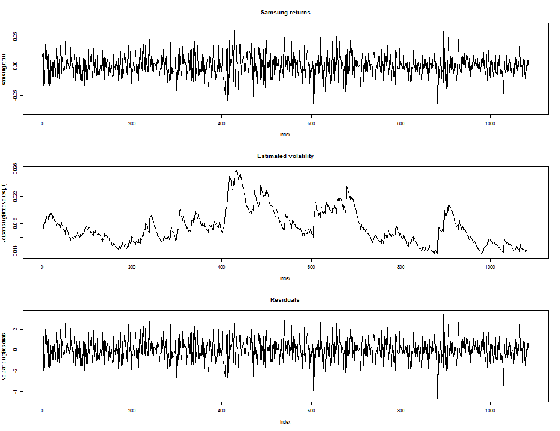
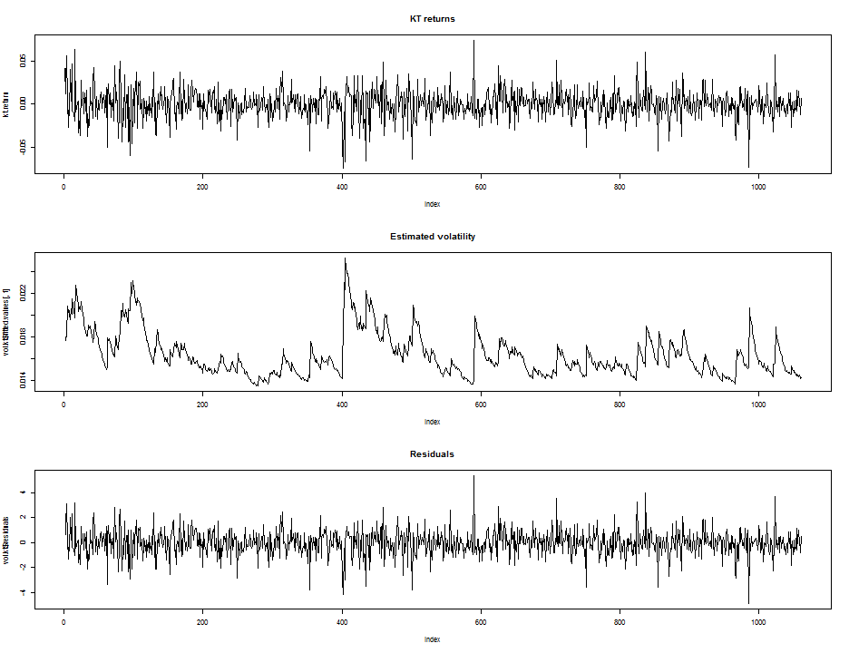
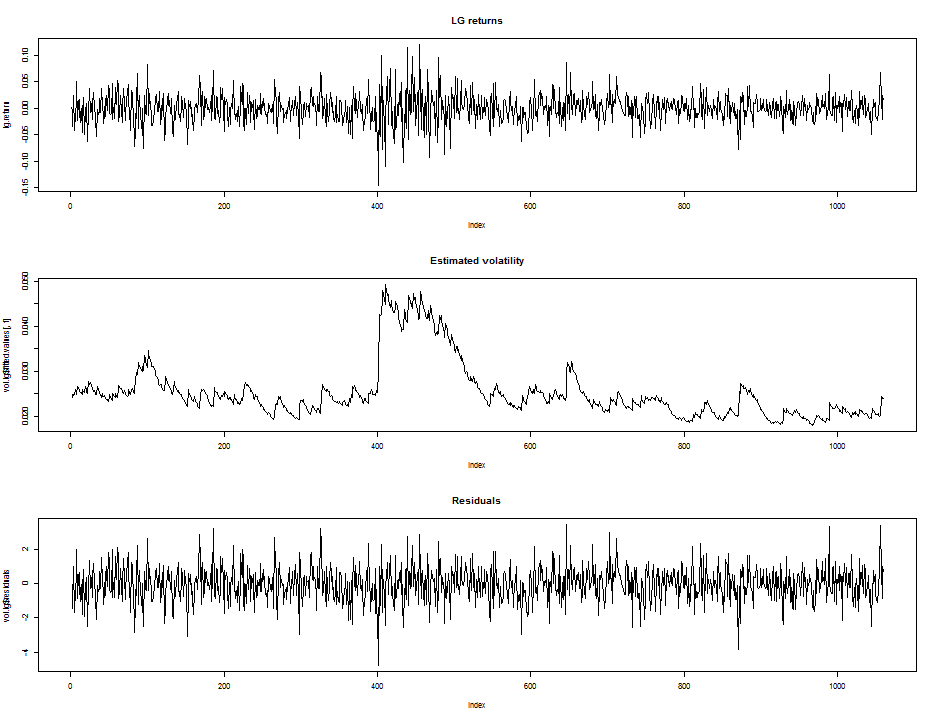
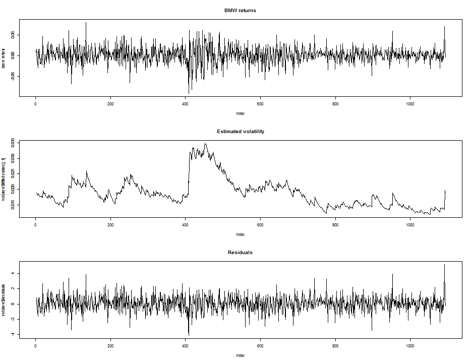
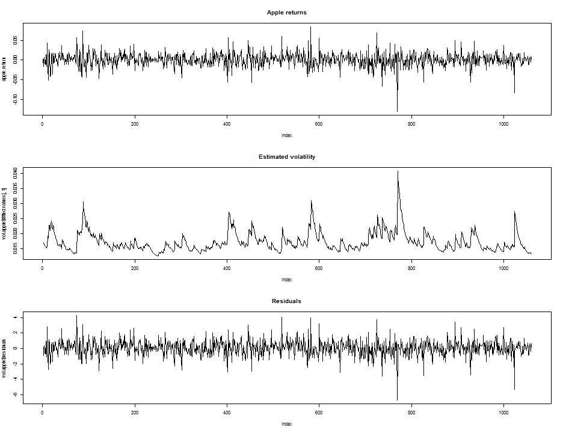
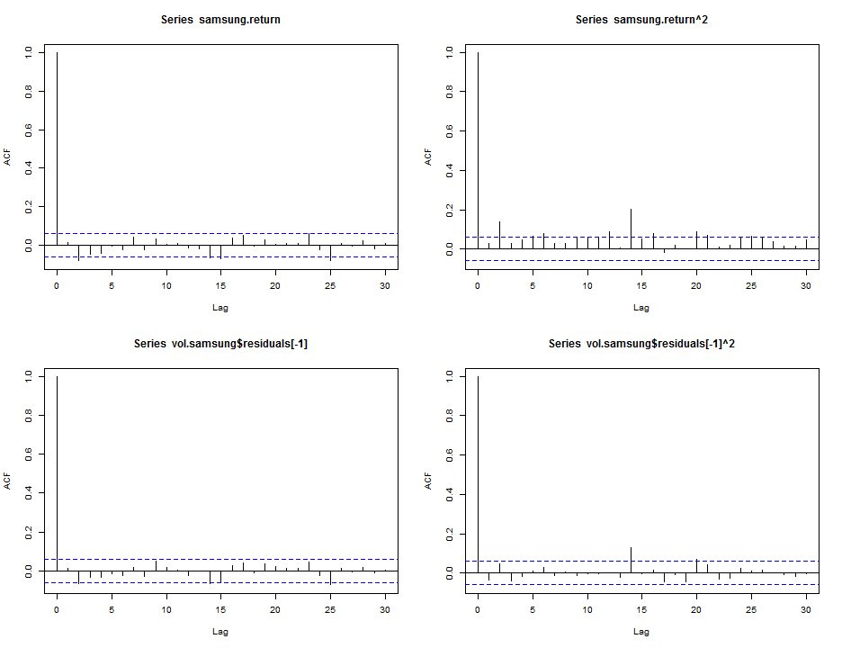
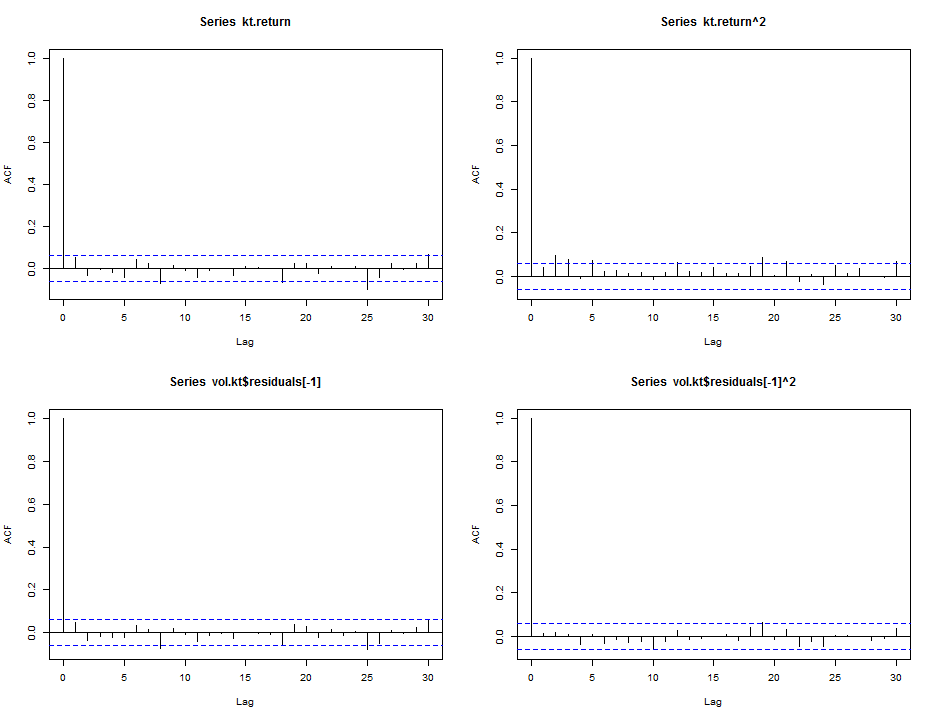
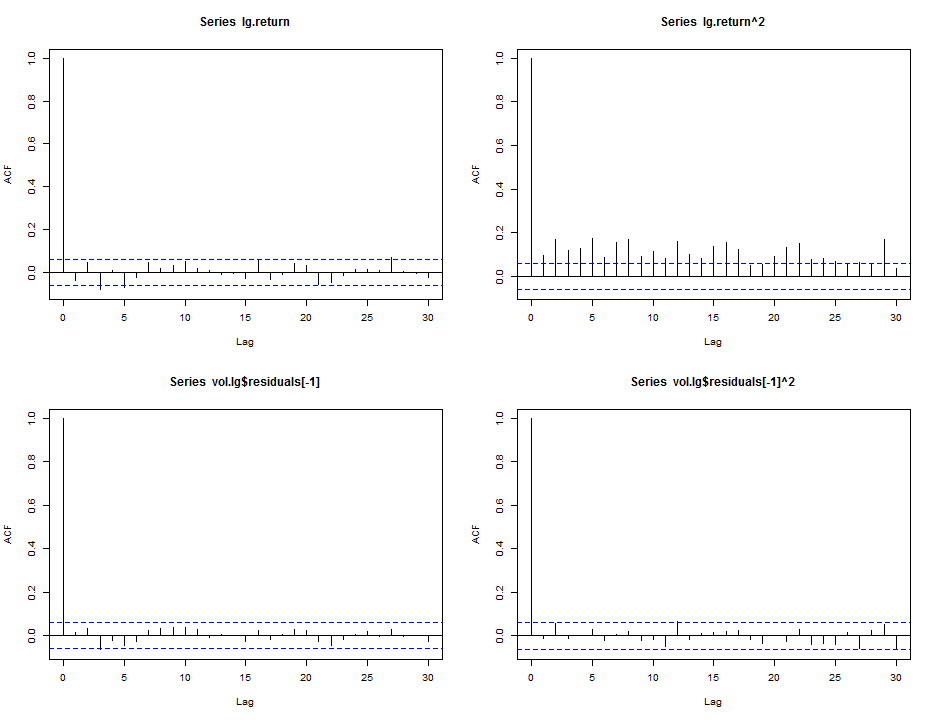
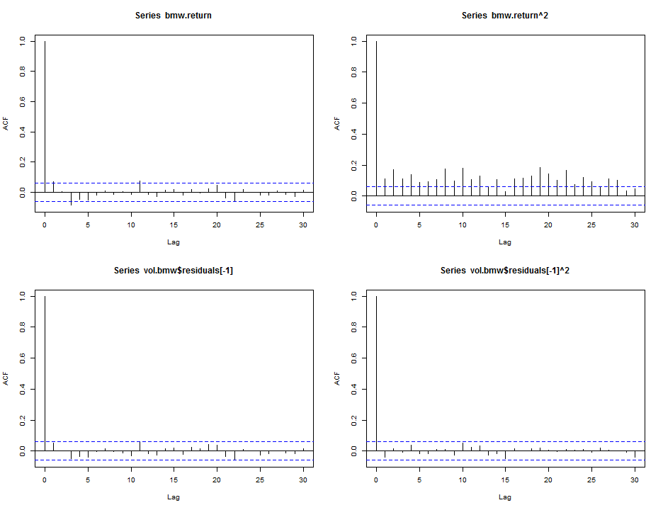
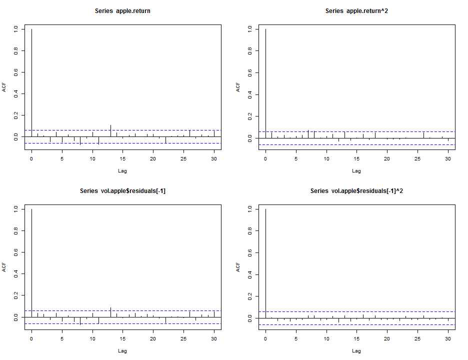

Assignment (Due to April. 9th. 2014)
========================================================
200903877 황 성 윤
-------------------------
GARCH model (Generalized Autoregressive Conditional Heteroscedastic Model)
---------------------------------------------------------------------------

### 5개 기업에 대한 수익률 생성 및 해당 패키지 설치


```r
dat.1 <- read.csv("C:/Users/user/Desktop/Sung-yoon.R/Mid-term Exam/Samsung eletronics/samsung_daily.csv", 
    sep = ",", header = T)
samsung <- dat.1$Close
samsung.return <- diff(log(samsung))
dat.2 <- read.csv("C:/Users/user/Desktop/Sung-yoon.R/Mid-term Exam/KT Corporation/kt_daily.csv", 
    sep = ",", header = T)
kt <- dat.2$Close
kt.return <- diff(log(kt))
dat.3 <- read.csv("C:/Users/user/Desktop/Sung-yoon.R/Mid-term Exam/LG Display Co., Ltd/lg_daily.csv", 
    sep = ",", header = T)
lg <- dat.3$Close
lg.return <- diff(log(lg))
dat.4 <- read.csv("C:/Users/user/Desktop/Sung-yoon.R/Mid-term Exam/BMW/BMW_daily.csv", 
    sep = ",", header = T)
bmw <- dat.4$Close
bmw.return <- diff(log(bmw))
dat.5 <- read.csv("C:/Users/user/Desktop/Sung-yoon.R/Mid-term Exam/Apple Inc/apple_daily.csv", 
    sep = ",", header = T)
apple <- dat.5$Close
apple.return <- diff(log(apple))
install.packages("tseries")
```

```
## Error: trying to use CRAN without setting a mirror
```

```r
library(tseries)
```


## Finance time series model

### Conditional Heteroscedastic Model
### S(t) : asset price
### r(t) = log(S(t))-log(S(t-1)) : log-return or return
### r(t) = sigma(t)*e(t) , e(t) ~ WN(0,1) (e : epsilon)
### sigma(t)^2 = Var(r(t) | r(t-1), r(t-2), ...)
### = E(r(t)^2 | r(t-1), r(t-2), ...)
### GARCH 모형에서 모수를 추정 후 잔차를 이용하여 검진실시.
### (잔차에 대한 acf 그림을 그린다.
### 그리고 Box-Ljung test 실시. H0 : 상관관계 없음.)

### Generalized Autoregressive Conditional Heteroscedastic Model
### (GARCH Model) 
### (자기회귀 & 이분산성 (과거의 기록을 조건부로 이용))
### Engle -> Bollerslev
### Volatility 를 모형화하기 위한 model

### ARCH(p) --> 
### sigma(t)^2 = alpha(0) + alpha(1)*r(t-1)^2 +
### alpha(2)*r(t-2)^2 + ... + alpha(p)*r(t-p)^2 (t=1,2,...,T)

### GARCH(p,q) -->
### sigma(t)^2 = alpha(0) + alpha(1)*r(t-1)^2 +
### alpha(2)*r(t-2)^2 + ... + alpha(p)*r(t-p)^2 +
### beta(1)*sigma(t-1)^2 + beta(2)*sigma(t-2)^2 +
### beta(q)*sigma(t-q)^2 (t=1,2,...,T)
### 일반적으로 GARCH(1,1) 으로 충분하다고 알려져있음.


### 수익률, 자료에 적합된 GARCH model에 의해 추정된 변동성 및 잔차에 관한 그래프 (여기에서는 GARCH(1,1) 모형을 가정하고 분석할 것임.)

#### 1. Samsung eletronics 

```r
vol.samsung <- garch(samsung.return)
```

```
## 
##  ***** ESTIMATION WITH ANALYTICAL GRADIENT ***** 
## 
## 
##      I     INITIAL X(I)        D(I)
## 
##      1     2.817621e-04     1.000e+00
##      2     5.000000e-02     1.000e+00
##      3     5.000000e-02     1.000e+00
## 
##     IT   NF      F         RELDF    PRELDF    RELDX   STPPAR   D*STEP   NPRELDF
##      0    1 -3.832e+03
##      1    9 -3.832e+03  1.25e-06  2.60e-06  1.3e-05  6.1e+09  1.3e-06  7.95e+03
##      2   17 -3.832e+03  8.21e-05  1.44e-04  1.7e-01  2.0e+00  2.1e-02  9.13e-02
##      3   21 -3.836e+03  1.00e-03  6.34e-04  7.4e-01  1.2e+00  3.3e-01  7.79e-03
##      4   23 -3.837e+03  2.11e-04  2.15e-04  7.8e-02  2.0e+00  6.7e-02  2.38e-01
##      5   25 -3.839e+03  4.33e-04  4.23e-04  1.3e-01  6.8e-01  1.3e-01  1.98e-03
##      6   35 -3.839e+03  1.07e-05  2.68e-05  1.7e-06  4.0e+00  2.1e-06  2.14e-02
##      7   36 -3.839e+03  1.07e-06  8.27e-07  1.7e-06  2.0e+00  2.1e-06  1.71e-02
##      8   46 -3.840e+03  3.52e-04  4.13e-04  1.0e-01  1.8e+00  1.3e-01  1.73e-02
##      9   48 -3.841e+03  1.89e-04  1.84e-04  2.8e-02  1.4e+00  4.1e-02  7.74e-04
##     10   50 -3.843e+03  5.37e-04  6.18e-04  5.0e-02  7.2e-01  8.2e-02  1.89e-03
##     11   51 -3.846e+03  6.88e-04  1.02e-03  4.2e-02  6.1e-01  8.2e-02  1.31e-03
##     12   59 -3.847e+03  4.02e-04  6.04e-04  8.9e-07  4.3e+00  1.6e-06  3.92e-03
##     13   60 -3.847e+03  1.74e-06  1.95e-06  8.7e-07  2.0e+00  1.6e-06  8.07e-03
##     14   61 -3.847e+03  1.43e-07  1.70e-07  8.8e-07  2.0e+00  1.6e-06  8.25e-03
##     15   69 -3.850e+03  7.05e-04  1.16e-03  1.0e-02  1.6e+00  1.8e-02  8.24e-03
##     16   71 -3.852e+03  5.84e-04  6.02e-04  7.3e-03  9.9e-01  1.8e-02  5.95e-03
##     17   72 -3.855e+03  6.70e-04  8.50e-04  1.5e-02  9.3e-01  3.7e-02  1.90e-03
##     18   73 -3.855e+03  7.08e-05  1.64e-04  7.8e-03  0.0e+00  1.8e-02  1.64e-04
##     19   74 -3.855e+03  5.10e-05  6.72e-05  2.4e-03  0.0e+00  6.3e-03  6.72e-05
##     20   75 -3.855e+03  3.32e-06  2.76e-06  1.1e-03  0.0e+00  2.4e-03  2.76e-06
##     21   88 -3.855e+03  7.54e-08  2.07e-07  1.1e-08  2.6e+00  2.1e-08  3.11e-07
##     22   90 -3.855e+03  1.44e-08  6.87e-09  1.0e-08  2.0e+00  2.1e-08  3.08e-08
##     23   92 -3.855e+03  1.99e-11  4.59e-12  1.1e-08  2.0e+00  2.1e-08  2.36e-08
##     24   99 -3.855e+03 -6.37e-15  2.19e-17  2.1e-14  4.1e+03  5.5e-14  2.35e-08
## 
##  ***** FALSE CONVERGENCE *****
## 
##  FUNCTION    -3.855128e+03   RELDX        2.136e-14
##  FUNC. EVALS      99         GRAD. EVALS      24
##  PRELDF       2.191e-17      NPRELDF      2.355e-08
## 
##      I      FINAL X(I)        D(I)          G(I)
## 
##      1    4.656003e-06     1.000e+00    -7.209e-02
##      2    3.087981e-02     1.000e+00     1.030e+00
##      3    9.535844e-01     1.000e+00     1.149e+00
```

```r
par(mfrow = c(3, 1))
plot(samsung.return, type = "l", main = "Samsung returns")
plot(vol.samsung$fitted.values[, 1], type = "l", main = "Estimated volatility")
plot(vol.samsung$residuals, type = "l", main = "Residuals")
```

 


#### 2. KT corporation

```r
vol.kt <- garch(kt.return)
```

```
## 
##  ***** ESTIMATION WITH ANALYTICAL GRADIENT ***** 
## 
## 
##      I     INITIAL X(I)        D(I)
## 
##      1     2.463951e-04     1.000e+00
##      2     5.000000e-02     1.000e+00
##      3     5.000000e-02     1.000e+00
## 
##     IT   NF      F         RELDF    PRELDF    RELDX   STPPAR   D*STEP   NPRELDF
##      0    1 -3.824e+03
##      1    8 -3.824e+03  1.07e-05  2.07e-05  3.1e-05  8.2e+09  3.1e-06  8.44e+04
##      2   17 -3.826e+03  5.09e-04  9.13e-04  4.2e-01  2.0e+00  7.6e-02  2.78e-01
##      3   19 -3.830e+03  8.94e-04  1.95e-03  6.8e-01  2.0e+00  3.0e-01  1.10e-01
##      4   28 -3.830e+03  1.65e-04  7.77e-04  2.4e-05  3.0e+00  1.7e-05  1.26e-03
##      5   29 -3.831e+03  1.22e-04  1.04e-04  1.9e-05  2.0e+00  1.7e-05  3.33e-04
##      6   30 -3.831e+03  2.42e-06  2.55e-06  2.3e-05  2.0e+00  1.7e-05  2.19e-04
##      7   37 -3.832e+03  3.15e-04  2.17e-04  6.4e-02  0.0e+00  4.7e-02  2.17e-04
##      8   39 -3.834e+03  5.06e-04  5.09e-04  2.0e-01  4.1e-01  1.9e-01  5.70e-04
##      9   40 -3.836e+03  3.69e-04  3.57e-04  1.5e-01  3.3e-01  1.9e-01  3.74e-04
##     10   42 -3.836e+03  2.39e-05  3.77e-05  5.2e-03  9.1e-01  1.1e-02  6.70e-05
##     11   43 -3.836e+03  1.21e-05  1.52e-05  6.6e-03  1.5e+00  1.1e-02  3.35e-05
##     12   45 -3.836e+03  2.00e-05  6.29e-06  2.4e-02  0.0e+00  3.7e-02  6.29e-06
##     13   46 -3.836e+03  3.40e-05  4.34e-06  2.9e-02  0.0e+00  4.9e-02  4.34e-06
##     14   48 -3.836e+03  2.23e-05  9.16e-06  1.1e-02  2.0e+00  2.0e-02  1.00e-03
##     15   50 -3.836e+03  7.27e-05  3.10e-05  2.2e-02  2.0e+00  3.9e-02  1.97e-01
##     16   52 -3.836e+03  1.93e-05  1.31e-05  4.3e-03  2.0e+00  7.8e-03  4.27e+01
##     17   54 -3.836e+03  3.97e-05  2.79e-05  8.4e-03  2.0e+00  1.6e-02  4.74e+03
##     18   63 -3.836e+03  1.06e-07  3.73e-07  1.8e-08  1.2e+01  3.2e-08  2.34e-03
##     19   76 -3.836e+03 -2.94e-14  5.37e-14  1.1e-14  7.1e-01  2.0e-14 -1.41e-03
## 
##  ***** FALSE CONVERGENCE *****
## 
##  FUNCTION    -3.836443e+03   RELDX        1.119e-14
##  FUNC. EVALS      76         GRAD. EVALS      19
##  PRELDF       5.374e-14      NPRELDF     -1.411e-03
## 
##      I      FINAL X(I)        D(I)          G(I)
## 
##      1    1.317191e-05     1.000e+00    -1.008e+04
##      2    3.712906e-02     1.000e+00     5.946e+01
##      3    9.136524e-01     1.000e+00     5.094e+00
```

```r
par(mfrow = c(3, 1))
plot(kt.return, type = "l", main = "KT returns")
plot(vol.kt$fitted.values[, 1], type = "l", main = "Estimated volatility")
plot(vol.kt$residuals, type = "l", main = "Residuals")
```

 


#### 3. LG Display Co. Ltd 

```r
vol.lg <- garch(lg.return)
```

```
## 
##  ***** ESTIMATION WITH ANALYTICAL GRADIENT ***** 
## 
## 
##      I     INITIAL X(I)        D(I)
## 
##      1     6.277667e-04     1.000e+00
##      2     5.000000e-02     1.000e+00
##      3     5.000000e-02     1.000e+00
## 
##     IT   NF      F         RELDF    PRELDF    RELDX   STPPAR   D*STEP   NPRELDF
##      0    1 -3.327e+03
##      1    7 -3.327e+03  3.15e-05  5.35e-05  1.1e-04  1.5e+09  1.1e-05  3.89e+04
##      2    8 -3.327e+03  1.22e-06  1.28e-06  1.1e-04  2.0e+00  1.1e-05  1.58e+00
##      3   15 -3.330e+03  1.01e-03  1.40e-03  3.1e-01  2.0e+00  4.5e-02  1.58e+00
##      4   18 -3.339e+03  2.48e-03  2.30e-03  6.0e-01  1.9e+00  1.8e-01  3.24e-01
##      5   19 -3.348e+03  2.95e-03  5.16e-03  4.3e-01  2.0e+00  3.6e-01  1.69e+01
##      6   29 -3.349e+03  2.30e-04  7.58e-03  7.3e-05  2.1e+00  8.6e-05  2.59e-02
##      7   30 -3.356e+03  2.05e-03  1.37e-03  2.6e-05  2.0e+00  4.3e-05  1.77e-03
##      8   31 -3.357e+03  2.44e-04  5.00e-04  2.9e-05  2.0e+00  4.3e-05  4.01e-02
##      9   32 -3.357e+03  1.02e-04  1.25e-04  3.5e-05  2.0e+00  4.3e-05  1.59e-02
##     10   33 -3.357e+03  3.06e-06  2.82e-06  3.6e-05  2.0e+00  4.3e-05  1.85e-02
##     11   40 -3.359e+03  5.28e-04  5.99e-04  3.5e-02  1.7e+00  4.4e-02  1.87e-02
##     12   42 -3.362e+03  7.47e-04  7.29e-04  3.3e-02  5.0e-01  4.4e-02  2.63e-03
##     13   44 -3.367e+03  1.56e-03  1.65e-03  5.8e-02  5.2e-01  8.8e-02  6.08e-03
##     14   46 -3.372e+03  1.61e-03  1.71e-03  4.8e-02  4.3e-01  8.8e-02  4.43e-03
##     15   48 -3.379e+03  2.02e-03  2.27e-03  3.9e-02  7.1e-01  8.8e-02  5.61e-03
##     16   50 -3.379e+03  5.16e-05  3.67e-04  3.5e-03  2.0e+00  8.8e-03  1.93e-02
##     17   51 -3.381e+03  5.07e-04  5.44e-04  3.5e-03  2.0e+00  8.8e-03  1.27e-02
##     18   54 -3.384e+03  9.99e-04  1.08e-03  1.4e-02  1.1e+00  3.5e-02  1.26e-02
##     19   56 -3.386e+03  5.53e-04  7.14e-04  5.0e-03  1.7e+00  9.8e-03  5.45e-03
##     20   57 -3.387e+03  1.38e-04  2.19e-04  4.6e-03  5.6e-01  9.8e-03  2.59e-04
##     21   58 -3.387e+03  1.28e-05  4.16e-05  4.3e-03  4.1e-01  9.8e-03  4.67e-05
##     22   59 -3.387e+03  8.25e-06  8.35e-06  8.8e-04  0.0e+00  2.2e-03  8.35e-06
##     23   60 -3.387e+03  4.26e-07  3.92e-07  3.3e-04  0.0e+00  7.3e-04  3.92e-07
##     24   61 -3.387e+03  4.65e-10  6.78e-10  1.1e-05  0.0e+00  2.9e-05  6.78e-10
##     25   62 -3.387e+03  2.56e-10  2.85e-12  9.2e-07  0.0e+00  1.9e-06  2.85e-12
##     26   63 -3.387e+03 -1.04e-11  1.75e-14  2.8e-08  0.0e+00  6.3e-08  1.75e-14
## 
##  ***** RELATIVE FUNCTION CONVERGENCE *****
## 
##  FUNCTION    -3.386776e+03   RELDX        2.809e-08
##  FUNC. EVALS      63         GRAD. EVALS      26
##  PRELDF       1.753e-14      NPRELDF      1.753e-14
## 
##      I      FINAL X(I)        D(I)          G(I)
## 
##      1    1.130989e-05     1.000e+00    -7.194e+00
##      2    4.383819e-02     1.000e+00    -3.257e-03
##      3    9.386032e-01     1.000e+00    -3.667e-03
```

```r
par(mfrow = c(3, 1))
plot(lg.return, type = "l", main = "LG returns")
plot(vol.lg$fitted.values[, 1], type = "l", main = "Estimated volatility")
plot(vol.lg$residuals, type = "l", main = "Residuals")
```

 


#### 4. BMW 

```r
vol.bmw <- garch(bmw.return)
```

```
## 
##  ***** ESTIMATION WITH ANALYTICAL GRADIENT ***** 
## 
## 
##      I     INITIAL X(I)        D(I)
## 
##      1     3.367436e-04     1.000e+00
##      2     5.000000e-02     1.000e+00
##      3     5.000000e-02     1.000e+00
## 
##     IT   NF      F         RELDF    PRELDF    RELDX   STPPAR   D*STEP   NPRELDF
##      0    1 -3.772e+03
##      1    8 -3.772e+03  1.16e-05  2.28e-05  4.4e-05  4.4e+09  4.4e-06  5.06e+04
##      2   16 -3.773e+03  4.54e-04  8.05e-04  3.0e-01  2.0e+00  4.5e-02  6.03e-01
##      3   19 -3.778e+03  1.31e-03  1.26e-03  6.0e-01  1.9e+00  1.8e-01  1.10e-01
##      4   21 -3.792e+03  3.74e-03  2.68e-03  4.3e-01  2.0e+00  3.6e-01  3.66e+00
##      5   23 -3.797e+03  1.15e-03  1.13e-03  5.6e-02  2.0e+00  7.2e-02  1.02e+03
##      6   36 -3.799e+03  4.46e-04  1.29e-03  1.1e-05  2.4e+00  1.4e-05  6.98e+02
##      7   37 -3.799e+03  1.50e-04  1.23e-04  9.9e-06  2.0e+00  1.4e-05  2.42e+02
##      8   38 -3.799e+03  5.93e-06  6.89e-06  1.0e-05  2.0e+00  1.4e-05  3.22e+02
##      9   46 -3.802e+03  7.42e-04  9.08e-04  3.6e-02  2.0e+00  5.0e-02  3.13e+02
##     10   52 -3.802e+03  6.54e-06  1.36e-05  6.0e-07  3.1e+01  8.6e-07  8.23e-03
##     11   53 -3.802e+03  3.69e-08  5.06e-08  6.0e-07  2.0e+00  8.6e-07  4.53e-03
##     12   62 -3.804e+03  5.62e-04  8.88e-04  3.8e-02  1.5e+00  5.6e-02  4.53e-03
##     13   64 -3.810e+03  1.68e-03  1.48e-03  2.7e-02  7.7e-02  5.6e-02  3.58e-03
##     14   66 -3.821e+03  2.77e-03  3.55e-03  4.9e-02  1.9e+00  1.1e-01  2.47e-01
##     15   67 -3.823e+03  4.64e-04  4.97e-03  4.4e-02  1.4e+00  1.1e-01  9.93e-03
##     16   69 -3.831e+03  2.02e-03  3.90e-03  9.7e-03  1.4e+00  2.6e-02  1.13e-02
##     17   75 -3.831e+03  1.63e-04  2.47e-04  2.4e-07  2.4e+01  4.5e-07  9.84e-03
##     18   76 -3.831e+03  1.10e-05  1.27e-05  2.1e-07  2.0e+00  4.5e-07  1.13e-03
##     19   77 -3.831e+03  2.37e-07  2.22e-07  2.3e-07  2.0e+00  4.5e-07  1.37e-03
##     20   85 -3.832e+03  6.16e-05  1.14e-04  2.3e-03  1.8e+00  4.5e-03  1.36e-03
##     21   87 -3.832e+03  9.93e-05  6.67e-05  2.0e-03  0.0e+00  5.2e-03  6.67e-05
##     22   88 -3.832e+03  4.13e-05  3.47e-05  2.0e-03  7.8e-03  5.2e-03  3.47e-05
##     23   89 -3.832e+03  2.70e-06  2.31e-06  5.5e-04  0.0e+00  1.5e-03  2.31e-06
##     24   90 -3.832e+03  1.15e-07  9.45e-08  1.0e-04  0.0e+00  2.6e-04  9.45e-08
##     25   91 -3.832e+03  6.83e-09  4.24e-09  5.7e-06  0.0e+00  1.2e-05  4.24e-09
##     26   92 -3.832e+03  8.76e-10  4.24e-10  3.5e-06  0.0e+00  8.8e-06  4.24e-10
##     27   93 -3.832e+03  6.69e-11  6.53e-12  8.2e-07  0.0e+00  1.9e-06  6.53e-12
##     28   94 -3.832e+03  2.66e-11  1.41e-13  5.9e-08  0.0e+00  1.2e-07  1.41e-13
##     29   95 -3.832e+03  9.85e-12  7.32e-15  3.5e-08  0.0e+00  7.1e-08  7.32e-15
##     30   96 -3.832e+03  1.65e-12  2.44e-16  8.3e-09  0.0e+00  1.9e-08  2.44e-16
##     31   97 -3.832e+03  3.84e-14  1.45e-18  4.4e-10  0.0e+00  1.1e-09  1.45e-18
##     32   98 -3.832e+03 -2.61e-15  3.33e-21  9.4e-12  0.0e+00  1.8e-11  3.33e-21
## 
##  ***** X- AND RELATIVE FUNCTION CONVERGENCE *****
## 
##  FUNCTION    -3.832060e+03   RELDX        9.434e-12
##  FUNC. EVALS      98         GRAD. EVALS      32
##  PRELDF       3.332e-21      NPRELDF      3.332e-21
## 
##      I      FINAL X(I)        D(I)          G(I)
## 
##      1    4.538729e-06     1.000e+00    -3.135e-03
##      2    4.218134e-02     1.000e+00    -1.705e-06
##      3    9.454616e-01     1.000e+00    -1.565e-06
```

```r
par(mfrow = c(3, 1))
plot(bmw.return, type = "l", main = "BMW returns")
plot(vol.bmw$fitted.values[, 1], type = "l", main = "Estimated volatility")
plot(vol.bmw$residuals, type = "l", main = "Residuals")
```

 


#### 5. Apple Inc

```r
vol.apple <- garch(apple.return)
```

```
## 
##  ***** ESTIMATION WITH ANALYTICAL GRADIENT ***** 
## 
## 
##      I     INITIAL X(I)        D(I)
## 
##      1     2.731625e-04     1.000e+00
##      2     5.000000e-02     1.000e+00
##      3     5.000000e-02     1.000e+00
## 
##     IT   NF      F         RELDF    PRELDF    RELDX   STPPAR   D*STEP   NPRELDF
##      0    1 -3.764e+03
##      1    8 -3.764e+03  8.74e-06  1.69e-05  3.1e-05  6.6e+09  3.1e-06  5.58e+04
##      2   16 -3.767e+03  7.33e-04  1.06e-03  3.4e-01  2.0e+00  5.1e-02  8.17e-01
##      3   19 -3.768e+03  1.96e-04  1.72e-04  6.7e-01  8.8e-01  2.0e-01  1.16e-03
##      4   21 -3.774e+03  1.69e-03  4.54e-04  4.4e-01  1.9e+00  4.1e-01  7.62e-02
##      5   23 -3.777e+03  8.66e-04  8.41e-04  5.8e-02  2.0e+00  8.2e-02  5.51e+02
##      6   25 -3.778e+03  7.93e-05  1.66e-04  1.1e-02  2.0e+00  1.6e-02  6.45e-01
##      7   26 -3.778e+03  1.77e-04  2.45e-04  1.1e-02  2.0e+00  1.6e-02  2.17e-01
##      8   27 -3.779e+03  9.33e-05  1.33e-04  1.0e-02  2.0e+00  1.6e-02  6.30e-02
##      9   29 -3.779e+03  7.41e-06  3.56e-05  3.9e-03  2.0e+00  6.3e-03  7.18e-03
##     10   30 -3.779e+03  1.69e-05  3.29e-05  3.9e-03  2.0e+00  6.3e-03  9.77e-04
##     11   33 -3.780e+03  2.34e-04  1.60e-04  2.5e-02  0.0e+00  5.0e-02  1.60e-04
##     12   35 -3.780e+03  1.42e-05  5.76e-05  3.1e-03  1.9e+00  6.2e-03  1.42e-03
##     13   36 -3.780e+03  5.07e-06  2.51e-05  2.7e-03  1.5e+00  6.2e-03  4.69e-05
##     14   37 -3.780e+03  1.80e-05  2.00e-05  3.6e-03  1.5e+00  6.2e-03  5.53e-05
##     15   38 -3.780e+03  2.61e-06  6.65e-06  6.1e-03  0.0e+00  1.1e-02  6.65e-06
##     16   39 -3.780e+03  1.63e-06  3.58e-06  2.1e-03  0.0e+00  3.7e-03  3.58e-06
##     17   40 -3.780e+03  6.24e-07  8.74e-07  7.6e-04  0.0e+00  1.6e-03  8.74e-07
##     18   41 -3.780e+03  1.45e-07  1.10e-07  6.7e-04  0.0e+00  1.3e-03  1.10e-07
##     19   54 -3.780e+03  1.95e-11  1.80e-10  3.7e-10  6.6e+00  6.4e-10  2.00e-09
##     20   67 -3.780e+03  3.61e-16  4.85e-14  1.1e-13  1.3e+04  2.0e-13  1.62e-09
##     21   70 -3.780e+03 -2.05e-15  5.88e-15  1.4e-14  1.0e+05  2.4e-14  1.62e-09
## 
##  ***** FALSE CONVERGENCE *****
## 
##  FUNCTION    -3.779829e+03   RELDX        1.388e-14
##  FUNC. EVALS      70         GRAD. EVALS      21
##  PRELDF       5.883e-15      NPRELDF      1.618e-09
## 
##      I      FINAL X(I)        D(I)          G(I)
## 
##      1    2.015615e-05     1.000e+00    -9.300e+02
##      2    7.558968e-02     1.000e+00    -2.250e-01
##      3    8.610646e-01     1.000e+00    -1.935e-01
```

```r
par(mfrow = c(3, 1))
plot(apple.return, type = "l", main = "Apple returns")
plot(vol.apple$fitted.values[, 1], type = "l", main = "Estimated volatility")
plot(vol.apple$residuals, type = "l", main = "Residuals")
```

 


#### Summary interpretation
공통적으로 수익률의 변동성이 시간에 따라 달라지는 것으로 보아 GARCH model을 적합시켜 분석해볼 필요가 있겠다.

### 적합된 GARCH model에 대한 검진(GARCH(1,1))

#### 1. Samsung eletronics 

```r
summary(vol.samsung)
```

```
## 
## Call:
## garch(x = samsung.return)
## 
## Model:
## GARCH(1,1)
## 
## Residuals:
##    Min     1Q Median     3Q    Max 
## -4.686 -0.609  0.000  0.595  3.479 
## 
## Coefficient(s):
##     Estimate  Std. Error  t value Pr(>|t|)    
## a0  4.66e-06    2.15e-06     2.17  0.03002 *  
## a1  3.09e-02    8.33e-03     3.71  0.00021 ***
## b1  9.54e-01    1.35e-02    70.84  < 2e-16 ***
## ---
## Signif. codes:  0 '***' 0.001 '**' 0.01 '*' 0.05 '.' 0.1 ' ' 1
## 
## Diagnostic Tests:
## 	Jarque Bera Test
## 
## data:  Residuals
## X-squared = 41.88, df = 2, p-value = 8.068e-10
## 
## 
## 	Box-Ljung test
## 
## data:  Squared.Residuals
## X-squared = 1.254, df = 1, p-value = 0.2627
```


#### 2. KT corporation

```r
summary(vol.kt)
```

```
## 
## Call:
## garch(x = kt.return)
## 
## Model:
## GARCH(1,1)
## 
## Residuals:
##    Min     1Q Median     3Q    Max 
## -4.909 -0.545  0.000  0.518  5.376 
## 
## Coefficient(s):
##     Estimate  Std. Error  t value Pr(>|t|)    
## a0  1.32e-05    4.11e-06     3.21   0.0013 ** 
## a1  3.71e-02    8.26e-03     4.50  6.9e-06 ***
## b1  9.14e-01    2.16e-02    42.34  < 2e-16 ***
## ---
## Signif. codes:  0 '***' 0.001 '**' 0.01 '*' 0.05 '.' 0.1 ' ' 1
## 
## Diagnostic Tests:
## 	Jarque Bera Test
## 
## data:  Residuals
## X-squared = 346.6, df = 2, p-value < 2.2e-16
## 
## 
## 	Box-Ljung test
## 
## data:  Squared.Residuals
## X-squared = 0.2455, df = 1, p-value = 0.6202
```


#### 3. LG Display Co. Ltd 

```r
summary(vol.lg)
```

```
## 
## Call:
## garch(x = lg.return)
## 
## Model:
## GARCH(1,1)
## 
## Residuals:
##     Min      1Q  Median      3Q     Max 
## -4.8080 -0.6238 -0.0305  0.5886  3.4635 
## 
## Coefficient(s):
##     Estimate  Std. Error  t value Pr(>|t|)    
## a0  1.13e-05    4.36e-06     2.59   0.0095 ** 
## a1  4.38e-02    7.89e-03     5.56  2.7e-08 ***
## b1  9.39e-01    1.27e-02    73.79  < 2e-16 ***
## ---
## Signif. codes:  0 '***' 0.001 '**' 0.01 '*' 0.05 '.' 0.1 ' ' 1
## 
## Diagnostic Tests:
## 	Jarque Bera Test
## 
## data:  Residuals
## X-squared = 59.26, df = 2, p-value = 1.357e-13
## 
## 
## 	Box-Ljung test
## 
## data:  Squared.Residuals
## X-squared = 0.1935, df = 1, p-value = 0.66
```


#### 4. BMW 

```r
summary(vol.bmw)
```

```
## 
## Call:
## garch(x = bmw.return)
## 
## Model:
## GARCH(1,1)
## 
## Residuals:
##     Min      1Q  Median      3Q     Max 
## -4.1629 -0.5372  0.0566  0.6358  5.1923 
## 
## Coefficient(s):
##     Estimate  Std. Error  t value Pr(>|t|)    
## a0  4.54e-06    1.47e-06     3.09    0.002 ** 
## a1  4.22e-02    7.27e-03     5.81  6.4e-09 ***
## b1  9.45e-01    1.01e-02    94.03  < 2e-16 ***
## ---
## Signif. codes:  0 '***' 0.001 '**' 0.01 '*' 0.05 '.' 0.1 ' ' 1
## 
## Diagnostic Tests:
## 	Jarque Bera Test
## 
## data:  Residuals
## X-squared = 132.9, df = 2, p-value < 2.2e-16
## 
## 
## 	Box-Ljung test
## 
## data:  Squared.Residuals
## X-squared = 1.537, df = 1, p-value = 0.2151
```


#### 5. Apple Inc

```r
summary(vol.apple)
```

```
## 
## Call:
## garch(x = apple.return)
## 
## Model:
## GARCH(1,1)
## 
## Residuals:
##     Min      1Q  Median      3Q     Max 
## -6.7156 -0.4841  0.0583  0.6326  4.2666 
## 
## Coefficient(s):
##     Estimate  Std. Error  t value Pr(>|t|)    
## a0  2.02e-05    4.95e-06     4.08  4.6e-05 ***
## a1  7.56e-02    1.68e-02     4.50  6.8e-06 ***
## b1  8.61e-01    2.84e-02    30.33  < 2e-16 ***
## ---
## Signif. codes:  0 '***' 0.001 '**' 0.01 '*' 0.05 '.' 0.1 ' ' 1
## 
## Diagnostic Tests:
## 	Jarque Bera Test
## 
## data:  Residuals
## X-squared = 660.6, df = 2, p-value < 2.2e-16
## 
## 
## 	Box-Ljung test
## 
## data:  Squared.Residuals
## X-squared = 0.0111, df = 1, p-value = 0.9161
```


#### Summary interpretation
5개의 자료 모두 approximation t-test에 의하면 추정된 모수가 모두 유의한 것으로 나타났고 Jarque Bera test 결과 유의확률이 0.05본다 매우 작은 값으로 나타나므로 변동성을 분석할 때 정규분포를 가정하는 것에는 무리가 있다고 할 수 있다. 또한 Box-Ljung test 결과 유의확률이 0.05보다  큰 값으로 나타나고 있으므로 모형이 자료를 잘 적합시키고 있다고 판단할 수 있겠다.

### 잔차의 ACF를 이용한 모형의 검진

#### 1. Samsung eletronics 

```r
par(mfrow = c(2, 2))
acf(samsung.return)
acf(samsung.return^2)
acf(vol.samsung$residuals[-1])
acf(vol.samsung$residuals[-1]^2)
```

 


#### 2. KT corporation

```r
par(mfrow = c(2, 2))
acf(kt.return)
acf(kt.return^2)
acf(vol.kt$residuals[-1])
acf(vol.kt$residuals[-1]^2)
```

 


#### 3. LG Display Co. Ltd 

```r
par(mfrow = c(2, 2))
acf(lg.return)
acf(lg.return^2)
acf(vol.lg$residuals[-1])
acf(vol.lg$residuals[-1]^2)
```

 


#### 4. BMW 

```r
par(mfrow = c(2, 2))
acf(bmw.return)
acf(bmw.return^2)
acf(vol.bmw$residuals[-1])
acf(vol.bmw$residuals[-1]^2)
```

 


#### 5. Apple Inc

```r
par(mfrow = c(2, 2))
acf(apple.return)
acf(apple.return^2)
acf(vol.apple$residuals[-1])
acf(vol.apple$residuals[-1]^2)
```

 


#### Summary interpretation
5개의 기업 모두 공통적으로 잔차에 대한 ACF와 잔차를 제곱한 값에 대한 ACF가 대부분 신뢰구간 안에 들어가 있으므로 모형적합이 잘 되었다고 말할 수 있다. 그리고 수익률에 대한 ACF를 통하여 수익률 자체를 분석하는 것 보다는 그것을 제곱하여 얻어진 값들을 분석하는 것이 더 타당하다고 할 수 있겠다.
