Summary of Assignment
========================================================
200903877 황 성 윤
-------------------------
5개의 기업의 2010년 1월 1일부터 2014년 3월 24일까지의 daily return에 관한 분석.
---------------------------------------------------------------------------

### 데이터 불러들이기 및 수익률에 관한 그래프 그리기

#### 1. Samsung eletronics 

```r
dat.1 <- read.csv("C:/Users/user/Desktop/Sung-yoon.R/Mid-term Exam/Samsung eletronics/samsung_daily.csv", 
    sep = ",", header = T)
samsung <- dat.1$Close
par(mfrow = c(1, 2))
plot(samsung, type = "l", main = "Samsung eletronics", xlab = "t", ylab = "Samsung")
samsung.return <- diff(log(samsung))
plot(samsung.return, type = "l", main = "Samsung returns", xlab = "t", ylab = "returns")
```

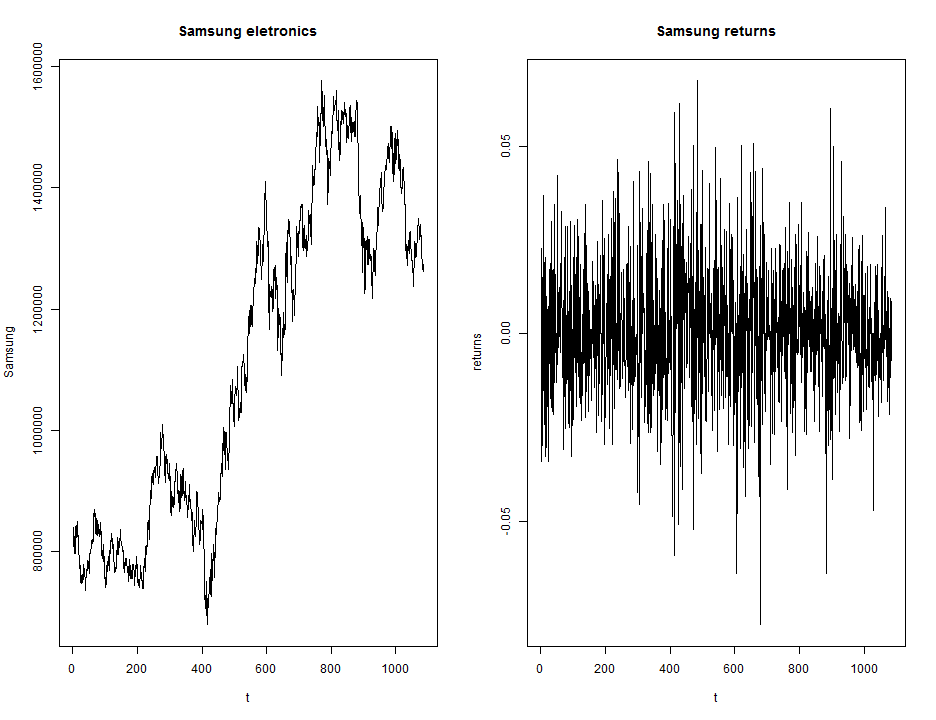 

#### Interpretation
삼성전자 주식에 관한 시계열 그래프에서 알 수 있듯이 
중반부에 주식이 급격하게 상승했음을 알 수 있고
비정상 시계열임을 알 수 있다.
그리고 주식의 수익률에 관한 그래프를 통하여
일반적인 주식의 특징이라고 할 수 있는
수익률의 변동성이 변화했을 때 그 변화에 대한
지속기간이 대체적으로 길게 나타나고 있음을 알 수 있다.
#### 2. KT corporation

```r
dat.2 <- read.csv("C:/Users/user/Desktop/Sung-yoon.R/Mid-term Exam/KT Corporation/kt_daily.csv", 
    sep = ",", header = T)
kt <- dat.2$Close
par(mfrow = c(1, 2))
plot(kt, type = "l", main = "KT corporation", xlab = "t", ylab = "KT")
kt.return <- diff(log(kt))
plot(kt.return, type = "l", main = "KT returns", xlab = "t", ylab = "returns")
```

 

#### Interpretation
KT corporation 의 주식에 관한 시계열 그래프에서 알 수 있듯이 
최근 5년동안 주식이 하락하는 추세를 보이고 있으며
비정상 시계열임을 알 수 있다.
그리고 중간에 주식이 큰 폭으로 떨어지는 부분이 있다는 것이 
특징이다.
또한 주식의 수익률에 관한 그래프를 통하여
일반적인 주식의 특징이라고 할 수 있는
수익률의 변동성이 변화했을 때 그 변화에 대한
지속기간이 대체적으로 길게 나타나고 있음을 알 수 있다.
#### 3. LG Display Co. Ltd 

```r
dat.3 <- read.csv("C:/Users/user/Desktop/Sung-yoon.R/Mid-term Exam/LG Display Co., Ltd/lg_daily.csv", 
    sep = ",", header = T)
lg <- dat.3$Close
par(mfrow = c(1, 2))
plot(lg, type = "l", main = "LG Display Co. Ltd", xlab = "t", ylab = "LG")
lg.return <- diff(log(lg))
plot(lg.return, type = "l", main = "LG returns", xlab = "t", ylab = "returns")
```

 

#### Interpretation
LG Display 주식에 관한 시계열 그래프에서 알 수 있듯이 
중반부 시점에서 주가가 크게 하락하였고 
전반적으로 최근 5년 동안 주가가 하락하는
추세를 보였음을 알 수 있다.
그리고 주식의 수익률에 관한 그래프를 보면
수익률의 변동성에 대한 지속기간이
전반적으로 길게 나타나고 있는 것으로 판단된다.
#### 4. BMW 

```r
dat.4 <- read.csv("C:/Users/user/Desktop/Sung-yoon.R/Mid-term Exam/BMW/BMW_daily.csv", 
    sep = ",", header = T)
bmw <- dat.4$Close
par(mfrow = c(1, 2))
plot(bmw, type = "l", main = "BMW", xlab = "t", ylab = "BMW")
bmw.return <- diff(log(bmw))
plot(bmw.return, type = "l", main = "BMW returns", xlab = "t", ylab = "returns")
```

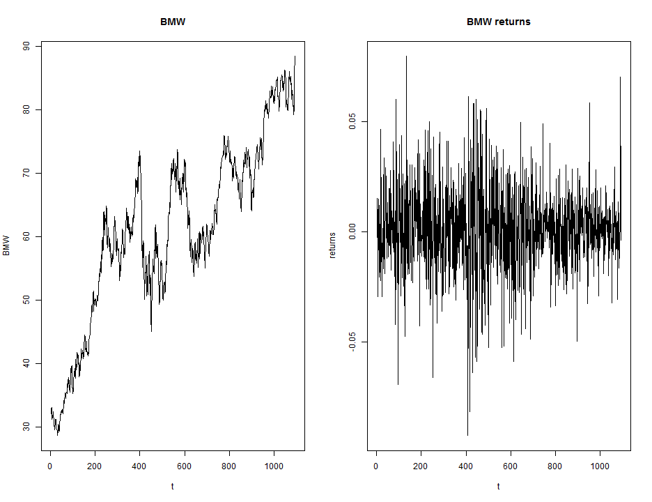 

#### Interpretation
BMW 주식에 관한 시계열 그래프에서 알 수 있듯이 
전반부 시점에서 주가가 크게 상승하였음을 알 수 있다. 
그리고 주식의 수익률에 관한 그래프를 보면
수익률의 변동성에 대한 지속기간이
전반적으로 길게 나타나고 있는 것으로 판단된다.
#### 5. Apple Inc 

```r
dat.5 <- read.csv("C:/Users/user/Desktop/Sung-yoon.R/Mid-term Exam/Apple Inc/apple_daily.csv", 
    sep = ",", header = T)
apple <- dat.5$Close
par(mfrow = c(1, 2))
plot(apple, type = "l", main = "Apple Inc", xlab = "t", ylab = "Apple")
apple.return <- diff(log(apple))
plot(apple.return, type = "l", main = "Apple returns", xlab = "t", ylab = "returns")
```

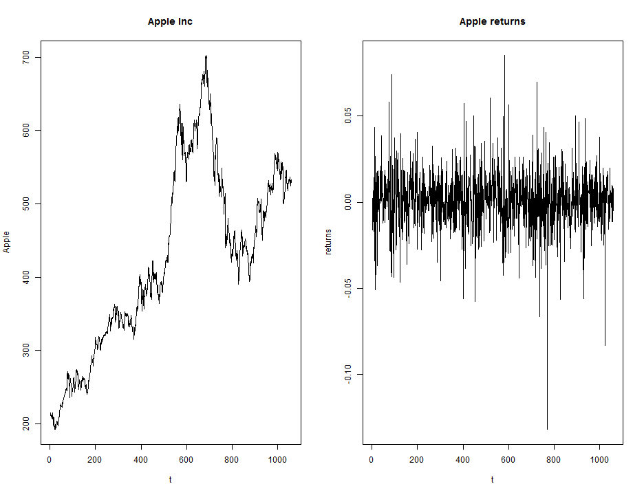 

#### Interpretation
Apple Inc 주식에 관한 시계열 그래프에서 알 수 있듯이 
전반적으로 주가가 상승하는 추세를 보였음을 알 수 있으며
중반부와 후반부 시점 중간에 큰 폭으로 상승했다는 것도 
확인할 수 있다.
그리고 주식의 수익률에 관한 그래프를 보면
일반적인 수익률의 경우와 마찬가지로
수익률의 변동성에 대한 지속기간이
전반적으로 길게 나타나고 있는 것으로 판단된다.

### 수익률에 대한 평균, 표준편차, 왜도, 그리고 첨도

#### 1. Samsung eletronics 

```r
z <- scale(samsung.return)
skew.samsung <- mean(z^3)
kurt.samsung <- mean(z^4)
print(c(mean(samsung.return), sd(samsung.return), skew.samsung, kurt.samsung))
```

```
## [1] 0.0004178 0.0176938 0.0788364 4.0592690
```

#### Interpretation
평균 : 0.0004178181, 표준편차 : 0.0176937566,
왜도 : 0.0788363519 > 0 --> 양수인 것으로 보아 오른쪽으로 꼬리가 형성되는 것으로 보임,
첨도 : 4.0592690227 > 3 --> 일반적인 정규분포의 그래프보다 더 뾰족한 형태의 분포를 형성할 것이라고 예상할 수 있음.
#### 2. KT corporation

```r
z <- scale(kt.return)
skew.kt <- mean(z^3)
kurt.kt <- mean(z^4)
print(c(mean(kt.return), sd(kt.return), skew.kt, kurt.kt))
```

```
## [1] -0.0002274  0.0165461 -0.1646026  5.5892649
```

#### Interpretation
평균 : -0.000227397, 표준편차 : 0.016546067,
왜도 : -0.164602632 < 0 --> 음수인 것으로 보아 왼쪽으로 꼬리가 형성되는 것으로 보임,
첨도 : 5.589264940 > 3 --> 일반적인 정규분포의 그래프보다 더 뾰족한 형태의 분포를 형성할 것이라고 예상할 수 있음.
#### 3. LG Display Co. Ltd 

```r
z <- scale(lg.return)
skew.lg <- mean(z^3)
kurt.lg <- mean(z^4)
print(c(mean(lg.return), sd(lg.return), skew.lg, kurt.lg))
```

```
## [1] -0.000383  0.026411 -0.001076  5.560847
```

#### Interpretation
평균 : -0.0003830322, 표준편차 : 0.0264105771,
왜도 : -0.0010760994 , 0 --> 음수인 것으로 보아 왼쪽으로 꼬리가 형성되는 것으로 보임,
첨도 : 5.5608465389 > 3 --> 일반적인 정규분포의 첨도인 3보다 크기 때문에 뾰족한 모양의 분포를 형성하고 있는 것으로 보인다.
#### 4. BMW 

```r
z <- scale(bmw.return)
skew.bmw <- mean(z^3)
kurt.bmw <- mean(z^4)
print(c(mean(bmw.return), sd(bmw.return), skew.bmw, kurt.bmw))
```

```
## [1]  0.0009239  0.0193432 -0.1424242  4.8996305
```

#### Interpretation
평균 : 0.0009282477, 표준편차 : 0.0193515181,
왜도 : -0.1430340687 < 0 --> 음수인 것으로 보아 왼쪽으로 꼬리가 형성되는 것으로 보임,
첨도 : 4.8958161469 > 3 --> 일반적인 정규분포의 첨도인 3보다 크기 때문에 뾰족한 모양의 분포를 형성하고 있는 것으로 보인다.
#### 5. Apple Inc

```r
z <- scale(apple.return)
skew.apple <- mean(z^3)
kurt.apple <- mean(z^4)
print(c(mean(apple.return), sd(apple.return), skew.apple, kurt.apple))
```

```
## [1]  0.0008606  0.0174217 -0.3852795  7.9795077
```

#### Interpretation
평균 : 0.0008606177, 표준편차 : 0.0174216501,
왜도 : -0.3852795005 , 0 --> 음수인 것으로 보아 왼쪽으로 꼬리가 형성되는 것으로 보임,
첨도 : 7.9795077037 > 3 --> 일반적인 정규분포의 첨도인 3보다 크기 때문에 뾰족한 모양의 분포를 형성하고 있는 것으로 보인다.

### 일별 주식은 정규성을 보이는가?

#### 1. Samsung eletronics

```r
par(mfrow = c(1, 1))
hist(samsung.return, prob = T, nclass = 50)
x <- seq(from = -0.05, to = 0.05, by = 1e-04)
lines(x, dnorm(x, mean = mean(samsung.return), sd(samsung.return)), col = 2)
```

 

#### Interpretation
히스토그램의 형태가 정규분포와 비교했을 때 더 뾰족하고 오른쪽에서 꼬리가 형성되고 있으며 더 두꺼움을 알 수 있다. 일반적으로 왼쪽에서 꼬리가 형성되는 경우가 많다는 사실과 비교했을 때 특이한 case라고 할 수 있겠다.
#### 2. KT corporation

```r
par(mfrow = c(1, 1))
hist(kt.return, prob = T, nclass = 50)
x <- seq(from = -0.05, to = 0.05, by = 1e-04)
lines(x, dnorm(x, mean = mean(kt.return), sd(kt.return)), col = 2)
```

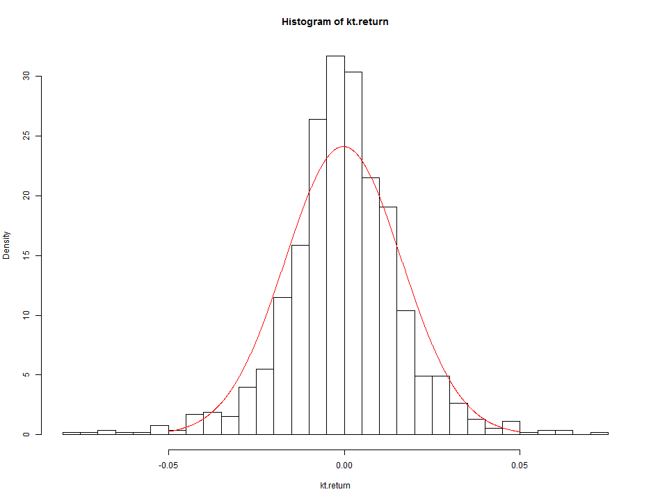 

#### Interpretation
히스토그램의 형태가 정규분포와 비교했을 때 더 뾰족하고 왼쪽에서 꼬리가 형성되고 있으며 더 두꺼움을 알 수 있다. 이는 수익률의 분포가 정규분포와는 거리가 멀다는 것을 뜻한다.
#### 3. LG Display Co. Ltd 

```r
par(mfrow = c(1, 1))
hist(lg.return, prob = T, nclass = 50)
x <- seq(from = -0.1, to = 0.15, by = 1e-04)
lines(x, dnorm(x, mean = mean(lg.return), sd(lg.return)), col = 2)
```

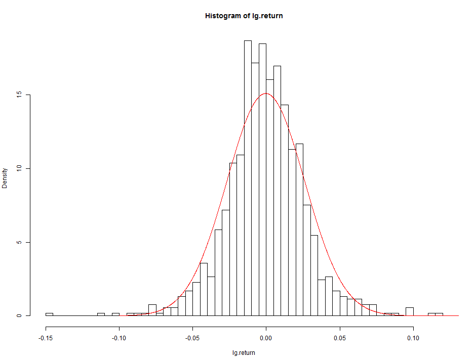 

#### Interpretation
히스토그램의 형태가 정규분포와 비교했을 때 뾰족하고 왼쪽에서 꼬리가 형성되고 있으며 더 두꺼움을 알 수 있다. 이 사실을 통해 정규성을 가정하는 것에 있어서는 조심해야 할 것으로 보인다.
#### 4. BMW 

```r
par(mfrow = c(1, 1))
hist(bmw.return, prob = T, nclass = 50)
x <- seq(from = -0.1, to = 0.05, by = 1e-04)
lines(x, dnorm(x, mean = mean(bmw.return), sd(bmw.return)), col = 2)
```

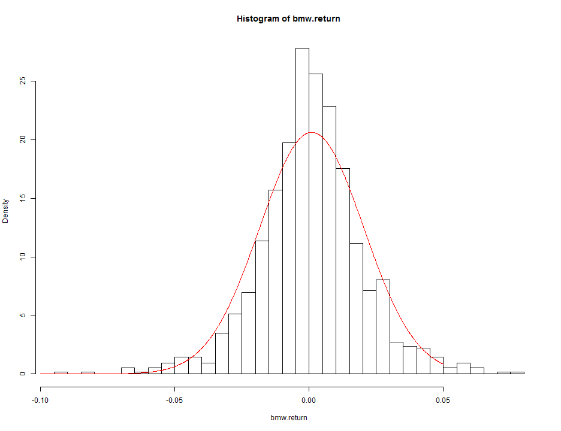 

#### Interpretation
히스토그램의 형태가 정규분포와 비교했을 때 뾰족하고 왼쪽에서 꼬리가 형성되고 있으며 더 두꺼움을 알 수 있다. 차이가 있는 것으로 보아 정규성을 가정하는 것에 있어서는 조심해야 할 것으로 보인다.
#### 5. Apple Inc 

```r
par(mfrow = c(1, 1))
hist(apple.return, prob = T, nclass = 50)
x <- seq(from = -0.1, to = 0.05, by = 1e-04)
lines(x, dnorm(x, mean = mean(apple.return), sd(apple.return)), col = 2)
```

 

#### Interpretation
히스토그램의 형태가 정규분포와 비교했을 때 뾰족하고 왼쪽에서 꼬리가 형성되고 있으며 더 두꺼움을 알 수 있다. 차이가 있는 것으로 보아 정규성을 가정하는 것에 있어서는 무리가 있을 것이라 여겨진다.

### 정규성 검정(Shapiro-Wilk normality test)

#### 1. Samsung eletronics

```r
par(mfrow = c(1, 1))
qqnorm(samsung.return)
qqline(samsung.return)
```

 

```r
shapiro.test(samsung.return)
```

```
## 
## 	Shapiro-Wilk normality test
## 
## data:  samsung.return
## W = 0.9893, p-value = 3.95e-07
```

#### Interpretation
Q-Q plot을 통해서 알 수 있듯이 그래프가 직선과 동떨어지는 부분이 양끝에서 발생하고 있음을 알 수 있고, 검정결과 유의확률이 0.05보다 작은 것으로 보아 데이터가 정규분포를 따른다는 H0를 기각한다. 즉, 수익률이 정규성을 띄고 있다고 말할 수 없다.
#### 2. KT corporation

```r
par(mfrow = c(1, 1))
qqnorm(kt.return)
qqline(kt.return)
```

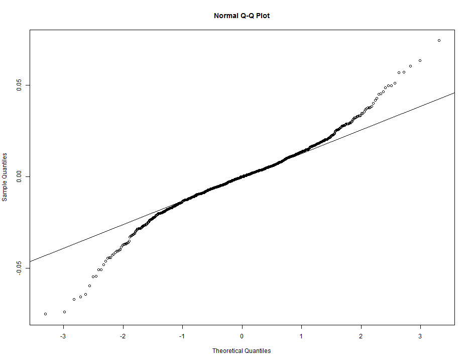 

```r
shapiro.test(kt.return)
```

```
## 
## 	Shapiro-Wilk normality test
## 
## data:  kt.return
## W = 0.9665, p-value = 6.377e-15
```

#### Interpretation
Q-Q plot을 통해서 알 수 있듯이 그래프가 직선과 동떨어지는 부분이 양끝에서 발생하고 있음을 알 수 있고, 검정결과 유의확률이 0.05보다 작은 것으로 보아 데이터가 정규분포를 따른다는 H0를 기각한다. 즉, 수익률이 정규성을 띄고 있다고 말할 수 없다.
#### 3. LG Display Co. Ltd 

```r
par(mfrow = c(1, 1))
qqnorm(lg.return)
qqline(lg.return)
```

 

```r
shapiro.test(lg.return)
```

```
## 
## 	Shapiro-Wilk normality test
## 
## data:  lg.return
## W = 0.9735, p-value = 5.379e-13
```

#### Interpretation
Q-Q plot을 통해서 알 수 있듯이 그래프가 직선과 동떨어지는 부분이 양끝에서 발생하고 있음을 알 수 있고, 검정결과 유의확률이 0.05보다 매우 작은 것으로 보아 데이터가 정규분포를 따른다는 H0를 기각한다. 즉, 수익률이 정규성을 띄고 있다고 말할 수 없다.
#### 4. BMW 

```r
par(mfrow = c(1, 1))
qqnorm(bmw.return)
qqline(bmw.return)
```

 

```r
shapiro.test(bmw.return)
```

```
## 
## 	Shapiro-Wilk normality test
## 
## data:  bmw.return
## W = 0.9771, p-value = 4.016e-12
```

#### Interpretation
Q-Q plot을 통해서 알 수 있듯이 그래프가 직선과 동떨어지는 부분이 양끝에서 발생하고 있음을 알 수 있고, 검정결과 유의확률이 0.05보다 매우 작은 것으로 보아 데이터가 정규분포를 따른다는 H0를 기각한다. 즉, 수익률이 정규성을 띄고 있다고 말할 수 없다.
#### 5. Apple Inc 

```r
par(mfrow = c(1, 1))
qqnorm(apple.return)
qqline(apple.return)
```

 

```r
shapiro.test(apple.return)
```

```
## 
## 	Shapiro-Wilk normality test
## 
## data:  apple.return
## W = 0.9576, p-value < 2.2e-16
```

#### Interpretation
Q-Q plot을 통해서 알 수 있듯이 그래프가 직선과 동떨어지는 부분이 양끝에서 발생하고 있음을 알 수 있고, 검정결과 유의확률이 0.05보다 매우 작은 것으로 보아 데이터가 정규분포를 따른다는 H0를 기각한다. 즉, 수익률이 정규성을 띄고 있다고 말할 수 없다.

### 자기상관함수 (Autocorrelation function)

#### 1. Samsung eletronics

```r
par(mfrow = c(2, 1))
acf(samsung.return)
acf(abs(samsung.return))
```

 

#### Interpretation
수익률에 대한 ACF를 보면 대부분 신뢰구간을 벗어나지 않고 있으므로 이전날의 수익률이 현재의 수익률에 미치는 영향이 거의 없음을 알 수 있다. 하지만 수익률의 절대값에 관한 ACF를 보면 적기는 하지만 신뢰구간을 뚫고 나오는 경우가 종종 있음을 알 수 있다. 그러므로 크지는 않지만 이전날의 수익률의 변화가 현재의 수익률에 변화에 어느 정도 영향력을 행사하고 있음을 알 수 있다.
#### 2. KT corporation

```r
par(mfrow = c(2, 1))
acf(kt.return)
acf(abs(kt.return))
```

 

#### Interpretation
수익률에 대한 ACF를 보면 대부분 신뢰구간을 벗어나지 않고 있으므로 이전날의 수익률이 현재의 수익률에 미치는 영향이 거의 없음을 알 수 있다. 수익률의 절대값에 대한 ACF 또한 일부 시차를 제외하면 동일한 결과를 보여주는 것으로 보아 이전날의 수익률의 변화 또한 현재의 수익률의 변화에 별다른 영향을 주지 못하고 있는 것으로 해석할 수 있겠다. 하지만 그 이후의 분석결과에 따라 내용이 달라질 수 있으니 유의를 해야 하겠다.
#### 3. LG Display Co. Ltd 

```r
par(mfrow = c(2, 1))
acf(lg.return)
acf(abs(lg.return))
```

 

#### Interpretation
수익률에 대한 ACF를 보면 대부분 신뢰구간을 벗어나지 않고 있으므로 이전날의 수익률이 현재의 수익률에 미치는 영향력이 크다고 할 수는 없겠다. 그러나 수익률의 절대값에 관한 ACF를 보면 신뢰구간을 뚫고 나오는 경우가 많이 존재하고 있다. 즉, 이전날의 수익률의 변화가 현재의 수익률의 변화에 많은 영향력을 행사하고 있음을 알 수 있다. 그러므로 수익률 자체를 분석하는 것보다 수익률의 변화에 대해서 연구해보는 것이 더 바람직할 것으로 여겨진다.
#### 4. BMW 

```r
par(mfrow = c(2, 1))
acf(bmw.return)
acf(abs(bmw.return))
```

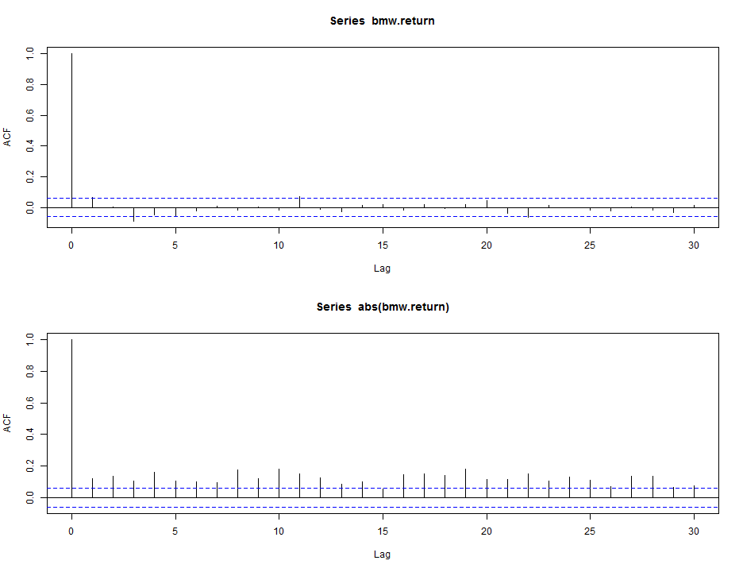 

#### Interpretation
수익률에 대한 ACF를 보면 대부분 신뢰구간을 벗어나지 않고 있으므로 이전날의 수익률이 현재의 수익률에 미치는 영향력이 크다고 할 수는 없겠다. 그러나 수익률의 절대값에 대한 ACF에서는 이전날의 수익률의 변화가 현재의 수익률의 변화에 영향을 미치는 것으로 나타나고 있다. 그러므로 수익률 자체를 분석하는 것보다 수익률의 변화에 대해서 연구해보는 것이 더 바람직할 것으로 여겨진다.
#### 5. Apple Inc 

```r
par(mfrow = c(2, 1))
acf(apple.return)
acf(abs(apple.return))
```

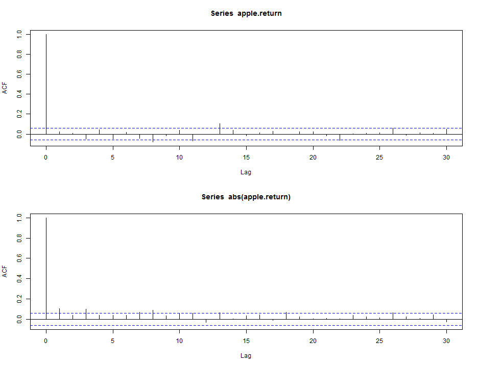 

#### Interpretation
수익률에 대한 ACF를 보면 대부분 신뢰구간을 벗어나지 않고 있으므로 이전날의 수익률이 현재의 수익률에 미치는 영향력이 크다고 할 수는 없겠다. 수익률의 절대값에 대한 ACF 또한 일부 시차를 제외하면 동일한 결과를 보여주는 것으로 보아 이전날의 수익률의 변화 또한 현재의 수익률의 변화에 별다른 영향을 주지 못하고 있는 것으로 해석할 수 있겠다. 하지만 그 이후의 분석결과에 따라 내용이 달라질 수 있으니 유의를 해야 하겠다.

Genelarized Hyperbolic Distribution (Normal-Inverse Gaussian Distribution)
---------------------------------------------------------------------------

### 패키지 fBasics 설치 및 변동성 구하는 함수 생성


```r
install.packages("fBasics")
```

```
## Error: trying to use CRAN without setting a mirror
```

```r
library(fBasics)
```

```
## Loading required package: MASS
## Loading required package: timeDate
## Loading required package: timeSeries
## 
## Attaching package: 'fBasics'
## 
## The following object is masked from 'package:base':
## 
##     norm
```

```r
nig.volatility <- function(alpha, beta, delta, mu) {
    gamma <- sqrt(alpha^2 - beta^2)
    ans <- sqrt(delta * alpha^2/gamma^3)
    return(ans)
}
```


### 5개의 자료에 대한 모수 추정 (Normal-Inverse Gaussian Distribution) 및 히스토그램과 그래프

#### 1. Samsung eletronics

```r
par(mfrow = c(1, 2))
nigFit(samsung.return)
```

```
## 
##  Objective Function Value:   -1526
##  Parameter Estimates:        1 0 1 0 
## 
##  Objective Function Value:   -1526
##  Parameter Estimates:        1 0 1 0 
## 
##  Objective Function Value:   -1526
##  Parameter Estimates:        1 1.49e-08 1 0 
## 
##  Objective Function Value:   -1526
##  Parameter Estimates:        1 0 1 0 
## 
##  Objective Function Value:   -1526
##  Parameter Estimates:        1 0 1 1.49e-08 
## 
##  Objective Function Value:   -2002
##  Parameter Estimates:        0.7437 0.4934 1.831 0.02262 
## 
##  Objective Function Value:   -1524
##  Parameter Estimates:        0.9744 0.04934 1.083 0.002262 
## 
##  Objective Function Value:   -1524
##  Parameter Estimates:        0.9744 0.04934 1.083 0.002262 
## 
##  Objective Function Value:   -1524
##  Parameter Estimates:        0.9744 0.0493 1.083 0.002262 
## 
##  Objective Function Value:   -1524
##  Parameter Estimates:        0.9744 0.04934 1.083 0.002262 
## 
##  Objective Function Value:   -1524
##  Parameter Estimates:        0.9744 0.04934 1.083 0.002225 
## 
##  Objective Function Value:   -1527
##  Parameter Estimates:        0.9917 0.01284 1.117 -0.08278 
## 
##  Objective Function Value:   -1523
##  Parameter Estimates:        0.9836 0.03053 1.082 -0.02552 
## 
##  Objective Function Value:   -1523
##  Parameter Estimates:        0.9836 0.03053 1.082 -0.02552 
## 
##  Objective Function Value:   -1523
##  Parameter Estimates:        0.9836 0.03053 1.082 -0.02552 
## 
##  Objective Function Value:   -1523
##  Parameter Estimates:        0.9836 0.03053 1.082 -0.02552 
## 
##  Objective Function Value:   -1523
##  Parameter Estimates:        0.9836 0.03053 1.082 -0.02552 
## 
##  Objective Function Value:   -1523
##  Parameter Estimates:        1.007 0.05591 1.085 -0.02506 
## 
##  Objective Function Value:   -1523
##  Parameter Estimates:        1.007 0.05591 1.085 -0.02506 
## 
##  Objective Function Value:   -1523
##  Parameter Estimates:        1.007 0.05591 1.085 -0.02506 
## 
##  Objective Function Value:   -1523
##  Parameter Estimates:        1.007 0.05591 1.085 -0.02506 
## 
##  Objective Function Value:   -1523
##  Parameter Estimates:        1.007 0.05591 1.085 -0.02506 
## 
##  Objective Function Value:   -1522
##  Parameter Estimates:        1.047 0.07103 1.12 -0.06811 
## 
##  Objective Function Value:   -1522
##  Parameter Estimates:        1.047 0.07103 1.12 -0.06811 
## 
##  Objective Function Value:   -1522
##  Parameter Estimates:        1.047 0.07103 1.12 -0.06811 
## 
##  Objective Function Value:   -1522
##  Parameter Estimates:        1.047 0.07103 1.12 -0.06811 
## 
##  Objective Function Value:   -1522
##  Parameter Estimates:        1.047 0.07103 1.12 -0.06811 
## 
##  Objective Function Value:   -1522
##  Parameter Estimates:        1.086 0.08902 1.173 -0.05904 
## 
##  Objective Function Value:   -1522
##  Parameter Estimates:        1.086 0.08902 1.173 -0.05904 
## 
##  Objective Function Value:   -1522
##  Parameter Estimates:        1.086 0.08902 1.173 -0.05904 
## 
##  Objective Function Value:   -1522
##  Parameter Estimates:        1.086 0.08902 1.173 -0.05904 
## 
##  Objective Function Value:   -1522
##  Parameter Estimates:        1.086 0.08902 1.173 -0.05904 
## 
##  Objective Function Value:   -1521
##  Parameter Estimates:        1.153 0.06937 1.174 -0.05137 
## 
##  Objective Function Value:   -1521
##  Parameter Estimates:        1.153 0.06937 1.174 -0.05137 
## 
##  Objective Function Value:   -1521
##  Parameter Estimates:        1.153 0.06937 1.174 -0.05137 
## 
##  Objective Function Value:   -1521
##  Parameter Estimates:        1.153 0.06937 1.174 -0.05137 
## 
##  Objective Function Value:   -1521
##  Parameter Estimates:        1.153 0.06937 1.174 -0.05137 
## 
##  Objective Function Value:   -1521
##  Parameter Estimates:        1.166 0.08209 1.237 -0.07433 
## 
##  Objective Function Value:   -1521
##  Parameter Estimates:        1.166 0.08209 1.237 -0.07433 
## 
##  Objective Function Value:   -1521
##  Parameter Estimates:        1.166 0.08209 1.237 -0.07433 
## 
##  Objective Function Value:   -1521
##  Parameter Estimates:        1.166 0.08209 1.237 -0.07433 
## 
##  Objective Function Value:   -1521
##  Parameter Estimates:        1.166 0.08209 1.237 -0.07433 
## 
##  Objective Function Value:   -1522
##  Parameter Estimates:        1.216 0.1268 1.25 -0.05985 
## 
##  Objective Function Value:   -1521
##  Parameter Estimates:        1.177 0.09389 1.231 -0.06496 
## 
##  Objective Function Value:   -1521
##  Parameter Estimates:        1.177 0.09389 1.231 -0.06496 
## 
##  Objective Function Value:   -1521
##  Parameter Estimates:        1.177 0.09388 1.231 -0.06496 
## 
##  Objective Function Value:   -1521
##  Parameter Estimates:        1.177 0.09389 1.231 -0.06496 
## 
##  Objective Function Value:   -1521
##  Parameter Estimates:        1.177 0.09389 1.231 -0.06496 
## 
##  Objective Function Value:   -1521
##  Parameter Estimates:        1.191 0.09054 1.232 -0.07864 
## 
##  Objective Function Value:   -1521
##  Parameter Estimates:        1.191 0.09054 1.232 -0.07864 
## 
##  Objective Function Value:   -1521
##  Parameter Estimates:        1.191 0.09054 1.232 -0.07864 
## 
##  Objective Function Value:   -1521
##  Parameter Estimates:        1.191 0.09054 1.232 -0.07864 
## 
##  Objective Function Value:   -1521
##  Parameter Estimates:        1.191 0.09054 1.232 -0.07863 
## 
##  Objective Function Value:   -1521
##  Parameter Estimates:        1.205 0.09692 1.244 -0.07556 
## 
##  Objective Function Value:   -1521
##  Parameter Estimates:        1.205 0.09692 1.244 -0.07556 
## 
##  Objective Function Value:   -1521
##  Parameter Estimates:        1.205 0.09691 1.244 -0.07556 
## 
##  Objective Function Value:   -1521
##  Parameter Estimates:        1.205 0.09692 1.244 -0.07556 
## 
##  Objective Function Value:   -1521
##  Parameter Estimates:        1.205 0.09692 1.244 -0.07556 
## 
##  Objective Function Value:   -1521
##  Parameter Estimates:        1.235 0.09549 1.269 -0.08155 
## 
##  Objective Function Value:   -1521
##  Parameter Estimates:        1.235 0.09549 1.269 -0.08155 
## 
##  Objective Function Value:   -1521
##  Parameter Estimates:        1.235 0.09549 1.269 -0.08155 
## 
##  Objective Function Value:   -1521
##  Parameter Estimates:        1.235 0.09549 1.269 -0.08155 
## 
##  Objective Function Value:   -1521
##  Parameter Estimates:        1.235 0.09549 1.269 -0.08155 
## 
##  Objective Function Value:   -1521
##  Parameter Estimates:        1.265 0.1501 1.284 -0.1281 
## 
##  Objective Function Value:   -1521
##  Parameter Estimates:        1.265 0.1501 1.284 -0.1281 
## 
##  Objective Function Value:   -1521
##  Parameter Estimates:        1.265 0.1501 1.284 -0.1281 
## 
##  Objective Function Value:   -1521
##  Parameter Estimates:        1.265 0.1501 1.284 -0.1281 
## 
##  Objective Function Value:   -1521
##  Parameter Estimates:        1.265 0.1501 1.284 -0.1281 
## 
##  Objective Function Value:   -1521
##  Parameter Estimates:        1.33 0.1367 1.306 -0.08973 
## 
##  Objective Function Value:   -1521
##  Parameter Estimates:        1.285 0.1414 1.281 -0.106 
## 
##  Objective Function Value:   -1521
##  Parameter Estimates:        1.285 0.1414 1.281 -0.106 
## 
##  Objective Function Value:   -1521
##  Parameter Estimates:        1.285 0.1414 1.281 -0.106 
## 
##  Objective Function Value:   -1521
##  Parameter Estimates:        1.285 0.1414 1.281 -0.106 
## 
##  Objective Function Value:   -1521
##  Parameter Estimates:        1.285 0.1414 1.281 -0.106 
## 
##  Objective Function Value:   -1520
##  Parameter Estimates:        1.304 0.1353 1.304 -0.1129 
## 
##  Objective Function Value:   -1520
##  Parameter Estimates:        1.304 0.1353 1.304 -0.1129 
## 
##  Objective Function Value:   -1520
##  Parameter Estimates:        1.304 0.1353 1.304 -0.1129 
## 
##  Objective Function Value:   -1520
##  Parameter Estimates:        1.304 0.1353 1.304 -0.1129 
## 
##  Objective Function Value:   -1520
##  Parameter Estimates:        1.304 0.1353 1.304 -0.1129 
## 
##  Objective Function Value:   -1520
##  Parameter Estimates:        1.321 0.1364 1.33 -0.1086 
## 
##  Objective Function Value:   -1520
##  Parameter Estimates:        1.321 0.1364 1.33 -0.1086 
## 
##  Objective Function Value:   -1520
##  Parameter Estimates:        1.321 0.1364 1.33 -0.1086 
## 
##  Objective Function Value:   -1520
##  Parameter Estimates:        1.321 0.1364 1.33 -0.1086 
## 
##  Objective Function Value:   -1520
##  Parameter Estimates:        1.321 0.1364 1.33 -0.1086 
## 
##  Objective Function Value:   -1520
##  Parameter Estimates:        1.321 0.1364 1.33 -0.1086 
## 
##  Objective Function Value:   -1520
##  Parameter Estimates:        1.346 0.1361 1.347 -0.113 
## 
##  Objective Function Value:   -1520
##  Parameter Estimates:        1.346 0.1361 1.347 -0.113 
## 
##  Objective Function Value:   -1520
##  Parameter Estimates:        1.346 0.1361 1.347 -0.113 
## 
##  Objective Function Value:   -1520
##  Parameter Estimates:        1.346 0.1361 1.347 -0.113 
## 
##  Objective Function Value:   -1520
##  Parameter Estimates:        1.346 0.1361 1.347 -0.113 
## 
##  Objective Function Value:   -1520
##  Parameter Estimates:        1.373 0.1376 1.363 -0.1119 
## 
##  Objective Function Value:   -1520
##  Parameter Estimates:        1.373 0.1376 1.363 -0.1119 
## 
##  Objective Function Value:   -1520
##  Parameter Estimates:        1.373 0.1376 1.363 -0.1119 
## 
##  Objective Function Value:   -1520
##  Parameter Estimates:        1.373 0.1376 1.363 -0.1119 
## 
##  Objective Function Value:   -1520
##  Parameter Estimates:        1.373 0.1376 1.363 -0.1119 
## 
##  Objective Function Value:   -1520
##  Parameter Estimates:        1.373 0.1376 1.363 -0.1119 
## 
##  Objective Function Value:   -1520
##  Parameter Estimates:        1.373 0.1376 1.363 -0.1119 
## 
##  Objective Function Value:   -1520
##  Parameter Estimates:        1.39 0.1283 1.386 -0.1053 
## 
##  Objective Function Value:   -1520
##  Parameter Estimates:        1.39 0.1283 1.386 -0.1053 
## 
##  Objective Function Value:   -1520
##  Parameter Estimates:        1.39 0.1283 1.386 -0.1053 
## 
##  Objective Function Value:   -1520
##  Parameter Estimates:        1.39 0.1283 1.386 -0.1053 
## 
##  Objective Function Value:   -1520
##  Parameter Estimates:        1.39 0.1283 1.386 -0.1053 
## 
##  Objective Function Value:   -1520
##  Parameter Estimates:        1.384 0.1287 1.378 -0.1052 
## 
##  Objective Function Value:   -1520
##  Parameter Estimates:        1.384 0.1287 1.378 -0.1052 
## 
##  Objective Function Value:   -1520
##  Parameter Estimates:        1.384 0.1287 1.378 -0.1052 
## 
##  Objective Function Value:   -1520
##  Parameter Estimates:        1.384 0.1287 1.378 -0.1052 
## 
##  Objective Function Value:   -1520
##  Parameter Estimates:        1.384 0.1287 1.378 -0.1052 
## 
##  Objective Function Value:   -1520
##  Parameter Estimates:        1.384 0.1287 1.378 -0.1052 
## 
##  Objective Function Value:   -1520
##  Parameter Estimates:        1.384 0.1287 1.378 -0.1052 
## 
##  Objective Function Value:   -1520
##  Parameter Estimates:        1.384 0.129 1.378 -0.1054 
## 
##  Objective Function Value:   -1520
##  Parameter Estimates:        1.384 0.129 1.378 -0.1054 
## 
##  Objective Function Value:   -1520
##  Parameter Estimates:        1.384 0.129 1.378 -0.1054 
## 
##  Objective Function Value:   -1520
##  Parameter Estimates:        1.384 0.129 1.378 -0.1054 
## 
##  Objective Function Value:   -1520
##  Parameter Estimates:        1.384 0.129 1.378 -0.1054 
## 
##  Objective Function Value:   -1520
##  Parameter Estimates:        1.384 0.129 1.378 -0.1054 
## 
##  Objective Function Value:   -1520
##  Parameter Estimates:        1.384 0.129 1.378 -0.1054 
## 
##  Objective Function Value:   -1520
##  Parameter Estimates:        1.384 0.129 1.378 -0.1054 
## 
##  Objective Function Value:   -1520
##  Parameter Estimates:        1.384 0.129 1.378 -0.1054 
## 
##  Objective Function Value:   -1520
##  Parameter Estimates:        1.384 0.129 1.378 -0.1054 
## 
##  Objective Function Value:   -1520
##  Parameter Estimates:        1.384 0.129 1.378 -0.1054 
## 
##  Objective Function Value:   -1520
##  Parameter Estimates:        1.384 0.129 1.378 -0.1054 
## 
##  Objective Function Value:   -1520
##  Parameter Estimates:        1.384 0.129 1.378 -0.1054 
## 
##  Objective Function Value:   -1520
##  Parameter Estimates:        1.384 0.1289 1.378 -0.1054 
## 
##  Objective Function Value:   -1520
##  Parameter Estimates:        1.384 0.129 1.378 -0.1054 
## 
##  Objective Function Value:   -1520
##  Parameter Estimates:        1.384 0.129 1.378 -0.1054 
## 
##  Objective Function Value:   -1520
##  Parameter Estimates:        1.384 0.129 1.378 -0.1053 
## 
##  Objective Function Value:   -1520
##  Parameter Estimates:        1.384 0.129 1.378 -0.1054 
## 
##  Objective Function Value:   -1520
##  Parameter Estimates:        1.384 0.129 1.378 -0.1054 
## 
##  Objective Function Value:   -1520
##  Parameter Estimates:        1.384 0.129 1.378 -0.1054 
## 
##  Objective Function Value:   -1520
##  Parameter Estimates:        1.384 0.129 1.378 -0.1054 
## 
##  Objective Function Value:   -1520
##  Parameter Estimates:        1.384 0.129 1.378 -0.1054 
## 
##  Objective Function Value:   -1520
##  Parameter Estimates:        1.384 0.1289 1.378 -0.1054 
## 
##  Objective Function Value:   -1520
##  Parameter Estimates:        1.384 0.129 1.378 -0.1054 
## 
##  Objective Function Value:   -1520
##  Parameter Estimates:        1.384 0.129 1.378 -0.1054 
## 
##  Objective Function Value:   -1520
##  Parameter Estimates:        1.384 0.129 1.378 -0.1053 
## 
##  Objective Function Value:   -1520
##  Parameter Estimates:        1.384 0.129 1.378 -0.1054 
## 
##  Objective Function Value:   -1520
##  Parameter Estimates:        1.384 0.129 1.378 -0.1054 
## 
##  Objective Function Value:   2857
##  Parameter Estimates:        78.24 7.288 0.02439 -0.001864
```

```
## Warning: NaN이 생성되었습니다
```

```
## 
## Title:
##  Normal Inverse Gaussian Parameter Estimation 
## 
## Call:
##  .nigFit.mle(x = x, alpha = alpha, beta = beta, delta = delta, 
##     mu = mu, scale = scale, doplot = doplot, span = span, trace = trace, 
##     title = title, description = description)
## 
## Model:
##  Normal Inverse Gaussian Distribution
## 
## Estimated Parameter(s):
##     alpha      beta     delta        mu 
## 78.239151  7.288384  0.024390 -0.001864 
## 
## Description:
##  Sat Apr 19 00:02:52 2014 by user: user
```

```r
hist(samsung.return, prob = T, nclass = 50)
x <- seq(from = -0.05, to = 0.05, by = 1e-04)
lines(x, dnorm(x, mean(samsung.return), sd(samsung.return)), col = 2)
lines(x, dnig(x, 78.239151023, 7.288384337, 0.024389717, -0.001864134), col = 3)
```

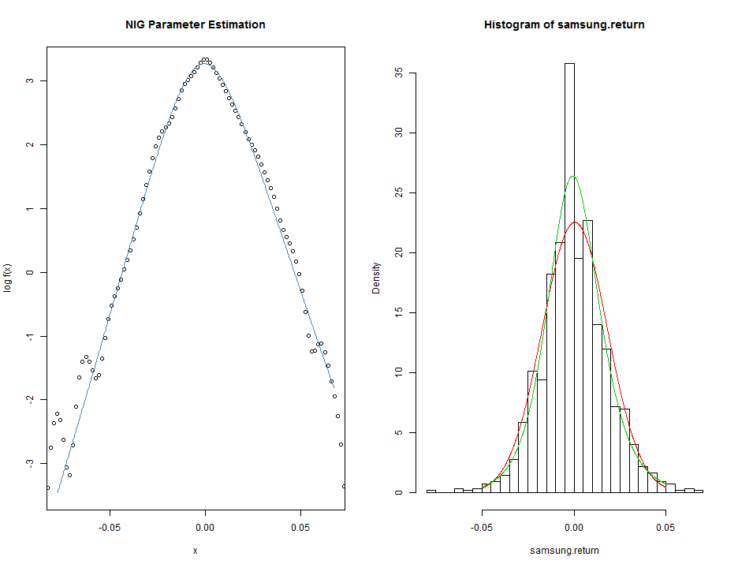 

#### 2. KT corporation

```r
par(mfrow = c(1, 2))
nigFit(kt.return)
```

```
## 
##  Objective Function Value:   -1445
##  Parameter Estimates:        1 0 1 0 
## 
##  Objective Function Value:   -1445
##  Parameter Estimates:        1 0 1 0 
## 
##  Objective Function Value:   -1445
##  Parameter Estimates:        1 1.49e-08 1 0 
## 
##  Objective Function Value:   -1445
##  Parameter Estimates:        1 0 1 0 
## 
##  Objective Function Value:   -1445
##  Parameter Estimates:        1 0 1 1.49e-08 
## 
##  Objective Function Value:   -2352
##  Parameter Estimates:        1.097 -0.6549 0.4453 -0.504 
## 
##  Objective Function Value:   -1451
##  Parameter Estimates:        1.01 -0.06549 0.9445 -0.0504 
## 
##  Objective Function Value:   -1445
##  Parameter Estimates:        1.001 -0.008723 0.9926 -0.006713 
## 
##  Objective Function Value:   -1445
##  Parameter Estimates:        1.001 -0.008723 0.9926 -0.006713 
## 
##  Objective Function Value:   -1445
##  Parameter Estimates:        1.001 -0.008687 0.9926 -0.006713 
## 
##  Objective Function Value:   -1445
##  Parameter Estimates:        1.001 -0.008723 0.9926 -0.006713 
## 
##  Objective Function Value:   -1445
##  Parameter Estimates:        1.001 -0.008723 0.9926 -0.006677 
## 
##  Objective Function Value:   -1445
##  Parameter Estimates:        1.001 -0.006823 0.9825 0.001802 
## 
##  Objective Function Value:   -1445
##  Parameter Estimates:        1.001 -0.006823 0.9825 0.001802 
## 
##  Objective Function Value:   -1445
##  Parameter Estimates:        1.001 -0.006824 0.9825 0.001802 
## 
##  Objective Function Value:   -1445
##  Parameter Estimates:        1.001 -0.006823 0.9826 0.001802 
## 
##  Objective Function Value:   -1445
##  Parameter Estimates:        1.001 -0.006823 0.9825 0.001801 
## 
##  Objective Function Value:   -1445
##  Parameter Estimates:        0.9967 -0.01637 0.9761 -0.00312 
## 
##  Objective Function Value:   -1445
##  Parameter Estimates:        0.9967 -0.01637 0.9761 -0.00312 
## 
##  Objective Function Value:   -1445
##  Parameter Estimates:        0.9967 -0.01637 0.9761 -0.00312 
## 
##  Objective Function Value:   -1445
##  Parameter Estimates:        0.9967 -0.01637 0.9761 -0.00312 
## 
##  Objective Function Value:   -1445
##  Parameter Estimates:        0.9967 -0.01637 0.9761 -0.003119 
## 
##  Objective Function Value:   -1445
##  Parameter Estimates:        0.9873 -0.01601 0.9712 0.005037 
## 
##  Objective Function Value:   -1445
##  Parameter Estimates:        0.9874 -0.01601 0.9712 0.005037 
## 
##  Objective Function Value:   -1445
##  Parameter Estimates:        0.9873 -0.01601 0.9712 0.005037 
## 
##  Objective Function Value:   -1445
##  Parameter Estimates:        0.9873 -0.01601 0.9712 0.005037 
## 
##  Objective Function Value:   -1445
##  Parameter Estimates:        0.9873 -0.01601 0.9712 0.005036 
## 
##  Objective Function Value:   -1445
##  Parameter Estimates:        0.9654 -0.02332 0.9581 0.003768 
## 
##  Objective Function Value:   -1445
##  Parameter Estimates:        0.9654 -0.02332 0.9581 0.003768 
## 
##  Objective Function Value:   -1445
##  Parameter Estimates:        0.9654 -0.02332 0.9581 0.003768 
## 
##  Objective Function Value:   -1445
##  Parameter Estimates:        0.9654 -0.02332 0.9581 0.003768 
## 
##  Objective Function Value:   -1445
##  Parameter Estimates:        0.9654 -0.02332 0.9581 0.003769 
## 
##  Objective Function Value:   -1445
##  Parameter Estimates:        0.9395 3.204e-06 0.9192 -0.006903 
## 
##  Objective Function Value:   -1445
##  Parameter Estimates:        0.9545 -0.01137 0.9408 0.002805 
## 
##  Objective Function Value:   -1445
##  Parameter Estimates:        0.9545 -0.01137 0.9408 0.002805 
## 
##  Objective Function Value:   -1445
##  Parameter Estimates:        0.9545 -0.01137 0.9408 0.002805 
## 
##  Objective Function Value:   -1445
##  Parameter Estimates:        0.9545 -0.01137 0.9409 0.002805 
## 
##  Objective Function Value:   -1445
##  Parameter Estimates:        0.9545 -0.01137 0.9408 0.002803 
## 
##  Objective Function Value:   -1445
##  Parameter Estimates:        0.9309 -0.01269 0.9409 0.002202 
## 
##  Objective Function Value:   -1445
##  Parameter Estimates:        0.9309 -0.01269 0.9409 0.002202 
## 
##  Objective Function Value:   -1445
##  Parameter Estimates:        0.9309 -0.01269 0.9409 0.002202 
## 
##  Objective Function Value:   -1445
##  Parameter Estimates:        0.9309 -0.01269 0.9409 0.002202 
## 
##  Objective Function Value:   -1445
##  Parameter Estimates:        0.9309 -0.01269 0.9409 0.002203 
## 
##  Objective Function Value:   -1445
##  Parameter Estimates:        0.9383 -0.02409 0.9222 -0.002603 
## 
##  Objective Function Value:   -1445
##  Parameter Estimates:        0.9331 -0.01608 0.9354 0.0007755 
## 
##  Objective Function Value:   -1445
##  Parameter Estimates:        0.9331 -0.01608 0.9354 0.0007755 
## 
##  Objective Function Value:   -1445
##  Parameter Estimates:        0.9331 -0.01607 0.9354 0.0007755 
## 
##  Objective Function Value:   -1445
##  Parameter Estimates:        0.9331 -0.01608 0.9354 0.0007755 
## 
##  Objective Function Value:   -1445
##  Parameter Estimates:        0.9331 -0.01608 0.9354 0.0007795 
## 
##  Objective Function Value:   -1445
##  Parameter Estimates:        0.9331 -0.0137 0.9324 0.006666 
## 
##  Objective Function Value:   -1445
##  Parameter Estimates:        0.9331 -0.01517 0.9343 0.003012 
## 
##  Objective Function Value:   -1445
##  Parameter Estimates:        0.9332 -0.01517 0.9343 0.003012 
## 
##  Objective Function Value:   -1445
##  Parameter Estimates:        0.9331 -0.01517 0.9343 0.003012 
## 
##  Objective Function Value:   -1445
##  Parameter Estimates:        0.9331 -0.01517 0.9343 0.003012 
## 
##  Objective Function Value:   -1445
##  Parameter Estimates:        0.9331 -0.01517 0.9343 0.003012 
## 
##  Objective Function Value:   -1445
##  Parameter Estimates:        0.9331 -0.01517 0.9343 0.00301 
## 
##  Objective Function Value:   -1445
##  Parameter Estimates:        0.9327 -0.01712 0.9325 0.002915 
## 
##  Objective Function Value:   -1445
##  Parameter Estimates:        0.9327 -0.01712 0.9325 0.002915 
## 
##  Objective Function Value:   -1445
##  Parameter Estimates:        0.9327 -0.01712 0.9325 0.002915 
## 
##  Objective Function Value:   -1445
##  Parameter Estimates:        0.9327 -0.01712 0.9325 0.002915 
## 
##  Objective Function Value:   -1445
##  Parameter Estimates:        0.9327 -0.01712 0.9325 0.002919 
## 
##  Objective Function Value:   -1445
##  Parameter Estimates:        0.9327 -0.01712 0.9325 0.002912 
## 
##  Objective Function Value:   -1445
##  Parameter Estimates:        0.9304 -0.01928 0.9314 0.007091 
## 
##  Objective Function Value:   -1445
##  Parameter Estimates:        0.9305 -0.01928 0.9314 0.007091 
## 
##  Objective Function Value:   -1445
##  Parameter Estimates:        0.9304 -0.01928 0.9314 0.007091 
## 
##  Objective Function Value:   -1445
##  Parameter Estimates:        0.9304 -0.01929 0.9314 0.007091 
## 
##  Objective Function Value:   -1445
##  Parameter Estimates:        0.9304 -0.01928 0.9314 0.007091 
## 
##  Objective Function Value:   -1445
##  Parameter Estimates:        0.9304 -0.01928 0.9314 0.00709 
## 
##  Objective Function Value:   -1445
##  Parameter Estimates:        0.9264 -0.01921 0.9286 0.005061 
## 
##  Objective Function Value:   -1445
##  Parameter Estimates:        0.9264 -0.01921 0.9286 0.005061 
## 
##  Objective Function Value:   -1445
##  Parameter Estimates:        0.9264 -0.01921 0.9286 0.005061 
## 
##  Objective Function Value:   -1445
##  Parameter Estimates:        0.9264 -0.01921 0.9286 0.005061 
## 
##  Objective Function Value:   -1445
##  Parameter Estimates:        0.9264 -0.01921 0.9286 0.005062 
## 
##  Objective Function Value:   -1445
##  Parameter Estimates:        0.9226 -0.01686 0.9258 0.004761 
## 
##  Objective Function Value:   -1445
##  Parameter Estimates:        0.9226 -0.01686 0.9258 0.004761 
## 
##  Objective Function Value:   -1445
##  Parameter Estimates:        0.9226 -0.01686 0.9258 0.004761 
## 
##  Objective Function Value:   -1445
##  Parameter Estimates:        0.9226 -0.01686 0.9258 0.004761 
## 
##  Objective Function Value:   -1445
##  Parameter Estimates:        0.9226 -0.01686 0.9258 0.00476 
## 
##  Objective Function Value:   -1445
##  Parameter Estimates:        0.9191 -0.02016 0.9246 0.006797 
## 
##  Objective Function Value:   -1445
##  Parameter Estimates:        0.9191 -0.02016 0.9246 0.006797 
## 
##  Objective Function Value:   -1445
##  Parameter Estimates:        0.9191 -0.02016 0.9246 0.006797 
## 
##  Objective Function Value:   -1445
##  Parameter Estimates:        0.9191 -0.02016 0.9246 0.006797 
## 
##  Objective Function Value:   -1445
##  Parameter Estimates:        0.9191 -0.02016 0.9246 0.006799 
## 
##  Objective Function Value:   -1445
##  Parameter Estimates:        0.9183 -0.02027 0.9203 0.003715 
## 
##  Objective Function Value:   -1445
##  Parameter Estimates:        0.9195 -0.02047 0.9236 0.006256 
## 
##  Objective Function Value:   -1445
##  Parameter Estimates:        0.9195 -0.02047 0.9236 0.006256 
## 
##  Objective Function Value:   -1445
##  Parameter Estimates:        0.9195 -0.02047 0.9236 0.006256 
## 
##  Objective Function Value:   -1445
##  Parameter Estimates:        0.9195 -0.02047 0.9236 0.006256 
## 
##  Objective Function Value:   -1445
##  Parameter Estimates:        0.9195 -0.02047 0.9236 0.006256 
## 
##  Objective Function Value:   -1445
##  Parameter Estimates:        0.9195 -0.02047 0.9236 0.006258 
## 
##  Objective Function Value:   -1445
##  Parameter Estimates:        0.9186 -0.01993 0.9231 0.006311 
## 
##  Objective Function Value:   -1445
##  Parameter Estimates:        0.9187 -0.01993 0.9231 0.006311 
## 
##  Objective Function Value:   -1445
##  Parameter Estimates:        0.9186 -0.01993 0.9231 0.006311 
## 
##  Objective Function Value:   -1445
##  Parameter Estimates:        0.9186 -0.01993 0.9231 0.006311 
## 
##  Objective Function Value:   -1445
##  Parameter Estimates:        0.9186 -0.01993 0.9231 0.006311 
## 
##  Objective Function Value:   -1445
##  Parameter Estimates:        0.9186 -0.01993 0.9231 0.006311 
## 
##  Objective Function Value:   -1445
##  Parameter Estimates:        0.9186 -0.01993 0.9231 0.00631 
## 
##  Objective Function Value:   -1445
##  Parameter Estimates:        0.9178 -0.01967 0.9224 0.005951 
## 
##  Objective Function Value:   -1445
##  Parameter Estimates:        0.9178 -0.01967 0.9224 0.005951 
## 
##  Objective Function Value:   -1445
##  Parameter Estimates:        0.9178 -0.01967 0.9224 0.005951 
## 
##  Objective Function Value:   -1445
##  Parameter Estimates:        0.9178 -0.01966 0.9224 0.005951 
## 
##  Objective Function Value:   -1445
##  Parameter Estimates:        0.9178 -0.01968 0.9224 0.005951 
## 
##  Objective Function Value:   -1445
##  Parameter Estimates:        0.9178 -0.01967 0.9224 0.005951 
## 
##  Objective Function Value:   -1445
##  Parameter Estimates:        0.9178 -0.01967 0.9224 0.005951 
## 
##  Objective Function Value:   -1445
##  Parameter Estimates:        0.9178 -0.01967 0.9224 0.005959 
## 
##  Objective Function Value:   -1445
##  Parameter Estimates:        0.9178 -0.01967 0.9224 0.005942 
## 
##  Objective Function Value:   -1445
##  Parameter Estimates:        0.9176 -0.02021 0.9215 0.006427 
## 
##  Objective Function Value:   -1445
##  Parameter Estimates:        0.9177 -0.01985 0.922 0.00618 
## 
##  Objective Function Value:   -1445
##  Parameter Estimates:        0.9178 -0.01985 0.922 0.00618 
## 
##  Objective Function Value:   -1445
##  Parameter Estimates:        0.9177 -0.01985 0.922 0.00618 
## 
##  Objective Function Value:   -1445
##  Parameter Estimates:        0.9177 -0.01985 0.922 0.00618 
## 
##  Objective Function Value:   -1445
##  Parameter Estimates:        0.9177 -0.01985 0.922 0.00618 
## 
##  Objective Function Value:   -1445
##  Parameter Estimates:        0.9177 -0.01985 0.922 0.00618 
## 
##  Objective Function Value:   -1445
##  Parameter Estimates:        0.9177 -0.01985 0.922 0.00618 
## 
##  Objective Function Value:   -1445
##  Parameter Estimates:        0.9177 -0.01985 0.922 0.006181 
## 
##  Objective Function Value:   -1445
##  Parameter Estimates:        0.9177 -0.01985 0.922 0.006178 
## 
##  Objective Function Value:   -1445
##  Parameter Estimates:        0.9173 -0.01981 0.9219 0.006252 
## 
##  Objective Function Value:   -1445
##  Parameter Estimates:        0.9173 -0.01981 0.9219 0.006252 
## 
##  Objective Function Value:   -1445
##  Parameter Estimates:        0.9173 -0.01981 0.9219 0.006252 
## 
##  Objective Function Value:   -1445
##  Parameter Estimates:        0.9173 -0.0198 0.9219 0.006252 
## 
##  Objective Function Value:   -1445
##  Parameter Estimates:        0.9173 -0.01982 0.9219 0.006252 
## 
##  Objective Function Value:   -1445
##  Parameter Estimates:        0.9173 -0.01981 0.9219 0.006252 
## 
##  Objective Function Value:   -1445
##  Parameter Estimates:        0.9173 -0.01981 0.9219 0.006252 
## 
##  Objective Function Value:   -1445
##  Parameter Estimates:        0.9173 -0.01981 0.9219 0.006257 
## 
##  Objective Function Value:   -1445
##  Parameter Estimates:        0.9173 -0.01981 0.9219 0.006247 
## 
##  Objective Function Value:   -1445
##  Parameter Estimates:        0.9169 -0.01988 0.9217 0.006247 
## 
##  Objective Function Value:   -1445
##  Parameter Estimates:        0.9169 -0.01988 0.9217 0.006247 
## 
##  Objective Function Value:   -1445
##  Parameter Estimates:        0.9169 -0.01988 0.9217 0.006247 
## 
##  Objective Function Value:   -1445
##  Parameter Estimates:        0.9169 -0.01988 0.9217 0.006247 
## 
##  Objective Function Value:   -1445
##  Parameter Estimates:        0.9169 -0.01988 0.9217 0.006247 
## 
##  Objective Function Value:   -1445
##  Parameter Estimates:        0.9169 -0.01988 0.9217 0.006247 
## 
##  Objective Function Value:   -1445
##  Parameter Estimates:        0.9169 -0.01988 0.9216 0.006247 
## 
##  Objective Function Value:   -1445
##  Parameter Estimates:        0.9169 -0.01988 0.9217 0.006251 
## 
##  Objective Function Value:   -1445
##  Parameter Estimates:        0.9169 -0.01988 0.9217 0.006244 
## 
##  Objective Function Value:   -1445
##  Parameter Estimates:        0.9169 -0.01987 0.9216 0.006238 
## 
##  Objective Function Value:   -1445
##  Parameter Estimates:        0.9169 -0.01987 0.9216 0.006238 
## 
##  Objective Function Value:   -1445
##  Parameter Estimates:        0.9168 -0.01987 0.9216 0.006238 
## 
##  Objective Function Value:   -1445
##  Parameter Estimates:        0.9169 -0.01985 0.9216 0.006238 
## 
##  Objective Function Value:   -1445
##  Parameter Estimates:        0.9169 -0.0199 0.9216 0.006238 
## 
##  Objective Function Value:   -1445
##  Parameter Estimates:        0.9169 -0.01987 0.9216 0.006238 
## 
##  Objective Function Value:   -1445
##  Parameter Estimates:        0.9169 -0.01987 0.9216 0.006238 
## 
##  Objective Function Value:   -1445
##  Parameter Estimates:        0.9169 -0.01987 0.9216 0.006255 
## 
##  Objective Function Value:   -1445
##  Parameter Estimates:        0.9169 -0.01987 0.9216 0.006221 
## 
##  Objective Function Value:   -1445
##  Parameter Estimates:        0.9169 -0.01987 0.9216 0.006238 
## 
##  Objective Function Value:   2907
##  Parameter Estimates:        55.41 -1.201 0.01525 0.0001032
```

```
## Warning: NaN이 생성되었습니다
```

```
## 
## Title:
##  Normal Inverse Gaussian Parameter Estimation 
## 
## Call:
##  .nigFit.mle(x = x, alpha = alpha, beta = beta, delta = delta, 
##     mu = mu, scale = scale, doplot = doplot, span = span, trace = trace, 
##     title = title, description = description)
## 
## Model:
##  Normal Inverse Gaussian Distribution
## 
## Estimated Parameter(s):
##      alpha       beta      delta         mu 
## 55.4120323 -1.2010780  0.0152491  0.0001032 
## 
## Description:
##  Sat Apr 19 00:02:52 2014 by user: user
```

```r
hist(kt.return, prob = T, nclass = 50)
x <- seq(from = -0.05, to = 0.05, by = 1e-04)
lines(x, dnorm(x, mean(kt.return), sd(kt.return)), col = 2)
lines(x, dnig(x, 55.4120323065, -1.2010779678, 0.0152491054, 0.0001032147), 
    col = 3)
```

 

#### 3. LG Display Co., Ltd

```r
par(mfrow = c(1, 2))
nigFit(lg.return)
```

```
## 
##  Objective Function Value:   -1459
##  Parameter Estimates:        1 0 1 0 
## 
##  Objective Function Value:   -1459
##  Parameter Estimates:        1 0 1 0 
## 
##  Objective Function Value:   -1459
##  Parameter Estimates:        1 1.49e-08 1 0 
## 
##  Objective Function Value:   -1459
##  Parameter Estimates:        1 0 1 0 
## 
##  Objective Function Value:   -1459
##  Parameter Estimates:        1 0 1 1.49e-08 
## 
##  Objective Function Value:   -2327
##  Parameter Estimates:        0.9387 -0.4512 1.385 -0.8028 
## 
##  Objective Function Value:   -1466
##  Parameter Estimates:        0.9939 -0.04512 1.038 -0.08028 
## 
##  Objective Function Value:   -1459
##  Parameter Estimates:        0.9989 -0.007874 1.007 -0.01401 
## 
##  Objective Function Value:   -1459
##  Parameter Estimates:        0.999 -0.007874 1.007 -0.01401 
## 
##  Objective Function Value:   -1459
##  Parameter Estimates:        0.9989 -0.007838 1.007 -0.01401 
## 
##  Objective Function Value:   -1459
##  Parameter Estimates:        0.9989 -0.007874 1.007 -0.01401 
## 
##  Objective Function Value:   -1459
##  Parameter Estimates:        0.9989 -0.007874 1.007 -0.01397 
## 
##  Objective Function Value:   -1459
##  Parameter Estimates:        0.9991 0.003348 1.02 -0.01347 
## 
##  Objective Function Value:   -1459
##  Parameter Estimates:        0.9991 0.003348 1.02 -0.01347 
## 
##  Objective Function Value:   -1459
##  Parameter Estimates:        0.9991 0.003346 1.02 -0.01347 
## 
##  Objective Function Value:   -1459
##  Parameter Estimates:        0.9991 0.003348 1.02 -0.01347 
## 
##  Objective Function Value:   -1459
##  Parameter Estimates:        0.9991 0.003348 1.02 -0.01347 
## 
##  Objective Function Value:   -1459
##  Parameter Estimates:        0.9991 0.003348 1.02 -0.01347 
## 
##  Objective Function Value:   -1459
##  Parameter Estimates:        1.006 0.0003497 1.025 -0.02826 
## 
##  Objective Function Value:   -1459
##  Parameter Estimates:        1.006 0.0003497 1.025 -0.02826 
## 
##  Objective Function Value:   -1459
##  Parameter Estimates:        1.006 0.0003511 1.025 -0.02826 
## 
##  Objective Function Value:   -1459
##  Parameter Estimates:        1.006 0.0003497 1.025 -0.02826 
## 
##  Objective Function Value:   -1459
##  Parameter Estimates:        1.006 0.0003497 1.025 -0.02826 
## 
##  Objective Function Value:   -1459
##  Parameter Estimates:        1.018 0.01281 1.029 -0.02678 
## 
##  Objective Function Value:   -1459
##  Parameter Estimates:        1.018 0.01281 1.029 -0.02678 
## 
##  Objective Function Value:   -1459
##  Parameter Estimates:        1.018 0.01281 1.029 -0.02678 
## 
##  Objective Function Value:   -1459
##  Parameter Estimates:        1.018 0.01281 1.029 -0.02678 
## 
##  Objective Function Value:   -1459
##  Parameter Estimates:        1.018 0.01281 1.029 -0.02679 
## 
##  Objective Function Value:   -1459
##  Parameter Estimates:        1.029 0.01305 1.04 -0.03466 
## 
##  Objective Function Value:   -1459
##  Parameter Estimates:        1.029 0.01305 1.04 -0.03466 
## 
##  Objective Function Value:   -1459
##  Parameter Estimates:        1.029 0.01306 1.04 -0.03466 
## 
##  Objective Function Value:   -1459
##  Parameter Estimates:        1.029 0.01305 1.04 -0.03466 
## 
##  Objective Function Value:   -1459
##  Parameter Estimates:        1.029 0.01305 1.04 -0.03466 
## 
##  Objective Function Value:   -1459
##  Parameter Estimates:        1.057 0.01391 1.059 -0.0258 
## 
##  Objective Function Value:   -1459
##  Parameter Estimates:        1.057 0.01391 1.059 -0.0258 
## 
##  Objective Function Value:   -1459
##  Parameter Estimates:        1.057 0.01391 1.059 -0.0258 
## 
##  Objective Function Value:   -1459
##  Parameter Estimates:        1.057 0.01391 1.059 -0.0258 
## 
##  Objective Function Value:   -1459
##  Parameter Estimates:        1.057 0.01391 1.059 -0.0258 
## 
##  Objective Function Value:   -1459
##  Parameter Estimates:        1.082 0.0283 1.063 -0.04491 
## 
##  Objective Function Value:   -1459
##  Parameter Estimates:        1.068 0.01915 1.062 -0.03689 
## 
##  Objective Function Value:   -1459
##  Parameter Estimates:        1.068 0.01915 1.062 -0.03689 
## 
##  Objective Function Value:   -1459
##  Parameter Estimates:        1.068 0.01915 1.062 -0.03689 
## 
##  Objective Function Value:   -1459
##  Parameter Estimates:        1.068 0.01915 1.062 -0.03689 
## 
##  Objective Function Value:   -1459
##  Parameter Estimates:        1.068 0.01915 1.062 -0.03688 
## 
##  Objective Function Value:   -1459
##  Parameter Estimates:        1.065 0.01984 1.078 -0.03582 
## 
##  Objective Function Value:   -1459
##  Parameter Estimates:        1.065 0.01984 1.078 -0.03582 
## 
##  Objective Function Value:   -1459
##  Parameter Estimates:        1.065 0.01983 1.078 -0.03582 
## 
##  Objective Function Value:   -1459
##  Parameter Estimates:        1.065 0.01984 1.078 -0.03582 
## 
##  Objective Function Value:   -1459
##  Parameter Estimates:        1.065 0.01984 1.078 -0.03583 
## 
##  Objective Function Value:   -1459
##  Parameter Estimates:        1.071 0.02189 1.073 -0.03424 
## 
##  Objective Function Value:   -1459
##  Parameter Estimates:        1.071 0.02189 1.073 -0.03424 
## 
##  Objective Function Value:   -1459
##  Parameter Estimates:        1.071 0.02188 1.073 -0.03424 
## 
##  Objective Function Value:   -1459
##  Parameter Estimates:        1.071 0.02189 1.073 -0.03424 
## 
##  Objective Function Value:   -1459
##  Parameter Estimates:        1.071 0.02189 1.073 -0.03424 
## 
##  Objective Function Value:   -1459
##  Parameter Estimates:        1.074 0.01667 1.074 -0.04002 
## 
##  Objective Function Value:   -1459
##  Parameter Estimates:        1.072 0.02069 1.073 -0.03587 
## 
##  Objective Function Value:   -1459
##  Parameter Estimates:        1.072 0.02069 1.073 -0.03587 
## 
##  Objective Function Value:   -1459
##  Parameter Estimates:        1.072 0.02069 1.073 -0.03587 
## 
##  Objective Function Value:   -1459
##  Parameter Estimates:        1.072 0.02069 1.073 -0.03587 
## 
##  Objective Function Value:   -1459
##  Parameter Estimates:        1.072 0.02069 1.073 -0.03587 
## 
##  Objective Function Value:   -1459
##  Parameter Estimates:        1.072 0.02069 1.073 -0.03587 
## 
##  Objective Function Value:   -1459
##  Parameter Estimates:        1.073 0.02168 1.074 -0.03545 
## 
##  Objective Function Value:   -1459
##  Parameter Estimates:        1.073 0.02168 1.074 -0.03545 
## 
##  Objective Function Value:   -1459
##  Parameter Estimates:        1.073 0.02168 1.074 -0.03545 
## 
##  Objective Function Value:   -1459
##  Parameter Estimates:        1.073 0.02168 1.074 -0.03545 
## 
##  Objective Function Value:   -1459
##  Parameter Estimates:        1.073 0.02168 1.074 -0.03545 
## 
##  Objective Function Value:   -1459
##  Parameter Estimates:        1.073 0.02168 1.074 -0.03545 
## 
##  Objective Function Value:   -1459
##  Parameter Estimates:        1.076 0.01949 1.076 -0.03508 
## 
##  Objective Function Value:   -1459
##  Parameter Estimates:        1.076 0.01949 1.076 -0.03508 
## 
##  Objective Function Value:   -1459
##  Parameter Estimates:        1.076 0.01949 1.076 -0.03508 
## 
##  Objective Function Value:   -1459
##  Parameter Estimates:        1.076 0.01949 1.076 -0.03508 
## 
##  Objective Function Value:   -1459
##  Parameter Estimates:        1.076 0.01949 1.076 -0.03508 
## 
##  Objective Function Value:   -1459
##  Parameter Estimates:        1.082 0.02262 1.081 -0.03671 
## 
##  Objective Function Value:   -1459
##  Parameter Estimates:        1.082 0.02262 1.081 -0.03671 
## 
##  Objective Function Value:   -1459
##  Parameter Estimates:        1.082 0.02262 1.081 -0.03671 
## 
##  Objective Function Value:   -1459
##  Parameter Estimates:        1.082 0.02262 1.081 -0.03671 
## 
##  Objective Function Value:   -1459
##  Parameter Estimates:        1.082 0.02262 1.081 -0.03671 
## 
##  Objective Function Value:   -1459
##  Parameter Estimates:        1.088 0.01854 1.084 -0.03303 
## 
##  Objective Function Value:   -1459
##  Parameter Estimates:        1.088 0.01854 1.084 -0.03303 
## 
##  Objective Function Value:   -1459
##  Parameter Estimates:        1.088 0.01854 1.084 -0.03303 
## 
##  Objective Function Value:   -1459
##  Parameter Estimates:        1.088 0.01854 1.084 -0.03303 
## 
##  Objective Function Value:   -1459
##  Parameter Estimates:        1.088 0.01854 1.084 -0.03303 
## 
##  Objective Function Value:   -1459
##  Parameter Estimates:        1.088 0.01854 1.084 -0.03303 
## 
##  Objective Function Value:   -1459
##  Parameter Estimates:        1.088 0.01854 1.084 -0.03302 
## 
##  Objective Function Value:   -1459
##  Parameter Estimates:        1.091 0.01887 1.086 -0.04089 
## 
##  Objective Function Value:   -1459
##  Parameter Estimates:        1.088 0.01859 1.084 -0.03414 
## 
##  Objective Function Value:   -1459
##  Parameter Estimates:        1.088 0.01859 1.084 -0.03414 
## 
##  Objective Function Value:   -1459
##  Parameter Estimates:        1.088 0.01859 1.084 -0.03414 
## 
##  Objective Function Value:   -1459
##  Parameter Estimates:        1.088 0.01858 1.084 -0.03414 
## 
##  Objective Function Value:   -1459
##  Parameter Estimates:        1.088 0.01859 1.084 -0.03414 
## 
##  Objective Function Value:   -1459
##  Parameter Estimates:        1.088 0.01859 1.084 -0.03414 
## 
##  Objective Function Value:   -1459
##  Parameter Estimates:        1.089 0.01961 1.085 -0.03406 
## 
##  Objective Function Value:   -1459
##  Parameter Estimates:        1.089 0.01961 1.085 -0.03406 
## 
##  Objective Function Value:   -1459
##  Parameter Estimates:        1.089 0.01961 1.085 -0.03406 
## 
##  Objective Function Value:   -1459
##  Parameter Estimates:        1.089 0.01961 1.085 -0.03406 
## 
##  Objective Function Value:   -1459
##  Parameter Estimates:        1.089 0.01961 1.085 -0.03405 
## 
##  Objective Function Value:   -1459
##  Parameter Estimates:        1.089 0.01961 1.085 -0.03406 
## 
##  Objective Function Value:   -1459
##  Parameter Estimates:        1.091 0.02024 1.085 -0.03529 
## 
##  Objective Function Value:   -1459
##  Parameter Estimates:        1.091 0.02024 1.085 -0.03529 
## 
##  Objective Function Value:   -1459
##  Parameter Estimates:        1.091 0.02025 1.085 -0.03529 
## 
##  Objective Function Value:   -1459
##  Parameter Estimates:        1.091 0.02023 1.085 -0.03529 
## 
##  Objective Function Value:   -1459
##  Parameter Estimates:        1.091 0.02024 1.085 -0.03529 
## 
##  Objective Function Value:   -1459
##  Parameter Estimates:        1.091 0.02024 1.085 -0.03529 
## 
##  Objective Function Value:   -1459
##  Parameter Estimates:        1.094 0.02092 1.089 -0.03605 
## 
##  Objective Function Value:   -1459
##  Parameter Estimates:        1.094 0.02092 1.089 -0.03605 
## 
##  Objective Function Value:   -1459
##  Parameter Estimates:        1.094 0.02092 1.089 -0.03605 
## 
##  Objective Function Value:   -1459
##  Parameter Estimates:        1.094 0.02092 1.089 -0.03605 
## 
##  Objective Function Value:   -1459
##  Parameter Estimates:        1.094 0.02092 1.089 -0.03605 
## 
##  Objective Function Value:   -1459
##  Parameter Estimates:        1.094 0.02092 1.089 -0.03605 
## 
##  Objective Function Value:   -1459
##  Parameter Estimates:        1.094 0.02092 1.089 -0.03605 
## 
##  Objective Function Value:   -1459
##  Parameter Estimates:        1.098 0.02239 1.091 -0.03684 
## 
##  Objective Function Value:   -1459
##  Parameter Estimates:        1.098 0.02239 1.091 -0.03684 
## 
##  Objective Function Value:   -1459
##  Parameter Estimates:        1.098 0.02239 1.091 -0.03684 
## 
##  Objective Function Value:   -1459
##  Parameter Estimates:        1.098 0.02239 1.091 -0.03684 
## 
##  Objective Function Value:   -1459
##  Parameter Estimates:        1.098 0.02239 1.091 -0.03684 
## 
##  Objective Function Value:   -1459
##  Parameter Estimates:        1.098 0.02239 1.091 -0.03684 
## 
##  Objective Function Value:   -1459
##  Parameter Estimates:        1.098 0.02239 1.091 -0.03684 
## 
##  Objective Function Value:   -1459
##  Parameter Estimates:        1.1 0.02324 1.093 -0.0376 
## 
##  Objective Function Value:   -1459
##  Parameter Estimates:        1.1 0.02324 1.093 -0.0376 
## 
##  Objective Function Value:   -1459
##  Parameter Estimates:        1.1 0.02324 1.093 -0.0376 
## 
##  Objective Function Value:   -1459
##  Parameter Estimates:        1.1 0.02325 1.093 -0.0376 
## 
##  Objective Function Value:   -1459
##  Parameter Estimates:        1.1 0.02324 1.093 -0.0376 
## 
##  Objective Function Value:   -1459
##  Parameter Estimates:        1.1 0.02324 1.093 -0.0376 
## 
##  Objective Function Value:   -1459
##  Parameter Estimates:        1.1 0.02324 1.093 -0.0376 
## 
##  Objective Function Value:   -1459
##  Parameter Estimates:        1.1 0.02324 1.093 -0.03759 
## 
##  Objective Function Value:   -1459
##  Parameter Estimates:        1.1 0.02324 1.093 -0.0376 
## 
##  Objective Function Value:   -1459
##  Parameter Estimates:        1.1 0.02318 1.093 -0.03753 
## 
##  Objective Function Value:   -1459
##  Parameter Estimates:        1.1 0.02318 1.093 -0.03753 
## 
##  Objective Function Value:   -1459
##  Parameter Estimates:        1.1 0.02318 1.093 -0.03753 
## 
##  Objective Function Value:   -1459
##  Parameter Estimates:        1.1 0.0232 1.093 -0.03753 
## 
##  Objective Function Value:   -1459
##  Parameter Estimates:        1.1 0.02315 1.093 -0.03753 
## 
##  Objective Function Value:   -1459
##  Parameter Estimates:        1.1 0.02318 1.093 -0.03753 
## 
##  Objective Function Value:   -1459
##  Parameter Estimates:        1.1 0.02318 1.093 -0.03753 
## 
##  Objective Function Value:   -1459
##  Parameter Estimates:        1.1 0.02318 1.093 -0.03752 
## 
##  Objective Function Value:   -1459
##  Parameter Estimates:        1.1 0.02318 1.093 -0.03754 
## 
##  Objective Function Value:   -1459
##  Parameter Estimates:        1.1 0.02318 1.093 -0.03753 
## 
##  Objective Function Value:   -1459
##  Parameter Estimates:        1.1 0.02318 1.093 -0.03753 
## 
##  Objective Function Value:   -1459
##  Parameter Estimates:        1.1 0.02318 1.093 -0.03753 
## 
##  Objective Function Value:   -1459
##  Parameter Estimates:        1.1 0.02321 1.093 -0.03753 
## 
##  Objective Function Value:   -1459
##  Parameter Estimates:        1.1 0.02316 1.093 -0.03753 
## 
##  Objective Function Value:   -1459
##  Parameter Estimates:        1.1 0.02318 1.093 -0.03753 
## 
##  Objective Function Value:   -1459
##  Parameter Estimates:        1.1 0.02318 1.093 -0.03753 
## 
##  Objective Function Value:   -1459
##  Parameter Estimates:        1.1 0.02318 1.093 -0.03751 
## 
##  Objective Function Value:   -1459
##  Parameter Estimates:        1.1 0.02318 1.093 -0.03755 
## 
##  Objective Function Value:   -1459
##  Parameter Estimates:        1.1 0.02318 1.093 -0.03753 
## 
##  Objective Function Value:   2393
##  Parameter Estimates:        41.66 0.8778 0.02886 -0.0009913
```

```
## Warning: NaN이 생성되었습니다
```

```
## 
## Title:
##  Normal Inverse Gaussian Parameter Estimation 
## 
## Call:
##  .nigFit.mle(x = x, alpha = alpha, beta = beta, delta = delta, 
##     mu = mu, scale = scale, doplot = doplot, span = span, trace = trace, 
##     title = title, description = description)
## 
## Model:
##  Normal Inverse Gaussian Distribution
## 
## Estimated Parameter(s):
##      alpha       beta      delta         mu 
## 41.6633982  0.8777504  0.0288644 -0.0009913 
## 
## Description:
##  Sat Apr 19 00:02:53 2014 by user: user
```

```r
hist(lg.return, prob = T, nclass = 50)
x <- seq(from = -0.1, to = 0.15, by = 1e-04)
lines(x, dnorm(x, mean = mean(lg.return), sd(lg.return)), col = 2)
lines(x, dnig(x, 41.6633981699, 0.8777504231, 0.0288644214, -0.0009912696), 
    col = 3)
```

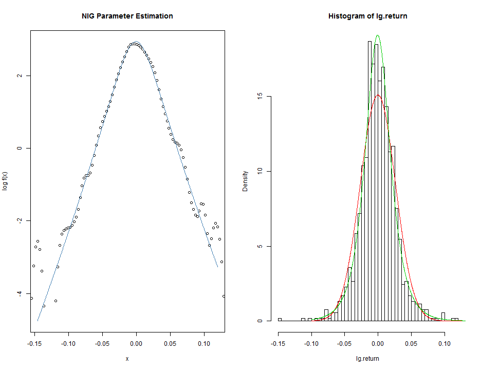 

#### 4. BMW

```r
par(mfrow = c(1, 2))
nigFit(bmw.return)
```

```
## 
##  Objective Function Value:   -1509
##  Parameter Estimates:        1 0 1 0 
## 
##  Objective Function Value:   -1509
##  Parameter Estimates:        1 0 1 0 
## 
##  Objective Function Value:   -1509
##  Parameter Estimates:        1 1.49e-08 1 0 
## 
##  Objective Function Value:   -1509
##  Parameter Estimates:        1 0 1 0 
## 
##  Objective Function Value:   -1509
##  Parameter Estimates:        1 0 1 1.49e-08 
## 
##  Objective Function Value:   -2577
##  Parameter Estimates:        0.9512 0.5656 1.072 0.82 
## 
##  Objective Function Value:   -1512
##  Parameter Estimates:        0.9951 0.05656 1.007 0.082 
## 
##  Objective Function Value:   -1508
##  Parameter Estimates:        0.9981 0.02219 1.003 0.03217 
## 
##  Objective Function Value:   -1508
##  Parameter Estimates:        0.9981 0.02219 1.003 0.03217 
## 
##  Objective Function Value:   -1508
##  Parameter Estimates:        0.9981 0.02215 1.003 0.03217 
## 
##  Objective Function Value:   -1508
##  Parameter Estimates:        0.9981 0.02219 1.003 0.03217 
## 
##  Objective Function Value:   -1508
##  Parameter Estimates:        0.9981 0.02219 1.003 0.03213 
## 
##  Objective Function Value:   -1507
##  Parameter Estimates:        0.9887 -0.008209 1.015 0.05148 
## 
##  Objective Function Value:   -1507
##  Parameter Estimates:        0.9887 -0.008209 1.015 0.05148 
## 
##  Objective Function Value:   -1507
##  Parameter Estimates:        0.9887 -0.008208 1.015 0.05148 
## 
##  Objective Function Value:   -1507
##  Parameter Estimates:        0.9887 -0.008209 1.015 0.05148 
## 
##  Objective Function Value:   -1507
##  Parameter Estimates:        0.9887 -0.008209 1.015 0.05147 
## 
##  Objective Function Value:   -1508
##  Parameter Estimates:        1.002 -0.01257 0.995 0.08211 
## 
##  Objective Function Value:   -1507
##  Parameter Estimates:        0.9918 -0.003553 1.011 0.06033 
## 
##  Objective Function Value:   -1507
##  Parameter Estimates:        0.9918 -0.003553 1.011 0.06033 
## 
##  Objective Function Value:   -1507
##  Parameter Estimates:        0.9918 -0.003555 1.011 0.06033 
## 
##  Objective Function Value:   -1507
##  Parameter Estimates:        0.9918 -0.003553 1.011 0.06033 
## 
##  Objective Function Value:   -1507
##  Parameter Estimates:        0.9918 -0.003553 1.011 0.06033 
## 
##  Objective Function Value:   -1507
##  Parameter Estimates:        0.9945 -0.01368 1.006 0.05958 
## 
##  Objective Function Value:   -1507
##  Parameter Estimates:        0.9945 -0.01368 1.006 0.05958 
## 
##  Objective Function Value:   -1507
##  Parameter Estimates:        0.9945 -0.01368 1.006 0.05958 
## 
##  Objective Function Value:   -1507
##  Parameter Estimates:        0.9945 -0.01368 1.006 0.05958 
## 
##  Objective Function Value:   -1507
##  Parameter Estimates:        0.9945 -0.01368 1.006 0.05958 
## 
##  Objective Function Value:   -1507
##  Parameter Estimates:        0.9952 -0.01814 1.001 0.06859 
## 
##  Objective Function Value:   -1507
##  Parameter Estimates:        0.9945 -0.01402 1.005 0.06362 
## 
##  Objective Function Value:   -1507
##  Parameter Estimates:        0.9945 -0.01402 1.005 0.06362 
## 
##  Objective Function Value:   -1507
##  Parameter Estimates:        0.9945 -0.01402 1.005 0.06362 
## 
##  Objective Function Value:   -1507
##  Parameter Estimates:        0.9945 -0.01402 1.005 0.06362 
## 
##  Objective Function Value:   -1507
##  Parameter Estimates:        0.9945 -0.01402 1.005 0.06362 
## 
##  Objective Function Value:   -1507
##  Parameter Estimates:        0.9905 -0.01478 1.004 0.06274 
## 
##  Objective Function Value:   -1507
##  Parameter Estimates:        0.9905 -0.01478 1.004 0.06274 
## 
##  Objective Function Value:   -1507
##  Parameter Estimates:        0.9905 -0.01478 1.004 0.06274 
## 
##  Objective Function Value:   -1507
##  Parameter Estimates:        0.9905 -0.01478 1.004 0.06274 
## 
##  Objective Function Value:   -1507
##  Parameter Estimates:        0.9905 -0.01478 1.004 0.06274 
## 
##  Objective Function Value:   -1507
##  Parameter Estimates:        0.9897 -0.01737 1.002 0.06568 
## 
##  Objective Function Value:   -1507
##  Parameter Estimates:        0.9897 -0.01737 1.002 0.06568 
## 
##  Objective Function Value:   -1507
##  Parameter Estimates:        0.9897 -0.01734 1.002 0.06568 
## 
##  Objective Function Value:   -1507
##  Parameter Estimates:        0.9897 -0.0174 1.002 0.06568 
## 
##  Objective Function Value:   -1507
##  Parameter Estimates:        0.9897 -0.01737 1.002 0.06568 
## 
##  Objective Function Value:   -1507
##  Parameter Estimates:        0.9897 -0.01737 1.002 0.06568 
## 
##  Objective Function Value:   -1507
##  Parameter Estimates:        0.9895 -0.01616 1.006 0.06563 
## 
##  Objective Function Value:   -1507
##  Parameter Estimates:        0.9892 -0.01775 1.003 0.06498 
## 
##  Objective Function Value:   -1507
##  Parameter Estimates:        0.9892 -0.01775 1.003 0.06498 
## 
##  Objective Function Value:   -1507
##  Parameter Estimates:        0.9892 -0.01775 1.003 0.06498 
## 
##  Objective Function Value:   -1507
##  Parameter Estimates:        0.9892 -0.01775 1.003 0.06498 
## 
##  Objective Function Value:   -1507
##  Parameter Estimates:        0.9892 -0.01775 1.003 0.06498 
## 
##  Objective Function Value:   -1507
##  Parameter Estimates:        0.9888 -0.01691 1.004 0.06548 
## 
##  Objective Function Value:   -1507
##  Parameter Estimates:        0.9888 -0.01691 1.004 0.06548 
## 
##  Objective Function Value:   -1507
##  Parameter Estimates:        0.9888 -0.01691 1.004 0.06548 
## 
##  Objective Function Value:   -1507
##  Parameter Estimates:        0.9888 -0.01691 1.004 0.06548 
## 
##  Objective Function Value:   -1507
##  Parameter Estimates:        0.9888 -0.01691 1.004 0.06548 
## 
##  Objective Function Value:   -1507
##  Parameter Estimates:        0.9888 -0.01691 1.004 0.06547 
## 
##  Objective Function Value:   -1507
##  Parameter Estimates:        0.9897 -0.01725 1.004 0.06513 
## 
##  Objective Function Value:   -1507
##  Parameter Estimates:        0.9897 -0.01725 1.004 0.06513 
## 
##  Objective Function Value:   -1507
##  Parameter Estimates:        0.9897 -0.01725 1.004 0.06513 
## 
##  Objective Function Value:   -1507
##  Parameter Estimates:        0.9897 -0.01725 1.004 0.06513 
## 
##  Objective Function Value:   -1507
##  Parameter Estimates:        0.9897 -0.01725 1.004 0.06513 
## 
##  Objective Function Value:   -1507
##  Parameter Estimates:        0.9897 -0.01725 1.004 0.06513 
## 
##  Objective Function Value:   -1507
##  Parameter Estimates:        0.9905 -0.01731 1.003 0.06529 
## 
##  Objective Function Value:   -1507
##  Parameter Estimates:        0.9899 -0.01707 1.004 0.06518 
## 
##  Objective Function Value:   -1507
##  Parameter Estimates:        0.9899 -0.01707 1.004 0.06518 
## 
##  Objective Function Value:   -1507
##  Parameter Estimates:        0.9899 -0.01706 1.004 0.06518 
## 
##  Objective Function Value:   -1507
##  Parameter Estimates:        0.9899 -0.01707 1.004 0.06518 
## 
##  Objective Function Value:   -1507
##  Parameter Estimates:        0.9899 -0.01707 1.004 0.06518 
## 
##  Objective Function Value:   -1507
##  Parameter Estimates:        0.9899 -0.01707 1.004 0.06518 
## 
##  Objective Function Value:   -1507
##  Parameter Estimates:        0.9899 -0.01707 1.004 0.06517 
## 
##  Objective Function Value:   -1507
##  Parameter Estimates:        0.9897 -0.01713 1.004 0.06496 
## 
##  Objective Function Value:   -1507
##  Parameter Estimates:        0.9897 -0.01713 1.004 0.06496 
## 
##  Objective Function Value:   -1507
##  Parameter Estimates:        0.9897 -0.01713 1.004 0.06496 
## 
##  Objective Function Value:   -1507
##  Parameter Estimates:        0.9897 -0.01713 1.004 0.06496 
## 
##  Objective Function Value:   -1507
##  Parameter Estimates:        0.9897 -0.01714 1.004 0.06496 
## 
##  Objective Function Value:   -1507
##  Parameter Estimates:        0.9897 -0.01713 1.004 0.06496 
## 
##  Objective Function Value:   -1507
##  Parameter Estimates:        0.9897 -0.01713 1.004 0.06496 
## 
##  Objective Function Value:   -1507
##  Parameter Estimates:        0.9897 -0.01713 1.004 0.06496 
## 
##  Objective Function Value:   -1507
##  Parameter Estimates:        0.9897 -0.01713 1.004 0.06495 
## 
##  Objective Function Value:   -1507
##  Parameter Estimates:        0.9895 -0.01695 1.004 0.06495 
## 
##  Objective Function Value:   -1507
##  Parameter Estimates:        0.9895 -0.01695 1.004 0.06495 
## 
##  Objective Function Value:   -1507
##  Parameter Estimates:        0.9894 -0.01695 1.004 0.06495 
## 
##  Objective Function Value:   -1507
##  Parameter Estimates:        0.9895 -0.01695 1.004 0.06495 
## 
##  Objective Function Value:   -1507
##  Parameter Estimates:        0.9895 -0.01695 1.004 0.06495 
## 
##  Objective Function Value:   -1507
##  Parameter Estimates:        0.9895 -0.01695 1.004 0.06495 
## 
##  Objective Function Value:   -1507
##  Parameter Estimates:        0.9895 -0.01695 1.004 0.06495 
## 
##  Objective Function Value:   -1507
##  Parameter Estimates:        0.9895 -0.01695 1.004 0.06495 
## 
##  Objective Function Value:   -1507
##  Parameter Estimates:        0.9895 -0.01695 1.004 0.06494 
## 
##  Objective Function Value:   -1507
##  Parameter Estimates:        0.9897 -0.01693 1.004 0.06491 
## 
##  Objective Function Value:   -1507
##  Parameter Estimates:        0.9898 -0.01693 1.004 0.06491 
## 
##  Objective Function Value:   -1507
##  Parameter Estimates:        0.9897 -0.01693 1.004 0.06491 
## 
##  Objective Function Value:   -1507
##  Parameter Estimates:        0.9897 -0.01692 1.004 0.06491 
## 
##  Objective Function Value:   -1507
##  Parameter Estimates:        0.9897 -0.01695 1.004 0.06491 
## 
##  Objective Function Value:   -1507
##  Parameter Estimates:        0.9897 -0.01693 1.004 0.06491 
## 
##  Objective Function Value:   -1507
##  Parameter Estimates:        0.9897 -0.01693 1.004 0.06491 
## 
##  Objective Function Value:   -1507
##  Parameter Estimates:        0.9897 -0.01693 1.004 0.06492 
## 
##  Objective Function Value:   -1507
##  Parameter Estimates:        0.9897 -0.01693 1.004 0.0649 
## 
##  Objective Function Value:   -1507
##  Parameter Estimates:        0.9898 -0.01678 1.004 0.06475 
## 
##  Objective Function Value:   -1507
##  Parameter Estimates:        0.9898 -0.01687 1.004 0.06488 
## 
##  Objective Function Value:   -1507
##  Parameter Estimates:        0.9898 -0.01687 1.004 0.06488 
## 
##  Objective Function Value:   -1507
##  Parameter Estimates:        0.9897 -0.01687 1.004 0.06488 
## 
##  Objective Function Value:   -1507
##  Parameter Estimates:        0.9898 -0.01686 1.004 0.06488 
## 
##  Objective Function Value:   -1507
##  Parameter Estimates:        0.9898 -0.01688 1.004 0.06488 
## 
##  Objective Function Value:   -1507
##  Parameter Estimates:        0.9898 -0.01687 1.004 0.06488 
## 
##  Objective Function Value:   -1507
##  Parameter Estimates:        0.9898 -0.01687 1.004 0.06488 
## 
##  Objective Function Value:   -1507
##  Parameter Estimates:        0.9898 -0.01687 1.004 0.06491 
## 
##  Objective Function Value:   -1507
##  Parameter Estimates:        0.9898 -0.01687 1.004 0.06485 
## 
##  Objective Function Value:   -1507
##  Parameter Estimates:        0.9897 -0.01683 1.004 0.06482 
## 
##  Objective Function Value:   -1507
##  Parameter Estimates:        0.9898 -0.01686 1.004 0.06485 
## 
##  Objective Function Value:   -1507
##  Parameter Estimates:        0.9898 -0.01686 1.004 0.06485 
## 
##  Objective Function Value:   -1507
##  Parameter Estimates:        0.9898 -0.01686 1.004 0.06485 
## 
##  Objective Function Value:   -1507
##  Parameter Estimates:        0.9898 -0.01683 1.004 0.06485 
## 
##  Objective Function Value:   -1507
##  Parameter Estimates:        0.9898 -0.0169 1.004 0.06485 
## 
##  Objective Function Value:   -1507
##  Parameter Estimates:        0.9898 -0.01686 1.004 0.06485 
## 
##  Objective Function Value:   -1507
##  Parameter Estimates:        0.9898 -0.01686 1.004 0.06485 
## 
##  Objective Function Value:   -1507
##  Parameter Estimates:        0.9898 -0.01686 1.004 0.06487 
## 
##  Objective Function Value:   -1507
##  Parameter Estimates:        0.9898 -0.01686 1.004 0.06483 
## 
##  Objective Function Value:   -1507
##  Parameter Estimates:        0.9898 -0.01685 1.004 0.06486 
## 
##  Objective Function Value:   -1507
##  Parameter Estimates:        0.9899 -0.01685 1.004 0.06486 
## 
##  Objective Function Value:   -1507
##  Parameter Estimates:        0.9898 -0.01685 1.004 0.06486 
## 
##  Objective Function Value:   -1507
##  Parameter Estimates:        0.9898 -0.01684 1.004 0.06486 
## 
##  Objective Function Value:   -1507
##  Parameter Estimates:        0.9898 -0.01686 1.004 0.06486 
## 
##  Objective Function Value:   -1507
##  Parameter Estimates:        0.9898 -0.01685 1.004 0.06486 
## 
##  Objective Function Value:   -1507
##  Parameter Estimates:        0.9898 -0.01685 1.004 0.06486 
## 
##  Objective Function Value:   -1507
##  Parameter Estimates:        0.9898 -0.01685 1.004 0.06487 
## 
##  Objective Function Value:   -1507
##  Parameter Estimates:        0.9898 -0.01685 1.004 0.06485 
## 
##  Objective Function Value:   -1507
##  Parameter Estimates:        0.9898 -0.01683 1.004 0.06484 
## 
##  Objective Function Value:   -1507
##  Parameter Estimates:        0.9899 -0.01683 1.004 0.06484 
## 
##  Objective Function Value:   -1507
##  Parameter Estimates:        0.9898 -0.01683 1.004 0.06484 
## 
##  Objective Function Value:   -1507
##  Parameter Estimates:        0.9898 -0.0168 1.004 0.06484 
## 
##  Objective Function Value:   -1507
##  Parameter Estimates:        0.9898 -0.01685 1.004 0.06484 
## 
##  Objective Function Value:   -1507
##  Parameter Estimates:        0.9898 -0.01683 1.004 0.06484 
## 
##  Objective Function Value:   -1507
##  Parameter Estimates:        0.9898 -0.01683 1.004 0.06484 
## 
##  Objective Function Value:   -1507
##  Parameter Estimates:        0.9898 -0.01683 1.004 0.06485 
## 
##  Objective Function Value:   -1507
##  Parameter Estimates:        0.9898 -0.01683 1.004 0.06482 
## 
##  Objective Function Value:   -1507
##  Parameter Estimates:        0.9899 -0.01684 1.004 0.06484 
## 
##  Objective Function Value:   -1507
##  Parameter Estimates:        0.9899 -0.01684 1.004 0.06484 
## 
##  Objective Function Value:   -1507
##  Parameter Estimates:        0.9898 -0.01684 1.004 0.06484 
## 
##  Objective Function Value:   -1507
##  Parameter Estimates:        0.9899 -0.01682 1.004 0.06484 
## 
##  Objective Function Value:   -1507
##  Parameter Estimates:        0.9899 -0.01685 1.004 0.06484 
## 
##  Objective Function Value:   -1507
##  Parameter Estimates:        0.9899 -0.01684 1.004 0.06484 
## 
##  Objective Function Value:   -1507
##  Parameter Estimates:        0.9899 -0.01684 1.004 0.06484 
## 
##  Objective Function Value:   -1507
##  Parameter Estimates:        0.9899 -0.01684 1.004 0.06486 
## 
##  Objective Function Value:   -1507
##  Parameter Estimates:        0.9899 -0.01684 1.004 0.06482 
## 
##  Objective Function Value:   -1507
##  Parameter Estimates:        0.9899 -0.01683 1.004 0.06483 
## 
##  Objective Function Value:   -1507
##  Parameter Estimates:        0.9899 -0.01683 1.004 0.06483 
## 
##  Objective Function Value:   -1507
##  Parameter Estimates:        0.9898 -0.01683 1.004 0.06483 
## 
##  Objective Function Value:   -1507
##  Parameter Estimates:        0.9899 -0.0168 1.004 0.06483 
## 
##  Objective Function Value:   -1507
##  Parameter Estimates:        0.9899 -0.01685 1.004 0.06483 
## 
##  Objective Function Value:   -1507
##  Parameter Estimates:        0.9899 -0.01683 1.004 0.06483 
## 
##  Objective Function Value:   -1507
##  Parameter Estimates:        0.9899 -0.01683 1.004 0.06483 
## 
##  Objective Function Value:   -1507
##  Parameter Estimates:        0.9899 -0.01683 1.004 0.06485 
## 
##  Objective Function Value:   -1507
##  Parameter Estimates:        0.9899 -0.01683 1.004 0.06481 
## 
##  Objective Function Value:   -1507
##  Parameter Estimates:        0.9899 -0.01683 1.004 0.06483 
## 
##  Objective Function Value:   2809
##  Parameter Estimates:        51.17 -0.87 0.01942 0.001254
```

```
## Warning: NaN이 생성되었습니다
```

```
## 
## Title:
##  Normal Inverse Gaussian Parameter Estimation 
## 
## Call:
##  .nigFit.mle(x = x, alpha = alpha, beta = beta, delta = delta, 
##     mu = mu, scale = scale, doplot = doplot, span = span, trace = trace, 
##     title = title, description = description)
## 
## Model:
##  Normal Inverse Gaussian Distribution
## 
## Estimated Parameter(s):
##     alpha      beta     delta        mu 
## 51.173096 -0.869999  0.019418  0.001254 
## 
## Description:
##  Sat Apr 19 00:02:53 2014 by user: user
```

```r
hist(bmw.return, prob = T, nclass = 50)
x <- seq(from = -0.1, to = 0.05, by = 1e-04)
lines(x, dnorm(x, mean = mean(bmw.return), sd(bmw.return)), col = 2)
lines(x, dnig(x, 51.173095881, -0.869998878, 0.019418487, 0.001254031), col = 3)
```

 

#### 5. Apple Inc

```r
par(mfrow = c(1, 2))
nigFit(apple.return)
```

```
## 
##  Objective Function Value:   -1447
##  Parameter Estimates:        1 0 1 0 
## 
##  Objective Function Value:   -1447
##  Parameter Estimates:        1 0 1 0 
## 
##  Objective Function Value:   -1447
##  Parameter Estimates:        1 1.49e-08 1 0 
## 
##  Objective Function Value:   -1447
##  Parameter Estimates:        1 0 1 0 
## 
##  Objective Function Value:   -1447
##  Parameter Estimates:        1 0 1 1.49e-08 
## 
##  Objective Function Value:   -2451
##  Parameter Estimates:        1.032 0.5291 1.038 0.8471 
## 
##  Objective Function Value:   -1448
##  Parameter Estimates:        1.003 0.05291 1.004 0.08471 
## 
##  Objective Function Value:   -1444
##  Parameter Estimates:        1.001 0.02331 1.002 0.03732 
## 
##  Objective Function Value:   -1444
##  Parameter Estimates:        1.001 0.02331 1.002 0.03732 
## 
##  Objective Function Value:   -1444
##  Parameter Estimates:        1.001 0.02328 1.002 0.03732 
## 
##  Objective Function Value:   -1444
##  Parameter Estimates:        1.001 0.02331 1.002 0.03732 
## 
##  Objective Function Value:   -1444
##  Parameter Estimates:        1.001 0.02331 1.002 0.03729 
## 
##  Objective Function Value:   -1444
##  Parameter Estimates:        1.015 -0.01237 1.006 0.05899 
## 
##  Objective Function Value:   -1444
##  Parameter Estimates:        1.015 -0.01237 1.006 0.05899 
## 
##  Objective Function Value:   -1444
##  Parameter Estimates:        1.015 -0.01237 1.006 0.05899 
## 
##  Objective Function Value:   -1444
##  Parameter Estimates:        1.015 -0.01237 1.006 0.05899 
## 
##  Objective Function Value:   -1444
##  Parameter Estimates:        1.015 -0.01237 1.006 0.05899 
## 
##  Objective Function Value:   -1446
##  Parameter Estimates:        1.032 -0.01596 1.067 0.1198 
## 
##  Objective Function Value:   -1444
##  Parameter Estimates:        1.018 -0.009179 1.009 0.0758 
## 
##  Objective Function Value:   -1444
##  Parameter Estimates:        1.018 -0.009179 1.009 0.0758 
## 
##  Objective Function Value:   -1444
##  Parameter Estimates:        1.018 -0.00918 1.009 0.0758 
## 
##  Objective Function Value:   -1444
##  Parameter Estimates:        1.018 -0.009179 1.009 0.0758 
## 
##  Objective Function Value:   -1444
##  Parameter Estimates:        1.018 -0.009179 1.009 0.0758 
## 
##  Objective Function Value:   -1444
##  Parameter Estimates:        1.019 -0.0165 1.01 0.07105 
## 
##  Objective Function Value:   -1444
##  Parameter Estimates:        1.019 -0.0165 1.01 0.07105 
## 
##  Objective Function Value:   -1444
##  Parameter Estimates:        1.019 -0.01649 1.01 0.07105 
## 
##  Objective Function Value:   -1444
##  Parameter Estimates:        1.019 -0.0165 1.01 0.07105 
## 
##  Objective Function Value:   -1444
##  Parameter Estimates:        1.019 -0.0165 1.01 0.07105 
## 
##  Objective Function Value:   -1444
##  Parameter Estimates:        1.026 -0.03058 1.015 0.07724 
## 
##  Objective Function Value:   -1444
##  Parameter Estimates:        1.026 -0.03058 1.015 0.07724 
## 
##  Objective Function Value:   -1444
##  Parameter Estimates:        1.026 -0.03058 1.015 0.07724 
## 
##  Objective Function Value:   -1444
##  Parameter Estimates:        1.026 -0.03058 1.015 0.07724 
## 
##  Objective Function Value:   -1444
##  Parameter Estimates:        1.026 -0.03058 1.015 0.07724 
## 
##  Objective Function Value:   -1444
##  Parameter Estimates:        1.052 -0.02539 1.038 0.0838 
## 
##  Objective Function Value:   -1444
##  Parameter Estimates:        1.052 -0.02539 1.038 0.0838 
## 
##  Objective Function Value:   -1444
##  Parameter Estimates:        1.052 -0.02539 1.038 0.0838 
## 
##  Objective Function Value:   -1444
##  Parameter Estimates:        1.052 -0.02539 1.038 0.0838 
## 
##  Objective Function Value:   -1444
##  Parameter Estimates:        1.052 -0.02539 1.038 0.0838 
## 
##  Objective Function Value:   -1444
##  Parameter Estimates:        1.086 -0.02907 1.032 0.0782 
## 
##  Objective Function Value:   -1444
##  Parameter Estimates:        1.062 -0.03125 1.036 0.07955 
## 
##  Objective Function Value:   -1444
##  Parameter Estimates:        1.062 -0.03125 1.036 0.07955 
## 
##  Objective Function Value:   -1444
##  Parameter Estimates:        1.062 -0.03125 1.036 0.07955 
## 
##  Objective Function Value:   -1444
##  Parameter Estimates:        1.062 -0.03125 1.036 0.07955 
## 
##  Objective Function Value:   -1444
##  Parameter Estimates:        1.062 -0.03125 1.036 0.07955 
## 
##  Objective Function Value:   -1444
##  Parameter Estimates:        1.063 -0.0331 1.047 0.08342 
## 
##  Objective Function Value:   -1444
##  Parameter Estimates:        1.063 -0.0331 1.047 0.08342 
## 
##  Objective Function Value:   -1444
##  Parameter Estimates:        1.063 -0.0331 1.047 0.08342 
## 
##  Objective Function Value:   -1444
##  Parameter Estimates:        1.063 -0.0331 1.047 0.08342 
## 
##  Objective Function Value:   -1444
##  Parameter Estimates:        1.063 -0.0331 1.047 0.08342 
## 
##  Objective Function Value:   -1444
##  Parameter Estimates:        1.063 -0.0331 1.047 0.08342 
## 
##  Objective Function Value:   -1444
##  Parameter Estimates:        1.063 -0.0331 1.047 0.08342 
## 
##  Objective Function Value:   -1444
##  Parameter Estimates:        1.07 -0.0368 1.042 0.09119 
## 
##  Objective Function Value:   -1444
##  Parameter Estimates:        1.07 -0.0368 1.042 0.09119 
## 
##  Objective Function Value:   -1444
##  Parameter Estimates:        1.07 -0.0368 1.042 0.09119 
## 
##  Objective Function Value:   -1444
##  Parameter Estimates:        1.07 -0.0368 1.042 0.09119 
## 
##  Objective Function Value:   -1444
##  Parameter Estimates:        1.07 -0.0368 1.042 0.09119 
## 
##  Objective Function Value:   -1444
##  Parameter Estimates:        1.067 -0.04768 1.037 0.0888 
## 
##  Objective Function Value:   -1444
##  Parameter Estimates:        1.07 -0.04064 1.043 0.08876 
## 
##  Objective Function Value:   -1444
##  Parameter Estimates:        1.07 -0.04064 1.043 0.08876 
## 
##  Objective Function Value:   -1444
##  Parameter Estimates:        1.07 -0.04064 1.043 0.08876 
## 
##  Objective Function Value:   -1444
##  Parameter Estimates:        1.07 -0.04064 1.043 0.08876 
## 
##  Objective Function Value:   -1444
##  Parameter Estimates:        1.07 -0.04064 1.043 0.08876 
## 
##  Objective Function Value:   -1444
##  Parameter Estimates:        1.07 -0.04064 1.043 0.08876 
## 
##  Objective Function Value:   -1444
##  Parameter Estimates:        1.073 -0.03982 1.046 0.091 
## 
##  Objective Function Value:   -1444
##  Parameter Estimates:        1.073 -0.03982 1.046 0.091 
## 
##  Objective Function Value:   -1444
##  Parameter Estimates:        1.073 -0.03982 1.046 0.091 
## 
##  Objective Function Value:   -1444
##  Parameter Estimates:        1.073 -0.03983 1.046 0.091 
## 
##  Objective Function Value:   -1444
##  Parameter Estimates:        1.073 -0.03982 1.046 0.091 
## 
##  Objective Function Value:   -1444
##  Parameter Estimates:        1.073 -0.03982 1.046 0.091 
## 
##  Objective Function Value:   -1444
##  Parameter Estimates:        1.08 -0.04099 1.052 0.08931 
## 
##  Objective Function Value:   -1444
##  Parameter Estimates:        1.08 -0.04099 1.052 0.08931 
## 
##  Objective Function Value:   -1444
##  Parameter Estimates:        1.08 -0.04099 1.052 0.08931 
## 
##  Objective Function Value:   -1444
##  Parameter Estimates:        1.08 -0.04099 1.052 0.08931 
## 
##  Objective Function Value:   -1444
##  Parameter Estimates:        1.08 -0.04099 1.052 0.08931 
## 
##  Objective Function Value:   -1444
##  Parameter Estimates:        1.08 -0.04099 1.052 0.0893 
## 
##  Objective Function Value:   -1444
##  Parameter Estimates:        1.074 -0.05243 1.042 0.09808 
## 
##  Objective Function Value:   -1444
##  Parameter Estimates:        1.077 -0.04616 1.047 0.09474 
## 
##  Objective Function Value:   -1444
##  Parameter Estimates:        1.077 -0.04616 1.047 0.09474 
## 
##  Objective Function Value:   -1444
##  Parameter Estimates:        1.077 -0.04616 1.047 0.09474 
## 
##  Objective Function Value:   -1444
##  Parameter Estimates:        1.077 -0.04617 1.047 0.09474 
## 
##  Objective Function Value:   -1444
##  Parameter Estimates:        1.077 -0.04616 1.047 0.09474 
## 
##  Objective Function Value:   -1444
##  Parameter Estimates:        1.077 -0.04616 1.047 0.09474 
## 
##  Objective Function Value:   -1444
##  Parameter Estimates:        1.077 -0.04616 1.047 0.09474 
## 
##  Objective Function Value:   -1444
##  Parameter Estimates:        1.078 -0.04867 1.054 0.1005 
## 
##  Objective Function Value:   -1444
##  Parameter Estimates:        1.077 -0.04719 1.05 0.09709 
## 
##  Objective Function Value:   -1444
##  Parameter Estimates:        1.078 -0.04719 1.05 0.09709 
## 
##  Objective Function Value:   -1444
##  Parameter Estimates:        1.077 -0.04719 1.05 0.09709 
## 
##  Objective Function Value:   -1444
##  Parameter Estimates:        1.077 -0.04719 1.05 0.09709 
## 
##  Objective Function Value:   -1444
##  Parameter Estimates:        1.077 -0.04719 1.05 0.09709 
## 
##  Objective Function Value:   -1444
##  Parameter Estimates:        1.077 -0.04719 1.05 0.09709 
## 
##  Objective Function Value:   -1444
##  Parameter Estimates:        1.081 -0.04855 1.051 0.09647 
## 
##  Objective Function Value:   -1444
##  Parameter Estimates:        1.081 -0.04855 1.051 0.09647 
## 
##  Objective Function Value:   -1444
##  Parameter Estimates:        1.081 -0.04855 1.051 0.09647 
## 
##  Objective Function Value:   -1444
##  Parameter Estimates:        1.081 -0.04855 1.051 0.09647 
## 
##  Objective Function Value:   -1444
##  Parameter Estimates:        1.081 -0.04855 1.051 0.09647 
## 
##  Objective Function Value:   -1444
##  Parameter Estimates:        1.081 -0.04855 1.051 0.09647 
## 
##  Objective Function Value:   -1444
##  Parameter Estimates:        1.084 -0.04804 1.053 0.09727 
## 
##  Objective Function Value:   -1444
##  Parameter Estimates:        1.084 -0.04804 1.053 0.09727 
## 
##  Objective Function Value:   -1444
##  Parameter Estimates:        1.084 -0.04804 1.053 0.09727 
## 
##  Objective Function Value:   -1444
##  Parameter Estimates:        1.084 -0.04805 1.053 0.09727 
## 
##  Objective Function Value:   -1444
##  Parameter Estimates:        1.084 -0.04804 1.053 0.09727 
## 
##  Objective Function Value:   -1444
##  Parameter Estimates:        1.084 -0.04804 1.053 0.09727 
## 
##  Objective Function Value:   -1444
##  Parameter Estimates:        1.084 -0.04804 1.053 0.09727 
## 
##  Objective Function Value:   -1444
##  Parameter Estimates:        1.087 -0.04925 1.055 0.09744 
## 
##  Objective Function Value:   -1444
##  Parameter Estimates:        1.087 -0.04925 1.055 0.09744 
## 
##  Objective Function Value:   -1444
##  Parameter Estimates:        1.087 -0.04925 1.055 0.09744 
## 
##  Objective Function Value:   -1444
##  Parameter Estimates:        1.087 -0.04925 1.055 0.09744 
## 
##  Objective Function Value:   -1444
##  Parameter Estimates:        1.087 -0.04925 1.055 0.09744 
## 
##  Objective Function Value:   -1444
##  Parameter Estimates:        1.087 -0.04925 1.055 0.09744 
## 
##  Objective Function Value:   -1444
##  Parameter Estimates:        1.087 -0.04925 1.055 0.09744 
## 
##  Objective Function Value:   -1444
##  Parameter Estimates:        1.087 -0.05167 1.056 0.1001 
## 
##  Objective Function Value:   -1444
##  Parameter Estimates:        1.087 -0.05167 1.056 0.1001 
## 
##  Objective Function Value:   -1444
##  Parameter Estimates:        1.087 -0.05167 1.056 0.1001 
## 
##  Objective Function Value:   -1444
##  Parameter Estimates:        1.087 -0.05167 1.056 0.1001 
## 
##  Objective Function Value:   -1444
##  Parameter Estimates:        1.087 -0.05167 1.056 0.1001 
## 
##  Objective Function Value:   -1444
##  Parameter Estimates:        1.087 -0.05167 1.056 0.1001 
## 
##  Objective Function Value:   -1444
##  Parameter Estimates:        1.087 -0.05167 1.056 0.1001 
## 
##  Objective Function Value:   -1444
##  Parameter Estimates:        1.09 -0.05189 1.058 0.1004 
## 
##  Objective Function Value:   -1444
##  Parameter Estimates:        1.094 -0.05213 1.06 0.1007 
## 
##  Objective Function Value:   -1444
##  Parameter Estimates:        1.094 -0.05213 1.06 0.1007 
## 
##  Objective Function Value:   -1444
##  Parameter Estimates:        1.094 -0.05213 1.06 0.1007 
## 
##  Objective Function Value:   -1444
##  Parameter Estimates:        1.094 -0.05214 1.06 0.1007 
## 
##  Objective Function Value:   -1444
##  Parameter Estimates:        1.094 -0.05213 1.06 0.1007 
## 
##  Objective Function Value:   -1444
##  Parameter Estimates:        1.094 -0.05213 1.06 0.1007 
## 
##  Objective Function Value:   -1444
##  Parameter Estimates:        1.094 -0.05213 1.06 0.1007 
## 
##  Objective Function Value:   -1444
##  Parameter Estimates:        1.094 -0.05213 1.06 0.1007 
## 
##  Objective Function Value:   -1444
##  Parameter Estimates:        1.094 -0.05343 1.061 0.1009 
## 
##  Objective Function Value:   -1444
##  Parameter Estimates:        1.094 -0.05343 1.061 0.1009 
## 
##  Objective Function Value:   -1444
##  Parameter Estimates:        1.094 -0.05343 1.061 0.1009 
## 
##  Objective Function Value:   -1444
##  Parameter Estimates:        1.094 -0.05343 1.061 0.1009 
## 
##  Objective Function Value:   -1444
##  Parameter Estimates:        1.094 -0.05343 1.061 0.1009 
## 
##  Objective Function Value:   -1444
##  Parameter Estimates:        1.094 -0.05343 1.061 0.1009 
## 
##  Objective Function Value:   -1444
##  Parameter Estimates:        1.094 -0.05343 1.061 0.1009 
## 
##  Objective Function Value:   -1444
##  Parameter Estimates:        1.094 -0.053 1.061 0.1008 
## 
##  Objective Function Value:   -1444
##  Parameter Estimates:        1.094 -0.053 1.061 0.1008 
## 
##  Objective Function Value:   -1444
##  Parameter Estimates:        1.094 -0.053 1.061 0.1008 
## 
##  Objective Function Value:   -1444
##  Parameter Estimates:        1.094 -0.053 1.061 0.1008 
## 
##  Objective Function Value:   -1444
##  Parameter Estimates:        1.094 -0.053 1.061 0.1008 
## 
##  Objective Function Value:   -1444
##  Parameter Estimates:        1.094 -0.053 1.061 0.1008 
## 
##  Objective Function Value:   -1444
##  Parameter Estimates:        1.094 -0.053 1.061 0.1008 
## 
##  Objective Function Value:   -1444
##  Parameter Estimates:        1.094 -0.053 1.061 0.1008 
## 
##  Objective Function Value:   -1444
##  Parameter Estimates:        1.094 -0.053 1.061 0.1008 
## 
##  Objective Function Value:   -1444
##  Parameter Estimates:        1.094 -0.053 1.061 0.1008 
## 
##  Objective Function Value:   -1444
##  Parameter Estimates:        1.094 -0.053 1.061 0.1008 
## 
##  Objective Function Value:   -1444
##  Parameter Estimates:        1.094 -0.053 1.061 0.1008 
## 
##  Objective Function Value:   -1444
##  Parameter Estimates:        1.094 -0.05298 1.061 0.1008 
## 
##  Objective Function Value:   -1444
##  Parameter Estimates:        1.094 -0.05303 1.061 0.1008 
## 
##  Objective Function Value:   -1444
##  Parameter Estimates:        1.094 -0.053 1.061 0.1008 
## 
##  Objective Function Value:   -1444
##  Parameter Estimates:        1.094 -0.053 1.061 0.1008 
## 
##  Objective Function Value:   -1444
##  Parameter Estimates:        1.094 -0.053 1.061 0.1009 
## 
##  Objective Function Value:   -1444
##  Parameter Estimates:        1.094 -0.053 1.061 0.1008 
## 
##  Objective Function Value:   -1444
##  Parameter Estimates:        1.094 -0.053 1.061 0.1008 
## 
##  Objective Function Value:   2850
##  Parameter Estimates:        62.81 -3.042 0.01848 0.001757
```

```
## Warning: NaN이 생성되었습니다
```

```
## 
## Title:
##  Normal Inverse Gaussian Parameter Estimation 
## 
## Call:
##  .nigFit.mle(x = x, alpha = alpha, beta = beta, delta = delta, 
##     mu = mu, scale = scale, doplot = doplot, span = span, trace = trace, 
##     title = title, description = description)
## 
## Model:
##  Normal Inverse Gaussian Distribution
## 
## Estimated Parameter(s):
##     alpha      beta     delta        mu 
## 62.809409 -3.042336  0.018477  0.001757 
## 
## Description:
##  Sat Apr 19 00:02:54 2014 by user: user
```

```r
hist(apple.return, prob = T, nclass = 50)
x <- seq(from = -0.1, to = 0.05, by = 1e-04)
lines(x, dnorm(x, mean(apple.return), sd(apple.return)), col = 2)
lines(x, dnig(x, 62.809409119, -3.042336396, 0.018477287, 0.001756665), col = 3)
```

 

#### Summary interpretation
수익률의 분포는 정규분포와 거리가 멀다는 것을 확인할 수 있다. 그래프에서 확인할 수 있듯이 Normal-Inverse Gaussian Distribution 에 의한 곡선이 자료의 히스토그램과 더 잘 맞는다는 것을 알 수 있겠다.

### Volatility at Risk

#### 1. Samsung eletronics

```r
vol.samsung <- nig.volatility(78.239151023, 7.288384337, 0.024389717, -0.001864134)
std.samsung <- sd(samsung.return)
print(c(vol.samsung, std.samsung))
```

```
## [1] 0.01777 0.01769
```

#### 2. KT corporation

```r
vol.kt <- nig.volatility(55.4120323065, -1.2010779678, 0.0152491054, 0.0001032147)
std.kt <- sd(kt.return)
print(c(vol.kt, std.kt))
```

```
## [1] 0.01659 0.01655
```

#### 3. LG Display Co., Ltd

```r
vol.lg <- nig.volatility(41.6633981699, 0.8777504231, 0.0288644214, -0.0009912696)
std.lg <- sd(lg.return)
print(c(vol.lg, std.lg))
```

```
## [1] 0.02633 0.02641
```

#### 4. BMW

```r
vol.bmw <- nig.volatility(51.173095881, -0.869998878, 0.019418487, 0.001254031)
std.bmw <- sd(bmw.return)
print(c(vol.bmw, std.bmw))
```

```
## [1] 0.01948 0.01934
```

#### 5. Apple Inc

```r
vol.apple <- nig.volatility(62.809409119, -3.042336396, 0.018477287, 0.001756665)
std.apple <- sd(apple.return)
print(c(vol.apple, std.apple))
```

```
## [1] 0.01718 0.01742
```

#### Summary interpretation
분포에 의해서 추정된 변동성(volatility)(표준편차)의 값이 실제 자료에 의해서 얻어진 값과 매우 비슷하다.

### Value-at Risk

#### 1. Samsung eletronics

```r
a1 <- qnig(0.05, 78.239151023, 7.288384337, 0.024389717, -0.001864134)  # 95% VaR
a2 <- qnorm(0.05, mean(samsung.return), sd(samsung.return))  # 95% VaR
print(c(a1, a2))
```

```
## [1] -0.02757 -0.02869
```

```r
a3 <- qnig(0.005, 78.239151023, 7.288384337, 0.024389717, -0.001864134)  # 99.5% VaR
a4 <- qnorm(0.005, mean(samsung.return), sd(samsung.return))  # 99.5% VaR
print(c(a3, a4))
```

```
## [1] -0.05004 -0.04516
```

```r
a5 <- qnig(0.01, 78.239151023, 7.288384337, 0.024389717, -0.001864134)  # 99% VaR
a6 <- qnorm(0.01, mean(samsung.return), sd(samsung.return))  # 99% VaR
print(c(a5, a6))
```

```
## [1] -0.04327 -0.04074
```

#### 2. KT corporation

```r
a1 <- qnig(0.05, 55.4120323065, -1.2010779678, 0.0152491054, 0.0001032147)  # 95% VaR
a2 <- qnorm(0.05, mean(kt.return), sd(kt.return))  # 95% VaR
print(c(a1, a2))
```

```
## [1] -0.02668 -0.02744
```

```r
a3 <- qnig(0.005, 55.4120323065, -1.2010779678, 0.0152491054, 0.0001032147)  # 99.5% VaR
a4 <- qnorm(0.005, mean(kt.return), sd(kt.return))  # 99.5% VaR
print(c(a3, a4))
```

```
## [1] -0.05529 -0.04285
```

```r
a5 <- qnig(0.01, 55.4120323065, -1.2010779678, 0.0152491054, 0.0001032147)  # 99% VaR
a6 <- qnorm(0.01, mean(kt.return), sd(kt.return))  # 99% VaR
print(c(a5, a6))
```

```
## [1] -0.04623 -0.03872
```

#### 3. LG Display Co., Ltd

```r
a1 <- qnig(0.05, 41.6633981699, 0.8777504231, 0.0288644214, -0.0009912696)  # 95% VaR
a2 <- qnorm(0.05, mean(lg.return), sd(lg.return))  # 95% VaR
print(c(a1, a2))
```

```
## [1] -0.04222 -0.04382
```

```r
a3 <- qnig(0.005, 41.6633981699, 0.8777504231, 0.0288644214, -0.0009912696)  # 99.5% VaR
a4 <- qnorm(0.005, mean(lg.return), sd(lg.return))  # 99.5% VaR
print(c(a3, a4))
```

```
## [1] -0.08205 -0.06841
```

```r
a5 <- qnig(0.01, 41.6633981699, 0.8777504231, 0.0288644214, -0.0009912696)  # 99% VaR
a6 <- qnorm(0.01, mean(lg.return), sd(lg.return))  # 99% VaR
print(c(a5, a6))
```

```
## [1] -0.06971 -0.06182
```

#### 4. BMW

```r
a1 <- qnig(0.05, 51.173095881, -0.869998878, 0.019418487, 0.001254031)  # 95% VaR
a2 <- qnorm(0.05, mean(bmw.return), sd(bmw.return))  # 95% VaR
print(c(a1, a2))
```

```
## [1] -0.03025 -0.03089
```

```r
a3 <- qnig(0.005, 51.173095881, -0.869998878, 0.019418487, 0.001254031)  # 99.5% VaR
a4 <- qnorm(0.005, mean(bmw.return), sd(bmw.return))  # 99.5% VaR
print(c(a3, a4))
```

```
## [1] -0.06226 -0.04890
```

```r
a5 <- qnig(0.01, 51.173095881, -0.869998878, 0.019418487, 0.001254031)  # 99% VaR
a6 <- qnorm(0.01, mean(bmw.return), sd(bmw.return))  # 99% VaR
print(c(a5, a6))
```

```
## [1] -0.05225 -0.04408
```

#### 5. Apple Inc

```r
a1 <- qnig(0.05, 62.809409119, -3.042336396, 0.018477287, 0.001756665)  # 95% VaR
a2 <- qnorm(0.05, mean(apple.return), sd(apple.return))  # 95% VaR
print(c(a1, a2))
```

```
## [1] -0.0270 -0.0278
```

```r
a3 <- qnig(0.005, 62.809409119, -3.042336396, 0.018477287, 0.001756665)  # 99.5% VaR
a4 <- qnorm(0.005, mean(apple.return), sd(apple.return))  # 99.5% VaR
print(c(a3, a4))
```

```
## [1] -0.05484 -0.04401
```

```r
a5 <- qnig(0.01, 62.809409119, -3.042336396, 0.018477287, 0.001756665)  # 99% VaR
a6 <- qnorm(0.01, mean(apple.return), sd(apple.return))  # 99% VaR
print(c(a5, a6))
```

```
## [1] -0.04620 -0.03967
```


### Summary interpretation
금융자료에서 나오는 수익률은 정규분포와는 거리가 멀다.
하지만 Normal-Inverse Gaussian Distribution을 가정하면 그래프를 통해 알 수 있듯이 더 fitting이 바람직하게 됨을 확인할 수 있다.
따라서 Normal-Inverse Gaussian Distribution을 이용하여 분석하는 것이
더 현명한 방법이라고 할 수 있으며
Value-at-Risk 에서도 알 수 있듯이 정규분포는 위험을 더 과소평가하는 경향이 있으므로 정규분포임을 가정하여 수익률을 분석할 경우 잘못된 해석결과가 나올 수 있으니 조심해야 하겠다.

### 패키지 tseries 설치


```r
install.packages("tseries")
```

```
## Error: trying to use CRAN without setting a mirror
```

```r
library(tseries)
```


## Finance time series model

### Conditional Heteroscedastic Model
### S(t) : asset price
### r(t) = log(S(t))-log(S(t-1)) : log-return or return
### r(t) = sigma(t)*e(t) , e(t) ~ WN(0,1) (e : epsilon)
### sigma(t)^2 = Var(r(t) | r(t-1), r(t-2), ...)
### = E(r(t)^2 | r(t-1), r(t-2), ...)
### GARCH 모형에서 모수를 추정 후 잔차를 이용하여 검진실시.
### (잔차에 대한 acf 그림을 그린다.
### 그리고 Box-Ljung test 실시. H0 : 상관관계 없음.)

### Generalized Autoregressive Conditional Heteroscedastic Model
### (GARCH Model) 
### (자기회귀 & 이분산성 (과거의 기록을 조건부로 이용))
### Engle -> Bollerslev
### Volatility 를 모형화하기 위한 model

### ARCH(p) --> 
### sigma(t)^2 = alpha(0) + alpha(1)*r(t-1)^2 +
### alpha(2)*r(t-2)^2 + ... + alpha(p)*r(t-p)^2 (t=1,2,...,T)

### GARCH(p,q) -->
### sigma(t)^2 = alpha(0) + alpha(1)*r(t-1)^2 +
### alpha(2)*r(t-2)^2 + ... + alpha(p)*r(t-p)^2 +
### beta(1)*sigma(t-1)^2 + beta(2)*sigma(t-2)^2 + ...
### + beta(q)*sigma(t-q)^2 (t=1,2,...,T)
### 일반적으로 GARCH(1,1) 으로 충분하다고 알려져있음.


### 수익률, 자료에 적합된 GARCH model에 의해 추정된 변동성 및 잔차에 관한 그래프 (여기에서는 GARCH(1,1) 모형을 가정하고 분석할 것임.)

#### 1. Samsung eletronics 

```r
vol.samsung <- garch(samsung.return)
```

```
## 
##  ***** ESTIMATION WITH ANALYTICAL GRADIENT ***** 
## 
## 
##      I     INITIAL X(I)        D(I)
## 
##      1     2.817621e-04     1.000e+00
##      2     5.000000e-02     1.000e+00
##      3     5.000000e-02     1.000e+00
## 
##     IT   NF      F         RELDF    PRELDF    RELDX   STPPAR   D*STEP   NPRELDF
##      0    1 -3.832e+03
##      1    9 -3.832e+03  1.25e-06  2.60e-06  1.3e-05  6.1e+09  1.3e-06  7.95e+03
##      2   17 -3.832e+03  8.21e-05  1.44e-04  1.7e-01  2.0e+00  2.1e-02  9.13e-02
##      3   21 -3.836e+03  1.00e-03  6.34e-04  7.4e-01  1.2e+00  3.3e-01  7.79e-03
##      4   23 -3.837e+03  2.11e-04  2.15e-04  7.8e-02  2.0e+00  6.7e-02  2.38e-01
##      5   25 -3.839e+03  4.33e-04  4.23e-04  1.3e-01  6.8e-01  1.3e-01  1.98e-03
##      6   35 -3.839e+03  1.07e-05  2.68e-05  1.7e-06  4.0e+00  2.1e-06  2.14e-02
##      7   36 -3.839e+03  1.07e-06  8.27e-07  1.7e-06  2.0e+00  2.1e-06  1.71e-02
##      8   46 -3.840e+03  3.52e-04  4.13e-04  1.0e-01  1.8e+00  1.3e-01  1.73e-02
##      9   48 -3.841e+03  1.89e-04  1.84e-04  2.8e-02  1.4e+00  4.1e-02  7.74e-04
##     10   50 -3.843e+03  5.37e-04  6.18e-04  5.0e-02  7.2e-01  8.2e-02  1.89e-03
##     11   51 -3.846e+03  6.88e-04  1.02e-03  4.2e-02  6.1e-01  8.2e-02  1.31e-03
##     12   59 -3.847e+03  4.02e-04  6.04e-04  8.9e-07  4.3e+00  1.6e-06  3.92e-03
##     13   60 -3.847e+03  1.74e-06  1.95e-06  8.7e-07  2.0e+00  1.6e-06  8.07e-03
##     14   61 -3.847e+03  1.43e-07  1.70e-07  8.8e-07  2.0e+00  1.6e-06  8.25e-03
##     15   69 -3.850e+03  7.05e-04  1.16e-03  1.0e-02  1.6e+00  1.8e-02  8.24e-03
##     16   71 -3.852e+03  5.84e-04  6.02e-04  7.3e-03  9.9e-01  1.8e-02  5.95e-03
##     17   72 -3.855e+03  6.70e-04  8.50e-04  1.5e-02  9.3e-01  3.7e-02  1.90e-03
##     18   73 -3.855e+03  7.08e-05  1.64e-04  7.8e-03  0.0e+00  1.8e-02  1.64e-04
##     19   74 -3.855e+03  5.10e-05  6.72e-05  2.4e-03  0.0e+00  6.3e-03  6.72e-05
##     20   75 -3.855e+03  3.32e-06  2.76e-06  1.1e-03  0.0e+00  2.4e-03  2.76e-06
##     21   88 -3.855e+03  7.54e-08  2.07e-07  1.1e-08  2.6e+00  2.1e-08  3.11e-07
##     22   90 -3.855e+03  1.44e-08  6.87e-09  1.0e-08  2.0e+00  2.1e-08  3.08e-08
##     23   92 -3.855e+03  1.99e-11  4.59e-12  1.1e-08  2.0e+00  2.1e-08  2.36e-08
##     24   99 -3.855e+03 -6.37e-15  2.19e-17  2.1e-14  4.1e+03  5.5e-14  2.35e-08
## 
##  ***** FALSE CONVERGENCE *****
## 
##  FUNCTION    -3.855128e+03   RELDX        2.136e-14
##  FUNC. EVALS      99         GRAD. EVALS      24
##  PRELDF       2.191e-17      NPRELDF      2.355e-08
## 
##      I      FINAL X(I)        D(I)          G(I)
## 
##      1    4.656003e-06     1.000e+00    -7.209e-02
##      2    3.087981e-02     1.000e+00     1.030e+00
##      3    9.535844e-01     1.000e+00     1.149e+00
```

```r
par(mfrow = c(3, 1))
plot(samsung.return, type = "l", main = "Samsung returns")
plot(vol.samsung$fitted.values[, 1], type = "l", main = "Estimated volatility")
plot(vol.samsung$residuals, type = "l", main = "Residuals")
```

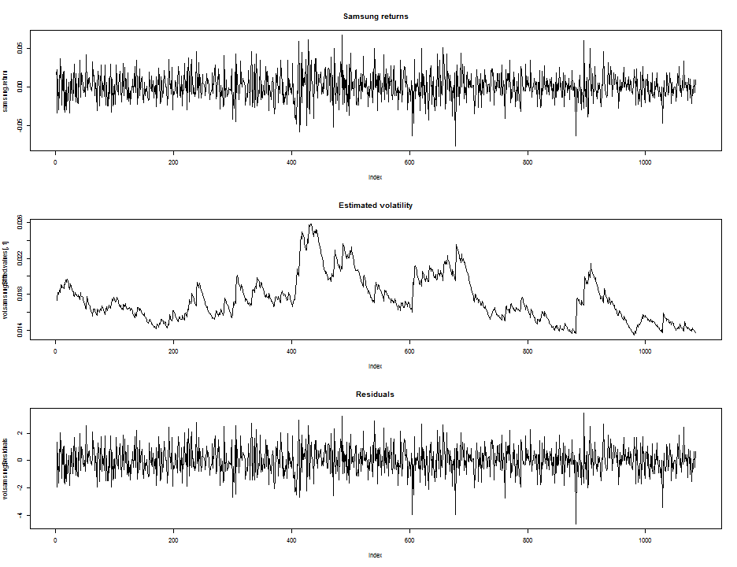 


#### 2. KT corporation

```r
vol.kt <- garch(kt.return)
```

```
## 
##  ***** ESTIMATION WITH ANALYTICAL GRADIENT ***** 
## 
## 
##      I     INITIAL X(I)        D(I)
## 
##      1     2.463951e-04     1.000e+00
##      2     5.000000e-02     1.000e+00
##      3     5.000000e-02     1.000e+00
## 
##     IT   NF      F         RELDF    PRELDF    RELDX   STPPAR   D*STEP   NPRELDF
##      0    1 -3.824e+03
##      1    8 -3.824e+03  1.07e-05  2.07e-05  3.1e-05  8.2e+09  3.1e-06  8.44e+04
##      2   17 -3.826e+03  5.09e-04  9.13e-04  4.2e-01  2.0e+00  7.6e-02  2.78e-01
##      3   19 -3.830e+03  8.94e-04  1.95e-03  6.8e-01  2.0e+00  3.0e-01  1.10e-01
##      4   28 -3.830e+03  1.65e-04  7.77e-04  2.4e-05  3.0e+00  1.7e-05  1.26e-03
##      5   29 -3.831e+03  1.22e-04  1.04e-04  1.9e-05  2.0e+00  1.7e-05  3.33e-04
##      6   30 -3.831e+03  2.42e-06  2.55e-06  2.3e-05  2.0e+00  1.7e-05  2.19e-04
##      7   37 -3.832e+03  3.15e-04  2.17e-04  6.4e-02  0.0e+00  4.7e-02  2.17e-04
##      8   39 -3.834e+03  5.06e-04  5.09e-04  2.0e-01  4.1e-01  1.9e-01  5.70e-04
##      9   40 -3.836e+03  3.69e-04  3.57e-04  1.5e-01  3.3e-01  1.9e-01  3.74e-04
##     10   42 -3.836e+03  2.39e-05  3.77e-05  5.2e-03  9.1e-01  1.1e-02  6.70e-05
##     11   43 -3.836e+03  1.21e-05  1.52e-05  6.6e-03  1.5e+00  1.1e-02  3.35e-05
##     12   45 -3.836e+03  2.00e-05  6.29e-06  2.4e-02  0.0e+00  3.7e-02  6.29e-06
##     13   46 -3.836e+03  3.40e-05  4.34e-06  2.9e-02  0.0e+00  4.9e-02  4.34e-06
##     14   48 -3.836e+03  2.23e-05  9.16e-06  1.1e-02  2.0e+00  2.0e-02  1.00e-03
##     15   50 -3.836e+03  7.27e-05  3.10e-05  2.2e-02  2.0e+00  3.9e-02  1.97e-01
##     16   52 -3.836e+03  1.93e-05  1.31e-05  4.3e-03  2.0e+00  7.8e-03  4.27e+01
##     17   54 -3.836e+03  3.97e-05  2.79e-05  8.4e-03  2.0e+00  1.6e-02  4.74e+03
##     18   63 -3.836e+03  1.06e-07  3.73e-07  1.8e-08  1.2e+01  3.2e-08  2.34e-03
##     19   76 -3.836e+03 -2.94e-14  5.37e-14  1.1e-14  7.1e-01  2.0e-14 -1.41e-03
## 
##  ***** FALSE CONVERGENCE *****
## 
##  FUNCTION    -3.836443e+03   RELDX        1.119e-14
##  FUNC. EVALS      76         GRAD. EVALS      19
##  PRELDF       5.374e-14      NPRELDF     -1.411e-03
## 
##      I      FINAL X(I)        D(I)          G(I)
## 
##      1    1.317191e-05     1.000e+00    -1.008e+04
##      2    3.712906e-02     1.000e+00     5.946e+01
##      3    9.136524e-01     1.000e+00     5.094e+00
```

```r
par(mfrow = c(3, 1))
plot(kt.return, type = "l", main = "KT returns")
plot(vol.kt$fitted.values[, 1], type = "l", main = "Estimated volatility")
plot(vol.kt$residuals, type = "l", main = "Residuals")
```

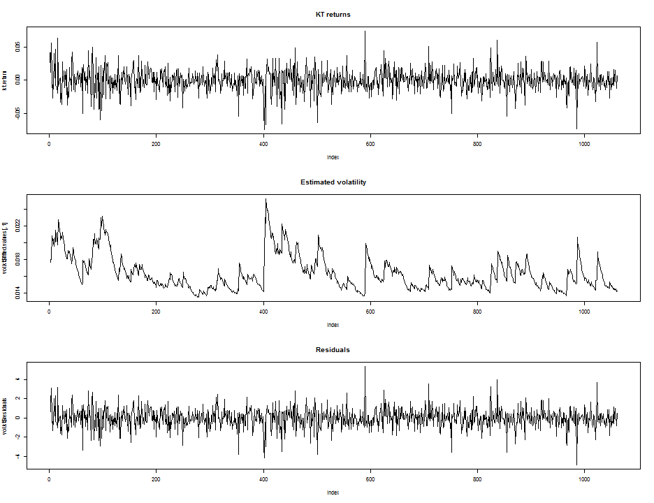 


#### 3. LG Display Co. Ltd 

```r
vol.lg <- garch(lg.return)
```

```
## 
##  ***** ESTIMATION WITH ANALYTICAL GRADIENT ***** 
## 
## 
##      I     INITIAL X(I)        D(I)
## 
##      1     6.277667e-04     1.000e+00
##      2     5.000000e-02     1.000e+00
##      3     5.000000e-02     1.000e+00
## 
##     IT   NF      F         RELDF    PRELDF    RELDX   STPPAR   D*STEP   NPRELDF
##      0    1 -3.327e+03
##      1    7 -3.327e+03  3.15e-05  5.35e-05  1.1e-04  1.5e+09  1.1e-05  3.89e+04
##      2    8 -3.327e+03  1.22e-06  1.28e-06  1.1e-04  2.0e+00  1.1e-05  1.58e+00
##      3   15 -3.330e+03  1.01e-03  1.40e-03  3.1e-01  2.0e+00  4.5e-02  1.58e+00
##      4   18 -3.339e+03  2.48e-03  2.30e-03  6.0e-01  1.9e+00  1.8e-01  3.24e-01
##      5   19 -3.348e+03  2.95e-03  5.16e-03  4.3e-01  2.0e+00  3.6e-01  1.69e+01
##      6   29 -3.349e+03  2.30e-04  7.58e-03  7.3e-05  2.1e+00  8.6e-05  2.59e-02
##      7   30 -3.356e+03  2.05e-03  1.37e-03  2.6e-05  2.0e+00  4.3e-05  1.77e-03
##      8   31 -3.357e+03  2.44e-04  5.00e-04  2.9e-05  2.0e+00  4.3e-05  4.01e-02
##      9   32 -3.357e+03  1.02e-04  1.25e-04  3.5e-05  2.0e+00  4.3e-05  1.59e-02
##     10   33 -3.357e+03  3.06e-06  2.82e-06  3.6e-05  2.0e+00  4.3e-05  1.85e-02
##     11   40 -3.359e+03  5.28e-04  5.99e-04  3.5e-02  1.7e+00  4.4e-02  1.87e-02
##     12   42 -3.362e+03  7.47e-04  7.29e-04  3.3e-02  5.0e-01  4.4e-02  2.63e-03
##     13   44 -3.367e+03  1.56e-03  1.65e-03  5.8e-02  5.2e-01  8.8e-02  6.08e-03
##     14   46 -3.372e+03  1.61e-03  1.71e-03  4.8e-02  4.3e-01  8.8e-02  4.43e-03
##     15   48 -3.379e+03  2.02e-03  2.27e-03  3.9e-02  7.1e-01  8.8e-02  5.61e-03
##     16   50 -3.379e+03  5.16e-05  3.67e-04  3.5e-03  2.0e+00  8.8e-03  1.93e-02
##     17   51 -3.381e+03  5.07e-04  5.44e-04  3.5e-03  2.0e+00  8.8e-03  1.27e-02
##     18   54 -3.384e+03  9.99e-04  1.08e-03  1.4e-02  1.1e+00  3.5e-02  1.26e-02
##     19   56 -3.386e+03  5.53e-04  7.14e-04  5.0e-03  1.7e+00  9.8e-03  5.45e-03
##     20   57 -3.387e+03  1.38e-04  2.19e-04  4.6e-03  5.6e-01  9.8e-03  2.59e-04
##     21   58 -3.387e+03  1.28e-05  4.16e-05  4.3e-03  4.1e-01  9.8e-03  4.67e-05
##     22   59 -3.387e+03  8.25e-06  8.35e-06  8.8e-04  0.0e+00  2.2e-03  8.35e-06
##     23   60 -3.387e+03  4.26e-07  3.92e-07  3.3e-04  0.0e+00  7.3e-04  3.92e-07
##     24   61 -3.387e+03  4.65e-10  6.78e-10  1.1e-05  0.0e+00  2.9e-05  6.78e-10
##     25   62 -3.387e+03  2.56e-10  2.85e-12  9.2e-07  0.0e+00  1.9e-06  2.85e-12
##     26   63 -3.387e+03 -1.04e-11  1.75e-14  2.8e-08  0.0e+00  6.3e-08  1.75e-14
## 
##  ***** RELATIVE FUNCTION CONVERGENCE *****
## 
##  FUNCTION    -3.386776e+03   RELDX        2.809e-08
##  FUNC. EVALS      63         GRAD. EVALS      26
##  PRELDF       1.753e-14      NPRELDF      1.753e-14
## 
##      I      FINAL X(I)        D(I)          G(I)
## 
##      1    1.130989e-05     1.000e+00    -7.194e+00
##      2    4.383819e-02     1.000e+00    -3.257e-03
##      3    9.386032e-01     1.000e+00    -3.667e-03
```

```r
par(mfrow = c(3, 1))
plot(lg.return, type = "l", main = "LG returns")
plot(vol.lg$fitted.values[, 1], type = "l", main = "Estimated volatility")
plot(vol.lg$residuals, type = "l", main = "Residuals")
```

 


#### 4. BMW 

```r
vol.bmw <- garch(bmw.return)
```

```
## 
##  ***** ESTIMATION WITH ANALYTICAL GRADIENT ***** 
## 
## 
##      I     INITIAL X(I)        D(I)
## 
##      1     3.367436e-04     1.000e+00
##      2     5.000000e-02     1.000e+00
##      3     5.000000e-02     1.000e+00
## 
##     IT   NF      F         RELDF    PRELDF    RELDX   STPPAR   D*STEP   NPRELDF
##      0    1 -3.772e+03
##      1    8 -3.772e+03  1.16e-05  2.28e-05  4.4e-05  4.4e+09  4.4e-06  5.06e+04
##      2   16 -3.773e+03  4.54e-04  8.05e-04  3.0e-01  2.0e+00  4.5e-02  6.03e-01
##      3   19 -3.778e+03  1.31e-03  1.26e-03  6.0e-01  1.9e+00  1.8e-01  1.10e-01
##      4   21 -3.792e+03  3.74e-03  2.68e-03  4.3e-01  2.0e+00  3.6e-01  3.66e+00
##      5   23 -3.797e+03  1.15e-03  1.13e-03  5.6e-02  2.0e+00  7.2e-02  1.02e+03
##      6   36 -3.799e+03  4.46e-04  1.29e-03  1.1e-05  2.4e+00  1.4e-05  6.98e+02
##      7   37 -3.799e+03  1.50e-04  1.23e-04  9.9e-06  2.0e+00  1.4e-05  2.42e+02
##      8   38 -3.799e+03  5.93e-06  6.89e-06  1.0e-05  2.0e+00  1.4e-05  3.22e+02
##      9   46 -3.802e+03  7.42e-04  9.08e-04  3.6e-02  2.0e+00  5.0e-02  3.13e+02
##     10   52 -3.802e+03  6.54e-06  1.36e-05  6.0e-07  3.1e+01  8.6e-07  8.23e-03
##     11   53 -3.802e+03  3.69e-08  5.06e-08  6.0e-07  2.0e+00  8.6e-07  4.53e-03
##     12   62 -3.804e+03  5.62e-04  8.88e-04  3.8e-02  1.5e+00  5.6e-02  4.53e-03
##     13   64 -3.810e+03  1.68e-03  1.48e-03  2.7e-02  7.7e-02  5.6e-02  3.58e-03
##     14   66 -3.821e+03  2.77e-03  3.55e-03  4.9e-02  1.9e+00  1.1e-01  2.47e-01
##     15   67 -3.823e+03  4.64e-04  4.97e-03  4.4e-02  1.4e+00  1.1e-01  9.93e-03
##     16   69 -3.831e+03  2.02e-03  3.90e-03  9.7e-03  1.4e+00  2.6e-02  1.13e-02
##     17   75 -3.831e+03  1.63e-04  2.47e-04  2.4e-07  2.4e+01  4.5e-07  9.84e-03
##     18   76 -3.831e+03  1.10e-05  1.27e-05  2.1e-07  2.0e+00  4.5e-07  1.13e-03
##     19   77 -3.831e+03  2.37e-07  2.22e-07  2.3e-07  2.0e+00  4.5e-07  1.37e-03
##     20   85 -3.832e+03  6.16e-05  1.14e-04  2.3e-03  1.8e+00  4.5e-03  1.36e-03
##     21   87 -3.832e+03  9.93e-05  6.67e-05  2.0e-03  0.0e+00  5.2e-03  6.67e-05
##     22   88 -3.832e+03  4.13e-05  3.47e-05  2.0e-03  7.8e-03  5.2e-03  3.47e-05
##     23   89 -3.832e+03  2.70e-06  2.31e-06  5.5e-04  0.0e+00  1.5e-03  2.31e-06
##     24   90 -3.832e+03  1.15e-07  9.45e-08  1.0e-04  0.0e+00  2.6e-04  9.45e-08
##     25   91 -3.832e+03  6.83e-09  4.24e-09  5.7e-06  0.0e+00  1.2e-05  4.24e-09
##     26   92 -3.832e+03  8.76e-10  4.24e-10  3.5e-06  0.0e+00  8.8e-06  4.24e-10
##     27   93 -3.832e+03  6.69e-11  6.53e-12  8.2e-07  0.0e+00  1.9e-06  6.53e-12
##     28   94 -3.832e+03  2.66e-11  1.41e-13  5.9e-08  0.0e+00  1.2e-07  1.41e-13
##     29   95 -3.832e+03  9.85e-12  7.32e-15  3.5e-08  0.0e+00  7.1e-08  7.32e-15
##     30   96 -3.832e+03  1.65e-12  2.44e-16  8.3e-09  0.0e+00  1.9e-08  2.44e-16
##     31   97 -3.832e+03  3.84e-14  1.45e-18  4.4e-10  0.0e+00  1.1e-09  1.45e-18
##     32   98 -3.832e+03 -2.61e-15  3.33e-21  9.4e-12  0.0e+00  1.8e-11  3.33e-21
## 
##  ***** X- AND RELATIVE FUNCTION CONVERGENCE *****
## 
##  FUNCTION    -3.832060e+03   RELDX        9.434e-12
##  FUNC. EVALS      98         GRAD. EVALS      32
##  PRELDF       3.332e-21      NPRELDF      3.332e-21
## 
##      I      FINAL X(I)        D(I)          G(I)
## 
##      1    4.538729e-06     1.000e+00    -3.135e-03
##      2    4.218134e-02     1.000e+00    -1.705e-06
##      3    9.454616e-01     1.000e+00    -1.565e-06
```

```r
par(mfrow = c(3, 1))
plot(bmw.return, type = "l", main = "BMW returns")
plot(vol.bmw$fitted.values[, 1], type = "l", main = "Estimated volatility")
plot(vol.bmw$residuals, type = "l", main = "Residuals")
```

 


#### 5. Apple Inc

```r
vol.apple <- garch(apple.return)
```

```
## 
##  ***** ESTIMATION WITH ANALYTICAL GRADIENT ***** 
## 
## 
##      I     INITIAL X(I)        D(I)
## 
##      1     2.731625e-04     1.000e+00
##      2     5.000000e-02     1.000e+00
##      3     5.000000e-02     1.000e+00
## 
##     IT   NF      F         RELDF    PRELDF    RELDX   STPPAR   D*STEP   NPRELDF
##      0    1 -3.764e+03
##      1    8 -3.764e+03  8.74e-06  1.69e-05  3.1e-05  6.6e+09  3.1e-06  5.58e+04
##      2   16 -3.767e+03  7.33e-04  1.06e-03  3.4e-01  2.0e+00  5.1e-02  8.17e-01
##      3   19 -3.768e+03  1.96e-04  1.72e-04  6.7e-01  8.8e-01  2.0e-01  1.16e-03
##      4   21 -3.774e+03  1.69e-03  4.54e-04  4.4e-01  1.9e+00  4.1e-01  7.62e-02
##      5   23 -3.777e+03  8.66e-04  8.41e-04  5.8e-02  2.0e+00  8.2e-02  5.51e+02
##      6   25 -3.778e+03  7.93e-05  1.66e-04  1.1e-02  2.0e+00  1.6e-02  6.45e-01
##      7   26 -3.778e+03  1.77e-04  2.45e-04  1.1e-02  2.0e+00  1.6e-02  2.17e-01
##      8   27 -3.779e+03  9.33e-05  1.33e-04  1.0e-02  2.0e+00  1.6e-02  6.30e-02
##      9   29 -3.779e+03  7.41e-06  3.56e-05  3.9e-03  2.0e+00  6.3e-03  7.18e-03
##     10   30 -3.779e+03  1.69e-05  3.29e-05  3.9e-03  2.0e+00  6.3e-03  9.77e-04
##     11   33 -3.780e+03  2.34e-04  1.60e-04  2.5e-02  0.0e+00  5.0e-02  1.60e-04
##     12   35 -3.780e+03  1.42e-05  5.76e-05  3.1e-03  1.9e+00  6.2e-03  1.42e-03
##     13   36 -3.780e+03  5.07e-06  2.51e-05  2.7e-03  1.5e+00  6.2e-03  4.69e-05
##     14   37 -3.780e+03  1.80e-05  2.00e-05  3.6e-03  1.5e+00  6.2e-03  5.53e-05
##     15   38 -3.780e+03  2.61e-06  6.65e-06  6.1e-03  0.0e+00  1.1e-02  6.65e-06
##     16   39 -3.780e+03  1.63e-06  3.58e-06  2.1e-03  0.0e+00  3.7e-03  3.58e-06
##     17   40 -3.780e+03  6.24e-07  8.74e-07  7.6e-04  0.0e+00  1.6e-03  8.74e-07
##     18   41 -3.780e+03  1.45e-07  1.10e-07  6.7e-04  0.0e+00  1.3e-03  1.10e-07
##     19   54 -3.780e+03  1.95e-11  1.80e-10  3.7e-10  6.6e+00  6.4e-10  2.00e-09
##     20   67 -3.780e+03  3.61e-16  4.85e-14  1.1e-13  1.3e+04  2.0e-13  1.62e-09
##     21   70 -3.780e+03 -2.05e-15  5.88e-15  1.4e-14  1.0e+05  2.4e-14  1.62e-09
## 
##  ***** FALSE CONVERGENCE *****
## 
##  FUNCTION    -3.779829e+03   RELDX        1.388e-14
##  FUNC. EVALS      70         GRAD. EVALS      21
##  PRELDF       5.883e-15      NPRELDF      1.618e-09
## 
##      I      FINAL X(I)        D(I)          G(I)
## 
##      1    2.015615e-05     1.000e+00    -9.300e+02
##      2    7.558968e-02     1.000e+00    -2.250e-01
##      3    8.610646e-01     1.000e+00    -1.935e-01
```

```r
par(mfrow = c(3, 1))
plot(apple.return, type = "l", main = "Apple returns")
plot(vol.apple$fitted.values[, 1], type = "l", main = "Estimated volatility")
plot(vol.apple$residuals, type = "l", main = "Residuals")
```

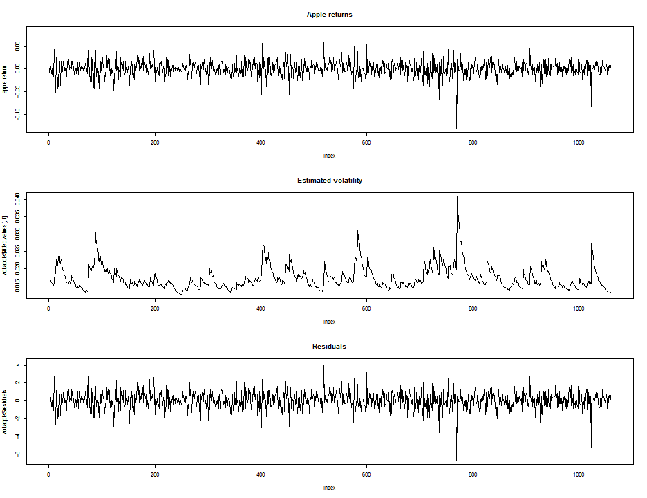 


#### Summary interpretation
공통적으로 수익률의 변동성이 시간에 따라 달라지는 것으로 보아 GARCH model을 적합시켜 분석해볼 필요가 있겠다.

### 적합된 GARCH model에 대한 검진(GARCH(1,1))

#### 1. Samsung eletronics 

```r
summary(vol.samsung)
```

```
## 
## Call:
## garch(x = samsung.return)
## 
## Model:
## GARCH(1,1)
## 
## Residuals:
##    Min     1Q Median     3Q    Max 
## -4.686 -0.609  0.000  0.595  3.479 
## 
## Coefficient(s):
##     Estimate  Std. Error  t value Pr(>|t|)    
## a0  4.66e-06    2.15e-06     2.17  0.03002 *  
## a1  3.09e-02    8.33e-03     3.71  0.00021 ***
## b1  9.54e-01    1.35e-02    70.84  < 2e-16 ***
## ---
## Signif. codes:  0 '***' 0.001 '**' 0.01 '*' 0.05 '.' 0.1 ' ' 1
## 
## Diagnostic Tests:
## 	Jarque Bera Test
## 
## data:  Residuals
## X-squared = 41.88, df = 2, p-value = 8.068e-10
## 
## 
## 	Box-Ljung test
## 
## data:  Squared.Residuals
## X-squared = 1.254, df = 1, p-value = 0.2627
```


#### 2. KT corporation

```r
summary(vol.kt)
```

```
## 
## Call:
## garch(x = kt.return)
## 
## Model:
## GARCH(1,1)
## 
## Residuals:
##    Min     1Q Median     3Q    Max 
## -4.909 -0.545  0.000  0.518  5.376 
## 
## Coefficient(s):
##     Estimate  Std. Error  t value Pr(>|t|)    
## a0  1.32e-05    4.11e-06     3.21   0.0013 ** 
## a1  3.71e-02    8.26e-03     4.50  6.9e-06 ***
## b1  9.14e-01    2.16e-02    42.34  < 2e-16 ***
## ---
## Signif. codes:  0 '***' 0.001 '**' 0.01 '*' 0.05 '.' 0.1 ' ' 1
## 
## Diagnostic Tests:
## 	Jarque Bera Test
## 
## data:  Residuals
## X-squared = 346.6, df = 2, p-value < 2.2e-16
## 
## 
## 	Box-Ljung test
## 
## data:  Squared.Residuals
## X-squared = 0.2455, df = 1, p-value = 0.6202
```


#### 3. LG Display Co. Ltd 

```r
summary(vol.lg)
```

```
## 
## Call:
## garch(x = lg.return)
## 
## Model:
## GARCH(1,1)
## 
## Residuals:
##     Min      1Q  Median      3Q     Max 
## -4.8080 -0.6238 -0.0305  0.5886  3.4635 
## 
## Coefficient(s):
##     Estimate  Std. Error  t value Pr(>|t|)    
## a0  1.13e-05    4.36e-06     2.59   0.0095 ** 
## a1  4.38e-02    7.89e-03     5.56  2.7e-08 ***
## b1  9.39e-01    1.27e-02    73.79  < 2e-16 ***
## ---
## Signif. codes:  0 '***' 0.001 '**' 0.01 '*' 0.05 '.' 0.1 ' ' 1
## 
## Diagnostic Tests:
## 	Jarque Bera Test
## 
## data:  Residuals
## X-squared = 59.26, df = 2, p-value = 1.357e-13
## 
## 
## 	Box-Ljung test
## 
## data:  Squared.Residuals
## X-squared = 0.1935, df = 1, p-value = 0.66
```


#### 4. BMW 

```r
summary(vol.bmw)
```

```
## 
## Call:
## garch(x = bmw.return)
## 
## Model:
## GARCH(1,1)
## 
## Residuals:
##     Min      1Q  Median      3Q     Max 
## -4.1629 -0.5372  0.0566  0.6358  5.1923 
## 
## Coefficient(s):
##     Estimate  Std. Error  t value Pr(>|t|)    
## a0  4.54e-06    1.47e-06     3.09    0.002 ** 
## a1  4.22e-02    7.27e-03     5.81  6.4e-09 ***
## b1  9.45e-01    1.01e-02    94.03  < 2e-16 ***
## ---
## Signif. codes:  0 '***' 0.001 '**' 0.01 '*' 0.05 '.' 0.1 ' ' 1
## 
## Diagnostic Tests:
## 	Jarque Bera Test
## 
## data:  Residuals
## X-squared = 132.9, df = 2, p-value < 2.2e-16
## 
## 
## 	Box-Ljung test
## 
## data:  Squared.Residuals
## X-squared = 1.537, df = 1, p-value = 0.2151
```


#### 5. Apple Inc

```r
summary(vol.apple)
```

```
## 
## Call:
## garch(x = apple.return)
## 
## Model:
## GARCH(1,1)
## 
## Residuals:
##     Min      1Q  Median      3Q     Max 
## -6.7156 -0.4841  0.0583  0.6326  4.2666 
## 
## Coefficient(s):
##     Estimate  Std. Error  t value Pr(>|t|)    
## a0  2.02e-05    4.95e-06     4.08  4.6e-05 ***
## a1  7.56e-02    1.68e-02     4.50  6.8e-06 ***
## b1  8.61e-01    2.84e-02    30.33  < 2e-16 ***
## ---
## Signif. codes:  0 '***' 0.001 '**' 0.01 '*' 0.05 '.' 0.1 ' ' 1
## 
## Diagnostic Tests:
## 	Jarque Bera Test
## 
## data:  Residuals
## X-squared = 660.6, df = 2, p-value < 2.2e-16
## 
## 
## 	Box-Ljung test
## 
## data:  Squared.Residuals
## X-squared = 0.0111, df = 1, p-value = 0.9161
```


#### Summary interpretation
5개의 자료 모두 approximation t-test에 의하면 추정된 모수가 모두 유의한 것으로 나타났고 Jarque Bera test 결과 유의확률이 0.05본다 매우 작은 값으로 나타나므로 변동성을 분석할 때 정규분포를 가정하는 것에는 무리가 있다고 할 수 있다. 또한 Box-Ljung test 결과 유의확률이 0.05보다 큰 값으로 나타나고 있으므로 모형이 자료를 잘 적합시키고 있다고 판단할 수 있겠다.

### 잔차의 ACF를 이용한 모형의 검진

#### 1. Samsung eletronics 

```r
par(mfrow = c(2, 2))
acf(samsung.return)
acf(samsung.return^2)
acf(vol.samsung$residuals[-1])
acf(vol.samsung$residuals[-1]^2)
```

 


#### 2. KT corporation

```r
par(mfrow = c(2, 2))
acf(kt.return)
acf(kt.return^2)
acf(vol.kt$residuals[-1])
acf(vol.kt$residuals[-1]^2)
```

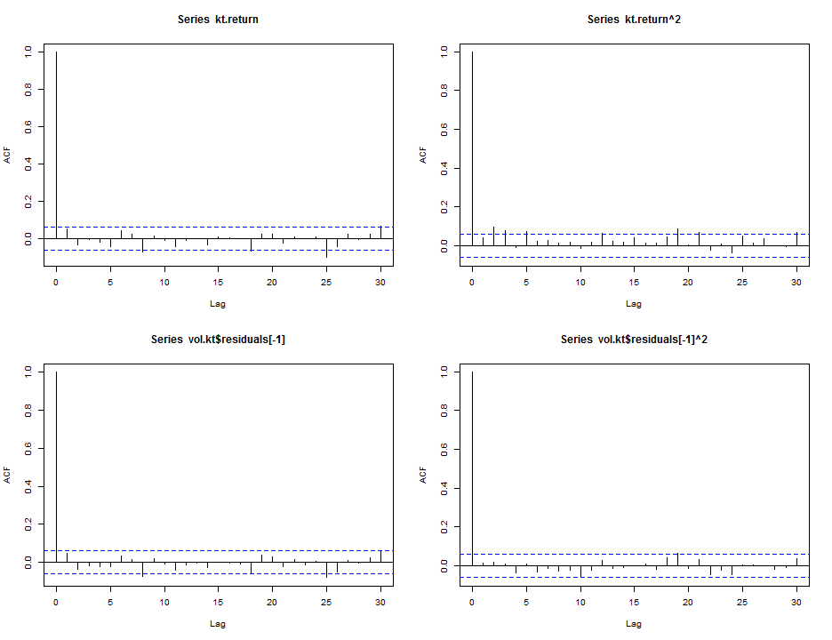 


#### 3. LG Display Co. Ltd 

```r
par(mfrow = c(2, 2))
acf(lg.return)
acf(lg.return^2)
acf(vol.lg$residuals[-1])
acf(vol.lg$residuals[-1]^2)
```

 


#### 4. BMW 

```r
par(mfrow = c(2, 2))
acf(bmw.return)
acf(bmw.return^2)
acf(vol.bmw$residuals[-1])
acf(vol.bmw$residuals[-1]^2)
```

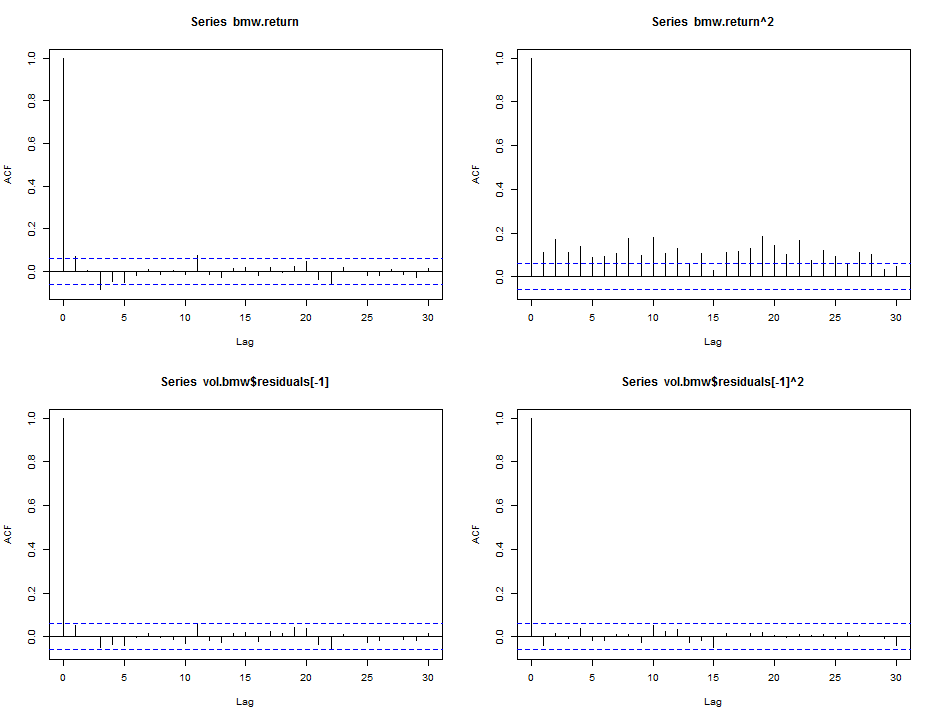 


#### 5. Apple Inc

```r
par(mfrow = c(2, 2))
acf(apple.return)
acf(apple.return^2)
acf(vol.apple$residuals[-1])
acf(vol.apple$residuals[-1]^2)
```

 


#### Summary interpretation
5개의 기업 모두 공통적으로 잔차에 대한 ACF와 잔차를 제곱한 값에 대한 ACF가 대부분 신뢰구간 안에 들어가 있으므로 모형적합이 잘 되었다고 말할 수 있다. 그리고 수익률에 대한 ACF를 통하여 수익률 자체를 분석하는 것 보다는 그것을 제곱하여 얻어진 값들을 분석하는 것이 더 타당하다고 할 수 있겠다.

#### If r ~ N( 0 , sigma^2 ) , it is not true..
#### r(t) = sigma(t)*e(t) , e(t) ~ WN(0,1) (e : epsilon)
#### e(t) is called random shocks..
#### GARCH(1,1) -> sigma(t)^2 = alpha(0) + alpha(1)*r(t-1)^2
#### + beta(1)*sigma(t-1)^2
#### Refer to Jarque Bera Test, e(t) is nonnormal~~!!
#### 잔차의 분포를 구할 필요성.
#### 잔차에 관해서 plot을 그리고 정규성 확인

### 잔차 epsilon에 대한 분포 점검

#### 1. Samsung eletronics

```r
par(mfrow = c(1, 2))
vol.samsung <- garch(samsung.return)
```

```
## 
##  ***** ESTIMATION WITH ANALYTICAL GRADIENT ***** 
## 
## 
##      I     INITIAL X(I)        D(I)
## 
##      1     2.817621e-04     1.000e+00
##      2     5.000000e-02     1.000e+00
##      3     5.000000e-02     1.000e+00
## 
##     IT   NF      F         RELDF    PRELDF    RELDX   STPPAR   D*STEP   NPRELDF
##      0    1 -3.832e+03
##      1    9 -3.832e+03  1.25e-06  2.60e-06  1.3e-05  6.1e+09  1.3e-06  7.95e+03
##      2   17 -3.832e+03  8.21e-05  1.44e-04  1.7e-01  2.0e+00  2.1e-02  9.13e-02
##      3   21 -3.836e+03  1.00e-03  6.34e-04  7.4e-01  1.2e+00  3.3e-01  7.79e-03
##      4   23 -3.837e+03  2.11e-04  2.15e-04  7.8e-02  2.0e+00  6.7e-02  2.38e-01
##      5   25 -3.839e+03  4.33e-04  4.23e-04  1.3e-01  6.8e-01  1.3e-01  1.98e-03
##      6   35 -3.839e+03  1.07e-05  2.68e-05  1.7e-06  4.0e+00  2.1e-06  2.14e-02
##      7   36 -3.839e+03  1.07e-06  8.27e-07  1.7e-06  2.0e+00  2.1e-06  1.71e-02
##      8   46 -3.840e+03  3.52e-04  4.13e-04  1.0e-01  1.8e+00  1.3e-01  1.73e-02
##      9   48 -3.841e+03  1.89e-04  1.84e-04  2.8e-02  1.4e+00  4.1e-02  7.74e-04
##     10   50 -3.843e+03  5.37e-04  6.18e-04  5.0e-02  7.2e-01  8.2e-02  1.89e-03
##     11   51 -3.846e+03  6.88e-04  1.02e-03  4.2e-02  6.1e-01  8.2e-02  1.31e-03
##     12   59 -3.847e+03  4.02e-04  6.04e-04  8.9e-07  4.3e+00  1.6e-06  3.92e-03
##     13   60 -3.847e+03  1.74e-06  1.95e-06  8.7e-07  2.0e+00  1.6e-06  8.07e-03
##     14   61 -3.847e+03  1.43e-07  1.70e-07  8.8e-07  2.0e+00  1.6e-06  8.25e-03
##     15   69 -3.850e+03  7.05e-04  1.16e-03  1.0e-02  1.6e+00  1.8e-02  8.24e-03
##     16   71 -3.852e+03  5.84e-04  6.02e-04  7.3e-03  9.9e-01  1.8e-02  5.95e-03
##     17   72 -3.855e+03  6.70e-04  8.50e-04  1.5e-02  9.3e-01  3.7e-02  1.90e-03
##     18   73 -3.855e+03  7.08e-05  1.64e-04  7.8e-03  0.0e+00  1.8e-02  1.64e-04
##     19   74 -3.855e+03  5.10e-05  6.72e-05  2.4e-03  0.0e+00  6.3e-03  6.72e-05
##     20   75 -3.855e+03  3.32e-06  2.76e-06  1.1e-03  0.0e+00  2.4e-03  2.76e-06
##     21   88 -3.855e+03  7.54e-08  2.07e-07  1.1e-08  2.6e+00  2.1e-08  3.11e-07
##     22   90 -3.855e+03  1.44e-08  6.87e-09  1.0e-08  2.0e+00  2.1e-08  3.08e-08
##     23   92 -3.855e+03  1.99e-11  4.59e-12  1.1e-08  2.0e+00  2.1e-08  2.36e-08
##     24   99 -3.855e+03 -6.37e-15  2.19e-17  2.1e-14  4.1e+03  5.5e-14  2.35e-08
## 
##  ***** FALSE CONVERGENCE *****
## 
##  FUNCTION    -3.855128e+03   RELDX        2.136e-14
##  FUNC. EVALS      99         GRAD. EVALS      24
##  PRELDF       2.191e-17      NPRELDF      2.355e-08
## 
##      I      FINAL X(I)        D(I)          G(I)
## 
##      1    4.656003e-06     1.000e+00    -7.209e-02
##      2    3.087981e-02     1.000e+00     1.030e+00
##      3    9.535844e-01     1.000e+00     1.149e+00
```

```r
res.samsung <- vol.samsung$residuals[-1]
nigFit(res.samsung)
```

```
## 
##  Objective Function Value:   -1533
##  Parameter Estimates:        1 0 1 0 
## 
##  Objective Function Value:   -1533
##  Parameter Estimates:        1 0 1 0 
## 
##  Objective Function Value:   -1533
##  Parameter Estimates:        1 1.49e-08 1 0 
## 
##  Objective Function Value:   -1533
##  Parameter Estimates:        1 0 1 0 
## 
##  Objective Function Value:   -1533
##  Parameter Estimates:        1 0 1 1.49e-08 
## 
##  Objective Function Value:   -1737
##  Parameter Estimates:        0.7388 0.287 1.917 -0.09035 
## 
##  Objective Function Value:   -1530
##  Parameter Estimates:        0.97 0.033 1.105 -0.01039 
## 
##  Objective Function Value:   -1530
##  Parameter Estimates:        0.97 0.033 1.105 -0.01039 
## 
##  Objective Function Value:   -1530
##  Parameter Estimates:        0.97 0.03296 1.105 -0.01039 
## 
##  Objective Function Value:   -1530
##  Parameter Estimates:        0.97 0.033 1.105 -0.01039 
## 
##  Objective Function Value:   -1530
##  Parameter Estimates:        0.97 0.033 1.105 -0.01035 
## 
##  Objective Function Value:   -1536
##  Parameter Estimates:        1.039 -0.005241 1.105 -0.0939 
## 
##  Objective Function Value:   -1530
##  Parameter Estimates:        0.9851 0.02463 1.105 -0.02867 
## 
##  Objective Function Value:   -1530
##  Parameter Estimates:        0.9851 0.02463 1.105 -0.02867 
## 
##  Objective Function Value:   -1530
##  Parameter Estimates:        0.9851 0.02463 1.105 -0.02867 
## 
##  Objective Function Value:   -1530
##  Parameter Estimates:        0.9851 0.02463 1.105 -0.02867 
## 
##  Objective Function Value:   -1530
##  Parameter Estimates:        0.9851 0.02463 1.105 -0.02867 
## 
##  Objective Function Value:   -1530
##  Parameter Estimates:        0.9851 0.02463 1.105 -0.02867 
## 
##  Objective Function Value:   -1529
##  Parameter Estimates:        1.002 0.04242 1.109 -0.02333 
## 
##  Objective Function Value:   -1529
##  Parameter Estimates:        1.002 0.04242 1.109 -0.02333 
## 
##  Objective Function Value:   -1529
##  Parameter Estimates:        1.002 0.04241 1.109 -0.02333 
## 
##  Objective Function Value:   -1529
##  Parameter Estimates:        1.002 0.04242 1.109 -0.02333 
## 
##  Objective Function Value:   -1529
##  Parameter Estimates:        1.002 0.04242 1.109 -0.02333 
## 
##  Objective Function Value:   -1529
##  Parameter Estimates:        1.041 0.04258 1.122 -0.05161 
## 
##  Objective Function Value:   -1529
##  Parameter Estimates:        1.041 0.04258 1.122 -0.05161 
## 
##  Objective Function Value:   -1529
##  Parameter Estimates:        1.041 0.04258 1.122 -0.05161 
## 
##  Objective Function Value:   -1529
##  Parameter Estimates:        1.041 0.04258 1.122 -0.05161 
## 
##  Objective Function Value:   -1529
##  Parameter Estimates:        1.041 0.04258 1.122 -0.05161 
## 
##  Objective Function Value:   -1528
##  Parameter Estimates:        1.07 0.06535 1.156 -0.04659 
## 
##  Objective Function Value:   -1528
##  Parameter Estimates:        1.07 0.06535 1.156 -0.04659 
## 
##  Objective Function Value:   -1528
##  Parameter Estimates:        1.07 0.06535 1.156 -0.04659 
## 
##  Objective Function Value:   -1528
##  Parameter Estimates:        1.07 0.06535 1.156 -0.04659 
## 
##  Objective Function Value:   -1528
##  Parameter Estimates:        1.07 0.06535 1.156 -0.04659 
## 
##  Objective Function Value:   -1527
##  Parameter Estimates:        1.136 0.05247 1.23 -0.06058 
## 
##  Objective Function Value:   -1527
##  Parameter Estimates:        1.136 0.05247 1.23 -0.06058 
## 
##  Objective Function Value:   -1527
##  Parameter Estimates:        1.136 0.05247 1.23 -0.06058 
## 
##  Objective Function Value:   -1527
##  Parameter Estimates:        1.136 0.05247 1.23 -0.06058 
## 
##  Objective Function Value:   -1527
##  Parameter Estimates:        1.136 0.05247 1.23 -0.06058 
## 
##  Objective Function Value:   -1527
##  Parameter Estimates:        1.234 0.06221 1.241 -0.04429 
## 
##  Objective Function Value:   -1527
##  Parameter Estimates:        1.234 0.06221 1.241 -0.04429 
## 
##  Objective Function Value:   -1527
##  Parameter Estimates:        1.234 0.06221 1.241 -0.04429 
## 
##  Objective Function Value:   -1527
##  Parameter Estimates:        1.234 0.06221 1.241 -0.04429 
## 
##  Objective Function Value:   -1527
##  Parameter Estimates:        1.234 0.06221 1.241 -0.04429 
## 
##  Objective Function Value:   -1526
##  Parameter Estimates:        1.239 0.1239 1.282 -0.1122 
## 
##  Objective Function Value:   -1526
##  Parameter Estimates:        1.239 0.1239 1.282 -0.1122 
## 
##  Objective Function Value:   -1526
##  Parameter Estimates:        1.239 0.1239 1.282 -0.1122 
## 
##  Objective Function Value:   -1526
##  Parameter Estimates:        1.239 0.1239 1.282 -0.1122 
## 
##  Objective Function Value:   -1526
##  Parameter Estimates:        1.239 0.1239 1.282 -0.1122 
## 
##  Objective Function Value:   -1526
##  Parameter Estimates:        1.311 0.1162 1.333 -0.06404 
## 
##  Objective Function Value:   -1526
##  Parameter Estimates:        1.264 0.1212 1.3 -0.09526 
## 
##  Objective Function Value:   -1526
##  Parameter Estimates:        1.264 0.1212 1.3 -0.09526 
## 
##  Objective Function Value:   -1526
##  Parameter Estimates:        1.264 0.1212 1.3 -0.09526 
## 
##  Objective Function Value:   -1526
##  Parameter Estimates:        1.264 0.1212 1.3 -0.09526 
## 
##  Objective Function Value:   -1526
##  Parameter Estimates:        1.264 0.1212 1.3 -0.09526 
## 
##  Objective Function Value:   -1526
##  Parameter Estimates:        1.287 0.1021 1.319 -0.096 
## 
##  Objective Function Value:   -1526
##  Parameter Estimates:        1.287 0.1021 1.319 -0.096 
## 
##  Objective Function Value:   -1526
##  Parameter Estimates:        1.287 0.1021 1.319 -0.096 
## 
##  Objective Function Value:   -1526
##  Parameter Estimates:        1.287 0.1021 1.319 -0.096 
## 
##  Objective Function Value:   -1526
##  Parameter Estimates:        1.287 0.1021 1.319 -0.09599 
## 
##  Objective Function Value:   -1526
##  Parameter Estimates:        1.311 0.0984 1.341 -0.08219 
## 
##  Objective Function Value:   -1526
##  Parameter Estimates:        1.311 0.0984 1.341 -0.08219 
## 
##  Objective Function Value:   -1526
##  Parameter Estimates:        1.311 0.0984 1.341 -0.08219 
## 
##  Objective Function Value:   -1526
##  Parameter Estimates:        1.311 0.0984 1.341 -0.08219 
## 
##  Objective Function Value:   -1526
##  Parameter Estimates:        1.311 0.0984 1.341 -0.08219 
## 
##  Objective Function Value:   -1525
##  Parameter Estimates:        1.341 0.09587 1.358 -0.08617 
## 
##  Objective Function Value:   -1525
##  Parameter Estimates:        1.341 0.09587 1.358 -0.08617 
## 
##  Objective Function Value:   -1525
##  Parameter Estimates:        1.341 0.09587 1.358 -0.08617 
## 
##  Objective Function Value:   -1525
##  Parameter Estimates:        1.341 0.09587 1.358 -0.08617 
## 
##  Objective Function Value:   -1525
##  Parameter Estimates:        1.341 0.09587 1.358 -0.08617 
## 
##  Objective Function Value:   -1525
##  Parameter Estimates:        1.354 0.09081 1.39 -0.08114 
## 
##  Objective Function Value:   -1525
##  Parameter Estimates:        1.354 0.09081 1.39 -0.08114 
## 
##  Objective Function Value:   -1525
##  Parameter Estimates:        1.354 0.09081 1.39 -0.08114 
## 
##  Objective Function Value:   -1525
##  Parameter Estimates:        1.354 0.09081 1.39 -0.08114 
## 
##  Objective Function Value:   -1525
##  Parameter Estimates:        1.354 0.09081 1.39 -0.08114 
## 
##  Objective Function Value:   -1526
##  Parameter Estimates:        1.379 0.1135 1.398 -0.07479 
## 
##  Objective Function Value:   -1525
##  Parameter Estimates:        1.359 0.09638 1.391 -0.07881 
## 
##  Objective Function Value:   -1525
##  Parameter Estimates:        1.359 0.09638 1.391 -0.07881 
## 
##  Objective Function Value:   -1525
##  Parameter Estimates:        1.359 0.09637 1.391 -0.07881 
## 
##  Objective Function Value:   -1525
##  Parameter Estimates:        1.359 0.09638 1.391 -0.07881 
## 
##  Objective Function Value:   -1525
##  Parameter Estimates:        1.359 0.09638 1.391 -0.07881 
## 
##  Objective Function Value:   -1525
##  Parameter Estimates:        1.365 0.09546 1.394 -0.08385 
## 
##  Objective Function Value:   -1525
##  Parameter Estimates:        1.365 0.09546 1.394 -0.08385 
## 
##  Objective Function Value:   -1525
##  Parameter Estimates:        1.365 0.09546 1.394 -0.08385 
## 
##  Objective Function Value:   -1525
##  Parameter Estimates:        1.365 0.09546 1.394 -0.08385 
## 
##  Objective Function Value:   -1525
##  Parameter Estimates:        1.365 0.09546 1.394 -0.08385 
## 
##  Objective Function Value:   -1525
##  Parameter Estimates:        1.377 0.103 1.402 -0.08513 
## 
##  Objective Function Value:   -1525
##  Parameter Estimates:        1.377 0.103 1.402 -0.08513 
## 
##  Objective Function Value:   -1525
##  Parameter Estimates:        1.377 0.103 1.402 -0.08513 
## 
##  Objective Function Value:   -1525
##  Parameter Estimates:        1.377 0.103 1.402 -0.08513 
## 
##  Objective Function Value:   -1525
##  Parameter Estimates:        1.377 0.103 1.402 -0.08513 
## 
##  Objective Function Value:   -1525
##  Parameter Estimates:        1.377 0.103 1.402 -0.08514 
## 
##  Objective Function Value:   -1525
##  Parameter Estimates:        1.401 0.1085 1.421 -0.09502 
## 
##  Objective Function Value:   -1525
##  Parameter Estimates:        1.444 0.1239 1.458 -0.1079 
## 
##  Objective Function Value:   -1525
##  Parameter Estimates:        1.513 0.1453 1.516 -0.1313 
## 
##  Objective Function Value:   -1525
##  Parameter Estimates:        1.513 0.1453 1.516 -0.1313 
## 
##  Objective Function Value:   -1525
##  Parameter Estimates:        1.513 0.1453 1.516 -0.1313 
## 
##  Objective Function Value:   -1525
##  Parameter Estimates:        1.513 0.1453 1.516 -0.1313 
## 
##  Objective Function Value:   -1525
##  Parameter Estimates:        1.513 0.1453 1.516 -0.1313 
## 
##  Objective Function Value:   -1525
##  Parameter Estimates:        1.646 0.0989 1.621 -0.08274 
## 
##  Objective Function Value:   -1525
##  Parameter Estimates:        1.578 0.1226 1.567 -0.1075 
## 
##  Objective Function Value:   -1525
##  Parameter Estimates:        1.578 0.1226 1.567 -0.1075 
## 
##  Objective Function Value:   -1525
##  Parameter Estimates:        1.578 0.1226 1.567 -0.1075 
## 
##  Objective Function Value:   -1525
##  Parameter Estimates:        1.578 0.1226 1.567 -0.1075 
## 
##  Objective Function Value:   -1525
##  Parameter Estimates:        1.578 0.1226 1.567 -0.1075 
## 
##  Objective Function Value:   -1525
##  Parameter Estimates:        1.578 0.1226 1.567 -0.1075 
## 
##  Objective Function Value:   -1525
##  Parameter Estimates:        1.595 0.1306 1.585 -0.1141 
## 
##  Objective Function Value:   -1525
##  Parameter Estimates:        1.595 0.1306 1.585 -0.1141 
## 
##  Objective Function Value:   -1525
##  Parameter Estimates:        1.595 0.1306 1.585 -0.1141 
## 
##  Objective Function Value:   -1525
##  Parameter Estimates:        1.595 0.1306 1.585 -0.1141 
## 
##  Objective Function Value:   -1525
##  Parameter Estimates:        1.595 0.1306 1.585 -0.1141 
## 
##  Objective Function Value:   -1525
##  Parameter Estimates:        1.602 0.1325 1.593 -0.1161 
## 
##  Objective Function Value:   -1525
##  Parameter Estimates:        1.602 0.1325 1.593 -0.1161 
## 
##  Objective Function Value:   -1525
##  Parameter Estimates:        1.602 0.1325 1.593 -0.1161 
## 
##  Objective Function Value:   -1525
##  Parameter Estimates:        1.602 0.1325 1.593 -0.1161 
## 
##  Objective Function Value:   -1525
##  Parameter Estimates:        1.602 0.1325 1.593 -0.1161 
## 
##  Objective Function Value:   -1525
##  Parameter Estimates:        1.602 0.1325 1.593 -0.1161 
## 
##  Objective Function Value:   -1525
##  Parameter Estimates:        1.602 0.1325 1.593 -0.1161 
## 
##  Objective Function Value:   -1525
##  Parameter Estimates:        1.602 0.1325 1.593 -0.1161 
## 
##  Objective Function Value:   -1525
##  Parameter Estimates:        1.603 0.1325 1.593 -0.1161 
## 
##  Objective Function Value:   -1525
##  Parameter Estimates:        1.603 0.1325 1.593 -0.1161 
## 
##  Objective Function Value:   -1525
##  Parameter Estimates:        1.603 0.1325 1.593 -0.1161 
## 
##  Objective Function Value:   -1525
##  Parameter Estimates:        1.603 0.1325 1.593 -0.1161 
## 
##  Objective Function Value:   -1525
##  Parameter Estimates:        1.603 0.1325 1.593 -0.1161 
## 
##  Objective Function Value:   -1525
##  Parameter Estimates:        1.603 0.1325 1.593 -0.1161 
## 
##  Objective Function Value:   -1525
##  Parameter Estimates:        1.603 0.1325 1.593 -0.1161 
## 
##  Objective Function Value:   -1525
##  Parameter Estimates:        1.603 0.1325 1.593 -0.1161 
## 
##  Objective Function Value:   -1525
##  Parameter Estimates:        1.603 0.1325 1.593 -0.1161 
## 
##  Objective Function Value:   -1525
##  Parameter Estimates:        1.603 0.1325 1.593 -0.116 
## 
##  Objective Function Value:   -1525
##  Parameter Estimates:        1.603 0.1325 1.593 -0.116 
## 
##  Objective Function Value:   -1525
##  Parameter Estimates:        1.603 0.1325 1.593 -0.116 
## 
##  Objective Function Value:   -1525
##  Parameter Estimates:        1.603 0.1325 1.593 -0.116 
## 
##  Objective Function Value:   -1525
##  Parameter Estimates:        1.603 0.1324 1.593 -0.116 
## 
##  Objective Function Value:   -1525
##  Parameter Estimates:        1.603 0.1325 1.593 -0.116 
## 
##  Objective Function Value:   -1525
##  Parameter Estimates:        1.603 0.1325 1.593 -0.116 
## 
##  Objective Function Value:   -1525
##  Parameter Estimates:        1.603 0.1325 1.593 -0.116 
## 
##  Objective Function Value:   -1525
##  Parameter Estimates:        1.603 0.1325 1.593 -0.1161 
## 
##  Objective Function Value:   -1525
##  Parameter Estimates:        1.603 0.1325 1.593 -0.116 
## 
##  Objective Function Value:   -1528
##  Parameter Estimates:        1.598 0.1321 1.598 -0.1164
```

```
## 
## Title:
##  Normal Inverse Gaussian Parameter Estimation 
## 
## Call:
##  .nigFit.mle(x = x, alpha = alpha, beta = beta, delta = delta, 
##     mu = mu, scale = scale, doplot = doplot, span = span, trace = trace, 
##     title = title, description = description)
## 
## Model:
##  Normal Inverse Gaussian Distribution
## 
## Estimated Parameter(s):
##   alpha    beta   delta      mu 
##  1.5982  0.1321  1.5979 -0.1164 
## 
## Description:
##  Sat Apr 19 00:02:58 2014 by user: user
```

```r
hist(res.samsung, prob = T, nclass = 50)
x <- seq(-4, 2, by = 0.001)
lines(x, dnorm(x), col = 2)
lines(x, dnig(x, 1.598189, 0.1320987, 1.5978737, -0.1163623), col = 3)
```

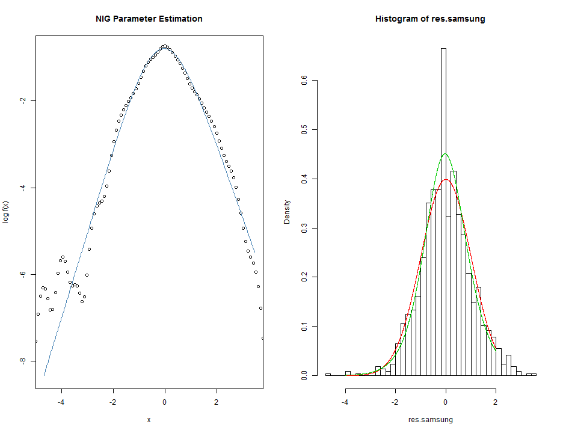 

#### 2. KT corporation

```r
par(mfrow = c(1, 2))
vol.kt <- garch(kt.return)
```

```
## 
##  ***** ESTIMATION WITH ANALYTICAL GRADIENT ***** 
## 
## 
##      I     INITIAL X(I)        D(I)
## 
##      1     2.463951e-04     1.000e+00
##      2     5.000000e-02     1.000e+00
##      3     5.000000e-02     1.000e+00
## 
##     IT   NF      F         RELDF    PRELDF    RELDX   STPPAR   D*STEP   NPRELDF
##      0    1 -3.824e+03
##      1    8 -3.824e+03  1.07e-05  2.07e-05  3.1e-05  8.2e+09  3.1e-06  8.44e+04
##      2   17 -3.826e+03  5.09e-04  9.13e-04  4.2e-01  2.0e+00  7.6e-02  2.78e-01
##      3   19 -3.830e+03  8.94e-04  1.95e-03  6.8e-01  2.0e+00  3.0e-01  1.10e-01
##      4   28 -3.830e+03  1.65e-04  7.77e-04  2.4e-05  3.0e+00  1.7e-05  1.26e-03
##      5   29 -3.831e+03  1.22e-04  1.04e-04  1.9e-05  2.0e+00  1.7e-05  3.33e-04
##      6   30 -3.831e+03  2.42e-06  2.55e-06  2.3e-05  2.0e+00  1.7e-05  2.19e-04
##      7   37 -3.832e+03  3.15e-04  2.17e-04  6.4e-02  0.0e+00  4.7e-02  2.17e-04
##      8   39 -3.834e+03  5.06e-04  5.09e-04  2.0e-01  4.1e-01  1.9e-01  5.70e-04
##      9   40 -3.836e+03  3.69e-04  3.57e-04  1.5e-01  3.3e-01  1.9e-01  3.74e-04
##     10   42 -3.836e+03  2.39e-05  3.77e-05  5.2e-03  9.1e-01  1.1e-02  6.70e-05
##     11   43 -3.836e+03  1.21e-05  1.52e-05  6.6e-03  1.5e+00  1.1e-02  3.35e-05
##     12   45 -3.836e+03  2.00e-05  6.29e-06  2.4e-02  0.0e+00  3.7e-02  6.29e-06
##     13   46 -3.836e+03  3.40e-05  4.34e-06  2.9e-02  0.0e+00  4.9e-02  4.34e-06
##     14   48 -3.836e+03  2.23e-05  9.16e-06  1.1e-02  2.0e+00  2.0e-02  1.00e-03
##     15   50 -3.836e+03  7.27e-05  3.10e-05  2.2e-02  2.0e+00  3.9e-02  1.97e-01
##     16   52 -3.836e+03  1.93e-05  1.31e-05  4.3e-03  2.0e+00  7.8e-03  4.27e+01
##     17   54 -3.836e+03  3.97e-05  2.79e-05  8.4e-03  2.0e+00  1.6e-02  4.74e+03
##     18   63 -3.836e+03  1.06e-07  3.73e-07  1.8e-08  1.2e+01  3.2e-08  2.34e-03
##     19   76 -3.836e+03 -2.94e-14  5.37e-14  1.1e-14  7.1e-01  2.0e-14 -1.41e-03
## 
##  ***** FALSE CONVERGENCE *****
## 
##  FUNCTION    -3.836443e+03   RELDX        1.119e-14
##  FUNC. EVALS      76         GRAD. EVALS      19
##  PRELDF       5.374e-14      NPRELDF     -1.411e-03
## 
##      I      FINAL X(I)        D(I)          G(I)
## 
##      1    1.317191e-05     1.000e+00    -1.008e+04
##      2    3.712906e-02     1.000e+00     5.946e+01
##      3    9.136524e-01     1.000e+00     5.094e+00
```

```r
res.kt <- vol.kt$residuals[-1]
nigFit(res.kt)
```

```
## 
##  Objective Function Value:   -1447
##  Parameter Estimates:        1 0 1 0 
## 
##  Objective Function Value:   -1447
##  Parameter Estimates:        1 0 1 0 
## 
##  Objective Function Value:   -1447
##  Parameter Estimates:        1 1.49e-08 1 0 
## 
##  Objective Function Value:   -1447
##  Parameter Estimates:        1 0 1 0 
## 
##  Objective Function Value:   -1447
##  Parameter Estimates:        1 0 1 1.49e-08 
## 
##  Objective Function Value:   -2511
##  Parameter Estimates:        1.055 -0.7706 0.8004 -0.6028 
## 
##  Objective Function Value:   -1456
##  Parameter Estimates:        1.005 -0.07706 0.98 -0.06028 
## 
##  Objective Function Value:   -1447
##  Parameter Estimates:        1.001 -0.009223 0.9976 -0.007214 
## 
##  Objective Function Value:   -1447
##  Parameter Estimates:        1.001 -0.009223 0.9976 -0.007214 
## 
##  Objective Function Value:   -1447
##  Parameter Estimates:        1.001 -0.009187 0.9976 -0.007214 
## 
##  Objective Function Value:   -1447
##  Parameter Estimates:        1.001 -0.009223 0.9976 -0.007214 
## 
##  Objective Function Value:   -1447
##  Parameter Estimates:        1.001 -0.009223 0.9976 -0.007178 
## 
##  Objective Function Value:   -1447
##  Parameter Estimates:        1.002 -0.01364 0.9902 0.00102 
## 
##  Objective Function Value:   -1447
##  Parameter Estimates:        1.002 -0.01364 0.9902 0.00102 
## 
##  Objective Function Value:   -1447
##  Parameter Estimates:        1.002 -0.01364 0.9902 0.00102 
## 
##  Objective Function Value:   -1447
##  Parameter Estimates:        1.002 -0.01364 0.9903 0.00102 
## 
##  Objective Function Value:   -1447
##  Parameter Estimates:        1.002 -0.01364 0.9902 0.001019 
## 
##  Objective Function Value:   -1447
##  Parameter Estimates:        0.9987 -0.02467 0.9896 -0.002284 
## 
##  Objective Function Value:   -1447
##  Parameter Estimates:        1.001 -0.01784 0.99 -0.0006454 
## 
##  Objective Function Value:   -1447
##  Parameter Estimates:        1.001 -0.01784 0.99 -0.0006454 
## 
##  Objective Function Value:   -1447
##  Parameter Estimates:        1.001 -0.01784 0.99 -0.0006454 
## 
##  Objective Function Value:   -1447
##  Parameter Estimates:        1.001 -0.01784 0.99 -0.0006454 
## 
##  Objective Function Value:   -1447
##  Parameter Estimates:        1.001 -0.01784 0.99 -0.000644 
## 
##  Objective Function Value:   -1447
##  Parameter Estimates:        0.9995 -0.01824 0.9893 0.003706 
## 
##  Objective Function Value:   -1447
##  Parameter Estimates:        0.9995 -0.01824 0.9893 0.003706 
## 
##  Objective Function Value:   -1447
##  Parameter Estimates:        0.9995 -0.01824 0.9893 0.003706 
## 
##  Objective Function Value:   -1447
##  Parameter Estimates:        0.9995 -0.01824 0.9893 0.003706 
## 
##  Objective Function Value:   -1447
##  Parameter Estimates:        0.9995 -0.01824 0.9893 0.003706 
## 
##  Objective Function Value:   -1447
##  Parameter Estimates:        0.9995 -0.01824 0.9893 0.003705 
## 
##  Objective Function Value:   -1447
##  Parameter Estimates:        0.9942 -0.02571 0.9893 0.005339 
## 
##  Objective Function Value:   -1447
##  Parameter Estimates:        0.9942 -0.02571 0.9893 0.005339 
## 
##  Objective Function Value:   -1447
##  Parameter Estimates:        0.9942 -0.02571 0.9893 0.005339 
## 
##  Objective Function Value:   -1447
##  Parameter Estimates:        0.9942 -0.02571 0.9893 0.005339 
## 
##  Objective Function Value:   -1447
##  Parameter Estimates:        0.9942 -0.02571 0.9893 0.00534 
## 
##  Objective Function Value:   -1447
##  Parameter Estimates:        0.9882 -0.02507 0.9835 0.009482 
## 
##  Objective Function Value:   -1447
##  Parameter Estimates:        0.9882 -0.02507 0.9835 0.009482 
## 
##  Objective Function Value:   -1447
##  Parameter Estimates:        0.9882 -0.02507 0.9835 0.009482 
## 
##  Objective Function Value:   -1447
##  Parameter Estimates:        0.9882 -0.02507 0.9835 0.009482 
## 
##  Objective Function Value:   -1447
##  Parameter Estimates:        0.9882 -0.02507 0.9835 0.009482 
## 
##  Objective Function Value:   -1447
##  Parameter Estimates:        0.9882 -0.02507 0.9835 0.009481 
## 
##  Objective Function Value:   -1447
##  Parameter Estimates:        0.9834 -0.02608 0.9763 0.006346 
## 
##  Objective Function Value:   -1447
##  Parameter Estimates:        0.9834 -0.02608 0.9763 0.006346 
## 
##  Objective Function Value:   -1447
##  Parameter Estimates:        0.9834 -0.02608 0.9763 0.006346 
## 
##  Objective Function Value:   -1447
##  Parameter Estimates:        0.9834 -0.02608 0.9763 0.006346 
## 
##  Objective Function Value:   -1447
##  Parameter Estimates:        0.9834 -0.02608 0.9763 0.006347 
## 
##  Objective Function Value:   -1447
##  Parameter Estimates:        0.975 -0.02836 0.9753 0.009627 
## 
##  Objective Function Value:   -1447
##  Parameter Estimates:        0.975 -0.02836 0.9753 0.009627 
## 
##  Objective Function Value:   -1447
##  Parameter Estimates:        0.975 -0.02836 0.9753 0.009627 
## 
##  Objective Function Value:   -1447
##  Parameter Estimates:        0.975 -0.02836 0.9753 0.009627 
## 
##  Objective Function Value:   -1447
##  Parameter Estimates:        0.975 -0.02836 0.9753 0.009626 
## 
##  Objective Function Value:   -1447
##  Parameter Estimates:        0.9792 -0.02784 0.968 0.0135 
## 
##  Objective Function Value:   -1447
##  Parameter Estimates:        0.9759 -0.02825 0.9738 0.01044 
## 
##  Objective Function Value:   -1447
##  Parameter Estimates:        0.9759 -0.02825 0.9738 0.01044 
## 
##  Objective Function Value:   -1447
##  Parameter Estimates:        0.9759 -0.02824 0.9738 0.01044 
## 
##  Objective Function Value:   -1447
##  Parameter Estimates:        0.9759 -0.02825 0.9738 0.01044 
## 
##  Objective Function Value:   -1447
##  Parameter Estimates:        0.9759 -0.02825 0.9738 0.01044 
## 
##  Objective Function Value:   -1447
##  Parameter Estimates:        0.9759 -0.02825 0.9738 0.01044 
## 
##  Objective Function Value:   -1447
##  Parameter Estimates:        0.9761 -0.0298 0.9732 0.009424 
## 
##  Objective Function Value:   -1447
##  Parameter Estimates:        0.976 -0.02873 0.9736 0.01012 
## 
##  Objective Function Value:   -1447
##  Parameter Estimates:        0.976 -0.02873 0.9736 0.01012 
## 
##  Objective Function Value:   -1447
##  Parameter Estimates:        0.976 -0.02873 0.9736 0.01012 
## 
##  Objective Function Value:   -1447
##  Parameter Estimates:        0.976 -0.02873 0.9736 0.01012 
## 
##  Objective Function Value:   -1447
##  Parameter Estimates:        0.976 -0.02873 0.9736 0.01012 
## 
##  Objective Function Value:   -1447
##  Parameter Estimates:        0.976 -0.02873 0.9736 0.01012 
## 
##  Objective Function Value:   -1447
##  Parameter Estimates:        0.976 -0.02889 0.9732 0.01057 
## 
##  Objective Function Value:   -1447
##  Parameter Estimates:        0.976 -0.02889 0.9732 0.01057 
## 
##  Objective Function Value:   -1447
##  Parameter Estimates:        0.976 -0.02889 0.9732 0.01057 
## 
##  Objective Function Value:   -1447
##  Parameter Estimates:        0.976 -0.02888 0.9732 0.01057 
## 
##  Objective Function Value:   -1447
##  Parameter Estimates:        0.976 -0.02889 0.9732 0.01057 
## 
##  Objective Function Value:   -1447
##  Parameter Estimates:        0.976 -0.02889 0.9732 0.01057 
## 
##  Objective Function Value:   -1447
##  Parameter Estimates:        0.976 -0.02889 0.9732 0.01057 
## 
##  Objective Function Value:   -1447
##  Parameter Estimates:        0.976 -0.02889 0.9732 0.01057 
## 
##  Objective Function Value:   -1447
##  Parameter Estimates:        0.9764 -0.02991 0.9735 0.01101 
## 
##  Objective Function Value:   -1447
##  Parameter Estimates:        0.9764 -0.02991 0.9735 0.01101 
## 
##  Objective Function Value:   -1447
##  Parameter Estimates:        0.9764 -0.02991 0.9735 0.01101 
## 
##  Objective Function Value:   -1447
##  Parameter Estimates:        0.9764 -0.02991 0.9735 0.01101 
## 
##  Objective Function Value:   -1447
##  Parameter Estimates:        0.9764 -0.02991 0.9735 0.01101 
## 
##  Objective Function Value:   -1447
##  Parameter Estimates:        0.9764 -0.02991 0.9735 0.01101 
## 
##  Objective Function Value:   -1447
##  Parameter Estimates:        0.9764 -0.02991 0.9735 0.01101 
## 
##  Objective Function Value:   -1447
##  Parameter Estimates:        0.9764 -0.02991 0.9735 0.01102 
## 
##  Objective Function Value:   -1447
##  Parameter Estimates:        0.9764 -0.02991 0.9735 0.01101 
## 
##  Objective Function Value:   -1447
##  Parameter Estimates:        0.9755 -0.02972 0.9728 0.01106 
## 
##  Objective Function Value:   -1447
##  Parameter Estimates:        0.9755 -0.02972 0.9728 0.01106 
## 
##  Objective Function Value:   -1447
##  Parameter Estimates:        0.9754 -0.02972 0.9728 0.01106 
## 
##  Objective Function Value:   -1447
##  Parameter Estimates:        0.9755 -0.02972 0.9728 0.01106 
## 
##  Objective Function Value:   -1447
##  Parameter Estimates:        0.9755 -0.02972 0.9728 0.01106 
## 
##  Objective Function Value:   -1447
##  Parameter Estimates:        0.9755 -0.02972 0.9728 0.01106 
## 
##  Objective Function Value:   -1447
##  Parameter Estimates:        0.9755 -0.02972 0.9728 0.01106 
## 
##  Objective Function Value:   -1447
##  Parameter Estimates:        0.9755 -0.02972 0.9728 0.01106 
## 
##  Objective Function Value:   -1447
##  Parameter Estimates:        0.9755 -0.02972 0.9728 0.01106 
## 
##  Objective Function Value:   -1447
##  Parameter Estimates:        0.9745 -0.02988 0.9721 0.01091 
## 
##  Objective Function Value:   -1447
##  Parameter Estimates:        0.9752 -0.03002 0.9725 0.01112 
## 
##  Objective Function Value:   -1447
##  Parameter Estimates:        0.9752 -0.03002 0.9725 0.01112 
## 
##  Objective Function Value:   -1447
##  Parameter Estimates:        0.9752 -0.03002 0.9725 0.01112 
## 
##  Objective Function Value:   -1447
##  Parameter Estimates:        0.9752 -0.03001 0.9725 0.01112 
## 
##  Objective Function Value:   -1447
##  Parameter Estimates:        0.9752 -0.03002 0.9725 0.01112 
## 
##  Objective Function Value:   -1447
##  Parameter Estimates:        0.9752 -0.03002 0.9725 0.01112 
## 
##  Objective Function Value:   -1447
##  Parameter Estimates:        0.9752 -0.03002 0.9725 0.01112 
## 
##  Objective Function Value:   -1447
##  Parameter Estimates:        0.9752 -0.03002 0.9725 0.01113 
## 
##  Objective Function Value:   -1447
##  Parameter Estimates:        0.9752 -0.03002 0.9725 0.01111 
## 
##  Objective Function Value:   -1447
##  Parameter Estimates:        0.9748 -0.03006 0.9723 0.01128 
## 
##  Objective Function Value:   -1447
##  Parameter Estimates:        0.9748 -0.03006 0.9723 0.01128 
## 
##  Objective Function Value:   -1447
##  Parameter Estimates:        0.9748 -0.03006 0.9723 0.01128 
## 
##  Objective Function Value:   -1447
##  Parameter Estimates:        0.9748 -0.03006 0.9723 0.01128 
## 
##  Objective Function Value:   -1447
##  Parameter Estimates:        0.9748 -0.03006 0.9723 0.01128 
## 
##  Objective Function Value:   -1447
##  Parameter Estimates:        0.9748 -0.03006 0.9723 0.01128 
## 
##  Objective Function Value:   -1447
##  Parameter Estimates:        0.9748 -0.03006 0.9723 0.01128 
## 
##  Objective Function Value:   -1447
##  Parameter Estimates:        0.9748 -0.03006 0.9723 0.01128 
## 
##  Objective Function Value:   -1447
##  Parameter Estimates:        0.9748 -0.03006 0.9723 0.01128 
## 
##  Objective Function Value:   -1447
##  Parameter Estimates:        0.9744 -0.02986 0.972 0.01116 
## 
##  Objective Function Value:   -1447
##  Parameter Estimates:        0.9746 -0.02995 0.9722 0.01124 
## 
##  Objective Function Value:   -1447
##  Parameter Estimates:        0.9746 -0.02995 0.9722 0.01124 
## 
##  Objective Function Value:   -1447
##  Parameter Estimates:        0.9746 -0.02995 0.9722 0.01124 
## 
##  Objective Function Value:   -1447
##  Parameter Estimates:        0.9746 -0.02995 0.9722 0.01124 
## 
##  Objective Function Value:   -1447
##  Parameter Estimates:        0.9746 -0.02996 0.9722 0.01124 
## 
##  Objective Function Value:   -1447
##  Parameter Estimates:        0.9746 -0.02995 0.9722 0.01124 
## 
##  Objective Function Value:   -1447
##  Parameter Estimates:        0.9746 -0.02995 0.9722 0.01124 
## 
##  Objective Function Value:   -1447
##  Parameter Estimates:        0.9746 -0.02995 0.9722 0.01125 
## 
##  Objective Function Value:   -1447
##  Parameter Estimates:        0.9746 -0.02995 0.9722 0.01124 
## 
##  Objective Function Value:   -1447
##  Parameter Estimates:        0.9748 -0.03006 0.9722 0.01137 
## 
##  Objective Function Value:   -1447
##  Parameter Estimates:        0.9746 -0.02999 0.9722 0.01127 
## 
##  Objective Function Value:   -1447
##  Parameter Estimates:        0.9747 -0.02999 0.9722 0.01127 
## 
##  Objective Function Value:   -1447
##  Parameter Estimates:        0.9746 -0.02999 0.9722 0.01127 
## 
##  Objective Function Value:   -1447
##  Parameter Estimates:        0.9746 -0.02998 0.9722 0.01127 
## 
##  Objective Function Value:   -1447
##  Parameter Estimates:        0.9746 -0.03001 0.9722 0.01127 
## 
##  Objective Function Value:   -1447
##  Parameter Estimates:        0.9746 -0.02999 0.9722 0.01127 
## 
##  Objective Function Value:   -1447
##  Parameter Estimates:        0.9746 -0.02999 0.9721 0.01127 
## 
##  Objective Function Value:   -1447
##  Parameter Estimates:        0.9746 -0.02999 0.9722 0.01129 
## 
##  Objective Function Value:   -1447
##  Parameter Estimates:        0.9746 -0.02999 0.9722 0.01125 
## 
##  Objective Function Value:   -1447
##  Parameter Estimates:        0.9746 -0.03002 0.9722 0.0113 
## 
##  Objective Function Value:   -1447
##  Parameter Estimates:        0.9746 -0.03002 0.9722 0.0113 
## 
##  Objective Function Value:   -1447
##  Parameter Estimates:        0.9746 -0.03002 0.9722 0.0113 
## 
##  Objective Function Value:   -1447
##  Parameter Estimates:        0.9746 -0.02999 0.9722 0.0113 
## 
##  Objective Function Value:   -1447
##  Parameter Estimates:        0.9746 -0.03005 0.9722 0.0113 
## 
##  Objective Function Value:   -1447
##  Parameter Estimates:        0.9746 -0.03002 0.9722 0.0113 
## 
##  Objective Function Value:   -1447
##  Parameter Estimates:        0.9746 -0.03002 0.9721 0.0113 
## 
##  Objective Function Value:   -1447
##  Parameter Estimates:        0.9746 -0.03002 0.9722 0.01133 
## 
##  Objective Function Value:   -1447
##  Parameter Estimates:        0.9746 -0.03002 0.9722 0.01127 
## 
##  Objective Function Value:   -1447
##  Parameter Estimates:        0.9746 -0.03002 0.9721 0.01129 
## 
##  Objective Function Value:   -1447
##  Parameter Estimates:        0.9746 -0.03002 0.9722 0.0113 
## 
##  Objective Function Value:   -1450
##  Parameter Estimates:        0.9723 -0.02995 0.9745 0.01133
```

```
## 
## Title:
##  Normal Inverse Gaussian Parameter Estimation 
## 
## Call:
##  .nigFit.mle(x = x, alpha = alpha, beta = beta, delta = delta, 
##     mu = mu, scale = scale, doplot = doplot, span = span, trace = trace, 
##     title = title, description = description)
## 
## Model:
##  Normal Inverse Gaussian Distribution
## 
## Estimated Parameter(s):
##    alpha     beta    delta       mu 
##  0.97231 -0.02995  0.97445  0.01133 
## 
## Description:
##  Sat Apr 19 00:02:58 2014 by user: user
```

```r
hist(res.kt, prob = T, nclass = 50)
x <- seq(-4, 4, by = 0.001)
lines(x, dnorm(x), col = 2)
lines(x, dnig(x, 0.97230521, -0.02994705, 0.97445152, 0.01132703), col = 3)
```

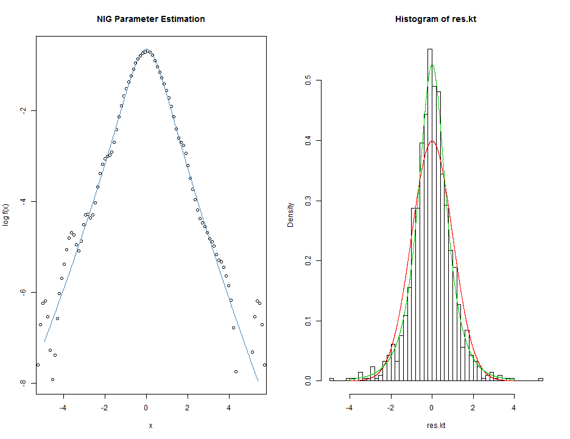 

#### 3. LG Display Co. Ltd

```r
par(mfrow = c(1, 2))
vol.lg <- garch(lg.return)
```

```
## 
##  ***** ESTIMATION WITH ANALYTICAL GRADIENT ***** 
## 
## 
##      I     INITIAL X(I)        D(I)
## 
##      1     6.277667e-04     1.000e+00
##      2     5.000000e-02     1.000e+00
##      3     5.000000e-02     1.000e+00
## 
##     IT   NF      F         RELDF    PRELDF    RELDX   STPPAR   D*STEP   NPRELDF
##      0    1 -3.327e+03
##      1    7 -3.327e+03  3.15e-05  5.35e-05  1.1e-04  1.5e+09  1.1e-05  3.89e+04
##      2    8 -3.327e+03  1.22e-06  1.28e-06  1.1e-04  2.0e+00  1.1e-05  1.58e+00
##      3   15 -3.330e+03  1.01e-03  1.40e-03  3.1e-01  2.0e+00  4.5e-02  1.58e+00
##      4   18 -3.339e+03  2.48e-03  2.30e-03  6.0e-01  1.9e+00  1.8e-01  3.24e-01
##      5   19 -3.348e+03  2.95e-03  5.16e-03  4.3e-01  2.0e+00  3.6e-01  1.69e+01
##      6   29 -3.349e+03  2.30e-04  7.58e-03  7.3e-05  2.1e+00  8.6e-05  2.59e-02
##      7   30 -3.356e+03  2.05e-03  1.37e-03  2.6e-05  2.0e+00  4.3e-05  1.77e-03
##      8   31 -3.357e+03  2.44e-04  5.00e-04  2.9e-05  2.0e+00  4.3e-05  4.01e-02
##      9   32 -3.357e+03  1.02e-04  1.25e-04  3.5e-05  2.0e+00  4.3e-05  1.59e-02
##     10   33 -3.357e+03  3.06e-06  2.82e-06  3.6e-05  2.0e+00  4.3e-05  1.85e-02
##     11   40 -3.359e+03  5.28e-04  5.99e-04  3.5e-02  1.7e+00  4.4e-02  1.87e-02
##     12   42 -3.362e+03  7.47e-04  7.29e-04  3.3e-02  5.0e-01  4.4e-02  2.63e-03
##     13   44 -3.367e+03  1.56e-03  1.65e-03  5.8e-02  5.2e-01  8.8e-02  6.08e-03
##     14   46 -3.372e+03  1.61e-03  1.71e-03  4.8e-02  4.3e-01  8.8e-02  4.43e-03
##     15   48 -3.379e+03  2.02e-03  2.27e-03  3.9e-02  7.1e-01  8.8e-02  5.61e-03
##     16   50 -3.379e+03  5.16e-05  3.67e-04  3.5e-03  2.0e+00  8.8e-03  1.93e-02
##     17   51 -3.381e+03  5.07e-04  5.44e-04  3.5e-03  2.0e+00  8.8e-03  1.27e-02
##     18   54 -3.384e+03  9.99e-04  1.08e-03  1.4e-02  1.1e+00  3.5e-02  1.26e-02
##     19   56 -3.386e+03  5.53e-04  7.14e-04  5.0e-03  1.7e+00  9.8e-03  5.45e-03
##     20   57 -3.387e+03  1.38e-04  2.19e-04  4.6e-03  5.6e-01  9.8e-03  2.59e-04
##     21   58 -3.387e+03  1.28e-05  4.16e-05  4.3e-03  4.1e-01  9.8e-03  4.67e-05
##     22   59 -3.387e+03  8.25e-06  8.35e-06  8.8e-04  0.0e+00  2.2e-03  8.35e-06
##     23   60 -3.387e+03  4.26e-07  3.92e-07  3.3e-04  0.0e+00  7.3e-04  3.92e-07
##     24   61 -3.387e+03  4.65e-10  6.78e-10  1.1e-05  0.0e+00  2.9e-05  6.78e-10
##     25   62 -3.387e+03  2.56e-10  2.85e-12  9.2e-07  0.0e+00  1.9e-06  2.85e-12
##     26   63 -3.387e+03 -1.04e-11  1.75e-14  2.8e-08  0.0e+00  6.3e-08  1.75e-14
## 
##  ***** RELATIVE FUNCTION CONVERGENCE *****
## 
##  FUNCTION    -3.386776e+03   RELDX        2.809e-08
##  FUNC. EVALS      63         GRAD. EVALS      26
##  PRELDF       1.753e-14      NPRELDF      1.753e-14
## 
##      I      FINAL X(I)        D(I)          G(I)
## 
##      1    1.130989e-05     1.000e+00    -7.194e+00
##      2    4.383819e-02     1.000e+00    -3.257e-03
##      3    9.386032e-01     1.000e+00    -3.667e-03
```

```r
res.lg <- vol.lg$residuals[-1]
nigFit(res.lg)
```

```
## 
##  Objective Function Value:   -1494
##  Parameter Estimates:        1 0 1 0 
## 
##  Objective Function Value:   -1494
##  Parameter Estimates:        1 0 1 0 
## 
##  Objective Function Value:   -1494
##  Parameter Estimates:        1 1.49e-08 1 0 
## 
##  Objective Function Value:   -1494
##  Parameter Estimates:        1 0 1 0 
## 
##  Objective Function Value:   -1494
##  Parameter Estimates:        1 0 1 1.49e-08 
## 
##  Objective Function Value:   -1907
##  Parameter Estimates:        0.7965 -0.3404 1.83 -0.3912 
## 
##  Objective Function Value:   -1492
##  Parameter Estimates:        0.9796 -0.03404 1.083 -0.03912 
## 
##  Objective Function Value:   -1492
##  Parameter Estimates:        0.9797 -0.03404 1.083 -0.03912 
## 
##  Objective Function Value:   -1492
##  Parameter Estimates:        0.9796 -0.03401 1.083 -0.03912 
## 
##  Objective Function Value:   -1492
##  Parameter Estimates:        0.9796 -0.03404 1.083 -0.03912 
## 
##  Objective Function Value:   -1492
##  Parameter Estimates:        0.9796 -0.03404 1.083 -0.03908 
## 
##  Objective Function Value:   -1493
##  Parameter Estimates:        0.9893 0.02598 1.137 0.01936 
## 
##  Objective Function Value:   -1491
##  Parameter Estimates:        0.9877 -0.002273 1.089 -0.006985 
## 
##  Objective Function Value:   -1491
##  Parameter Estimates:        0.9877 -0.002273 1.089 -0.006985 
## 
##  Objective Function Value:   -1491
##  Parameter Estimates:        0.9877 -0.002274 1.089 -0.006985 
## 
##  Objective Function Value:   -1491
##  Parameter Estimates:        0.9877 -0.002273 1.089 -0.006985 
## 
##  Objective Function Value:   -1491
##  Parameter Estimates:        0.9877 -0.002273 1.089 -0.006986 
## 
##  Objective Function Value:   -1490
##  Parameter Estimates:        1.02 -0.01291 1.118 -0.01902 
## 
##  Objective Function Value:   -1490
##  Parameter Estimates:        1.02 -0.01291 1.118 -0.01902 
## 
##  Objective Function Value:   -1490
##  Parameter Estimates:        1.02 -0.01291 1.118 -0.01902 
## 
##  Objective Function Value:   -1490
##  Parameter Estimates:        1.02 -0.01291 1.118 -0.01902 
## 
##  Objective Function Value:   -1490
##  Parameter Estimates:        1.02 -0.01291 1.118 -0.01902 
## 
##  Objective Function Value:   -1489
##  Parameter Estimates:        1.099 0.001667 1.161 -0.004148 
## 
##  Objective Function Value:   -1489
##  Parameter Estimates:        1.099 0.001667 1.161 -0.004148 
## 
##  Objective Function Value:   -1489
##  Parameter Estimates:        1.099 0.001666 1.161 -0.004148 
## 
##  Objective Function Value:   -1489
##  Parameter Estimates:        1.099 0.001667 1.161 -0.004148 
## 
##  Objective Function Value:   -1489
##  Parameter Estimates:        1.099 0.001667 1.161 -0.004149 
## 
##  Objective Function Value:   -1489
##  Parameter Estimates:        1.115 -0.009502 1.251 -0.01578 
## 
##  Objective Function Value:   -1489
##  Parameter Estimates:        1.115 -0.009502 1.251 -0.01578 
## 
##  Objective Function Value:   -1489
##  Parameter Estimates:        1.115 -0.009501 1.251 -0.01578 
## 
##  Objective Function Value:   -1489
##  Parameter Estimates:        1.115 -0.009502 1.251 -0.01578 
## 
##  Objective Function Value:   -1489
##  Parameter Estimates:        1.115 -0.009502 1.251 -0.01577 
## 
##  Objective Function Value:   -1488
##  Parameter Estimates:        1.205 -0.01341 1.229 -0.02026 
## 
##  Objective Function Value:   -1488
##  Parameter Estimates:        1.205 -0.01341 1.229 -0.02026 
## 
##  Objective Function Value:   -1488
##  Parameter Estimates:        1.205 -0.01341 1.229 -0.02026 
## 
##  Objective Function Value:   -1488
##  Parameter Estimates:        1.205 -0.01341 1.229 -0.02026 
## 
##  Objective Function Value:   -1488
##  Parameter Estimates:        1.205 -0.01341 1.229 -0.02026 
## 
##  Objective Function Value:   -1492
##  Parameter Estimates:        1.203 0.03804 1.282 0.03614 
## 
##  Objective Function Value:   -1487
##  Parameter Estimates:        1.205 -0.005268 1.238 -0.01133 
## 
##  Objective Function Value:   -1487
##  Parameter Estimates:        1.205 -0.005268 1.238 -0.01133 
## 
##  Objective Function Value:   -1487
##  Parameter Estimates:        1.205 -0.005274 1.238 -0.01133 
## 
##  Objective Function Value:   -1487
##  Parameter Estimates:        1.205 -0.005268 1.238 -0.01133 
## 
##  Objective Function Value:   -1487
##  Parameter Estimates:        1.205 -0.005268 1.238 -0.01134 
## 
##  Objective Function Value:   -1487
##  Parameter Estimates:        1.206 -0.01114 1.25 -0.01716 
## 
##  Objective Function Value:   -1487
##  Parameter Estimates:        1.206 -0.01114 1.25 -0.01716 
## 
##  Objective Function Value:   -1487
##  Parameter Estimates:        1.206 -0.01114 1.25 -0.01716 
## 
##  Objective Function Value:   -1487
##  Parameter Estimates:        1.206 -0.01114 1.25 -0.01716 
## 
##  Objective Function Value:   -1487
##  Parameter Estimates:        1.206 -0.01114 1.25 -0.01716 
## 
##  Objective Function Value:   -1487
##  Parameter Estimates:        1.223 -0.00598 1.271 -0.006608 
## 
##  Objective Function Value:   -1487
##  Parameter Estimates:        1.223 -0.00598 1.271 -0.006608 
## 
##  Objective Function Value:   -1487
##  Parameter Estimates:        1.223 -0.005981 1.271 -0.006608 
## 
##  Objective Function Value:   -1487
##  Parameter Estimates:        1.223 -0.00598 1.271 -0.006608 
## 
##  Objective Function Value:   -1487
##  Parameter Estimates:        1.223 -0.00598 1.271 -0.006609 
## 
##  Objective Function Value:   -1487
##  Parameter Estimates:        1.245 -0.01383 1.288 -0.01062 
## 
##  Objective Function Value:   -1487
##  Parameter Estimates:        1.245 -0.01383 1.288 -0.01062 
## 
##  Objective Function Value:   -1487
##  Parameter Estimates:        1.245 -0.01383 1.288 -0.01062 
## 
##  Objective Function Value:   -1487
##  Parameter Estimates:        1.245 -0.01383 1.288 -0.01062 
## 
##  Objective Function Value:   -1487
##  Parameter Estimates:        1.245 -0.01383 1.288 -0.01061 
## 
##  Objective Function Value:   -1487
##  Parameter Estimates:        1.282 0.01545 1.315 -0.03108 
## 
##  Objective Function Value:   -1487
##  Parameter Estimates:        1.282 0.01545 1.315 -0.03108 
## 
##  Objective Function Value:   -1487
##  Parameter Estimates:        1.282 0.01545 1.315 -0.03108 
## 
##  Objective Function Value:   -1487
##  Parameter Estimates:        1.282 0.01545 1.315 -0.03108 
## 
##  Objective Function Value:   -1487
##  Parameter Estimates:        1.282 0.01545 1.315 -0.03108 
## 
##  Objective Function Value:   -1487
##  Parameter Estimates:        1.355 -0.03822 1.365 0.0249 
## 
##  Objective Function Value:   -1487
##  Parameter Estimates:        1.355 -0.03822 1.365 0.0249 
## 
##  Objective Function Value:   -1487
##  Parameter Estimates:        1.355 -0.03822 1.365 0.0249 
## 
##  Objective Function Value:   -1487
##  Parameter Estimates:        1.355 -0.03822 1.365 0.0249 
## 
##  Objective Function Value:   -1487
##  Parameter Estimates:        1.355 -0.03822 1.365 0.02491 
## 
##  Objective Function Value:   -1487
##  Parameter Estimates:        1.419 -0.06416 1.458 0.005046 
## 
##  Objective Function Value:   -1487
##  Parameter Estimates:        1.354 -0.05839 1.379 -0.006994 
## 
##  Objective Function Value:   -1486
##  Parameter Estimates:        1.354 -0.04264 1.368 0.01791 
## 
##  Objective Function Value:   -1486
##  Parameter Estimates:        1.354 -0.04264 1.368 0.01791 
## 
##  Objective Function Value:   -1486
##  Parameter Estimates:        1.354 -0.04264 1.368 0.01791 
## 
##  Objective Function Value:   -1486
##  Parameter Estimates:        1.354 -0.04264 1.368 0.01791 
## 
##  Objective Function Value:   -1486
##  Parameter Estimates:        1.354 -0.04264 1.368 0.01792 
## 
##  Objective Function Value:   -1486
##  Parameter Estimates:        1.355 -0.03716 1.375 0.01735 
## 
##  Objective Function Value:   -1486
##  Parameter Estimates:        1.355 -0.03716 1.375 0.01735 
## 
##  Objective Function Value:   -1486
##  Parameter Estimates:        1.355 -0.03716 1.375 0.01735 
## 
##  Objective Function Value:   -1486
##  Parameter Estimates:        1.355 -0.03716 1.375 0.01735 
## 
##  Objective Function Value:   -1486
##  Parameter Estimates:        1.355 -0.03716 1.375 0.01735 
## 
##  Objective Function Value:   -1486
##  Parameter Estimates:        1.355 -0.03716 1.375 0.01735 
## 
##  Objective Function Value:   -1486
##  Parameter Estimates:        1.367 -0.03776 1.387 0.01259 
## 
##  Objective Function Value:   -1486
##  Parameter Estimates:        1.381 -0.03658 1.4 0.01367 
## 
##  Objective Function Value:   -1486
##  Parameter Estimates:        1.452 -0.03319 1.465 0.01007 
## 
##  Objective Function Value:   -1486
##  Parameter Estimates:        1.452 -0.03319 1.465 0.01007 
## 
##  Objective Function Value:   -1486
##  Parameter Estimates:        1.452 -0.03318 1.465 0.01007 
## 
##  Objective Function Value:   -1486
##  Parameter Estimates:        1.452 -0.03319 1.465 0.01007 
## 
##  Objective Function Value:   -1486
##  Parameter Estimates:        1.452 -0.03319 1.465 0.01007 
## 
##  Objective Function Value:   -1486
##  Parameter Estimates:        1.549 0.005426 1.513 -0.01963 
## 
##  Objective Function Value:   -1486
##  Parameter Estimates:        1.491 -0.01783 1.484 -0.001746 
## 
##  Objective Function Value:   -1486
##  Parameter Estimates:        1.491 -0.01783 1.484 -0.001746 
## 
##  Objective Function Value:   -1486
##  Parameter Estimates:        1.491 -0.01783 1.484 -0.001746 
## 
##  Objective Function Value:   -1486
##  Parameter Estimates:        1.491 -0.01783 1.484 -0.001746 
## 
##  Objective Function Value:   -1486
##  Parameter Estimates:        1.491 -0.01783 1.484 -0.001746 
## 
##  Objective Function Value:   -1486
##  Parameter Estimates:        1.491 -0.01783 1.484 -0.001744 
## 
##  Objective Function Value:   -1486
##  Parameter Estimates:        1.52 -0.01204 1.52 -0.009632 
## 
##  Objective Function Value:   -1486
##  Parameter Estimates:        1.52 -0.01204 1.52 -0.009632 
## 
##  Objective Function Value:   -1486
##  Parameter Estimates:        1.52 -0.01204 1.52 -0.009632 
## 
##  Objective Function Value:   -1486
##  Parameter Estimates:        1.52 -0.01204 1.52 -0.009632 
## 
##  Objective Function Value:   -1486
##  Parameter Estimates:        1.52 -0.01204 1.52 -0.009631 
## 
##  Objective Function Value:   -1486
##  Parameter Estimates:        1.527 -0.01262 1.527 -0.00908 
## 
##  Objective Function Value:   -1486
##  Parameter Estimates:        1.527 -0.01262 1.527 -0.00908 
## 
##  Objective Function Value:   -1486
##  Parameter Estimates:        1.527 -0.01262 1.527 -0.00908 
## 
##  Objective Function Value:   -1486
##  Parameter Estimates:        1.527 -0.0126 1.527 -0.00908 
## 
##  Objective Function Value:   -1486
##  Parameter Estimates:        1.527 -0.01264 1.527 -0.00908 
## 
##  Objective Function Value:   -1486
##  Parameter Estimates:        1.527 -0.01262 1.527 -0.00908 
## 
##  Objective Function Value:   -1486
##  Parameter Estimates:        1.527 -0.01262 1.527 -0.009075 
## 
##  Objective Function Value:   -1486
##  Parameter Estimates:        1.527 -0.01262 1.527 -0.009086 
## 
##  Objective Function Value:   -1486
##  Parameter Estimates:        1.528 -0.01266 1.528 -0.009019 
## 
##  Objective Function Value:   -1486
##  Parameter Estimates:        1.528 -0.01266 1.528 -0.009019 
## 
##  Objective Function Value:   -1486
##  Parameter Estimates:        1.528 -0.01266 1.528 -0.009019 
## 
##  Objective Function Value:   -1486
##  Parameter Estimates:        1.528 -0.01265 1.528 -0.009019 
## 
##  Objective Function Value:   -1486
##  Parameter Estimates:        1.528 -0.01268 1.528 -0.009019 
## 
##  Objective Function Value:   -1486
##  Parameter Estimates:        1.528 -0.01266 1.528 -0.009019 
## 
##  Objective Function Value:   -1486
##  Parameter Estimates:        1.528 -0.01266 1.528 -0.009019 
## 
##  Objective Function Value:   -1486
##  Parameter Estimates:        1.528 -0.01266 1.528 -0.009008 
## 
##  Objective Function Value:   -1486
##  Parameter Estimates:        1.528 -0.01266 1.528 -0.009029 
## 
##  Objective Function Value:   -1486
##  Parameter Estimates:        1.528 -0.01266 1.528 -0.00902 
## 
##  Objective Function Value:   -1486
##  Parameter Estimates:        1.528 -0.01266 1.528 -0.00902 
## 
##  Objective Function Value:   -1486
##  Parameter Estimates:        1.528 -0.01266 1.528 -0.00902 
## 
##  Objective Function Value:   -1486
##  Parameter Estimates:        1.528 -0.01264 1.528 -0.00902 
## 
##  Objective Function Value:   -1486
##  Parameter Estimates:        1.528 -0.01269 1.528 -0.00902 
## 
##  Objective Function Value:   -1486
##  Parameter Estimates:        1.528 -0.01266 1.528 -0.00902 
## 
##  Objective Function Value:   -1486
##  Parameter Estimates:        1.528 -0.01266 1.528 -0.00902 
## 
##  Objective Function Value:   -1486
##  Parameter Estimates:        1.528 -0.01266 1.528 -0.008997 
## 
##  Objective Function Value:   -1486
##  Parameter Estimates:        1.528 -0.01266 1.528 -0.009042 
## 
##  Objective Function Value:   -1486
##  Parameter Estimates:        1.528 -0.01266 1.528 -0.00902 
## 
##  Objective Function Value:   -1488
##  Parameter Estimates:        1.526 -0.01264 1.531 -0.009035
```

```
## Warning: NaN이 생성되었습니다
```

```
## 
## Title:
##  Normal Inverse Gaussian Parameter Estimation 
## 
## Call:
##  .nigFit.mle(x = x, alpha = alpha, beta = beta, delta = delta, 
##     mu = mu, scale = scale, doplot = doplot, span = span, trace = trace, 
##     title = title, description = description)
## 
## Model:
##  Normal Inverse Gaussian Distribution
## 
## Estimated Parameter(s):
##     alpha      beta     delta        mu 
##  1.525804 -0.012642  1.530869 -0.009035 
## 
## Description:
##  Sat Apr 19 00:02:58 2014 by user: user
```

```r
hist(res.lg, prob = T, nclass = 50)
x <- seq(-4, 2, by = 0.001)
lines(x, dnorm(x), col = 2)
lines(x, dnig(x, 1.5258037, -0.01264153, 1.53086941, -0.00903504), col = 3)
```

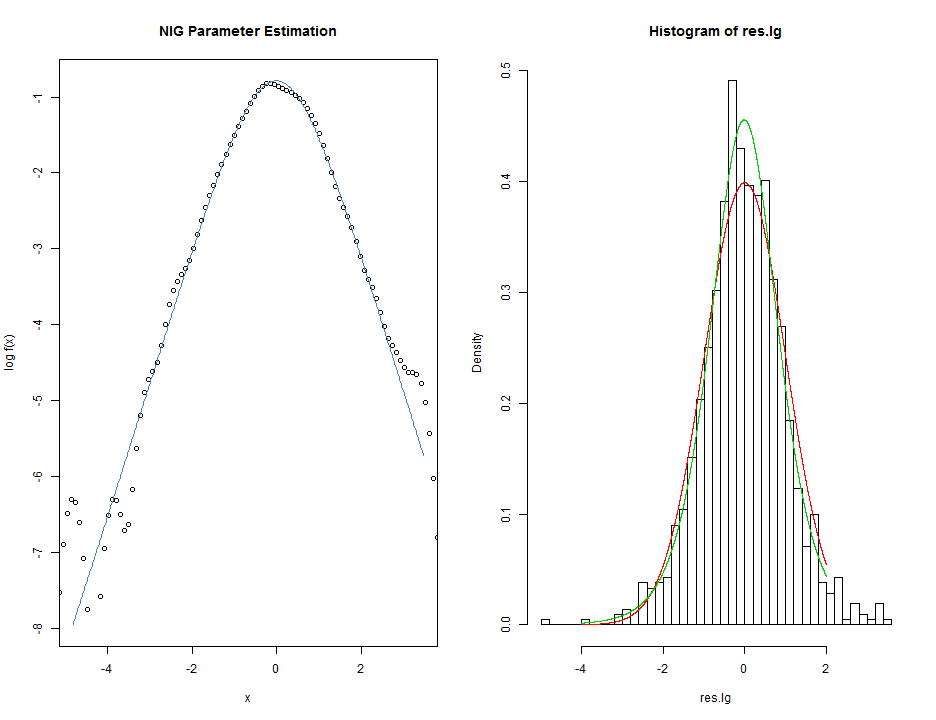 

#### 4. BMW 

```r
par(mfrow = c(1, 2))
vol.bmw <- garch(bmw.return)
```

```
## 
##  ***** ESTIMATION WITH ANALYTICAL GRADIENT ***** 
## 
## 
##      I     INITIAL X(I)        D(I)
## 
##      1     3.367436e-04     1.000e+00
##      2     5.000000e-02     1.000e+00
##      3     5.000000e-02     1.000e+00
## 
##     IT   NF      F         RELDF    PRELDF    RELDX   STPPAR   D*STEP   NPRELDF
##      0    1 -3.772e+03
##      1    8 -3.772e+03  1.16e-05  2.28e-05  4.4e-05  4.4e+09  4.4e-06  5.06e+04
##      2   16 -3.773e+03  4.54e-04  8.05e-04  3.0e-01  2.0e+00  4.5e-02  6.03e-01
##      3   19 -3.778e+03  1.31e-03  1.26e-03  6.0e-01  1.9e+00  1.8e-01  1.10e-01
##      4   21 -3.792e+03  3.74e-03  2.68e-03  4.3e-01  2.0e+00  3.6e-01  3.66e+00
##      5   23 -3.797e+03  1.15e-03  1.13e-03  5.6e-02  2.0e+00  7.2e-02  1.02e+03
##      6   36 -3.799e+03  4.46e-04  1.29e-03  1.1e-05  2.4e+00  1.4e-05  6.98e+02
##      7   37 -3.799e+03  1.50e-04  1.23e-04  9.9e-06  2.0e+00  1.4e-05  2.42e+02
##      8   38 -3.799e+03  5.93e-06  6.89e-06  1.0e-05  2.0e+00  1.4e-05  3.22e+02
##      9   46 -3.802e+03  7.42e-04  9.08e-04  3.6e-02  2.0e+00  5.0e-02  3.13e+02
##     10   52 -3.802e+03  6.54e-06  1.36e-05  6.0e-07  3.1e+01  8.6e-07  8.23e-03
##     11   53 -3.802e+03  3.69e-08  5.06e-08  6.0e-07  2.0e+00  8.6e-07  4.53e-03
##     12   62 -3.804e+03  5.62e-04  8.88e-04  3.8e-02  1.5e+00  5.6e-02  4.53e-03
##     13   64 -3.810e+03  1.68e-03  1.48e-03  2.7e-02  7.7e-02  5.6e-02  3.58e-03
##     14   66 -3.821e+03  2.77e-03  3.55e-03  4.9e-02  1.9e+00  1.1e-01  2.47e-01
##     15   67 -3.823e+03  4.64e-04  4.97e-03  4.4e-02  1.4e+00  1.1e-01  9.93e-03
##     16   69 -3.831e+03  2.02e-03  3.90e-03  9.7e-03  1.4e+00  2.6e-02  1.13e-02
##     17   75 -3.831e+03  1.63e-04  2.47e-04  2.4e-07  2.4e+01  4.5e-07  9.84e-03
##     18   76 -3.831e+03  1.10e-05  1.27e-05  2.1e-07  2.0e+00  4.5e-07  1.13e-03
##     19   77 -3.831e+03  2.37e-07  2.22e-07  2.3e-07  2.0e+00  4.5e-07  1.37e-03
##     20   85 -3.832e+03  6.16e-05  1.14e-04  2.3e-03  1.8e+00  4.5e-03  1.36e-03
##     21   87 -3.832e+03  9.93e-05  6.67e-05  2.0e-03  0.0e+00  5.2e-03  6.67e-05
##     22   88 -3.832e+03  4.13e-05  3.47e-05  2.0e-03  7.8e-03  5.2e-03  3.47e-05
##     23   89 -3.832e+03  2.70e-06  2.31e-06  5.5e-04  0.0e+00  1.5e-03  2.31e-06
##     24   90 -3.832e+03  1.15e-07  9.45e-08  1.0e-04  0.0e+00  2.6e-04  9.45e-08
##     25   91 -3.832e+03  6.83e-09  4.24e-09  5.7e-06  0.0e+00  1.2e-05  4.24e-09
##     26   92 -3.832e+03  8.76e-10  4.24e-10  3.5e-06  0.0e+00  8.8e-06  4.24e-10
##     27   93 -3.832e+03  6.69e-11  6.53e-12  8.2e-07  0.0e+00  1.9e-06  6.53e-12
##     28   94 -3.832e+03  2.66e-11  1.41e-13  5.9e-08  0.0e+00  1.2e-07  1.41e-13
##     29   95 -3.832e+03  9.85e-12  7.32e-15  3.5e-08  0.0e+00  7.1e-08  7.32e-15
##     30   96 -3.832e+03  1.65e-12  2.44e-16  8.3e-09  0.0e+00  1.9e-08  2.44e-16
##     31   97 -3.832e+03  3.84e-14  1.45e-18  4.4e-10  0.0e+00  1.1e-09  1.45e-18
##     32   98 -3.832e+03 -2.61e-15  3.33e-21  9.4e-12  0.0e+00  1.8e-11  3.33e-21
## 
##  ***** X- AND RELATIVE FUNCTION CONVERGENCE *****
## 
##  FUNCTION    -3.832060e+03   RELDX        9.434e-12
##  FUNC. EVALS      98         GRAD. EVALS      32
##  PRELDF       3.332e-21      NPRELDF      3.332e-21
## 
##      I      FINAL X(I)        D(I)          G(I)
## 
##      1    4.538729e-06     1.000e+00    -3.135e-03
##      2    4.218134e-02     1.000e+00    -1.705e-06
##      3    9.454616e-01     1.000e+00    -1.565e-06
```

```r
res.bmw <- vol.bmw$residuals[-1]
nigFit(res.bmw)
```

```
## 
##  Objective Function Value:   -1530
##  Parameter Estimates:        1 0 1 0 
## 
##  Objective Function Value:   -1530
##  Parameter Estimates:        1 0 1 0 
## 
##  Objective Function Value:   -1530
##  Parameter Estimates:        1 1.49e-08 1 0 
## 
##  Objective Function Value:   -1530
##  Parameter Estimates:        1 0 1 0 
## 
##  Objective Function Value:   -1530
##  Parameter Estimates:        1 0 1 1.49e-08 
## 
##  Objective Function Value:   -2468
##  Parameter Estimates:        0.8989 0.562 1.402 0.7159 
## 
##  Objective Function Value:   -1530
##  Parameter Estimates:        0.9899 0.0562 1.04 0.07159 
## 
##  Objective Function Value:   -1530
##  Parameter Estimates:        0.9899 0.0562 1.04 0.07159 
## 
##  Objective Function Value:   -1530
##  Parameter Estimates:        0.9899 0.05616 1.04 0.07159 
## 
##  Objective Function Value:   -1530
##  Parameter Estimates:        0.9899 0.0562 1.04 0.07159 
## 
##  Objective Function Value:   -1530
##  Parameter Estimates:        0.9899 0.0562 1.04 0.07155 
## 
##  Objective Function Value:   -1527
##  Parameter Estimates:        0.9924 0.02132 1.047 0.03651 
## 
##  Objective Function Value:   -1527
##  Parameter Estimates:        0.9924 0.02132 1.047 0.03651 
## 
##  Objective Function Value:   -1527
##  Parameter Estimates:        0.9924 0.02132 1.047 0.03651 
## 
##  Objective Function Value:   -1527
##  Parameter Estimates:        0.9924 0.02132 1.047 0.03651 
## 
##  Objective Function Value:   -1527
##  Parameter Estimates:        0.9924 0.02132 1.047 0.03651 
## 
##  Objective Function Value:   -1527
##  Parameter Estimates:        1.009 0.006531 1.092 0.03826 
## 
##  Objective Function Value:   -1527
##  Parameter Estimates:        1.008 0.006531 1.092 0.03826 
## 
##  Objective Function Value:   -1527
##  Parameter Estimates:        1.009 0.006532 1.092 0.03826 
## 
##  Objective Function Value:   -1527
##  Parameter Estimates:        1.009 0.006531 1.092 0.03826 
## 
##  Objective Function Value:   -1527
##  Parameter Estimates:        1.009 0.006531 1.092 0.03826 
## 
##  Objective Function Value:   -1527
##  Parameter Estimates:        1.009 0.006531 1.092 0.03826 
## 
##  Objective Function Value:   -1527
##  Parameter Estimates:        1.047 0.02227 1.1 0.06503 
## 
##  Objective Function Value:   -1526
##  Parameter Estimates:        1.023 0.01666 1.094 0.05239 
## 
##  Objective Function Value:   -1526
##  Parameter Estimates:        1.023 0.01666 1.094 0.05239 
## 
##  Objective Function Value:   -1526
##  Parameter Estimates:        1.023 0.01665 1.094 0.05239 
## 
##  Objective Function Value:   -1526
##  Parameter Estimates:        1.023 0.01666 1.094 0.05239 
## 
##  Objective Function Value:   -1526
##  Parameter Estimates:        1.023 0.01666 1.094 0.05239 
## 
##  Objective Function Value:   -1526
##  Parameter Estimates:        1.039 0.004626 1.1 0.04406 
## 
##  Objective Function Value:   -1526
##  Parameter Estimates:        1.039 0.004626 1.1 0.04406 
## 
##  Objective Function Value:   -1526
##  Parameter Estimates:        1.039 0.004628 1.1 0.04406 
## 
##  Objective Function Value:   -1526
##  Parameter Estimates:        1.039 0.004626 1.1 0.04406 
## 
##  Objective Function Value:   -1526
##  Parameter Estimates:        1.039 0.004626 1.1 0.04407 
## 
##  Objective Function Value:   -1526
##  Parameter Estimates:        1.078 0.008663 1.118 0.05626 
## 
##  Objective Function Value:   -1526
##  Parameter Estimates:        1.078 0.008663 1.118 0.05626 
## 
##  Objective Function Value:   -1526
##  Parameter Estimates:        1.078 0.008662 1.118 0.05626 
## 
##  Objective Function Value:   -1526
##  Parameter Estimates:        1.078 0.008663 1.118 0.05626 
## 
##  Objective Function Value:   -1526
##  Parameter Estimates:        1.078 0.008663 1.118 0.05626 
## 
##  Objective Function Value:   -1525
##  Parameter Estimates:        1.15 0.01491 1.162 0.02526 
## 
##  Objective Function Value:   -1525
##  Parameter Estimates:        1.15 0.01491 1.162 0.02526 
## 
##  Objective Function Value:   -1525
##  Parameter Estimates:        1.15 0.01492 1.162 0.02526 
## 
##  Objective Function Value:   -1525
##  Parameter Estimates:        1.15 0.01491 1.162 0.02526 
## 
##  Objective Function Value:   -1525
##  Parameter Estimates:        1.15 0.01491 1.162 0.02526 
## 
##  Objective Function Value:   -1525
##  Parameter Estimates:        1.187 0.03716 1.24 0.02541 
## 
##  Objective Function Value:   -1525
##  Parameter Estimates:        1.187 0.03716 1.24 0.02541 
## 
##  Objective Function Value:   -1525
##  Parameter Estimates:        1.187 0.03716 1.24 0.02541 
## 
##  Objective Function Value:   -1525
##  Parameter Estimates:        1.187 0.03716 1.24 0.02541 
## 
##  Objective Function Value:   -1525
##  Parameter Estimates:        1.187 0.03716 1.24 0.02541 
## 
##  Objective Function Value:   -1525
##  Parameter Estimates:        1.221 -0.02799 1.252 0.07588 
## 
##  Objective Function Value:   -1525
##  Parameter Estimates:        1.221 -0.02799 1.252 0.07588 
## 
##  Objective Function Value:   -1525
##  Parameter Estimates:        1.221 -0.02799 1.252 0.07588 
## 
##  Objective Function Value:   -1525
##  Parameter Estimates:        1.221 -0.02799 1.252 0.07588 
## 
##  Objective Function Value:   -1525
##  Parameter Estimates:        1.221 -0.02799 1.252 0.07588 
## 
##  Objective Function Value:   -1525
##  Parameter Estimates:        1.301 0.01266 1.258 0.067 
## 
##  Objective Function Value:   -1525
##  Parameter Estimates:        1.236 -0.005865 1.247 0.08358 
## 
##  Objective Function Value:   -1525
##  Parameter Estimates:        1.225 -0.02244 1.251 0.07781 
## 
##  Objective Function Value:   -1525
##  Parameter Estimates:        1.225 -0.02244 1.251 0.07781 
## 
##  Objective Function Value:   -1525
##  Parameter Estimates:        1.225 -0.02244 1.251 0.07781 
## 
##  Objective Function Value:   -1525
##  Parameter Estimates:        1.225 -0.02244 1.251 0.07781 
## 
##  Objective Function Value:   -1525
##  Parameter Estimates:        1.225 -0.02244 1.251 0.07781 
## 
##  Objective Function Value:   -1525
##  Parameter Estimates:        1.229 -0.02312 1.251 0.07202 
## 
##  Objective Function Value:   -1525
##  Parameter Estimates:        1.229 -0.02312 1.251 0.07202 
## 
##  Objective Function Value:   -1525
##  Parameter Estimates:        1.229 -0.02312 1.251 0.07202 
## 
##  Objective Function Value:   -1525
##  Parameter Estimates:        1.229 -0.02312 1.251 0.07202 
## 
##  Objective Function Value:   -1525
##  Parameter Estimates:        1.229 -0.02312 1.251 0.07202 
## 
##  Objective Function Value:   -1525
##  Parameter Estimates:        1.239 -0.01409 1.253 0.07048 
## 
##  Objective Function Value:   -1525
##  Parameter Estimates:        1.239 -0.01409 1.253 0.07048 
## 
##  Objective Function Value:   -1525
##  Parameter Estimates:        1.239 -0.01409 1.253 0.07048 
## 
##  Objective Function Value:   -1525
##  Parameter Estimates:        1.239 -0.01409 1.253 0.07048 
## 
##  Objective Function Value:   -1525
##  Parameter Estimates:        1.239 -0.01409 1.253 0.07048 
## 
##  Objective Function Value:   -1525
##  Parameter Estimates:        1.25 -0.01278 1.259 0.06362 
## 
##  Objective Function Value:   -1525
##  Parameter Estimates:        1.25 -0.01278 1.259 0.06362 
## 
##  Objective Function Value:   -1525
##  Parameter Estimates:        1.25 -0.01278 1.259 0.06362 
## 
##  Objective Function Value:   -1525
##  Parameter Estimates:        1.25 -0.01278 1.259 0.06362 
## 
##  Objective Function Value:   -1525
##  Parameter Estimates:        1.25 -0.01278 1.259 0.06362 
## 
##  Objective Function Value:   -1525
##  Parameter Estimates:        1.259 -0.009737 1.269 0.06365 
## 
##  Objective Function Value:   -1524
##  Parameter Estimates:        1.277 -0.009488 1.286 0.06135 
## 
##  Objective Function Value:   -1524
##  Parameter Estimates:        1.317 -0.004732 1.326 0.05805 
## 
##  Objective Function Value:   -1524
##  Parameter Estimates:        1.317 -0.004732 1.326 0.05805 
## 
##  Objective Function Value:   -1524
##  Parameter Estimates:        1.317 -0.004733 1.326 0.05805 
## 
##  Objective Function Value:   -1524
##  Parameter Estimates:        1.317 -0.004732 1.326 0.05805 
## 
##  Objective Function Value:   -1524
##  Parameter Estimates:        1.317 -0.004732 1.326 0.05805 
## 
##  Objective Function Value:   -1524
##  Parameter Estimates:        1.365 0.01704 1.334 0.04123 
## 
##  Objective Function Value:   -1524
##  Parameter Estimates:        1.329 0.001882 1.315 0.05634 
## 
##  Objective Function Value:   -1524
##  Parameter Estimates:        1.322 -0.002302 1.322 0.05742 
## 
##  Objective Function Value:   -1524
##  Parameter Estimates:        1.322 -0.002302 1.322 0.05742 
## 
##  Objective Function Value:   -1524
##  Parameter Estimates:        1.322 -0.002303 1.322 0.05742 
## 
##  Objective Function Value:   -1524
##  Parameter Estimates:        1.322 -0.002302 1.322 0.05742 
## 
##  Objective Function Value:   -1524
##  Parameter Estimates:        1.322 -0.002302 1.322 0.05742 
## 
##  Objective Function Value:   -1524
##  Parameter Estimates:        1.322 -0.002302 1.322 0.05742 
## 
##  Objective Function Value:   -1524
##  Parameter Estimates:        1.325 0.0008707 1.324 0.05383 
## 
##  Objective Function Value:   -1524
##  Parameter Estimates:        1.329 0.005263 1.328 0.04959 
## 
##  Objective Function Value:   -1524
##  Parameter Estimates:        1.329 0.005263 1.328 0.04959 
## 
##  Objective Function Value:   -1524
##  Parameter Estimates:        1.329 0.005265 1.328 0.04959 
## 
##  Objective Function Value:   -1524
##  Parameter Estimates:        1.329 0.005263 1.328 0.04959 
## 
##  Objective Function Value:   -1524
##  Parameter Estimates:        1.329 0.005263 1.328 0.04959 
## 
##  Objective Function Value:   -1524
##  Parameter Estimates:        1.329 0.005263 1.328 0.04959 
## 
##  Objective Function Value:   -1524
##  Parameter Estimates:        1.34 0.00286 1.336 0.05091 
## 
##  Objective Function Value:   -1524
##  Parameter Estimates:        1.34 0.00286 1.336 0.05091 
## 
##  Objective Function Value:   -1524
##  Parameter Estimates:        1.34 0.002861 1.336 0.05091 
## 
##  Objective Function Value:   -1524
##  Parameter Estimates:        1.34 0.00286 1.336 0.05091 
## 
##  Objective Function Value:   -1524
##  Parameter Estimates:        1.34 0.00286 1.336 0.05091 
## 
##  Objective Function Value:   -1524
##  Parameter Estimates:        1.34 0.00286 1.336 0.05091 
## 
##  Objective Function Value:   -1524
##  Parameter Estimates:        1.34 0.00286 1.336 0.05091 
## 
##  Objective Function Value:   -1524
##  Parameter Estimates:        1.337 0.004117 1.334 0.05014 
## 
##  Objective Function Value:   -1524
##  Parameter Estimates:        1.337 0.004117 1.334 0.05014 
## 
##  Objective Function Value:   -1524
##  Parameter Estimates:        1.337 0.004117 1.334 0.05014 
## 
##  Objective Function Value:   -1524
##  Parameter Estimates:        1.337 0.004118 1.334 0.05014 
## 
##  Objective Function Value:   -1524
##  Parameter Estimates:        1.337 0.004117 1.334 0.05014 
## 
##  Objective Function Value:   -1524
##  Parameter Estimates:        1.337 0.004117 1.334 0.05014 
## 
##  Objective Function Value:   -1524
##  Parameter Estimates:        1.337 0.004117 1.334 0.05014 
## 
##  Objective Function Value:   -1524
##  Parameter Estimates:        1.337 0.004117 1.334 0.05014 
## 
##  Objective Function Value:   -1524
##  Parameter Estimates:        1.337 0.004117 1.334 0.05014 
## 
##  Objective Function Value:   -1524
##  Parameter Estimates:        1.337 0.004143 1.334 0.05013 
## 
##  Objective Function Value:   -1524
##  Parameter Estimates:        1.337 0.004143 1.334 0.05013 
## 
##  Objective Function Value:   -1524
##  Parameter Estimates:        1.337 0.004143 1.334 0.05013 
## 
##  Objective Function Value:   -1524
##  Parameter Estimates:        1.337 0.00416 1.334 0.05013 
## 
##  Objective Function Value:   -1524
##  Parameter Estimates:        1.337 0.004126 1.334 0.05013 
## 
##  Objective Function Value:   -1524
##  Parameter Estimates:        1.337 0.004143 1.334 0.05013 
## 
##  Objective Function Value:   -1524
##  Parameter Estimates:        1.337 0.004143 1.334 0.05013 
## 
##  Objective Function Value:   -1524
##  Parameter Estimates:        1.337 0.004143 1.334 0.05014 
## 
##  Objective Function Value:   -1524
##  Parameter Estimates:        1.337 0.004143 1.334 0.05011 
## 
##  Objective Function Value:   -1524
##  Parameter Estimates:        1.337 0.004143 1.334 0.05013 
## 
##  Objective Function Value:   -1522
##  Parameter Estimates:        1.34 0.004151 1.332 0.05003
```

```
## 
## Title:
##  Normal Inverse Gaussian Parameter Estimation 
## 
## Call:
##  .nigFit.mle(x = x, alpha = alpha, beta = beta, delta = delta, 
##     mu = mu, scale = scale, doplot = doplot, span = span, trace = trace, 
##     title = title, description = description)
## 
## Model:
##  Normal Inverse Gaussian Distribution
## 
## Estimated Parameter(s):
##    alpha     beta    delta       mu 
## 1.339793 0.004151 1.331762 0.050033 
## 
## Description:
##  Sat Apr 19 00:02:59 2014 by user: user
```

```r
hist(res.bmw, prob = T, nclass = 50)
x <- seq(-4, 4, by = 0.001)
lines(x, dnorm(x), col = 2)
lines(x, dnig(x, 1.33979343, 0.00415084, 1.33176238, 0.05003278), col = 3)
```

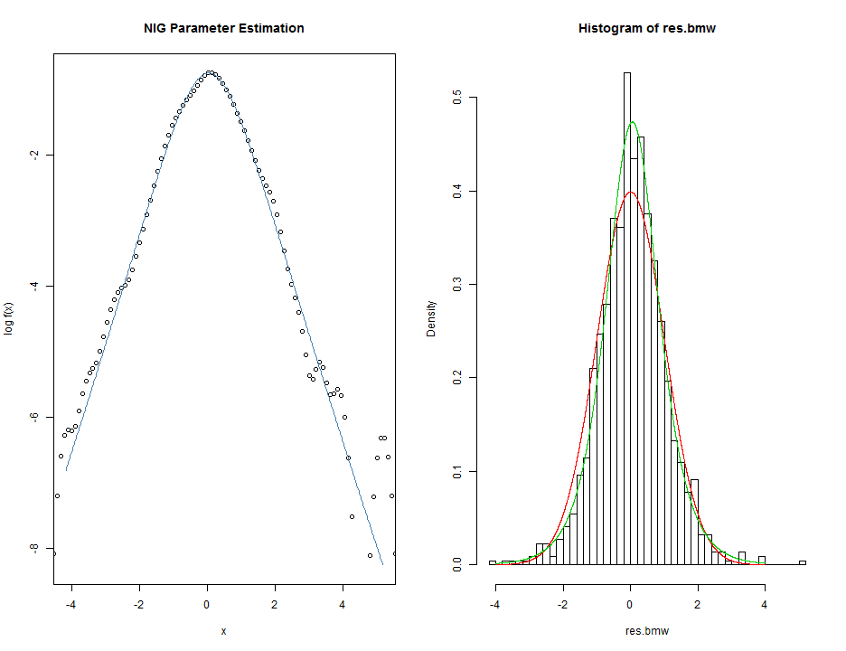 

#### 5. Apple Inc

```r
par(mfrow = c(1, 2))
vol.apple <- garch(apple.return)
```

```
## 
##  ***** ESTIMATION WITH ANALYTICAL GRADIENT ***** 
## 
## 
##      I     INITIAL X(I)        D(I)
## 
##      1     2.731625e-04     1.000e+00
##      2     5.000000e-02     1.000e+00
##      3     5.000000e-02     1.000e+00
## 
##     IT   NF      F         RELDF    PRELDF    RELDX   STPPAR   D*STEP   NPRELDF
##      0    1 -3.764e+03
##      1    8 -3.764e+03  8.74e-06  1.69e-05  3.1e-05  6.6e+09  3.1e-06  5.58e+04
##      2   16 -3.767e+03  7.33e-04  1.06e-03  3.4e-01  2.0e+00  5.1e-02  8.17e-01
##      3   19 -3.768e+03  1.96e-04  1.72e-04  6.7e-01  8.8e-01  2.0e-01  1.16e-03
##      4   21 -3.774e+03  1.69e-03  4.54e-04  4.4e-01  1.9e+00  4.1e-01  7.62e-02
##      5   23 -3.777e+03  8.66e-04  8.41e-04  5.8e-02  2.0e+00  8.2e-02  5.51e+02
##      6   25 -3.778e+03  7.93e-05  1.66e-04  1.1e-02  2.0e+00  1.6e-02  6.45e-01
##      7   26 -3.778e+03  1.77e-04  2.45e-04  1.1e-02  2.0e+00  1.6e-02  2.17e-01
##      8   27 -3.779e+03  9.33e-05  1.33e-04  1.0e-02  2.0e+00  1.6e-02  6.30e-02
##      9   29 -3.779e+03  7.41e-06  3.56e-05  3.9e-03  2.0e+00  6.3e-03  7.18e-03
##     10   30 -3.779e+03  1.69e-05  3.29e-05  3.9e-03  2.0e+00  6.3e-03  9.77e-04
##     11   33 -3.780e+03  2.34e-04  1.60e-04  2.5e-02  0.0e+00  5.0e-02  1.60e-04
##     12   35 -3.780e+03  1.42e-05  5.76e-05  3.1e-03  1.9e+00  6.2e-03  1.42e-03
##     13   36 -3.780e+03  5.07e-06  2.51e-05  2.7e-03  1.5e+00  6.2e-03  4.69e-05
##     14   37 -3.780e+03  1.80e-05  2.00e-05  3.6e-03  1.5e+00  6.2e-03  5.53e-05
##     15   38 -3.780e+03  2.61e-06  6.65e-06  6.1e-03  0.0e+00  1.1e-02  6.65e-06
##     16   39 -3.780e+03  1.63e-06  3.58e-06  2.1e-03  0.0e+00  3.7e-03  3.58e-06
##     17   40 -3.780e+03  6.24e-07  8.74e-07  7.6e-04  0.0e+00  1.6e-03  8.74e-07
##     18   41 -3.780e+03  1.45e-07  1.10e-07  6.7e-04  0.0e+00  1.3e-03  1.10e-07
##     19   54 -3.780e+03  1.95e-11  1.80e-10  3.7e-10  6.6e+00  6.4e-10  2.00e-09
##     20   67 -3.780e+03  3.61e-16  4.85e-14  1.1e-13  1.3e+04  2.0e-13  1.62e-09
##     21   70 -3.780e+03 -2.05e-15  5.88e-15  1.4e-14  1.0e+05  2.4e-14  1.62e-09
## 
##  ***** FALSE CONVERGENCE *****
## 
##  FUNCTION    -3.779829e+03   RELDX        1.388e-14
##  FUNC. EVALS      70         GRAD. EVALS      21
##  PRELDF       5.883e-15      NPRELDF      1.618e-09
## 
##      I      FINAL X(I)        D(I)          G(I)
## 
##      1    2.015615e-05     1.000e+00    -9.300e+02
##      2    7.558968e-02     1.000e+00    -2.250e-01
##      3    8.610646e-01     1.000e+00    -1.935e-01
```

```r
res.apple <- vol.apple$residuals[-1]
nigFit(res.apple)
```

```
## 
##  Objective Function Value:   -1457
##  Parameter Estimates:        1 0 1 0 
## 
##  Objective Function Value:   -1457
##  Parameter Estimates:        1 0 1 0 
## 
##  Objective Function Value:   -1457
##  Parameter Estimates:        1 1.49e-08 1 0 
## 
##  Objective Function Value:   -1457
##  Parameter Estimates:        1 0 1 0 
## 
##  Objective Function Value:   -1457
##  Parameter Estimates:        1 0 1 1.49e-08 
## 
##  Objective Function Value:   -2422
##  Parameter Estimates:        0.9918 0.5292 1.167 0.8319 
## 
##  Objective Function Value:   -1457
##  Parameter Estimates:        0.9992 0.05292 1.017 0.08319 
## 
##  Objective Function Value:   -1454
##  Parameter Estimates:        0.9996 0.0252 1.008 0.03961 
## 
##  Objective Function Value:   -1454
##  Parameter Estimates:        0.9996 0.0252 1.008 0.03961 
## 
##  Objective Function Value:   -1454
##  Parameter Estimates:        0.9996 0.02516 1.008 0.03961 
## 
##  Objective Function Value:   -1454
##  Parameter Estimates:        0.9996 0.0252 1.008 0.03961 
## 
##  Objective Function Value:   -1454
##  Parameter Estimates:        0.9996 0.0252 1.008 0.03957 
## 
##  Objective Function Value:   -1454
##  Parameter Estimates:        1.007 -0.008872 1.036 0.05549 
## 
##  Objective Function Value:   -1454
##  Parameter Estimates:        1.007 -0.008872 1.036 0.05549 
## 
##  Objective Function Value:   -1454
##  Parameter Estimates:        1.007 -0.008871 1.036 0.05549 
## 
##  Objective Function Value:   -1454
##  Parameter Estimates:        1.007 -0.008872 1.036 0.05549 
## 
##  Objective Function Value:   -1454
##  Parameter Estimates:        1.007 -0.008872 1.036 0.05549 
## 
##  Objective Function Value:   -1454
##  Parameter Estimates:        1.031 -0.005373 1.036 0.09598 
## 
##  Objective Function Value:   -1454
##  Parameter Estimates:        1.014 -0.003599 1.037 0.07222 
## 
##  Objective Function Value:   -1454
##  Parameter Estimates:        1.014 -0.003599 1.037 0.07222 
## 
##  Objective Function Value:   -1454
##  Parameter Estimates:        1.014 -0.0036 1.037 0.07222 
## 
##  Objective Function Value:   -1454
##  Parameter Estimates:        1.014 -0.003599 1.037 0.07222 
## 
##  Objective Function Value:   -1454
##  Parameter Estimates:        1.014 -0.003599 1.037 0.07222 
## 
##  Objective Function Value:   -1454
##  Parameter Estimates:        1.024 -0.01901 1.037 0.07033 
## 
##  Objective Function Value:   -1454
##  Parameter Estimates:        1.024 -0.01901 1.037 0.07033 
## 
##  Objective Function Value:   -1454
##  Parameter Estimates:        1.024 -0.01901 1.037 0.07033 
## 
##  Objective Function Value:   -1454
##  Parameter Estimates:        1.024 -0.01901 1.037 0.07033 
## 
##  Objective Function Value:   -1454
##  Parameter Estimates:        1.024 -0.01901 1.037 0.07033 
## 
##  Objective Function Value:   -1453
##  Parameter Estimates:        1.053 -0.02676 1.043 0.09312 
## 
##  Objective Function Value:   -1453
##  Parameter Estimates:        1.053 -0.02676 1.043 0.09312 
## 
##  Objective Function Value:   -1453
##  Parameter Estimates:        1.053 -0.02676 1.043 0.09312 
## 
##  Objective Function Value:   -1453
##  Parameter Estimates:        1.053 -0.02676 1.043 0.09312 
## 
##  Objective Function Value:   -1453
##  Parameter Estimates:        1.053 -0.02676 1.043 0.09312 
## 
##  Objective Function Value:   -1453
##  Parameter Estimates:        1.077 -0.03161 1.069 0.08043 
## 
##  Objective Function Value:   -1453
##  Parameter Estimates:        1.077 -0.03161 1.069 0.08043 
## 
##  Objective Function Value:   -1453
##  Parameter Estimates:        1.077 -0.0316 1.069 0.08043 
## 
##  Objective Function Value:   -1453
##  Parameter Estimates:        1.077 -0.03161 1.069 0.08043 
## 
##  Objective Function Value:   -1453
##  Parameter Estimates:        1.077 -0.03161 1.069 0.08043 
## 
##  Objective Function Value:   -1453
##  Parameter Estimates:        1.099 -0.0191 1.097 0.08437 
## 
##  Objective Function Value:   -1453
##  Parameter Estimates:        1.099 -0.0191 1.097 0.08437 
## 
##  Objective Function Value:   -1453
##  Parameter Estimates:        1.099 -0.0191 1.097 0.08437 
## 
##  Objective Function Value:   -1453
##  Parameter Estimates:        1.099 -0.0191 1.097 0.08437 
## 
##  Objective Function Value:   -1453
##  Parameter Estimates:        1.099 -0.0191 1.097 0.08437 
## 
##  Objective Function Value:   -1453
##  Parameter Estimates:        1.128 -0.0407 1.1 0.09486 
## 
##  Objective Function Value:   -1453
##  Parameter Estimates:        1.128 -0.0407 1.1 0.09486 
## 
##  Objective Function Value:   -1453
##  Parameter Estimates:        1.128 -0.0407 1.1 0.09486 
## 
##  Objective Function Value:   -1453
##  Parameter Estimates:        1.128 -0.0407 1.1 0.09486 
## 
##  Objective Function Value:   -1453
##  Parameter Estimates:        1.128 -0.0407 1.1 0.09486 
## 
##  Objective Function Value:   -1453
##  Parameter Estimates:        1.119 -0.05891 1.131 0.09904 
## 
##  Objective Function Value:   -1453
##  Parameter Estimates:        1.125 -0.04598 1.109 0.09607 
## 
##  Objective Function Value:   -1453
##  Parameter Estimates:        1.125 -0.04598 1.109 0.09607 
## 
##  Objective Function Value:   -1453
##  Parameter Estimates:        1.125 -0.04598 1.109 0.09607 
## 
##  Objective Function Value:   -1453
##  Parameter Estimates:        1.125 -0.04598 1.109 0.09607 
## 
##  Objective Function Value:   -1453
##  Parameter Estimates:        1.125 -0.04598 1.109 0.09607 
## 
##  Objective Function Value:   -1453
##  Parameter Estimates:        1.13 -0.04693 1.113 0.1053 
## 
##  Objective Function Value:   -1453
##  Parameter Estimates:        1.13 -0.04693 1.113 0.1053 
## 
##  Objective Function Value:   -1453
##  Parameter Estimates:        1.13 -0.04693 1.113 0.1053 
## 
##  Objective Function Value:   -1453
##  Parameter Estimates:        1.13 -0.04693 1.113 0.1053 
## 
##  Objective Function Value:   -1453
##  Parameter Estimates:        1.13 -0.04693 1.113 0.1053 
## 
##  Objective Function Value:   -1453
##  Parameter Estimates:        1.138 -0.04828 1.119 0.1009 
## 
##  Objective Function Value:   -1453
##  Parameter Estimates:        1.138 -0.04828 1.119 0.1009 
## 
##  Objective Function Value:   -1453
##  Parameter Estimates:        1.138 -0.04828 1.119 0.1009 
## 
##  Objective Function Value:   -1453
##  Parameter Estimates:        1.138 -0.04828 1.119 0.1009 
## 
##  Objective Function Value:   -1453
##  Parameter Estimates:        1.138 -0.04828 1.119 0.1009 
## 
##  Objective Function Value:   -1453
##  Parameter Estimates:        1.152 -0.06132 1.122 0.1115 
## 
##  Objective Function Value:   -1453
##  Parameter Estimates:        1.152 -0.06132 1.122 0.1115 
## 
##  Objective Function Value:   -1453
##  Parameter Estimates:        1.152 -0.06132 1.122 0.1115 
## 
##  Objective Function Value:   -1453
##  Parameter Estimates:        1.152 -0.06132 1.122 0.1115 
## 
##  Objective Function Value:   -1453
##  Parameter Estimates:        1.152 -0.06132 1.122 0.1115 
## 
##  Objective Function Value:   -1453
##  Parameter Estimates:        1.152 -0.06132 1.122 0.1115 
## 
##  Objective Function Value:   -1453
##  Parameter Estimates:        1.167 -0.05609 1.136 0.1096 
## 
##  Objective Function Value:   -1453
##  Parameter Estimates:        1.167 -0.05609 1.136 0.1096 
## 
##  Objective Function Value:   -1453
##  Parameter Estimates:        1.167 -0.05609 1.136 0.1096 
## 
##  Objective Function Value:   -1453
##  Parameter Estimates:        1.167 -0.05609 1.136 0.1096 
## 
##  Objective Function Value:   -1453
##  Parameter Estimates:        1.167 -0.05609 1.136 0.1096 
## 
##  Objective Function Value:   -1453
##  Parameter Estimates:        1.167 -0.05609 1.136 0.1096 
## 
##  Objective Function Value:   -1453
##  Parameter Estimates:        1.162 -0.06299 1.141 0.1144 
## 
##  Objective Function Value:   -1453
##  Parameter Estimates:        1.165 -0.05908 1.138 0.1105 
## 
##  Objective Function Value:   -1453
##  Parameter Estimates:        1.165 -0.05908 1.138 0.1105 
## 
##  Objective Function Value:   -1453
##  Parameter Estimates:        1.165 -0.05908 1.138 0.1105 
## 
##  Objective Function Value:   -1453
##  Parameter Estimates:        1.165 -0.05908 1.138 0.1105 
## 
##  Objective Function Value:   -1453
##  Parameter Estimates:        1.165 -0.05908 1.138 0.1105 
## 
##  Objective Function Value:   -1453
##  Parameter Estimates:        1.169 -0.05939 1.139 0.1096 
## 
##  Objective Function Value:   -1453
##  Parameter Estimates:        1.167 -0.05957 1.138 0.1097 
## 
##  Objective Function Value:   -1453
##  Parameter Estimates:        1.166 -0.05957 1.138 0.11 
## 
##  Objective Function Value:   -1453
##  Parameter Estimates:        1.166 -0.05932 1.138 0.1102 
## 
##  Objective Function Value:   -1453
##  Parameter Estimates:        1.166 -0.05932 1.138 0.1102 
## 
##  Objective Function Value:   -1453
##  Parameter Estimates:        1.166 -0.05932 1.138 0.1102 
## 
##  Objective Function Value:   -1453
##  Parameter Estimates:        1.166 -0.05932 1.138 0.1102 
## 
##  Objective Function Value:   -1453
##  Parameter Estimates:        1.166 -0.05932 1.138 0.1102 
## 
##  Objective Function Value:   -1453
##  Parameter Estimates:        1.166 -0.05932 1.138 0.1102 
## 
##  Objective Function Value:   -1453
##  Parameter Estimates:        1.166 -0.05932 1.138 0.1102 
## 
##  Objective Function Value:   -1453
##  Parameter Estimates:        1.166 -0.05932 1.138 0.1102 
## 
##  Objective Function Value:   -1453
##  Parameter Estimates:        1.166 -0.05916 1.138 0.1104 
## 
##  Objective Function Value:   -1453
##  Parameter Estimates:        1.166 -0.05916 1.138 0.1104 
## 
##  Objective Function Value:   -1453
##  Parameter Estimates:        1.166 -0.05916 1.138 0.1104 
## 
##  Objective Function Value:   -1453
##  Parameter Estimates:        1.166 -0.05916 1.138 0.1104 
## 
##  Objective Function Value:   -1453
##  Parameter Estimates:        1.166 -0.05916 1.138 0.1104 
## 
##  Objective Function Value:   -1453
##  Parameter Estimates:        1.166 -0.05916 1.138 0.1104 
## 
##  Objective Function Value:   -1453
##  Parameter Estimates:        1.166 -0.05916 1.138 0.1104 
## 
##  Objective Function Value:   -1453
##  Parameter Estimates:        1.166 -0.05916 1.138 0.1104 
## 
##  Objective Function Value:   -1453
##  Parameter Estimates:        1.167 -0.05926 1.138 0.1103 
## 
##  Objective Function Value:   -1453
##  Parameter Estimates:        1.167 -0.05926 1.138 0.1103 
## 
##  Objective Function Value:   -1453
##  Parameter Estimates:        1.167 -0.05926 1.138 0.1103 
## 
##  Objective Function Value:   -1453
##  Parameter Estimates:        1.167 -0.05926 1.138 0.1103 
## 
##  Objective Function Value:   -1453
##  Parameter Estimates:        1.167 -0.05926 1.138 0.1103 
## 
##  Objective Function Value:   -1453
##  Parameter Estimates:        1.167 -0.05926 1.138 0.1103 
## 
##  Objective Function Value:   -1453
##  Parameter Estimates:        1.167 -0.05926 1.138 0.1103 
## 
##  Objective Function Value:   -1453
##  Parameter Estimates:        1.167 -0.05926 1.138 0.1103 
## 
##  Objective Function Value:   -1453
##  Parameter Estimates:        1.167 -0.05926 1.138 0.1103 
## 
##  Objective Function Value:   -1453
##  Parameter Estimates:        1.168 -0.05937 1.138 0.1104 
## 
##  Objective Function Value:   -1453
##  Parameter Estimates:        1.168 -0.05937 1.138 0.1104 
## 
##  Objective Function Value:   -1453
##  Parameter Estimates:        1.168 -0.05937 1.138 0.1104 
## 
##  Objective Function Value:   -1453
##  Parameter Estimates:        1.168 -0.05936 1.138 0.1104 
## 
##  Objective Function Value:   -1453
##  Parameter Estimates:        1.168 -0.05939 1.138 0.1104 
## 
##  Objective Function Value:   -1453
##  Parameter Estimates:        1.168 -0.05937 1.138 0.1104 
## 
##  Objective Function Value:   -1453
##  Parameter Estimates:        1.168 -0.05937 1.138 0.1104 
## 
##  Objective Function Value:   -1453
##  Parameter Estimates:        1.168 -0.05937 1.138 0.1104 
## 
##  Objective Function Value:   -1453
##  Parameter Estimates:        1.168 -0.05937 1.138 0.1104 
## 
##  Objective Function Value:   -1453
##  Parameter Estimates:        1.169 -0.05952 1.139 0.1105 
## 
##  Objective Function Value:   -1453
##  Parameter Estimates:        1.169 -0.05952 1.139 0.1105 
## 
##  Objective Function Value:   -1453
##  Parameter Estimates:        1.169 -0.05952 1.139 0.1105 
## 
##  Objective Function Value:   -1453
##  Parameter Estimates:        1.169 -0.05952 1.139 0.1105 
## 
##  Objective Function Value:   -1453
##  Parameter Estimates:        1.169 -0.05953 1.139 0.1105 
## 
##  Objective Function Value:   -1453
##  Parameter Estimates:        1.169 -0.05952 1.139 0.1105 
## 
##  Objective Function Value:   -1453
##  Parameter Estimates:        1.169 -0.05952 1.139 0.1105 
## 
##  Objective Function Value:   -1453
##  Parameter Estimates:        1.169 -0.05952 1.139 0.1105 
## 
##  Objective Function Value:   -1453
##  Parameter Estimates:        1.169 -0.05952 1.139 0.1105 
## 
##  Objective Function Value:   -1453
##  Parameter Estimates:        1.169 -0.05962 1.14 0.1106 
## 
##  Objective Function Value:   -1453
##  Parameter Estimates:        1.169 -0.05962 1.14 0.1106 
## 
##  Objective Function Value:   -1453
##  Parameter Estimates:        1.169 -0.05962 1.14 0.1106 
## 
##  Objective Function Value:   -1453
##  Parameter Estimates:        1.169 -0.05961 1.14 0.1106 
## 
##  Objective Function Value:   -1453
##  Parameter Estimates:        1.169 -0.05963 1.14 0.1106 
## 
##  Objective Function Value:   -1453
##  Parameter Estimates:        1.169 -0.05962 1.14 0.1106 
## 
##  Objective Function Value:   -1453
##  Parameter Estimates:        1.169 -0.05962 1.14 0.1106 
## 
##  Objective Function Value:   -1453
##  Parameter Estimates:        1.169 -0.05962 1.14 0.1106 
## 
##  Objective Function Value:   -1453
##  Parameter Estimates:        1.169 -0.05962 1.14 0.1106 
## 
##  Objective Function Value:   -1453
##  Parameter Estimates:        1.169 -0.0596 1.14 0.1106 
## 
##  Objective Function Value:   -1453
##  Parameter Estimates:        1.169 -0.0596 1.14 0.1106 
## 
##  Objective Function Value:   -1453
##  Parameter Estimates:        1.169 -0.0596 1.14 0.1106 
## 
##  Objective Function Value:   -1453
##  Parameter Estimates:        1.169 -0.05958 1.14 0.1106 
## 
##  Objective Function Value:   -1453
##  Parameter Estimates:        1.169 -0.05962 1.14 0.1106 
## 
##  Objective Function Value:   -1453
##  Parameter Estimates:        1.169 -0.0596 1.14 0.1106 
## 
##  Objective Function Value:   -1453
##  Parameter Estimates:        1.169 -0.0596 1.14 0.1106 
## 
##  Objective Function Value:   -1453
##  Parameter Estimates:        1.169 -0.0596 1.14 0.1106 
## 
##  Objective Function Value:   -1453
##  Parameter Estimates:        1.169 -0.0596 1.14 0.1106 
## 
##  Objective Function Value:   -1453
##  Parameter Estimates:        1.169 -0.0596 1.14 0.1106 
## 
##  Objective Function Value:   -1452
##  Parameter Estimates:        1.17 -0.05964 1.139 0.1105
```

```
## 
## Title:
##  Normal Inverse Gaussian Parameter Estimation 
## 
## Call:
##  .nigFit.mle(x = x, alpha = alpha, beta = beta, delta = delta, 
##     mu = mu, scale = scale, doplot = doplot, span = span, trace = trace, 
##     title = title, description = description)
## 
## Model:
##  Normal Inverse Gaussian Distribution
## 
## Estimated Parameter(s):
##    alpha     beta    delta       mu 
##  1.17007 -0.05964  1.13888  0.11049 
## 
## Description:
##  Sat Apr 19 00:03:00 2014 by user: user
```

```r
hist(res.apple, prob = T, nclass = 50)
x <- seq(-6, 4, by = 0.001)
lines(x, dnorm(x), col = 2)
lines(x, dnig(x, 1.17006981, -0.05964409, 1.13887513, 0.11048502), col = 3)
```

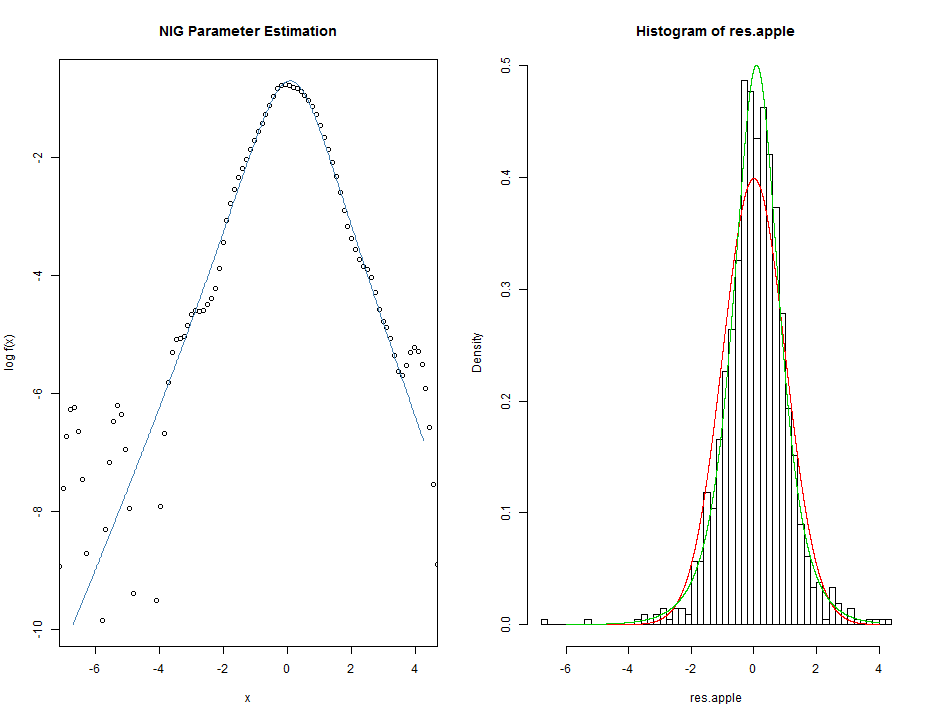 

#### Summary interpretation
5개의 자료 모두 GARCH(1,1) 모형을 통해서 얻어진 잔차의 분포를 정규분포로 가정하기에는 무리가 있음을 알 수 있다. 대신 Normal Inverse Gaussian Distribution을 이용하여 적합시켰을 경우에는 적합도가 상당히 좋아지는 것을 히스토그램과 그래프를 통하여 알 수 있다.

## Time varying VaR (시간에 따라 변하는 Value-at-Risk)
#### P(r(t) <= x ) = 0.01 (Value-at-Risk)
#### P(sigma(t)*e(t) <= sigma(t)*y ) = 0.01 (Find y!!)
#### epsilon(t)의 분포는 고정되어있다고 가정하고 sigma(t)는 시간에 따라 변하고 있다고 가정하게 되면 epsilon(t)의 분포를 통해 얻어지는 VaR의 값에 GARCH 모형을 통해 적합된 변동성(volatility)의 값을 곱하여 시간에 따라 변하는 Value-at-Risk를 얻어낼 수 있다.

### Time varying VaR

#### 1. Samsung eletronics

```r
par(mfrow = c(1, 1))
q.05 <- qnig(0.05, 1.598189, 0.1320987, 1.5978737, -0.1163623)
q.01 <- qnig(0.01, 1.598189, 0.1320987, 1.5978737, -0.1163623)
q.005 <- qnig(0.005, 1.598189, 0.1320987, 1.5978737, -0.1163623)
sigma.t <- vol.samsung$fitted.values[-1, 1]
VaR.95 <- sigma.t * q.05
VaR.99 <- sigma.t * q.01
VaR.995 <- sigma.t * q.005
n <- length(samsung.return)
plot(samsung.return, type = "l", ylim = c(-0.15, 0.15))
lines(2:n, VaR.95, col = 2)
lines(2:n, VaR.99, col = 3)
lines(2:n, VaR.995, col = 4)
legend("topleft", c("95% VaR", "99% VaR", "99.5% VaR"), lty = rep(1, 3), col = c(2, 
    3, 4))
```

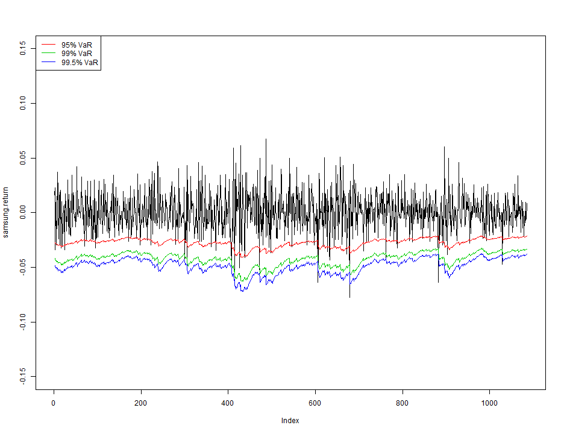 

#### 2. KT corporation

```r
par(mfrow = c(1, 1))
q.05 <- qnig(0.05, 0.97230521, -0.02994705, 0.97445152, 0.01132703)
q.01 <- qnig(0.01, 0.97230521, -0.02994705, 0.97445152, 0.01132703)
q.005 <- qnig(0.005, 0.97230521, -0.02994705, 0.97445152, 0.01132703)
sigma.t <- vol.kt$fitted.values[-1, 1]
VaR.95 <- sigma.t * q.05
VaR.99 <- sigma.t * q.01
VaR.995 <- sigma.t * q.005
n <- length(kt.return)
plot(kt.return, type = "l", ylim = c(-0.15, 0.15))
lines(2:n, VaR.95, col = 2)
lines(2:n, VaR.99, col = 3)
lines(2:n, VaR.995, col = 4)
legend("topleft", c("95% VaR", "99% VaR", "99.5% VaR"), lty = rep(1, 3), col = c(2, 
    3, 4))
```

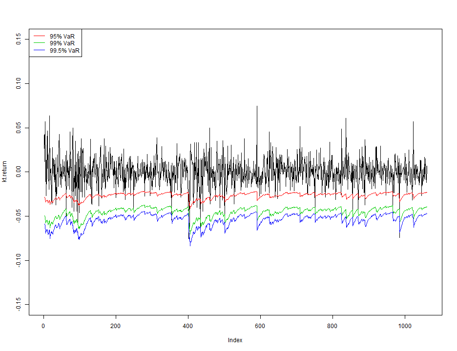 

#### 3. LG Display Co. Ltd

```r
par(mfrow = c(1, 1))
q.05 <- qnig(0.05, 1.5258037, -0.01264153, 1.53086941, -0.00903504)
q.01 <- qnig(0.01, 1.5258037, -0.01264153, 1.53086941, -0.00903504)
q.005 <- qnig(0.005, 1.5258037, -0.01264153, 1.53086941, -0.00903504)
sigma.t <- vol.lg$fitted.values[-1, 1]
VaR.95 <- sigma.t * q.05
VaR.99 <- sigma.t * q.01
VaR.995 <- sigma.t * q.005
n <- length(lg.return)
plot(lg.return, type = "l", ylim = c(-0.15, 0.15))
lines(2:n, VaR.95, col = 2)
lines(2:n, VaR.99, col = 3)
lines(2:n, VaR.995, col = 4)
legend("topleft", c("95% VaR", "99% VaR", "99.5% VaR"), lty = rep(1, 3), col = c(2, 
    3, 4))
```

 

#### 4. BMW

```r
par(mfrow = c(1, 1))
q.05 <- qnig(0.05, 1.33979343, 0.00415084, 1.33176238, 0.05003278)
q.01 <- qnig(0.01, 1.33979343, 0.00415084, 1.33176238, 0.05003278)
q.005 <- qnig(0.005, 1.33979343, 0.00415084, 1.33176238, 0.05003278)
sigma.t <- vol.bmw$fitted.values[-1, 1]
VaR.95 <- sigma.t * q.05
VaR.99 <- sigma.t * q.01
VaR.995 <- sigma.t * q.005
n <- length(bmw.return)
plot(bmw.return, type = "l", ylim = c(-0.15, 0.15))
lines(2:n, VaR.95, col = 2)
lines(2:n, VaR.99, col = 3)
lines(2:n, VaR.995, col = 4)
legend("topleft", c("95% VaR", "99% VaR", "99.5% VaR"), lty = rep(1, 3), col = c(2, 
    3, 4))
```

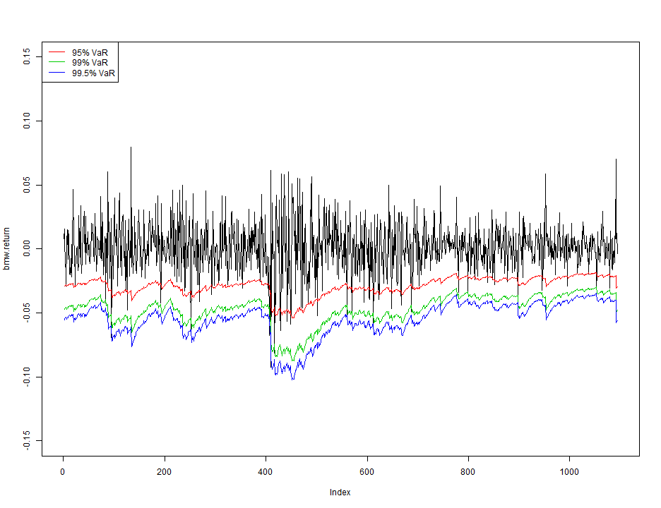 

#### 5. Apple Inc

```r
par(mfrow = c(1, 1))
q.05 <- qnig(0.05, 1.17006981, -0.05964409, 1.13887513, 0.11048502)
q.01 <- qnig(0.01, 1.17006981, -0.05964409, 1.13887513, 0.11048502)
q.005 <- qnig(0.005, 1.17006981, -0.05964409, 1.13887513, 0.11048502)
sigma.t <- vol.apple$fitted.values[-1, 1]
VaR.95 <- sigma.t * q.05
VaR.99 <- sigma.t * q.01
VaR.995 <- sigma.t * q.005
n <- length(apple.return)
plot(apple.return, type = "l", ylim = c(-0.15, 0.15))
lines(2:n, VaR.95, col = 2)
lines(2:n, VaR.99, col = 3)
lines(2:n, VaR.995, col = 4)
legend("topleft", c("95% VaR", "99% VaR", "99.5% VaR"), lty = rep(1, 3), col = c(2, 
    3, 4))
```

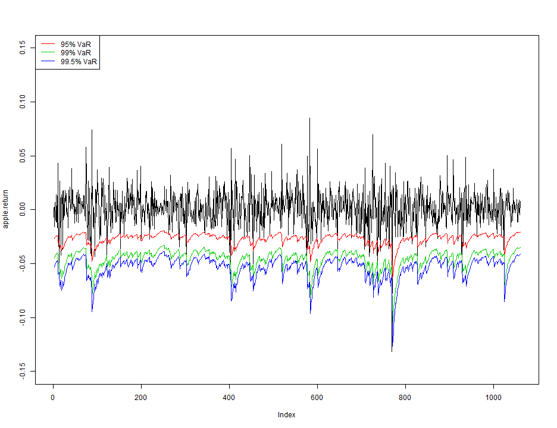 

#### Summary interpretation
그래프에서 빨간색선은 95% VaR, 녹색선은 99% VaR, 그리고 파란색선은 99.5% VaR를 나타낸다. 이는 수익률에 해당하는 검정색 그래프가 빨간색선 아래쪽으로 1000번 중 50번, 녹색선 아래로 10번, 그리고 파란색선 아래로 5번 정도 내려간다는 것을 의미한다. 실제 위에 있는 5개의 그래프를 보면 평균적으로 이러한 형태를 보이고 있다.

### 정확도 확인

#### 1. Samsung eletronics

```r
q.05 <- qnig(0.05, 1.598189, 0.1320987, 1.5978737, -0.1163623)
q.01 <- qnig(0.01, 1.598189, 0.1320987, 1.5978737, -0.1163623)
q.005 <- qnig(0.005, 1.598189, 0.1320987, 1.5978737, -0.1163623)
sigma.t <- vol.samsung$fitted.values[-1, 1]
VaR.N95 <- sigma.t * qnorm(0.05)
VaR.N99 <- sigma.t * qnorm(0.01)
VaR.N995 <- sigma.t * qnorm(0.005)
VaR.95 <- sigma.t * q.05
VaR.99 <- sigma.t * q.01
VaR.995 <- sigma.t * q.005
print(c(abs(0.05 - mean(samsung.return[-1] < VaR.N95)), abs(0.05 - mean(samsung.return[-1] < 
    VaR.95))))
```

```
## [1] 0.003875 0.003506
```

```r
print(c(abs(0.01 - mean(samsung.return[-1] < VaR.N99)), abs(0.01 - mean(samsung.return[-1] < 
    VaR.99))))
```

```
## [1] 0.0001476 0.0001476
```

```r
print(c(abs(0.005 - mean(samsung.return[-1] < VaR.N995)), abs(0.005 - mean(samsung.return[-1] < 
    VaR.995))))
```

```
## [1] 0.00238 0.00131
```

#### 2. KT corporation

```r
q.05 <- qnig(0.05, 0.97230521, -0.02994705, 0.97445152, 0.01132703)
q.01 <- qnig(0.01, 0.97230521, -0.02994705, 0.97445152, 0.01132703)
q.005 <- qnig(0.005, 0.97230521, -0.02994705, 0.97445152, 0.01132703)
sigma.t <- vol.kt$fitted.values[-1, 1]
VaR.N95 <- sigma.t * qnorm(0.05)
VaR.N99 <- sigma.t * qnorm(0.01)
VaR.N995 <- sigma.t * qnorm(0.005)
VaR.95 <- sigma.t * q.05
VaR.99 <- sigma.t * q.01
VaR.995 <- sigma.t * q.005
print(c(abs(0.05 - mean(kt.return[-1] < VaR.N95)), abs(0.05 - mean(kt.return[-1] < 
    VaR.95))))
```

```
## [1] 0.0009434 0.0000000
```

```r
print(c(abs(0.01 - mean(kt.return[-1] < VaR.N99)), abs(0.01 - mean(kt.return[-1] < 
    VaR.99))))
```

```
## [1] 0.007925 0.003208
```

```r
print(c(abs(0.005 - mean(kt.return[-1] < VaR.N995)), abs(0.005 - mean(kt.return[-1] < 
    VaR.995))))
```

```
## [1] 0.010094 0.002547
```

#### 3. LG Display Co. Ltd

```r
q.05 <- qnig(0.05, 1.5258037, -0.01264153, 1.53086941, -0.00903504)
q.01 <- qnig(0.01, 1.5258037, -0.01264153, 1.53086941, -0.00903504)
q.005 <- qnig(0.005, 1.5258037, -0.01264153, 1.53086941, -0.00903504)
sigma.t <- vol.lg$fitted.values[-1, 1]
VaR.N95 <- sigma.t * qnorm(0.05)
VaR.N99 <- sigma.t * qnorm(0.01)
VaR.N995 <- sigma.t * qnorm(0.005)
VaR.95 <- sigma.t * q.05
VaR.99 <- sigma.t * q.01
VaR.995 <- sigma.t * q.005
print(c(abs(0.05 - mean(lg.return[-1] < VaR.N95)), abs(0.05 - mean(lg.return[-1] < 
    VaR.95))))
```

```
## [1] 0.00288 0.00288
```

```r
print(c(abs(0.01 - mean(lg.return[-1] < VaR.N99)), abs(0.01 - mean(lg.return[-1] < 
    VaR.99))))
```

```
## [1] 0.007941 0.002446
```

```r
print(c(abs(0.005 - mean(lg.return[-1] < VaR.N995)), abs(0.005 - mean(lg.return[-1] < 
    VaR.995))))
```

```
## [1] 0.002554 0.001223
```

#### 4. BMW

```r
q.05 <- qnig(0.05, 1.33979343, 0.00415084, 1.33176238, 0.05003278)
q.01 <- qnig(0.01, 1.33979343, 0.00415084, 1.33176238, 0.05003278)
q.005 <- qnig(0.005, 1.33979343, 0.00415084, 1.33176238, 0.05003278)
sigma.t <- vol.bmw$fitted.values[-1, 1]
VaR.N95 <- sigma.t * qnorm(0.05)
VaR.N99 <- sigma.t * qnorm(0.01)
VaR.N995 <- sigma.t * qnorm(0.005)
VaR.95 <- sigma.t * q.05
VaR.99 <- sigma.t * q.01
VaR.995 <- sigma.t * q.005
print(c(abs(0.05 - mean(bmw.return[-1] < VaR.N95)), abs(0.05 - mean(bmw.return[-1] < 
    VaR.95))))
```

```
## [1] 0.011574 0.004254
```

```r
print(c(abs(0.01 - mean(bmw.return[-1] < VaR.N99)), abs(0.01 - mean(bmw.return[-1] < 
    VaR.99))))
```

```
## [1] 0.005554 0.000979
```

```r
print(c(abs(0.005 - mean(bmw.return[-1] < VaR.N995)), abs(0.005 - mean(bmw.return[-1] < 
    VaR.995))))
```

```
## [1] 0.005979 0.001404
```

#### 5. Apple Inc

```r
q.05 <- qnig(0.05, 1.17006981, -0.05964409, 1.13887513, 0.11048502)
q.01 <- qnig(0.01, 1.17006981, -0.05964409, 1.13887513, 0.11048502)
q.005 <- qnig(0.005, 1.17006981, -0.05964409, 1.13887513, 0.11048502)
sigma.t <- vol.apple$fitted.values[-1, 1]
VaR.N95 <- sigma.t * qnorm(0.05)
VaR.N99 <- sigma.t * qnorm(0.01)
VaR.N995 <- sigma.t * qnorm(0.005)
VaR.95 <- sigma.t * q.05
VaR.99 <- sigma.t * q.01
VaR.995 <- sigma.t * q.005
print(c(abs(0.05 - mean(apple.return[-1] < VaR.N95)), abs(0.05 - mean(apple.return[-1] < 
    VaR.95))))
```

```
## [1] 0.012229 0.004674
```

```r
print(c(abs(0.01 - mean(apple.return[-1] < VaR.N99)), abs(0.01 - mean(apple.return[-1] < 
    VaR.99))))
```

```
## [1] 0.0041643 0.0003872
```

```r
print(c(abs(0.005 - mean(apple.return[-1] < VaR.N995)), abs(0.005 - mean(apple.return[-1] < 
    VaR.995))))
```

```
## [1] 0.0053872 0.0006657
```

#### Summary interpretation
위에 있는 내용은 분포를 가정해서 얻어진 위험성과 실제 우리가 얻고자 기대하는 위험성 간의 차이를 비교해본 것이다. 값이 더 클수록 위험성을 부정확하게 측정했다고 판단하면 된다. 결과를 보면 전반적으로 정규분포를 가정했을 때보다 Normal Inverse Gaussian Distribution을 가정했을 경우에 위험성이 더 정확하게 측정되고 있음을 알 수 있다. 일반적으로 정규분포는 수익률의 위험성을 과소평가하는 경향이 있다는 것도 참고적으로 남겨둔다.

## Backtest VaR (Value-at-Risk를 평가하는 방법)

### N : number of 100*(1-p)% VaR violations
### T : total number of observations
### H0 : N ~ B(T,p) vs H1 : not H0
### LRT statistic = - 2*log{((1-p)^(T-N))*((p)^(N))} + 2*log{((1-N/T)^(T-N))*((N/T)^(N))}
### -->d(Convergence in distribution) 
### Chi-square distribution with df=1 under H0
### (LRT statistic = -2*log(L0/L))
### p-value의 값이 유의수준 0.05보다 큰 값을 가지는 경우
### 수익률에 대한 분포의 가정이 올바르게 되었다고 판단.

### 가설검정을 위한 함수 작성

```r
backtest.VaR <- function(N.violations, N.total, p) {
    p.hat <- N.violations/N.total
    LR <- -2 * log((1 - p)^(N.total - N.violations) * p^N.violations) + 2 * 
        log((1 - p.hat)^(N.total - N.violations) * p.hat^N.violations)
    p.value <- 1 - pchisq(LR, 1)
    return(list(excess.prob = p.hat, LR = LR, p.value = p.value))
}
```


### NIG Assumption

#### 1. Samsung eletronics

```r
q.05 <- qnig(0.05, 1.598189, 0.1320987, 1.5978737, -0.1163623)
q.01 <- qnig(0.01, 1.598189, 0.1320987, 1.5978737, -0.1163623)
q.005 <- qnig(0.005, 1.598189, 0.1320987, 1.5978737, -0.1163623)
sigma.t <- vol.samsung$fitted.values[-1, 1]
VaR.95 <- sigma.t * q.05
VaR.99 <- sigma.t * q.01
VaR.995 <- sigma.t * q.005
backtest.VaR(sum(samsung.return[-1] < VaR.95), length(samsung.return[-1]), 0.05)
```

```
## $excess.prob
## [1] 0.05351
## 
## $LR
## [1] 0.2744
## 
## $p.value
## [1] 0.6004
```

```r
backtest.VaR(sum(samsung.return[-1] < VaR.99), length(samsung.return[-1]), 0.01)
```

```
## $excess.prob
## [1] 0.01015
## 
## $LR
## [1] 0.002374
## 
## $p.value
## [1] 0.9611
```

```r
backtest.VaR(sum(samsung.return[-1] < VaR.995), length(samsung.return[-1]), 
    0.005)
```

```
## $excess.prob
## [1] 0.00369
## 
## $LR
## [1] 0.4115
## 
## $p.value
## [1] 0.5212
```

#### 2. KT corporation

```r
q.05 <- qnig(0.05, 0.97230521, -0.02994705, 0.97445152, 0.01132703)
q.01 <- qnig(0.01, 0.97230521, -0.02994705, 0.97445152, 0.01132703)
q.005 <- qnig(0.005, 0.97230521, -0.02994705, 0.97445152, 0.01132703)
sigma.t <- vol.kt$fitted.values[-1, 1]
VaR.95 <- sigma.t * q.05
VaR.99 <- sigma.t * q.01
VaR.995 <- sigma.t * q.005
backtest.VaR(sum(kt.return[-1] < VaR.95), length(kt.return[-1]), 0.05)
```

```
## $excess.prob
## [1] 0.05
## 
## $LR
## [1] 0
## 
## $p.value
## [1] 1
```

```r
backtest.VaR(sum(kt.return[-1] < VaR.99), length(kt.return[-1]), 0.01)
```

```
## $excess.prob
## [1] 0.01321
## 
## $LR
## [1] 1.001
## 
## $p.value
## [1] 0.3171
```

```r
backtest.VaR(sum(kt.return[-1] < VaR.995), length(kt.return[-1]), 0.005)
```

```
## $excess.prob
## [1] 0.007547
## 
## $LR
## [1] 1.195
## 
## $p.value
## [1] 0.2744
```

#### 3. LG Display Co. Ltd 

```r
q.05 <- qnig(0.05, 1.5258037, -0.01264153, 1.53086941, -0.00903504)
q.01 <- qnig(0.01, 1.5258037, -0.01264153, 1.53086941, -0.00903504)
q.005 <- qnig(0.005, 1.5258037, -0.01264153, 1.53086941, -0.00903504)
sigma.t <- vol.lg$fitted.values[-1, 1]
VaR.95 <- sigma.t * q.05
VaR.99 <- sigma.t * q.01
VaR.995 <- sigma.t * q.005
backtest.VaR(sum(lg.return[-1] < VaR.95), length(lg.return[-1]), 0.05)
```

```
## $excess.prob
## [1] 0.05288
## 
## $LR
## [1] 0.1817
## 
## $p.value
## [1] 0.6699
```

```r
backtest.VaR(sum(lg.return[-1] < VaR.99), length(lg.return[-1]), 0.01)
```

```
## $excess.prob
## [1] 0.007554
## 
## $LR
## [1] 0.6989
## 
## $p.value
## [1] 0.4032
```

```r
backtest.VaR(sum(lg.return[-1] < VaR.995), length(lg.return[-1]), 0.005)
```

```
## $excess.prob
## [1] 0.003777
## 
## $LR
## [1] 0.3478
## 
## $p.value
## [1] 0.5553
```

#### 4. BMW

```r
q.05 <- qnig(0.05, 1.33979343, 0.00415084, 1.33176238, 0.05003278)
q.01 <- qnig(0.01, 1.33979343, 0.00415084, 1.33176238, 0.05003278)
q.005 <- qnig(0.005, 1.33979343, 0.00415084, 1.33176238, 0.05003278)
sigma.t <- vol.bmw$fitted.values[-1, 1]
VaR.95 <- sigma.t * q.05
VaR.99 <- sigma.t * q.01
VaR.995 <- sigma.t * q.005
backtest.VaR(sum(bmw.return[-1] < VaR.95), length(bmw.return[-1]), 0.05)
```

```
## $excess.prob
## [1] 0.04575
## 
## $LR
## [1] 0.4282
## 
## $p.value
## [1] 0.5129
```

```r
backtest.VaR(sum(bmw.return[-1] < VaR.99), length(bmw.return[-1]), 0.01)
```

```
## $excess.prob
## [1] 0.01098
## 
## $LR
## [1] 0.1025
## 
## $p.value
## [1] 0.7488
```

```r
backtest.VaR(sum(bmw.return[-1] < VaR.995), length(bmw.return[-1]), 0.005)
```

```
## $excess.prob
## [1] 0.006404
## 
## $LR
## [1] 0.3978
## 
## $p.value
## [1] 0.5282
```

#### 5. Apple Inc 

```r
q.05 <- qnig(0.05, 1.17006981, -0.05964409, 1.13887513, 0.11048502)
q.01 <- qnig(0.01, 1.17006981, -0.05964409, 1.13887513, 0.11048502)
q.005 <- qnig(0.005, 1.17006981, -0.05964409, 1.13887513, 0.11048502)
sigma.t <- vol.apple$fitted.values[-1, 1]
VaR.95 <- sigma.t * q.05
VaR.99 <- sigma.t * q.01
VaR.995 <- sigma.t * q.005
backtest.VaR(sum(apple.return[-1] < VaR.95), length(apple.return[-1]), 0.05)
```

```
## $excess.prob
## [1] 0.04533
## 
## $LR
## [1] 0.5022
## 
## $p.value
## [1] 0.4785
```

```r
backtest.VaR(sum(apple.return[-1] < VaR.99), length(apple.return[-1]), 0.01)
```

```
## $excess.prob
## [1] 0.01039
## 
## $LR
## [1] 0.01583
## 
## $p.value
## [1] 0.8999
```

```r
backtest.VaR(sum(apple.return[-1] < VaR.995), length(apple.return[-1]), 0.005)
```

```
## $excess.prob
## [1] 0.005666
## 
## $LR
## [1] 0.09043
## 
## $p.value
## [1] 0.7636
```

#### Summary interpretation
95% VaR, 99% VaR, 그리고 99.5% VaR 모두 p-value의 값이 0.05보다 큰 값을 나타내고 있다. 따라서 분포의 가정이 올바르다는 귀무가설을 기각하지 못하게 된다. 그러므로 수익률을 분석할 때 Normal Inverse Gaussian Distribution을 가정하는 것이 타당하다고 말할 수 있겠다. 

### Normality Assumption

#### 1. Samsung eletronics

```r
sigma.t <- vol.samsung$fitted.values[-1, 1]
VaR.N95 <- sigma.t * qnorm(0.05)
VaR.N99 <- sigma.t * qnorm(0.01)
VaR.N995 <- sigma.t * qnorm(0.005)
backtest.VaR(sum(samsung.return[-1] < VaR.N95), length(samsung.return[-1]), 
    0.05)
```

```
## $excess.prob
## [1] 0.04613
## 
## $LR
## [1] 0.3513
## 
## $p.value
## [1] 0.5534
```

```r
backtest.VaR(sum(samsung.return[-1] < VaR.N99), length(samsung.return[-1]), 
    0.01)
```

```
## $excess.prob
## [1] 0.01015
## 
## $LR
## [1] 0.002374
## 
## $p.value
## [1] 0.9611
```

```r
backtest.VaR(sum(samsung.return[-1] < VaR.N995), length(samsung.return[-1]), 
    0.005)
```

```
## $excess.prob
## [1] 0.00738
## 
## $LR
## [1] 1.076
## 
## $p.value
## [1] 0.2997
```

#### 2. KT corporation

```r
sigma.t <- vol.kt$fitted.values[-1, 1]
VaR.N95 <- sigma.t * qnorm(0.05)
VaR.N99 <- sigma.t * qnorm(0.01)
VaR.N995 <- sigma.t * qnorm(0.005)
backtest.VaR(sum(kt.return[-1] < VaR.N95), length(kt.return[-1]), 0.05)
```

```
## $excess.prob
## [1] 0.04906
## 
## $LR
## [1] 0.01998
## 
## $p.value
## [1] 0.8876
```

```r
backtest.VaR(sum(kt.return[-1] < VaR.N99), length(kt.return[-1]), 0.01)
```

```
## $excess.prob
## [1] 0.01792
## 
## $LR
## [1] 5.444
## 
## $p.value
## [1] 0.01964
```

```r
backtest.VaR(sum(kt.return[-1] < VaR.N995), length(kt.return[-1]), 0.005)
```

```
## $excess.prob
## [1] 0.01509
## 
## $LR
## [1] 14.07
## 
## $p.value
## [1] 0.0001766
```

#### 3. LG Display Co. Ltd 

```r
sigma.t <- vol.lg$fitted.values[-1, 1]
VaR.N95 <- sigma.t * qnorm(0.05)
VaR.N99 <- sigma.t * qnorm(0.01)
VaR.N995 <- sigma.t * qnorm(0.005)
backtest.VaR(sum(lg.return[-1] < VaR.N95), length(lg.return[-1]), 0.05)
```

```
## $excess.prob
## [1] 0.05288
## 
## $LR
## [1] 0.1817
## 
## $p.value
## [1] 0.6699
```

```r
backtest.VaR(sum(lg.return[-1] < VaR.N99), length(lg.return[-1]), 0.01)
```

```
## $excess.prob
## [1] 0.01794
## 
## $LR
## [1] 5.46
## 
## $p.value
## [1] 0.01946
```

```r
backtest.VaR(sum(lg.return[-1] < VaR.N995), length(lg.return[-1]), 0.005)
```

```
## $excess.prob
## [1] 0.007554
## 
## $LR
## [1] 1.2
## 
## $p.value
## [1] 0.2734
```

#### 4. BMW

```r
sigma.t <- vol.bmw$fitted.values[-1, 1]
VaR.N95 <- sigma.t * qnorm(0.05)
VaR.N99 <- sigma.t * qnorm(0.01)
VaR.N995 <- sigma.t * qnorm(0.005)
backtest.VaR(sum(bmw.return[-1] < VaR.N95), length(bmw.return[-1]), 0.05)
```

```
## $excess.prob
## [1] 0.03843
## 
## $LR
## [1] 3.338
## 
## $p.value
## [1] 0.0677
```

```r
backtest.VaR(sum(bmw.return[-1] < VaR.N99), length(bmw.return[-1]), 0.01)
```

```
## $excess.prob
## [1] 0.01555
## 
## $LR
## [1] 2.912
## 
## $p.value
## [1] 0.08792
```

```r
backtest.VaR(sum(bmw.return[-1] < VaR.N995), length(bmw.return[-1]), 0.005)
```

```
## $excess.prob
## [1] 0.01098
## 
## $LR
## [1] 5.846
## 
## $p.value
## [1] 0.01561
```

#### 5. Apple Inc 

```r
sigma.t <- vol.apple$fitted.values[-1, 1]
VaR.N95 <- sigma.t * qnorm(0.05)
VaR.N99 <- sigma.t * qnorm(0.01)
VaR.N995 <- sigma.t * qnorm(0.005)
backtest.VaR(sum(apple.return[-1] < VaR.N95), length(apple.return[-1]), 0.05)
```

```
## $excess.prob
## [1] 0.03777
## 
## $LR
## [1] 3.628
## 
## $p.value
## [1] 0.0568
```

```r
backtest.VaR(sum(apple.return[-1] < VaR.N99), length(apple.return[-1]), 0.01)
```

```
## $excess.prob
## [1] 0.01416
## 
## $LR
## [1] 1.643
## 
## $p.value
## [1] 0.1999
```

```r
backtest.VaR(sum(apple.return[-1] < VaR.N995), length(apple.return[-1]), 0.005)
```

```
## $excess.prob
## [1] 0.01039
## 
## $LR
## [1] 4.706
## 
## $p.value
## [1] 0.03006
```

#### Summary interpretation
주어진 결과를 보면 p-value의 값이 0.05보다 큰 경우도 있지만 그렇지 않은 경우가 더 많다. 이 말은 수익률에 관해 정규분포를 가정할 경우 문제가 있을 수 있다는 이야기이다. 결국 수익률을 분석할 때 정규분포를 가정하는 것은 잘못된 방법이라고 할 수 있겠다.
